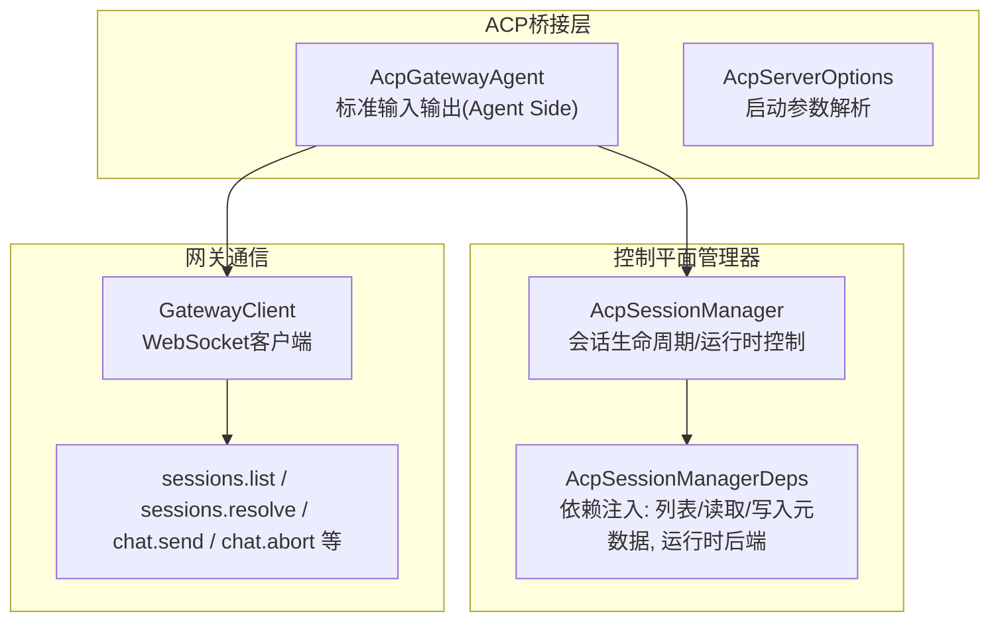
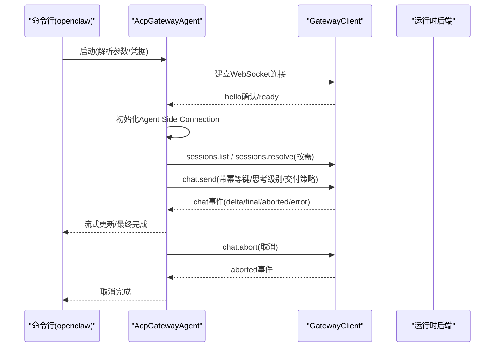
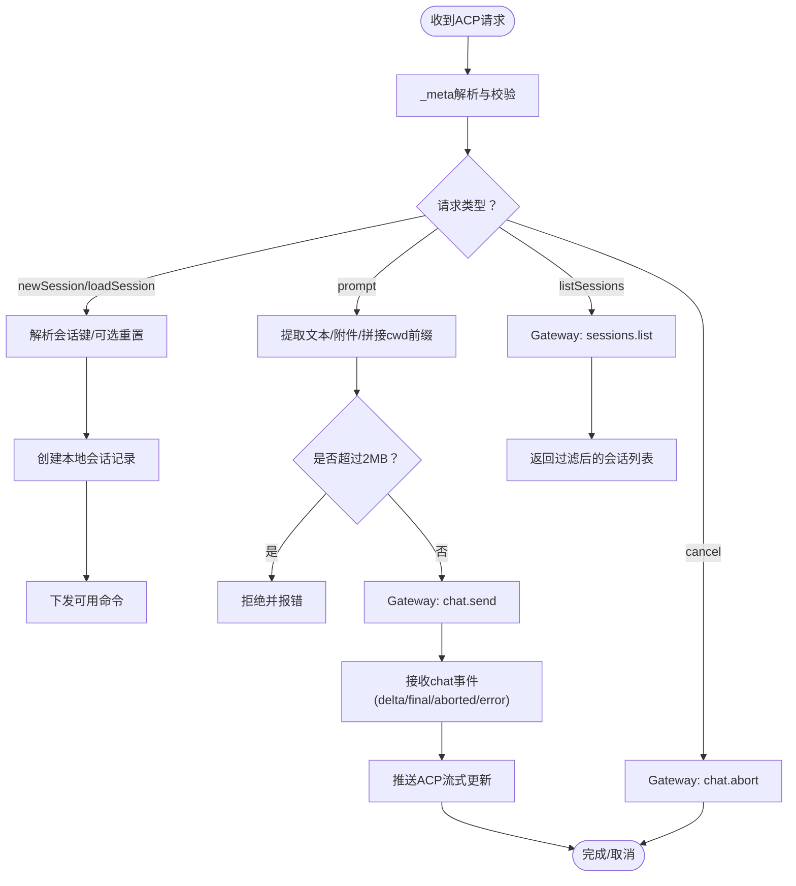
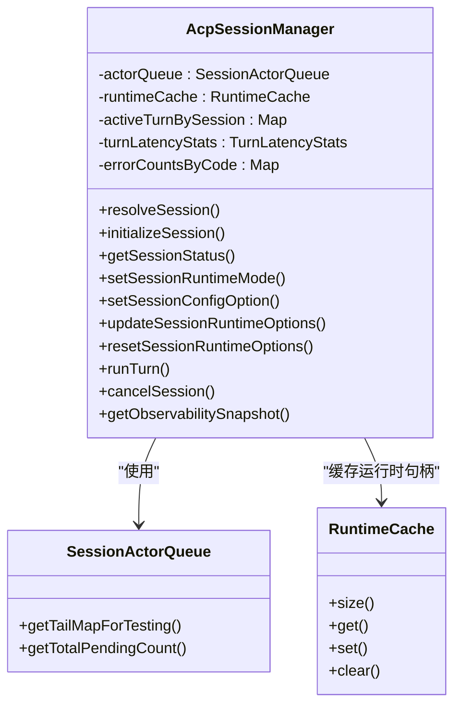
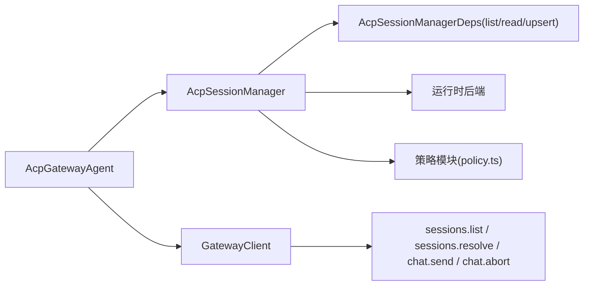

# 控制平面

<cite>
**本文引用的文件**
- [docs.acp.md](file://docs.acp.md)
- [server.ts](file://src/acp/server.ts)
- [types.ts](file://src/acp/types.ts)
- [manager.ts](file://src/acp/control-plane/manager.ts)
- [manager.types.ts](file://src/acp/control-plane/manager.types.ts)
- [manager.core.ts](file://src/acp/control-plane/manager.core.ts)
- [translator.ts](file://src/acp/translator.ts)
- [session-mapper.ts](file://src/acp/session-mapper.ts)
- [policy.ts](file://src/acp/policy.ts)
- [spawn.ts](file://src/acp/control-plane/spawn.ts)
</cite>

## 目录
1. [简介](#简介)
2. [项目结构](#项目结构)
3. [核心组件](#核心组件)
4. [架构总览](#架构总览)
5. [详细组件分析](#详细组件分析)
6. [依赖关系分析](#依赖关系分析)
7. [性能考量](#性能考量)
8. [故障排查指南](#故障排查指南)
9. [结论](#结论)
10. [附录](#附录)

## 简介
本文件面向OpenClaw控制平面（Gateway）与Agent Client Protocol（ACP）桥接层，系统化阐述控制平面的职责边界、服务器方法注册与路由、执行流程、方法作用域与权限控制、认证与访问控制、API接口设计、请求处理管道与响应格式、错误码与行为语义，并提供API方法清单、参数定义、返回值格式与调用示例，以及客户端集成与最佳实践。

## 项目结构
控制平面相关代码主要位于src/acp目录下，围绕“ACP桥接服务”“会话管理器”“会话映射器”“策略与权限”“运行时适配器”等模块组织，形成从标准输入输出到WebSocket网关的完整链路。

图示来源
- [translator.ts](file://src/acp/translator.ts#L64-L120)
- [server.ts](file://src/acp/server.ts#L17-L128)
- [manager.core.ts](file://src/acp/control-plane/manager.core.ts#L70-L85)
- [manager.types.ts](file://src/acp/control-plane/manager.types.ts#L127-L139)

章节来源
- [docs.acp.md](file://docs.acp.md#L1-L198)
- [server.ts](file://src/acp/server.ts#L1-L246)
- [types.ts](file://src/acp/types.ts#L1-L35)

## 核心组件
- ACP桥接服务：将标准输入输出协议（NDJSON）转换为Gateway WebSocket消息，负责会话创建、加载、提示发送、取消、会话列表、模式设置等。
- 会话管理器：统一管理ACP会话到Gateway会话键的映射，协调运行时后端、会话状态、并发限制、超时与取消、可观测性快照。
- 会话映射器：解析会话元数据（sessionKey/sessionLabel/resetSession/requireExisting/prefixCwd），支持按标签或键解析并可选重置。
- 策略与权限：基于配置的ACP开关、调度开关、允许代理白名单进行作用域控制与错误归因。
- 运行时适配器：抽象不同后端（如Pi Agent）的会话生命周期与运行时能力，统一对外暴露runTurn、getStatus、setMode、setConfigOption、cancel、close等。

章节来源
- [translator.ts](file://src/acp/translator.ts#L64-L504)
- [manager.core.ts](file://src/acp/control-plane/manager.core.ts#L70-L800)
- [session-mapper.ts](file://src/acp/session-mapper.ts#L1-L99)
- [policy.ts](file://src/acp/policy.ts#L1-L71)

## 架构总览
ACP桥接服务在启动时先建立Gateway连接并等待“hello”确认，随后初始化Agent Side Connection，开始监听标准输入输出上的ACP消息。ACP消息被翻译为Gateway方法调用；Gateway事件回推给ACP客户端，形成双向流式交互。

图示来源
- [server.ts](file://src/acp/server.ts#L60-L128)
- [translator.ts](file://src/acp/translator.ts#L122-L313)
- [manager.core.ts](file://src/acp/control-plane/manager.core.ts#L630-L778)

## 详细组件分析

### ACP桥接服务（AcpGatewayAgent）
- 职责
  - 解析ACP初始化、新建/加载会话、提示、取消、会话列表、模式设置等请求。
  - 将ACP请求映射为Gateway方法调用（如sessions.list、sessions.resolve、chat.send、chat.abort）。
  - 将Gateway事件（chat、agent）翻译为ACP流式事件（message_chunk、tool_call、tool_call_update、done）。
  - 会话级速率限制（默认窗口10秒内最多120次新建/加载会话）。
  - 防御性大小限制（提示最大2MB，逐块校验，避免内存耗尽）。
- 关键流程
  - initialize：声明协议版本、能力、代理信息与认证方式。
  - newSession/loadSession：解析_meta，解析会话键（支持sessionKey/sessionLabel/requireExisting/resetSession），创建本地会话记录并下发可用命令。
  - prompt：提取文本与附件，拼接工作目录前缀（可禁用），发起chat.send并跟踪pending提示，接收delta/final/aborted/error事件，最终完成或取消。
  - cancel：取消当前活跃运行，必要时通知Gateway中止。
  - unstable_listSessions：调用Gateway sessions.list并返回过滤后的摘要。
  - setSessionMode：将ACP模式映射为Gateway sessions.patch（如thinkingLevel）。
- 错误与可观测
  - 速率限制触发抛出明确错误。
  - 超大提示直接拒绝。
  - verbose模式输出调试日志到stderr。

图示来源
- [translator.ts](file://src/acp/translator.ts#L145-L332)
- [translator.ts](file://src/acp/translator.ts#L398-L473)
- [session-mapper.ts](file://src/acp/session-mapper.ts#L27-L98)

章节来源
- [translator.ts](file://src/acp/translator.ts#L64-L504)
- [session-mapper.ts](file://src/acp/session-mapper.ts#L1-L99)

### 会话管理器（AcpSessionManager）
- 职责
  - 统一管理ACP会话到Gateway会话键的映射与状态。
  - 协调运行时后端（ensureSession、runTurn、getStatus、setMode、setConfigOption、cancel、close）。
  - 并发与队列：每个会话串行化执行turn，全局队列统计待处理数与活跃数。
  - 缓存与回收：运行时句柄缓存，空闲淘汰，降低冷启动成本。
  - 观测性：统计turn完成/失败、平均/最大延迟、错误计数、缓存命中与驱逐。
  - 启动时身份对齐：扫描待解析的ACP会话身份，尝试与运行时对齐。
- 关键方法
  - initializeSession：初始化运行时会话，写入ACP元数据，缓存运行时状态。
  - getSessionStatus：读取运行时状态，能力探测，必要时对齐身份。
  - setSessionRuntimeMode：变更运行时模式（受后端能力约束）。
  - setSessionConfigOption：设置运行时配置项（受后端能力与白名单约束）。
  - updateSessionRuntimeOptions/resetSessionRuntimeOptions：更新/重置运行时选项。
  - runTurn：执行一次turn，合并信号，处理事件流，记录延迟与错误，维护会话状态。
  - cancelSession：取消活跃turn并通知运行时。
  - getObservabilitySnapshot：导出运行时缓存与turn统计快照。
- 并发与限流
  - 活跃turn数量受控，队列深度统计。
  - 会话级Actor队列保证串行化，避免竞态。

图示来源
- [manager.core.ts](file://src/acp/control-plane/manager.core.ts#L70-L85)
- [manager.types.ts](file://src/acp/control-plane/manager.types.ts#L127-L139)

章节来源
- [manager.core.ts](file://src/acp/control-plane/manager.core.ts#L70-L800)
- [manager.types.ts](file://src/acp/control-plane/manager.types.ts#L1-L142)

### 会话映射与持久绑定
- 会话映射
  - 支持通过_meta或启动参数指定sessionKey/sessionLabel，若requireExisting=true则要求键或标签存在，否则返回错误。
  - 支持resetSession在首次使用前重置会话。
- 持久绑定
  - 提供构建/规范化/解析绑定配置的能力，确保会话与通道/目标的稳定映射，支持生命周期与重置操作。

章节来源
- [session-mapper.ts](file://src/acp/session-mapper.ts#L1-L99)
- [persistent-bindings.ts](file://src/acp/persistent-bindings.ts#L1-L20)

### 策略与权限控制
- ACP开关与调度开关
  - 若acp.enabled=false，ACP整体禁用。
  - 若acp.dispatch.enabled=false，ACP调度禁用。
- 代理白名单
  - 若配置了acp.allowedAgents，则仅允许白名单内的代理。
- 错误归因
  - 策略不满足时返回标准化错误码与消息，便于上层诊断。

章节来源
- [policy.ts](file://src/acp/policy.ts#L1-L71)

### 运行时适配与清理
- 运行时适配
  - 通过后端注册表获取运行时实例，统一暴露runTurn、getStatus、setMode、setConfigOption、cancel、close等。
- 清理与回滚
  - spawn失败时，依次关闭运行时句柄、关闭ACP会话、解绑会话绑定，必要时删除Gateway会话。

章节来源
- [manager.types.ts](file://src/acp/control-plane/manager.types.ts#L8-L23)
- [spawn.ts](file://src/acp/control-plane/spawn.ts#L1-L78)

## 依赖关系分析
- ACP桥接服务依赖GatewayClient进行WebSocket通信，并通过AcpSessionManager协调运行时。
- 会话管理器通过依赖注入接口访问会话条目列表、读取与写入元数据，以及运行时后端。
- 会话映射器依赖Gateway的sessions.resolve与sessions.reset能力。
- 策略模块从配置读取策略并返回标准化错误。

图示来源
- [translator.ts](file://src/acp/translator.ts#L23-L41)
- [manager.types.ts](file://src/acp/control-plane/manager.types.ts#L127-L139)
- [policy.ts](file://src/acp/policy.ts#L1-L71)

章节来源
- [translator.ts](file://src/acp/translator.ts#L1-L504)
- [manager.types.ts](file://src/acp/control-plane/manager.types.ts#L1-L142)
- [policy.ts](file://src/acp/policy.ts#L1-L71)

## 性能考量
- 会话串行化：每个会话内部串行执行turn，避免资源争用，提高稳定性。
- 运行时缓存：空闲TTL与驱逐策略减少重复初始化开销。
- 队列统计：可观测性指标包括活跃turn、队列深度、完成/失败次数、平均/最大延迟，便于容量规划。
- 速率限制：会话创建限流防止突发风暴。
- 大小限制：提示字节上限与逐块校验，避免内存压力。

章节来源
- [manager.core.ts](file://src/acp/control-plane/manager.core.ts#L70-L142)
- [translator.ts](file://src/acp/translator.ts#L43-L44)
- [translator.ts](file://src/acp/translator.ts#L494-L502)

## 故障排查指南
- 网络与认证
  - 确认Gateway URL与凭据（token/password）正确，优先使用文件或环境变量而非明文参数。
  - verbose模式开启后，stderr输出桥接与Gateway事件日志，便于定位断连与重连问题。
- 会话解析
  - 若requireExisting启用，但sessionKey或label不存在，将返回解析错误；检查键/标签是否正确。
  - resetSession可用于强制清空历史上下文，重新开始。
- 权限与策略
  - 若ACP被禁用或调度被禁用，将返回相应错误码；检查配置项acp.enabled与acp.dispatch.enabled。
  - 若代理不在allowedAgents白名单，将返回初始化失败错误。
- 取消与超时
  - cancel会同时中断Gateway侧运行与本地pending提示；若无活跃运行，cancel无副作用。
  - prompt支持timeoutMs，超时将导致请求失败，注意合理设置。

章节来源
- [server.ts](file://src/acp/server.ts#L130-L226)
- [session-mapper.ts](file://src/acp/session-mapper.ts#L27-L98)
- [policy.ts](file://src/acp/policy.ts#L11-L71)
- [translator.ts](file://src/acp/translator.ts#L295-L313)

## 结论
OpenClaw控制平面通过ACP桥接服务与会话管理器，实现了从IDE/工具到Gateway的稳定桥接。其设计强调：
- 明确的职责分离：桥接层专注协议转换，管理器专注会话与运行时编排。
- 安全与合规：策略开关、代理白名单、会话创建速率限制、提示大小限制。
- 可观测性与弹性：活跃turn统计、队列深度、错误计数、缓存与驱逐、取消与超时。
- 易用性：会话键/标签解析、可选重置、工作目录前缀、命令下发。

## 附录

### API方法清单与调用示例

- initialize
  - 描述：初始化ACP客户端，声明协议版本、能力与代理信息。
  - 请求：无
  - 返回：协议版本、能力、代理信息、认证方式
  - 示例：由IDE/客户端发起，无需额外参数

- newSession
  - 描述：新建会话，支持_meta中的sessionKey/sessionLabel/resetSession/requireExisting/prefixCwd
  - 请求：_meta（可选）、cwd（可选）
  - 返回：sessionId
  - 示例：客户端创建新会话，服务端解析_meta并返回sessionId

- loadSession
  - 描述：加载已有会话，支持_meta中的sessionKey/sessionLabel/resetSession/requireExisting/prefixCwd
  - 请求：sessionId、_meta（可选）、cwd（可选）
  - 返回：无
  - 示例：客户端恢复旧会话，服务端解析_meta并加载

- unstable_listSessions
  - 描述：列出Gateway会话，支持_limit
  - 请求：_meta.limit（可选，默认100）
  - 返回：sessions数组（包含sessionId、title、updatedAt、_meta.sessionKey等）
  - 示例：客户端展示会话选择器

- setSessionMode
  - 描述：设置会话模式（映射到Gateway的thinkingLevel）
  - 请求：sessionId、modeId
  - 返回：无
  - 示例：将ACP模式切换为“high”

- prompt
  - 描述：向会话发送提示，支持文本与附件，支持幂等键、思考级别、交付策略、超时
  - 请求：sessionId、prompt（文本/资源/链接）、_meta.thinking/thinkingLevel、_meta.deliver、_meta.timeoutMs
  - 返回：最终完成（stopReason：end_turn/max_tokens/cancelled/refusal）
  - 流式事件：agent_message_chunk、tool_call、tool_call_update
  - 示例：客户端发送消息，服务端转发至Gateway并回推增量

- cancel
  - 描述：取消当前活跃运行
  - 请求：sessionId
  - 返回：无
  - 示例：用户点击取消，服务端调用Gateway chat.abort并结束pending提示

- authenticate
  - 描述：认证（当前返回空）
  - 请求：无
  - 返回：空对象
  - 示例：由客户端发起，服务端返回空

章节来源
- [translator.ts](file://src/acp/translator.ts#L122-L313)
- [translator.ts](file://src/acp/translator.ts#L192-L210)

### 参数与返回值规范

- 会话元数据（_meta）
  - sessionKey：显式会话键
  - sessionLabel：会话标签，用于sessions.resolve
  - resetSession：首次使用前重置会话
  - requireExisting：键/标签必须存在
  - prefixCwd：是否在提示前添加工作目录前缀
  - thinking/thinkingLevel：思考级别
  - deliver：是否交付到下游通道
  - timeoutMs：请求超时时间

- 响应格式
  - initialize：包含protocolVersion、agentCapabilities、agentInfo、authMethods
  - newSession：sessionId
  - loadSession：空
  - unstable_listSessions：sessions数组（sessionId/title/updatedAt/_meta）
  - setSessionMode：空
  - prompt：stopReason（end_turn/max_tokens/cancelled/refusal）
  - cancel：空
  - authenticate：空对象

- 错误码与语义
  - ACP_DISPATCH_DISABLED：ACP或调度被策略禁用
  - ACP_SESSION_INIT_FAILED：会话初始化失败（键/标签不存在、代理不在白名单、元数据无效等）
  - ACP_TURN_FAILED：turn执行失败（运行时异常、超时、取消）
  - 其他：由运行时后端映射的标准错误码

章节来源
- [policy.ts](file://src/acp/policy.ts#L41-L71)
- [manager.core.ts](file://src/acp/control-plane/manager.core.ts#L630-L778)
- [translator.ts](file://src/acp/translator.ts#L236-L313)

### 客户端集成指南
- 在IDE中配置自定义Agent Server，指向openclaw acp命令，传入必要的参数（如--url/--token/--session/--session-label/--reset-session/--require-existing/--no-prefix-cwd）。
- 使用Zed示例配置，将OpenClaw ACP作为Agent Server接入，打开Agent面板即可开始对话。
- 注意：
  - 凭据优先级：命令行参数 > 配置文件 > 环境变量
  - verbose模式输出到stderr，不影响标准输出的NDJSON协议
  - 会话键建议采用“agent:<agentId>:<threadId>”形式，便于跨设备/进程复用

章节来源
- [docs.acp.md](file://docs.acp.md#L60-L100)
- [server.ts](file://src/acp/server.ts#L130-L226)