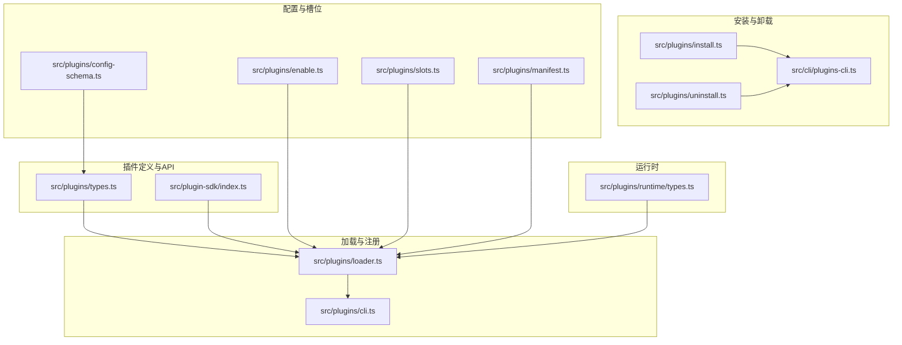
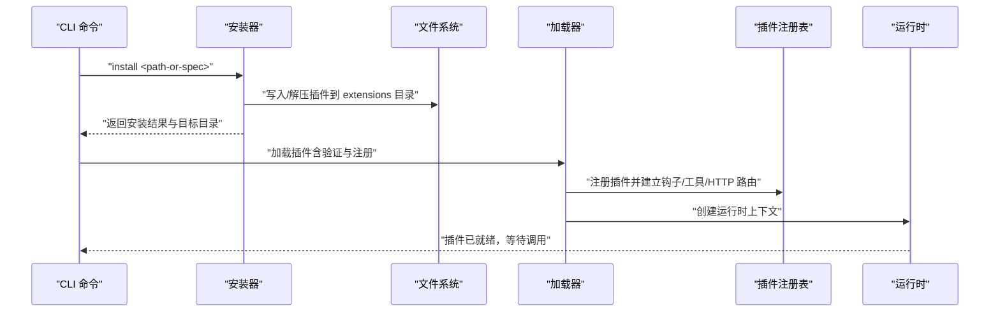
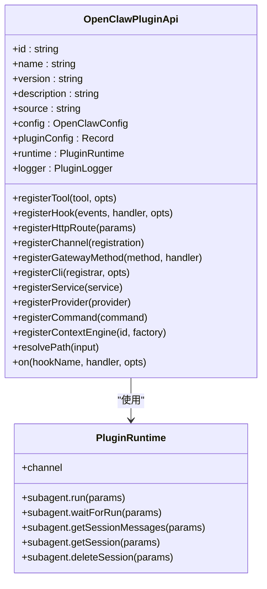
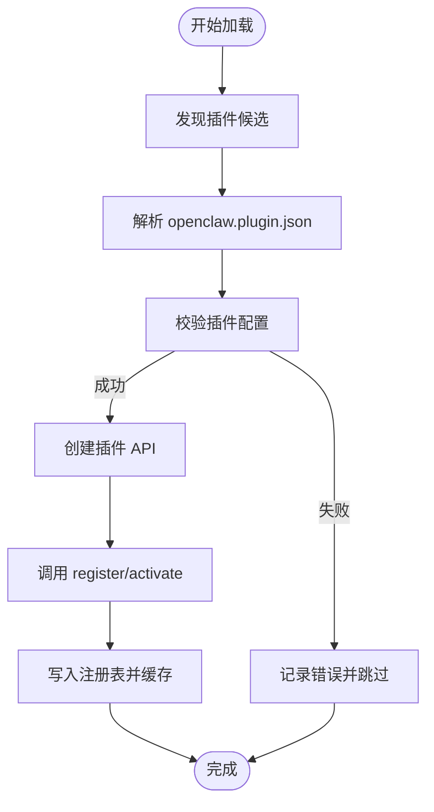
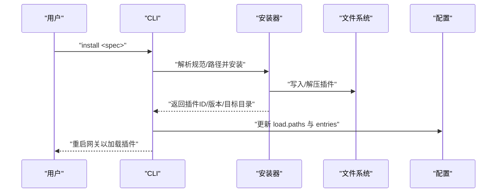
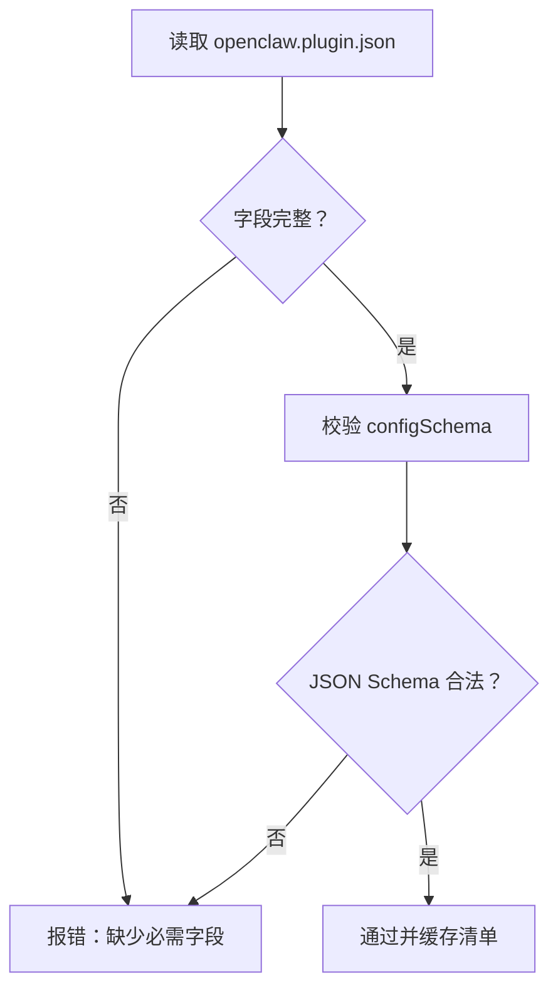
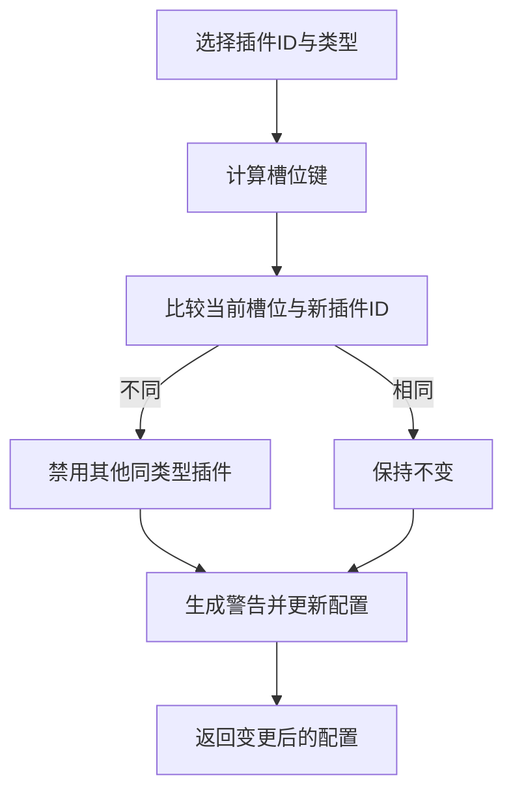
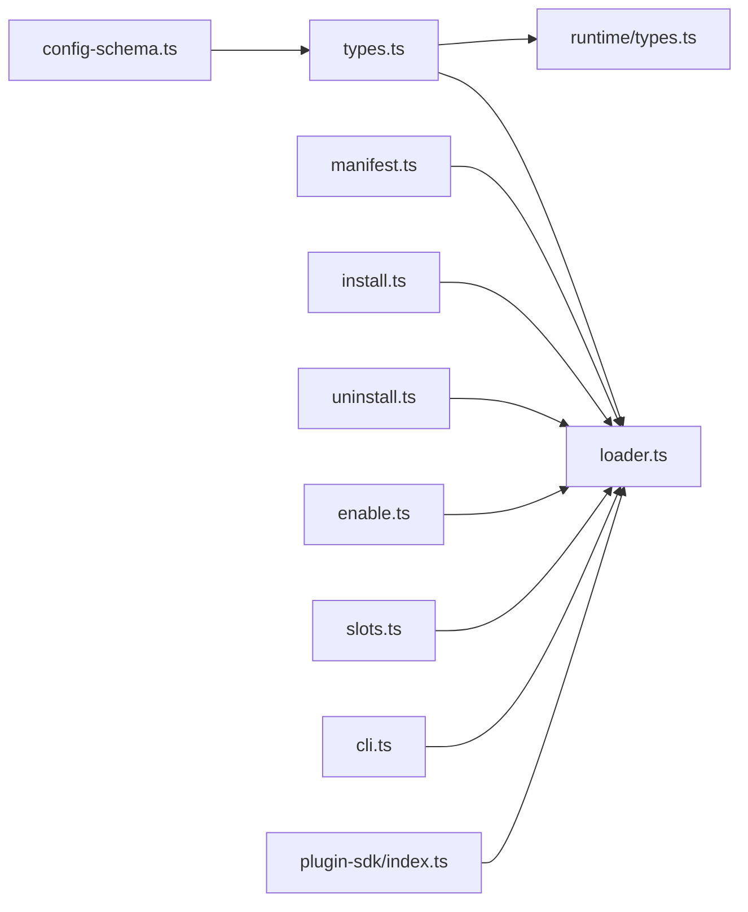

# 插件管理

<cite>
**本文引用的文件**
- [src/plugins/types.ts](file://src/plugins/types.ts)
- [src/plugins/loader.ts](file://src/plugins/loader.ts)
- [src/plugins/install.ts](file://src/plugins/install.ts)
- [src/plugins/uninstall.ts](file://src/plugins/uninstall.ts)
- [src/plugins/enable.ts](file://src/plugins/enable.ts)
- [src/plugins/slots.ts](file://src/plugins/slots.ts)
- [src/plugins/manifest.ts](file://src/plugins/manifest.ts)
- [src/plugins/config-schema.ts](file://src/plugins/config-schema.ts)
- [src/plugins/runtime/types.ts](file://src/plugins/runtime/types.ts)
- [src/plugins/cli.ts](file://src/plugins/cli.ts)
- [src/cli/plugins-cli.ts](file://src/cli/plugins-cli.ts)
- [src/plugin-sdk/index.ts](file://src/plugin-sdk/index.ts)
- [scripts/check-no-monolithic-plugin-sdk-entry-imports.ts](file://scripts/check-no-monolithic-plugin-sdk-entry-imports.ts)
</cite>

## 目录
1. [简介](#简介)
2. [项目结构](#项目结构)
3. [核心组件](#核心组件)
4. [架构总览](#架构总览)
5. [详细组件分析](#详细组件分析)
6. [依赖关系分析](#依赖关系分析)
7. [性能考量](#性能考量)
8. [故障排查指南](#故障排查指南)
9. [结论](#结论)
10. [附录](#附录)

## 简介
本文件为 OpenClaw 插件管理系统的详细 API 文档，覆盖插件安装、工具目录管理、插件验证与配置更新等核心能力，并深入解析插件生命周期管理、工具注册机制、参数验证规则与版本兼容性检查。文档同时提供插件安装流程、工具调用接口、配置同步机制与错误处理策略的说明，并给出 API 调用示例路径、插件开发指南与集成最佳实践。

## 项目结构
OpenClaw 的插件系统由“插件定义与 API”“加载与注册”“安装与卸载”“配置与槽位”“清单与模式校验”“运行时能力”“CLI 注册”等模块组成。下图展示与插件管理相关的关键文件与职责映射：

**图表来源**
- [src/plugins/types.ts](file://src/plugins/types.ts#L257-L300)
- [src/plugin-sdk/index.ts](file://src/plugin-sdk/index.ts#L1-L127)
- [src/plugins/loader.ts](file://src/plugins/loader.ts#L1-L200)
- [src/plugins/cli.ts](file://src/plugins/cli.ts#L1-L60)
- [src/plugins/install.ts](file://src/plugins/install.ts#L1-L200)
- [src/cli/plugins-cli.ts](file://src/cli/plugins-cli.ts#L156-L339)
- [src/plugins/uninstall.ts](file://src/plugins/uninstall.ts#L65-L156)
- [src/plugins/enable.ts](file://src/plugins/enable.ts#L12-L24)
- [src/plugins/slots.ts](file://src/plugins/slots.ts#L39-L111)
- [src/plugins/manifest.ts](file://src/plugins/manifest.ts#L1-L199)
- [src/plugins/config-schema.ts](file://src/plugins/config-schema.ts#L1-L34)
- [src/plugins/runtime/types.ts](file://src/plugins/runtime/types.ts#L51-L64)

**章节来源**
- [src/plugins/types.ts](file://src/plugins/types.ts#L257-L300)
- [src/plugins/loader.ts](file://src/plugins/loader.ts#L1-L200)
- [src/plugins/install.ts](file://src/plugins/install.ts#L1-L200)
- [src/plugins/uninstall.ts](file://src/plugins/uninstall.ts#L65-L156)
- [src/plugins/enable.ts](file://src/plugins/enable.ts#L12-L24)
- [src/plugins/slots.ts](file://src/plugins/slots.ts#L39-L111)
- [src/plugins/manifest.ts](file://src/plugins/manifest.ts#L1-L199)
- [src/plugins/config-schema.ts](file://src/plugins/config-schema.ts#L1-L34)
- [src/plugins/runtime/types.ts](file://src/plugins/runtime/types.ts#L51-L64)
- [src/plugins/cli.ts](file://src/plugins/cli.ts#L1-L60)
- [src/cli/plugins-cli.ts](file://src/cli/plugins-cli.ts#L156-L339)
- [src/plugin-sdk/index.ts](file://src/plugin-sdk/index.ts#L1-L127)

## 核心组件
- 插件 API 与类型定义：定义插件对外 API、钩子事件、命令、HTTP 路由、服务、工具注册等契约。
- 加载器：扫描、解析、校验并注册插件，构建运行时环境与钩子系统。
- 安装器：支持本地路径、归档、npm 规范安装，校验清单与扩展入口，记录安装记录。
- 卸载器：从配置中移除插件条目、安装记录、允许列表、加载路径与内存槽位。
- 启用/禁用：基于配置与白名单决定插件启用状态。
- 槽位管理：为“记忆体”“上下文引擎”等插件类型提供互斥槽位选择与默认回退。
- 清单与模式：解析 openclaw.plugin.json 与 package.json 中的 openclaw 字段，校验字段完整性与安全性。
- 运行时：提供子代理运行、会话查询、通道能力等运行时能力。
- CLI 注册：将插件注册的命令注入主 CLI，避免冲突并记录已注册命令。

**章节来源**
- [src/plugins/types.ts](file://src/plugins/types.ts#L257-L300)
- [src/plugins/loader.ts](file://src/plugins/loader.ts#L784-L861)
- [src/plugins/install.ts](file://src/plugins/install.ts#L186-L339)
- [src/plugins/uninstall.ts](file://src/plugins/uninstall.ts#L65-L156)
- [src/plugins/enable.ts](file://src/plugins/enable.ts#L12-L24)
- [src/plugins/slots.ts](file://src/plugins/slots.ts#L39-L111)
- [src/plugins/manifest.ts](file://src/plugins/manifest.ts#L45-L119)
- [src/plugins/runtime/types.ts](file://src/plugins/runtime/types.ts#L51-L64)
- [src/plugins/cli.ts](file://src/plugins/cli.ts#L11-L59)

## 架构总览
下图展示插件从安装到运行的全链路交互，包括 CLI、安装器、加载器、运行时与钩子系统之间的关系。

**图表来源**
- [src/cli/plugins-cli.ts](file://src/cli/plugins-cli.ts#L720-L727)
- [src/plugins/install.ts](file://src/plugins/install.ts#L205-L339)
- [src/plugins/loader.ts](file://src/plugins/loader.ts#L784-L861)
- [src/plugins/runtime/types.ts](file://src/plugins/runtime/types.ts#L51-L64)

## 详细组件分析

### 插件 API 与类型定义
- OpenClawPluginApi：插件可调用的核心 API，包括注册工具、钩子、HTTP 路由、通道、网关方法、CLI、服务、提供商、命令、上下文引擎、路径解析与生命周期钩子。
- 钩子体系：涵盖模型解析前、提示构建、消息收发、工具调用前后、会话开始/结束、子代理生命周期、网关启动/停止等。
- 工具/命令/HTTP/服务/通道注册：统一通过 API 提供，便于插件按需扩展。

**图表来源**
- [src/plugins/types.ts](file://src/plugins/types.ts#L257-L300)
- [src/plugins/runtime/types.ts](file://src/plugins/runtime/types.ts#L51-L64)

**章节来源**
- [src/plugins/types.ts](file://src/plugins/types.ts#L257-L300)
- [src/plugins/runtime/types.ts](file://src/plugins/runtime/types.ts#L51-L64)

### 插件加载与注册
- 加载流程：发现插件、解析清单、校验配置、创建 API、调用 register/activate、注册钩子与资源、缓存注册表。
- 错误处理：缺失导出、注册异常、配置无效、未跟踪加载插件等均记录诊断信息。
- 运行时注入：为每个插件创建独立运行时上下文，隔离日志与能力。

**图表来源**
- [src/plugins/loader.ts](file://src/plugins/loader.ts#L784-L861)
- [src/plugins/manifest.ts](file://src/plugins/manifest.ts#L45-L119)

**章节来源**
- [src/plugins/loader.ts](file://src/plugins/loader.ts#L784-L861)
- [src/plugins/manifest.ts](file://src/plugins/manifest.ts#L45-L119)

### 插件安装与卸载
- 安装支持本地路径、归档与 npm 规范；校验 openclaw.extensions、插件 ID、安装目标可用性与安全路径。
- 卸载清理配置中的条目、安装记录、允许列表、加载路径与内存槽位，并删除对应目录（保留非受信路径的安全策略）。

**图表来源**
- [src/cli/plugins-cli.ts](file://src/cli/plugins-cli.ts#L720-L727)
- [src/plugins/install.ts](file://src/plugins/install.ts#L205-L339)
- [src/plugins/enable.ts](file://src/plugins/enable.ts#L12-L24)

**章节来源**
- [src/cli/plugins-cli.ts](file://src/cli/plugins-cli.ts#L156-L339)
- [src/plugins/install.ts](file://src/plugins/install.ts#L186-L339)
- [src/plugins/enable.ts](file://src/plugins/enable.ts#L12-L24)

### 配置验证与模式
- 空配置模式：空对象即合法，用于无配置插件。
- 插件配置 Schema：支持 safeParse/parse/validate/jsonSchema/uiHints，用于前端 UI 提示与后端校验。
- 清单字段：openclaw.plugin.json 必须包含 id、configSchema 等字段，且不允许硬链接等不安全路径。

**图表来源**
- [src/plugins/manifest.ts](file://src/plugins/manifest.ts#L45-L119)
- [src/plugins/config-schema.ts](file://src/plugins/config-schema.ts#L13-L33)

**章节来源**
- [src/plugins/manifest.ts](file://src/plugins/manifest.ts#L45-L119)
- [src/plugins/config-schema.ts](file://src/plugins/config-schema.ts#L13-L33)

### 槽位与互斥选择
- 为“记忆体”“上下文引擎”等插件类型提供互斥槽位，切换时自动禁用其他同类型插件，并发出警告。
- 默认槽位回退至内置实现，避免空槽导致不可用。

**图表来源**
- [src/plugins/slots.ts](file://src/plugins/slots.ts#L39-L111)

**章节来源**
- [src/plugins/slots.ts](file://src/plugins/slots.ts#L39-L111)

### CLI 注册与冲突避免
- 加载器将插件注册的 CLI 命令注入主 CLI，若命令名冲突则跳过并记录调试信息。
- 支持插件声明其注册的命令集合，便于去重与审计。

**章节来源**
- [src/plugins/cli.ts](file://src/plugins/cli.ts#L11-L59)

### 版本兼容与入口约束
- 插件 SDK 入口限制：禁止从捆绑插件源文件导入 monolithic openclaw/plugin-sdk，必须使用按通道/核心/兼容性等子路径，确保边界清晰与可维护性。
- 该策略通过脚本在 CI 中强制执行，避免跨模块耦合。

**章节来源**
- [scripts/check-no-monolithic-plugin-sdk-entry-imports.ts](file://scripts/check-no-monolithic-plugin-sdk-entry-imports.ts#L73-L103)
- [src/plugin-sdk/index.ts](file://src/plugin-sdk/index.ts#L1-L127)

## 依赖关系分析
- 插件 API 与运行时：插件通过 OpenClawPluginApi 获取运行时能力，如子代理运行、通道操作等。
- 加载器与清单：加载器依赖清单解析与配置校验，确保插件具备有效元数据与入口。
- 安装器与卸载器：安装器负责落地文件与记录安装信息；卸载器负责清理配置与资源。
- CLI 与加载器：CLI 在启动时加载插件并注册命令，形成统一入口。

**图表来源**
- [src/plugins/types.ts](file://src/plugins/types.ts#L257-L300)
- [src/plugins/loader.ts](file://src/plugins/loader.ts#L1-L200)
- [src/plugins/install.ts](file://src/plugins/install.ts#L1-L200)
- [src/plugins/uninstall.ts](file://src/plugins/uninstall.ts#L65-L156)
- [src/plugins/enable.ts](file://src/plugins/enable.ts#L12-L24)
- [src/plugins/slots.ts](file://src/plugins/slots.ts#L39-L111)
- [src/plugins/manifest.ts](file://src/plugins/manifest.ts#L1-L199)
- [src/plugins/config-schema.ts](file://src/plugins/config-schema.ts#L1-L34)
- [src/plugins/runtime/types.ts](file://src/plugins/runtime/types.ts#L51-L64)
- [src/plugins/cli.ts](file://src/plugins/cli.ts#L1-L60)
- [src/plugin-sdk/index.ts](file://src/plugin-sdk/index.ts#L1-L127)

**章节来源**
- [src/plugins/types.ts](file://src/plugins/types.ts#L257-L300)
- [src/plugins/loader.ts](file://src/plugins/loader.ts#L1-L200)
- [src/plugins/install.ts](file://src/plugins/install.ts#L1-L200)
- [src/plugins/uninstall.ts](file://src/plugins/uninstall.ts#L65-L156)
- [src/plugins/enable.ts](file://src/plugins/enable.ts#L12-L24)
- [src/plugins/slots.ts](file://src/plugins/slots.ts#L39-L111)
- [src/plugins/manifest.ts](file://src/plugins/manifest.ts#L1-L199)
- [src/plugins/config-schema.ts](file://src/plugins/config-schema.ts#L1-L34)
- [src/plugins/runtime/types.ts](file://src/plugins/runtime/types.ts#L51-L64)
- [src/plugins/cli.ts](file://src/plugins/cli.ts#L1-L60)
- [src/plugin-sdk/index.ts](file://src/plugin-sdk/index.ts#L1-L127)

## 性能考量
- 缓存注册表：加载器支持缓存插件注册表，减少重复扫描与解析开销。
- 并行与异步：插件注册可能返回 Promise，但当前实现会忽略异步注册，建议插件在同步阶段完成初始化以避免阻塞。
- 安全与边界：安装与清单读取严格限制在安全边界内，避免硬链接与越界路径带来的性能与安全风险。

[本节为通用指导，无需列出具体文件来源]

## 故障排查指南
- 安装失败：检查 openclaw.extensions 是否存在且非空、插件 ID 是否合法、安装目标是否可用。
- 清单错误：确认 openclaw.plugin.json 存在且包含 id 与 configSchema，避免硬链接与非法路径。
- 注册失败：查看加载器日志，确认插件导出包含 register/activate，捕获异常并记录诊断信息。
- 卸载残留：确认配置中 entries、installs、allow、load.paths、slots 是否被正确清理。
- CLI 冲突：若命令未出现，检查是否与已有命令冲突，查看调试日志定位原因。

**章节来源**
- [src/plugins/install.ts](file://src/plugins/install.ts#L100-L129)
- [src/plugins/manifest.ts](file://src/plugins/manifest.ts#L45-L119)
- [src/plugins/loader.ts](file://src/plugins/loader.ts#L784-L861)
- [src/plugins/uninstall.ts](file://src/plugins/uninstall.ts#L65-L156)
- [src/plugins/cli.ts](file://src/plugins/cli.ts#L28-L58)

## 结论
OpenClaw 插件管理系统通过清晰的 API 契约、严格的清单与配置校验、完善的安装/卸载与槽位互斥机制，以及可扩展的加载与运行时能力，实现了高可维护性与强隔离性的插件生态。遵循本文档的开发与集成实践，可确保插件在安装、验证、加载与运行各阶段稳定可靠。

[本节为总结，无需列出具体文件来源]

## 附录

### API 调用示例（路径）
- 插件安装命令
  - [src/cli/plugins-cli.ts](file://src/cli/plugins-cli.ts#L720-L727)
- 插件启用逻辑
  - [src/plugins/enable.ts](file://src/plugins/enable.ts#L12-L24)
- 插件卸载清理
  - [src/plugins/uninstall.ts](file://src/plugins/uninstall.ts#L65-L156)
- 插件清单解析
  - [src/plugins/manifest.ts](file://src/plugins/manifest.ts#L45-L119)
- 插件配置模式
  - [src/plugins/config-schema.ts](file://src/plugins/config-schema.ts#L13-L33)
- 插件运行时能力
  - [src/plugins/runtime/types.ts](file://src/plugins/runtime/types.ts#L51-L64)
- 插件 CLI 注册
  - [src/plugins/cli.ts](file://src/plugins/cli.ts#L11-L59)

### 插件开发指南与最佳实践
- 使用 openclaw/plugin-sdk 的子路径而非 monolithic 入口，确保可维护性与边界清晰。
  - 参考：[src/plugin-sdk/index.ts](file://src/plugin-sdk/index.ts#L1-L127)，[scripts/check-no-monolithic-plugin-sdk-entry-imports.ts](file://scripts/check-no-monolithic-plugin-sdk-entry-imports.ts#L73-L103)
- 在 openclaw.plugin.json 中提供 id 与 configSchema，并确保字段完整与安全。
  - 参考：[src/plugins/manifest.ts](file://src/plugins/manifest.ts#L45-L119)
- 在 package.json 的 openclaw 字段中声明 extensions，确保安装器可识别入口。
  - 参考：[src/plugins/manifest.ts](file://src/plugins/manifest.ts#L175-L199)
- 使用 OpenClawPluginApi 注册工具、钩子、HTTP 路由、命令与服务，避免直接导入核心内部模块。
  - 参考：[src/plugins/types.ts](file://src/plugins/types.ts#L257-L300)
- 遵循槽位互斥原则，为“记忆体/上下文引擎”等类型插件提供默认槽位与切换警告。
  - 参考：[src/plugins/slots.ts](file://src/plugins/slots.ts#L39-L111)
- 在 CLI 中注册命令时避免与现有命令冲突，必要时在插件侧提供命令集合声明。
  - 参考：[src/plugins/cli.ts](file://src/plugins/cli.ts#L28-L58)