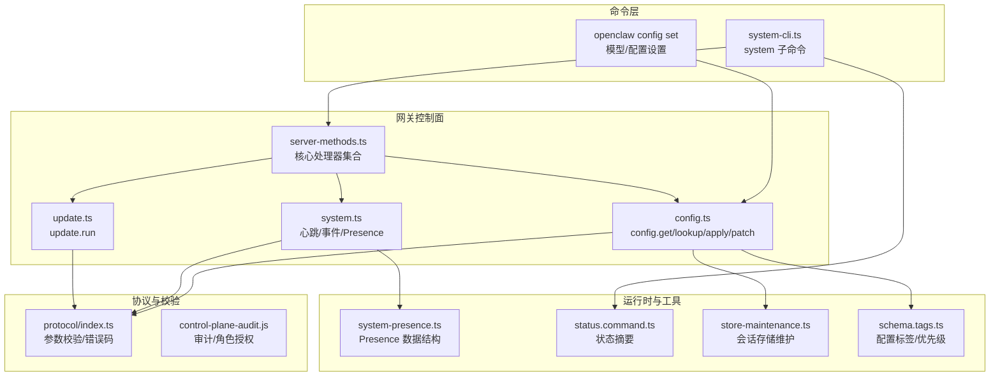
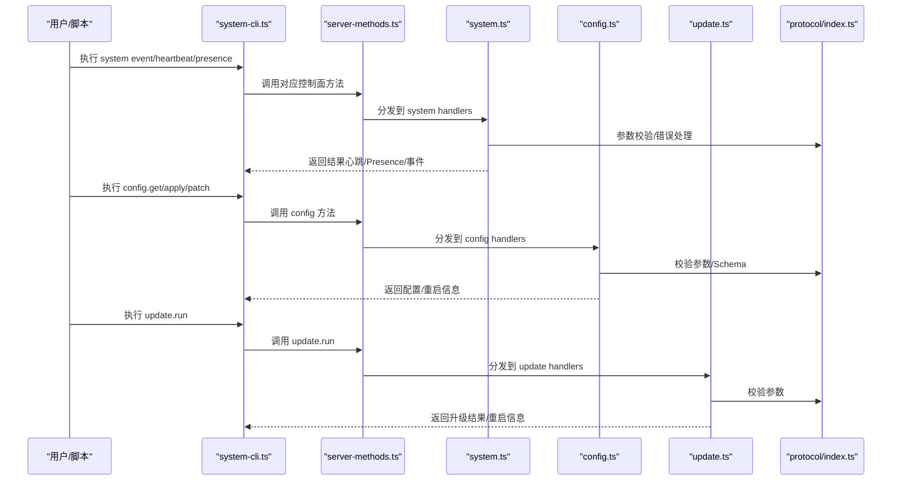
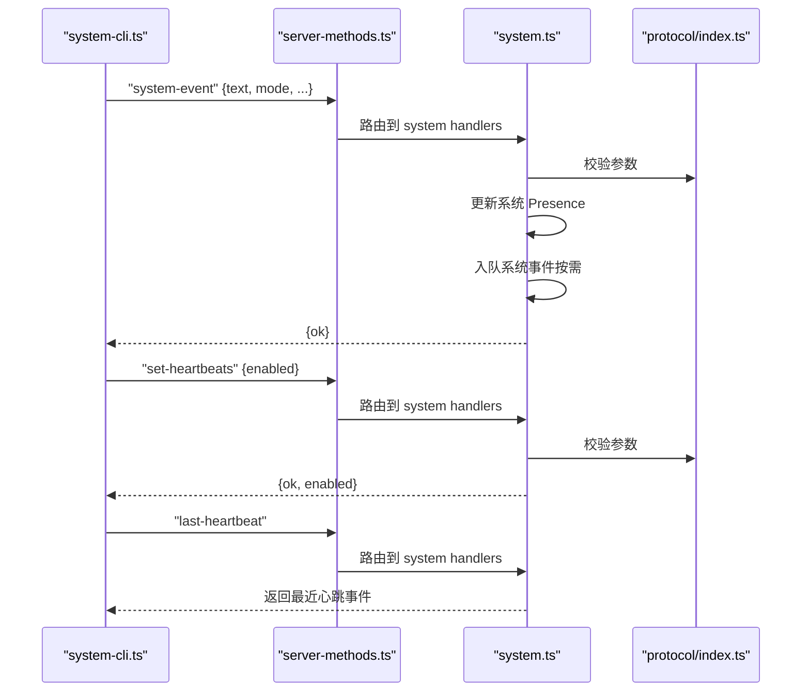
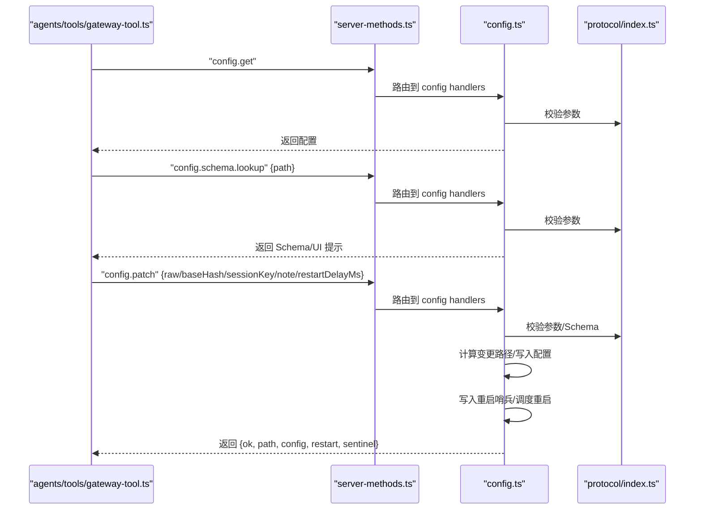
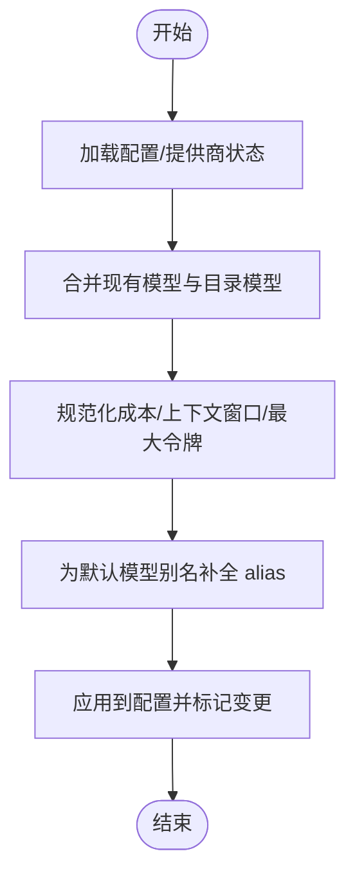
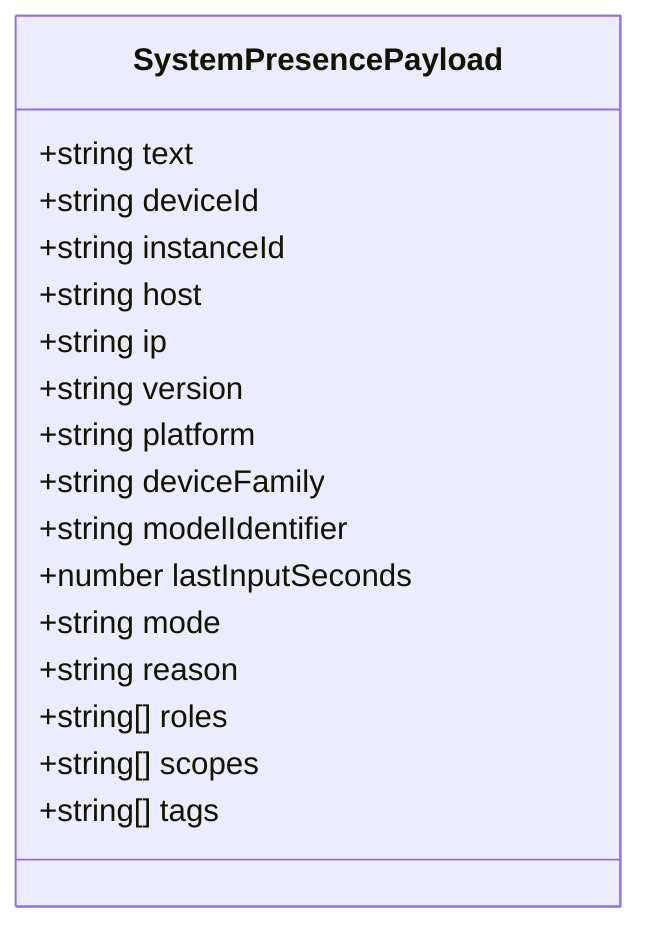
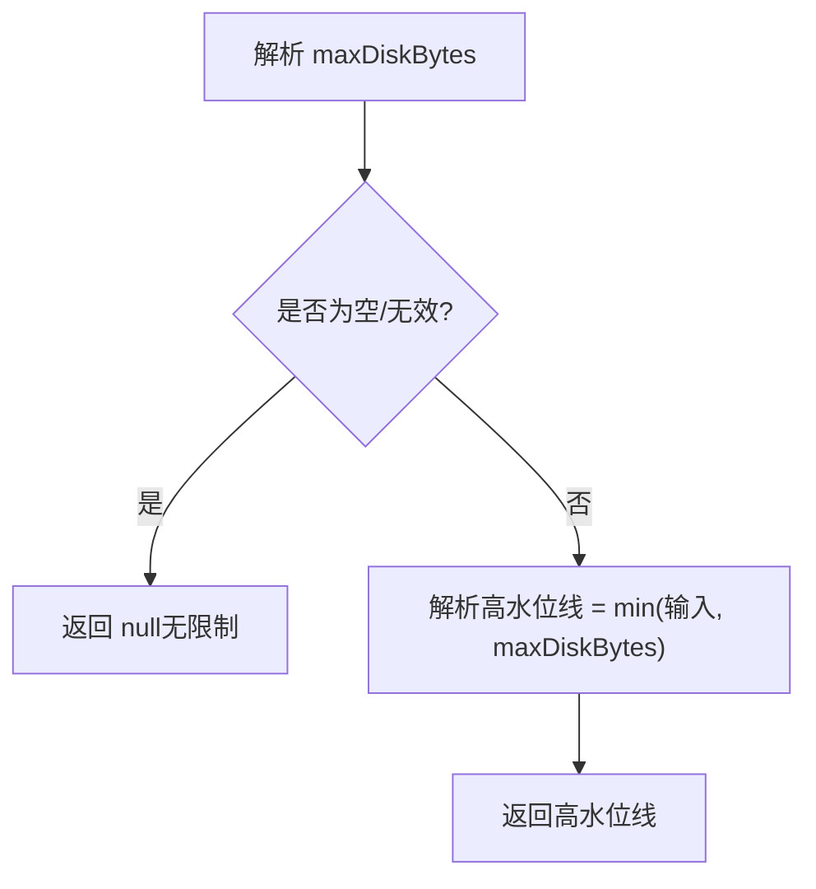
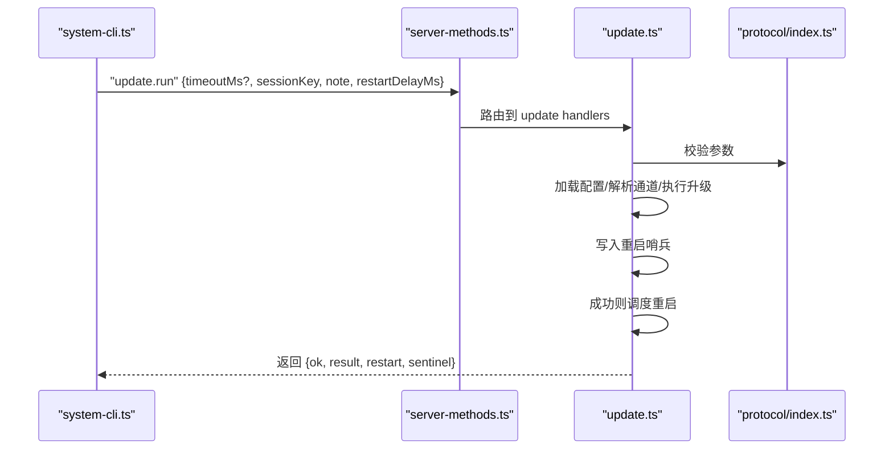
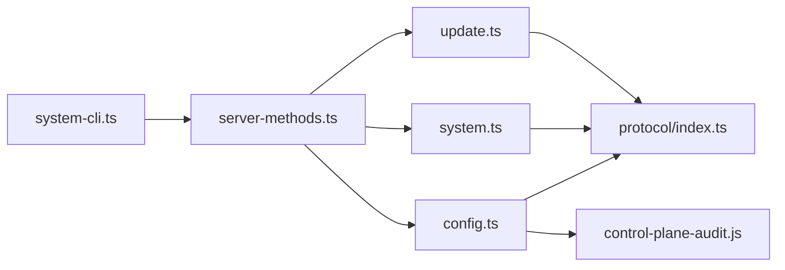

# 系统管理

<cite>
**本文引用的文件**
- [README.md](file://README.md)
- [src/cli/system-cli.ts](file://src/cli/system-cli.ts)
- [src/gateway/server-methods/system.ts](file://src/gateway/server-methods/system.ts)
- [src/gateway/server-methods/config.ts](file://src/gateway/server-methods/config.ts)
- [src/agents/tools/gateway-tool.ts](file://src/agents/tools/gateway-tool.ts)
- [src/gateway/server-methods/update.ts](file://src/gateway/server-methods/update.ts)
- [src/infra/system-presence.ts](file://src/infra/system-presence.ts)
- [src/commands/status.command.ts](file://src/commands/status.command.ts)
- [src/config/defaults.ts](file://src/config/defaults.ts)
- [src/config/schema.tags.ts](file://src/config/schema.tags.ts)
- [src/config/schema.help.quality.test.ts](file://src/config/schema.help.quality.test.ts)
- [src/config/sessions/store-maintenance.ts](file://src/config/sessions/store-maintenance.ts)
- [src/cli/system-cli.test.ts](file://src/cli/system-cli.test.ts)
- [src/gateway/server-methods.ts](file://src/gateway/server-methods.ts)
- [docs/zh-CN/gateway/configuration.md](file://docs/zh-CN/gateway/configuration.md)
</cite>

## 目录
1. [简介](#简介)
2. [项目结构](#项目结构)
3. [核心组件](#核心组件)
4. [架构总览](#架构总览)
5. [详细组件分析](#详细组件分析)
6. [依赖关系分析](#依赖关系分析)
7. [性能考量](#性能考量)
8. [故障排查指南](#故障排查指南)
9. [结论](#结论)
10. [附录](#附录)

## 简介
本文件面向 OpenClaw 系统管理场景，聚焦于模型管理、配置更新、系统维护与版本升级等核心能力，提供系统化的 API 文档与运维实践。内容覆盖：
- 模型配置与切换：默认模型设置、别名解析、成本与上下文窗口约束、回退策略
- 配置更新：config.get、config.schema.lookup、config.apply、config.patch、openclaw config set
- 系统维护：会话存储清理、磁盘配额、高水位线、归档保留策略
- 系统监控：心跳、系统事件、在线状态、Presence 更新
- 版本升级：update.run、重启哨兵、审计与重试策略
- 运维最佳实践与故障恢复

## 项目结构
OpenClaw 的系统管理能力由“CLI 命令”“网关 WebSocket 控制面”“协议与校验”“运行时工具”共同构成，形成“命令入口 → 控制面方法 → 协议校验 → 文件系统/进程控制”的闭环。

图示来源
- [src/cli/system-cli.ts](file://src/cli/system-cli.ts#L41-L132)
- [src/gateway/server-methods.ts](file://src/gateway/server-methods.ts#L37-L96)
- [src/gateway/server-methods/system.ts](file://src/gateway/server-methods/system.ts#L10-L134)
- [src/gateway/server-methods/config.ts](file://src/gateway/server-methods/config.ts#L37-L514)
- [src/gateway/server-methods/update.ts](file://src/gateway/server-methods/update.ts#L18-L134)
- [src/infra/system-presence.ts](file://src/infra/system-presence.ts#L159-L191)
- [src/config/schema.tags.ts](file://src/config/schema.tags.ts#L1-L53)
- [src/config/sessions/store-maintenance.ts](file://src/config/sessions/store-maintenance.ts#L80-L124)

章节来源
- [README.md](file://README.md#L1-L560)
- [src/cli/system-cli.ts](file://src/cli/system-cli.ts#L1-L133)
- [src/gateway/server-methods.ts](file://src/gateway/server-methods.ts#L37-L96)

## 核心组件
- 系统子命令（CLI）：system event、heartbeat（last/enabled/disable）、presence
- 网关系统方法：last-heartbeat、set-heartbeats、system-presence、system-event
- 配置管理：config.get、config.schema.lookup、config.apply、config.patch
- 版本升级：update.run
- 运行时工具：系统 Presence 数据结构、会话存储维护、配置标签与帮助质量

章节来源
- [src/cli/system-cli.ts](file://src/cli/system-cli.ts#L41-L132)
- [src/gateway/server-methods/system.ts](file://src/gateway/server-methods/system.ts#L10-L134)
- [src/gateway/server-methods/config.ts](file://src/gateway/server-methods/config.ts#L37-L514)
- [src/gateway/server-methods/update.ts](file://src/gateway/server-methods/update.ts#L18-L134)
- [src/infra/system-presence.ts](file://src/infra/system-presence.ts#L159-L191)
- [src/config/sessions/store-maintenance.ts](file://src/config/sessions/store-maintenance.ts#L80-L124)

## 架构总览
下图展示系统管理相关的关键调用链：CLI → 网关方法 → 协议校验 → 文件/进程控制 → 广播/通知。

图示来源
- [src/cli/system-cli.ts](file://src/cli/system-cli.ts#L58-L131)
- [src/gateway/server-methods.ts](file://src/gateway/server-methods.ts#L67-L96)
- [src/gateway/server-methods/system.ts](file://src/gateway/server-methods/system.ts#L10-L134)
- [src/gateway/server-methods/config.ts](file://src/gateway/server-methods/config.ts#L37-L514)
- [src/gateway/server-methods/update.ts](file://src/gateway/server-methods/update.ts#L18-L134)

## 详细组件分析

### 系统事件与心跳（system-cli + system handlers）
- 功能要点
  - system event：入队系统事件，支持触发下一次心跳或立即唤醒
  - heartbeat last/enabled/disable：查询最近心跳、启用/禁用心跳
  - presence：列出系统在线状态条目
- 关键行为
  - system-event 支持传入设备/主机/IP/版本/平台/模式/原因/角色/范围/标签等字段，自动广播 Presence 快照
  - 对节点 Presence 的变更进行差量检测，仅在关键字段变化时入队系统事件
  - set-heartbeats 切换全局心跳开关
  - last-heartbeat 返回最近心跳事件

图示来源
- [src/cli/system-cli.ts](file://src/cli/system-cli.ts#L58-L118)
- [src/gateway/server-methods/system.ts](file://src/gateway/server-methods/system.ts#L10-L134)

章节来源
- [src/cli/system-cli.ts](file://src/cli/system-cli.ts#L41-L132)
- [src/gateway/server-methods/system.ts](file://src/gateway/server-methods/system.ts#L10-L134)
- [src/infra/system-presence.ts](file://src/infra/system-presence.ts#L159-L191)

### 配置管理（config.get/lookup/apply/patch）
- 功能要点
  - config.get：获取当前配置
  - config.schema.lookup：按路径查询配置项的 Schema 与 UI 提示
  - config.apply：整包替换并重启（谨慎使用）
  - config.patch：增量更新并重启（推荐）
- 关键行为
  - 参数校验与 Schema 校验
  - 计算变更路径，记录审计日志
  - 写入配置文件，生成重启哨兵，调度 SIGUSR1 重启
  - 返回最小化敏感信息的配置视图

图示来源
- [src/agents/tools/gateway-tool.ts](file://src/agents/tools/gateway-tool.ts#L173-L210)
- [src/gateway/server-methods/config.ts](file://src/gateway/server-methods/config.ts#L37-L514)

章节来源
- [src/gateway/server-methods/config.ts](file://src/gateway/server-methods/config.ts#L37-L514)
- [docs/zh-CN/gateway/configuration.md](file://docs/zh-CN/gateway/configuration.md#L35-L68)

### 模型管理与配置默认值
- 默认模型与别名
  - 默认模型字段支持直接设置主模型；若已有 fallbacks，则保留并合并
  - 别名索引用于将别名映射到目标模型 ID
- 成本与上下文窗口
  - 自动规范化输入/输出/缓存读写成本
  - 上下文窗口与最大输出令牌受上下文窗口限制
- 提供商模型合并
  - 合并现有模型与目录模型，避免重复
  - 为默认模型别名补全 alias 字段

图示来源
- [src/config/defaults.ts](file://src/config/defaults.ts#L240-L287)
- [src/commands/onboard-auth.config-shared.ts](file://src/commands/onboard-auth.config-shared.ts#L119-L149)
- [ui/src/ui/app-render.ts](file://ui/src/ui/app-render.ts#L832-L864)

章节来源
- [src/config/defaults.ts](file://src/config/defaults.ts#L240-L287)
- [src/commands/onboard-auth.config-shared.ts](file://src/commands/onboard-auth.config-shared.ts#L119-L149)
- [ui/src/ui/app-render.ts](file://ui/src/ui/app-render.ts#L832-L864)

### 系统监控与状态查询
- 状态摘要
  - 包含会话默认上下文令牌、排队系统事件数量、心跳探测状态、最后心跳时间与通道账户信息、会话存储路径等
- Presence 结构
  - 支持文本、设备/实例标识、主机/IP、版本/平台、设备家族/型号、最近输入秒数、模式、原因、角色/范围/标签等字段

图示来源
- [src/infra/system-presence.ts](file://src/infra/system-presence.ts#L159-L191)

章节来源
- [src/commands/status.command.ts](file://src/commands/status.command.ts#L316-L356)
- [src/infra/system-presence.ts](file://src/infra/system-presence.ts#L159-L191)

### 系统维护与会话存储
- 磁盘配额与高水位线
  - 解析 maxDiskBytes，计算高水位线（默认 80%），确保不超过上限
- 归档保留与重置
  - 提供 reset-archive-retention 开关与 prune-after 等字段帮助控制历史数据规模
- 帮助文档质量
  - Schema 帮助文档包含时长/大小示例、弃用字段提示、运行日志保留控制等

图示来源
- [src/config/sessions/store-maintenance.ts](file://src/config/sessions/store-maintenance.ts#L80-L124)

章节来源
- [src/config/sessions/store-maintenance.ts](file://src/config/sessions/store-maintenance.ts#L80-L124)
- [src/config/schema.help.quality.test.ts](file://src/config/schema.help.quality.test.ts#L672-L705)

### 版本升级（update.run）
- 功能要点
  - 从配置读取更新通道，执行升级流程
  - 成功时写入重启哨兵并调度 SIGUSR1 重启；失败时不重启以避免损坏状态
  - 返回升级统计、步骤日志尾部、耗时等信息
- 安全性
  - 失败不重启，防止崩溃循环
  - 审计记录操作者、设备、IP 等

图示来源
- [src/gateway/server-methods/update.ts](file://src/gateway/server-methods/update.ts#L18-L134)

章节来源
- [src/gateway/server-methods/update.ts](file://src/gateway/server-methods/update.ts#L18-L134)

## 依赖关系分析
- 授权与作用域
  - 控制面写操作（config.apply、config.patch、update.run）需要具备相应角色与作用域
  - 节点角色可访问部分方法，管理员作用域可绕过细粒度校验
- 协议与校验
  - 所有方法均通过协议层参数校验与错误码统一处理
- 组件耦合
  - system-cli 与 system handlers 强耦合，负责心跳/事件/Presence
  - config handlers 依赖协议校验、重启哨兵与审计
  - update handlers 依赖通道解析、重启调度与审计

图示来源
- [src/gateway/server-methods.ts](file://src/gateway/server-methods.ts#L37-L96)
- [src/gateway/server-methods/system.ts](file://src/gateway/server-methods/system.ts#L10-L134)
- [src/gateway/server-methods/config.ts](file://src/gateway/server-methods/config.ts#L37-L514)
- [src/gateway/server-methods/update.ts](file://src/gateway/server-methods/update.ts#L18-L134)

章节来源
- [src/gateway/server-methods.ts](file://src/gateway/server-methods.ts#L37-L96)

## 性能考量
- 心跳与事件
  - 合理设置心跳周期，避免频繁广播；对节点变更采用差量入队，降低冗余事件
- 配置更新
  - 尽量使用 config.patch 而非 config.apply，减少重启频率与配置覆盖风险
  - 使用 baseHash 防止并发覆盖
- 存储维护
  - 设置合理的 maxDiskBytes 与高水位线，避免磁盘压力过大
  - 使用 prune-after 控制历史保留，平衡可观测性与空间占用

## 故障排查指南
- 配置错误
  - 使用 openclaw doctor 检查配置合法性；必要时使用 --fix 自动修复
  - 使用 config.schema.lookup 获取字段 Schema 与 UI 提示，辅助定位问题
- 心跳与事件
  - 若心跳异常，检查 set-heartbeats 状态与 last-heartbeat 输出
  - 检查 Presence 变更是否触发了系统事件入队
- 升级失败
  - update.run 失败时不重启，检查重启哨兵与升级步骤日志尾部
  - 使用 doctor hint 提示进行非交互式诊断
- CLI 行为验证
  - 通过单元测试样例验证 system-cli 的行为（如 doctor 动作）

章节来源
- [docs/zh-CN/gateway/configuration.md](file://docs/zh-CN/gateway/configuration.md#L35-L68)
- [src/cli/system-cli.test.ts](file://src/cli/system-cli.test.ts#L1-L55)

## 结论
OpenClaw 的系统管理以“CLI → 控制面 → 协议校验 → 文件/进程控制”为核心路径，围绕模型配置、配置更新、系统监控与版本升级提供了安全、可观测且可审计的能力。建议在生产环境中：
- 优先使用 config.patch 与 openclaw config set 进行增量更新
- 合理设置会话存储配额与保留策略
- 通过 Presence 与心跳事件实现系统状态可视化
- 使用 update.run 并关注失败不重启的安全策略

## 附录
- 配置标签与优先级：用于 UI 分组与排序，覆盖安全、认证、网络、隐私、可观测性、可靠性、性能、存储、模型、媒体、自动化、渠道、工具、高级等
- Schema 帮助质量：包含时长/大小示例、弃用字段提示、运行日志保留控制等

章节来源
- [src/config/schema.tags.ts](file://src/config/schema.tags.ts#L1-L53)
- [src/config/schema.help.quality.test.ts](file://src/config/schema.help.quality.test.ts#L672-L705)