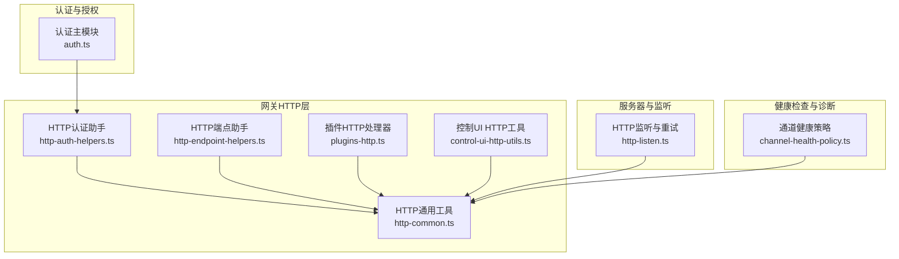
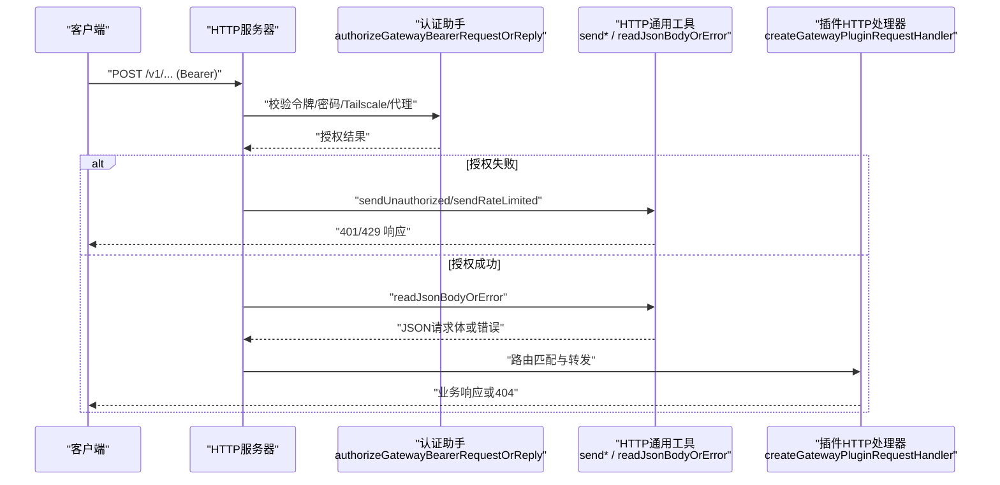
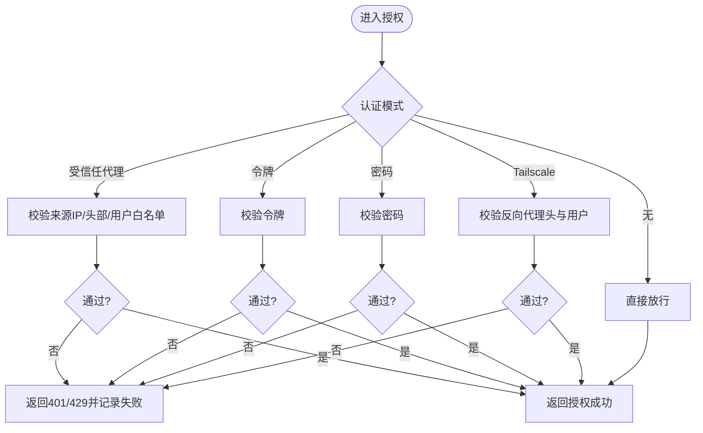
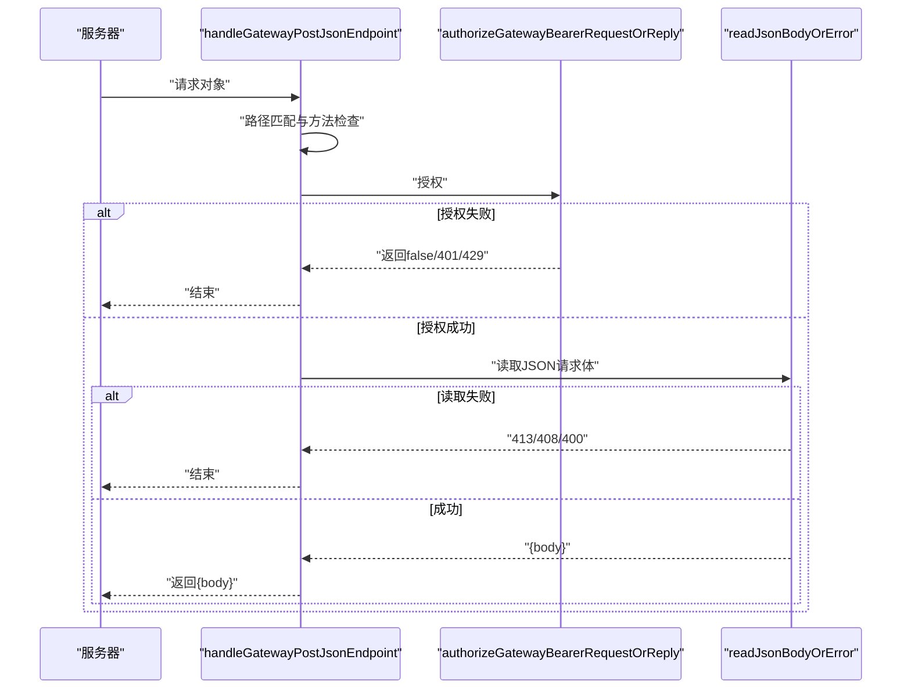
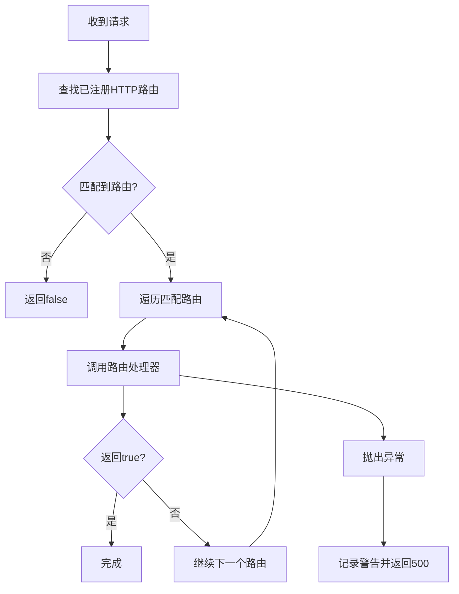
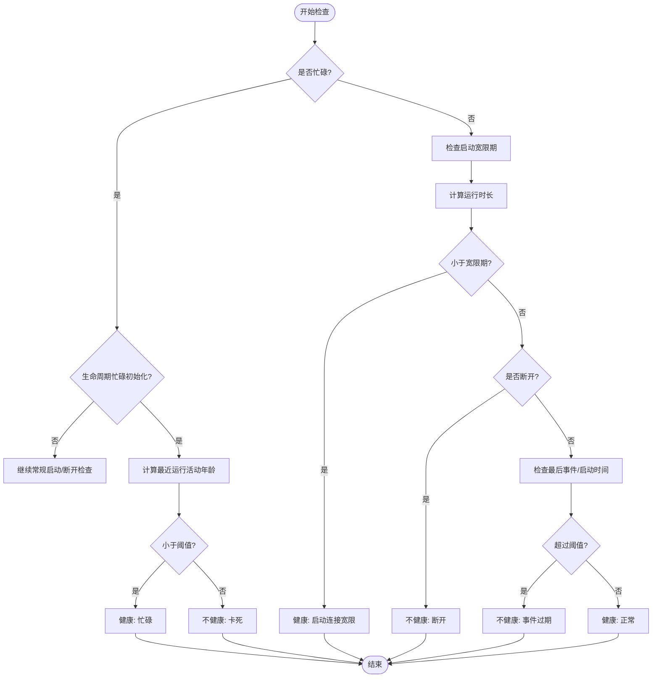
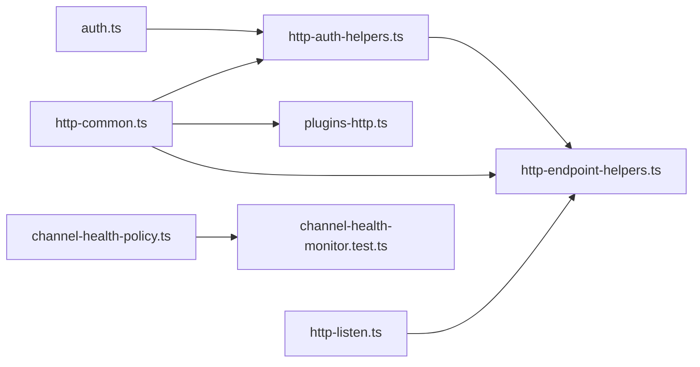

# 网关API

<cite>
**本文引用的文件**
- [src/gateway/auth.ts](file://src/gateway/auth.ts)
- [src/gateway/http-auth-helpers.ts](file://src/gateway/http-auth-helpers.ts)
- [src/gateway/http-common.ts](file://src/gateway/http-common.ts)
- [src/gateway/http-endpoint-helpers.ts](file://src/gateway/http-endpoint-helpers.ts)
- [src/gateway/server/plugins-http.ts](file://src/gateway/server/plugins-http.ts)
- [src/gateway/control-ui-http-utils.ts](file://src/gateway/control-ui-http-utils.ts)
- [src/gateway/server/http-listen.ts](file://src/gateway/server/http-listen.ts)
- [src/gateway/channel-health-policy.ts](file://src/gateway/channel-health-policy.ts)
- [src/gateway/channel-health-monitor.test.ts](file://src/gateway/channel-health-monitor.test.ts)
- [src/cli/daemon-cli/lifecycle.test.ts](file://src/cli/daemon-cli/lifecycle.test.ts)
- [src/commands/health.snapshot.test.ts](file://src/commands/health.snapshot.test.ts)
- [scripts/dev/gateway-smoke.ts](file://scripts/dev/gateway-smoke.ts)
- [scripts/dev/gateway-ws-client.ts](file://scripts/dev/gateway-ws-client.ts)
</cite>

## 目录
1. [简介](#简介)
2. [项目结构](#项目结构)
3. [核心组件](#核心组件)
4. [架构总览](#架构总览)
5. [详细组件分析](#详细组件分析)
6. [依赖关系分析](#依赖关系分析)
7. [性能考量](#性能考量)
8. [故障排查指南](#故障排查指南)
9. [结论](#结论)
10. [附录](#附录)

## 简介
本文件面向OpenClaw网关API的使用者与集成者，系统化梳理网关的HTTP与WebSocket接入层、认证与授权、健康检查与诊断、以及系统维护（重启）相关能力。文档覆盖以下主题：
- 连接管理：HTTP与WebSocket接入、认证模式（令牌、密码、受信任代理、Tailscale）、速率限制与安全头设置
- 健康检查：通道健康策略、监控与自动重启逻辑
- 诊断服务：运行时快照、诊断渲染与日志输出
- 重启请求：守护进程生命周期控制、健康检查轮询与诊断输出
- 客户端集成：HTTP请求与WebSocket连接的最佳实践、错误处理建议

## 项目结构
网关API主要由以下模块组成：
- 认证与授权：解析配置、校验请求来源、执行速率限制、支持多种认证模式
- HTTP通用工具：统一响应格式、错误码、安全头、JSON读取与SSE支持
- 插件HTTP路由：插件注册表驱动的HTTP路由匹配与转发
- 控制UI HTTP工具：只读HTTP方法判断与简单文本响应
- 服务器监听：端口占用重试、错误包装与守护锁
- 健康检查与诊断：通道健康策略、监控器行为、重启触发条件
- CLI与脚本：生命周期控制、健康轮询、诊断渲染、Smoke测试与WebSocket客户端

图表来源
- [src/gateway/http-common.ts](file://src/gateway/http-common.ts#L1-L109)
- [src/gateway/http-endpoint-helpers.ts](file://src/gateway/http-endpoint-helpers.ts#L1-L47)
- [src/gateway/http-auth-helpers.ts](file://src/gateway/http-auth-helpers.ts#L1-L30)
- [src/gateway/server/plugins-http.ts](file://src/gateway/server/plugins-http.ts#L1-L70)
- [src/gateway/control-ui-http-utils.ts](file://src/gateway/control-ui-http-utils.ts#L1-L16)
- [src/gateway/auth.ts](file://src/gateway/auth.ts#L1-L491)
- [src/gateway/server/http-listen.ts](file://src/gateway/server/http-listen.ts#L1-L23)
- [src/gateway/channel-health-policy.ts](file://src/gateway/channel-health-policy.ts#L74-L112)

章节来源
- [src/gateway/auth.ts](file://src/gateway/auth.ts#L1-L491)
- [src/gateway/http-common.ts](file://src/gateway/http-common.ts#L1-L109)
- [src/gateway/http-endpoint-helpers.ts](file://src/gateway/http-endpoint-helpers.ts#L1-L47)
- [src/gateway/http-auth-helpers.ts](file://src/gateway/http-auth-helpers.ts#L1-L30)
- [src/gateway/server/plugins-http.ts](file://src/gateway/server/plugins-http.ts#L1-L70)
- [src/gateway/control-ui-http-utils.ts](file://src/gateway/control-ui-http-utils.ts#L1-L16)
- [src/gateway/server/http-listen.ts](file://src/gateway/server/http-listen.ts#L1-L23)
- [src/gateway/channel-health-policy.ts](file://src/gateway/channel-health-policy.ts#L74-L112)

## 核心组件
- 认证与授权（auth.ts）
  - 支持模式：无认证、令牌、密码、受信任代理、默认令牌
  - 支持来源：配置覆盖、配置文件、环境变量、默认值
  - 速率限制：失败计数、重试等待时间、作用域
  - Tailscale：仅在WS控制UI启用，通过反向代理头校验用户身份
  - 受信任代理：校验来源IP、必要头部、用户头、允许用户白名单
- HTTP通用工具（http-common.ts）
  - 统一安全头、JSON/文本/SSE响应、错误码封装、请求体读取与超时处理
- HTTP端点助手（http-endpoint-helpers.ts）
  - 路径匹配、方法限制（POST）、认证授权、JSON请求体读取
- HTTP认证助手（http-auth-helpers.ts）
  - Bearer令牌提取与授权、失败响应封装
- 插件HTTP处理器（plugins-http.ts）
  - 注册表驱动的路由匹配、精确匹配优先、前缀回退、异常兜底
- 控制UI HTTP工具（control-ui-http-utils.ts）
  - 只读方法判断、纯文本响应、404处理
- 服务器监听（http-listen.ts）
  - 端口占用重试、错误包装为守护锁错误

章节来源
- [src/gateway/auth.ts](file://src/gateway/auth.ts#L23-L491)
- [src/gateway/http-common.ts](file://src/gateway/http-common.ts#L11-L109)
- [src/gateway/http-endpoint-helpers.ts](file://src/gateway/http-endpoint-helpers.ts#L7-L47)
- [src/gateway/http-auth-helpers.ts](file://src/gateway/http-auth-helpers.ts#L7-L30)
- [src/gateway/server/plugins-http.ts](file://src/gateway/server/plugins-http.ts#L29-L70)
- [src/gateway/control-ui-http-utils.ts](file://src/gateway/control-ui-http-utils.ts#L3-L16)
- [src/gateway/server/http-listen.ts](file://src/gateway/server/http-listen.ts#L18-L23)

## 架构总览
下图展示从客户端到网关HTTP层、认证授权、插件路由与最终响应的整体流程。

图表来源
- [src/gateway/http-auth-helpers.ts](file://src/gateway/http-auth-helpers.ts#L7-L30)
- [src/gateway/http-common.ts](file://src/gateway/http-common.ts#L41-L96)
- [src/gateway/server/plugins-http.ts](file://src/gateway/server/plugins-http.ts#L34-L69)
- [src/gateway/http-endpoint-helpers.ts](file://src/gateway/http-endpoint-helpers.ts#L18-L47)

## 详细组件分析

### 认证与授权（HTTP）
- 模式与来源
  - 模式：无认证、令牌、密码、受信任代理、默认令牌
  - 来源：配置覆盖优先于配置文件；令牌与密码可来自配置或环境变量
- 请求来源判定
  - 本地直连：环回地址且未被转发或远端为受信任代理
  - Tailscale：仅在WS控制UI启用，要求特定反向代理头与用户头一致
  - 受信任代理：校验来源IP、必要头部、用户头、允许用户白名单
- 速率限制
  - 失败尝试按IP记录，返回重试秒数；成功后重置
- 错误响应
  - 401 Unauthorized：未授权
  - 429 Too Many Requests：速率限制
  - 400 Invalid Request：请求体过大、超时或格式错误
  - 405 Method Not Allowed：方法不被允许

图表来源
- [src/gateway/auth.ts](file://src/gateway/auth.ts#L367-L491)

章节来源
- [src/gateway/auth.ts](file://src/gateway/auth.ts#L23-L491)
- [src/gateway/http-common.ts](file://src/gateway/http-common.ts#L41-L71)

### HTTP端点助手（POST JSON端点）
- 功能
  - 路径匹配、方法限制（仅POST）、认证授权、JSON请求体读取
- 返回值
  - 不匹配返回false；方法不被允许返回undefined；授权失败返回undefined；成功返回{ body }

图表来源
- [src/gateway/http-endpoint-helpers.ts](file://src/gateway/http-endpoint-helpers.ts#L7-L47)
- [src/gateway/http-auth-helpers.ts](file://src/gateway/http-auth-helpers.ts#L7-L30)
- [src/gateway/http-common.ts](file://src/gateway/http-common.ts#L73-L96)

章节来源
- [src/gateway/http-endpoint-helpers.ts](file://src/gateway/http-endpoint-helpers.ts#L7-L47)
- [src/gateway/http-auth-helpers.ts](file://src/gateway/http-auth-helpers.ts#L7-L30)
- [src/gateway/http-common.ts](file://src/gateway/http-common.ts#L36-L96)

### 插件HTTP处理器
- 路由匹配
  - 精确匹配优先于前缀匹配
  - 支持路由回退（handler返回false时继续下一个）
- 异常处理
  - 路由抛错时写入500与日志，避免泄漏内部错误
- 上下文
  - 自动解析URL路径上下文，便于插件路由使用

图表来源
- [src/gateway/server/plugins-http.ts](file://src/gateway/server/plugins-http.ts#L34-L69)

章节来源
- [src/gateway/server/plugins-http.ts](file://src/gateway/server/plugins-http.ts#L1-L70)

### 控制UI HTTP工具
- 只读方法判断：GET/HEAD
- 文本响应：统一Content-Type与状态码
- 404处理：Not Found

章节来源
- [src/gateway/control-ui-http-utils.ts](file://src/gateway/control-ui-http-utils.ts#L3-L16)

### 服务器监听与端口占用重试
- 端口占用重试：最多若干次，每次间隔固定毫秒数
- 错误包装：非EADDRINUSE错误包装为守护锁错误
- 关闭句柄：重试前关闭服务器句柄

章节来源
- [src/gateway/server/http-listen.ts](file://src/gateway/server/http-listen.ts#L18-L23)

### 健康检查与诊断
- 通道健康策略
  - 忙碌状态短路：若最近运行活动仍新，则视为健康
  - 启动连接宽限期：启动后短时间内视为健康
  - 断开状态：未连接则不健康
  - 事件过期：最后事件或启动时间超过阈值则不健康
- 监控器行为
  - 在宽限期内不运行
  - 触发停止并重启对应通道
- 生命周期控制
  - CLI提供重启命令与健康检查轮询
  - 重启后终止旧进程PID并渲染诊断信息

图表来源
- [src/gateway/channel-health-policy.ts](file://src/gateway/channel-health-policy.ts#L74-L112)

章节来源
- [src/gateway/channel-health-policy.ts](file://src/gateway/channel-health-policy.ts#L74-L112)
- [src/gateway/channel-health-monitor.test.ts](file://src/gateway/channel-health-monitor.test.ts#L133-L147)
- [src/cli/daemon-cli/lifecycle.test.ts](file://src/cli/daemon-cli/lifecycle.test.ts#L22-L49)
- [src/commands/health.snapshot.test.ts](file://src/commands/health.snapshot.test.ts#L243-L253)

## 依赖关系分析
- 认证模块（auth.ts）被HTTP认证助手（http-auth-helpers.ts）与HTTP端点助手（http-endpoint-helpers.ts）广泛依赖
- HTTP通用工具（http-common.ts）被所有HTTP处理路径共享，包括错误码、安全头、JSON读取
- 插件HTTP处理器（plugins-http.ts）依赖插件注册表与路由匹配逻辑
- 服务器监听（http-listen.ts）为HTTP服务器提供端口占用处理
- 健康检查策略（channel-health-policy.ts）与监控器（channel-health-monitor.test.ts）共同决定通道重启行为

图表来源
- [src/gateway/auth.ts](file://src/gateway/auth.ts#L1-L491)
- [src/gateway/http-auth-helpers.ts](file://src/gateway/http-auth-helpers.ts#L1-L30)
- [src/gateway/http-endpoint-helpers.ts](file://src/gateway/http-endpoint-helpers.ts#L1-L47)
- [src/gateway/http-common.ts](file://src/gateway/http-common.ts#L1-L109)
- [src/gateway/server/plugins-http.ts](file://src/gateway/server/plugins-http.ts#L1-L70)
- [src/gateway/server/http-listen.ts](file://src/gateway/server/http-listen.ts#L1-L23)
- [src/gateway/channel-health-policy.ts](file://src/gateway/channel-health-policy.ts#L74-L112)
- [src/gateway/channel-health-monitor.test.ts](file://src/gateway/channel-health-monitor.test.ts#L133-L147)

章节来源
- [src/gateway/auth.ts](file://src/gateway/auth.ts#L1-L491)
- [src/gateway/http-auth-helpers.ts](file://src/gateway/http-auth-helpers.ts#L1-L30)
- [src/gateway/http-endpoint-helpers.ts](file://src/gateway/http-endpoint-helpers.ts#L1-L47)
- [src/gateway/http-common.ts](file://src/gateway/http-common.ts#L1-L109)
- [src/gateway/server/plugins-http.ts](file://src/gateway/server/plugins-http.ts#L1-L70)
- [src/gateway/server/http-listen.ts](file://src/gateway/server/http-listen.ts#L1-L23)
- [src/gateway/channel-health-policy.ts](file://src/gateway/channel-health-policy.ts#L74-L112)
- [src/gateway/channel-health-monitor.test.ts](file://src/gateway/channel-health-monitor.test.ts#L133-L147)

## 性能考量
- 速率限制：对失败尝试进行IP级限流，降低暴力破解风险
- 请求体大小限制：防止过大负载导致内存压力
- SSE与长连接：合理设置缓存控制与连接保持策略
- 路由匹配：精确匹配优先，减少回退成本
- 端口占用重试：避免频繁重启带来的抖动

## 故障排查指南
- 401 Unauthorized
  - 检查Barear令牌或密码是否正确
  - 确认认证模式与配置一致
- 429 Too Many Requests
  - 等待重试时间后再试
  - 检查速率限制配置与IP来源
- 400 Invalid Request
  - 请求体过大或超时
  - JSON格式错误
- 405 Method Not Allowed
  - 确认使用正确的HTTP方法
- 500 Internal Server Error（插件路由）
  - 查看日志中“plugin http route failed”提示
  - 检查插件路由实现与依赖
- 端口占用
  - 监听函数会自动重试并最终包装为守护锁错误
- 通道不健康
  - 检查启动宽限期、断开状态、事件过期阈值
  - 使用CLI重启并查看诊断输出

章节来源
- [src/gateway/http-common.ts](file://src/gateway/http-common.ts#L41-L71)
- [src/gateway/server/plugins-http.ts](file://src/gateway/server/plugins-http.ts#L57-L65)
- [src/gateway/server/http-listen.ts](file://src/gateway/server/http-listen.ts#L18-L23)
- [src/gateway/channel-health-policy.ts](file://src/gateway/channel-health-policy.ts#L74-L112)

## 结论
OpenClaw网关API通过清晰的认证授权、统一的HTTP工具与插件路由机制，提供了稳定可靠的接入层。结合健康检查与诊断能力，能够有效保障系统的可用性与可观测性。集成者应遵循速率限制、请求体大小与安全头等约束，并在客户端侧实现合理的错误处理与重试策略。

## 附录

### API清单与规范（概念性说明）
- 连接管理
  - HTTP接入：支持多种认证模式（令牌、密码、受信任代理、Tailscale），统一安全头与错误响应
  - WebSocket接入：支持控制UI的无令牌登录（仅受信任代理场景）
- 健康检查
  - 通道健康策略：忙碌、启动宽限、断开、事件过期等维度
  - 监控器：在宽限期内不运行，触发重启
- 诊断服务
  - 运行时快照与诊断渲染，便于问题定位
- 重启请求
  - CLI重启命令与健康轮询，重启后终止旧进程并输出诊断

章节来源
- [src/gateway/auth.ts](file://src/gateway/auth.ts#L367-L491)
- [src/gateway/channel-health-policy.ts](file://src/gateway/channel-health-policy.ts#L74-L112)
- [src/cli/daemon-cli/lifecycle.test.ts](file://src/cli/daemon-cli/lifecycle.test.ts#L22-L49)

### 客户端集成与错误处理最佳实践
- 集成要点
  - 使用Bearer令牌或密码进行认证
  - 严格遵守请求体大小限制
  - 对429进行指数退避重试
  - 对405进行方法修正
- 示例参考
  - Smoke测试脚本展示了如何发起HTTP请求与处理响应
  - WebSocket客户端脚本展示了如何建立连接与接收消息

章节来源
- [scripts/dev/gateway-smoke.ts](file://scripts/dev/gateway-smoke.ts)
- [scripts/dev/gateway-ws-client.ts](file://scripts/dev/gateway-ws-client.ts)