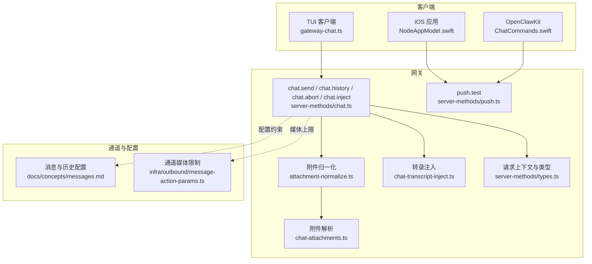
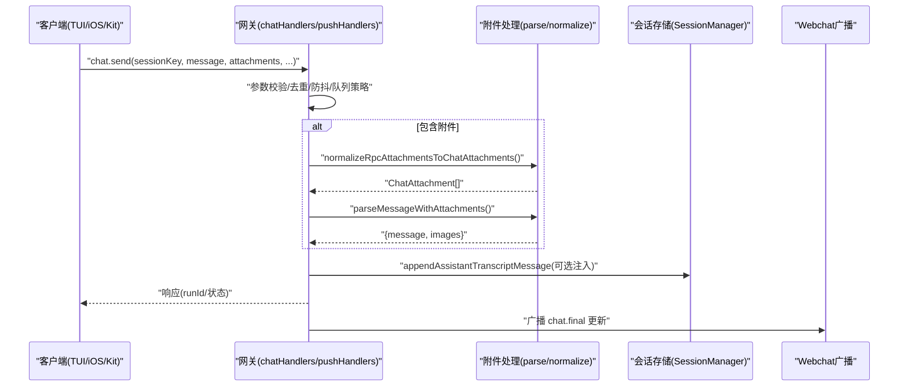
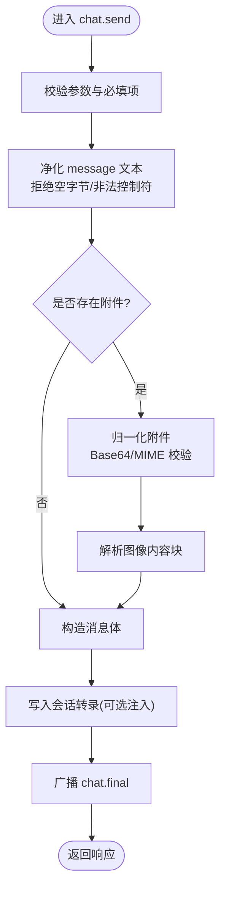
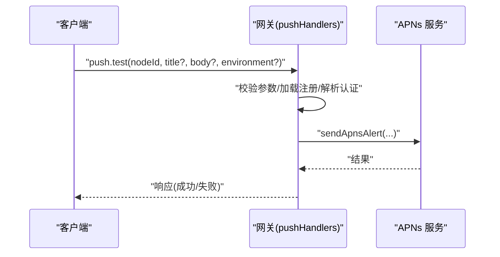
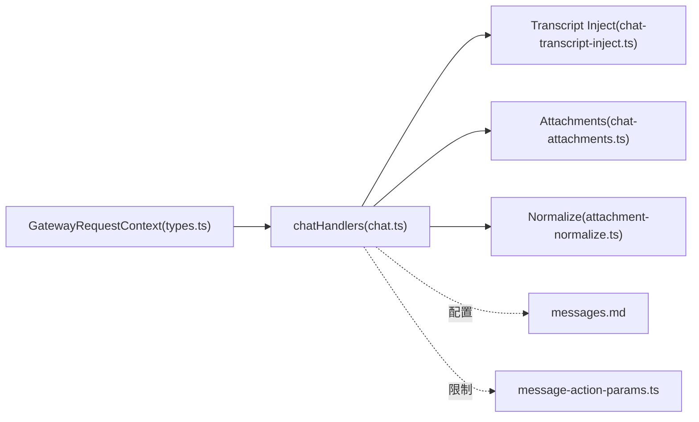

# 聊天管理

<cite>
**本文引用的文件**
- [src/gateway/server-methods/chat.ts](file://src/gateway/server-methods/chat.ts)
- [src/gateway/server-methods/push.ts](file://src/gateway/server-methods/push.ts)
- [src/gateway/server-methods/chat-transcript-inject.ts](file://src/gateway/server-methods/chat-transcript-inject.ts)
- [src/gateway/server-methods/attachment-normalize.ts](file://src/gateway/server-methods/attachment-normalize.ts)
- [src/gateway/chat-attachments.ts](file://src/gateway/chat-attachments.ts)
- [src/gateway/server-methods/types.ts](file://src/gateway/server-methods/types.ts)
- [apps/shared/OpenClawKit/Sources/OpenClawKit/ChatCommands.swift](file://apps/shared/OpenClawKit/Sources/OpenClawKit/ChatCommands.swift)
- [apps/ios/Sources/Model/NodeAppModel.swift](file://apps/ios/Sources/Model/NodeAppModel.swift)
- [src/tui/gateway-chat.ts](file://src/tui/gateway-chat.ts)
- [docs/concepts/messages.md](file://docs/concepts/messages.md)
- [src/infra/outbound/message-action-params.ts](file://src/infra/outbound/message-action-params.ts)
- [src/gateway/server-methods/push.test.ts](file://src/gateway/server-methods/push.test.ts)
- [src/gateway/server-methods/chat.inject.parentid.test.ts](file://src/gateway/server-methods/chat.inject.parentid.test.ts)
- [src/gateway/server.chat.gateway-server-chat.test.ts](file://src/gateway/server.chat.gateway-server-chat.test.ts)
</cite>

## 目录
1. [简介](#简介)
2. [项目结构](#项目结构)
3. [核心组件](#核心组件)
4. [架构总览](#架构总览)
5. [详细组件分析](#详细组件分析)
6. [依赖关系分析](#依赖关系分析)
7. [性能考量](#性能考量)
8. [故障排查指南](#故障排查指南)
9. [结论](#结论)
10. [附录：API 参考与集成指南](#附录api-参考与集成指南)

## 简介
本文件为 OpenClaw 聊天管理系统提供面向开发者的完整 API 文档，覆盖消息发送、推送通知、聊天转录注入与消息处理等核心能力。内容包括：
- 消息数据结构与发送流程
- 接收确认机制与消息状态跟踪
- 多类型消息处理、附件上传与多媒体支持
- 消息历史管理与会话语义
- 完整的 API 调用示例路径、消息格式规范与集成指南

## 项目结构
OpenClaw 的聊天相关实现主要集中在网关层（gateway server methods），并辅以通道插件、客户端 SDK 与文档说明：
- 网关 RPC 方法：chat.send、chat.history、chat.abort、chat.inject、push.test
- 附件解析与归一化：parseMessageWithAttachments、normalizeRpcAttachmentsToChatAttachments
- 转录注入：appendInjectedAssistantMessageToTranscript
- 会话与消息概念：messages.md 中对消息流、去重、防抖、分组历史、队列与流式输出的说明
- 客户端集成：TUI 客户端、iOS 应用桥接、共享 Swift SDK

**图表来源**
- [src/tui/gateway-chat.ts](file://src/tui/gateway-chat.ts#L204-L229)
- [apps/ios/Sources/Model/NodeAppModel.swift](file://apps/ios/Sources/Model/NodeAppModel.swift#L1115-L1123)
- [apps/shared/OpenClawKit/Sources/OpenClawKit/ChatCommands.swift](file://apps/shared/OpenClawKit/Sources/OpenClawKit/ChatCommands.swift#L1-L23)
- [src/gateway/server-methods/chat.ts](file://src/gateway/server-methods/chat.ts#L708-L904)
- [src/gateway/server-methods/push.ts](file://src/gateway/server-methods/push.ts#L19-L74)
- [src/gateway/server-methods/attachment-normalize.ts](file://src/gateway/server-methods/attachment-normalize.ts#L10-L32)
- [src/gateway/chat-attachments.ts](file://src/gateway/chat-attachments.ts#L97-L145)
- [src/gateway/server-methods/chat-transcript-inject.ts](file://src/gateway/server-methods/chat-transcript-inject.ts#L18-L76)
- [src/gateway/server-methods/types.ts](file://src/gateway/server-methods/types.ts#L33-L91)
- [docs/concepts/messages.md](file://docs/concepts/messages.md#L15-L155)
- [src/infra/outbound/message-action-params.ts](file://src/infra/outbound/message-action-params.ts#L74-L102)

**章节来源**
- [src/gateway/server-methods/chat.ts](file://src/gateway/server-methods/chat.ts#L1-L1248)
- [src/gateway/server-methods/push.ts](file://src/gateway/server-methods/push.ts#L1-L74)
- [src/gateway/server-methods/chat-transcript-inject.ts](file://src/gateway/server-methods/chat-transcript-inject.ts#L1-L76)
- [src/gateway/server-methods/attachment-normalize.ts](file://src/gateway/server-methods/attachment-normalize.ts#L1-L33)
- [src/gateway/chat-attachments.ts](file://src/gateway/chat-attachments.ts#L1-L185)
- [src/gateway/server-methods/types.ts](file://src/gateway/server-methods/types.ts#L1-L113)
- [apps/shared/OpenClawKit/Sources/OpenClawKit/ChatCommands.swift](file://apps/shared/OpenClawKit/Sources/OpenClawKit/ChatCommands.swift#L1-L23)
- [apps/ios/Sources/Model/NodeAppModel.swift](file://apps/ios/Sources/Model/NodeAppModel.swift#L1115-L1123)
- [src/tui/gateway-chat.ts](file://src/tui/gateway-chat.ts#L204-L229)
- [docs/concepts/messages.md](file://docs/concepts/messages.md#L1-L155)
- [src/infra/outbound/message-action-params.ts](file://src/infra/outbound/message-action-params.ts#L74-L102)

## 核心组件
- chatHandlers：网关侧聊天 RPC 方法集合，负责消息发送、历史读取、运行中止与转录注入。
- pushHandlers：推送测试方法，用于 iOS 设备的 APNs 推送验证。
- 附件处理链：RPC 附件输入归一化 → Base64 解码估算与校验 → MIME 类型嗅探与过滤 → 结构化图像块生成。
- 转录注入：通过 SessionManager 将注入的消息以“assistant”角色写入当前会话叶节点，保持 parentId 连接，避免破坏压缩历史。

**章节来源**
- [src/gateway/server-methods/chat.ts](file://src/gateway/server-methods/chat.ts#L708-L904)
- [src/gateway/server-methods/push.ts](file://src/gateway/server-methods/push.ts#L19-L74)
- [src/gateway/server-methods/attachment-normalize.ts](file://src/gateway/server-methods/attachment-normalize.ts#L10-L32)
- [src/gateway/chat-attachments.ts](file://src/gateway/chat-attachments.ts#L97-L145)
- [src/gateway/server-methods/chat-transcript-inject.ts](file://src/gateway/server-methods/chat-transcript-inject.ts#L18-L76)

## 架构总览
下图展示从客户端到网关再到通道与存储的关键交互路径，以及消息在系统内的状态流转。

**图表来源**
- [src/gateway/server-methods/chat.ts](file://src/gateway/server-methods/chat.ts#L863-L904)
- [src/gateway/server-methods/attachment-normalize.ts](file://src/gateway/server-methods/attachment-normalize.ts#L10-L32)
- [src/gateway/chat-attachments.ts](file://src/gateway/chat-attachments.ts#L97-L145)
- [src/gateway/server-methods/chat-transcript-inject.ts](file://src/gateway/server-methods/chat-transcript-inject.ts#L18-L76)
- [src/gateway/server-methods/chat.ts](file://src/gateway/server-methods/chat.ts#L667-L707)

## 详细组件分析

### 组件A：消息发送(chat.send)
- 输入参数要点
  - sessionKey：会话键，决定消息归属与路由
  - message：文本内容，将进行 NFC 规范化与控制字符清理
  - attachments：RPC 附件数组，将被归一化为 ChatAttachment 并解析为图像内容块
  - deliver：是否外发至渠道
  - timeoutMs/idempotencyKey：超时与幂等键
- 处理流程
  - 参数校验与错误响应
  - 文本净化与空字节拒绝
  - 附件归一化与 Base64 校验、MIME 嗅探与过滤
  - 构造消息体并写入会话转录（必要时）
  - 广播 chat.final 事件，供 Webchat 即时更新 UI
- 返回值
  - 成功返回 { ok: true, runId 或 messageId }
  - 失败返回 { ok: false, error }

**图表来源**
- [src/gateway/server-methods/chat.ts](file://src/gateway/server-methods/chat.ts#L863-L904)
- [src/gateway/server-methods/attachment-normalize.ts](file://src/gateway/server-methods/attachment-normalize.ts#L10-L32)
- [src/gateway/chat-attachments.ts](file://src/gateway/chat-attachments.ts#L97-L145)
- [src/gateway/server-methods/chat-transcript-inject.ts](file://src/gateway/server-methods/chat-transcript-inject.ts#L18-L76)

**章节来源**
- [src/gateway/server-methods/chat.ts](file://src/gateway/server-methods/chat.ts#L863-L904)
- [src/gateway/server-methods/chat.ts](file://src/gateway/server-methods/chat.ts#L667-L707)
- [src/gateway/server.chat.gateway-server-chat.test.ts](file://src/gateway/server.chat.gateway-server-chat.test.ts#L144-L173)

### 组件B：消息历史(chat.history)
- 功能概述
  - 读取指定会话的历史消息，支持 limit 与字节预算控制
  - 对历史消息进行可见性裁剪、大小截断与占位替换
  - 返回 thinkingLevel 与 verboseLevel 以指导前端渲染
- 关键点
  - 最大返回条数与单条消息字节数限制
  - 历史消息的“占位符”替换与统计计数
  - 去除敏感字段（usage/cost/details）以保护隐私

**章节来源**
- [src/gateway/server-methods/chat.ts](file://src/gateway/server-methods/chat.ts#L709-L771)
- [docs/concepts/messages.md](file://docs/concepts/messages.md#L82-L110)

### 组件C：运行中止(chat.abort)
- 功能概述
  - 支持按 sessionKey 或 runId 中止运行
  - 收集未完成片段并写入转录，标记为“已中止”
  - 广播 error/final 状态，确保 UI 与下游一致
- 幂等与一致性
  - 中止后会持久化部分输出，避免丢失中间结果

**章节来源**
- [src/gateway/server-methods/chat.ts](file://src/gateway/server-methods/chat.ts#L772-L800)
- [src/gateway/server-methods/chat.ts](file://src/gateway/server-methods/chat.ts#L634-L659)

### 组件D：转录注入(chat.inject)
- 功能概述
  - 将由网关或外部系统注入的“assistant”消息追加到当前会话叶节点
  - 使用 SessionManager 保证 parentId 链接不被破坏
  - 支持 idempotencyKey 与可选的中止元信息
- 测试保障
  - 单测确保注入消息包含 parentId 字段，防止压缩历史丢失

**章节来源**
- [src/gateway/server-methods/chat.ts](file://src/gateway/server-methods/chat.ts#L1202-L1247)
- [src/gateway/server-methods/chat-transcript-inject.ts](file://src/gateway/server-methods/chat-transcript-inject.ts#L18-L76)
- [src/gateway/server-methods/chat.inject.parentid.test.ts](file://src/gateway/server-methods/chat.inject.parentid.test.ts#L9-L36)

### 组件E：推送通知(push.test)
- 功能概述
  - 为指定 nodeId 发送 APNs 推送测试
  - 自动加载设备注册信息与认证配置
  - 支持环境覆盖与错误处理
- 典型用途
  - iOS 节点首次配对后的连通性验证
  - 集成测试与运维诊断

**图表来源**
- [src/gateway/server-methods/push.ts](file://src/gateway/server-methods/push.ts#L19-L74)

**章节来源**
- [src/gateway/server-methods/push.ts](file://src/gateway/server-methods/push.ts#L19-L74)
- [src/gateway/server-methods/push.test.ts](file://src/gateway/server-methods/push.test.ts#L1-L45)

### 组件F：附件上传与多媒体支持
- 附件输入归一化
  - 支持 type/mimeType/fileName/content
  - 自动将 ArrayBuffer/TypedArray 转为 base64
- 图像解析
  - Base64 校验与大小限制（默认 5MB）
  - MIME 嗅探与类型一致性检查
  - 输出结构化图像块，兼容多模型 API
- 多媒体发送策略
  - 通道级媒体上限优先于全局默认
  - 支持分条发送带标题的媒体序列

**章节来源**
- [src/gateway/server-methods/attachment-normalize.ts](file://src/gateway/server-methods/attachment-normalize.ts#L10-L32)
- [src/gateway/chat-attachments.ts](file://src/gateway/chat-attachments.ts#L97-L145)
- [src/infra/outbound/message-action-params.ts](file://src/infra/outbound/message-action-params.ts#L74-L102)

## 依赖关系分析
- 请求上下文与广播
  - GatewayRequestContext 提供广播、节点订阅、会话发送等能力，支撑 chat.final 与错误广播
- 会话与转录
  - 通过 SessionManager 写入转录，确保注入消息与压缩历史一致
- 通道与配置
  - 消息流、去重、防抖、分组历史与队列策略由配置驱动
  - 媒体上限由通道/账户/全局配置共同决定

**图表来源**
- [src/gateway/server-methods/types.ts](file://src/gateway/server-methods/types.ts#L33-L91)
- [src/gateway/server-methods/chat.ts](file://src/gateway/server-methods/chat.ts#L1-L1248)
- [src/gateway/server-methods/chat-transcript-inject.ts](file://src/gateway/server-methods/chat-transcript-inject.ts#L1-L76)
- [src/gateway/chat-attachments.ts](file://src/gateway/chat-attachments.ts#L1-L185)
- [src/gateway/server-methods/attachment-normalize.ts](file://src/gateway/server-methods/attachment-normalize.ts#L1-L33)
- [docs/concepts/messages.md](file://docs/concepts/messages.md#L15-L155)
- [src/infra/outbound/message-action-params.ts](file://src/infra/outbound/message-action-params.ts#L74-L102)

**章节来源**
- [src/gateway/server-methods/types.ts](file://src/gateway/server-methods/types.ts#L1-L113)
- [src/gateway/server-methods/chat.ts](file://src/gateway/server-methods/chat.ts#L1-L1248)

## 性能考量
- 历史消息裁剪
  - 单条消息与整体数组字节预算控制，避免过载
  - 对超限消息使用占位符替换，并记录统计
- 附件处理
  - Base64 解码前的最小校验，避免大对象解码开销
  - MIME 嗅探仅在需要时执行，减少 IO
- 广播与 UI 更新
  - chat.final 仅在最终态广播，降低冗余更新

[本节为通用建议，无需列出具体文件来源]

## 故障排查指南
- 常见错误与定位
  - INVALID_REQUEST：参数校验失败、空消息、空字节、无有效附件
  - UNAVAILABLE：写入转录或发送 APNs 异常
- 调试建议
  - 查看网关日志中的占位符统计与警告
  - 在客户端使用 TUI 的 chat.history 验证历史截断与可见性
  - 使用 push.test 验证 iOS 节点注册与 APNs 配置

**章节来源**
- [src/gateway/server-methods/chat.ts](file://src/gateway/server-methods/chat.ts#L709-L771)
- [src/gateway/server-methods/push.ts](file://src/gateway/server-methods/push.ts#L19-L74)
- [src/gateway/server-methods/push.test.ts](file://src/gateway/server-methods/push.test.ts#L1-L45)

## 结论
OpenClaw 的聊天管理通过统一的网关 RPC 方法与严格的附件/历史处理机制，实现了跨通道的一致消息体验。关键特性包括：
- 明确的消息生命周期与状态广播
- 严谨的附件解析与媒体上限控制
- 注入消息的转录一致性保障
- 可配置的队列、去重与流式输出策略

[本节为总结性内容，无需列出具体文件来源]

## 附录：API 参考与集成指南

### API 方法一览
- chat.send
  - 描述：发送消息并可选择外发至渠道；支持附件与幂等键
  - 典型调用路径：[src/tui/gateway-chat.ts](file://src/tui/gateway-chat.ts#L204-L215)
  - 参数要点：sessionKey、message、attachments、deliver、timeoutMs、idempotencyKey
  - 返回：runId 或 messageId
- chat.history
  - 描述：读取会话历史，支持 limit 与字节预算
  - 典型调用路径：[src/tui/gateway-chat.ts](file://src/tui/gateway-chat.ts#L224-L229)
  - 返回：messages、thinkingLevel、verboseLevel
- chat.abort
  - 描述：中止运行并将未完成片段写入转录
  - 典型调用路径：[src/tui/gateway-chat.ts](file://src/tui/gateway-chat.ts#L217-L222)
- chat.inject
  - 描述：注入 assistant 消息并保持 parentId 链接
  - 实现参考：[src/gateway/server-methods/chat.ts](file://src/gateway/server-methods/chat.ts#L1202-L1247)
- push.test
  - 描述：向 iOS 节点发送推送测试
  - 典型调用路径：[apps/ios/Sources/Model/NodeAppModel.swift](file://apps/ios/Sources/Model/NodeAppModel.swift#L1115-L1123)
  - 返回：推送结果

**章节来源**
- [src/tui/gateway-chat.ts](file://src/tui/gateway-chat.ts#L204-L229)
- [apps/ios/Sources/Model/NodeAppModel.swift](file://apps/ios/Sources/Model/NodeAppModel.swift#L1115-L1123)
- [src/gateway/server-methods/chat.ts](file://src/gateway/server-methods/chat.ts#L708-L904)
- [src/gateway/server-methods/chat.ts](file://src/gateway/server-methods/chat.ts#L1202-L1247)
- [src/gateway/server-methods/push.ts](file://src/gateway/server-methods/push.ts#L19-L74)

### 消息数据结构与格式
- 附件输入(ChatAttachment)
  - 字段：type、mimeType、fileName、content(Base64 字符串)
  - 归一化：[src/gateway/server-methods/attachment-normalize.ts](file://src/gateway/server-methods/attachment-normalize.ts#L10-L32)
- 图像内容块(ChatImageContent)
  - 字段：type、data(Base64)、mimeType
  - 解析：[src/gateway/chat-attachments.ts](file://src/gateway/chat-attachments.ts#L11-L15)
- 历史消息裁剪
  - 文本截断、占位符替换、去除敏感字段
  - 实现参考：[src/gateway/server-methods/chat.ts](file://src/gateway/server-methods/chat.ts#L242-L325)

**章节来源**
- [src/gateway/server-methods/attachment-normalize.ts](file://src/gateway/server-methods/attachment-normalize.ts#L10-L32)
- [src/gateway/chat-attachments.ts](file://src/gateway/chat-attachments.ts#L11-L15)
- [src/gateway/server-methods/chat.ts](file://src/gateway/server-methods/chat.ts#L242-L325)

### 发送流程与接收确认
- 发送流程
  - 参数校验 → 文本净化 → 附件归一化与解析 → 写入转录 → 广播 chat.final
- 接收确认
  - 客户端通过 chat.history 获取最新消息
  - Webchat 通过广播实时更新 UI

**章节来源**
- [src/gateway/server-methods/chat.ts](file://src/gateway/server-methods/chat.ts#L667-L707)
- [src/tui/gateway-chat.ts](file://src/tui/gateway-chat.ts#L224-L229)

### 消息状态跟踪
- 状态枚举
  - final：最终态，携带消息体
  - error：错误态，携带错误信息
- 追踪方式
  - 通过 agentRunSeq 递增序号
  - 通过 runId 与 sessionKey 关联

**章节来源**
- [src/gateway/server-methods/chat.ts](file://src/gateway/server-methods/chat.ts#L667-L707)
- [src/gateway/server-methods/types.ts](file://src/gateway/server-methods/types.ts#L60-L66)

### 不同类型消息的处理方式
- 文本消息：直接净化与写入
- 附件消息：Base64 校验与 MIME 嗅探，仅保留图像
- 控制命令：绕过防抖，独立触发
- 分组消息：自动添加发送者标签，保持提示词一致性

**章节来源**
- [docs/concepts/messages.md](file://docs/concepts/messages.md#L45-L110)
- [src/gateway/server-methods/chat.ts](file://src/gateway/server-methods/chat.ts#L863-L904)

### 附件上传与多媒体支持
- 上传规范
  - content 必须为 Base64 字符串
  - 默认最大 5MB，通道/账户可覆盖
- 多媒体发送
  - 逐条发送，首条可带标题
  - 通道媒体上限优先级：账户 > 通道 > 全局

**章节来源**
- [src/gateway/chat-attachments.ts](file://src/gateway/chat-attachments.ts#L97-L145)
- [src/infra/outbound/message-action-params.ts](file://src/infra/outbound/message-action-params.ts#L74-L102)

### 消息历史管理
- 读取策略
  - 支持 limit 与字节预算，自动截断与占位
- 历史缓冲
  - 仅包含未触发运行的消息，排除已写入转录的消息
- 配置项
  - messages.groupChat.historyLimit、通道覆盖

**章节来源**
- [src/gateway/server-methods/chat.ts](file://src/gateway/server-methods/chat.ts#L709-L771)
- [docs/concepts/messages.md](file://docs/concepts/messages.md#L82-L110)

### 客户端集成示例路径
- TUI 客户端
  - 发送：[src/tui/gateway-chat.ts](file://src/tui/gateway-chat.ts#L204-L215)
  - 中止：[src/tui/gateway-chat.ts](file://src/tui/gateway-chat.ts#L217-L222)
  - 历史：[src/tui/gateway-chat.ts](file://src/tui/gateway-chat.ts#L224-L229)
- iOS 应用桥接
  - chat.push 命令参数校验与错误返回
  - 参考：[apps/ios/Sources/Model/NodeAppModel.swift](file://apps/ios/Sources/Model/NodeAppModel.swift#L1115-L1123)
- 共享 Swift SDK
  - chat.push 命令与参数结构
  - 参考：[apps/shared/OpenClawKit/Sources/OpenClawKit/ChatCommands.swift](file://apps/shared/OpenClawKit/Sources/OpenClawKit/ChatCommands.swift#L1-L23)

**章节来源**
- [src/tui/gateway-chat.ts](file://src/tui/gateway-chat.ts#L204-L229)
- [apps/ios/Sources/Model/NodeAppModel.swift](file://apps/ios/Sources/Model/NodeAppModel.swift#L1115-L1123)
- [apps/shared/OpenClawKit/Sources/OpenClawKit/ChatCommands.swift](file://apps/shared/OpenClawKit/Sources/OpenClawKit/ChatCommands.swift#L1-L23)