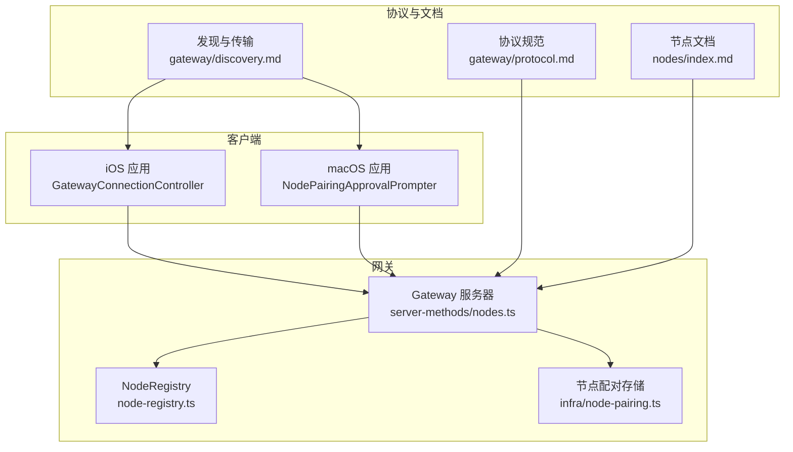
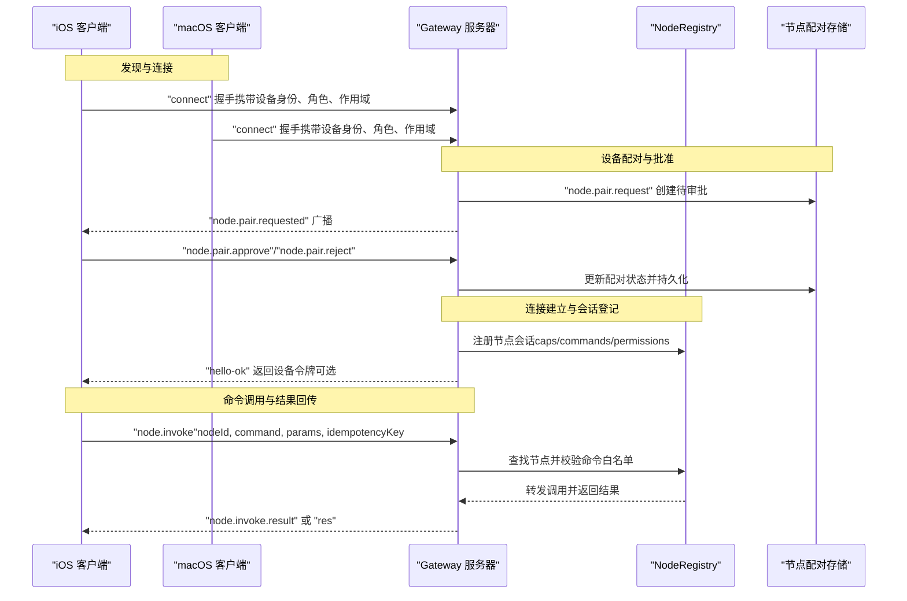
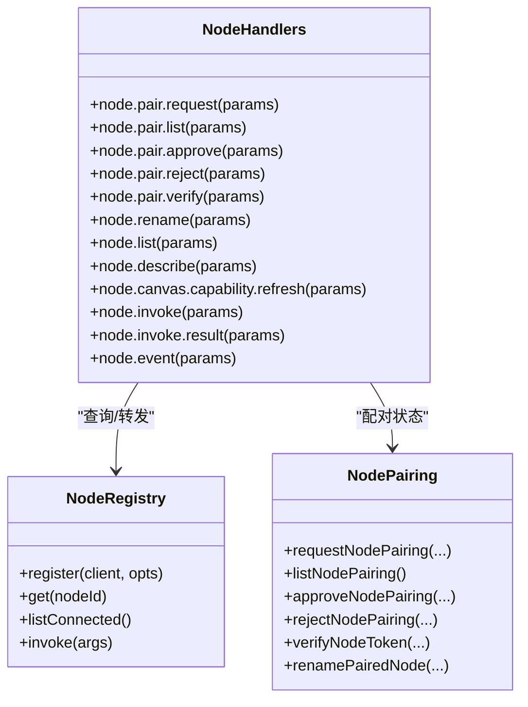
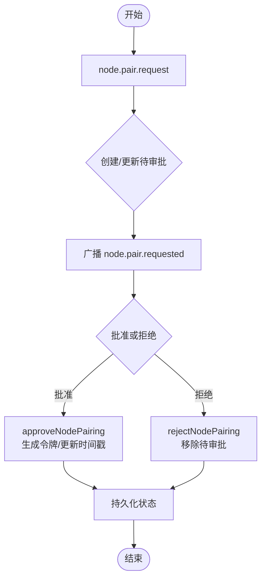
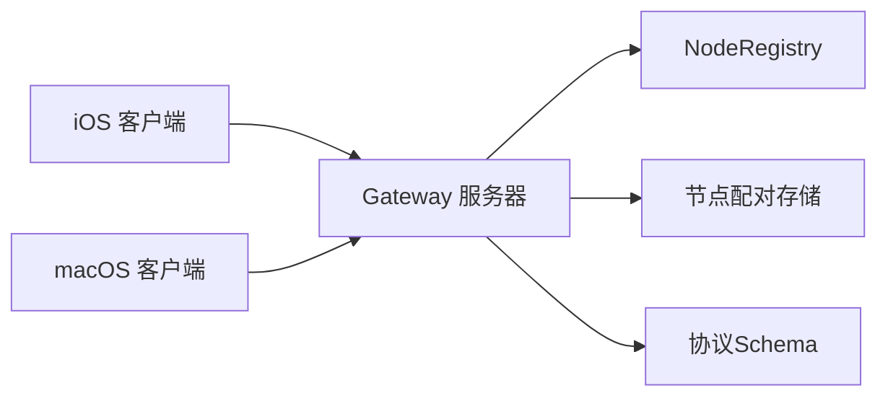

# 节点管理

<cite>
**本文引用的文件**
- [docs/nodes/index.md](file://docs/nodes/index.md)
- [docs/nodes/troubleshooting.md](file://docs/nodes/troubleshooting.md)
- [docs/nodes/camera.md](file://docs/nodes/camera.md)
- [docs/nodes/media-understanding.md](file://docs/nodes/media-understanding.md)
- [docs/gateway/discovery.md](file://docs/gateway/discovery.md)
- [docs/gateway/protocol.md](file://docs/gateway/protocol.md)
- [src/gateway/server-methods/nodes.ts](file://src/gateway/server-methods/nodes.ts)
- [src/gateway/protocol/schema/nodes.ts](file://src/gateway/protocol/schema/nodes.ts)
- [src/gateway/node-registry.ts](file://src/gateway/node-registry.ts)
- [src/infra/node-pairing.ts](file://src/infra/node-pairing.ts)
- [apps/macos/Sources/OpenClaw/NodePairingApprovalPrompter.swift](file://apps/macos/Sources/OpenClaw/NodePairingApprovalPrompter.swift)
- [apps/ios/Sources/Gateway/GatewayConnectionController.swift](file://apps/ios/Sources/Gateway/GatewayConnectionController.swift)
- [src/cli/nodes-cli/register.status.ts](file://src/cli/nodes-cli/register.status.ts)
- [src/commands/status.daemon.ts](file://src/commands/status.daemon.ts)
</cite>

## 目录
1. [简介](#简介)
2. [项目结构](#项目结构)
3. [核心组件](#核心组件)
4. [架构总览](#架构总览)
5. [详细组件分析](#详细组件分析)
6. [依赖关系分析](#依赖关系分析)
7. [性能考量](#性能考量)
8. [故障排查指南](#故障排查指南)
9. [结论](#结论)
10. [附录](#附录)

## 简介
本文件面向OpenClaw节点管理系统，系统化梳理设备节点管理、节点通信、节点状态监控与节点操作等核心能力，覆盖节点发现机制、连接建立流程、数据传输协议、节点生命周期管理、节点类型分类、通信协议规范、状态同步机制与故障恢复策略，并提供API调用示例、节点集成指南与网络拓扑管理建议。

## 项目结构
OpenClaw将“网关控制平面+节点承载”的能力以统一的WebSocket协议实现，节点侧通过设备配对与角色声明接入，网关侧集中进行配对决策、命令白名单与状态同步。关键位置如下：
- 文档层：节点概览、故障排查、相机/媒体理解、发现与协议等
- 网关服务端：节点RPC方法、节点注册表、节点命令策略与清理
- 基础设施：节点配对存储与批准/拒绝流程
- 客户端（macOS/iOS）：发现与连接控制器、配对提示器
- CLI：节点状态、描述、调用、重命名等命令

**图表来源**
- [src/gateway/server-methods/nodes.ts](file://src/gateway/server-methods/nodes.ts#L267-L800)
- [src/gateway/node-registry.ts](file://src/gateway/node-registry.ts#L38-L79)
- [src/infra/node-pairing.ts](file://src/infra/node-pairing.ts#L128-L210)
- [apps/ios/Sources/Gateway/GatewayConnectionController.swift](file://apps/ios/Sources/Gateway/GatewayConnectionController.swift#L20-L46)
- [apps/macos/Sources/OpenClaw/NodePairingApprovalPrompter.swift](file://apps/macos/Sources/OpenClaw/NodePairingApprovalPrompter.swift#L323-L357)
- [docs/gateway/discovery.md](file://docs/gateway/discovery.md#L1-L124)
- [docs/gateway/protocol.md](file://docs/gateway/protocol.md#L1-L257)
- [docs/nodes/index.md](file://docs/nodes/index.md#L1-L374)

**章节来源**
- [docs/nodes/index.md](file://docs/nodes/index.md#L1-L374)
- [docs/gateway/discovery.md](file://docs/gateway/discovery.md#L1-L124)
- [docs/gateway/protocol.md](file://docs/gateway/protocol.md#L1-L257)

## 核心组件
- 节点RPC方法集：提供节点配对、列表、描述、调用、事件、画布能力刷新等接口
- 节点注册表：维护已连接节点会话、命令白名单、权限映射与路径环境
- 节点配对存储：持久化待审批/已批准节点请求，支持批准/拒绝/验证/重命名
- 发现与传输：Bonjour/Tailscale/SSH多路输入，统一WS作为控制面与节点承载面
- 协议规范：握手、帧格式、角色/作用域、版本与认证、设备身份与迁移

**章节来源**
- [src/gateway/server-methods/nodes.ts](file://src/gateway/server-methods/nodes.ts#L267-L800)
- [src/gateway/node-registry.ts](file://src/gateway/node-registry.ts#L1-L79)
- [src/infra/node-pairing.ts](file://src/infra/node-pairing.ts#L128-L210)
- [docs/gateway/discovery.md](file://docs/gateway/discovery.md#L1-L124)
- [docs/gateway/protocol.md](file://docs/gateway/protocol.md#L1-L257)

## 架构总览
下图展示从客户端到网关再到节点的完整交互链路，包括发现、配对、连接、命令转发与结果回传。

**图表来源**
- [src/gateway/server-methods/nodes.ts](file://src/gateway/server-methods/nodes.ts#L267-L800)
- [src/gateway/node-registry.ts](file://src/gateway/node-registry.ts#L38-L79)
- [src/infra/node-pairing.ts](file://src/infra/node-pairing.ts#L128-L210)
- [docs/gateway/protocol.md](file://docs/gateway/protocol.md#L22-L91)

## 详细组件分析

### 节点RPC方法与API定义
- 节点配对
  - 请求配对：node.pair.request
  - 列出待审批：node.pair.list
  - 批准/拒绝：node.pair.approve / node.pair.reject
  - 验证令牌：node.pair.verify
- 节点管理
  - 列表：node.list（合并配对与在线状态）
  - 描述：node.describe（聚合配对与在线信息）
  - 重命名：node.rename
- 节点能力
  - 画布能力刷新：node.canvas.capability.refresh
- 节点调用与事件
  - 调用：node.invoke（含幂等键、超时、命令白名单校验）
  - 结果：node.invoke.result
  - 事件：node.event

**图表来源**
- [src/gateway/server-methods/nodes.ts](file://src/gateway/server-methods/nodes.ts#L267-L800)
- [src/gateway/node-registry.ts](file://src/gateway/node-registry.ts#L38-L79)
- [src/infra/node-pairing.ts](file://src/infra/node-pairing.ts#L128-L210)

**章节来源**
- [src/gateway/server-methods/nodes.ts](file://src/gateway/server-methods/nodes.ts#L267-L800)
- [src/gateway/protocol/schema/nodes.ts](file://src/gateway/protocol/schema/nodes.ts#L44-L101)

### 节点注册表与会话模型
- 会话字段：nodeId、connId、displayName、platform、version、core/uiVersion、deviceFamily、modelIdentifier、remoteIp、caps、commands、permissions、pathEnv、connectedAtMs
- 关键行为：注册、按nodeId/connId映射、挂起调用队列、结果解析与安全JSON解析

**章节来源**
- [src/gateway/node-registry.ts](file://src/gateway/node-registry.ts#L1-L79)

### 节点配对存储与批准流程
- 请求创建：去重、修复模式标记、持久化
- 批准：生成设备令牌、更新时间戳、写入持久化
- 拒绝：删除待审批项
- 验证：令牌校验
- 重命名：更新显示名

**图表来源**
- [src/infra/node-pairing.ts](file://src/infra/node-pairing.ts#L128-L210)

**章节来源**
- [src/infra/node-pairing.ts](file://src/infra/node-pairing.ts#L128-L210)

### 发现与传输机制
- Bonjour：局域网内自动发现，TXT键包含角色、端口、TLS指纹等
- Tailscale：跨网络直连，优先使用MagicDNS
- SSH：通用回退方案，通过端口转发访问本地回环端口
- 传输选择策略：优先直连，其次Bonjour，再TAILNET，最后SSH

**章节来源**
- [docs/gateway/discovery.md](file://docs/gateway/discovery.md#L1-L124)

### 协议与认证
- WebSocket文本帧，首帧必须是connect请求
- 角色：operator（控制面）、node（能力承载）
- 作用域：operator.read/write/admin/approvals/pairing
- 设备身份：稳定设备指纹、签名挑战、迁移兼容
- 认证：网关令牌或设备令牌；TLS指纹可选固定

**章节来源**
- [docs/gateway/protocol.md](file://docs/gateway/protocol.md#L1-L257)

### 节点类型与命令族
- 节点类型：iOS/Android/macOS应用/Headless节点主机
- 命令族（示例）：canvas.*、camera.*、screen.*、location.*、system.run/which/execApprovals、device.*、notifications.*、photos.*、contacts.*、calendar.*、motion.*、app.update等
- 权限矩阵：如camera、screen、location、system.run等均受权限/前台状态/允许清单约束

**章节来源**
- [docs/nodes/index.md](file://docs/nodes/index.md#L1-L374)
- [docs/nodes/camera.md](file://docs/nodes/camera.md#L1-L163)
- [docs/nodes/media-understanding.md](file://docs/nodes/media-understanding.md#L1-L388)

### 状态同步与健康检查
- 节点状态：paired（已配对）、connected（已连接）、displayName、platform、version、caps、commands、permissions、remoteIp、connectedAtMs
- CLI状态输出：节点表格、权限格式化、版本与路径环境展示
- 健康快照：支持解码与降噪日志，辅助诊断

**章节来源**
- [src/cli/nodes-cli/register.status.ts](file://src/cli/nodes-cli/register.status.ts#L164-L253)
- [src/commands/status.daemon.ts](file://src/commands/status.daemon.ts#L1-L43)

## 依赖关系分析
- 客户端依赖：iOS/macOS应用负责发现与连接，发送connect请求并处理配对广播
- 网关依赖：server-methods/nodes.ts依赖NodeRegistry与节点命令策略，依赖infra/node-pairing.ts进行配对状态管理
- 协议依赖：统一的TypeBox Schema定义参数与结果，确保跨语言一致性

**图表来源**
- [src/gateway/server-methods/nodes.ts](file://src/gateway/server-methods/nodes.ts#L267-L800)
- [src/gateway/protocol/schema/nodes.ts](file://src/gateway/protocol/schema/nodes.ts#L44-L101)
- [src/gateway/node-registry.ts](file://src/gateway/node-registry.ts#L38-L79)
- [src/infra/node-pairing.ts](file://src/infra/node-pairing.ts#L128-L210)

**章节来源**
- [src/gateway/server-methods/nodes.ts](file://src/gateway/server-methods/nodes.ts#L267-L800)
- [src/gateway/protocol/schema/nodes.ts](file://src/gateway/protocol/schema/nodes.ts#L44-L101)

## 性能考量
- 调用超时与幂等键：node.invoke支持超时与幂等键，避免重复副作用
- 命令白名单：在网关侧强制执行，减少节点误用与越权风险
- 画布能力令牌：按会话签发短期令牌，降低长期凭证暴露风险
- 状态排序与去重：node.list按连接状态与名称排序，提升UI体验

[本节为通用指导，无需特定文件来源]

## 故障排查指南
- 命令阶梯：先看status/gateway status/logs/doctor/channels status，再核对nodes status/describe/approvals
- 前台要求：iOS/Android的canvas/camera/screen需前台运行，否则返回“后台不可用”
- 权限矩阵：不同平台与能力对应不同权限，缺失将返回“权限不足”
- 配对与审批：区分“设备配对”和“执行审批”，前者决定能否连上，后者决定能否执行system.run
- 常见错误码：NODE_BACKGROUND_UNAVAILABLE、CAMERA_DISABLED、*_PERMISSION_REQUIRED、LOCATION_*、SYSTEM_RUN_DENIED等

**章节来源**
- [docs/nodes/troubleshooting.md](file://docs/nodes/troubleshooting.md#L1-L115)

## 结论
OpenClaw通过统一的WebSocket协议与严格的节点配对、命令白名单与权限矩阵，实现了跨平台节点的可靠管理。结合Bonjour/Tailscale/SSH的发现与传输策略，以及完善的故障排查与健康检查机制，能够满足从个人到分布式场景下的节点编排需求。

[本节为总结性内容，无需特定文件来源]

## 附录

### API参考与调用示例（路径指引）
- 节点配对
  - 请求配对：[nodeHandlers.node.pair.request](file://src/gateway/server-methods/nodes.ts#L268-L313)
  - 列出待审批：[nodeHandlers.node.pair.list](file://src/gateway/server-methods/nodes.ts#L314-L327)
  - 批准/拒绝：[nodeHandlers.node.pair.approve](file://src/gateway/server-methods/nodes.ts#L328-L356)、[nodeHandlers.node.pair.reject](file://src/gateway/server-methods/nodes.ts#L357-L385)
  - 验证令牌：[nodeHandlers.node.pair.verify](file://src/gateway/server-methods/nodes.ts#L386-L403)
- 节点管理
  - 列表/描述/重命名：[nodeHandlers.node.list](file://src/gateway/server-methods/nodes.ts#L431-L511)、[nodeHandlers.node.describe](file://src/gateway/server-methods/nodes.ts#L512-L565)、[nodeHandlers.node.rename](file://src/gateway/server-methods/nodes.ts#L404-L430)
- 能力与调用
  - 画布能力刷新：[nodeHandlers.node.canvas.capability.refresh](file://src/gateway/server-methods/nodes.ts#L566-L610)
  - 调用与结果：[nodeHandlers.node.invoke](file://src/gateway/server-methods/nodes.ts#L611-L791)、[nodeHandlers.node.invoke.result](file://src/gateway/server-methods/nodes.ts#L791-L791)
- 参数Schema
  - 节点列表/描述/调用/事件：[nodes.ts（schema）](file://src/gateway/protocol/schema/nodes.ts#L44-L101)

**章节来源**
- [src/gateway/server-methods/nodes.ts](file://src/gateway/server-methods/nodes.ts#L267-L800)
- [src/gateway/protocol/schema/nodes.ts](file://src/gateway/protocol/schema/nodes.ts#L44-L101)

### 节点集成指南
- 客户端实现要点
  - 发现：Bonjour/Tailscale/SSH三路输入，优先直连，其次Bonjour，再TAILNET，最后SSH
  - 连接：发送connect请求，包含设备身份、角色、作用域、能力声明与权限映射
  - 配对：监听node.pair.requested广播，UI中呈现批准/拒绝操作
  - 调用：构造node.invoke请求，设置幂等键与超时，接收node.invoke.result
- 网关配置要点
  - 启用/禁用Bonjour、设置绑定模式、TLS指纹固定
  - 配置节点命令白名单与执行审批策略
  - 监控节点状态与健康快照，及时告警

**章节来源**
- [docs/gateway/discovery.md](file://docs/gateway/discovery.md#L1-L124)
- [docs/gateway/protocol.md](file://docs/gateway/protocol.md#L1-L257)
- [apps/ios/Sources/Gateway/GatewayConnectionController.swift](file://apps/ios/Sources/Gateway/GatewayConnectionController.swift#L20-L46)
- [apps/macos/Sources/OpenClaw/NodePairingApprovalPrompter.swift](file://apps/macos/Sources/OpenClaw/NodePairingApprovalPrompter.swift#L323-L357)

### 网络拓扑管理建议
- 局域网优先：启用Bonjour，自动发现同网关节点
- 跨网络：优先Tailscale直连，无可用时使用SSH回退
- 安全加固：TLS指纹固定、设备令牌轮换、命令白名单与执行审批
- 可观测性：定期查看节点状态、健康快照与日志，快速定位问题

**章节来源**
- [docs/gateway/discovery.md](file://docs/gateway/discovery.md#L1-L124)
- [docs/nodes/index.md](file://docs/nodes/index.md#L1-L374)