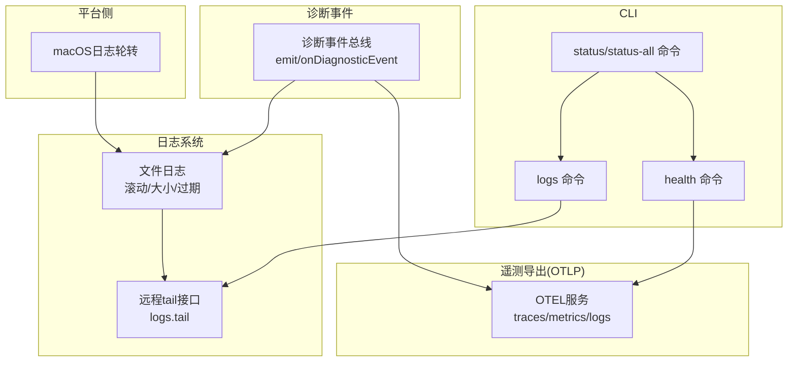
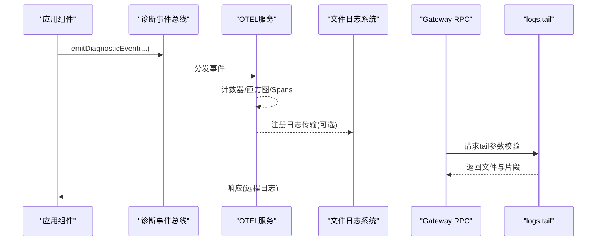
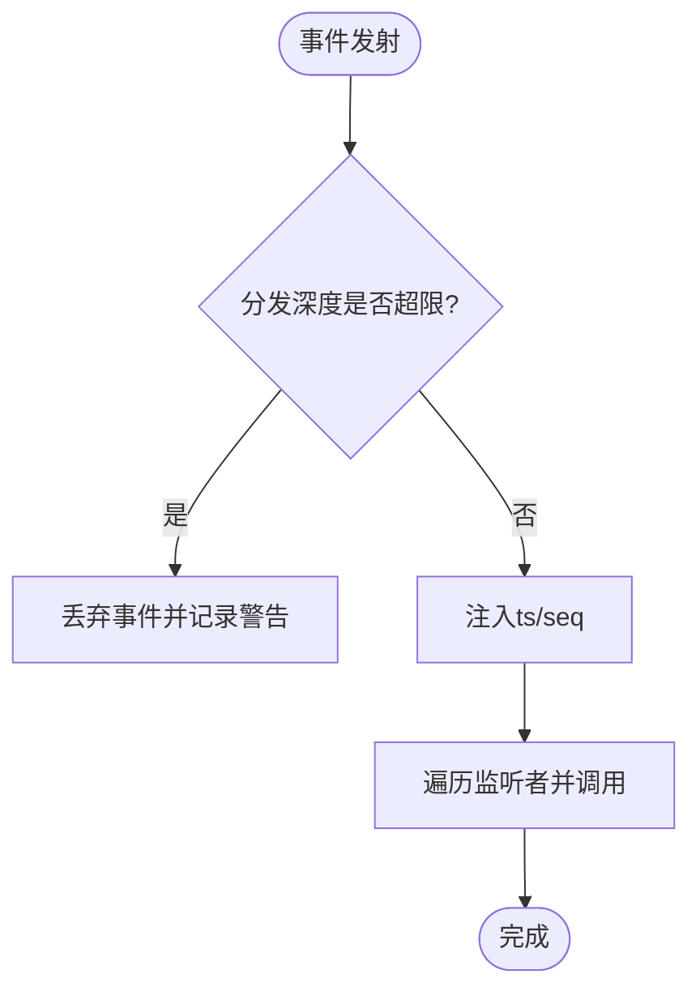
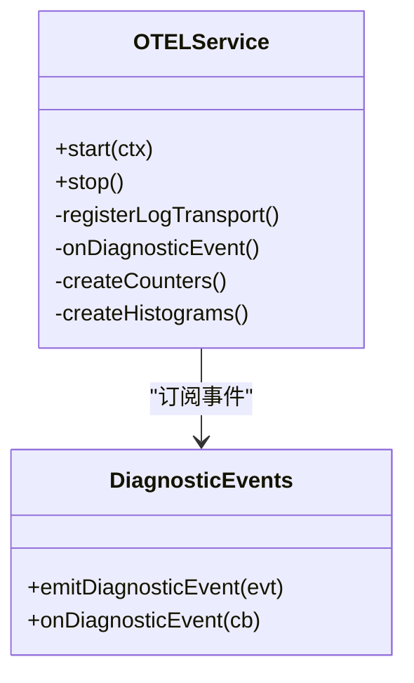
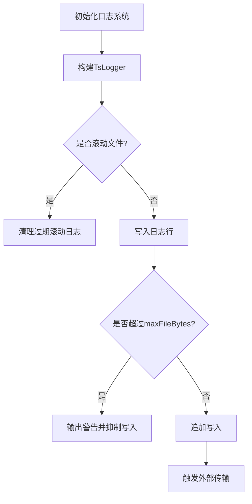
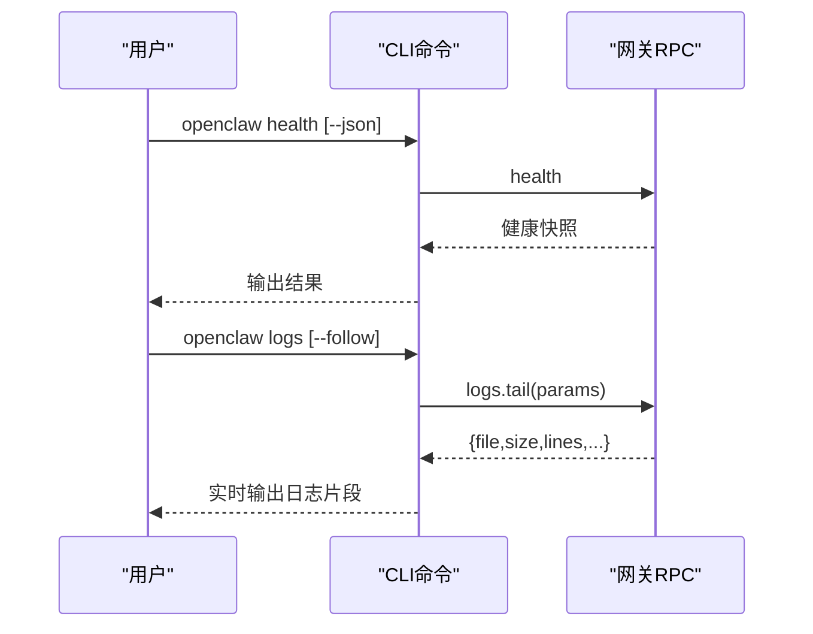
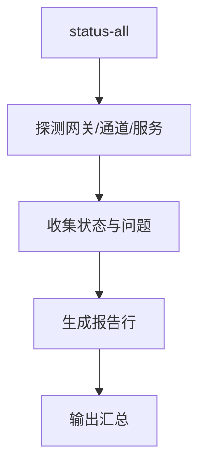
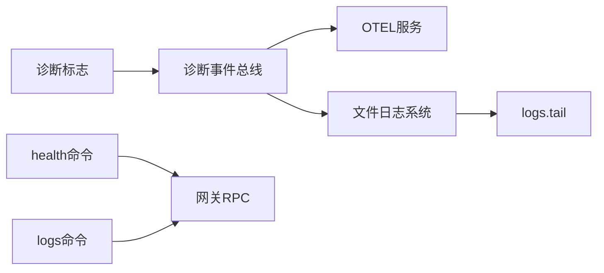

# 监控与诊断

<cite>
**本文引用的文件**
- [extensions/diagnostics-otel/src/service.ts](file://extensions/diagnostics-otel/src/service.ts)
- [src/infra/diagnostic-events.ts](file://src/infra/diagnostic-events.ts)
- [src/infra/diagnostic-flags.ts](file://src/infra/diagnostic-flags.ts)
- [src/logging/logger.ts](file://src/logging/logger.ts)
- [src/gateway/server-methods/logs.ts](file://src/gateway/server-methods/logs.ts)
- [docs/gateway/health.md](file://docs/gateway/health.md)
- [docs/gateway/logging.md](file://docs/gateway/logging.md)
- [docs/cli/health.md](file://docs/cli/health.md)
- [docs/cli/logs.md](file://docs/cli/logs.md)
- [src/commands/status-all.ts](file://src/commands/status-all.ts)
- [src/commands/status-all/report-lines.ts](file://src/commands/status-all/report-lines.ts)
- [apps/macos/Sources/OpenClaw/DiagnosticsFileLog.swift](file://apps/macos/Sources/OpenClaw/DiagnosticsFileLog.swift)
- [src/config/logging-max-file-bytes.test.ts](file://src/config/logging-max-file-bytes.test.ts)
- [src/config/sessions/store-maintenance.ts](file://src/config/sessions/store-maintenance.ts)
- [docs/gateway/heartbeat.md](file://docs/gateway/heartbeat.md)
- [ui/src/ui/controllers/debug.ts](file://ui/src/ui/controllers/debug.ts)
- [src/infra/errors.ts](file://src/infra/errors.ts)
</cite>

## 目录
1. [简介](#简介)
2. [项目结构](#项目结构)
3. [核心组件](#核心组件)
4. [架构总览](#架构总览)
5. [详细组件分析](#详细组件分析)
6. [依赖关系分析](#依赖关系分析)
7. [性能考量](#性能考量)
8. [故障排查指南](#故障排查指南)
9. [结论](#结论)
10. [附录](#附录)

## 简介
本文件面向OpenClaw网关监控与诊断系统，系统性阐述健康检查、状态监控、性能指标采集、日志策略与轮转、诊断工具使用、故障排查流程、分布式追踪与链路监控、根因分析等主题。文档以仓库中现有实现与文档为依据，结合可视化图示帮助读者快速理解并落地运维与排障。

## 项目结构
OpenClaw在“诊断事件总线”“日志系统”“遥测导出（OTLP）”“CLI健康与日志命令”“状态汇总报告”等多个维度构建了可观测能力。关键路径如下：
- 诊断事件：全局事件总线负责事件分发与去重
- 日志系统：文件滚动、大小限制、过期清理；远程tail接口
- 遥测导出：OTLP Protobuf导出器，支持traces/metrics/logs
- CLI：health/logs/status/status-all等命令
- 平台侧：macOS端日志轮转与大小控制

**图表来源**
- [extensions/diagnostics-otel/src/service.ts](file://extensions/diagnostics-otel/src/service.ts#L72-L686)
- [src/infra/diagnostic-events.ts](file://src/infra/diagnostic-events.ts#L195-L235)
- [src/logging/logger.ts](file://src/logging/logger.ts#L126-L184)
- [src/gateway/server-methods/logs.ts](file://src/gateway/server-methods/logs.ts#L147-L181)
- [docs/cli/health.md](file://docs/cli/health.md#L1-L22)
- [docs/cli/logs.md](file://docs/cli/logs.md#L1-L29)
- [src/commands/status-all.ts](file://src/commands/status-all.ts#L35-L363)
- [apps/macos/Sources/OpenClaw/DiagnosticsFileLog.swift](file://apps/macos/Sources/OpenClaw/DiagnosticsFileLog.swift#L93-L106)

**章节来源**
- [extensions/diagnostics-otel/src/service.ts](file://extensions/diagnostics-otel/src/service.ts#L72-L686)
- [src/infra/diagnostic-events.ts](file://src/infra/diagnostic-events.ts#L195-L235)
- [src/logging/logger.ts](file://src/logging/logger.ts#L126-L184)
- [src/gateway/server-methods/logs.ts](file://src/gateway/server-methods/logs.ts#L147-L181)
- [docs/cli/health.md](file://docs/cli/health.md#L1-L22)
- [docs/cli/logs.md](file://docs/cli/logs.md#L1-L29)
- [src/commands/status-all.ts](file://src/commands/status-all.ts#L35-L363)
- [apps/macos/Sources/OpenClaw/DiagnosticsFileLog.swift](file://apps/macos/Sources/OpenClaw/DiagnosticsFileLog.swift#L93-L106)

## 核心组件
- 诊断事件总线：统一事件源，承载消息入队、会话状态、队列深度、运行尝试、心跳等事件，并保证递归保护与监听者容错
- OTLP遥测导出：按配置启用traces/metrics/logs，注册日志传输与事件处理器，将诊断事件映射为计数器/直方图/span
- 文件日志系统：默认滚动文件（按日），支持最大文件大小、过期清理、外部传输接入
- 远程日志tail：通过RPC读取当前日志文件片段，支持游标、限制与字节上限
- CLI健康与日志：health命令获取网关健康快照；logs命令远程tail文件日志
- 状态汇总：status-all聚合网关可达性、通道状态、代理活跃度、服务状态等信息
- 平台侧日志：macOS端实现日志文件大小阈值检测与轮转

**章节来源**
- [src/infra/diagnostic-events.ts](file://src/infra/diagnostic-events.ts#L195-L235)
- [extensions/diagnostics-otel/src/service.ts](file://extensions/diagnostics-otel/src/service.ts#L167-L686)
- [src/logging/logger.ts](file://src/logging/logger.ts#L126-L184)
- [src/gateway/server-methods/logs.ts](file://src/gateway/server-methods/logs.ts#L147-L181)
- [docs/cli/health.md](file://docs/cli/health.md#L1-L22)
- [docs/cli/logs.md](file://docs/cli/logs.md#L1-L29)
- [src/commands/status-all.ts](file://src/commands/status-all.ts#L35-L363)
- [apps/macos/Sources/OpenClaw/DiagnosticsFileLog.swift](file://apps/macos/Sources/OpenClaw/DiagnosticsFileLog.swift#L93-L106)

## 架构总览
下图展示从诊断事件到OTLP导出、文件日志与远程tail的整体链路：

**图表来源**
- [src/infra/diagnostic-events.ts](file://src/infra/diagnostic-events.ts#L195-L235)
- [extensions/diagnostics-otel/src/service.ts](file://extensions/diagnostics-otel/src/service.ts#L260-L366)
- [src/gateway/server-methods/logs.ts](file://src/gateway/server-methods/logs.ts#L147-L181)

## 详细组件分析

### 诊断事件总线
- 全局状态维护序列号、监听集合与分发深度，防止递归过深
- 事件注入时间戳与序号，分发时忽略监听者异常
- 提供启用开关与事件发射/订阅API

**图表来源**
- [src/infra/diagnostic-events.ts](file://src/infra/diagnostic-events.ts#L195-L235)

**章节来源**
- [src/infra/diagnostic-events.ts](file://src/infra/diagnostic-events.ts#L195-L235)

### OTLP遥测导出（traces/metrics/logs）
- 支持协议：http/protobuf（不支持则告警并跳过）
- 端点与头：自动补全/v1/traces|metrics|logs路径，支持自定义headers
- 资源属性：服务名来自配置或环境变量
- 指标与直方图：token用量、成本、运行时长、上下文窗口、webhook处理、消息队列、会话卡滞等
- 日志：将TsLog对象转换为OTLP日志，安全脱敏敏感字段
- Span：按事件类型生成span，错误事件设置ERROR状态

**图表来源**
- [extensions/diagnostics-otel/src/service.ts](file://extensions/diagnostics-otel/src/service.ts#L72-L686)
- [src/infra/diagnostic-events.ts](file://src/infra/diagnostic-events.ts#L195-L235)

**章节来源**
- [extensions/diagnostics-otel/src/service.ts](file://extensions/diagnostics-otel/src/service.ts#L72-L686)
- [src/infra/diagnostic-events.ts](file://src/infra/diagnostic-events.ts#L195-L235)

### 文件日志系统与远程tail
- 默认滚动文件：/tmp/openclaw/openclaw-YYYY-MM-DD.log
- 最大文件大小与过期清理：默认500MB，保留24小时
- 外部传输：可注册transport，写入文件时触发
- 远程tail：校验参数，解析当前日志文件（滚动文件按mtime选择），返回片段与游标

**图表来源**
- [src/logging/logger.ts](file://src/logging/logger.ts#L126-L184)
- [src/gateway/server-methods/logs.ts](file://src/gateway/server-methods/logs.ts#L147-L181)

**章节来源**
- [src/logging/logger.ts](file://src/logging/logger.ts#L126-L184)
- [src/gateway/server-methods/logs.ts](file://src/gateway/server-methods/logs.ts#L147-L181)

### CLI健康与日志命令
- health：从运行中的网关获取健康快照，支持JSON与详细输出
- logs：远程tail文件日志，支持follow、limit、maxBytes、本地时间显示
- status/status-all：汇总网关可达性、通道状态、代理活跃度、服务状态、更新信息等

**图表来源**
- [docs/cli/health.md](file://docs/cli/health.md#L1-L22)
- [docs/cli/logs.md](file://docs/cli/logs.md#L1-L29)
- [src/gateway/server-methods/logs.ts](file://src/gateway/server-methods/logs.ts#L147-L181)

**章节来源**
- [docs/cli/health.md](file://docs/cli/health.md#L1-L22)
- [docs/cli/logs.md](file://docs/cli/logs.md#L1-L29)
- [src/gateway/server-methods/logs.ts](file://src/gateway/server-methods/logs.ts#L147-L181)

### 状态汇总与通道健康
- status-all：综合网关可达性、通道状态、代理活跃度、服务状态、更新信息、重启哨兵、最近错误、端口占用等
- 通道表格：渲染通道启用/状态/详情，合并问题提示

**图表来源**
- [src/commands/status-all.ts](file://src/commands/status-all.ts#L35-L363)
- [src/commands/status-all/report-lines.ts](file://src/commands/status-all/report-lines.ts#L71-L109)

**章节来源**
- [src/commands/status-all.ts](file://src/commands/status-all.ts#L35-L363)
- [src/commands/status-all/report-lines.ts](file://src/commands/status-all/report-lines.ts#L71-L109)

### 平台侧日志轮转（macOS）
- 启动时检查文件大小，超过阈值进行轮转与删除最旧备份
- 写入采用追加方式，确保原子性

**章节来源**
- [apps/macos/Sources/OpenClaw/DiagnosticsFileLog.swift](file://apps/macos/Sources/OpenClaw/DiagnosticsFileLog.swift#L93-L106)

## 依赖关系分析
- 诊断事件总线被OTEL服务订阅，作为指标与span的数据来源
- 文件日志系统与远程tail互为补充：前者持久化、后者用于实时观测
- CLI命令依赖网关RPC：health用于健康快照，logs用于远程tail
- 诊断标志（flags）可用于细粒度开启/关闭诊断子系统

**图表来源**
- [src/infra/diagnostic-events.ts](file://src/infra/diagnostic-events.ts#L195-L235)
- [extensions/diagnostics-otel/src/service.ts](file://extensions/diagnostics-otel/src/service.ts#L72-L686)
- [src/logging/logger.ts](file://src/logging/logger.ts#L126-L184)
- [src/gateway/server-methods/logs.ts](file://src/gateway/server-methods/logs.ts#L147-L181)
- [src/infra/diagnostic-flags.ts](file://src/infra/diagnostic-flags.ts#L44-L92)

**章节来源**
- [src/infra/diagnostic-events.ts](file://src/infra/diagnostic-events.ts#L195-L235)
- [extensions/diagnostics-otel/src/service.ts](file://extensions/diagnostics-otel/src/service.ts#L72-L686)
- [src/logging/logger.ts](file://src/logging/logger.ts#L126-L184)
- [src/gateway/server-methods/logs.ts](file://src/gateway/server-methods/logs.ts#L147-L181)
- [src/infra/diagnostic-flags.ts](file://src/infra/diagnostic-flags.ts#L44-L92)

## 性能考量
- OTEL采样率：可通过配置设定根采样率，降低trace开销
- flush间隔：指标与日志批处理调度间隔可配置，平衡延迟与带宽
- 日志大小与轮转：默认500MB/天，避免单文件过大影响IO；macOS端同样有阈值控制
- 远程tail限制：对limit与maxBytes进行上限控制，避免一次性拉取过多数据
- 通道心跳：通过heartbeat配置控制告警与指示器行为，减少噪音

**章节来源**
- [extensions/diagnostics-otel/src/service.ts](file://extensions/diagnostics-otel/src/service.ts#L127-L156)
- [src/logging/logger.ts](file://src/logging/logger.ts#L186-L191)
- [src/gateway/server-methods/logs.ts](file://src/gateway/server-methods/logs.ts#L13-L17)
- [docs/gateway/heartbeat.md](file://docs/gateway/heartbeat.md#L277-L313)

## 故障排查指南
- 快速检查
  - 使用health命令获取网关健康快照
  - 使用logs命令远程tail日志，过滤关键字如web-heartbeat/web-reconnect等
  - 使用status/status-all查看通道状态、代理活跃度与服务状态
- 深入诊断
  - 检查凭据与会话存储位置与最近修改时间
  - 如出现登录失效或409–515状态码，执行重新登录流程
  - 若网关不可达，启动网关并检查端口占用
- 常见问题
  - 无入站消息：确认设备在线、发送方在允许列表、群组规则匹配
  - 登录失效：执行logout后login，必要时重新配对
  - 端口冲突：使用--force启动或更换端口

**章节来源**
- [docs/gateway/health.md](file://docs/gateway/health.md#L1-L36)
- [docs/cli/health.md](file://docs/cli/health.md#L1-L22)
- [docs/cli/logs.md](file://docs/cli/logs.md#L1-L29)
- [src/commands/status-all.ts](file://src/commands/status-all.ts#L35-L363)

## 结论
OpenClaw通过“诊断事件总线+OTLP导出+文件日志+远程tail+CLI命令”的组合，提供了从健康检查、状态监控到性能指标与分布式追踪的完整可观测方案。配合诊断标志与平台侧日志轮转，可在不同场景下灵活启用与优化诊断能力。

## 附录

### 日志级别与策略
- 文件日志级别由logging.level控制，--verbose仅影响控制台输出风格
- 控制台样式与颜色、子系统前缀、时间格式等可配置
- 工具摘要中的敏感信息可按策略脱敏（工具摘要范围）

**章节来源**
- [docs/gateway/logging.md](file://docs/gateway/logging.md#L35-L114)

### 日志轮转与大小限制
- 默认滚动文件：openclaw-YYYY-MM-DD.log
- 默认最大文件大小：500MB
- 过期清理：保留24小时
- 单元测试覆盖正向与负向配置校验

**章节来源**
- [src/logging/logger.ts](file://src/logging/logger.ts#L15-L21)
- [src/logging/logger.ts](file://src/logging/logger.ts#L186-L191)
- [src/config/logging-max-file-bytes.test.ts](file://src/config/logging-max-file-bytes.test.ts#L1-L25)

### 诊断标志与事件
- 诊断标志支持通配与前缀匹配，便于按模块启用/禁用
- 事件包含序列号、时间戳、类型与业务字段，订阅者需注意异常隔离

**章节来源**
- [src/infra/diagnostic-flags.ts](file://src/infra/diagnostic-flags.ts#L44-L92)
- [src/infra/diagnostic-events.ts](file://src/infra/diagnostic-events.ts#L195-L235)

### 会话与队列维护
- 会话存档保留期与轮转字节可配置，支持按持续时间或字节大小轮换

**章节来源**
- [src/config/sessions/store-maintenance.ts](file://src/config/sessions/store-maintenance.ts#L38-L78)

### UI调试与错误提取
- UI提供调试方法调用入口，支持构造RPC请求参数
- 错误提取工具支持从嵌套对象中收集候选错误节点，辅助根因分析

**章节来源**
- [ui/src/ui/controllers/debug.ts](file://ui/src/ui/controllers/debug.ts#L45-L60)
- [src/infra/errors.ts](file://src/infra/errors.ts#L25-L52)