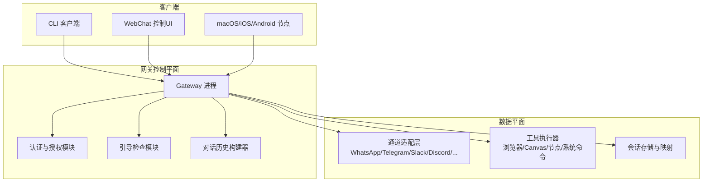
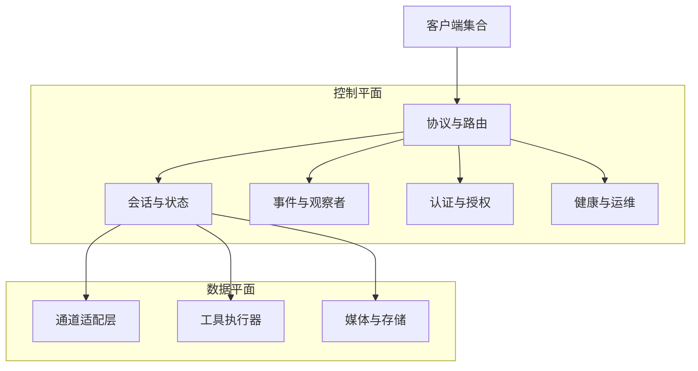
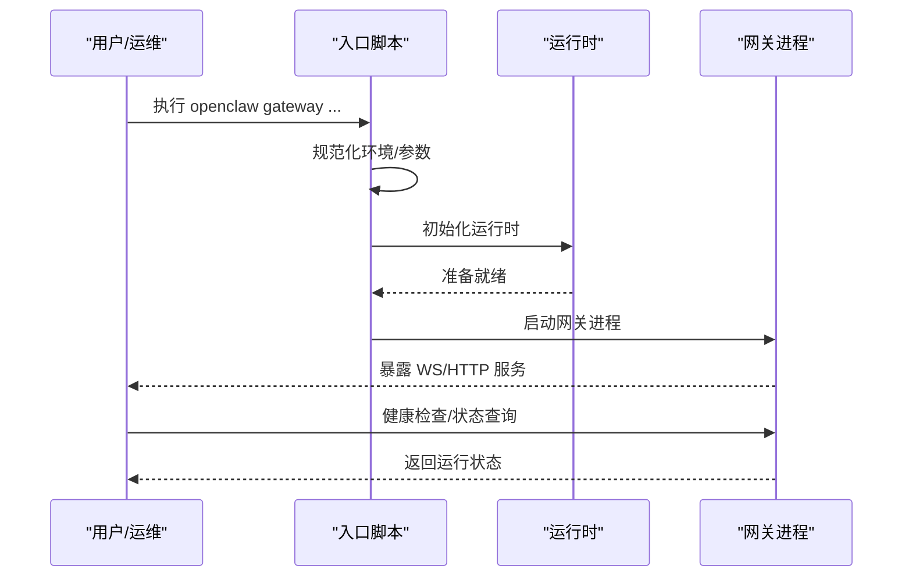
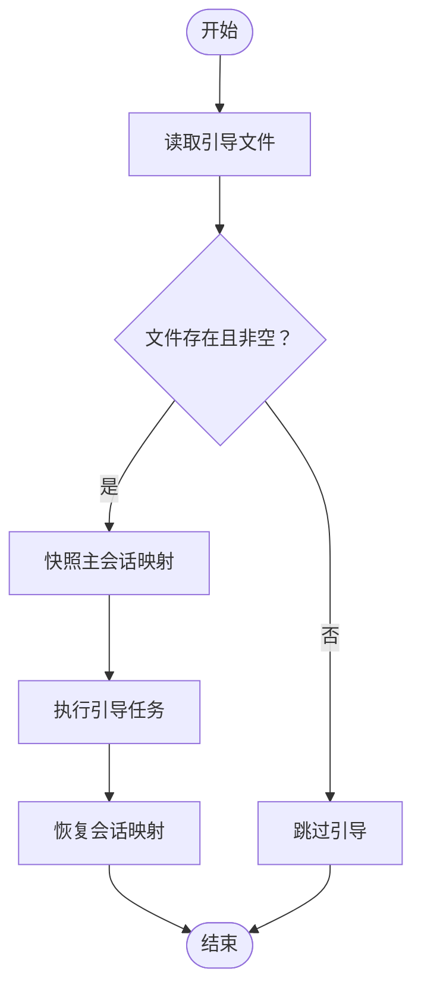
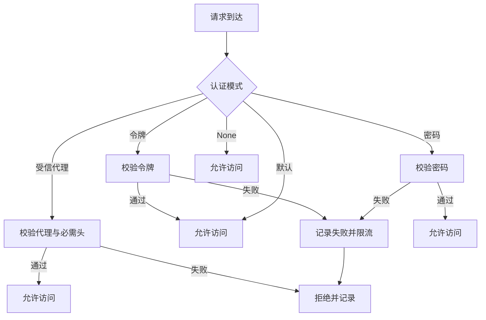
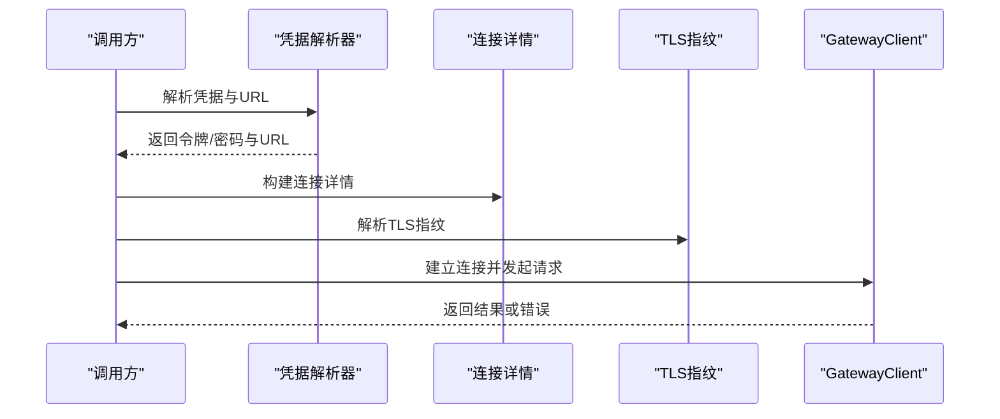
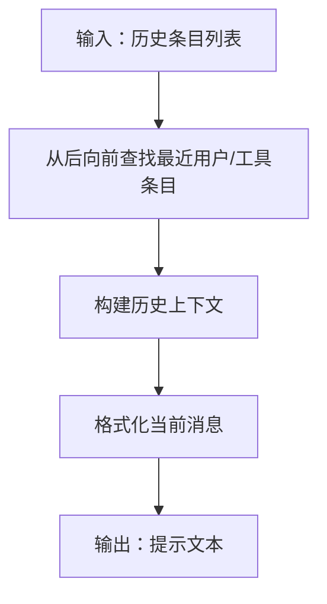
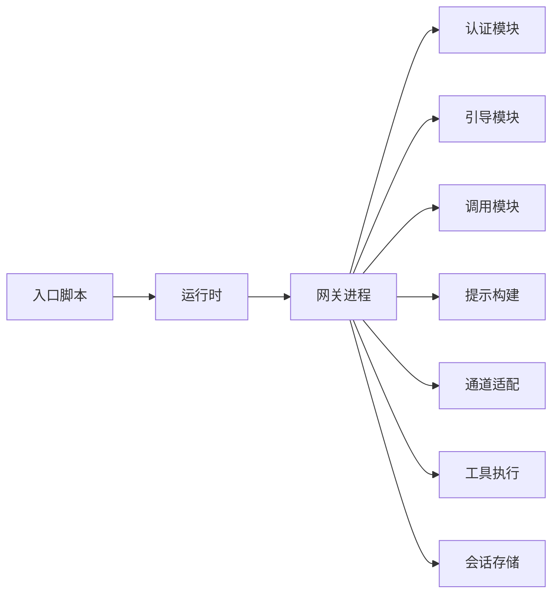
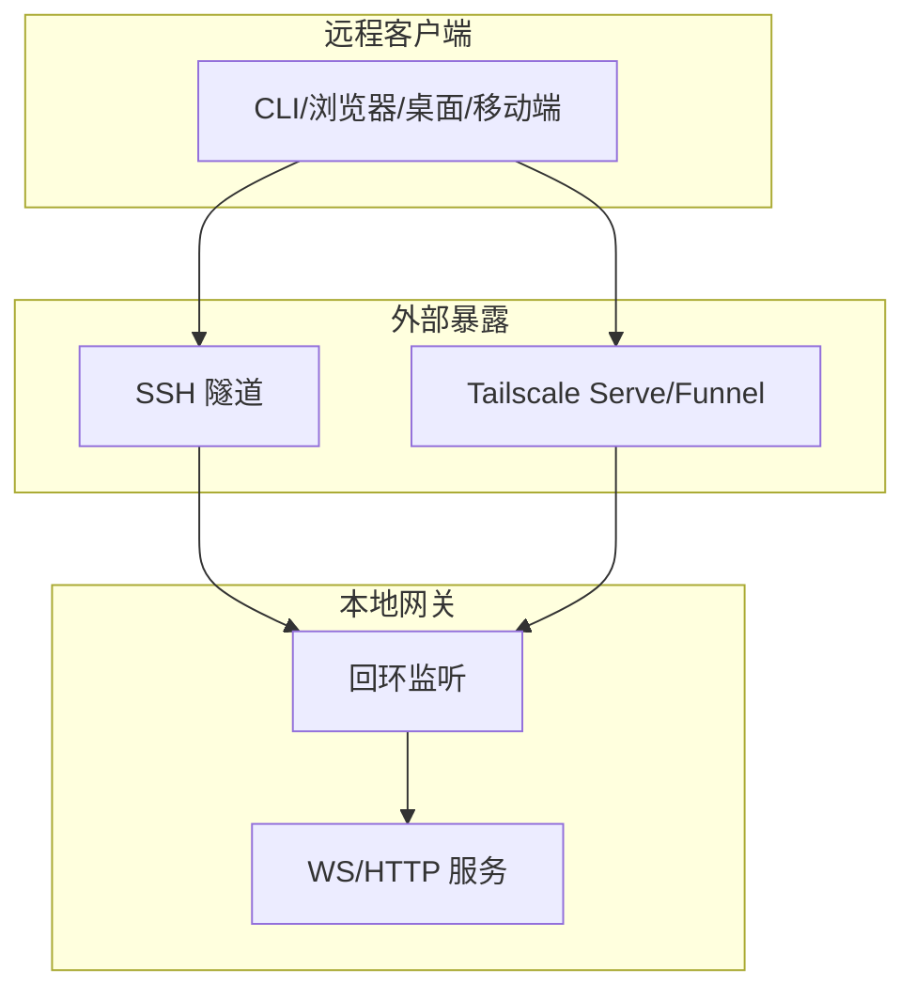

# 网关架构设计

<cite>
**本文档引用的文件**
- [README.md](file://README.md)
- [docs/gateway/index.md](file://docs/gateway/index.md)
- [src/entry.ts](file://src/entry.ts)
- [src/runtime.ts](file://src/runtime.ts)
- [src/gateway/boot.ts](file://src/gateway/boot.ts)
- [src/gateway/auth.ts](file://src/gateway/auth.ts)
- [src/gateway/call.ts](file://src/gateway/call.ts)
- [src/gateway/agent-prompt.ts](file://src/gateway/agent-prompt.ts)
</cite>

## 目录
1. [简介](#简介)
2. [项目结构](#项目结构)
3. [核心组件](#核心组件)
4. [架构总览](#架构总览)
5. [详细组件分析](#详细组件分析)
6. [依赖关系分析](#依赖关系分析)
7. [性能考量](#性能考量)
8. [故障排查指南](#故障排查指南)
9. [结论](#结论)
10. [附录](#附录)

## 简介
本文件面向OpenClaw网关（Gateway）的架构设计，系统化阐述其作为“单一控制平面”的设计理念与实现方式，覆盖启动流程、初始化过程、核心组件关系、控制平面与数据平面分离、事件驱动与观察者模式应用、生命周期管理、服务发现与暴露、负载均衡与高可用策略，并提供架构图、组件交互图与部署拓扑图，帮助读者在不同规模与场景下正确规划与运维。

## 项目结构
OpenClaw将“网关”定位为统一的控制平面，承载会话、通道路由、工具调用、事件分发与运维界面等能力；同时通过协议与多客户端（CLI、Web、桌面应用、移动端节点）进行连接与协作。整体采用“单进程、多端口复用”的运行模型：同一进程同时提供WebSocket控制/RPC、HTTP API（兼容OpenAI风格）、控制UI与钩子等服务。

**图表来源**
- [README.md](file://README.md#L185-L202)
- [docs/gateway/index.md](file://docs/gateway/index.md#L68-L93)

**章节来源**
- [README.md](file://README.md#L185-L202)
- [docs/gateway/index.md](file://docs/gateway/index.md#L27-L93)

## 核心组件
- 启动入口与运行时
  - 入口脚本负责环境标准化、实验警告抑制、参数解析与主程序调度。
  - 运行时封装日志输出与进程退出行为，支持测试与非退出式运行。
- 引导检查（Boot）
  - 在工作区存在特定引导文件时，自动触发一次“引导任务”，并确保会话映射一致性。
- 认证与授权（Auth）
  - 支持多种认证模式（无、令牌、密码、受信代理、Tailscale），并内置速率限制与代理地址识别。
- 网关调用（Call）
  - 提供统一的网关连接解析、凭据解析、TLS指纹校验、超时控制与最小权限作用域计算。
- 对话提示构建（Agent Prompt）
  - 将历史消息与当前输入整合为适合大模型的提示文本，优先关注最新用户/工具输入。

**章节来源**
- [src/entry.ts](file://src/entry.ts#L1-L191)
- [src/runtime.ts](file://src/runtime.ts#L1-L54)
- [src/gateway/boot.ts](file://src/gateway/boot.ts#L1-L204)
- [src/gateway/auth.ts](file://src/gateway/auth.ts#L1-L491)
- [src/gateway/call.ts](file://src/gateway/call.ts#L1-L758)
- [src/gateway/agent-prompt.ts](file://src/gateway/agent-prompt.ts#L1-L57)

## 架构总览
网关采用“控制平面+数据平面”的分层设计：
- 控制平面
  - 协议与会话管理、事件分发、认证鉴权、配置热重载、健康检查与运维接口。
  - 多客户端接入：CLI、Web控制UI、桌面应用与移动节点。
- 数据平面
  - 通道适配（多平台IM/群组/频道）、工具执行（浏览器、Canvas、节点、系统命令）、媒体处理与持久化。

**图表来源**
- [docs/gateway/index.md](file://docs/gateway/index.md#L68-L93)

## 详细组件分析

### 启动流程与生命周期管理
- 入口与环境准备
  - 解析CLI参数、应用配置文件与环境变量、规范化Node选项、必要时重启以屏蔽实验性警告。
- 运行时与守护
  - 使用统一运行时封装日志与退出，支持服务化安装（macOS launchd、Linux systemd user/system）。
- 生命周期与监督
  - 支持安装、状态查询、重启、停止与日志跟踪；提供健康检查与深度诊断命令。

**图表来源**
- [src/entry.ts](file://src/entry.ts#L1-L191)
- [src/runtime.ts](file://src/runtime.ts#L1-L54)
- [docs/gateway/index.md](file://docs/gateway/index.md#L125-L169)

**章节来源**
- [src/entry.ts](file://src/entry.ts#L1-L191)
- [src/runtime.ts](file://src/runtime.ts#L1-L54)
- [docs/gateway/index.md](file://docs/gateway/index.md#L125-L169)

### 引导检查（Boot）
- 触发条件：工作区存在特定引导文件时自动执行。
- 行为：生成一次性会话ID，快照主会话映射，执行一次代理指令，最后恢复会话映射。
- 错误处理：记录失败原因并返回失败结果，不影响网关继续运行。

**图表来源**
- [src/gateway/boot.ts](file://src/gateway/boot.ts#L56-L136)

**章节来源**
- [src/gateway/boot.ts](file://src/gateway/boot.ts#L1-L204)

### 认证与授权（Auth）
- 模式选择
  - 无、令牌、密码、受信代理、Tailscale头透传（受限于暴露面与安全策略）。
- 地址识别
  - 支持代理链识别与可信代理白名单，结合X-Real-IP可选回退。
- 速率限制
  - 针对共享密钥类失败尝试进行限流，支持按IP与作用域统计。
- Tailscale集成
  - 通过反向解析与身份头校验，实现基于Tailnet的身份信任。

**图表来源**
- [src/gateway/auth.ts](file://src/gateway/auth.ts#L367-L472)

**章节来源**
- [src/gateway/auth.ts](file://src/gateway/auth.ts#L1-L491)

### 网关调用（Call）
- 连接解析
  - 优先级：CLI显式URL > 环境变量 > 配置远程URL > 本地回环WS。
  - 安全约束：非回环地址必须使用加密WS（WSS），除非明确允许私有网络豁免。
- 凭据解析
  - 支持显式令牌/密码、环境变量、配置文件与SecretRef解析，区分本地/远程模式优先级。
- TLS指纹
  - 支持本地TLS运行时指纹或远程配置指纹，用于连接端证书固定。
- 请求执行
  - 最小权限作用域推断、协议版本协商、超时控制、最终响应等待与错误格式化。

**图表来源**
- [src/gateway/call.ts](file://src/gateway/call.ts#L130-L219)
- [src/gateway/call.ts](file://src/gateway/call.ts#L334-L492)
- [src/gateway/call.ts](file://src/gateway/call.ts#L595-L715)

**章节来源**
- [src/gateway/call.ts](file://src/gateway/call.ts#L1-L758)

### 对话提示构建（Agent Prompt）
- 输入：历史消息条目（含角色与内容）。
- 策略：优先选取最近的用户或工具输入作为当前消息，其余历史按格式拼接，形成连贯上下文。
- 输出：适合大模型的提示字符串。

**图表来源**
- [src/gateway/agent-prompt.ts](file://src/gateway/agent-prompt.ts#L21-L56)

**章节来源**
- [src/gateway/agent-prompt.ts](file://src/gateway/agent-prompt.ts#L1-L57)

## 依赖关系分析
- 组件内聚与耦合
  - 入口与运行时相对独立，主要承担环境与生命周期职责；网关核心逻辑集中在控制平面模块（认证、引导、调用、提示构建）。
- 外部依赖
  - 配置解析、SecretRef解析、TLS运行时、设备身份、通道与工具适配器等。
- 关键依赖链
  - 入口脚本 → 运行时 → 网关进程 → 认证/引导/调用 → 通道/工具 → 存储/会话。

**图表来源**
- [src/entry.ts](file://src/entry.ts#L1-L191)
- [src/runtime.ts](file://src/runtime.ts#L1-L54)
- [src/gateway/auth.ts](file://src/gateway/auth.ts#L1-L491)
- [src/gateway/boot.ts](file://src/gateway/boot.ts#L1-L204)
- [src/gateway/call.ts](file://src/gateway/call.ts#L1-L758)
- [src/gateway/agent-prompt.ts](file://src/gateway/agent-prompt.ts#L1-L57)

**章节来源**
- [src/entry.ts](file://src/entry.ts#L1-L191)
- [src/runtime.ts](file://src/runtime.ts#L1-L54)
- [src/gateway/auth.ts](file://src/gateway/auth.ts#L1-L491)
- [src/gateway/boot.ts](file://src/gateway/boot.ts#L1-L204)
- [src/gateway/call.ts](file://src/gateway/call.ts#L1-L758)
- [src/gateway/agent-prompt.ts](file://src/gateway/agent-prompt.ts#L1-L57)

## 性能考量
- 单进程多端口复用降低资源占用，但需注意事件循环阻塞与并发瓶颈。
- 会话映射快照与恢复避免引导期间状态不一致，建议在高并发场景下优化I/O与锁粒度。
- 认证与速率限制应结合代理链与IP识别策略，避免误判与绕过。
- TLS指纹与凭据解析在远程模式下应尽量缓存与复用，减少重复解析开销。

## 故障排查指南
- 常见问题与症状
  - 绑定到非回环且未配置认证：拒绝绑定或连接失败。
  - 端口冲突（EADDRINUSE）：已有实例监听或强制覆盖。
  - 远程模式未配置远程URL：连接被阻止。
  - 认证不匹配：令牌/密码错误或速率限制触发。
- 诊断步骤
  - 使用健康检查与状态命令确认运行与就绪状态。
  - 检查通道探测与日志输出，定位连接失败环节。
  - 在序列间隙场景，先刷新健康与系统在线状态再继续。

**章节来源**
- [docs/gateway/index.md](file://docs/gateway/index.md#L216-L244)

## 结论
OpenClaw网关以“单一控制平面”为核心，通过清晰的控制/数据分离、事件驱动与最小权限作用域，实现了跨平台、多客户端、可扩展的个人AI助手控制中心。配合严格的认证与安全策略、完善的生命周期与运维工具，能够在本地或远程环境中稳定运行，并为后续扩展（如多网关隔离、服务发现与负载均衡）提供良好基础。

## 附录

### 部署拓扑与高可用设计
- 单实例部署
  - 默认绑定回环，通过SSH隧道或Tailscale Serve/Funnel对外暴露，满足远程访问与安全边界。
- 多实例与隔离
  - 严格隔离配置路径、状态目录、端口与工作空间，适用于救援配置或强隔离需求。
- 高可用与负载均衡
  - 建议通过反向代理或服务网格实现多实例健康检查与故障切换；在网关层面保持无状态或仅共享会话存储后端，避免状态漂移。

**图表来源**
- [README.md](file://README.md#L213-L228)
- [docs/gateway/index.md](file://docs/gateway/index.md#L108-L123)