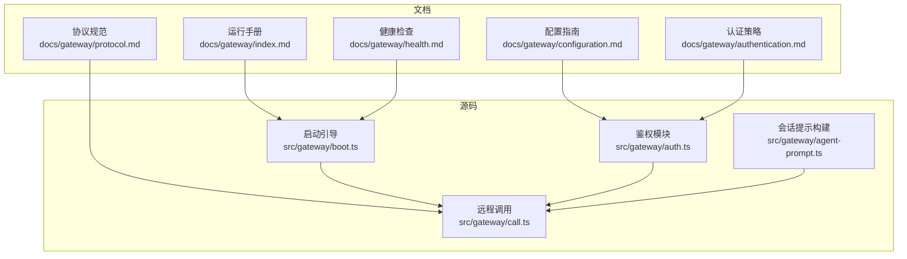
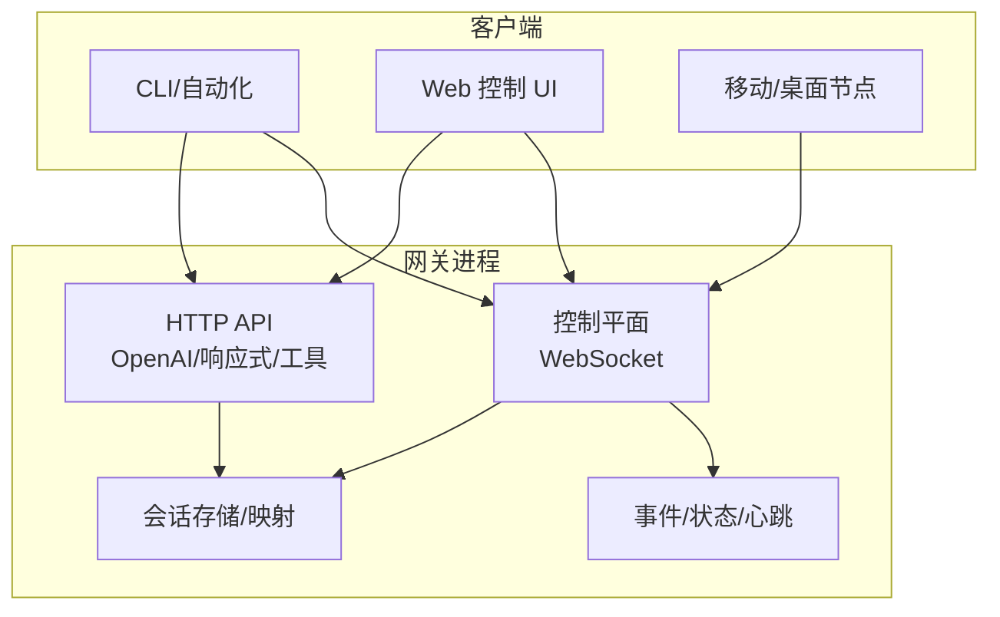
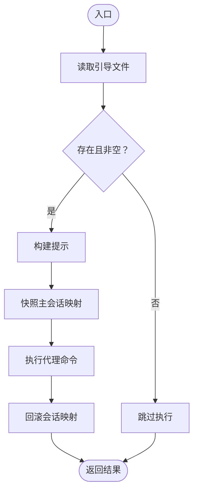
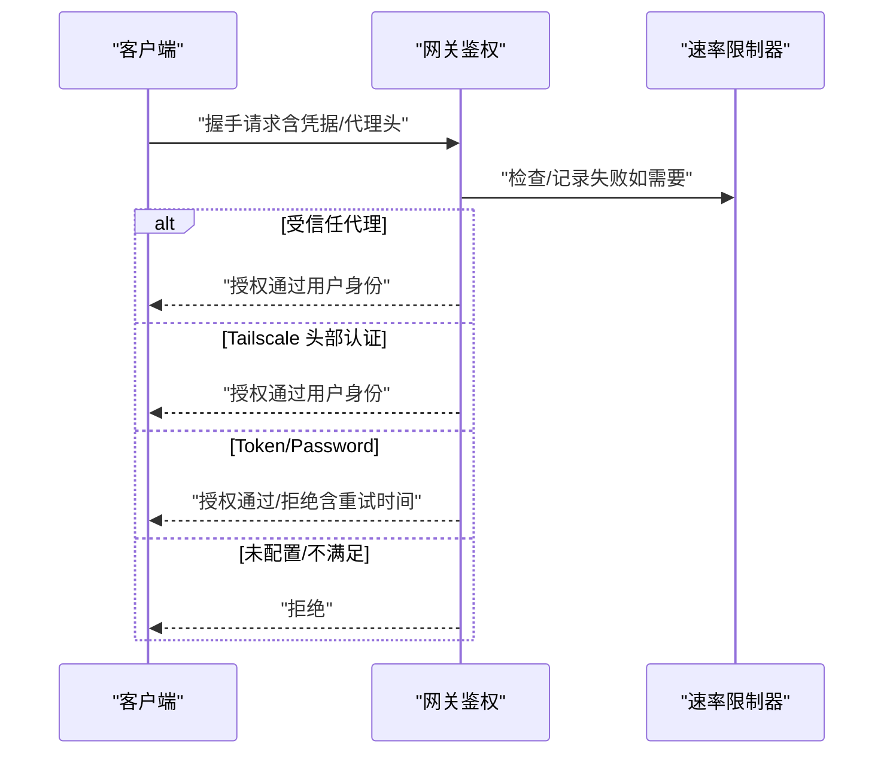
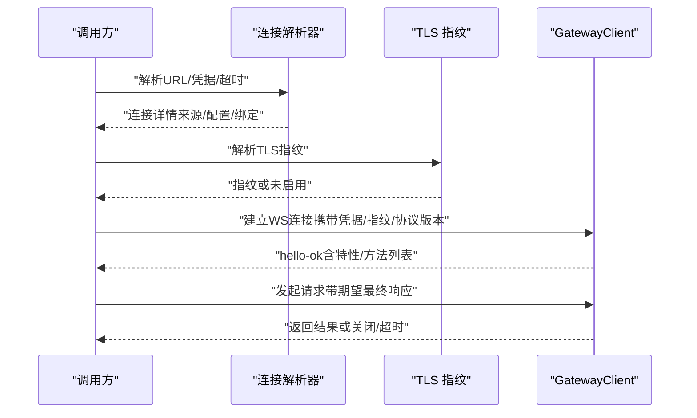
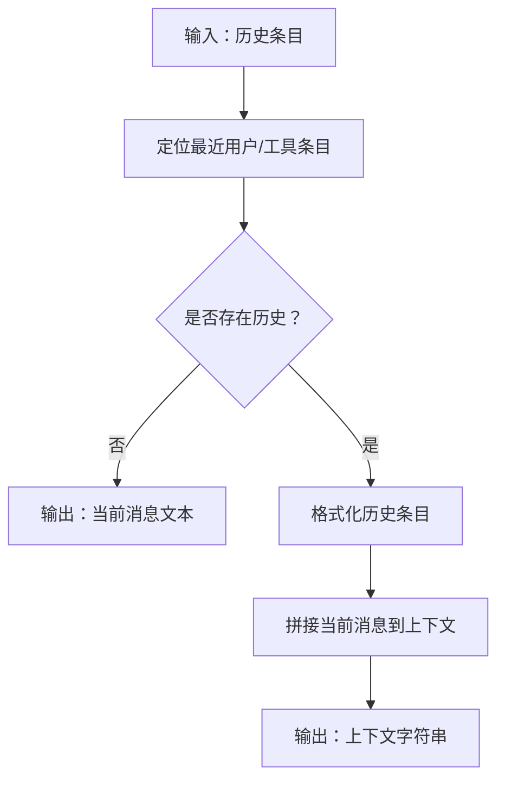
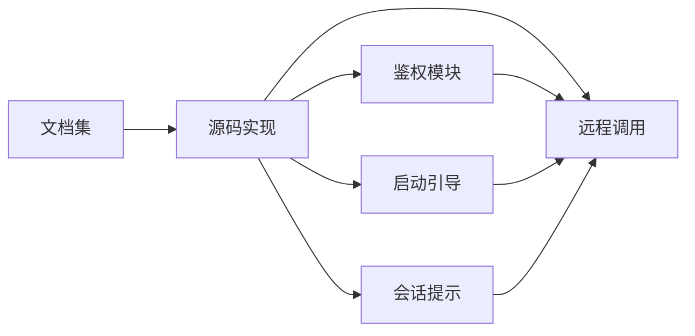

# 网关系统

<cite>
**本文引用的文件**
- [docs/gateway/index.md](file://docs/gateway/index.md)
- [docs/gateway/configuration.md](file://docs/gateway/configuration.md)
- [docs/gateway/protocol.md](file://docs/gateway/protocol.md)
- [docs/gateway/health.md](file://docs/gateway/health.md)
- [docs/gateway/authentication.md](file://docs/gateway/authentication.md)
- [src/gateway/boot.ts](file://src/gateway/boot.ts)
- [src/gateway/auth.ts](file://src/gateway/auth.ts)
- [src/gateway/call.ts](file://src/gateway/call.ts)
- [src/gateway/agent-prompt.ts](file://src/gateway/agent-prompt.ts)
</cite>

## 目录
1. [简介](#简介)
2. [项目结构](#项目结构)
3. [核心组件](#核心组件)
4. [架构总览](#架构总览)
5. [详细组件分析](#详细组件分析)
6. [依赖关系分析](#依赖关系分析)
7. [性能考量](#性能考量)
8. [故障排除指南](#故障排除指南)
9. [结论](#结论)
10. [附录](#附录)

## 简介
本文件面向系统管理员与开发者，系统性阐述 OpenClaw 网关作为“单一控制平面”的定位与实现：包括 WebSocket 控制平面、会话管理、健康检查与诊断、启动配置与运行时管理、事件处理与客户端连接管理、协议规范、API 接口、安全机制与性能优化策略，并提供可操作的配置示例、排障清单与运维最佳实践。

## 项目结构
网关相关能力由“文档”与“源码”两部分构成：
- 文档侧：覆盖运行手册、配置、协议、健康检查、认证等主题，便于快速上手与深度运维。
- 源码侧：包含启动引导、鉴权、远程调用、会话提示构建等实现，支撑控制平面与节点通信。

图表来源
- [docs/gateway/index.md](file://docs/gateway/index.md#L1-L262)
- [docs/gateway/configuration.md](file://docs/gateway/configuration.md#L1-L547)
- [docs/gateway/protocol.md](file://docs/gateway/protocol.md#L1-L257)
- [docs/gateway/health.md](file://docs/gateway/health.md#L1-L36)
- [docs/gateway/authentication.md](file://docs/gateway/authentication.md#L1-L180)
- [src/gateway/boot.ts](file://src/gateway/boot.ts#L1-L204)
- [src/gateway/auth.ts](file://src/gateway/auth.ts#L1-L491)
- [src/gateway/call.ts](file://src/gateway/call.ts#L1-L758)
- [src/gateway/agent-prompt.ts](file://src/gateway/agent-prompt.ts#L1-L57)

章节来源
- [docs/gateway/index.md](file://docs/gateway/index.md#L1-L262)
- [docs/gateway/configuration.md](file://docs/gateway/configuration.md#L1-L547)
- [docs/gateway/protocol.md](file://docs/gateway/protocol.md#L1-L257)
- [docs/gateway/health.md](file://docs/gateway/health.md#L1-L36)
- [docs/gateway/authentication.md](file://docs/gateway/authentication.md#L1-L180)
- [src/gateway/boot.ts](file://src/gateway/boot.ts#L1-L204)
- [src/gateway/auth.ts](file://src/gateway/auth.ts#L1-L491)
- [src/gateway/call.ts](file://src/gateway/call.ts#L1-L758)
- [src/gateway/agent-prompt.ts](file://src/gateway/agent-prompt.ts#L1-L57)

## 核心组件
- 启动引导与会话映射快照：负责在启动阶段读取引导脚本、执行一次性任务并回滚会话映射，保证状态一致性。
- 鉴权与访问控制：支持 token/password/trusted-proxy/tailscale 等多种模式，内置速率限制与代理信任校验。
- 远程调用与连接细节解析：统一解析本地/远程/受控代理的连接目标、凭据解析、TLS 指纹校验与超时控制。
- 会话提示构建：从历史对话中抽取上下文，生成对代理友好的消息输入。

章节来源
- [src/gateway/boot.ts](file://src/gateway/boot.ts#L1-L204)
- [src/gateway/auth.ts](file://src/gateway/auth.ts#L1-L491)
- [src/gateway/call.ts](file://src/gateway/call.ts#L1-L758)
- [src/gateway/agent-prompt.ts](file://src/gateway/agent-prompt.ts#L1-L57)

## 架构总览
网关以“单一控制平面 + 节点传输”为核心，通过 WebSocket 提供统一的控制面与事件通道；HTTP 兼容端点承载 OpenAI 兼容 API、响应式 API、工具调用等；同时提供控制 UI 与钩子（hooks）扩展。

图表来源
- [docs/gateway/index.md](file://docs/gateway/index.md#L68-L93)
- [docs/gateway/protocol.md](file://docs/gateway/protocol.md#L10-L21)

章节来源
- [docs/gateway/index.md](file://docs/gateway/index.md#L68-L93)
- [docs/gateway/protocol.md](file://docs/gateway/protocol.md#L10-L21)

## 详细组件分析

### 组件A：启动引导与会话映射
- 功能要点
  - 读取工作区内的引导文件，按需执行一次性任务。
  - 在执行前后对主会话映射进行快照与回滚，避免状态漂移。
  - 生成唯一会话 ID，便于追踪与审计。
- 关键流程
  - 加载引导文件 → 构建提示 → 执行代理命令 → 回滚映射 → 返回结果或错误。

图表来源
- [src/gateway/boot.ts](file://src/gateway/boot.ts#L138-L203)

章节来源
- [src/gateway/boot.ts](file://src/gateway/boot.ts#L1-L204)

### 组件B：鉴权与访问控制
- 支持模式
  - none/token/password/trusted-proxy/tailscale。
  - 受信任代理可基于自定义头部与用户白名单放行。
  - Tailscale 头部认证仅在特定场景启用。
- 速率限制
  - 对失败尝试按来源 IP 记录并限流，成功后重置。
- 客户端直连判定
  - 基于请求头与绑定模式判断是否为本地直连，决定是否允许无凭据访问。

图表来源
- [src/gateway/auth.ts](file://src/gateway/auth.ts#L367-L490)

章节来源
- [src/gateway/auth.ts](file://src/gateway/auth.ts#L1-L491)

### 组件C：远程调用与连接细节
- 连接目标解析
  - 优先级：CLI/环境变量覆盖 > 远程配置 > 本地回环。
  - 安全约束：非回环地址必须使用加密通道，除非显式允许私有网络豁免。
- 凭据解析
  - 显式传入优先；否则按环境变量、配置与密钥引用顺序解析。
  - 远程模式下区分本地/远程凭据优先级。
- TLS 指纹
  - 支持本地证书指纹或远程配置指纹，CLI 覆盖仅用于显式目标。
- 方法支持校验
  - 若使用密钥引用，需确保网关具备相应方法支持，否则报错。

图表来源
- [src/gateway/call.ts](file://src/gateway/call.ts#L130-L219)
- [src/gateway/call.ts](file://src/gateway/call.ts#L334-L492)
- [src/gateway/call.ts](file://src/gateway/call.ts#L518-L545)
- [src/gateway/call.ts](file://src/gateway/call.ts#L595-L715)

章节来源
- [src/gateway/call.ts](file://src/gateway/call.ts#L1-L758)

### 组件D：会话提示构建
- 输入：历史对话条目（用户/助手/工具），以结构化历史项形式组织。
- 规则：优先选取最近的用户或工具条目作为当前消息，其余作为上下文拼接。
- 输出：经格式化后的上下文字符串，供代理使用。

图表来源
- [src/gateway/agent-prompt.ts](file://src/gateway/agent-prompt.ts#L21-L56)

章节来源
- [src/gateway/agent-prompt.ts](file://src/gateway/agent-prompt.ts#L1-L57)

## 依赖关系分析
- 文档与实现的耦合
  - 运行手册与配置文档驱动源码中的默认行为（端口、绑定、热重载、远程模式）。
  - 协议文档约束客户端与网关的握手、帧格式与角色/作用域。
  - 健康检查与认证文档指导源码中的错误码与诊断路径。
- 模块内依赖
  - 鉴权模块被远程调用模块广泛复用，贯穿连接建立与凭据解析。
  - 启动引导与会话映射在执行前后对会话存储进行快照/回滚，保障一致性。
  - 会话提示构建为代理调用提供上下文输入，间接影响远程调用的语义质量。

图表来源
- [docs/gateway/index.md](file://docs/gateway/index.md#L68-L93)
- [docs/gateway/protocol.md](file://docs/gateway/protocol.md#L10-L21)
- [src/gateway/auth.ts](file://src/gateway/auth.ts#L1-L491)
- [src/gateway/call.ts](file://src/gateway/call.ts#L1-L758)
- [src/gateway/boot.ts](file://src/gateway/boot.ts#L1-L204)
- [src/gateway/agent-prompt.ts](file://src/gateway/agent-prompt.ts#L1-L57)

章节来源
- [docs/gateway/index.md](file://docs/gateway/index.md#L68-L93)
- [docs/gateway/protocol.md](file://docs/gateway/protocol.md#L10-L21)
- [src/gateway/auth.ts](file://src/gateway/auth.ts#L1-L491)
- [src/gateway/call.ts](file://src/gateway/call.ts#L1-L758)
- [src/gateway/boot.ts](file://src/gateway/boot.ts#L1-L204)
- [src/gateway/agent-prompt.ts](file://src/gateway/agent-prompt.ts#L1-L57)

## 性能考量
- 端口与绑定
  - 默认回环绑定，减少暴露面；生产建议通过受控隧道或 Tailscale 服务。
- 热重载与重启策略
  - hybrid 模式优先热应用安全变更，必要时自动重启，降低停机风险。
- 速率限制与安全
  - 对共享凭据类失败进行限流，防止暴力破解；TLS 强制用于远端连接，避免明文泄露。
- 会话与提示
  - 合理设置会话范围与线程绑定，避免跨会话干扰；提示构建仅包含必要历史，降低上下文开销。

章节来源
- [docs/gateway/index.md](file://docs/gateway/index.md#L76-L93)
- [docs/gateway/configuration.md](file://docs/gateway/configuration.md#L354-L387)
- [src/gateway/auth.ts](file://src/gateway/auth.ts#L404-L420)
- [src/gateway/call.ts](file://src/gateway/call.ts#L182-L200)

## 故障排除指南
- 常见症状与定位
  - 无法绑定：若非回环绑定且未配置认证，将拒绝监听；检查 token/password 或改为 loopback。
  - 端口冲突：EADDRINUSE；使用强制启动或更换端口。
  - 远程模式误配：gateway.mode=remote 但未配置 gateway.remote.url；修复或切换为 local。
  - 连接未授权：connect 阶段凭据不匹配；核对客户端 token/password 与服务端配置。
- 诊断步骤
  - 使用健康检查命令获取运行时快照；查看日志中心跳/重连/自动回复等关键词。
  - 对通道问题，检查凭据文件与会话存储路径，必要时重新登录。
- 运维建议
  - 使用受信隧道（SSH/Tailscale）访问远端网关；严格最小权限与速率限制。
  - 配置热重载模式以平衡变更速度与稳定性；对关键字段变更采用 restart 模式。

章节来源
- [docs/gateway/index.md](file://docs/gateway/index.md#L235-L244)
- [docs/gateway/health.md](file://docs/gateway/health.md#L12-L35)

## 结论
OpenClaw 网关以“单一控制平面”为核心，通过 WebSocket 提供统一的连接、事件与 API 能力，结合严格的鉴权与安全策略、完善的健康检查与诊断、以及灵活的配置热重载，既满足开发调试需求，又兼顾生产环境的可靠性与安全性。建议在生产中采用受控隧道、TLS 与最小权限原则，并配合会话与提示策略优化性能与稳定性。

## 附录

### 协议与角色/作用域速览
- 连接帧
  - 首帧必须为 connect；随后收到 hello-ok 快照。
  - 请求/响应/事件三类帧格式明确。
- 角色与作用域
  - operator：控制面客户端（CLI/UI/自动化）。
  - node：能力宿主（相机/屏幕/画布/系统运行）。
  - operator 作用域：read/write/admin/approvals/pairing 等。
  - node 声明能力类别、命令白名单与权限开关。

章节来源
- [docs/gateway/protocol.md](file://docs/gateway/protocol.md#L17-L167)

### 配置与热重载要点
- 热重载模式
  - hybrid（默认）：安全变更即时生效，关键变更自动重启。
  - hot：仅热应用安全变更，其他需手动重启。
  - restart/off：重启/禁用监控。
- 关键字段分类
  - 服务器与基础设施变更需重启；通道、代理、自动化、会话、工具、媒体、UI 等多数组合通常可热应用。

章节来源
- [docs/gateway/configuration.md](file://docs/gateway/configuration.md#L354-L387)

### 安全与合规要点
- TLS 与指纹
  - 远端连接强制加密；支持本地或远程 TLS 指纹固定。
- 设备身份与配对
  - 客户端需提供稳定的设备标识与签名挑战；支持设备令牌轮换/撤销。
- 受信代理与 Tailscale
  - 受信代理需配置必需头部与用户白名单；Tailscale 头部认证仅在特定场景启用。

章节来源
- [docs/gateway/protocol.md](file://docs/gateway/protocol.md#L246-L251)
- [src/gateway/auth.ts](file://src/gateway/auth.ts#L324-L361)
- [src/gateway/auth.ts](file://src/gateway/auth.ts#L422-L435)