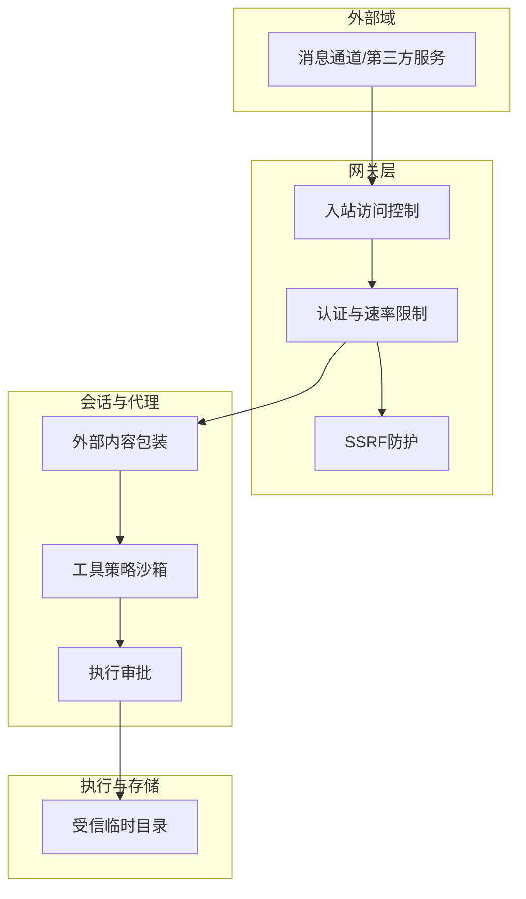
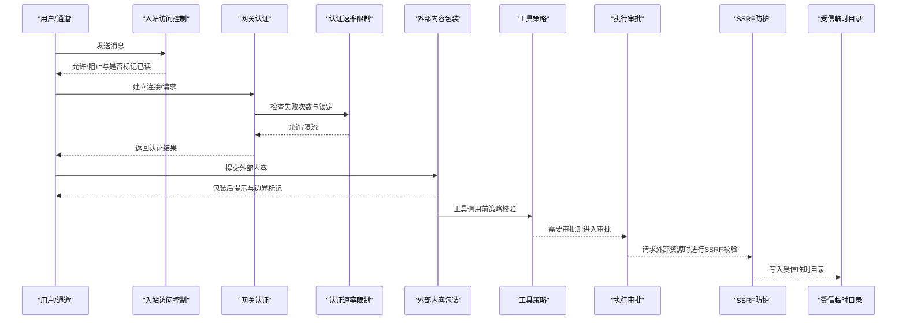
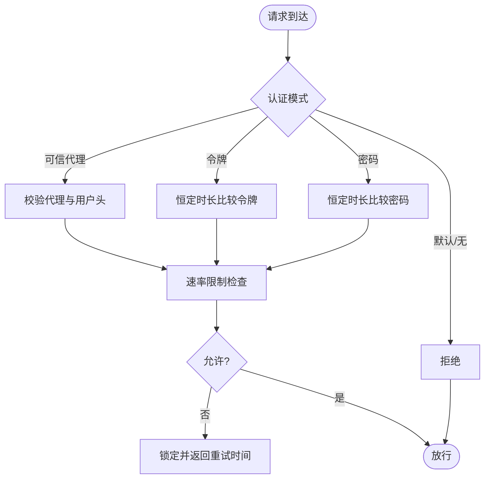
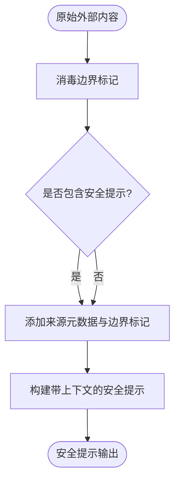
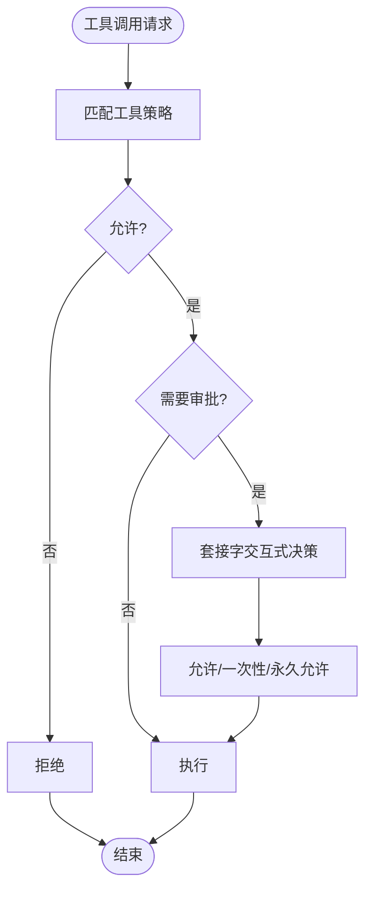
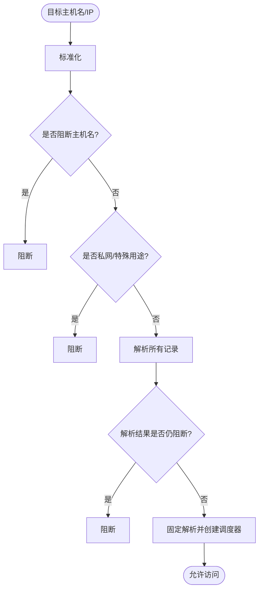
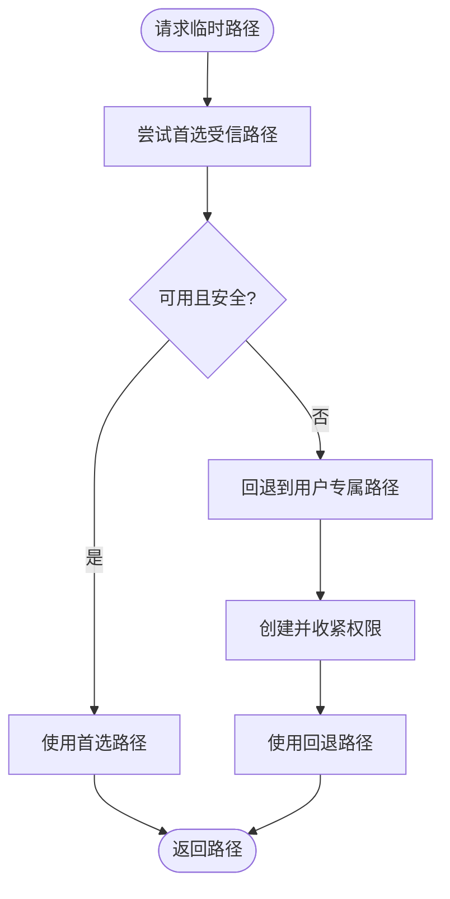
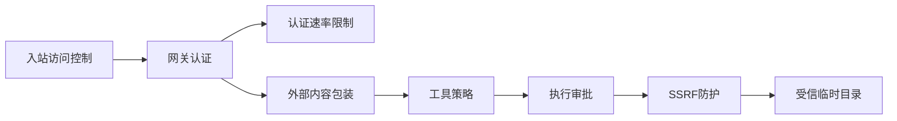

# 安全加固

<cite>
**本文引用的文件**
- [SECURITY.md](file://SECURITY.md)
- [docs/security/README.md](file://docs/security/README.md)
- [docs/security/CONTRIBUTING-THREAT-MODEL.md](file://docs/security/CONTRIBUTING-THREAT-MODEL.md)
- [docs/security/THREAT-MODEL-ATLAS.md](file://docs/security/THREAT-MODEL-ATLAS.md)
- [src/security/external-content.ts](file://src/security/external-content.ts)
- [src/gateway/auth.ts](file://src/gateway/auth.ts)
- [src/infra/exec-approvals.ts](file://src/infra/exec-approvals.ts)
- [src/agents/sandbox/tool-policy.ts](file://src/agents/sandbox/tool-policy.ts)
- [src/infra/net/ssrf.ts](file://src/infra/net/ssrf.ts)
- [src/web/inbound/access-control.ts](file://src/web/inbound/access-control.ts)
- [src/security/secret-equal.ts](file://src/security/secret-equal.ts)
- [src/gateway/auth-rate-limit.ts](file://src/gateway/auth-rate-limit.ts)
- [src/infra/tmp-openclaw-dir.ts](file://src/infra/tmp-openclaw-dir.ts)
- [src/plugin-sdk/temp-path.ts](file://src/plugin-sdk/temp-path.ts)
</cite>

## 目录
1. [引言](#引言)
2. [项目结构](#项目结构)
3. [核心组件](#核心组件)
4. [架构总览](#架构总览)
5. [详细组件分析](#详细组件分析)
6. [依赖关系分析](#依赖关系分析)
7. [性能考量](#性能考量)
8. [故障排查指南](#故障排查指南)
9. [结论](#结论)
10. [附录](#附录)

## 引言
本指南面向OpenClaw的安全加固与运维实践，围绕“信任模型—威胁建模—防护策略—审计与合规”的主线，系统阐述身份认证、授权控制、访问管理、网络隔离、数据与传输安全、安全审计与漏洞扫描、部署差异与风险评估、以及安全事件响应与应急处置。文档以仓库内现有安全策略、威胁模型与关键实现为依据，提供可操作的配置建议与最佳实践。

## 项目结构
OpenClaw在多层安全边界中运行：通道接入边界、会话隔离边界、工具执行边界、外部内容边界、供应链边界。各边界通过认证、授权、沙箱、SSRF防护、外部内容包装等机制协同工作，形成纵深防御。

图示来源
- [src/web/inbound/access-control.ts](file://src/web/inbound/access-control.ts#L41-L221)
- [src/gateway/auth.ts](file://src/gateway/auth.ts#L217-L490)
- [src/security/external-content.ts](file://src/security/external-content.ts#L235-L341)
- [src/agents/sandbox/tool-policy.ts](file://src/agents/sandbox/tool-policy.ts#L35-L110)
- [src/infra/exec-approvals.ts](file://src/infra/exec-approvals.ts#L451-L557)
- [src/infra/net/ssrf.ts](file://src/infra/net/ssrf.ts#L276-L364)
- [src/infra/tmp-openclaw-dir.ts](file://src/infra/tmp-openclaw-dir.ts#L34-L170)

章节来源
- [docs/security/THREAT-MODEL-ATLAS.md](file://docs/security/THREAT-MODEL-ATLAS.md#L56-L123)

## 核心组件
- 认证与授权
  - 网关认证：支持令牌、密码、可信代理、Tailscale头认证；速率限制器按作用域跟踪失败尝试并锁定。
  - 入站访问控制：基于允许列表、配对期、组策略等策略过滤消息来源。
- 外部内容处理
  - 统一封装与安全提示，标记与消毒潜在注入标记，提供统一提示构建函数。
- 工具与执行
  - 沙箱工具策略：允许/拒绝规则，支持通配与组展开，默认保留图像工具。
  - 执行审批：可配置安全级别与询问策略，支持套接字交互式决策。
- 网络与SSRF
  - 主机名/IP白名单、私网地址阻断、解析固定、调度器绑定，确保仅可达公网或显式允许目标。
- 临时目录与文件
  - 受信临时根目录解析与权限收紧，插件SDK提供随机路径生成与清理。

章节来源
- [src/gateway/auth.ts](file://src/gateway/auth.ts#L217-L490)
- [src/gateway/auth-rate-limit.ts](file://src/gateway/auth-rate-limit.ts#L95-L233)
- [src/web/inbound/access-control.ts](file://src/web/inbound/access-control.ts#L41-L221)
- [src/security/external-content.ts](file://src/security/external-content.ts#L235-L341)
- [src/agents/sandbox/tool-policy.ts](file://src/agents/sandbox/tool-policy.ts#L35-L110)
- [src/infra/exec-approvals.ts](file://src/infra/exec-approvals.ts#L451-L557)
- [src/infra/net/ssrf.ts](file://src/infra/net/ssrf.ts#L276-L364)
- [src/infra/tmp-openclaw-dir.ts](file://src/infra/tmp-openclaw-dir.ts#L34-L170)
- [src/plugin-sdk/temp-path.ts](file://src/plugin-sdk/temp-path.ts#L43-L85)

## 架构总览
下图展示从通道到执行的关键安全流经路径与职责边界：

图示来源
- [src/web/inbound/access-control.ts](file://src/web/inbound/access-control.ts#L41-L221)
- [src/gateway/auth.ts](file://src/gateway/auth.ts#L367-L490)
- [src/gateway/auth-rate-limit.ts](file://src/gateway/auth-rate-limit.ts#L141-L172)
- [src/security/external-content.ts](file://src/security/external-content.ts#L235-L341)
- [src/agents/sandbox/tool-policy.ts](file://src/agents/sandbox/tool-policy.ts#L16-L33)
- [src/infra/exec-approvals.ts](file://src/infra/exec-approvals.ts#L526-L557)
- [src/infra/net/ssrf.ts](file://src/infra/net/ssrf.ts#L276-L364)
- [src/infra/tmp-openclaw-dir.ts](file://src/infra/tmp-openclaw-dir.ts#L34-L170)

## 详细组件分析

### 身份认证与授权控制
- 网关认证模式
  - 支持令牌、密码、可信代理、默认模式；Tailscale头认证在特定表面启用。
  - 速率限制按作用域（共享密钥、设备令牌、钩子认证）独立计数，滑动窗口+锁定。
- 入站访问控制
  - DM策略：配对、允许列表、开放、禁用；组消息策略：开放、允许列表、禁用。
  - 自聊天模式与配对宽限期处理，历史消息抑制配对回复。
- 安全比较
  - 使用恒定时长比较函数避免时序攻击。

图示来源
- [src/gateway/auth.ts](file://src/gateway/auth.ts#L367-L490)
- [src/gateway/auth-rate-limit.ts](file://src/gateway/auth-rate-limit.ts#L141-L172)
- [src/security/secret-equal.ts](file://src/security/secret-equal.ts#L3-L12)

章节来源
- [src/gateway/auth.ts](file://src/gateway/auth.ts#L217-L490)
- [src/gateway/auth-rate-limit.ts](file://src/gateway/auth-rate-limit.ts#L95-L233)
- [src/security/secret-equal.ts](file://src/security/secret-equal.ts#L3-L12)
- [src/web/inbound/access-control.ts](file://src/web/inbound/access-control.ts#L41-L221)

### 外部内容处理与提示注入防护
- 标记与消毒
  - 为外部内容添加唯一边界标记与安全提示，消毒潜在注入标记。
- 统一提示
  - 将来源、发件人、主题、时间戳等上下文拼接到包装后的内容。
- 钩子来源识别
  - 识别钩子类型（如Gmail/Webhook），用于差异化处理。

图示来源
- [src/security/external-content.ts](file://src/security/external-content.ts#L235-L341)

章节来源
- [src/security/external-content.ts](file://src/security/external-content.ts#L1-L342)

### 工具策略与执行审批
- 工具策略
  - 支持全局/代理级允许/拒绝列表，编译通配与组展开，图像工具默认保留。
- 执行审批
  - 安全级别（拒绝/允许列表/全开）、询问策略（关闭/命中缺失时/总是）、套接字交互式决策、超时控制。

图示来源
- [src/agents/sandbox/tool-policy.ts](file://src/agents/sandbox/tool-policy.ts#L16-L33)
- [src/agents/sandbox/tool-policy.ts](file://src/agents/sandbox/tool-policy.ts#L35-L110)
- [src/infra/exec-approvals.ts](file://src/infra/exec-approvals.ts#L451-L557)

章节来源
- [src/agents/sandbox/tool-policy.ts](file://src/agents/sandbox/tool-policy.ts#L1-L110)
- [src/infra/exec-approvals.ts](file://src/infra/exec-approvals.ts#L1-L557)

### 网络隔离与SSRF防护
- 主机名/IP策略
  - 明确阻断主机名与特殊用途IP；支持显式允许主机名白名单；解析固定与调度器绑定。
- 私网与基准范围
  - 可选允许私网与RFC基准范围；严格拒绝解析失败与非法IPv4字面量。

图示来源
- [src/infra/net/ssrf.ts](file://src/infra/net/ssrf.ts#L276-L364)

章节来源
- [src/infra/net/ssrf.ts](file://src/infra/net/ssrf.ts#L1-L364)

### 临时目录与文件安全
- 受信临时根
  - 优先使用受信路径，否则回退到用户专属目录；自动修复权限或创建安全目录。
- 插件SDK
  - 随机路径生成、临时目录清理，确保下载产物隔离与回收。

图示来源
- [src/infra/tmp-openclaw-dir.ts](file://src/infra/tmp-openclaw-dir.ts#L34-L170)
- [src/plugin-sdk/temp-path.ts](file://src/plugin-sdk/temp-path.ts#L43-L85)

章节来源
- [src/infra/tmp-openclaw-dir.ts](file://src/infra/tmp-openclaw-dir.ts#L1-L170)
- [src/plugin-sdk/temp-path.ts](file://src/plugin-sdk/temp-path.ts#L1-L85)

## 依赖关系分析
- 组件耦合
  - 入站访问控制依赖配置与允许列表；网关认证依赖速率限制与可信代理配置；外部内容包装贯穿工具调用前；工具策略与执行审批共同决定最终执行；SSRF防护贯穿外部请求；临时目录为执行阶段提供受信介质。
- 关键依赖链
  - 通道消息 → 入站访问控制 → 网关认证 → 外部内容包装 → 工具策略 → 执行审批 → SSRF防护 → 临时目录写入。
- 外部依赖
  - Node.js标准库（crypto、dns、fs、os、path、undici）、平台网络栈；未见第三方安全库硬编码于核心模块。

图示来源
- [src/web/inbound/access-control.ts](file://src/web/inbound/access-control.ts#L41-L221)
- [src/gateway/auth.ts](file://src/gateway/auth.ts#L217-L490)
- [src/gateway/auth-rate-limit.ts](file://src/gateway/auth-rate-limit.ts#L95-L233)
- [src/security/external-content.ts](file://src/security/external-content.ts#L235-L341)
- [src/agents/sandbox/tool-policy.ts](file://src/agents/sandbox/tool-policy.ts#L35-L110)
- [src/infra/exec-approvals.ts](file://src/infra/exec-approvals.ts#L451-L557)
- [src/infra/net/ssrf.ts](file://src/infra/net/ssrf.ts#L276-L364)
- [src/infra/tmp-openclaw-dir.ts](file://src/infra/tmp-openclaw-dir.ts#L34-L170)

章节来源
- [src/web/inbound/access-control.ts](file://src/web/inbound/access-control.ts#L1-L226)
- [src/gateway/auth.ts](file://src/gateway/auth.ts#L1-L491)
- [src/gateway/auth-rate-limit.ts](file://src/gateway/auth-rate-limit.ts#L1-L233)
- [src/security/external-content.ts](file://src/security/external-content.ts#L1-L342)
- [src/agents/sandbox/tool-policy.ts](file://src/agents/sandbox/tool-policy.ts#L1-L110)
- [src/infra/exec-approvals.ts](file://src/infra/exec-approvals.ts#L1-L557)
- [src/infra/net/ssrf.ts](file://src/infra/net/ssrf.ts#L1-L364)
- [src/infra/tmp-openclaw-dir.ts](file://src/infra/tmp-openclaw-dir.ts#L1-L170)
- [src/plugin-sdk/temp-path.ts](file://src/plugin-sdk/temp-path.ts#L1-L85)

## 性能考量
- 认证速率限制
  - 滑动窗口与内存Map实现，定期清理避免无限增长；本地回环默认豁免，降低误伤。
- DNS解析与SSRF
  - 解析固定与调度器绑定减少DNS副作用；IPv4/IPv6解析与嵌入式IPv4快速判定，避免不必要失败。
- 工具策略与执行审批
  - 通配编译与缓存、允许列表合并与去重，降低匹配成本；交互式审批采用套接字异步，避免阻塞主流程。
- 外部内容包装
  - 标记消毒与提示拼接为纯文本处理，复杂度线性于输入长度；钩子类型识别轻量。

[本节为通用性能讨论，无需具体文件分析]

## 故障排查指南
- 认证失败与限流
  - 检查速率限制状态与锁定剩余时间；确认客户端IP归一化与作用域区分；验证令牌/密码恒定时长比较。
- 入站消息被拒
  - 核对DM/组策略、允许列表、配对宽限期与自聊天模式；关注历史消息抑制逻辑。
- 外部内容异常
  - 确认边界标记消毒与安全提示是否生效；核对来源标签与元数据；检查钩子类型识别。
- 工具调用被阻
  - 检查工具策略允许/拒绝列表与组展开；确认执行审批策略与交互式决策；核对套接字路径与令牌。
- SSRF访问失败
  - 核对主机名白名单与私网允许策略；检查解析固定与调度器绑定；确认阻断原因（主机名/IP/解析结果）。
- 临时目录问题
  - 检查首选路径可用性与权限；回退到用户专属路径并收紧权限；确认清理逻辑与错误处理。

章节来源
- [src/gateway/auth-rate-limit.ts](file://src/gateway/auth-rate-limit.ts#L141-L172)
- [src/gateway/auth.ts](file://src/gateway/auth.ts#L367-L490)
- [src/web/inbound/access-control.ts](file://src/web/inbound/access-control.ts#L41-L221)
- [src/security/external-content.ts](file://src/security/external-content.ts#L235-L341)
- [src/agents/sandbox/tool-policy.ts](file://src/agents/sandbox/tool-policy.ts#L35-L110)
- [src/infra/exec-approvals.ts](file://src/infra/exec-approvals.ts#L526-L557)
- [src/infra/net/ssrf.ts](file://src/infra/net/ssrf.ts#L276-L364)
- [src/infra/tmp-openclaw-dir.ts](file://src/infra/tmp-openclaw-dir.ts#L34-L170)
- [src/plugin-sdk/temp-path.ts](file://src/plugin-sdk/temp-path.ts#L61-L85)

## 结论
OpenClaw通过“通道接入—会话隔离—工具执行—外部内容—供应链”五道边界与认证、授权、沙箱、SSRF、内容包装、临时目录等技术手段，构建了可操作的安全框架。建议在生产部署中坚持最小暴露面、默认沙箱、严格的工具策略与执行审批、明确的外部访问白名单，并结合持续审计与威胁建模迭代完善。

[本节为总结性内容，无需具体文件分析]

## 附录

### 安全架构设计要点
- 信任模型
  - 单受信任操作员模型，会话标识仅路由控制而非多租户授权边界；多用户需严格隔离。
- 边界与数据流
  - 明确通道接入、会话隔离、工具执行、外部内容、供应链边界；数据流包含消息路由、工具调用、外部请求、技能分发与响应输出。
- 关键安全文件
  - 执行审批、网关认证、通道接入控制、SSRF防护、外部内容处理、工具策略、会话隔离等。

章节来源
- [docs/security/THREAT-MODEL-ATLAS.md](file://docs/security/THREAT-MODEL-ATLAS.md#L56-L123)
- [docs/security/THREAT-MODEL-ATLAS.md](file://docs/security/THREAT-MODEL-ATLAS.md#L575-L588)

### 威胁模型与缓解清单（摘要）
- 主要威胁与推荐措施
  - 技能供应链持久化：完成病毒扫描集成、技能沙箱、社区举报与审计日志。
  - 提示注入与间接注入：实现输出验证、敏感动作确认、URL白名单。
  - 执行审批绕过：改进命令规范化与黑名单、提升审批UX。
  - 资源耗尽与声誉损害：实现每发送者速率限制、成本预算与输出过滤。
- 关键攻击链
  - 技能发布→规避审核→凭证窃取
  - 提示注入→绕过审批→远程命令执行
  - 间接注入→外部抓取→数据外泄

章节来源
- [docs/security/THREAT-MODEL-ATLAS.md](file://docs/security/THREAT-MODEL-ATLAS.md#L505-L527)
- [docs/security/THREAT-MODEL-ATLAS.md](file://docs/security/THREAT-MODEL-ATLAS.md#L530-L557)

### 安全审计与合规
- 审计入口
  - 文档中心的安全与信任页面、威胁模型贡献指南与MITRE ATLAS框架。
- 合规要点
  - 令牌加密与轮换、配置完整性校验、更新签名与版本固定、渠道身份验证增强。
- 漏洞扫描
  - 使用detect-secrets进行CI/CD秘密检测，本地扫描与基线管理。

章节来源
- [docs/security/README.md](file://docs/security/README.md#L1-L18)
- [docs/security/CONTRIBUTING-THREAT-MODEL.md](file://docs/security/CONTRIBUTING-THREAT-MODEL.md#L1-L91)
- [SECURITY.md](file://SECURITY.md#L273-L284)

### 不同部署环境下的安全配置差异
- 本地回环优先
  - 默认绑定回环地址，禁用危险的设备认证开关；非本地暴露应通过SSH隧道或Tailscale。
- 容器安全
  - 非root运行、只读文件系统、能力降级；卷挂载最小化。
- 多用户/多实例
  - 严格按用户/主机/网关隔离；避免共享同一网关的互不信任用户。
- 远程访问
  - 使用可信代理或Tailscale；启用网关认证与速率限制；防火墙/尾网控制。

章节来源
- [SECURITY.md](file://SECURITY.md#L223-L241)
- [SECURITY.md](file://SECURITY.md#L257-L272)
- [SECURITY.md](file://SECURITY.md#L130-L150)

### 安全事件响应与应急处置
- 报告与受理
  - 严格报告模板与可复现要求；快速分流与重复报告处理；维护GHSA更新流程。
- 事件分类与处置
  - 分类：提示注入、工具滥用、供应链、凭证泄露、DoS；处置：立即隔离、修复与回滚、补丁发布、通告与演练。
- 持续改进
  - 威胁建模迭代、缓解措施落地、自动化扫描与基线维护。

章节来源
- [SECURITY.md](file://SECURITY.md#L20-L73)
- [docs/security/CONTRIBUTING-THREAT-MODEL.md](file://docs/security/CONTRIBUTING-THREAT-MODEL.md#L68-L87)