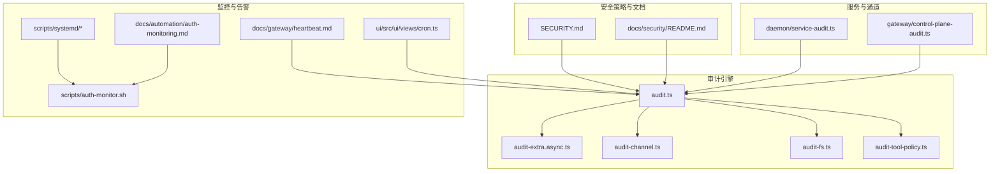
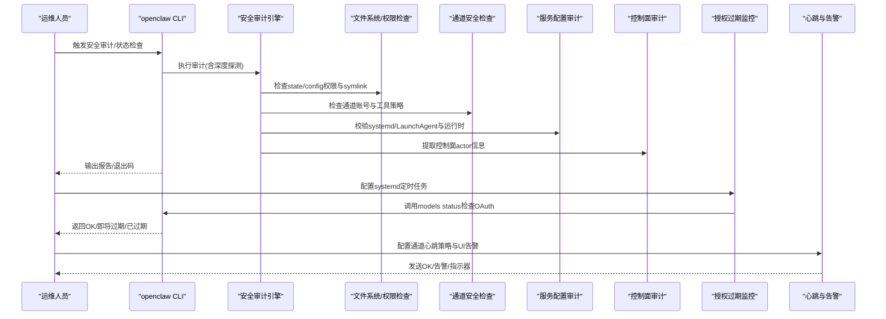
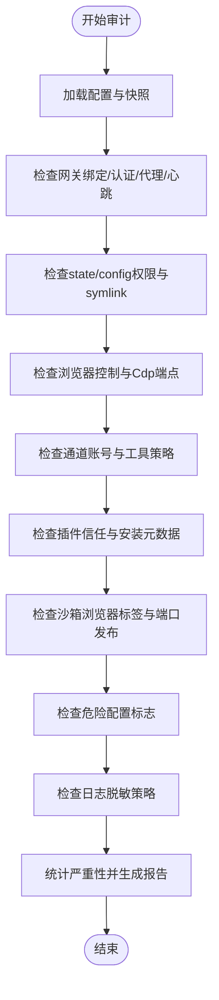
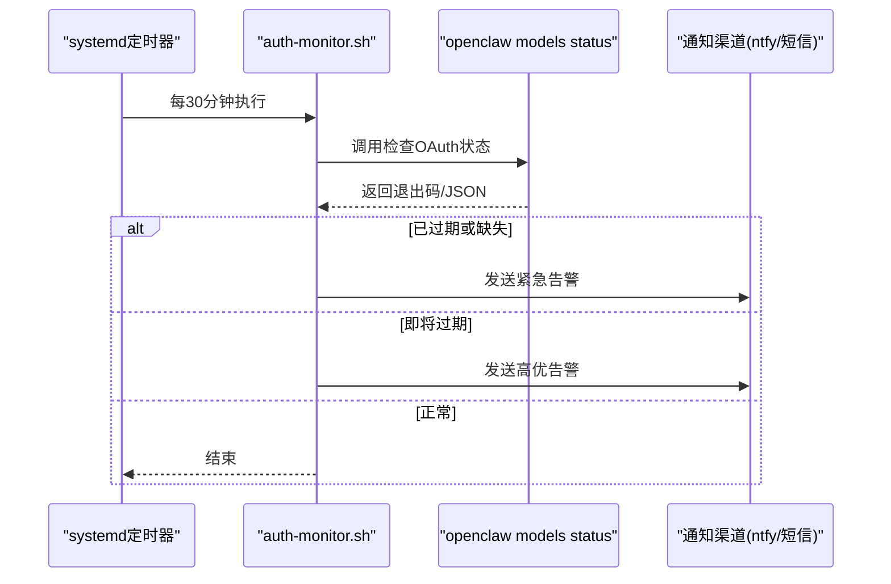
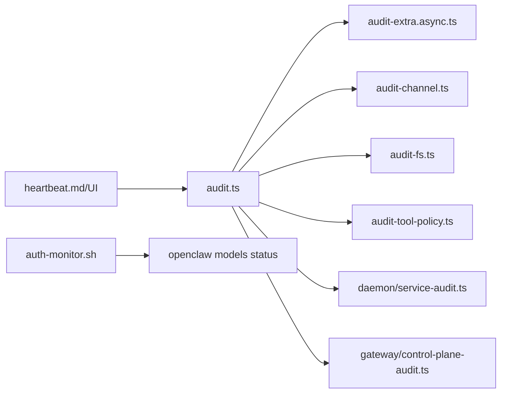

# 安全审计与监控

<cite>
**本文引用的文件**
- [SECURITY.md](file://SECURITY.md)
- [docs/security/README.md](file://docs/security/README.md)
- [src/security/audit.ts](file://src/security/audit.ts)
- [src/security/audit-extra.async.ts](file://src/security/audit-extra.async.ts)
- [src/security/audit-channel.ts](file://src/security/audit-channel.ts)
- [src/security/audit-fs.ts](file://src/security/audit-fs.ts)
- [src/security/audit-tool-policy.ts](file://src/security/audit-tool-policy.ts)
- [src/security/audit.test.ts](file://src/security/audit.test.ts)
- [src/daemon/service-audit.ts](file://src/daemon/service-audit.ts)
- [src/gateway/control-plane-audit.ts](file://src/gateway/control-plane-audit.ts)
- [scripts/systemd/openclaw-auth-monitor.service](file://scripts/systemd/openclaw-auth-monitor.service)
- [scripts/systemd/openclaw-auth-monitor.timer](file://scripts/systemd/openclaw-auth-monitor.timer)
- [scripts/auth-monitor.sh](file://scripts/auth-monitor.sh)
- [docs/automation/auth-monitoring.md](file://docs/automation/auth-monitoring.md)
- [docs/gateway/heartbeat.md](file://docs/gateway/heartbeat.md)
- [ui/src/ui/views/cron.ts](file://ui/src/ui/views/cron.ts)
</cite>

## 目录
1. [简介](#简介)
2. [项目结构](#项目结构)
3. [核心组件](#核心组件)
4. [架构总览](#架构总览)
5. [详细组件分析](#详细组件分析)
6. [依赖关系分析](#依赖关系分析)
7. [性能考量](#性能考量)
8. [故障排查指南](#故障排查指南)
9. [结论](#结论)
10. [附录](#附录)

## 简介
本指南面向OpenClaw的安全审计与监控运维，聚焦以下目标：
- 安全事件日志收集、分析与报告机制
- 访问控制审计、操作行为追踪与异常检测规则
- 安全指标监控、告警阈值与响应流程
- 渗透测试、漏洞扫描与合规性检查工具
- 安全基线配置、风险评估与持续改进机制

OpenClaw通过“可信操作员”模型与严格的边界控制（认证、授权、沙箱、工具策略）实现安全运行；同时提供自动化审计、服务配置审计、通道安全审计与授权过期监控等能力，帮助在生产环境中建立可操作的安全运营体系。

## 项目结构
围绕安全审计与监控的关键目录与文件：
- 安全策略与威胁模型：SECURITY.md、docs/security/README.md
- 审计引擎与报告：src/security/audit.ts、audit-extra.async.ts、audit-channel.ts、audit-fs.ts、audit-tool-policy.ts
- 服务配置审计：src/daemon/service-audit.ts
- 控制面审计与追踪：src/gateway/control-plane-audit.ts
- 授权过期监控：scripts/systemd/*、scripts/auth-monitor.sh、docs/automation/auth-monitoring.md
- 告警与心跳：docs/gateway/heartbeat.md、ui/src/ui/views/cron.ts

图表来源
- [SECURITY.md](file://SECURITY.md#L1-L284)
- [docs/security/README.md](file://docs/security/README.md#L1-L18)
- [src/security/audit.ts](file://src/security/audit.ts#L1-L800)
- [src/security/audit-extra.async.ts](file://src/security/audit-extra.async.ts#L1-L800)
- [src/security/audit-channel.ts](file://src/security/audit-channel.ts#L83-L142)
- [src/security/audit-fs.ts](file://src/security/audit-fs.ts#L1-L200)
- [src/security/audit-tool-policy.ts](file://src/security/audit-tool-policy.ts#L1-L200)
- [src/daemon/service-audit.ts](file://src/daemon/service-audit.ts#L1-L406)
- [src/gateway/control-plane-audit.ts](file://src/gateway/control-plane-audit.ts#L1-L41)
- [scripts/systemd/openclaw-auth-monitor.service](file://scripts/systemd/openclaw-auth-monitor.service#L1-L15)
- [scripts/systemd/openclaw-auth-monitor.timer](file://scripts/systemd/openclaw-auth-monitor.timer#L1-L11)
- [scripts/auth-monitor.sh](file://scripts/auth-monitor.sh#L1-L90)
- [docs/automation/auth-monitoring.md](file://docs/automation/auth-monitoring.md#L1-L45)
- [docs/gateway/heartbeat.md](file://docs/gateway/heartbeat.md#L277-L313)
- [ui/src/ui/views/cron.ts](file://ui/src/ui/views/cron.ts#L1237-L1260)

章节来源
- [SECURITY.md](file://SECURITY.md#L1-L284)
- [docs/security/README.md](file://docs/security/README.md#L1-L18)

## 核心组件
- 安全审计引擎：统一收集配置、网络暴露、文件权限、通道安全、插件信任、沙箱浏览器、工具策略等维度的发现项，输出带严重性的报告摘要与明细。
- 服务配置审计：校验systemd/LaunchAgent配置、运行时路径与版本管理器使用、令牌一致性与最小PATH等，确保服务稳定与安全。
- 控制面审计：从连接上下文提取操作者标识（actor）、设备ID、客户端IP、连接ID，用于审计与追踪。
- 授权过期监控：定时检查Claude等OAuth凭据有效期，支持通知渠道（短信、ntfy），避免服务因凭据过期中断。
- 心跳与告警：通过通道心跳策略控制“正常OK”、“告警内容”、“指示器事件”的发送，结合UI配置的失败告警冷却时间与告警通道，形成闭环。

章节来源
- [src/security/audit.ts](file://src/security/audit.ts#L1-L800)
- [src/daemon/service-audit.ts](file://src/daemon/service-audit.ts#L1-L406)
- [src/gateway/control-plane-audit.ts](file://src/gateway/control-plane-audit.ts#L1-L41)
- [scripts/auth-monitor.sh](file://scripts/auth-monitor.sh#L1-L90)
- [docs/gateway/heartbeat.md](file://docs/gateway/heartbeat.md#L277-L313)
- [ui/src/ui/views/cron.ts](file://ui/src/ui/views/cron.ts#L1237-L1260)

## 架构总览
下图展示OpenClaw安全审计与监控的整体交互：CLI/脚本触发审计或状态检查，审计引擎汇总多源信息生成报告；服务审计保障运行时环境；通道与控制面审计提供访问与行为追踪；授权过期监控与心跳告警形成持续监控闭环。

图表来源
- [src/security/audit.ts](file://src/security/audit.ts#L1-L800)
- [src/security/audit-extra.async.ts](file://src/security/audit-extra.async.ts#L1-L800)
- [src/security/audit-channel.ts](file://src/security/audit-channel.ts#L83-L142)
- [src/daemon/service-audit.ts](file://src/daemon/service-audit.ts#L1-L406)
- [src/gateway/control-plane-audit.ts](file://src/gateway/control-plane-audit.ts#L1-L41)
- [scripts/systemd/openclaw-auth-monitor.service](file://scripts/systemd/openclaw-auth-monitor.service#L1-L15)
- [scripts/systemd/openclaw-auth-monitor.timer](file://scripts/systemd/openclaw-auth-monitor.timer#L1-L11)
- [scripts/auth-monitor.sh](file://scripts/auth-monitor.sh#L1-L90)
- [docs/automation/auth-monitoring.md](file://docs/automation/auth-monitoring.md#L1-L45)
- [docs/gateway/heartbeat.md](file://docs/gateway/heartbeat.md#L277-L313)

## 详细组件分析

### 安全审计引擎（audit.ts）
- 统一入口：收集配置、网络暴露、文件系统、通道安全、插件信任、沙箱浏览器、工具策略、危险标志等发现项，按严重性统计并生成报告。
- 关键能力：
  - 网关绑定与认证：对非loopback绑定且无认证、Control UI未配置允许来源、反向代理信任缺失、Tailscale暴露模式等给出警告/严重。
  - 文件系统：state/config目录权限、符号链接、敏感信息脱敏策略等。
  - 浏览器控制：远程CDP协议、认证缺失等。
  - 日志与脱敏：redactSensitive配置不当的风险。
  - 危险标志：启用不安全或危险配置项的提示。
- 报告结构：包含时间戳、严重性统计、发现项列表，以及可选的深度探测结果（如网关可达性）。

图表来源
- [src/security/audit.ts](file://src/security/audit.ts#L1-L800)

章节来源
- [src/security/audit.ts](file://src/security/audit.ts#L1-L800)

### 异步审计扩展（audit-extra.async.ts）
- I/O型审计：扫描工作区技能文件、插件安装完整性与版本漂移、Docker沙箱浏览器容器标签与端口发布、插件/钩子NPM规范与完整性等。
- 关键发现：
  - 插件未白名单：当存在扩展但未设置plugins.allow时，若原生技能命令开启则视为高风险。
  - 工具可达性：在宽松工具策略或显式允许扩展插件工具的上下文中，可能扩大攻击面。
  - Docker沙箱：缺少config hash标签、过期epoch、非loopback发布端口等。
  - 供应链：未固定版本、缺失integrity、安装版本与记录版本漂移。

章节来源
- [src/security/audit-extra.async.ts](file://src/security/audit-extra.async.ts#L1-L800)

### 通道安全审计（audit-channel.ts）
- 去重与聚合：对同一checkId、严重性、标题、详情、修复建议进行去重，保证报告质量。
- 账号级检查：遍历各通道插件的账户配置，调用其inspectAccount或只读检查函数，识别潜在配置风险。

章节来源
- [src/security/audit-channel.ts](file://src/security/audit-channel.ts#L83-L142)

### 文件系统审计（audit-fs.ts）
- 权限检查：state/config目录及关键文件的world/group可读写、符号链接等风险。
- 权限修复建议：提供平台化修复命令与建议模式（如0o700/0o600）。

章节来源
- [src/security/audit-fs.ts](file://src/security/audit-fs.ts#L1-L200)

### 工具策略审计（audit-tool-policy.ts）
- 工具可达性与策略匹配：判断在特定agent上下文与沙箱模式下，是否允许扩展插件工具被调用，避免过度授权。

章节来源
- [src/security/audit-tool-policy.ts](file://src/security/audit-tool-policy.ts#L1-L200)

### 服务配置审计（daemon/service-audit.ts）
- systemd/LaunchAgent：After/Wants网络在线、RestartSec、KeepAlive、RunAtLoad等。
- 运行时与PATH：禁止Bun运行（与部分通道不兼容）、避免版本管理器路径、推荐最小PATH。
- 令牌一致性：服务环境OPENCLAW_GATEWAY_TOKEN与配置文件中的gateway.auth.token是否一致，防止重启后使用旧令牌。

章节来源
- [src/daemon/service-audit.ts](file://src/daemon/service-audit.ts#L1-L406)

### 控制面审计（gateway/control-plane-audit.ts）
- 提取actor信息：连接客户端ID、设备ID、客户端IP、连接ID，格式化输出，便于审计与追踪。
- 变更路径汇总：限制展示数量，避免噪声。

章节来源
- [src/gateway/control-plane-audit.ts](file://src/gateway/control-plane-audit.ts#L1-L41)

### 授权过期监控（scripts/systemd/* 与 auth-monitor.sh）
- systemd单元与定时器：每30分钟检查一次OAuth状态，支持通知（短信/ntfy）与节流（每小时最多一次）。
- CLI优先：优先使用openclaw models status --check/--json获取健康状态，回退到直接读取凭据文件。
- 退出码语义：0=OK、1=已过期/缺失凭据、2=即将过期（24h内）。

图表来源
- [scripts/systemd/openclaw-auth-monitor.service](file://scripts/systemd/openclaw-auth-monitor.service#L1-L15)
- [scripts/systemd/openclaw-auth-monitor.timer](file://scripts/systemd/openclaw-auth-monitor.timer#L1-L11)
- [scripts/auth-monitor.sh](file://scripts/auth-monitor.sh#L1-L90)
- [docs/automation/auth-monitoring.md](file://docs/automation/auth-monitoring.md#L1-L45)

章节来源
- [scripts/systemd/openclaw-auth-monitor.service](file://scripts/systemd/openclaw-auth-monitor.service#L1-L15)
- [scripts/systemd/openclaw-auth-monitor.timer](file://scripts/systemd/openclaw-auth-monitor.timer#L1-L11)
- [scripts/auth-monitor.sh](file://scripts/auth-monitor.sh#L1-L90)
- [docs/automation/auth-monitoring.md](file://docs/automation/auth-monitoring.md#L1-L45)

### 心跳与告警（docs/gateway/heartbeat.md 与 UI配置）
- 心跳策略：showOk、showAlerts、useIndicator三者组合决定消息与指示器行为。
- UI配置：失败告警冷却时间与告警通道选择，避免噪音并确保关键告警可见。

章节来源
- [docs/gateway/heartbeat.md](file://docs/gateway/heartbeat.md#L277-L313)
- [ui/src/ui/views/cron.ts](file://ui/src/ui/views/cron.ts#L1237-L1260)

## 依赖关系分析
- 审计引擎依赖：
  - 配置解析与快照：读取openclaw.json与状态目录
  - 通道插件：调用各通道的inspectAccount或只读检查
  - 文件系统：检查state/config权限与symlink
  - Docker：沙箱浏览器容器检查
  - 运行时：Node版本要求与运行时路径
- 服务审计依赖：
  - systemd/LaunchAgent配置文件解析
  - PATH与运行时二进制路径检测
- 控制面审计依赖：
  - 连接上下文信息（客户端ID、设备ID、IP、连接ID）

图表来源
- [src/security/audit.ts](file://src/security/audit.ts#L1-L800)
- [src/security/audit-extra.async.ts](file://src/security/audit-extra.async.ts#L1-L800)
- [src/security/audit-channel.ts](file://src/security/audit-channel.ts#L83-L142)
- [src/security/audit-fs.ts](file://src/security/audit-fs.ts#L1-L200)
- [src/security/audit-tool-policy.ts](file://src/security/audit-tool-policy.ts#L1-L200)
- [src/daemon/service-audit.ts](file://src/daemon/service-audit.ts#L1-L406)
- [src/gateway/control-plane-audit.ts](file://src/gateway/control-plane-audit.ts#L1-L41)
- [scripts/auth-monitor.sh](file://scripts/auth-monitor.sh#L1-L90)
- [docs/gateway/heartbeat.md](file://docs/gateway/heartbeat.md#L277-L313)

章节来源
- [src/security/audit.ts](file://src/security/audit.ts#L1-L800)
- [src/daemon/service-audit.ts](file://src/daemon/service-audit.ts#L1-L406)

## 性能考量
- 深度探测：默认关闭，仅在需要时启用，避免对生产环境造成额外负载。
- 缓存与去重：通道发现项去重，减少重复告警；代码安全扫描结果缓存，降低重复扫描成本。
- I/O优化：批量读取与并发检查（如Docker容器查询），并在失败时允许降级处理。
- 告警节流：授权过期监控中限制通知频率，避免告警风暴。

## 故障排查指南
- 审计报告解读
  - 严重性：info/warn/critical，分别对应低/中/高风险。
  - 去重：相同checkId与描述的重复项会被合并。
  - 修复建议：针对每个发现项提供具体修复步骤与建议模式。
- 常见问题定位
  - 网络暴露：确认gateway.bind与auth配置，避免非loopback绑定且无认证。
  - 文件权限：state/config目录应严格限制权限（0o700/0o600），避免symlink。
  - 插件信任：设置plugins.allow白名单，避免未固定版本与缺失integrity。
  - 沙箱浏览器：确保容器标签与端口发布符合安全基线。
  - 服务配置：systemd/LaunchAgent满足After/Wants网络在线、KeepAlive/RunAtLoad等；PATH最小化；运行时使用系统Node 22+。
  - 授权过期：使用openclaw models status --check获取健康状态；配置systemd定时器与通知渠道。
- 单元测试参考
  - 通过测试用例验证loopback控制UI与日志脱敏等场景的发现项与严重性。

章节来源
- [src/security/audit.ts](file://src/security/audit.ts#L1-L800)
- [src/security/audit.test.ts](file://src/security/audit.test.ts#L593-L643)
- [scripts/auth-monitor.sh](file://scripts/auth-monitor.sh#L1-L90)

## 结论
OpenClaw通过“可信操作员”模型与多层安全边界（认证、授权、沙箱、工具策略）构建安全基线，并以自动化审计、服务配置审计、通道与文件系统检查、授权过期监控与心跳告警形成闭环。遵循本文提供的基线配置、阈值与响应流程，可有效提升生产环境的安全性与可观测性。

## 附录
- 安全策略与威胁模型
  - 参考安全策略与威胁模型文档，了解受保护边界、多租户假设、插件信任边界、工作区内存边界等。
- 运行时要求
  - Node.js 22.12.0及以上，包含关键CVE修复。
- Docker安全建议
  - 使用非root用户、只读文件系统、丢弃多余能力等。

章节来源
- [SECURITY.md](file://SECURITY.md#L242-L284)