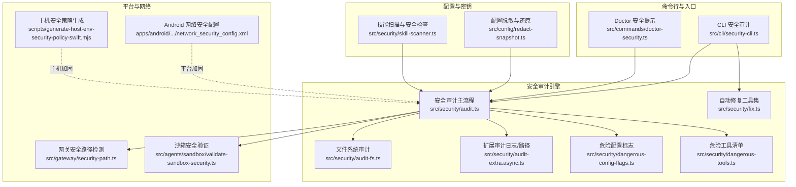
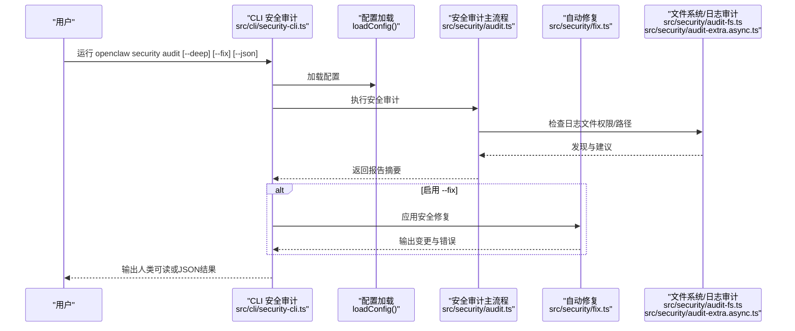
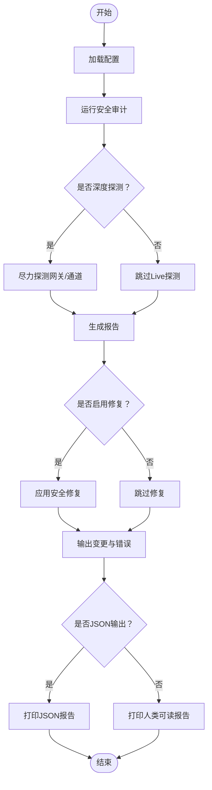
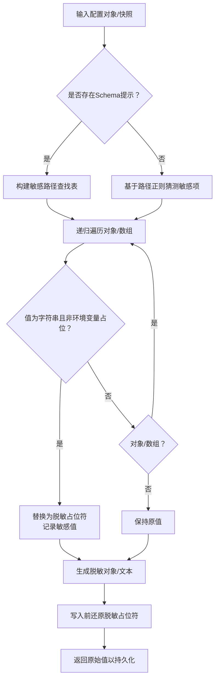
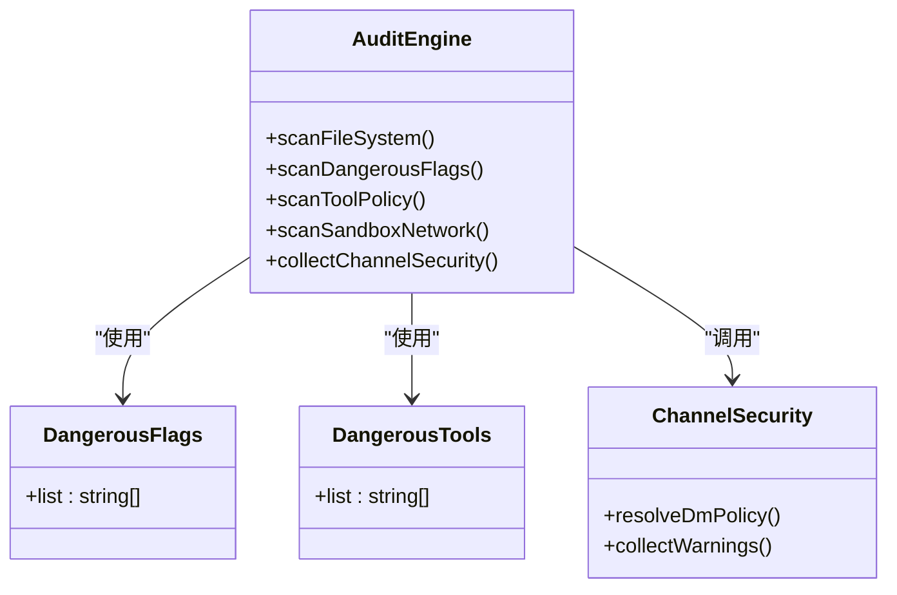
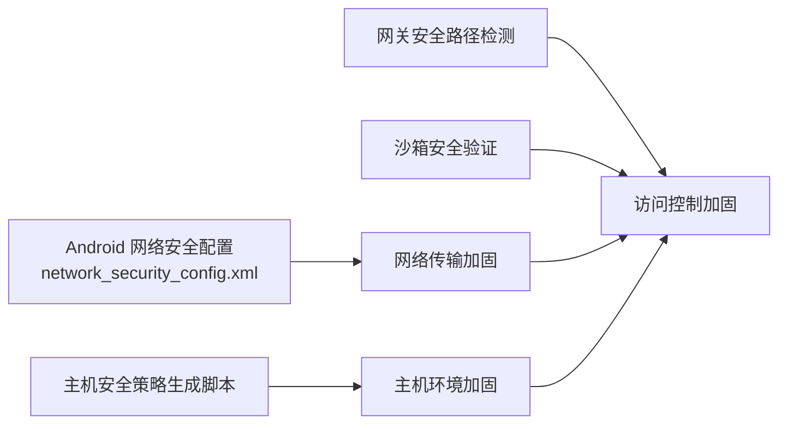
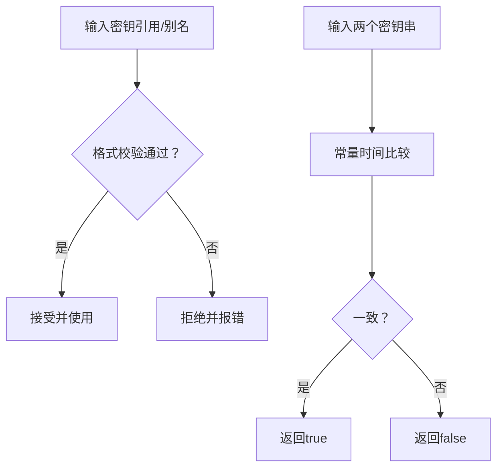
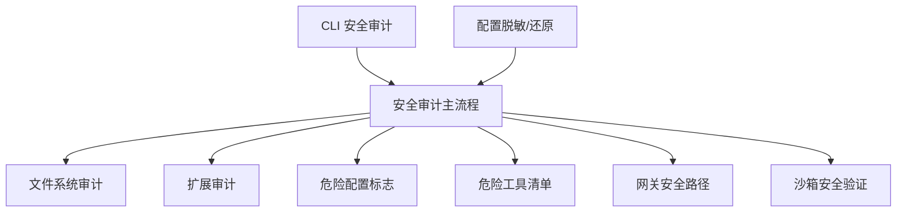

# 数据保护与加密

<cite>
**本文引用的文件**
- [docs/cli/security.md](file://docs/cli/security.md)
- [src/cli/security-cli.ts](file://src/cli/security-cli.ts)
- [src/commands/doctor-security.ts](file://src/commands/doctor-security.ts)
- [src/config/redact-snapshot.ts](file://src/config/redact-snapshot.ts)
- [src/security/audit.ts](file://src/security/audit.ts)
- [src/security/fix.ts](file://src/security/fix.ts)
- [src/security/audit-extra.async.ts](file://src/security/audit-extra.async.ts)
- [src/security/audit-fs.ts](file://src/security/audit-fs.ts)
- [src/security/dangerous-config-flags.ts](file://src/security/dangerous-config-flags.ts)
- [src/security/dangerous-tools.ts](file://src/security/dangerous-tools.ts)
- [src/security/skill-scanner.ts](file://src/security/skill-scanner.ts)
- [src/security/temp-path-guard.test.ts](file://src/security/temp-path-guard.test.ts)
- [src/security/windows-acl.ts](file://src/security/windows-acl.ts)
- [src/gateway/security-path.ts](file://src/gateway/security-path.ts)
- [src/agents/sandbox/validate-sandbox-security.ts](file://src/agents/sandbox/validate-sandbox-security.ts)
- [apps/android/app/src/main/res/xml/network_security_config.xml](file://apps/android/app/src/main/res/xml/network_security_config.xml)
- [scripts/generate-host-env-security-policy-swift.mjs](file://scripts/generate-host-env-security-policy-swift.mjs)
- [docs/gateway/configuration.md](file://docs/gateway/configuration.md)
- [docs/gateway/configuration-reference.md](file://docs/gateway/configuration-reference.md)
- [.secrets.baseline](file://.secrets.baseline)
</cite>

## 目录
1. [简介](#简介)
2. [项目结构](#项目结构)
3. [核心组件](#核心组件)
4. [架构总览](#架构总览)
5. [详细组件分析](#详细组件分析)
6. [依赖关系分析](#依赖关系分析)
7. [性能考量](#性能考量)
8. [故障排查指南](#故障排查指南)
9. [结论](#结论)
10. [附录](#附录)

## 简介
本文件面向OpenClaw的数据保护与加密体系，系统化阐述敏感数据脱敏、密钥管理、安全存储、配置文件加密、数据库安全、传输数据保护、数据脱敏、访问日志与审计追踪、备份加密与恢复安全、销毁策略，以及合规性与隐私保护、数据泄露防护等要求与实现要点。内容基于仓库中现有安全工具链、配置脱敏机制、通道安全策略与平台加固实践进行归纳总结，并提供可操作的实施建议与流程图示。

## 项目结构
OpenClaw在多层实现安全能力：
- CLI安全审计：提供本地配置与状态的快速安全审计与修复建议
- 配置脱敏：对配置对象与原始文本进行敏感字段识别与替换
- 安全审计引擎：扫描文件系统权限、危险配置标志、工具策略、沙箱与网络暴露风险
- 平台加固：Android网络安全配置、主机环境安全策略生成脚本
- 渠道安全：各通道的DM策略与安全警告收集
- 密钥与凭证：密钥引用校验、安全比较、危险配置与工具清单

**图表来源**
- [src/cli/security-cli.ts](file://src/cli/security-cli.ts#L30-L165)
- [src/commands/doctor-security.ts](file://src/commands/doctor-security.ts#L51-L234)
- [src/security/audit.ts](file://src/security/audit.ts)
- [src/security/fix.ts](file://src/security/fix.ts)
- [src/security/audit-fs.ts](file://src/security/audit-fs.ts)
- [src/security/audit-extra.async.ts](file://src/security/audit-extra.async.ts#L1095-L1127)
- [src/security/dangerous-config-flags.ts](file://src/security/dangerous-config-flags.ts)
- [src/security/dangerous-tools.ts](file://src/security/dangerous-tools.ts)
- [src/config/redact-snapshot.ts](file://src/config/redact-snapshot.ts#L344-L402)
- [src/security/skill-scanner.ts](file://src/security/skill-scanner.ts)
- [apps/android/app/src/main/res/xml/network_security_config.xml](file://apps/android/app/src/main/res/xml/network_security_config.xml)
- [scripts/generate-host-env-security-policy-swift.mjs](file://scripts/generate-host-env-security-policy-swift.mjs)
- [src/gateway/security-path.ts](file://src/gateway/security-path.ts)
- [src/agents/sandbox/validate-sandbox-security.ts](file://src/agents/sandbox/validate-sandbox-security.ts)

**章节来源**
- [src/cli/security-cli.ts](file://src/cli/security-cli.ts#L30-L165)
- [src/commands/doctor-security.ts](file://src/commands/doctor-security.ts#L51-L234)
- [src/security/audit.ts](file://src/security/audit.ts)
- [src/security/fix.ts](file://src/security/fix.ts)
- [src/security/audit-fs.ts](file://src/security/audit-fs.ts)
- [src/security/audit-extra.async.ts](file://src/security/audit-extra.async.ts#L1095-L1127)
- [src/security/dangerous-config-flags.ts](file://src/security/dangerous-config-flags.ts)
- [src/security/dangerous-tools.ts](file://src/security/dangerous-tools.ts)
- [src/config/redact-snapshot.ts](file://src/config/redact-snapshot.ts#L344-L402)
- [src/security/skill-scanner.ts](file://src/security/skill-scanner.ts)
- [apps/android/app/src/main/res/xml/network_security_config.xml](file://apps/android/app/src/main/res/xml/network_security_config.xml)
- [scripts/generate-host-env-security-policy-swift.mjs](file://scripts/generate-host-env-security-policy-swift.mjs)
- [src/gateway/security-path.ts](file://src/gateway/security-path.ts)
- [src/agents/sandbox/validate-sandbox-security.ts](file://src/agents/sandbox/validate-sandbox-security.ts)

## 核心组件
- CLI安全审计与修复
  - 提供本地配置与状态的安全审计、深度探测与自动修复；支持JSON输出用于CI/策略检查；默认收紧敏感信息脱敏级别并调整状态/配置文件权限。
- 配置脱敏与还原
  - 基于Schema提示与正则模式识别敏感路径，对配置对象与原始JSON5文本进行脱敏；在写入前还原被脱敏的敏感值，确保Web UI轮询不泄漏凭据。
- 安全审计引擎
  - 扫描文件系统权限、危险配置标志、工具策略、沙箱与网络暴露风险；针对通道DM策略、Webhook会话键、mDNS元数据泄漏、Docker网络模式等发出告警。
- 平台与网络加固
  - Android网络安全配置限制明文流量；主机安全策略生成脚本辅助设置安全策略；网关路径检测与沙箱安全验证降低越权与逃逸风险。
- 密钥与凭证管理
  - 密钥引用格式校验、安全相等比较、危险配置与工具清单，避免误用高危参数与工具造成安全风险。

**章节来源**
- [docs/cli/security.md](file://docs/cli/security.md#L1-L72)
- [src/cli/security-cli.ts](file://src/cli/security-cli.ts#L51-L163)
- [src/config/redact-snapshot.ts](file://src/config/redact-snapshot.ts#L116-L306)
- [src/security/audit.ts](file://src/security/audit.ts)
- [src/security/fix.ts](file://src/security/fix.ts)
- [src/security/audit-fs.ts](file://src/security/audit-fs.ts)
- [src/security/audit-extra.async.ts](file://src/security/audit-extra.async.ts#L1095-L1127)
- [src/security/dangerous-config-flags.ts](file://src/security/dangerous-config-flags.ts)
- [src/security/dangerous-tools.ts](file://src/security/dangerous-tools.ts)
- [src/gateway/security-path.ts](file://src/gateway/security-path.ts)
- [src/agents/sandbox/validate-sandbox-security.ts](file://src/agents/sandbox/validate-sandbox-security.ts)
- [apps/android/app/src/main/res/xml/network_security_config.xml](file://apps/android/app/src/main/res/xml/network_security_config.xml)
- [scripts/generate-host-env-security-policy-swift.mjs](file://scripts/generate-host-env-security-policy-swift.mjs)

## 架构总览
下图展示从CLI到审计引擎、配置脱敏、平台加固与修复的整体流程：

**图表来源**
- [src/cli/security-cli.ts](file://src/cli/security-cli.ts#L51-L163)
- [src/security/audit.ts](file://src/security/audit.ts)
- [src/security/fix.ts](file://src/security/fix.ts)
- [src/security/audit-fs.ts](file://src/security/audit-fs.ts)
- [src/security/audit-extra.async.ts](file://src/security/audit-extra.async.ts#L1095-L1127)

## 详细组件分析

### 组件A：CLI安全审计与修复
- 功能要点
  - 支持普通审计、深度探测、自动修复与JSON输出；默认收紧敏感信息脱敏级别并调整状态/配置文件权限；不执行令牌轮换、禁用工具或改变网关绑定暴露。
  - Doctor安全提示：对网关绑定暴露、认证缺失、通道DM策略、心跳直发策略等给出明确建议与修复命令。
- 处理逻辑
  - CLI命令注册与帮助格式化；加载配置后调用审计引擎；根据选项输出人类可读或JSON；若启用修复，执行修复动作并汇总变更与错误。
- 性能与可用性
  - 深度探测为尽力而为的Live Probe；JSON输出便于CI集成与策略自动化。

**图表来源**
- [src/cli/security-cli.ts](file://src/cli/security-cli.ts#L51-L163)
- [src/commands/doctor-security.ts](file://src/commands/doctor-security.ts#L51-L234)
- [docs/cli/security.md](file://docs/cli/security.md#L17-L72)

**章节来源**
- [docs/cli/security.md](file://docs/cli/security.md#L1-L72)
- [src/cli/security-cli.ts](file://src/cli/security-cli.ts#L30-L165)
- [src/commands/doctor-security.ts](file://src/commands/doctor-security.ts#L51-L234)

### 组件B：配置脱敏与安全存储
- 敏感数据识别
  - 基于Schema提示（ConfigUiHints）与路径正则匹配识别敏感字段；支持数组、通配路径与对象整体敏感标记；对SecretRef对象仅脱敏id字段，保留非敏感结构。
- 脱敏与还原
  - 对配置对象与解析后的resolved配置进行脱敏；对原始JSON5文本按最长优先替换敏感值；写入前通过还原函数将脱敏占位符恢复为原始值，避免凭据丢失。
- 安全存储
  - 通过文件系统权限审计与修复，确保状态/配置文件与会话日志具备最小必要权限；日志文件可包含私信与工具输出，需严格限制可读范围。

**图表来源**
- [src/config/redact-snapshot.ts](file://src/config/redact-snapshot.ts#L116-L306)
- [src/config/redact-snapshot.ts](file://src/config/redact-snapshot.ts#L344-L402)
- [src/config/redact-snapshot.ts](file://src/config/redact-snapshot.ts#L418-L452)

**章节来源**
- [src/config/redact-snapshot.ts](file://src/config/redact-snapshot.ts#L116-L306)
- [src/config/redact-snapshot.ts](file://src/config/redact-snapshot.ts#L344-L402)
- [src/config/redact-snapshot.ts](file://src/config/redact-snapshot.ts#L418-L452)
- [src/security/audit-fs.ts](file://src/security/audit-fs.ts)
- [src/security/audit-extra.async.ts](file://src/security/audit-extra.async.ts#L1095-L1127)

### 组件C：安全审计引擎与危险配置/工具
- 审计范围
  - 文件系统权限（日志文件可读性）、危险配置标志（如允许真实IP回退、mDNS全量模式）、工具策略（最小化工具集、受控插件工具可达性）、沙箱与Docker网络模式、浏览器容器标签一致性。
- 危险配置与工具
  - 维护危险配置标志清单与危险工具清单，避免误用导致越权或逃逸；通道侧DM策略与心跳直发策略的隐式行为给出显式建议。
- 通道安全
  - 针对各通道收集DM策略与安全警告，对“开放”、“禁用”与空白白名单等配置发出风险提示，并建议隔离会话作用域。

**图表来源**
- [src/security/audit.ts](file://src/security/audit.ts)
- [src/security/dangerous-config-flags.ts](file://src/security/dangerous-config-flags.ts)
- [src/security/dangerous-tools.ts](file://src/security/dangerous-tools.ts)
- [src/commands/doctor-security.ts](file://src/commands/doctor-security.ts#L188-L228)

**章节来源**
- [src/security/audit.ts](file://src/security/audit.ts)
- [src/security/dangerous-config-flags.ts](file://src/security/dangerous-config-flags.ts)
- [src/security/dangerous-tools.ts](file://src/security/dangerous-tools.ts)
- [src/commands/doctor-security.ts](file://src/commands/doctor-security.ts#L136-L228)

### 组件D：平台与网络加固
- Android网络安全
  - 通过网络安全性配置限制明文HTTP流量，强制HTTPS与证书固定策略，降低中间人攻击风险。
- 主机安全策略
  - 生成主机环境安全策略脚本，辅助设置严格的沙箱与资源访问控制策略。
- 网关与沙箱
  - 网关安全路径检测防止越权访问；沙箱安全验证确保容器/进程边界有效，避免宿主资源泄露。

**图表来源**
- [apps/android/app/src/main/res/xml/network_security_config.xml](file://apps/android/app/src/main/res/xml/network_security_config.xml)
- [scripts/generate-host-env-security-policy-swift.mjs](file://scripts/generate-host-env-security-policy-swift.mjs)
- [src/gateway/security-path.ts](file://src/gateway/security-path.ts)
- [src/agents/sandbox/validate-sandbox-security.ts](file://src/agents/sandbox/validate-sandbox-security.ts)

**章节来源**
- [apps/android/app/src/main/res/xml/network_security_config.xml](file://apps/android/app/src/main/res/xml/network_security_config.xml)
- [scripts/generate-host-env-security-policy-swift.mjs](file://scripts/generate-host-env-security-policy-swift.mjs)
- [src/gateway/security-path.ts](file://src/gateway/security-path.ts)
- [src/agents/sandbox/validate-sandbox-security.ts](file://src/agents/sandbox/validate-sandbox-security.ts)

### 组件E：密钥与凭证管理
- 密钥引用校验
  - 对文件型密钥引用ID进行格式校验，确保路径段符合规范；对别名进行模式校验，避免非法标识。
- 安全比较
  - 提供常量时间比较函数，避免时序侧信道泄露。
- 危险参数与工具
  - 维护危险配置标志与危险工具清单，避免误用导致凭据泄露或越权。

**图表来源**
- [src/secrets/ref-contract.ts](file://src/secrets/ref-contract.ts#L56-L71)
- [src/security/audit-extra.sync.test.ts](file://src/security/audit-extra.sync.test.ts#L37-L55)

**章节来源**
- [src/secrets/ref-contract.ts](file://src/secrets/ref-contract.ts#L56-L71)
- [src/security/audit-extra.sync.test.ts](file://src/security/audit-extra.sync.test.ts#L37-L55)

### 组件F：技能扫描与临时路径保护
- 技能扫描
  - 对技能与插件进行安全扫描，识别潜在危险行为与不安全配置。
- 临时路径保护
  - 测试覆盖临时路径访问控制，确保临时目录不被越权访问。

**章节来源**
- [src/security/skill-scanner.ts](file://src/security/skill-scanner.ts)
- [src/security/temp-path-guard.test.ts](file://src/security/temp-path-guard.test.ts)

### 组件G：Windows ACL与日志文件权限
- Windows ACL
  - 在Windows平台上进行ACL检查与修复，确保日志文件与配置文件的最小权限原则。
- 日志文件权限
  - 检测日志文件对组/其他可读，发出警告并提供修复建议（如设置权限掩码）。

**章节来源**
- [src/security/windows-acl.ts](file://src/security/windows-acl.ts)
- [src/security/audit-extra.async.ts](file://src/security/audit-extra.async.ts#L1095-L1127)

## 依赖关系分析
- 组件耦合
  - CLI安全审计依赖配置加载与安全审计主流程；审计主流程进一步依赖文件系统审计、扩展审计、危险配置与工具清单、网关安全路径与沙箱验证。
  - 配置脱敏与还原贯穿写入流程，确保凭据在响应与持久化过程中不泄露。
- 外部依赖
  - Android网络安全配置与主机安全策略脚本作为平台加固外部依赖，提升传输与主机层面的安全性。
- 潜在循环依赖
  - 当前模块间通过清晰的调用关系组织，未见明显循环依赖迹象。

**图表来源**
- [src/cli/security-cli.ts](file://src/cli/security-cli.ts#L51-L163)
- [src/security/audit.ts](file://src/security/audit.ts)
- [src/security/audit-fs.ts](file://src/security/audit-fs.ts)
- [src/security/audit-extra.async.ts](file://src/security/audit-extra.async.ts#L1095-L1127)
- [src/security/dangerous-config-flags.ts](file://src/security/dangerous-config-flags.ts)
- [src/security/dangerous-tools.ts](file://src/security/dangerous-tools.ts)
- [src/gateway/security-path.ts](file://src/gateway/security-path.ts)
- [src/agents/sandbox/validate-sandbox-security.ts](file://src/agents/sandbox/validate-sandbox-security.ts)
- [src/config/redact-snapshot.ts](file://src/config/redact-snapshot.ts#L344-L402)

**章节来源**
- [src/cli/security-cli.ts](file://src/cli/security-cli.ts#L51-L163)
- [src/security/audit.ts](file://src/security/audit.ts)
- [src/security/audit-fs.ts](file://src/security/audit-fs.ts)
- [src/security/audit-extra.async.ts](file://src/security/audit-extra.async.ts#L1095-L1127)
- [src/security/dangerous-config-flags.ts](file://src/security/dangerous-config-flags.ts)
- [src/security/dangerous-tools.ts](file://src/security/dangerous-tools.ts)
- [src/gateway/security-path.ts](file://src/gateway/security-path.ts)
- [src/agents/sandbox/validate-sandbox-security.ts](file://src/agents/sandbox/validate-sandbox-security.ts)
- [src/config/redact-snapshot.ts](file://src/config/redact-snapshot.ts#L344-L402)

## 性能考量
- 审计性能
  - 深度探测为尽力而为的Live Probe，可能增加执行时间；建议在CI中按需开启深度模式。
- 脱敏与还原
  - 对大体量配置进行递归遍历与文本替换，应避免在高频写入路径重复执行；建议缓存Schema提示与敏感路径查找表。
- 文件系统检查
  - 权限检查与路径解析存在I/O开销，建议批量处理并合并修复动作，减少多次系统调用。

## 故障排查指南
- CLI审计无输出或输出异常
  - 检查CLI选项组合（--json/--fix/--deep）与终端主题渲染；确认配置加载成功。
- 修复失败或部分修复未生效
  - 查看修复动作的错误列表与跳过原因；核对目标路径权限与平台差异（如Windows ACL）。
- 日志文件可读性告警
  - 按照修复建议调整日志文件权限掩码；确认日志内容不包含敏感信息。
- 危险配置标志告警
  - 参考危险配置清单与工具清单，评估是否确有必要启用；如必须启用，确保最小化暴露面与最小化权限。
- 通道DM策略问题
  - 对“开放”、“禁用”与空白白名单配置进行修正；建议将会话作用域改为per-channel-peer或per-account-channel-peer以隔离多发送者共享主会话的风险。

**章节来源**
- [src/cli/security-cli.ts](file://src/cli/security-cli.ts#L78-L125)
- [src/security/audit-extra.async.ts](file://src/security/audit-extra.async.ts#L1107-L1121)
- [src/commands/doctor-security.ts](file://src/commands/doctor-security.ts#L136-L186)
- [src/security/dangerous-config-flags.ts](file://src/security/dangerous-config-flags.ts)
- [src/security/dangerous-tools.ts](file://src/security/dangerous-tools.ts)

## 结论
OpenClaw通过CLI安全审计、配置脱敏与还原、文件系统与扩展审计、危险配置与工具清单、平台与网络加固、沙箱与网关安全验证等多层能力，构建了覆盖“配置—存储—传输—运行—审计”的完整数据保护闭环。建议在生产环境中：
- 定期运行安全审计并应用修复；
- 使用最小权限原则管理状态/配置文件与日志；
- 强制HTTPS与证书固定，限制明文流量；
- 明确通道DM策略与心跳直发策略，隔离多发送者共享会话；
- 对危险配置与工具保持严格管控，必要时通过沙箱与最小化工具集降低风险。

## 附录
- 配置文件加密与数据库安全
  - 当前仓库未发现内置的配置文件加密与数据库加密实现；建议采用平台级加密方案（如文件系统加密、数据库透明加密）与密钥管理系统（KMS）进行补充。
- 传输数据保护
  - 通过Android网络安全配置与主机安全策略生成脚本强化传输层安全；建议结合TLS版本与密码套件策略、证书固定与HSTS。
- 数据脱敏、访问日志与审计追踪
  - 配置脱敏与日志文件权限审计已覆盖；建议在日志中统一脱敏策略并启用集中化审计追踪（如OTEL/ELK），保留不可抵赖的操作轨迹。
- 备份加密、恢复安全与销毁策略
  - 建议对备份介质进行端到端加密；恢复流程中进行完整性校验与最小权限解密；销毁策略包括覆盖写与安全删除，确保不可恢复。
- 合规性要求、隐私保护与数据泄露防护
  - 参考危险配置与工具清单，建立最小化授权与最小暴露面原则；对个人数据进行去标识化与匿名化处理；建立事件响应流程与泄露通知机制。

**章节来源**
- [docs/gateway/configuration.md](file://docs/gateway/configuration.md)
- [docs/gateway/configuration-reference.md](file://docs/gateway/configuration-reference.md)
- [.secrets.baseline](file://.secrets.baseline#L9826-L9869)