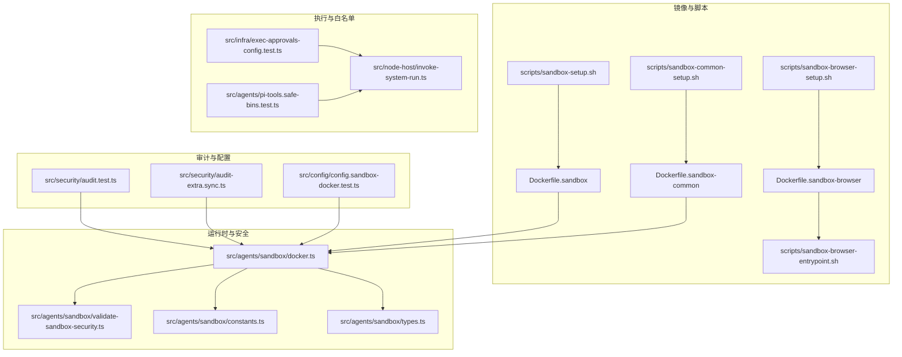
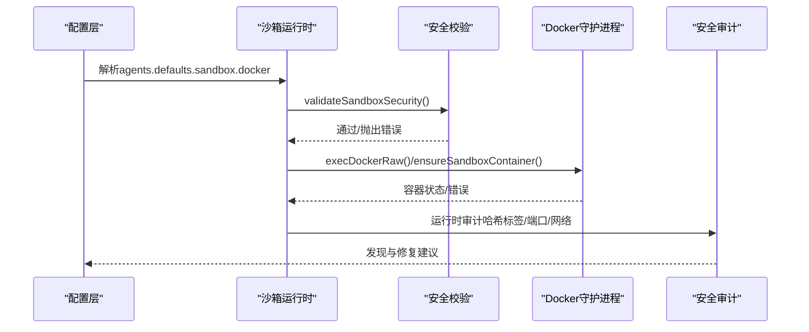
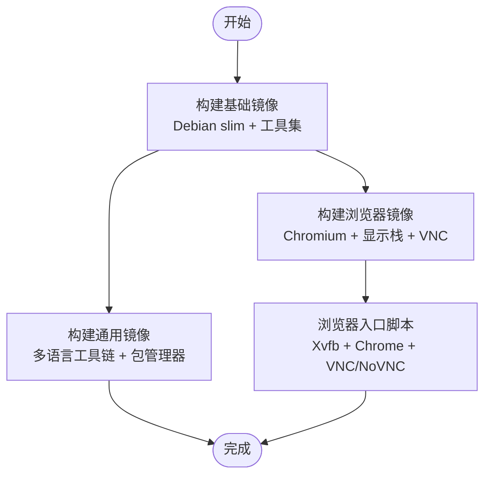
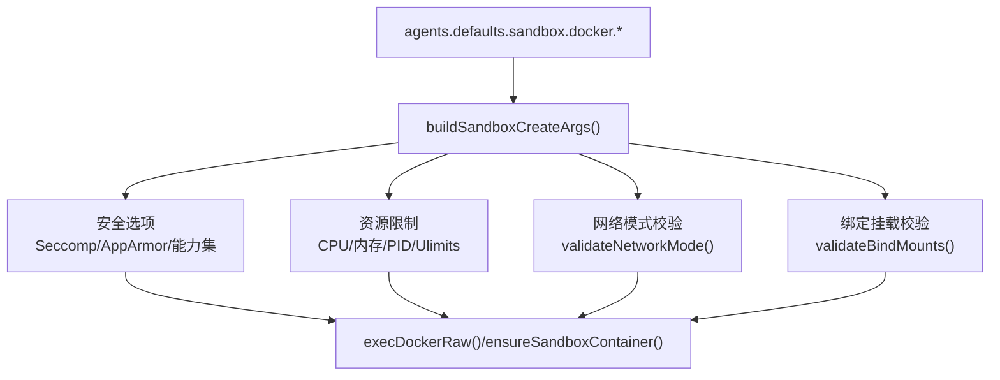
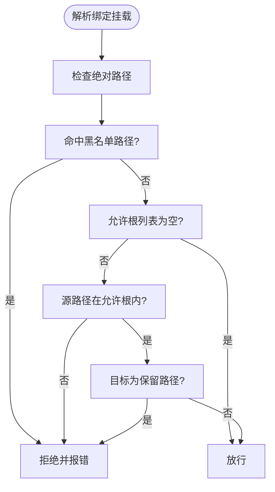
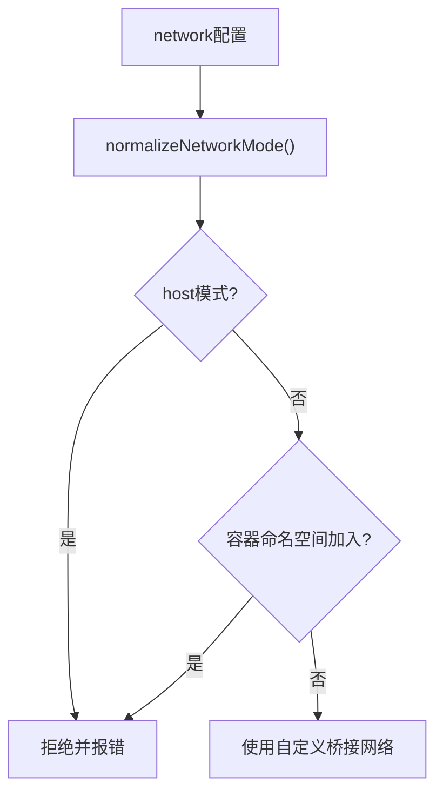
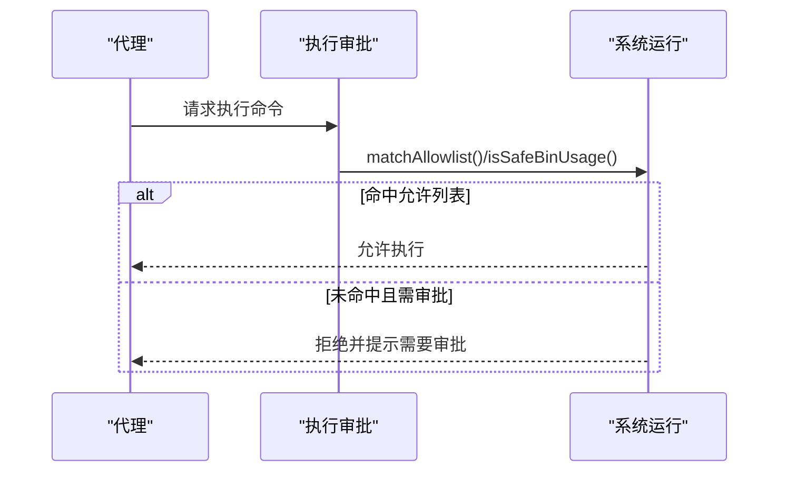
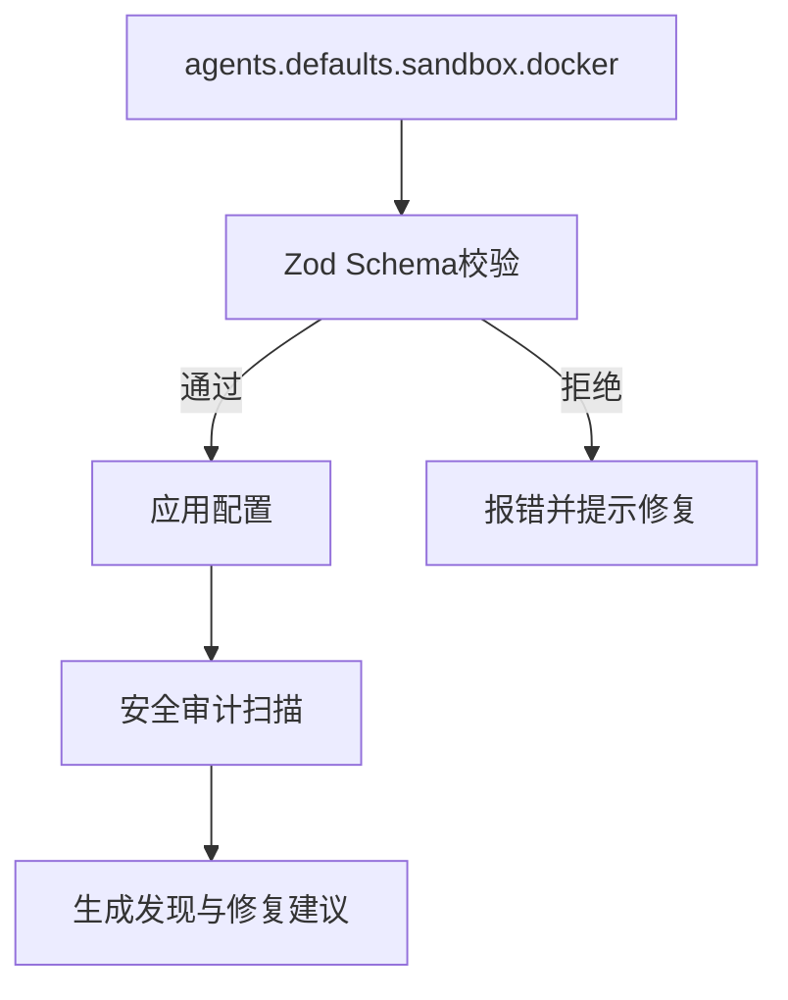
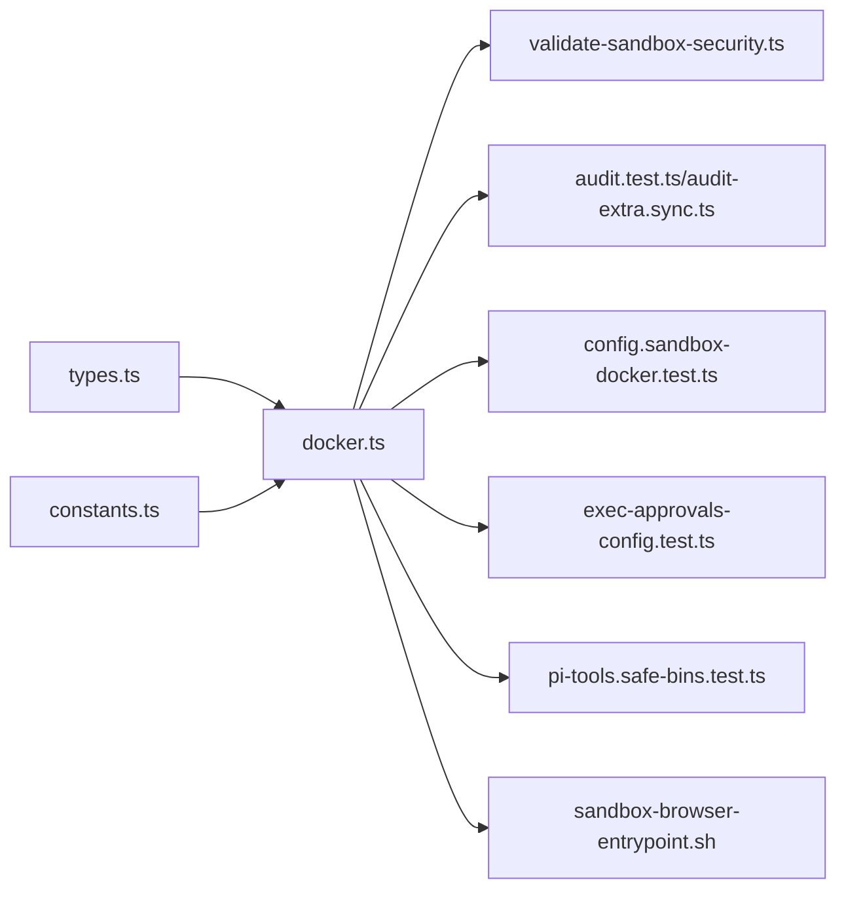

# 沙箱安全模型

<cite>
**本文引用的文件**
- [Dockerfile.sandbox](file://Dockerfile.sandbox)
- [Dockerfile.sandbox-browser](file://Dockerfile.sandbox-browser)
- [Dockerfile.sandbox-common](file://Dockerfile.sandbox-common)
- [scripts/sandbox-setup.sh](file://scripts/sandbox-setup.sh)
- [scripts/sandbox-common-setup.sh](file://scripts/sandbox-common-setup.sh)
- [scripts/sandbox-browser-setup.sh](file://scripts/sandbox-browser-setup.sh)
- [scripts/sandbox-browser-entrypoint.sh](file://scripts/sandbox-browser-entrypoint.sh)
- [src/agents/sandbox/docker.ts](file://src/agents/sandbox/docker.ts)
- [src/agents/sandbox/validate-sandbox-security.ts](file://src/agents/sandbox/validate-sandbox-security.ts)
- [src/agents/sandbox/constants.ts](file://src/agents/sandbox/constants.ts)
- [src/agents/sandbox/types.ts](file://src/agents/sandbox/types.ts)
- [src/agents/sandbox-create-args.test.ts](file://src/agents/sandbox-create-args.test.ts)
- [src/infra/exec-approvals-config.test.ts](file://src/infra/exec-approvals-config.test.ts)
- [src/node-host/invoke-system-run.ts](file://src/node-host/invoke-system-run.ts)
- [src/security/audit.test.ts](file://src/security/audit.test.ts)
- [src/security/audit-extra.sync.ts](file://src/security/audit-extra.sync.ts)
- [src/config/config.sandbox-docker.test.ts](file://src/config/config.sandbox-docker.test.ts)
- [src/agents/pi-tools.safe-bins.test.ts](file://src/agents/pi-tools.safe-bins.test.ts)
</cite>

## 目录
1. [简介](#简介)
2. [项目结构](#项目结构)
3. [核心组件](#核心组件)
4. [架构总览](#架构总览)
5. [详细组件分析](#详细组件分析)
6. [依赖关系分析](#依赖关系分析)
7. [性能考量](#性能考量)
8. [故障排查指南](#故障排查指南)
9. [结论](#结论)
10. [附录](#附录)

## 简介
本文件面向OpenClaw的沙箱安全模型，系统性阐述容器化沙箱、进程隔离与资源限制机制，覆盖文件系统访问控制、网络访问限制、系统调用白名单策略，以及Docker沙箱配置、权限提升防护、恶意代码检测、逃逸防护、内存保护、进程间通信安全、性能优化、监控告警与故障恢复策略。内容基于仓库中的实际实现与测试用例进行归纳总结，帮助读者在理解技术细节的同时，掌握部署与运维要点。

## 项目结构
围绕沙箱安全的关键文件与脚本分布如下：
- 基础镜像与浏览器镜像构建：Dockerfile.sandbox、Dockerfile.sandbox-browser、Dockerfile.sandbox-common
- 镜像构建脚本：scripts/sandbox-setup.sh、scripts/sandbox-common-setup.sh、scripts/sandbox-browser-setup.sh
- 浏览器沙箱入口脚本：scripts/sandbox-browser-entrypoint.sh
- 沙箱运行时与安全校验：src/agents/sandbox/docker.ts、src/agents/sandbox/validate-sandbox-security.ts
- 常量与类型定义：src/agents/sandbox/constants.ts、src/agents/sandbox/types.ts
- 安全审计与配置校验：src/security/audit.test.ts、src/security/audit-extra.sync.ts、src/config/config.sandbox-docker.test.ts
- 执行审批与系统调用白名单：src/infra/exec-approvals-config.test.ts、src/node-host/invoke-system-run.ts、src/agents/pi-tools.safe-bins.test.ts

**图表来源**
- [Dockerfile.sandbox](file://Dockerfile.sandbox#L1-L21)
- [Dockerfile.sandbox-browser](file://Dockerfile.sandbox-browser#L1-L33)
- [Dockerfile.sandbox-common](file://Dockerfile.sandbox-common#L1-L46)
- [scripts/sandbox-setup.sh](file://scripts/sandbox-setup.sh#L1-L8)
- [scripts/sandbox-common-setup.sh](file://scripts/sandbox-common-setup.sh#L1-L41)
- [scripts/sandbox-browser-setup.sh](file://scripts/sandbox-browser-setup.sh#L1-L8)
- [scripts/sandbox-browser-entrypoint.sh](file://scripts/sandbox-browser-entrypoint.sh#L1-L128)
- [src/agents/sandbox/docker.ts](file://src/agents/sandbox/docker.ts#L1-L565)
- [src/agents/sandbox/validate-sandbox-security.ts](file://src/agents/sandbox/validate-sandbox-security.ts#L1-L344)
- [src/agents/sandbox/constants.ts](file://src/agents/sandbox/constants.ts#L1-L55)
- [src/agents/sandbox/types.ts](file://src/agents/sandbox/types.ts#L1-L91)
- [src/security/audit.test.ts](file://src/security/audit.test.ts#L727-L849)
- [src/security/audit-extra.sync.ts](file://src/security/audit-extra.sync.ts#L884-L901)
- [src/config/config.sandbox-docker.test.ts](file://src/config/config.sandbox-docker.test.ts#L136-L180)
- [src/infra/exec-approvals-config.test.ts](file://src/infra/exec-approvals-config.test.ts#L1-L59)
- [src/node-host/invoke-system-run.ts](file://src/node-host/invoke-system-run.ts#L288-L463)
- [src/agents/pi-tools.safe-bins.test.ts](file://src/agents/pi-tools.safe-bins.test.ts#L248-L284)

**章节来源**
- [Dockerfile.sandbox](file://Dockerfile.sandbox#L1-L21)
- [Dockerfile.sandbox-browser](file://Dockerfile.sandbox-browser#L1-L33)
- [Dockerfile.sandbox-common](file://Dockerfile.sandbox-common#L1-L46)
- [scripts/sandbox-setup.sh](file://scripts/sandbox-setup.sh#L1-L8)
- [scripts/sandbox-common-setup.sh](file://scripts/sandbox-common-setup.sh#L1-L41)
- [scripts/sandbox-browser-setup.sh](file://scripts/sandbox-browser-setup.sh#L1-L8)
- [scripts/sandbox-browser-entrypoint.sh](file://scripts/sandbox-browser-entrypoint.sh#L1-L128)
- [src/agents/sandbox/docker.ts](file://src/agents/sandbox/docker.ts#L1-L565)
- [src/agents/sandbox/validate-sandbox-security.ts](file://src/agents/sandbox/validate-sandbox-security.ts#L1-L344)
- [src/agents/sandbox/constants.ts](file://src/agents/sandbox/constants.ts#L1-L55)
- [src/agents/sandbox/types.ts](file://src/agents/sandbox/types.ts#L1-L91)
- [src/security/audit.test.ts](file://src/security/audit.test.ts#L727-L849)
- [src/security/audit-extra.sync.ts](file://src/security/audit-extra.sync.ts#L884-L901)
- [src/config/config.sandbox-docker.test.ts](file://src/config/config.sandbox-docker.test.ts#L136-L180)
- [src/infra/exec-approvals-config.test.ts](file://src/infra/exec-approvals-config.test.ts#L1-L59)
- [src/node-host/invoke-system-run.ts](file://src/node-host/invoke-system-run.ts#L288-L463)
- [src/agents/pi-tools.safe-bins.test.ts](file://src/agents/pi-tools.safe-bins.test.ts#L248-L284)

## 核心组件
- 容器镜像与基础环境
  - 基础镜像：Debian slim，安装bash、ca-certificates、curl、git、jq、python3、ripgrep等工具，并以非特权用户运行。
  - 浏览器镜像：在基础镜像上增加Chromium、novnc、websockify、x11vnc、xvfb等，暴露调试端口并提供浏览器入口脚本。
  - 通用镜像：在基础镜像之上安装Node/npm、Python、Go、Rust、pnpm、bun、Linuxbrew等开发工具链，便于多语言任务执行。
- 沙箱运行时
  - Docker命令封装与容器生命周期管理（创建、启动、检查、重建）。
  - 安全校验：绑定挂载路径黑名单、保留目标路径、网络模式限制、Seccomp/AppArmor配置限制。
  - 资源限制：只读根文件系统、tmpfs、CPU配额、内存限制、PID数限制、ulimit设置。
- 执行审批与系统调用白名单
  - 允许列表与安全二进制模式（safeBins），拒绝重定向与递归扫描等高风险用法。
  - 系统运行调用的审批流程与路径硬化策略。
- 安全审计与配置校验
  - 对沙箱配置进行危险项检测（绑定挂载、网络模式、Seccomp/AppArmor、容器哈希标签缺失或过期、非回环发布端口等）。
  - 配置模式与设置不一致的提示（启用模式与配置不生效）。

**章节来源**
- [Dockerfile.sandbox](file://Dockerfile.sandbox#L1-L21)
- [Dockerfile.sandbox-browser](file://Dockerfile.sandbox-browser#L1-L33)
- [Dockerfile.sandbox-common](file://Dockerfile.sandbox-common#L1-L46)
- [src/agents/sandbox/docker.ts](file://src/agents/sandbox/docker.ts#L315-L565)
- [src/agents/sandbox/validate-sandbox-security.ts](file://src/agents/sandbox/validate-sandbox-security.ts#L16-L344)
- [src/agents/sandbox/constants.ts](file://src/agents/sandbox/constants.ts#L1-L55)
- [src/agents/sandbox/types.ts](file://src/agents/sandbox/types.ts#L1-L91)
- [src/infra/exec-approvals-config.test.ts](file://src/infra/exec-approvals-config.test.ts#L1-L59)
- [src/node-host/invoke-system-run.ts](file://src/node-host/invoke-system-run.ts#L288-L463)
- [src/agents/pi-tools.safe-bins.test.ts](file://src/agents/pi-tools.safe-bins.test.ts#L248-L284)
- [src/security/audit.test.ts](file://src/security/audit.test.ts#L727-L849)
- [src/security/audit-extra.sync.ts](file://src/security/audit-extra.sync.ts#L884-L901)
- [src/config/config.sandbox-docker.test.ts](file://src/config/config.sandbox-docker.test.ts#L136-L180)

## 架构总览
下图展示从配置到容器运行、再到安全校验与审计的整体流程：

**图表来源**
- [src/agents/sandbox/docker.ts](file://src/agents/sandbox/docker.ts#L315-L565)
- [src/agents/sandbox/validate-sandbox-security.ts](file://src/agents/sandbox/validate-sandbox-security.ts#L328-L343)
- [src/security/audit.test.ts](file://src/security/audit.test.ts#L756-L839)
- [src/security/audit-extra.sync.ts](file://src/security/audit-extra.sync.ts#L884-L901)

## 详细组件分析

### 组件A：容器化沙箱与镜像构建
- 基础镜像
  - 使用精简Debian镜像，仅安装必要工具，避免引入不必要的攻击面。
  - 以非特权用户运行，降低持久化权限风险。
- 浏览器镜像
  - 提供Chromium、虚拟显示、VNC/HTML5 VNC等能力，支持远程可视化与自动化。
  - 入口脚本负责参数去重、Xvfb显示、Chrome调试端口映射、VNC认证与WebSocket转发。
- 通用镜像
  - 预装Node、Python、Go、Rust、pnpm、bun、Linuxbrew等，满足多语言任务需求。
  - 支持通过构建参数选择是否安装特定工具链，兼顾体积与可用性。

**图表来源**
- [Dockerfile.sandbox](file://Dockerfile.sandbox#L1-L21)
- [Dockerfile.sandbox-browser](file://Dockerfile.sandbox-browser#L1-L33)
- [Dockerfile.sandbox-common](file://Dockerfile.sandbox-common#L1-L46)
- [scripts/sandbox-browser-entrypoint.sh](file://scripts/sandbox-browser-entrypoint.sh#L1-L128)

**章节来源**
- [Dockerfile.sandbox](file://Dockerfile.sandbox#L1-L21)
- [Dockerfile.sandbox-browser](file://Dockerfile.sandbox-browser#L1-L33)
- [Dockerfile.sandbox-common](file://Dockerfile.sandbox-common#L1-L46)
- [scripts/sandbox-browser-entrypoint.sh](file://scripts/sandbox-browser-entrypoint.sh#L1-L128)

### 组件B：进程隔离与资源限制
- 进程隔离
  - 使用Docker容器隔离进程命名空间、网络命名空间与文件系统命名空间。
  - 默认网络模式为桥接或none，禁止host模式与容器命名空间加入，防止逃逸与旁路隔离。
- 资源限制
  - 只读根文件系统、tmpfs挂载敏感目录。
  - CPU配额、内存上限、内存交换、PID数限制、ulimit软硬限制。
  - DNS与额外主机解析可控，避免内网探测与旁路路由。

**图表来源**
- [src/agents/sandbox/docker.ts](file://src/agents/sandbox/docker.ts#L315-L424)
- [src/agents/sandbox/validate-sandbox-security.ts](file://src/agents/sandbox/validate-sandbox-security.ts#L283-L343)
- [src/agents/sandbox/types.ts](file://src/agents/sandbox/types.ts#L55-L64)

**章节来源**
- [src/agents/sandbox/docker.ts](file://src/agents/sandbox/docker.ts#L315-L424)
- [src/agents/sandbox/validate-sandbox-security.ts](file://src/agents/sandbox/validate-sandbox-security.ts#L283-L343)
- [src/agents/sandbox/types.ts](file://src/agents/sandbox/types.ts#L55-L64)

### 组件C：文件系统访问控制
- 黑名单路径
  - 禁止挂载系统关键目录（如/etc、/proc、/sys、/dev、/root、/boot）及Docker套接字相关路径。
- 保留目标路径
  - 禁止覆盖沙箱工作区与代理工作区挂载点，避免遮蔽与逃逸。
- 允许根与外部来源
  - 通过允许根列表与“允许外部来源”开关控制，结合符号链接解析加固，防止通过软链接绕过。
- 审计发现
  - 若存在非回环地址发布的端口，标记为严重风险；若容器缺少哈希标签或标签过期，标记为警告。

**图表来源**
- [src/agents/sandbox/validate-sandbox-security.ts](file://src/agents/sandbox/validate-sandbox-security.ts#L96-L281)
- [src/security/audit.test.ts](file://src/security/audit.test.ts#L756-L839)

**章节来源**
- [src/agents/sandbox/validate-sandbox-security.ts](file://src/agents/sandbox/validate-sandbox-security.ts#L16-L344)
- [src/security/audit.test.ts](file://src/security/audit.test.ts#L756-L839)

### 组件D：网络访问限制
- 网络模式限制
  - 禁止host模式与容器命名空间加入（container:*），默认使用自定义桥接网络。
- 审计规则
  - 若检测到非回环地址发布的端口，标记为严重风险；对浏览器容器的哈希标签缺失或过期给出警告与修复建议。

**图表来源**
- [src/agents/sandbox/validate-sandbox-security.ts](file://src/agents/sandbox/validate-sandbox-security.ts#L283-L306)
- [src/security/audit-extra.sync.ts](file://src/security/audit-extra.sync.ts#L884-L901)
- [src/security/audit.test.ts](file://src/security/audit.test.ts#L793-L839)

**章节来源**
- [src/agents/sandbox/validate-sandbox-security.ts](file://src/agents/sandbox/validate-sandbox-security.ts#L283-L306)
- [src/security/audit-extra.sync.ts](file://src/security/audit-extra.sync.ts#L884-L901)
- [src/security/audit.test.ts](file://src/security/audit.test.ts#L793-L839)

### 组件E：系统调用白名单与执行审批
- 允许列表与安全二进制模式
  - 对于安全二进制模式，拒绝重定向与递归扫描等高风险用法；测试覆盖了重定向元字符与递归标志的阻断。
- 系统运行调用
  - 在allowlist模式且未获得审批时，拒绝执行；对已批准的执行路径进行硬化，确保工作目录未漂移。
  - 对“始终允许”的条目进行模式解析与记录，避免滥用。

**图表来源**
- [src/infra/exec-approvals-config.test.ts](file://src/infra/exec-approvals-config.test.ts#L17-L59)
- [src/node-host/invoke-system-run.ts](file://src/node-host/invoke-system-run.ts#L288-L463)
- [src/agents/pi-tools.safe-bins.test.ts](file://src/agents/pi-tools.safe-bins.test.ts#L248-L284)

**章节来源**
- [src/infra/exec-approvals-config.test.ts](file://src/infra/exec-approvals-config.test.ts#L1-L59)
- [src/node-host/invoke-system-run.ts](file://src/node-host/invoke-system-run.ts#L288-L463)
- [src/agents/pi-tools.safe-bins.test.ts](file://src/agents/pi-tools.safe-bins.test.ts#L248-L284)

### 组件F：Docker沙箱配置与权限提升防护
- 配置校验
  - 通过Zod Schema拒绝不安全配置（如Seccomp/AppArmor设为unconfined），避免禁用强制访问控制与系统调用过滤。
- 危险配置审计
  - 对默认与代理级别的docker配置进行扫描，发现危险项并给出修复建议。
- 权限提升防护
  - 禁止宿主socket挂载、保留目标路径覆盖、网络模式host与容器命名空间加入。
  - 通过只读根文件系统、能力集丢弃、no-new-privileges、Seccomp/AppArmor等强化容器隔离。

**图表来源**
- [src/config/config.sandbox-docker.test.ts](file://src/config/config.sandbox-docker.test.ts#L136-L180)
- [src/security/audit.test.ts](file://src/security/audit.test.ts#L1027-L1088)
- [src/agents/sandbox/docker.ts](file://src/agents/sandbox/docker.ts#L315-L424)

**章节来源**
- [src/config/config.sandbox-docker.test.ts](file://src/config/config.sandbox-docker.test.ts#L136-L180)
- [src/security/audit.test.ts](file://src/security/audit.test.ts#L1027-L1088)
- [src/agents/sandbox/docker.ts](file://src/agents/sandbox/docker.ts#L315-L424)

### 组件G：恶意代码检测与逃逸防护
- 恶意代码检测
  - 通过安全二进制模式阻断高危命令组合（重定向、递归扫描），减少信息泄露与文件系统滥用。
- 逃逸防护
  - 禁止挂载系统关键路径与Docker套接字，禁止host网络与容器命名空间加入，避免旁路隔离。
  - 通过容器哈希标签与过期检测，确保配置变更后及时重建容器，降低配置漂移风险。

**章节来源**
- [src/agents/pi-tools.safe-bins.test.ts](file://src/agents/pi-tools.safe-bins.test.ts#L248-L284)
- [src/agents/sandbox/validate-sandbox-security.ts](file://src/agents/sandbox/validate-sandbox-security.ts#L16-L344)
- [src/security/audit.test.ts](file://src/security/audit.test.ts#L756-L839)

### 组件H：内存保护与进程间通信安全
- 内存保护
  - 通过内存上限与内存交换限制，防止内存耗尽型攻击与资源滥用。
- 进程间通信安全
  - 默认网络隔离，仅在需要时通过受控端口暴露（如浏览器VNC/NoVNC），并采用本地绑定与可选源范围限制。
  - 入口脚本对VNC密码进行随机生成与权限控制，避免弱口令与明文存储。

**章节来源**
- [src/agents/sandbox/docker.ts](file://src/agents/sandbox/docker.ts#L388-L417)
- [scripts/sandbox-browser-entrypoint.sh](file://scripts/sandbox-browser-entrypoint.sh#L112-L125)

### 组件I：性能优化、监控告警与故障恢复
- 性能优化
  - 使用tmpfs缓存临时数据，减少磁盘IO；合理设置CPU配额与PID限制，避免资源争用。
- 监控告警
  - 审计模块对非回环发布端口、哈希标签缺失/过期、危险网络模式等进行告警。
- 故障恢复
  - 容器热窗口内配置变更提示重建；容器不存在或停止自动重建与启动；注册表记录容器状态与配置哈希，便于追踪与恢复。

**章节来源**
- [src/agents/sandbox/docker.ts](file://src/agents/sandbox/docker.ts#L474-L565)
- [src/security/audit.test.ts](file://src/security/audit.test.ts#L756-L839)
- [src/security/audit-extra.sync.ts](file://src/security/audit-extra.sync.ts#L884-L901)

## 依赖关系分析
- 组件耦合
  - 运行时与安全校验强耦合：创建容器前必须通过validateSandboxSecurity，保证配置安全。
  - 类型与常量为运行时与审计提供契约，确保行为一致。
- 外部依赖
  - Docker CLI与守护进程；浏览器入口脚本依赖Chromium与显示栈；审计依赖docker inspect/port等命令输出。

**图表来源**
- [src/agents/sandbox/types.ts](file://src/agents/sandbox/types.ts#L1-L91)
- [src/agents/sandbox/constants.ts](file://src/agents/sandbox/constants.ts#L1-L55)
- [src/agents/sandbox/docker.ts](file://src/agents/sandbox/docker.ts#L1-L565)
- [src/agents/sandbox/validate-sandbox-security.ts](file://src/agents/sandbox/validate-sandbox-security.ts#L1-L344)
- [src/security/audit.test.ts](file://src/security/audit.test.ts#L1027-L1088)
- [src/security/audit-extra.sync.ts](file://src/security/audit-extra.sync.ts#L884-L901)
- [src/config/config.sandbox-docker.test.ts](file://src/config/config.sandbox-docker.test.ts#L136-L180)
- [src/infra/exec-approvals-config.test.ts](file://src/infra/exec-approvals-config.test.ts#L1-L59)
- [src/agents/pi-tools.safe-bins.test.ts](file://src/agents/pi-tools.safe-bins.test.ts#L248-L284)
- [scripts/sandbox-browser-entrypoint.sh](file://scripts/sandbox-browser-entrypoint.sh#L1-L128)

**章节来源**
- [src/agents/sandbox/types.ts](file://src/agents/sandbox/types.ts#L1-L91)
- [src/agents/sandbox/constants.ts](file://src/agents/sandbox/constants.ts#L1-L55)
- [src/agents/sandbox/docker.ts](file://src/agents/sandbox/docker.ts#L1-L565)
- [src/agents/sandbox/validate-sandbox-security.ts](file://src/agents/sandbox/validate-sandbox-security.ts#L1-L344)
- [src/security/audit.test.ts](file://src/security/audit.test.ts#L1027-L1088)
- [src/security/audit-extra.sync.ts](file://src/security/audit-extra.sync.ts#L884-L901)
- [src/config/config.sandbox-docker.test.ts](file://src/config/config.sandbox-docker.test.ts#L136-L180)
- [src/infra/exec-approvals-config.test.ts](file://src/infra/exec-approvals-config.test.ts#L1-L59)
- [src/agents/pi-tools.safe-bins.test.ts](file://src/agents/pi-tools.safe-bins.test.ts#L248-L284)
- [scripts/sandbox-browser-entrypoint.sh](file://scripts/sandbox-browser-entrypoint.sh#L1-L128)

## 性能考量
- 合理设置CPU配额与内存上限，避免单容器占用过多资源导致其他任务饥饿。
- 使用tmpfs缓存临时数据，减少磁盘IO；对大文件操作建议使用只读挂载与受限工作目录。
- 控制并发与子进程数量，结合PID限制与ulimit，防止资源耗尽。
- 浏览器容器仅在需要时开启无头模式与VNC，避免不必要的图形栈开销。

## 故障排查指南
- Docker命令不可用
  - 运行时会提示需要安装Docker并确保docker命令可用，或关闭沙箱模式。
- 容器配置哈希不匹配
  - 若容器最近使用且配置变更，会提示重建；否则自动删除旧容器并重建。
- 非回环发布端口
  - 审计发现后应调整端口映射或网络配置，避免对外暴露。
- 危险网络模式
  - 将network改为bridge或none，或在极端情况下谨慎使用危险开关。
- 绑定挂载被拒绝
  - 检查源路径是否在允许根内，避免挂载系统关键路径或Docker套接字。

**章节来源**
- [src/agents/sandbox/docker.ts](file://src/agents/sandbox/docker.ts#L104-L124)
- [src/agents/sandbox/docker.ts](file://src/agents/sandbox/docker.ts#L525-L541)
- [src/security/audit.test.ts](file://src/security/audit.test.ts#L793-L839)
- [src/security/audit-extra.sync.ts](file://src/security/audit-extra.sync.ts#L884-L901)
- [src/agents/sandbox/validate-sandbox-security.ts](file://src/agents/sandbox/validate-sandbox-security.ts#L201-L227)

## 结论
OpenClaw的沙箱安全模型通过“最小权限+严格校验+持续审计”的方式，实现了容器化隔离、资源限制与执行审批的闭环。其核心在于：
- 严格的绑定挂载与网络模式限制，杜绝逃逸与旁路；
- 通过allowlist与安全二进制模式阻断高危命令；
- 容器哈希标签与审计联动，保障配置一致性与可追溯；
- 合理的资源限制与入口脚本安全配置，兼顾可用性与安全性。

## 附录
- 常用镜像与脚本
  - 基础镜像：openclaw-sandbox:bookworm-slim
  - 浏览器镜像：openclaw-sandbox-browser:bookworm-slim
  - 通用镜像：openclaw-sandbox-common:bookworm-slim
- 关键端口
  - 浏览器：CDP 9222、VNC 5900、NoVNC 6080（可通过环境变量覆盖）

**章节来源**
- [src/agents/sandbox/constants.ts](file://src/agents/sandbox/constants.ts#L39-L48)
- [scripts/sandbox-browser-entrypoint.sh](file://scripts/sandbox-browser-entrypoint.sh#L24-L32)