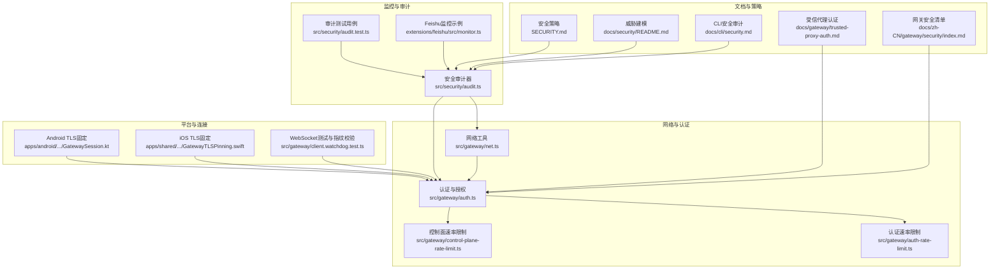
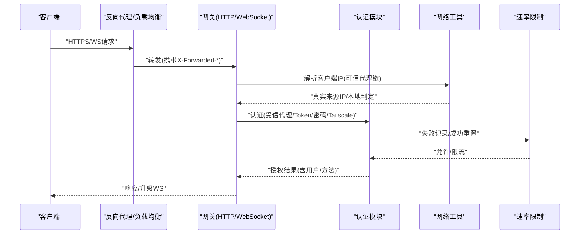
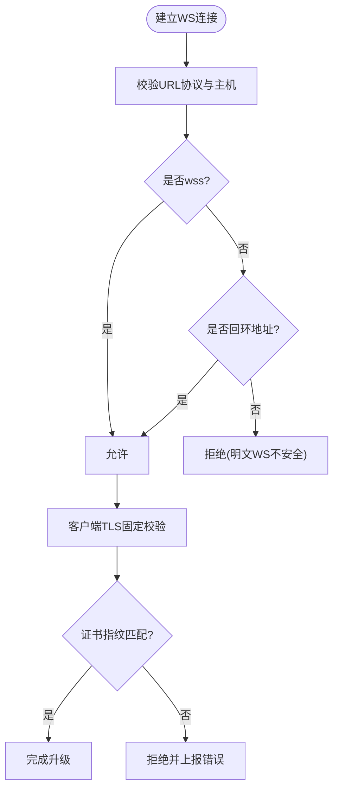
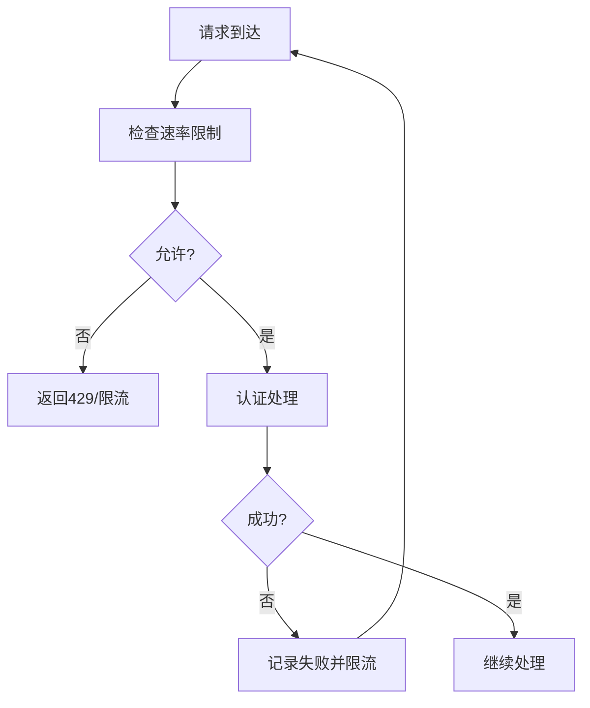
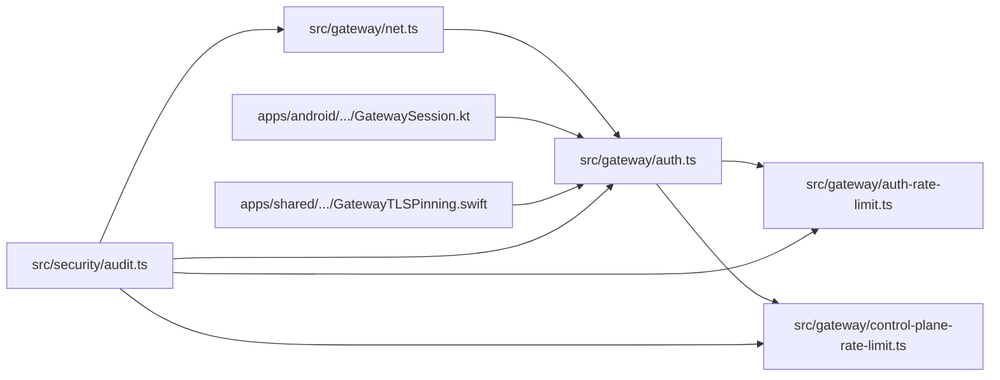

# 网络安全防护

<cite>
**本文引用的文件**
- [SECURITY.md](file://SECURITY.md)
- [docs/security/README.md](file://docs/security/README.md)
- [docs/cli/security.md](file://docs/cli/security.md)
- [docs/gateway/trusted-proxy-auth.md](file://docs/gateway/trusted-proxy-auth.md)
- [docs/zh-CN/gateway/security/index.md](file://docs/zh-CN/gateway/security/index.md)
- [src/gateway/net.ts](file://src/gateway/net.ts)
- [src/gateway/auth.ts](file://src/gateway/auth.ts)
- [src/security/audit.ts](file://src/security/audit.ts)
- [src/security/audit.test.ts](file://src/security/audit.test.ts)
- [src/gateway/auth-rate-limit.ts](file://src/gateway/auth-rate-limit.ts)
- [src/gateway/control-plane-rate-limit.ts](file://src/gateway/control-plane-rate-limit.ts)
- [extensions/voice-call/src/media-stream.ts](file://extensions/voice-call/src/media-stream.ts)
- [apps/android/app/src/main/java/ai/openclaw/android/gateway/GatewaySession.kt](file://apps/android/app/src/main/java/ai/openclaw/android/gateway/GatewaySession.kt)
- [apps/shared/OpenClawKit/Sources/OpenClawKit/GatewayTLSPinning.swift](file://apps/shared/OpenClawKit/Sources/OpenClawKit/GatewayTLSPinning.swift)
- [src/gateway/client.watchdog.test.ts](file://src/gateway/client.watchdog.test.ts)
- [src/agents/openai-ws-connection.test.ts](file://src/agents/openai-ws-connection.test.ts)
- [extensions/feishu/src/monitor.ts](file://extensions/feishu/src/monitor.ts)
</cite>

## 目录
1. [简介](#简介)
2. [项目结构](#项目结构)
3. [核心组件](#核心组件)
4. [架构总览](#架构总览)
5. [详细组件分析](#详细组件分析)
6. [依赖关系分析](#依赖关系分析)
7. [性能考量](#性能考量)
8. [故障排查指南](#故障排查指南)
9. [结论](#结论)
10. [附录](#附录)

## 简介
本技术指南面向OpenClaw的网络安全防护，围绕防火墙与端口管理、网络隔离策略、WebSocket连接安全、TLS加密与证书固定、代理与反向代理安全、负载均衡与DDoS防护、速率限制与连接池管理、以及网络安全监控与入侵检测等主题，提供系统化、可落地的实践建议。内容基于仓库中的安全策略文档、审计实现与相关网络模块，帮助读者在不同部署形态（本地回环、局域网、尾网、公网）下构建纵深防御体系。

## 项目结构
OpenClaw将安全能力分布在多个层次：
- 文档层：安全策略、威胁建模、CLI审计说明
- 网络层：IP解析、代理信任、客户端IP解析、WebSocket安全策略
- 认证层：共享密钥、密码、Tailscale、受信代理委托认证
- 防护层：速率限制、连接池与资源保护、平台侧TLS固定
- 监控层：通道事件监控、速率限制状态、安全审计报告

图表来源
- [SECURITY.md](file://SECURITY.md#L1-L284)
- [docs/security/README.md](file://docs/security/README.md#L1-L18)
- [docs/cli/security.md](file://docs/cli/security.md#L1-L72)
- [docs/gateway/trusted-proxy-auth.md](file://docs/gateway/trusted-proxy-auth.md#L1-L329)
- [docs/zh-CN/gateway/security/index.md](file://docs/zh-CN/gateway/security/index.md#L71-L92)
- [src/gateway/net.ts](file://src/gateway/net.ts#L1-L451)
- [src/gateway/auth.ts](file://src/gateway/auth.ts#L1-L491)
- [src/gateway/auth-rate-limit.ts](file://src/gateway/auth-rate-limit.ts)
- [src/gateway/control-plane-rate-limit.ts](file://src/gateway/control-plane-rate-limit.ts)
- [apps/android/app/src/main/java/ai/openclaw/android/gateway/GatewaySession.kt](file://apps/android/app/src/main/java/ai/openclaw/android/gateway/GatewaySession.kt#L290-L320)
- [apps/shared/OpenClawKit/Sources/OpenClawKit/GatewayTLSPinning.swift](file://apps/shared/OpenClawKit/Sources/OpenClawKit/GatewayTLSPinning.swift#L66-L87)
- [src/gateway/client.watchdog.test.ts](file://src/gateway/client.watchdog.test.ts#L137-L185)
- [src/security/audit.ts](file://src/security/audit.ts#L1-L800)
- [src/security/audit.test.ts](file://src/security/audit.test.ts#L1550-L1605)
- [extensions/feishu/src/monitor.ts](file://extensions/feishu/src/monitor.ts#L1-L96)

章节来源
- [SECURITY.md](file://SECURITY.md#L1-L284)
- [docs/security/README.md](file://docs/security/README.md#L1-L18)
- [docs/cli/security.md](file://docs/cli/security.md#L1-L72)
- [docs/gateway/trusted-proxy-auth.md](file://docs/gateway/trusted-proxy-auth.md#L1-L329)
- [docs/zh-CN/gateway/security/index.md](file://docs/zh-CN/gateway/security/index.md#L71-L92)

## 核心组件
- 网络与代理信任：负责解析客户端真实IP、判定代理可信度、支持受信代理链路回溯与本地直连判定。
- 认证与授权：支持token/password、Tailscale、受信代理委托认证，并在HTTP与WebSocket控制界面场景下区分认证路径。
- 速率限制：针对认证失败与控制面调用进行固定窗口限流，防止暴力破解与滥用。
- 平台TLS固定：在移动端与桌面端实现服务端证书固定与主机名校验，降低中间人风险。
- 审计与告警：通过CLI命令对配置与运行态进行安全扫描，输出严重级别与修复建议。
- 连接池与资源保护：在媒体流等场景中实施连接数与超时控制，避免资源耗尽。

章节来源
- [src/gateway/net.ts](file://src/gateway/net.ts#L111-L185)
- [src/gateway/auth.ts](file://src/gateway/auth.ts#L367-L491)
- [src/gateway/auth-rate-limit.ts](file://src/gateway/auth-rate-limit.ts)
- [src/gateway/control-plane-rate-limit.ts](file://src/gateway/control-plane-rate-limit.ts)
- [apps/android/app/src/main/java/ai/openclaw/android/gateway/GatewaySession.kt](file://apps/android/app/src/main/java/ai/openclaw/android/gateway/GatewaySession.kt#L290-L320)
- [apps/shared/OpenClawKit/Sources/OpenClawKit/GatewayTLSPinning.swift](file://apps/shared/OpenClawKit/Sources/OpenClawKit/GatewayTLSPinning.swift#L66-L87)
- [src/security/audit.ts](file://src/security/audit.ts#L339-L687)

## 架构总览
下图展示从客户端到网关的关键交互与安全控制点，包括代理信任、认证、TLS固定与速率限制。

图表来源
- [src/gateway/net.ts](file://src/gateway/net.ts#L111-L185)
- [src/gateway/auth.ts](file://src/gateway/auth.ts#L367-L491)
- [src/gateway/auth-rate-limit.ts](file://src/gateway/auth-rate-limit.ts)

## 详细组件分析

### 防火墙与端口管理
- 绑定模式与暴露策略
  - 默认绑定回环，确保本地安全；非回环绑定需配合强认证与防火墙。
  - 尾网模式优先使用尾网地址，回退至回环；自定义绑定支持回退策略。
- 代理信任与IP解析
  - 通过可信代理列表与X-Forwarded-For链路，从右向左找到首个不可信跳点，确定真实来源IP。
  - 支持严格回环代理条目校验，避免将非本地代理范围纳入信任。
- 端口与协议
  - HTTP/WS控制界面默认仅本地回环；非回环暴露需显式允许来源与严格头校验。
  - mDNS全量模式可能泄露元数据，应限制为最小化或关闭。

章节来源
- [src/gateway/net.ts](file://src/gateway/net.ts#L221-L271)
- [src/gateway/net.ts](file://src/gateway/net.ts#L111-L185)
- [src/gateway/net.ts](file://src/gateway/net.ts#L411-L450)
- [src/security/audit.ts](file://src/security/audit.ts#L526-L538)

### 网络隔离策略
- 本地直连判定：结合Host头、回环地址与是否经可信代理，判断是否为本地直连请求。
- 私有/回环地址判定：支持IPv4/IPv6，排除多播与未指定地址，避免误判。
- 尾网与本地域名：.ts.net域名视为本地友好来源，便于受控远程访问。

章节来源
- [src/gateway/net.ts](file://src/gateway/net.ts#L125-L146)
- [src/gateway/net.ts](file://src/gateway/net.ts#L340-L378)

### WebSocket连接安全
- URL安全策略：wss默认安全；ws仅在回环地址允许；可选私有网络覆盖。
- 控制界面WS：在特定场景允许无Token登录，但仍需设备身份与安全上下文。
- 客户端侧TLS固定：移动端与桌面端实现证书固定与主机名校验，防证书指纹不匹配。
- 媒体流连接保护：在扩展中对并发连接与超时进行控制，拒绝过多请求并清理挂起连接。

图表来源
- [src/gateway/net.ts](file://src/gateway/net.ts#L411-L450)
- [apps/android/app/src/main/java/ai/openclaw/android/gateway/GatewaySession.kt](file://apps/android/app/src/main/java/ai/openclaw/android/gateway/GatewaySession.kt#L290-L320)
- [apps/shared/OpenClawKit/Sources/OpenClawKit/GatewayTLSPinning.swift](file://apps/shared/OpenClawKit/Sources/OpenClawKit/GatewayTLSPinning.swift#L66-L87)
- [src/gateway/client.watchdog.test.ts](file://src/gateway/client.watchdog.test.ts#L137-L185)
- [extensions/voice-call/src/media-stream.ts](file://extensions/voice-call/src/media-stream.ts#L325-L337)

章节来源
- [src/gateway/net.ts](file://src/gateway/net.ts#L411-L450)
- [src/gateway/auth.ts](file://src/gateway/auth.ts#L483-L490)
- [apps/android/app/src/main/java/ai/openclaw/android/gateway/GatewaySession.kt](file://apps/android/app/src/main/java/ai/openclaw/android/gateway/GatewaySession.kt#L290-L320)
- [apps/shared/OpenClawKit/Sources/OpenClawKit/GatewayTLSPinning.swift](file://apps/shared/OpenClawKit/Sources/OpenClawKit/GatewayTLSPinning.swift#L66-L87)
- [src/gateway/client.watchdog.test.ts](file://src/gateway/client.watchdog.test.ts#L137-L185)
- [extensions/voice-call/src/media-stream.ts](file://extensions/voice-call/src/media-stream.ts#L302-L345)

### TLS加密与证书管理
- 证书固定与主机名校验：移动端与桌面端在URLSession回调中执行证书固定与主机名验证。
- 客户端指纹校验：测试用例验证证书指纹不匹配导致TLS错误，确保客户端侧安全。
- 代理终止TLS：推荐由代理统一终止TLS并设置HSTS，网关可保持本地HTTP。

章节来源
- [apps/shared/OpenClawKit/Sources/OpenClawKit/GatewayTLSPinning.swift](file://apps/shared/OpenClawKit/Sources/OpenClawKit/GatewayTLSPinning.swift#L66-L87)
- [apps/android/app/src/main/java/ai/openclaw/android/gateway/GatewaySession.kt](file://apps/android/app/src/main/java/ai/openclaw/android/gateway/GatewaySession.kt#L290-L320)
- [src/gateway/client.watchdog.test.ts](file://src/gateway/client.watchdog.test.ts#L137-L185)
- [docs/gateway/trusted-proxy-auth.md](file://docs/gateway/trusted-proxy-auth.md#L91-L125)

### 代理服务器与反向代理安全
- 受信代理模式：将认证委托给代理，要求代理终止TLS、正确传递用户标识头、严格限制可信代理IP。
- 代理IP与CIDR：支持精确IP与CIDR段，严格区分回环代理与非回环代理范围。
- 头部校验：可配置必需头部，缺失即拒绝；支持用户白名单。
- WebSocket升级：代理需透传升级头并在WS握手阶段传递身份信息。

章节来源
- [docs/gateway/trusted-proxy-auth.md](file://docs/gateway/trusted-proxy-auth.md#L14-L32)
- [src/gateway/auth.ts](file://src/gateway/auth.ts#L324-L361)
- [src/gateway/net.ts](file://src/gateway/net.ts#L141-L154)
- [src/security/audit.ts](file://src/security/audit.ts#L614-L671)

### 负载均衡与DDoS防护
- 固定窗口限流：对认证失败与共享密钥场景进行限流，防止暴力破解。
- 控制面限流：对关键控制平面接口进行独立限流，缓解滥用与探测。
- 连接保护：在媒体流等场景中限制并发与超时，避免资源耗尽。
- 审计发现：CLI审计可识别未配置速率限制的风险项并给出修复建议。

图表来源
- [src/gateway/auth-rate-limit.ts](file://src/gateway/auth-rate-limit.ts)
- [src/gateway/control-plane-rate-limit.ts](file://src/gateway/control-plane-rate-limit.ts)
- [src/gateway/auth.ts](file://src/gateway/auth.ts#L404-L420)
- [src/security/audit.ts](file://src/security/audit.ts#L673-L684)
- [extensions/voice-call/src/media-stream.ts](file://extensions/voice-call/src/media-stream.ts#L325-L337)

章节来源
- [src/gateway/auth-rate-limit.ts](file://src/gateway/auth-rate-limit.ts)
- [src/gateway/control-plane-rate-limit.ts](file://src/gateway/control-plane-rate-limit.ts)
- [src/gateway/auth.ts](file://src/gateway/auth.ts#L404-L420)
- [src/security/audit.ts](file://src/security/audit.ts#L673-L684)
- [extensions/voice-call/src/media-stream.ts](file://extensions/voice-call/src/media-stream.ts#L302-L345)

### 速率限制与连接池管理
- 认证速率限制：失败尝试触发限流，成功后重置；支持按IP与共享密钥作用域。
- 控制面速率限制：对关键接口进行独立限流，避免滥用。
- 连接池与超时：在媒体流场景中对每IP并发连接计数与超时进行控制，必要时拒绝新连接并清理挂起连接。
- 客户端重试：对WS连接失败进行指数退避与最大重试次数控制，避免风暴。

章节来源
- [src/gateway/auth-rate-limit.ts](file://src/gateway/auth-rate-limit.ts)
- [src/gateway/control-plane-rate-limit.ts](file://src/gateway/control-plane-rate-limit.ts)
- [extensions/voice-call/src/media-stream.ts](file://extensions/voice-call/src/media-stream.ts#L302-L345)
- [src/agents/openai-ws-connection.test.ts](file://src/agents/openai-ws-connection.test.ts#L490-L528)

### 网络安全监控与入侵检测
- 安全审计CLI：支持深度扫描、JSON输出、自动修复建议，覆盖配置权限、暴露面、代理信任、工具策略等。
- 通道监控示例：以Feishu为例，展示监控启动、账户枚举与并发控制，避免对上游服务造成冲击。
- 审计测试：通过测试用例验证不同绑定与代理配置下的严重级别差异，指导部署决策。

章节来源
- [docs/cli/security.md](file://docs/cli/security.md#L17-L72)
- [src/security/audit.ts](file://src/security/audit.ts#L1-L150)
- [extensions/feishu/src/monitor.ts](file://extensions/feishu/src/monitor.ts#L31-L96)
- [src/security/audit.test.ts](file://src/security/audit.test.ts#L1550-L1605)

## 依赖关系分析
- 网络工具依赖共享网络库进行IP解析与CIDR判定。
- 认证模块依赖网络工具解析客户端IP，并与速率限制模块协作。
- 平台TLS固定依赖各自系统的URLSession/NSURLSession回调。
- 审计模块聚合网络、认证、浏览器控制、日志等多个子系统发现项。

图表来源
- [src/gateway/net.ts](file://src/gateway/net.ts#L1-L451)
- [src/gateway/auth.ts](file://src/gateway/auth.ts#L1-L491)
- [src/gateway/auth-rate-limit.ts](file://src/gateway/auth-rate-limit.ts)
- [src/gateway/control-plane-rate-limit.ts](file://src/gateway/control-plane-rate-limit.ts)
- [apps/android/app/src/main/java/ai/openclaw/android/gateway/GatewaySession.kt](file://apps/android/app/src/main/java/ai/openclaw/android/gateway/GatewaySession.kt#L290-L320)
- [apps/shared/OpenClawKit/Sources/OpenClawKit/GatewayTLSPinning.swift](file://apps/shared/OpenClawKit/Sources/OpenClawKit/GatewayTLSPinning.swift#L66-L87)
- [src/security/audit.ts](file://src/security/audit.ts#L1-L800)

章节来源
- [src/gateway/net.ts](file://src/gateway/net.ts#L1-L451)
- [src/gateway/auth.ts](file://src/gateway/auth.ts#L1-L491)
- [src/security/audit.ts](file://src/security/audit.ts#L1-L800)

## 性能考量
- 限流窗口与重试策略：合理设置窗口大小与重试上限，避免雪崩效应。
- 并发控制：媒体流等场景限制每IP并发连接，减少资源争用。
- 代理链解析成本：CIDR匹配与链路回溯为O(n)，建议精简可信代理列表。
- 审计扫描：深度扫描涉及外部探测，建议在维护窗口执行并设置超时。

## 故障排查指南
- 受信代理错误
  - 代理来源不在可信列表：检查代理IP与容器IP变化，确认代理配置。
  - 用户标识头缺失：确认代理正确传递用户头并命名一致。
  - 必需头缺失：逐项核对代理透传的必需头。
  - 用户未在白名单：添加允许用户或移除白名单。
- WebSocket失败
  - 代理不支持升级或未透传身份头：确保代理支持WS升级并透传所需头。
  - 证书指纹不匹配：核对服务端证书与客户端固定策略。
- 速率限制触发
  - 认证频繁失败：检查客户端凭据与限流参数；确认成功后自动重置。
  - 控制面接口被限流：评估阈值与作用域，必要时提升窗口或放宽策略。
- 审计告警
  - 未配置速率限制：根据暴露面设置认证速率限制。
  - mDNS全量模式：改为最小化或关闭。
  - 允许来源包含通配符：替换为具体可信来源。

章节来源
- [docs/gateway/trusted-proxy-auth.md](file://docs/gateway/trusted-proxy-auth.md#L276-L322)
- [src/gateway/auth.ts](file://src/gateway/auth.ts#L324-L361)
- [src/gateway/auth.ts](file://src/gateway/auth.ts#L404-L420)
- [src/gateway/client.watchdog.test.ts](file://src/gateway/client.watchdog.test.ts#L137-L185)
- [src/security/audit.ts](file://src/security/audit.ts#L507-L538)
- [src/security/audit.ts](file://src/security/audit.ts#L673-L684)

## 结论
OpenClaw通过“最小暴露+强认证+代理信任+限流+TLS固定+审计”的组合，形成可演进的安全基线。建议在生产环境坚持：
- 默认回环绑定，非必要不暴露公网
- 强认证与速率限制双保险
- 受信代理统一终止TLS并严格透传身份
- 客户端侧证书固定与主机名校验
- 持续运行安全审计，及时修复高危项

## 附录
- 安全策略与威胁建模：参见安全策略与威胁建模文档，了解整体信任边界与风险处置。
- CLI安全审计：使用openclaw security audit进行快速扫描与修复建议。

章节来源
- [SECURITY.md](file://SECURITY.md#L1-L284)
- [docs/security/README.md](file://docs/security/README.md#L1-L18)
- [docs/cli/security.md](file://docs/cli/security.md#L17-L72)