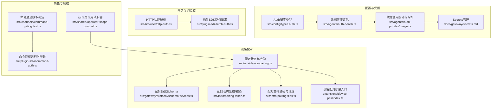
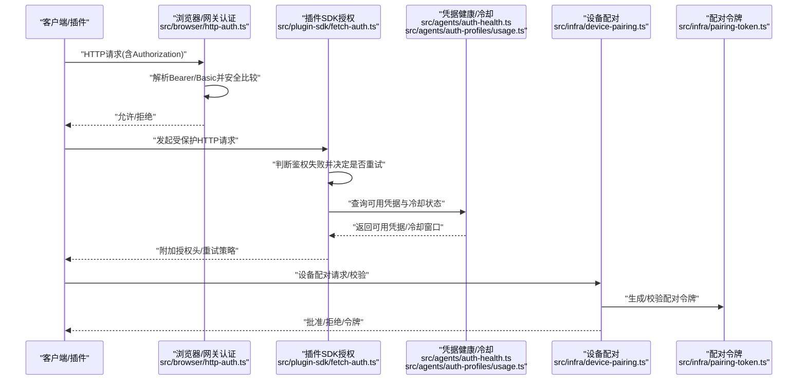
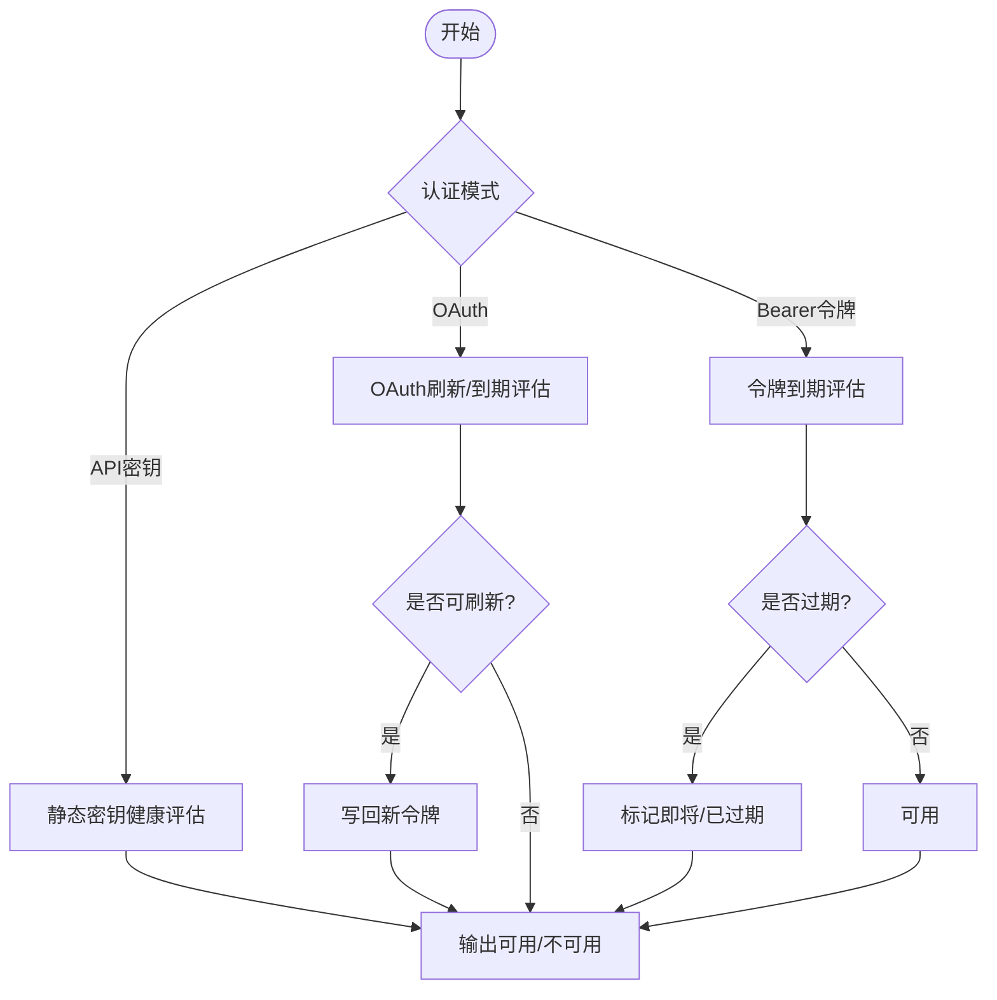
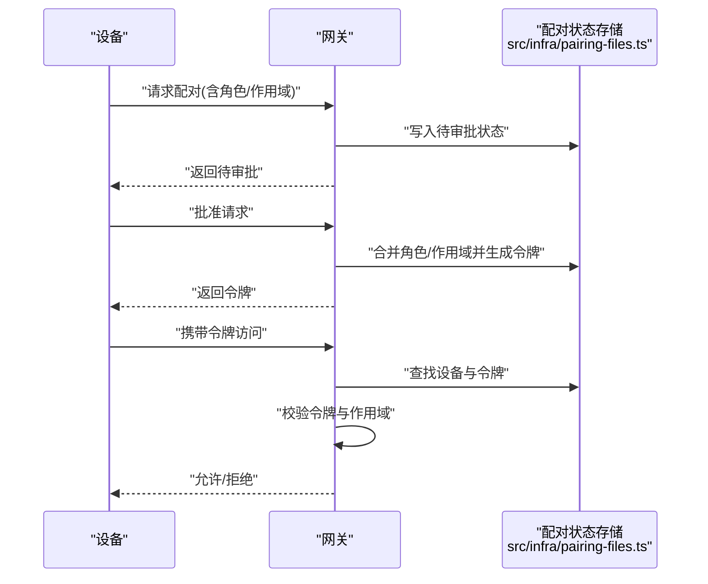
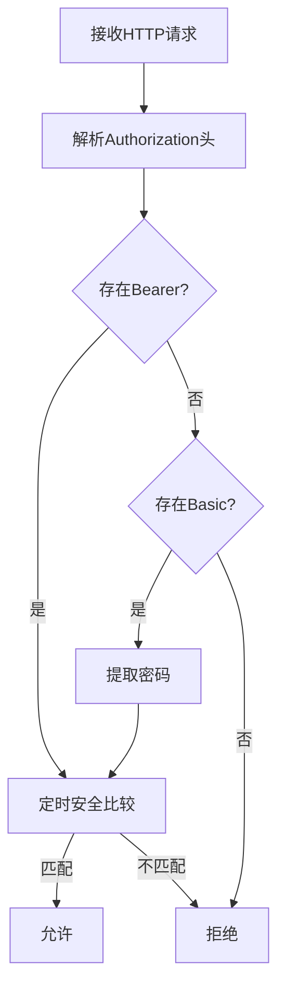
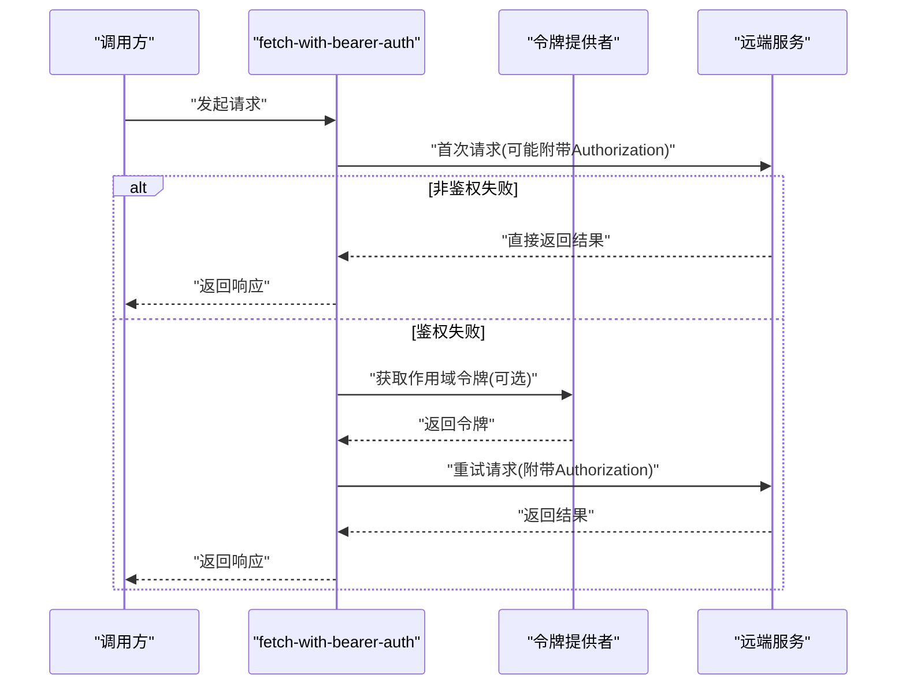
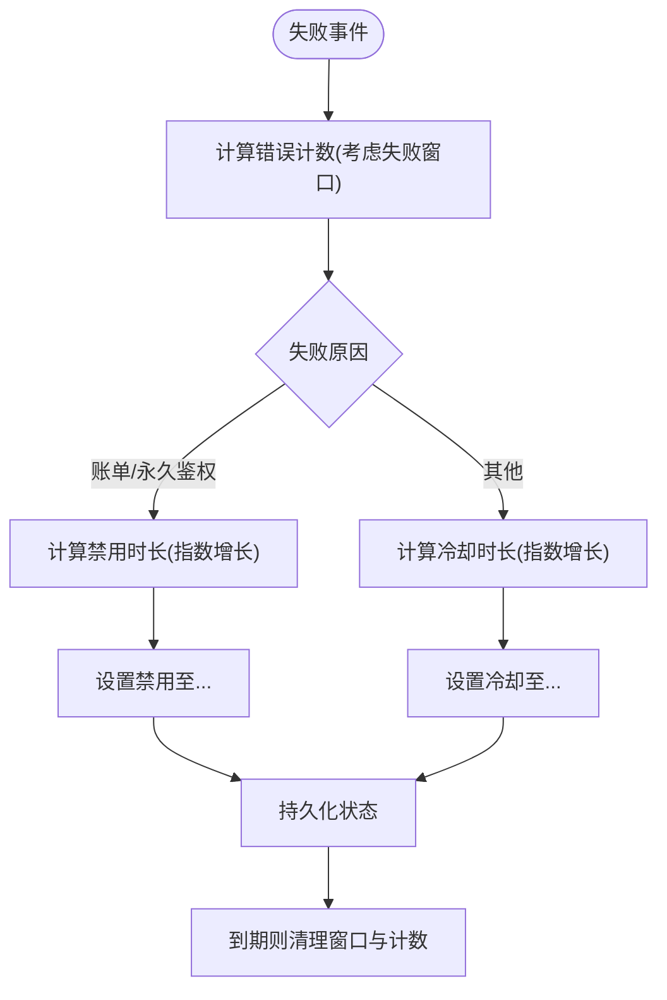
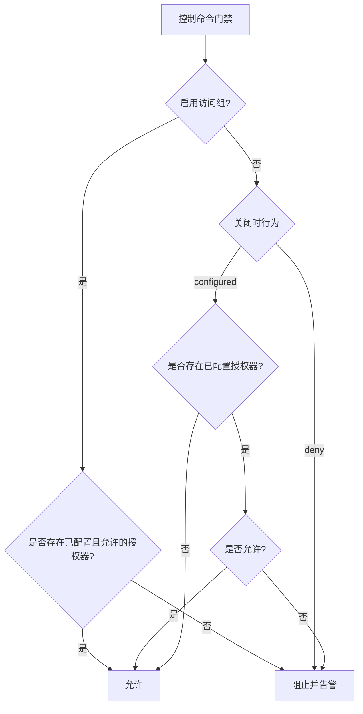
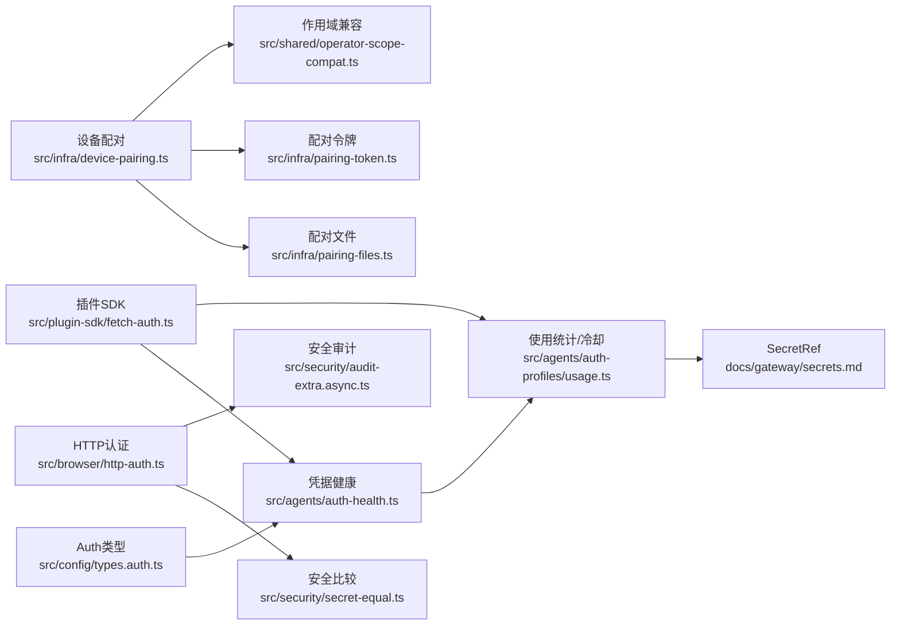

# 身份认证与授权

<cite>
**本文引用的文件**
- [src/config/types.auth.ts](file://src/config/types.auth.ts)
- [docs/gateway/authentication.md](file://docs/gateway/authentication.md)
- [docs/concepts/oauth.md](file://docs/concepts/oauth.md)
- [docs/gateway/secrets.md](file://docs/gateway/secrets.md)
- [src/infra/device-pairing.ts](file://src/infra/device-pairing.ts)
- [src/gateway/protocol/schema/devices.ts](file://src/gateway/protocol/schema/devices.ts)
- [src/infra/pairing-token.ts](file://src/infra/pairing-token.ts)
- [src/infra/pairing-files.ts](file://src/infra/pairing-files.ts)
- [src/shared/operator-scope-compat.ts](file://src/shared/operator-scope-compat.ts)
- [src/browser/http-auth.ts](file://src/browser/http-auth.ts)
- [src/plugin-sdk/fetch-auth.ts](file://src/plugin-sdk/fetch-auth.ts)
- [src/agents/auth-health.ts](file://src/agents/auth-health.ts)
- [src/agents/auth-profiles/usage.ts](file://src/agents/auth-profiles/usage.ts)
- [src/security/secret-equal.ts](file://src/security/secret-equal.ts)
- [src/security/audit-extra.async.ts](file://src/security/audit-extra.async.ts)
- [src/infra/backoff.ts](file://src/infra/backoff.ts)
- [src/infra/retry.test.ts](file://src/infra/retry.test.ts)
- [src/channels/command-gating.test.ts](file://src/channels/command-gating.test.ts)
- [src/plugin-sdk/command-auth.ts](file://src/plugin-sdk/command-auth.ts)
- [extensions/device-pair/index.ts](file://extensions/device-pair/index.ts)
</cite>

## 目录
1. [简介](#简介)
2. [项目结构](#项目结构)
3. [核心组件](#核心组件)
4. [架构总览](#架构总览)
5. [详细组件分析](#详细组件分析)
6. [依赖关系分析](#依赖关系分析)
7. [性能考量](#性能考量)
8. [故障排查指南](#故障排查指南)
9. [结论](#结论)
10. [附录](#附录)

## 简介
本文件面向OpenClaw的身份认证与授权系统，聚焦多层身份验证机制与授权策略，覆盖API密钥管理、OAuth流程、设备配对验证、角色权限控制、访问令牌管理、凭据存储与轮换、失败处理与重试策略、以及安全审计与最佳实践。文档以代码级实现为依据，辅以可视化图示，帮助开发者与运维人员理解并正确配置与维护系统的安全边界。

## 项目结构
OpenClaw在多个层面实现认证与授权：
- 配置与凭据：通过配置类型定义认证模式（API密钥、OAuth、静态令牌），并结合SecretRef进行安全存储与加载。
- 网关与浏览器：提供受控的HTTP认证入口，支持基于Bearer Token与Basic密码的校验。
- 设备配对：通过请求-批准-令牌发放-校验的流程，实现设备侧的可信接入与作用域授权。
- 角色与作用域：基于操作员角色与作用域集合，进行细粒度授权判定。
- 代理与插件：在HTTP调用中自动附加授权头，并在鉴权失败时进行回退与重试。
- 健康与冷却：对认证配置进行健康评估与冷却/禁用窗口管理，避免雪崩式重试。
- 审计与合规：对文件权限、日志脱敏等进行安全审计，确保最小暴露面。

图表来源
- [src/config/types.auth.ts](file://src/config/types.auth.ts#L1-L30)
- [src/agents/auth-health.ts](file://src/agents/auth-health.ts#L1-L284)
- [src/agents/auth-profiles/usage.ts](file://src/agents/auth-profiles/usage.ts#L1-L561)
- [docs/gateway/secrets.md](file://docs/gateway/secrets.md#L1-L446)
- [src/browser/http-auth.ts](file://src/browser/http-auth.ts#L1-L48)
- [src/plugin-sdk/fetch-auth.ts](file://src/plugin-sdk/fetch-auth.ts#L1-L51)
- [src/infra/device-pairing.ts](file://src/infra/device-pairing.ts#L1-L654)
- [src/gateway/protocol/schema/devices.ts](file://src/gateway/protocol/schema/devices.ts#L1-L68)
- [src/infra/pairing-token.ts](file://src/infra/pairing-token.ts#L1-L13)
- [src/infra/pairing-files.ts](file://src/infra/pairing-files.ts#L1-L51)
- [extensions/device-pair/index.ts](file://extensions/device-pair/index.ts#L396-L431)
- [src/shared/operator-scope-compat.ts](file://src/shared/operator-scope-compat.ts#L1-L50)
- [src/channels/command-gating.test.ts](file://src/channels/command-gating.test.ts#L1-L97)
- [src/plugin-sdk/command-auth.ts](file://src/plugin-sdk/command-auth.ts#L1-L34)

章节来源
- [src/config/types.auth.ts](file://src/config/types.auth.ts#L1-L30)
- [docs/gateway/authentication.md](file://docs/gateway/authentication.md#L1-L169)
- [docs/concepts/oauth.md](file://docs/concepts/oauth.md#L1-L159)
- [docs/gateway/secrets.md](file://docs/gateway/secrets.md#L1-L446)

## 核心组件
- 认证配置与模式
  - 支持三种模式：API密钥、OAuth（可刷新）、静态Bearer令牌；可通过配置文件指定提供商与模式。
- 凭据健康与冷却
  - 对OAuth与令牌进行到期时间评估，结合失败原因与冷却窗口，动态调整可用性。
- SecretRef凭据管理
  - 通过环境变量、文件、执行器三种来源解析密钥，启动时严格校验，热更新采用原子替换。
- 网关与浏览器认证
  - 解析Authorization头，支持Bearer与Basic，使用定时安全比较函数防止时序攻击。
- 设备配对与令牌
  - 请求-批准-令牌发放-校验全流程，支持按角色与作用域授权，令牌可轮换与撤销。
- 角色与作用域授权
  - 操作员角色具备特殊作用域规则，管理员可隐含读写与配对权限。
- 插件SDK与代理重试
  - 在鉴权失败时自动尝试带作用域的令牌获取，并按策略重试。
- 审计与合规
  - 文件权限检查、日志脱敏开关、远程代理缺失告警等。

章节来源
- [src/config/types.auth.ts](file://src/config/types.auth.ts#L1-L30)
- [src/agents/auth-health.ts](file://src/agents/auth-health.ts#L1-L284)
- [src/agents/auth-profiles/usage.ts](file://src/agents/auth-profiles/usage.ts#L1-L561)
- [docs/gateway/secrets.md](file://docs/gateway/secrets.md#L1-L446)
- [src/browser/http-auth.ts](file://src/browser/http-auth.ts#L1-L48)
- [src/infra/device-pairing.ts](file://src/infra/device-pairing.ts#L1-L654)
- [src/shared/operator-scope-compat.ts](file://src/shared/operator-scope-compat.ts#L1-L50)
- [src/plugin-sdk/fetch-auth.ts](file://src/plugin-sdk/fetch-auth.ts#L1-L51)
- [src/security/audit-extra.async.ts](file://src/security/audit-extra.async.ts#L1028-L1127)

## 架构总览
下图展示从“请求进入”到“授权决策”的端到端流程，包括设备配对、OAuth刷新、凭据冷却与重试策略。

图表来源
- [src/browser/http-auth.ts](file://src/browser/http-auth.ts#L1-L48)
- [src/plugin-sdk/fetch-auth.ts](file://src/plugin-sdk/fetch-auth.ts#L1-L51)
- [src/agents/auth-health.ts](file://src/agents/auth-health.ts#L1-L284)
- [src/agents/auth-profiles/usage.ts](file://src/agents/auth-profiles/usage.ts#L1-L561)
- [src/infra/device-pairing.ts](file://src/infra/device-pairing.ts#L1-L654)
- [src/infra/pairing-token.ts](file://src/infra/pairing-token.ts#L1-L13)

## 详细组件分析

### 组件A：API密钥与OAuth管理
- 模式定义
  - 支持API密钥、OAuth（access/refresh/expires）、静态Bearer令牌三种模式。
- 存储与加载
  - OAuth与API密钥存储于每个Agent的auth-profiles.json，支持SecretRef（env/file/exec）。
- 刷新与到期
  - OAuth在过期时自动刷新并写回；静态令牌按到期时间评估健康状态。
- 键轮换与重试
  - 网关侧支持多键轮换与速率限制重试策略，仅对特定错误码进行键切换。

图表来源
- [src/config/types.auth.ts](file://src/config/types.auth.ts#L1-L30)
- [docs/concepts/oauth.md](file://docs/concepts/oauth.md#L1-L159)
- [docs/gateway/authentication.md](file://docs/gateway/authentication.md#L123-L139)
- [src/agents/auth-health.ts](file://src/agents/auth-health.ts#L80-L185)
- [src/agents/auth-profiles/usage.ts](file://src/agents/auth-profiles/usage.ts#L270-L326)

章节来源
- [src/config/types.auth.ts](file://src/config/types.auth.ts#L1-L30)
- [docs/concepts/oauth.md](file://docs/concepts/oauth.md#L1-L159)
- [docs/gateway/authentication.md](file://docs/gateway/authentication.md#L1-L169)
- [src/agents/auth-health.ts](file://src/agents/auth-health.ts#L1-L284)
- [src/agents/auth-profiles/usage.ts](file://src/agents/auth-profiles/usage.ts#L1-L561)

### 组件B：设备配对与令牌验证
- 流程
  - 客户端发起配对请求，网关记录待审批；管理员批准后生成角色与作用域受限的令牌；后续请求携带令牌由网关校验。
- 令牌安全
  - 使用定时安全比较函数，避免时序攻击；令牌可轮换、撤销、按角色分发。
- 作用域与角色
  - 操作员角色具备隐含作用域；请求的作用域必须被授予范围完全包含。

图表来源
- [src/infra/device-pairing.ts](file://src/infra/device-pairing.ts#L272-L384)
- [src/infra/device-pairing.ts](file://src/infra/device-pairing.ts#L470-L508)
- [src/infra/pairing-token.ts](file://src/infra/pairing-token.ts#L1-L13)
- [src/gateway/protocol/schema/devices.ts](file://src/gateway/protocol/schema/devices.ts#L38-L67)
- [src/shared/operator-scope-compat.ts](file://src/shared/operator-scope-compat.ts#L31-L49)
- [src/infra/pairing-files.ts](file://src/infra/pairing-files.ts#L1-L51)
- [extensions/device-pair/index.ts](file://extensions/device-pair/index.ts#L396-L431)

章节来源
- [src/infra/device-pairing.ts](file://src/infra/device-pairing.ts#L1-L654)
- [src/gateway/protocol/schema/devices.ts](file://src/gateway/protocol/schema/devices.ts#L1-L68)
- [src/shared/operator-scope-compat.ts](file://src/shared/operator-scope-compat.ts#L1-L50)
- [src/infra/pairing-token.ts](file://src/infra/pairing-token.ts#L1-L13)
- [src/infra/pairing-files.ts](file://src/infra/pairing-files.ts#L1-L51)
- [extensions/device-pair/index.ts](file://extensions/device-pair/index.ts#L396-L431)

### 组件C：浏览器与网关HTTP认证
- Bearer与Basic解析
  - 提取Authorization头，分别解析Bearer与Basic中的密码部分。
- 安全比较
  - 使用定时安全比较函数，避免时序攻击。
- 网关控制界面
  - 受控UI绑定环回地址时需配置可信代理或启用认证，否则触发安全告警。

图表来源
- [src/browser/http-auth.ts](file://src/browser/http-auth.ts#L1-L48)
- [src/security/secret-equal.ts](file://src/security/secret-equal.ts#L1-L13)
- [src/security/audit-extra.async.ts](file://src/security/audit-extra.async.ts#L1028-L1127)

章节来源
- [src/browser/http-auth.ts](file://src/browser/http-auth.ts#L1-L48)
- [src/security/secret-equal.ts](file://src/security/secret-equal.ts#L1-L13)
- [src/security/audit-extra.async.ts](file://src/security/audit-extra.async.ts#L1028-L1127)

### 组件D：插件SDK授权与重试
- 自动附加授权头
  - 在需要HTTPS与目标URL满足条件时，自动附加Authorization头。
- 鉴权失败重试
  - 默认对401/403进行重试；可自定义shouldRetry回调；支持按作用域获取令牌。
- 代理与网络错误
  - 对非鉴权类错误不进行自动重试，避免无意义的重试风暴。

图表来源
- [src/plugin-sdk/fetch-auth.ts](file://src/plugin-sdk/fetch-auth.ts#L1-L51)

章节来源
- [src/plugin-sdk/fetch-auth.ts](file://src/plugin-sdk/fetch-auth.ts#L1-L51)

### 组件E：凭据健康与冷却策略
- 健康评估
  - 对OAuth与令牌进行到期评估；API密钥标记为静态可用。
- 冷却与禁用
  - 失败计数与时间窗决定冷却时长；账单/永久鉴权失败会禁用更长时间。
- 窗口清理
  - 过期冷却窗口会被清理，避免“卡死”状态。

图表来源
- [src/agents/auth-profiles/usage.ts](file://src/agents/auth-profiles/usage.ts#L390-L441)
- [src/agents/auth-profiles/usage.ts](file://src/agents/auth-profiles/usage.ts#L270-L326)
- [src/agents/auth-profiles/usage.ts](file://src/agents/auth-profiles/usage.ts#L181-L232)

章节来源
- [src/agents/auth-health.ts](file://src/agents/auth-health.ts#L1-L284)
- [src/agents/auth-profiles/usage.ts](file://src/agents/auth-profiles/usage.ts#L1-L561)

### 组件F：命令通道授权与访问组
- 访问组策略
  - 当启用访问组时，若未配置授权器则默认拒绝；可配置“关闭时行为”为deny或configured。
- DM策略与白名单
  - 结合DM策略与允许列表，判定发送者是否被允许执行命令。

图表来源
- [src/channels/command-gating.test.ts](file://src/channels/command-gating.test.ts#L1-L97)
- [src/plugin-sdk/command-auth.ts](file://src/plugin-sdk/command-auth.ts#L1-L34)

章节来源
- [src/channels/command-gating.test.ts](file://src/channels/command-gating.test.ts#L1-L97)
- [src/plugin-sdk/command-auth.ts](file://src/plugin-sdk/command-auth.ts#L1-L34)

## 依赖关系分析
- 配置与凭据
  - 类型定义驱动凭据健康评估与冷却策略；SecretRef提供安全加载能力。
- 设备配对
  - 依赖配对文件路径解析、令牌生成/校验与作用域兼容模块。
- 网关与浏览器
  - 依赖安全比较函数与审计检查，确保最小暴露面。
- 插件SDK
  - 依赖凭据健康与冷却策略，以决定重试与回退。

图表来源
- [src/config/types.auth.ts](file://src/config/types.auth.ts#L1-L30)
- [src/agents/auth-health.ts](file://src/agents/auth-health.ts#L1-L284)
- [src/agents/auth-profiles/usage.ts](file://src/agents/auth-profiles/usage.ts#L1-L561)
- [docs/gateway/secrets.md](file://docs/gateway/secrets.md#L1-L446)
- [src/infra/device-pairing.ts](file://src/infra/device-pairing.ts#L1-L654)
- [src/infra/pairing-files.ts](file://src/infra/pairing-files.ts#L1-L51)
- [src/infra/pairing-token.ts](file://src/infra/pairing-token.ts#L1-L13)
- [src/shared/operator-scope-compat.ts](file://src/shared/operator-scope-compat.ts#L1-L50)
- [src/browser/http-auth.ts](file://src/browser/http-auth.ts#L1-L48)
- [src/security/secret-equal.ts](file://src/security/secret-equal.ts#L1-L13)
- [src/security/audit-extra.async.ts](file://src/security/audit-extra.async.ts#L1028-L1127)
- [src/plugin-sdk/fetch-auth.ts](file://src/plugin-sdk/fetch-auth.ts#L1-L51)

章节来源
- [src/config/types.auth.ts](file://src/config/types.auth.ts#L1-L30)
- [src/agents/auth-health.ts](file://src/agents/auth-health.ts#L1-L284)
- [src/agents/auth-profiles/usage.ts](file://src/agents/auth-profiles/usage.ts#L1-L561)
- [docs/gateway/secrets.md](file://docs/gateway/secrets.md#L1-L446)
- [src/infra/device-pairing.ts](file://src/infra/device-pairing.ts#L1-L654)
- [src/browser/http-auth.ts](file://src/browser/http-auth.ts#L1-L48)
- [src/plugin-sdk/fetch-auth.ts](file://src/plugin-sdk/fetch-auth.ts#L1-L51)

## 性能考量
- 并发与锁
  - 设备配对状态读写使用异步锁，避免竞态；JSON原子写入减少损坏风险。
- 重试与抖动
  - 指数退避+抖动降低集中重试概率；最大延迟与抖动系数可调。
- 冷却与禁用
  - 失败计数与时间窗控制重试频率，避免雪崩效应；账单/永久失败采用更长禁用窗口。

章节来源
- [src/infra/device-pairing.ts](file://src/infra/device-pairing.ts#L81-L103)
- [src/infra/backoff.ts](file://src/infra/backoff.ts#L1-L28)
- [src/agents/auth-profiles/usage.ts](file://src/agents/auth-profiles/usage.ts#L270-L326)

## 故障排查指南
- “无可用凭据”
  - 检查auth-profiles.json权限与内容；确认SecretRef解析成功；查看凭据健康与冷却状态。
- OAuth过期或刷新失败
  - 查看到期时间与刷新逻辑；确认文件锁下写回成功；必要时手动刷新。
- 设备配对被拒绝
  - 确认设备是否已批准；核对角色与作用域；检查令牌是否撤销或不匹配。
- 浏览器控制UI暴露风险
  - 环回地址绑定受控UI时需配置可信代理或启用认证；检查日志脱敏设置。
- 插件请求鉴权失败
  - 检查shouldAttachAuth与HTTPS要求；确认令牌提供者返回有效令牌；查看重试策略。

章节来源
- [docs/gateway/authentication.md](file://docs/gateway/authentication.md#L160-L169)
- [src/agents/auth-health.ts](file://src/agents/auth-health.ts#L1-L284)
- [src/agents/auth-profiles/usage.ts](file://src/agents/auth-profiles/usage.ts#L1-L561)
- [src/infra/device-pairing.ts](file://src/infra/device-pairing.ts#L470-L508)
- [src/security/audit-extra.async.ts](file://src/security/audit-extra.async.ts#L1028-L1127)
- [src/plugin-sdk/fetch-auth.ts](file://src/plugin-sdk/fetch-auth.ts#L1-L51)

## 结论
OpenClaw通过“配置驱动的认证模式 + SecretRef安全存储 + 设备配对与作用域授权 + 凭据健康与冷却策略 + 插件SDK重试与审计”的组合，构建了可运维、可审计、可扩展的身份认证与授权体系。建议在生产环境中：
- 优先使用SecretRef存储敏感凭据；
- 合理配置冷却与禁用窗口，避免重试风暴；
- 对设备配对实施最小权限原则与定期轮换；
- 强化网关与受控UI的安全边界与日志脱敏。

## 附录
- 最佳实践
  - 凭据轮换：定期轮换API密钥与OAuth令牌；启用自动刷新与到期预警。
  - 权限最小化：设备配对仅授予必要角色与作用域；定期审查与撤销不再使用的令牌。
  - 安全审计：开启文件权限与日志脱敏检查；定期运行安全审计命令。
  - 网络与代理：确保受控UI绑定环回地址时启用可信代理或认证；避免明文传输。
- 常见漏洞与防范
  - 时序攻击：统一使用定时安全比较函数。
  - 明文泄露：禁止在配置与日志中输出敏感信息；使用SecretRef与脱敏策略。
  - 重试风暴：启用指数退避与抖动；区分鉴权失败与其他错误。
  - 权限提升：严格校验设备令牌与作用域；管理员角色隐含权限需谨慎授予。