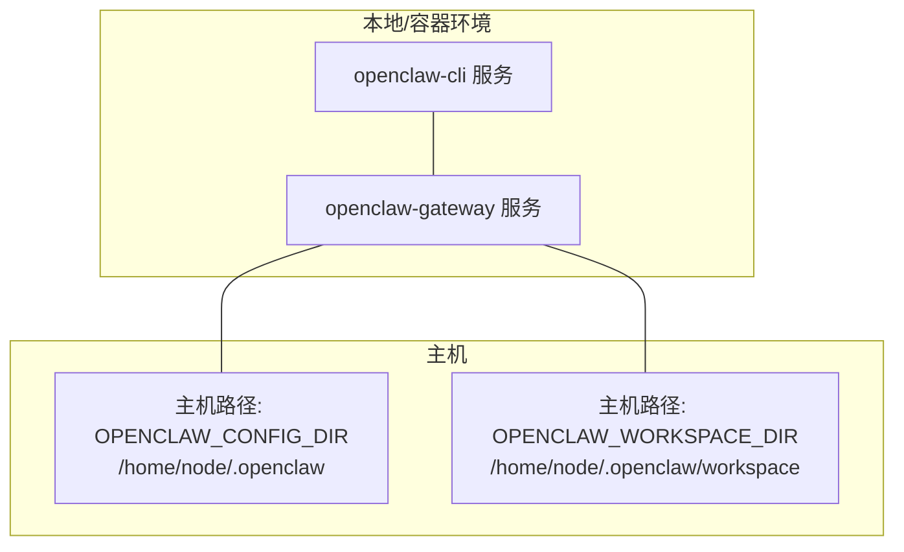
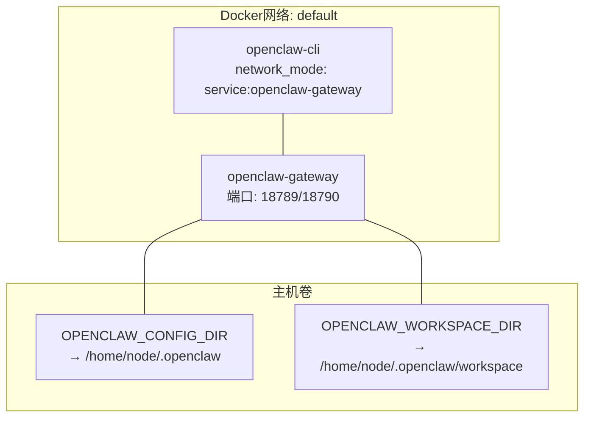
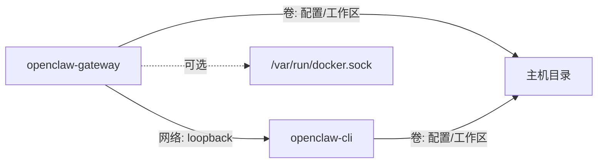

# Docker Compose编排

<cite>
**本文引用的文件**
- [docker-compose.yml](file://docker-compose.yml)
- [Dockerfile](file://Dockerfile)
- [docker-setup.sh](file://docker-setup.sh)
- [docs/install/docker.md](file://docs/install/docker.md)
- [fly.toml](file://fly.toml)
- [fly.private.toml](file://fly.private.toml)
- [Dockerfile.sandbox](file://Dockerfile.sandbox)
- [Dockerfile.sandbox-browser](file://Dockerfile.sandbox-browser)
- [Dockerfile.sandbox-common](file://Dockerfile.sandbox-common)
- [openclaw.podman.env](file://openclaw.podman.env)
- [.dockerignore](file://.dockerignore)
</cite>

## 目录
1. [简介](#简介)
2. [项目结构](#项目结构)
3. [核心组件](#核心组件)
4. [架构总览](#架构总览)
5. [组件详解](#组件详解)
6. [依赖关系分析](#依赖关系分析)
7. [性能与资源规划](#性能与资源规划)
8. [故障排查指南](#故障排查指南)
9. [结论](#结论)
10. [附录](#附录)

## 简介
本指南面向在Docker环境中编排OpenClaw网关（gateway）与配套CLI容器的用户，系统讲解服务定义、网络与卷挂载策略、环境变量与端口映射、启动顺序与依赖、数据持久化方案，并提供生产与开发两种Compose配置思路。同时覆盖服务发现、负载均衡与高可用建议，以及常见问题的定位与修复方法。

## 项目结构
OpenClaw的Docker编排由以下关键文件构成：
- docker-compose.yml：定义主服务与辅助服务、环境变量、端口映射、卷挂载、健康检查与启动顺序
- Dockerfile：镜像构建流程、安全加固、健康检查探针与默认入口命令
- docker-setup.sh：一键初始化脚本，负责镜像构建/拉取、写入.env、生成额外Compose叠加文件、权限修正、引导向导、沙箱可选启用等
- docs/install/docker.md：官方Docker部署文档，包含环境变量、持久化、浏览器与沙箱配置要点
- fly(.private).toml：Fly.io平台部署参考（非Compose，但涉及端口、进程与存储挂载）
- Dockerfile.sandbox(-*)：沙箱相关镜像构建文件
- openclaw.podman.env：Podman环境变量参考
- .dockerignore：构建上下文排除规则

图表来源
- [docker-compose.yml](file://docker-compose.yml#L1-L77)
- [Dockerfile](file://Dockerfile#L133-L155)

章节来源
- [docker-compose.yml](file://docker-compose.yml#L1-L77)
- [Dockerfile](file://Dockerfile#L133-L155)

## 核心组件
- 主服务：openclaw-gateway
  - 运行网关进程，绑定端口并暴露HTTP/WS接口
  - 挂载配置与工作区目录，支持健康检查
- 辅助服务：openclaw-cli
  - 与网关共享网络，通过loopback访问网关
  - 安全加固（丢弃敏感能力、禁用新特权），用于执行CLI命令与配置管理

章节来源
- [docker-compose.yml](file://docker-compose.yml#L2-L77)
- [Dockerfile](file://Dockerfile#L140-L155)

## 架构总览
下图展示容器间关系、网络模式与数据流向：

图表来源
- [docker-compose.yml](file://docker-compose.yml#L2-L77)

章节来源
- [docker-compose.yml](file://docker-compose.yml#L2-L77)

## 组件详解

### 服务定义与启动顺序
- openclaw-gateway
  - 使用镜像：OPENCLAW_IMAGE（默认openclaw:local）
  - 环境变量：HOME、TERM、OPENCLAW_GATEWAY_TOKEN、可选Claude会话变量等
  - 端口映射：宿主:18789→容器18789（网关WS/HTTP）、宿主:18790→容器18790（桥接端口）
  - 健康检查：内置探针访问/healthz；Compose层也定义了探测命令
  - 启动参数：通过command传入绑定模式与端口
  - 重启策略：unless-stopped
- openclaw-cli
  - network_mode: service:openclaw-gateway，共享网络命名空间
  - 安全加固：cap_drop、security_opt、no-new-privileges
  - 依赖：depends_on: openclaw-gateway
  - 入口：entrypoint指向CLI入口，便于交互式TTY

章节来源
- [docker-compose.yml](file://docker-compose.yml#L2-L77)
- [Dockerfile](file://Dockerfile#L148-L155)

### 网络配置与模式选择
- 默认网络：Docker默认bridge网络
- openclaw-cli采用network_mode: service:openclaw-gateway，实现与网关在同一网络命名空间内通过127.0.0.1通信
- 端口映射：宿主18789/18790映射到容器18789/18790，便于外部访问与调试
- 绑定模式：通过命令行参数将网关绑定到“lan”或“loopback”，以适配Docker桥接网络下的可达性

章节来源
- [docker-compose.yml](file://docker-compose.yml#L53-L77)
- [Dockerfile](file://Dockerfile#L142-L151)
- [docs/install/docker.md](file://docs/install/docker.md#L507-L531)

### 卷挂载策略与数据持久化
- 配置目录：OPENCLAW_CONFIG_DIR → /home/node/.openclaw
- 工作区目录：OPENCLAW_WORKSPACE_DIR → /home/node/.openclaw/workspace
- 可选：OPENCLAW_HOME_VOLUME（命名卷）持久化/home/node，结合OPENCLAW_EXTRA_MOUNTS实现更多自定义挂载
- 权限修正：脚本在首次运行时以root身份进入容器修正属主，避免EACCES
- 沙箱临时文件：沙箱容器使用tmpfs，生命周期随容器终止而消失

章节来源
- [docker-compose.yml](file://docker-compose.yml#L12-L14)
- [docker-setup.sh](file://docker-setup.sh#L406-L421)
- [docs/install/docker.md](file://docs/install/docker.md#L538-L543)

### 环境变量与端口映射
- 关键变量
  - OPENCLAW_IMAGE：镜像名（本地构建或远程拉取）
  - OPENCLAW_GATEWAY_TOKEN：网关鉴权令牌
  - OPENCLAW_CONFIG_DIR、OPENCLAW_WORKSPACE_DIR：主机路径
  - OPENCLAW_GATEWAY_PORT、OPENCLAW_BRIDGE_PORT：宿主端口映射
  - OPENCLAW_GATEWAY_BIND：网关绑定模式（lan/loopback等）
  - OPENCLAW_EXTRA_MOUNTS、OPENCLAW_HOME_VOLUME：额外挂载与命名卷
  - OPENCLAW_SANDBOX、OPENCLAW_DOCKER_SOCKET：沙箱启用与Docker套接字路径
  - OPENCLAW_ALLOW_INSECURE_PRIVATE_WS：允许私有ws目标（调试用途）
- 端口
  - 18789：网关WS/HTTP
  - 18790：桥接端口（如需）

章节来源
- [docker-compose.yml](file://docker-compose.yml#L4-L26)
- [docker-setup.sh](file://docker-setup.sh#L169-L209)
- [docs/install/docker.md](file://docs/install/docker.md#L59-L78)

### 依赖关系与启动顺序
- openclaw-cli依赖openclaw-gateway，Compose通过depends_on确保先启动网关
- openclaw-cli使用network_mode: service:openclaw-gateway，保证loopback可达
- 初始化流程：脚本先构建/拉取镜像、写.env、修正权限、运行onboard、启动网关，再可选启用沙箱

章节来源
- [docker-compose.yml](file://docker-compose.yml#L51-L77)
- [docker-setup.sh](file://docker-setup.sh#L423-L453)

### 健康检查与可观测性
- 容器级健康检查：Dockerfile中HEALTHCHECK对/healthz探活
- Compose层健康检查：自定义探针命令，轮询/healthz
- 深度健康快照：通过CLI exec调用health命令并携带令牌进行认证检查

章节来源
- [Dockerfile](file://Dockerfile#L148-L155)
- [docker-compose.yml](file://docker-compose.yml#L38-L49)
- [docs/install/docker.md](file://docs/install/docker.md#L489-L494)

### 沙箱与Docker Socket集成（可选）
- 可选启用：OPENCLAW_SANDBOX=1
- 前置条件：镜像需包含Docker CLI（或本地构建时开启OPENCLAW_INSTALL_DOCKER_CLI=1）
- 安全策略：脚本在前置校验通过后才追加docker.sock挂载与group_add，避免无能力时暴露socket
- 配置落盘：设置agents.defaults.sandbox.*，失败则回滚并移除overlay

章节来源
- [docker-setup.sh](file://docker-setup.sh#L293-L300)
- [docker-setup.sh](file://docker-setup.sh#L455-L510)
- [docker-setup.sh](file://docker-setup.sh#L512-L562)
- [Dockerfile](file://Dockerfile#L81-L111)

## 依赖关系分析
- 服务耦合
  - openclaw-cli与openclaw-gateway强耦合于网络与配置：CLI依赖网关提供的服务，且共享配置目录
- 外部依赖
  - Docker守护进程（沙箱场景下需要访问docker.sock）
  - 可选：Playwright浏览器缓存目录（通过挂载或命名卷持久化）
- 循环依赖
  - 未见循环依赖，启动顺序明确（gateway先于CLI）

图表来源
- [docker-compose.yml](file://docker-compose.yml#L2-L77)
- [docker-setup.sh](file://docker-setup.sh#L484-L510)

章节来源
- [docker-compose.yml](file://docker-compose.yml#L2-L77)
- [docker-setup.sh](file://docker-setup.sh#L484-L510)

## 性能与资源规划
- 内存与GC
  - Dockerfile中设置NODE_OPTIONS以限制最大堆内存，降低低配主机OOM风险
- 构建优化
  - .dockerignore排除大体积与无关文件，缩短构建上下文
  - 依赖层优先复制lockfile与脚本，提升缓存命中率
- 运行时优化
  - 非root运行降低逃逸风险
  - CLI容器丢弃敏感能力与禁用新特权，减少攻击面
- 平台差异
  - Fly.io示例展示了不同region、VM规格与挂载点的组合，可作为生产部署参考

章节来源
- [Dockerfile](file://Dockerfile#L60-L62)
- [.dockerignore](file://.dockerignore#L1-L65)
- [fly.toml](file://fly.toml#L1-L35)
- [fly.private.toml](file://fly.private.toml#L1-L40)

## 故障排查指南
- 权限错误（EACCES）
  - 症状：容器无法写入/home/node/.openclaw
  - 处理：确保宿主挂载目录属主为uid 1000（容器node用户），或使用脚本自动修正
- 网络不可达
  - 症状：宿主无法访问18789端口
  - 处理：确认OPENCLAW_GATEWAY_BIND为“lan”，或使用host网络；检查防火墙与DOCKER-USER策略
- CLI无法连接网关
  - 症状：CLI报“pairing required”或连接失败
  - 处理：重置gateway.mode与gateway.bind为local与lan；核对OPENCLAW_GATEWAY_TOKEN
- 沙箱无法启动
  - 症状：提示缺少Docker CLI或socket不存在
  - 处理：启用OPENCLAW_INSTALL_DOCKER_CLI=1或确保镜像已包含Docker CLI；确认docker.sock路径与GID
- 健康检查失败
  - 症状：容器被标记unhealthy
  - 处理：检查/healthz是否可达；查看容器日志；必要时调整探针间隔与超时

章节来源
- [docker-setup.sh](file://docker-setup.sh#L406-L421)
- [docs/install/docker.md](file://docs/install/docker.md#L507-L531)
- [docs/install/docker.md](file://docs/install/docker.md#L468-L494)
- [Dockerfile](file://Dockerfile#L81-L111)

## 结论
通过docker-compose.yml与docker-setup.sh，OpenClaw提供了开箱即用的Docker编排方案：清晰的服务边界、严格的权限与安全加固、完善的持久化策略与健康检查。结合官方文档与Fly.io参考配置，可在开发与生产环境快速落地。对于需要更强隔离与工具执行安全的场景，可按需启用沙箱与Docker socket挂载，但务必遵循最小权限原则与前置校验流程。

## 附录

### 开发环境与生产环境配置要点对比
- 开发环境
  - 使用默认“lan”绑定，便于宿主浏览器访问
  - 可启用OPENCLAW_EXTRA_MOUNTS挂载个人代码库或缓存目录
  - 使用OPENCLAW_HOME_VOLUME持久化/home/node，加速Playwright下载与工具缓存
- 生产环境
  - 严格限制网络与能力，启用健康检查与重启策略
  - 使用远程镜像（OPENCLAW_IMAGE）并配合版本标签
  - Fly.io示例展示了region、VM规格与挂载点的组合，可作为参考

章节来源
- [docs/install/docker.md](file://docs/install/docker.md#L59-L78)
- [docs/install/docker.md](file://docs/install/docker.md#L349-L390)
- [fly.toml](file://fly.toml#L1-L35)
- [fly.private.toml](file://fly.private.toml#L1-L40)

### 服务发现、负载均衡与高可用建议
- 服务发现
  - 在Docker Compose中通常通过固定端口与容器名称解析；若需跨主机，建议使用外部服务发现（如DNS/Consul）或平台原生LB
- 负载均衡
  - Compose不直接提供LB；可结合反向代理（如Nginx/Envoy）或平台LB（如Fly.io http_service）
- 高可用
  - 多实例部署时，确保配置与工作区目录使用共享存储（卷/对象存储），并为每个实例分配唯一端口与配置路径

[本节为通用实践说明，不直接分析具体源文件]

### 常见编排问题与解决方案
- 服务间通信
  - 使用network_mode: service:...实现loopback互通；若需跨服务访问，建议改用自定义网络并使用服务名解析
- 资源限制
  - 在Dockerfile中设置NODE_OPTIONS限制内存；在生产中可结合平台资源配额
- 健康检查
  - 同时使用容器级HEALTHCHECK与Compose探针，确保多层可观测性

[本节为通用实践说明，不直接分析具体源文件]