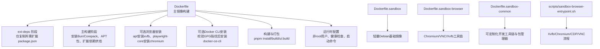
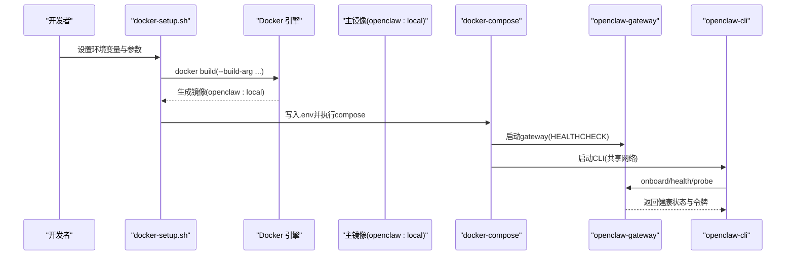
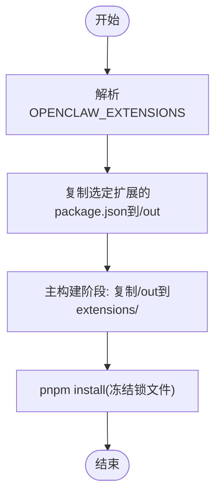
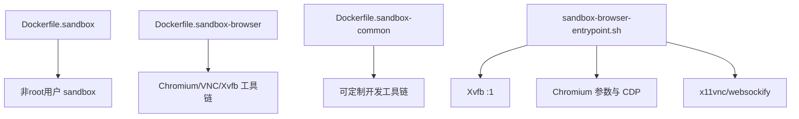
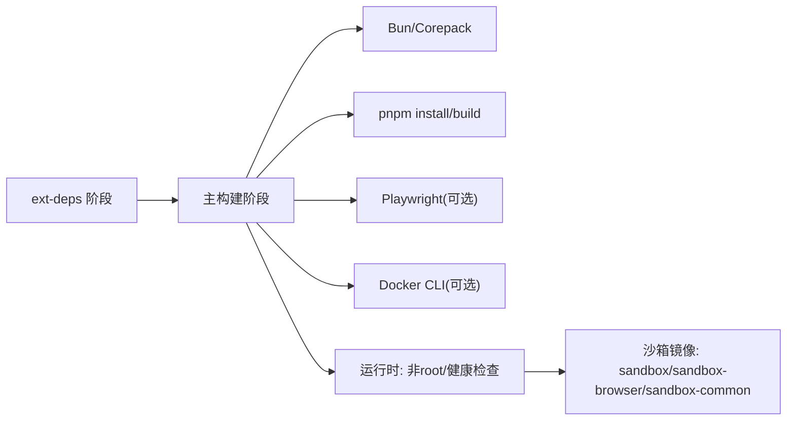

# Docker镜像构建

<cite>
**本文档引用的文件**
- [Dockerfile](file://Dockerfile)
- [Dockerfile.sandbox](file://Dockerfile.sandbox)
- [Dockerfile.sandbox-browser](file://Dockerfile.sandbox-browser)
- [Dockerfile.sandbox-common](file://Dockerfile.sandbox-common)
- [.dockerignore](file://.dockerignore)
- [docker-compose.yml](file://docker-compose.yml)
- [docker-setup.sh](file://docker-setup.sh)
- [scripts/sandbox-browser-entrypoint.sh](file://scripts/sandbox-browser-entrypoint.sh)
- [scripts/sandbox-setup.sh](file://scripts/sandbox-setup.sh)
- [scripts/sandbox-common-setup.sh](file://scripts/sandbox-common-setup.sh)
- [docs/install/docker.md](file://docs/install/docker.md)
- [package.json](file://package.json)
</cite>

## 目录
1. [简介](#简介)
2. [项目结构](#项目结构)
3. [核心组件](#核心组件)
4. [架构总览](#架构总览)
5. [详细组件分析](#详细组件分析)
6. [依赖关系分析](#依赖关系分析)
7. [性能考虑](#性能考虑)
8. [故障排除指南](#故障排除指南)
9. [结论](#结论)
10. [附录](#附录)

## 简介
本文件面向OpenClaw的Docker镜像构建，系统性阐述多阶段构建策略与缓存优化、基础镜像选择与OCI元数据标注、构建参数设计（如扩展依赖烘焙、APT包安装、浏览器预装）、Bun与Corepack集成、Playwright浏览器预安装策略、沙箱容器镜像的安全配置与运行时要求，以及镜像层优化、缓存策略与构建性能调优建议。

## 项目结构
OpenClaw的Docker构建由以下关键文件组成：
- 主镜像构建：Dockerfile（含扩展依赖提取阶段、基础镜像、Bun/Corepack、可选浏览器与Docker CLI安装、健康检查与启动命令）
- 沙箱镜像族：Dockerfile.sandbox（通用沙箱基础）、Dockerfile.sandbox-browser（带Chromium与VNC的浏览器沙箱）、Dockerfile.sandbox-common（可定制化通用沙箱）
- 运行编排：docker-compose.yml（服务定义、环境变量、健康检查、端口映射）
- 构建与引导：docker-setup.sh（自动构建/拉取、环境注入、网关引导、沙箱启用）
- 沙箱入口：scripts/sandbox-browser-entrypoint.sh（Xvfb、Chromium、CDP/VNC转发）
- 辅助脚本：scripts/sandbox-setup.sh、scripts/sandbox-common-setup.sh（沙箱镜像构建）

**图表来源**
- [Dockerfile](file://Dockerfile#L1-L155)
- [Dockerfile.sandbox](file://Dockerfile.sandbox#L1-L21)
- [Dockerfile.sandbox-browser](file://Dockerfile.sandbox-browser#L1-L33)
- [Dockerfile.sandbox-common](file://Dockerfile.sandbox-common#L1-L46)
- [scripts/sandbox-browser-entrypoint.sh](file://scripts/sandbox-browser-entrypoint.sh#L1-L128)

**章节来源**
- [Dockerfile](file://Dockerfile#L1-L155)
- [Dockerfile.sandbox](file://Dockerfile.sandbox#L1-L21)
- [Dockerfile.sandbox-browser](file://Dockerfile.sandbox-browser#L1-L33)
- [Dockerfile.sandbox-common](file://Dockerfile.sandbox-common#L1-L46)
- [scripts/sandbox-browser-entrypoint.sh](file://scripts/sandbox-browser-entrypoint.sh#L1-L128)

## 核心组件
- 多阶段构建与扩展依赖烘焙（ext-deps）：通过独立stage仅复制目标扩展的package.json，避免无关源码变更导致主构建层失效，显著提升缓存命中率与构建速度。
- 基础镜像与OCI元数据：基于node:22-bookworm，固定digest以确保可重复性；标注OCI基础镜像元数据，便于下游镜像治理与溯源。
- 构建参数（ARG）：OPENCLAW_EXTENSIONS用于在构建期预安装指定扩展依赖；OPENCLAW_DOCKER_APT_PACKAGES用于按需安装额外系统依赖；OPENCLAW_INSTALL_BROWSER控制是否预装Chromium与Xvfb。
- Bun与Corepack集成：安装Bun并启用Corepack，使pnpm与Bun生态协同工作；UI构建强制使用pnpm以规避ARM/Synology兼容性问题。
- Playwright浏览器预安装：在pnpm install之后，按需安装Chromium及其依赖到用户缓存目录，避免容器启动时的网络安装延迟。
- 沙箱容器镜像：提供通用沙箱（Dockerfile.sandbox）、带浏览器的沙箱（Dockerfile.sandbox-browser）、可定制化通用沙箱（Dockerfile.sandbox-common），配合入口脚本实现无头/有头模式、VNC/反向代理等能力。
- 安全与权限：非root用户运行、drop敏感capabilities、no-new-privileges、健康检查、最小权限APT安装与缓存清理。

**章节来源**
- [Dockerfile](file://Dockerfile#L1-L155)
- [docs/install/docker.md](file://docs/install/docker.md#L164-L184)
- [scripts/sandbox-browser-entrypoint.sh](file://scripts/sandbox-browser-entrypoint.sh#L1-L128)

## 架构总览
下图展示从构建到运行的端到端流程，包括多阶段构建、扩展依赖烘焙、浏览器预安装、沙箱启用与运行时安全加固。

**图表来源**
- [docker-setup.sh](file://docker-setup.sh#L389-L404)
- [docker-compose.yml](file://docker-compose.yml#L1-L77)
- [Dockerfile](file://Dockerfile#L148-L155)

**章节来源**
- [docker-setup.sh](file://docker-setup.sh#L389-L404)
- [docker-compose.yml](file://docker-compose.yml#L1-L77)
- [Dockerfile](file://Dockerfile#L148-L155)

## 详细组件分析

### 多阶段构建与扩展依赖烘焙(ext-deps)
- 设计原理：将“扩展依赖收集”与“应用构建”解耦。ext-deps阶段仅复制OPENCLAW_EXTENSIONS中列出的扩展的package.json至输出目录，随后主构建阶段从该输出目录拷贝这些文件，从而避免无关扩展源码变更影响主构建层。
- 缓存优化：由于只复制package.json，构建上下文大幅缩小；即使扩展源码频繁变化，只要不改动这些package.json，主构建层缓存仍可复用。
- 使用方式：通过--build-arg OPENCLAW_EXTENSIONS传入空格分隔的扩展名列表。

**图表来源**
- [Dockerfile](file://Dockerfile#L8-L18)
- [Dockerfile](file://Dockerfile#L57-L62)

**章节来源**
- [Dockerfile](file://Dockerfile#L1-L18)
- [Dockerfile](file://Dockerfile#L57-L62)

### 基础镜像选择与OCI元数据标注
- 基础镜像：node:22-bookworm，提供稳定Node运行时与Debian Bookworm生态。
- 固定digest：在FROM指令中显式指定sha256，确保镜像来源可重复且可审计。
- OCI元数据：通过LABEL标注基础镜像名称与digest、源代码仓库、文档链接、许可证、标题、描述、版本、修订、创建时间等，便于镜像治理与合规追踪。

**图表来源**
- [Dockerfile](file://Dockerfile#L22-L33)
- [Dockerfile](file://Dockerfile#L20-L21)

**章节来源**
- [Dockerfile](file://Dockerfile#L20-L33)
- [docs/install/docker.md](file://docs/install/docker.md#L164-L184)

### 构建参数(ARG)详解
- OPENCLAW_EXTENSIONS：在构建期预安装指定扩展的依赖，减少容器启动时的网络安装时间与不确定性。
- OPENCLAW_DOCKER_APT_PACKAGES：在构建期安装额外APT包，满足特定运行时需求（如系统库、工具链）。
- OPENCLAW_INSTALL_BROWSER：在构建期预装Chromium与Xvfb，消除容器启动时Playwright安装的等待与失败风险。
- OPENCLAW_INSTALL_DOCKER_CLI：在构建期安装Docker CLI，支持沙箱容器管理（agents.defaults.sandbox）。
- OPENCLAW_DOCKER_GPG_FINGERPRINT：用于验证Docker APT签名密钥指纹，确保安装过程可信。
- 其他：OPENCLAW_EXTRA_MOUNTS、OPENCLAW_HOME_VOLUME、OPENCLAW_SANDBOX、OPENCLAW_DOCKER_SOCKET、OPENCLAW_ALLOW_INSECURE_PRIVATE_WS等由docker-setup.sh注入与传递。

**章节来源**
- [Dockerfile](file://Dockerfile#L8-L10)
- [Dockerfile](file://Dockerfile#L44-L50)
- [Dockerfile](file://Dockerfile#L68-L79)
- [Dockerfile](file://Dockerfile#L85-L111)
- [docker-setup.sh](file://docker-setup.sh#L371-L387)
- [docs/install/docker.md](file://docs/install/docker.md#L59-L77)

### Bun与Corepack集成配置
- 安装Bun：通过curl安装最新Bun，并将其二进制加入PATH。
- 启用Corepack：允许使用package manager的内置版本（如pnpm）。
- UI构建强制pnpm：设置环境变量以确保UI构建使用pnpm，避免Bun在ARM/Synology架构上的兼容性问题。

**章节来源**
- [Dockerfile](file://Dockerfile#L35-L40)
- [Dockerfile](file://Dockerfile#L124-L126)

### Playwright浏览器预安装策略
- 触发时机：在pnpm install之后、安装Chromium之前，确保playwright-core已可用。
- 安装内容：apt安装xvfb；将Chromium安装到用户缓存目录（PLAYWRIGHT_BROWSERS_PATH），并设置权限归属。
- 性能收益：避免容器首次启动时的网络下载与安装，显著降低冷启动时间。

**章节来源**
- [Dockerfile](file://Dockerfile#L64-L79)

### 沙箱容器镜像与安全配置
- 通用沙箱：Dockerfile.sandbox提供最小化的Debian基础，包含常用工具与非root用户。
- 浏览器沙箱：Dockerfile.sandbox-browser在通用基础上增加Chromium、VNC、x11vnc、novnc、socat、xvfb等，适配远程可视化与自动化场景。
- 可定制通用沙箱：Dockerfile.sandbox-common通过ARG参数（PACKAGES、INSTALL_PNPM、INSTALL_BUN、INSTALL_BREW、FINAL_USER等）灵活装配开发工具链。
- 运行时入口：scripts/sandbox-browser-entrypoint.sh负责Xvfb启动、Chromium参数去重、CDP端口映射、VNC/反向代理、无头/有头模式切换等。
- 安全加固：非root用户运行、drop敏感capabilities、no-new-privileges、最小权限APT安装与缓存清理。

**图表来源**
- [Dockerfile.sandbox](file://Dockerfile.sandbox#L1-L21)
- [Dockerfile.sandbox-browser](file://Dockerfile.sandbox-browser#L1-L33)
- [Dockerfile.sandbox-common](file://Dockerfile.sandbox-common#L1-L46)
- [scripts/sandbox-browser-entrypoint.sh](file://scripts/sandbox-browser-entrypoint.sh#L1-L128)

**章节来源**
- [Dockerfile.sandbox](file://Dockerfile.sandbox#L1-L21)
- [Dockerfile.sandbox-browser](file://Dockerfile.sandbox-browser#L1-L33)
- [Dockerfile.sandbox-common](file://Dockerfile.sandbox-common#L1-L46)
- [scripts/sandbox-browser-entrypoint.sh](file://scripts/sandbox-browser-entrypoint.sh#L1-L128)

### 运行时与健康检查
- 非root用户：镜像以node用户运行，降低逃逸风险。
- 健康检查：通过HTTP接口探测/healthz与/readyz，周期性检查网关健康状态。
- 启动命令：默认启动gateway并允许未配置模式，可通过环境变量覆盖绑定地址与认证。

**章节来源**
- [Dockerfile](file://Dockerfile#L135-L155)
- [docker-compose.yml](file://docker-compose.yml#L38-L49)

## 依赖关系分析
- 构建期依赖：Bun、Corepack、pnpm、Playwright（可选）、Docker CLI（可选）、APT工具链。
- 运行期依赖：Node运行时、Chromium（可选）、Xvfb（可选）、VNC工具（可选）。
- 组件耦合：主镜像与沙箱镜像通过compose配置进行协作；沙箱启用需要Docker CLI与socket挂载。

**图表来源**
- [Dockerfile](file://Dockerfile#L1-L155)
- [Dockerfile.sandbox](file://Dockerfile.sandbox#L1-L21)
- [Dockerfile.sandbox-browser](file://Dockerfile.sandbox-browser#L1-L33)
- [Dockerfile.sandbox-common](file://Dockerfile.sandbox-common#L1-L46)

**章节来源**
- [Dockerfile](file://Dockerfile#L1-L155)
- [Dockerfile.sandbox](file://Dockerfile.sandbox#L1-L21)
- [Dockerfile.sandbox-browser](file://Dockerfile.sandbox-browser#L1-L33)
- [Dockerfile.sandbox-common](file://Dockerfile.sandbox-common#L1-L46)

## 性能考虑
- 构建缓存优化
  - 扩展依赖烘焙：仅复制package.json，避免无关源码变更导致缓存失效。
  - 分层拆分：将APT安装、依赖安装、UI构建分离到不同层，最大化利用缓存。
  - 最小化上下文：.dockerignore排除大体积或无关文件，保留必要的构建产物路径。
- 运行时性能
  - 浏览器预安装：在构建期完成Chromium安装，避免容器启动时的网络开销。
  - 内存限制：通过NODE_OPTIONS限制Node内存上限，缓解小规格VM上的OOM风险。
  - UI构建强制pnpm：规避Bun在特定架构上的兼容性问题，保证构建稳定性。
- 网络与安全
  - Docker CLI安装前校验GPG指纹，防止供应链攻击。
  - drop敏感capabilities、no-new-privileges，降低容器逃逸面。

**章节来源**
- [.dockerignore](file://.dockerignore#L1-L65)
- [Dockerfile](file://Dockerfile#L117-L126)
- [Dockerfile](file://Dockerfile#L60-L62)
- [Dockerfile](file://Dockerfile#L94-L100)

## 故障排除指南
- 构建期错误
  - GPG指纹不匹配：当Docker APT密钥指纹更新时，需同步OPENCLAW_DOCKER_GPG_FINGERPRINT。
  - APT安装失败：检查OPENCLAW_DOCKER_APT_PACKAGES是否包含不可用包名或架构不兼容项。
  - 扩展依赖缺失：确认OPENCLAW_EXTENSIONS中的扩展名与extensions目录一致，且存在package.json。
- 运行期错误
  - 网关无法从宿主机访问：默认绑定loopback，需将bind改为lan并设置认证；或使用host网络。
  - 沙箱启用失败：确认镜像包含Docker CLI，且宿主机docker.sock可访问并正确挂载。
  - 浏览器不可用：若未预装浏览器，容器启动时Playwright安装可能超时或失败。
- 调试建议
  - 查看健康检查日志与容器退出码。
  - 使用compose日志与交互式会话排查权限与挂载问题。
  - 在docker-setup.sh中开启沙箱时，遵循提示检查socket路径与GID。

**章节来源**
- [Dockerfile](file://Dockerfile#L85-L111)
- [Dockerfile](file://Dockerfile#L143-L151)
- [docker-setup.sh](file://docker-setup.sh#L473-L510)

## 结论
OpenClaw的Docker镜像构建采用多阶段与扩展依赖烘焙策略，结合Bun/Corepack、可选浏览器预安装与最小权限运行，实现了高性能、可重复与安全的容器化交付。通过完善的OCI元数据标注与沙箱镜像体系，既满足生产部署的稳定性要求，也为开发与调试提供了灵活的工具链支持。

## 附录
- 常用构建参数与用途
  - OPENCLAW_EXTENSIONS：构建期预安装扩展依赖
  - OPENCLAW_DOCKER_APT_PACKAGES：构建期安装APT包
  - OPENCLAW_INSTALL_BROWSER：预装Chromium与Xvfb
  - OPENCLAW_INSTALL_DOCKER_CLI：安装Docker CLI
  - OPENCLAW_DOCKER_GPG_FINGERPRINT：校验Docker APT密钥
- 参考文档
  - [docs/install/docker.md](file://docs/install/docker.md#L59-L77)
  - [docs/install/docker.md](file://docs/install/docker.md#L164-L184)