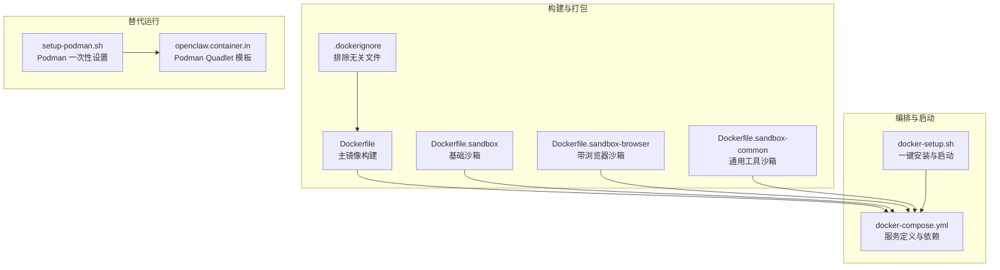
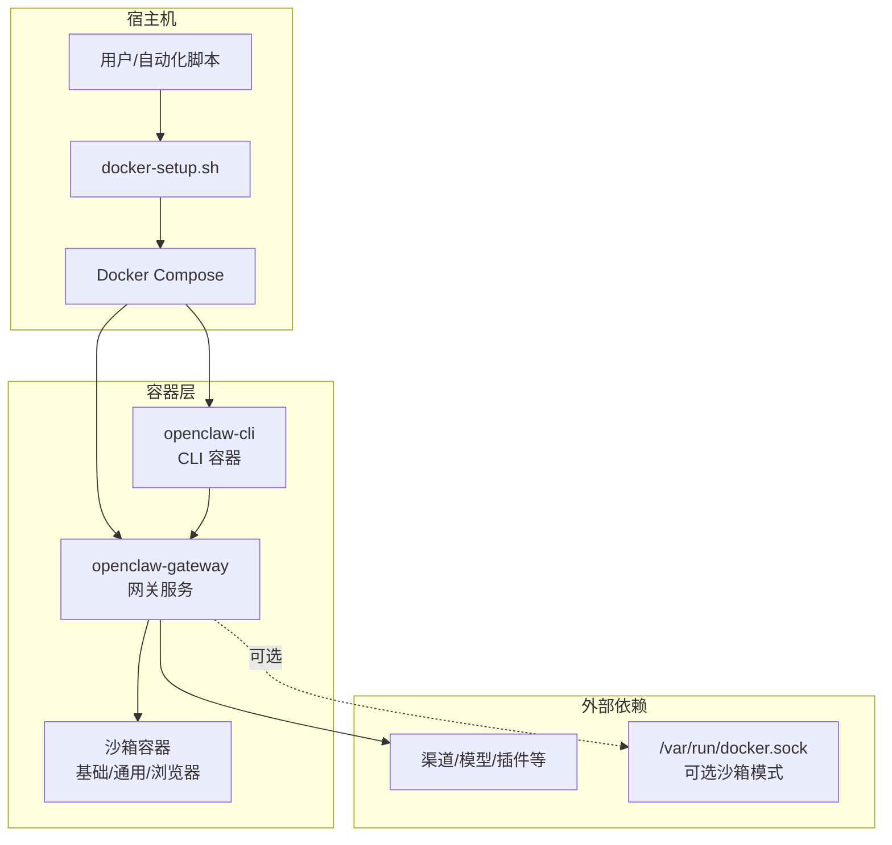
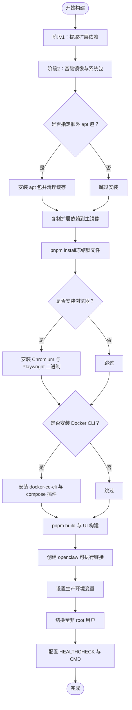
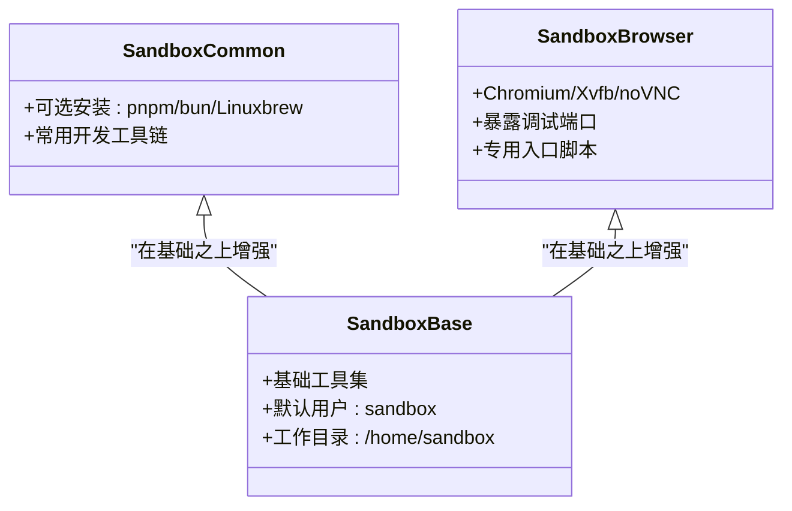
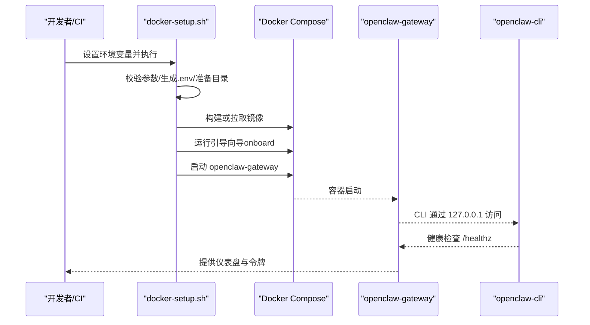
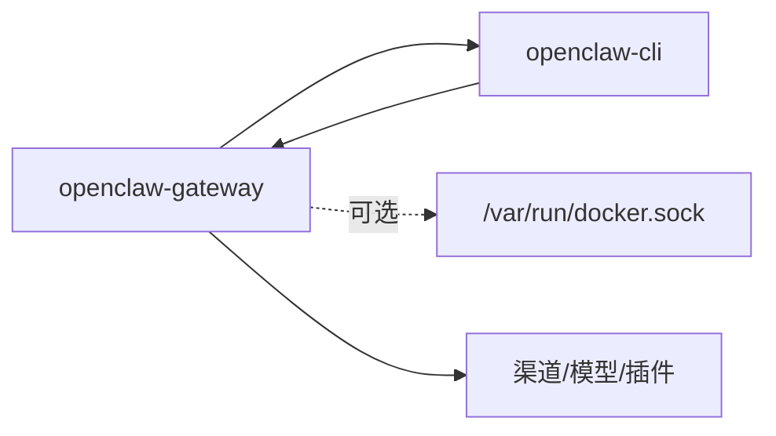

# 容器化部署

<cite>
**本文引用的文件**
- [Dockerfile](file://Dockerfile)
- [Dockerfile.sandbox](file://Dockerfile.sandbox)
- [Dockerfile.sandbox-browser](file://Dockerfile.sandbox-browser)
- [Dockerfile.sandbox-common](file://Dockerfile.sandbox-common)
- [docker-compose.yml](file://docker-compose.yml)
- [.dockerignore](file://.dockerignore)
- [docker-setup.sh](file://docker-setup.sh)
- [docs/install/docker.md](file://docs/install/docker.md)
- [scripts/sandbox-setup.sh](file://scripts/sandbox-setup.sh)
- [scripts/podman/openclaw.container.in](file://scripts/podman/openclaw.container.in)
- [setup-podman.sh](file://setup-podman.sh)
</cite>

## 目录
1. [简介](#简介)
2. [项目结构](#项目结构)
3. [核心组件](#核心组件)
4. [架构总览](#架构总览)
5. [详细组件分析](#详细组件分析)
6. [依赖分析](#依赖分析)
7. [性能考虑](#性能考虑)
8. [故障排查指南](#故障排查指南)
9. [结论](#结论)
10. [附录](#附录)

## 简介
本指南面向在容器环境中部署与运行 OpenClaw 的工程团队与运维人员，系统性阐述以下主题：
- Docker 镜像构建：多阶段构建、层缓存策略、可选组件安装（浏览器、Docker CLI）与安全加固
- Docker Compose 编排：服务定义、依赖关系、网络拓扑、健康检查与自动重启
- 沙箱容器：隔离机制、安全配置、资源限制与网络策略
- 运行时保障：健康检查、自动重启、监控集成建议
- 版本管理与发布：镜像标签策略与发布流程
- 常见问题：权限、存储卷、网络配置与端口映射

## 项目结构
OpenClaw 提供了完整的容器化部署支持，核心文件包括：
- 主镜像构建：Dockerfile 及其扩展参数
- 沙箱镜像族：基础沙箱、通用工具沙箱、带浏览器沙箱
- 编排与启动：docker-compose.yml 与一键脚本 docker-setup.sh
- 构建上下文控制：.dockerignore
- 替代运行方式：Podman 支持脚本与 Quadlet 配置

**图表来源**
- [Dockerfile](file://Dockerfile#L1-L155)
- [Dockerfile.sandbox](file://Dockerfile.sandbox#L1-L21)
- [Dockerfile.sandbox-browser](file://Dockerfile.sandbox-browser#L1-L33)
- [Dockerfile.sandbox-common](file://Dockerfile.sandbox-common#L1-L46)
- [.dockerignore](file://.dockerignore#L1-L65)
- [docker-compose.yml](file://docker-compose.yml#L1-L77)
- [docker-setup.sh](file://docker-setup.sh#L1-L574)
- [scripts/podman/openclaw.container.in](file://scripts/podman/openclaw.container.in#L1-L29)
- [setup-podman.sh](file://setup-podman.sh#L1-L308)

**章节来源**
- [Dockerfile](file://Dockerfile#L1-L155)
- [docker-compose.yml](file://docker-compose.yml#L1-L77)
- [.dockerignore](file://.dockerignore#L1-L65)
- [docker-setup.sh](file://docker-setup.sh#L1-L574)
- [scripts/podman/openclaw.container.in](file://scripts/podman/openclaw.container.in#L1-L29)
- [setup-podman.sh](file://setup-podman.sh#L1-L308)

## 核心组件
- 主镜像（Gateway + CLI）
  - 多阶段构建：分离扩展依赖提取与主构建，避免无关源码变更导致层失效
  - 可选组件：通过构建参数安装 Playwright 浏览器与 Docker CLI
  - 运行用户：非 root 用户，降低逃逸风险
  - 健康检查：内置 /healthz 与 /readyz 探针
- 沙箱镜像族
  - 基础沙箱：最小工具集，适合执行命令行工具
  - 通用工具沙箱：预装 Node、Go、Rust、Python 等常用工具
  - 浏览器沙箱：带 Chromium、Xvfb、noVNC，支持 CDP 与观察模式
- 编排与启动
  - 服务：openclaw-gateway（网关）、openclaw-cli（CLI）
  - 依赖：CLI 依赖网关；共享网络命名空间以使用 127.0.0.1
  - 健康检查：基于探针端点的 Liveness/Readiness
  - 自动重启：unless-stopped 策略
- 构建上下文与缓存
  - .dockerignore 显式排除大体积与无关目录，保留 Canvas A2UI 构建所需资源
  - Dockerfile 层顺序优化：先复制依赖元数据，再复制源码，最大化缓存命中

**章节来源**
- [Dockerfile](file://Dockerfile#L1-L155)
- [Dockerfile.sandbox](file://Dockerfile.sandbox#L1-L21)
- [Dockerfile.sandbox-browser](file://Dockerfile.sandbox-browser#L1-L33)
- [Dockerfile.sandbox-common](file://Dockerfile.sandbox-common#L1-L46)
- [docker-compose.yml](file://docker-compose.yml#L1-L77)
- [.dockerignore](file://.dockerignore#L1-L65)

## 架构总览
下图展示了容器化部署的整体架构：主镜像承载网关与 CLI，沙箱镜像用于隔离执行工具；Compose 管理服务生命周期与依赖；可选地挂载 Docker Socket 实现“宿主网关 + Docker 工具”的沙箱模式。

**图表来源**
- [docker-compose.yml](file://docker-compose.yml#L1-L77)
- [docker-setup.sh](file://docker-setup.sh#L1-L574)

## 详细组件分析

### 组件A：主镜像构建（Dockerfile）
- 多阶段与扩展依赖提取
  - 使用独立阶段仅拷贝扩展 package.json，避免无关源码变更导致后续层失效
  - 主构建阶段 COPY 扩展依赖产物，减少重复安装
- 可选组件安装
  - Playwright 浏览器：通过构建参数选择性安装，避免每次启动下载
  - Docker CLI：安装 Docker CLI 以支持沙箱容器管理
- 运行时安全与稳定性
  - 非 root 用户运行，降低逃逸风险
  - 低内存主机场景下设置 Node 内存上限，缓解 OOM
- 健康检查与入口
  - 内置 /healthz 与 /readyz 探针
  - 默认 CMD 启动网关，允许未配置模式以便首次运行

**图表来源**
- [Dockerfile](file://Dockerfile#L1-L155)

**章节来源**
- [Dockerfile](file://Dockerfile#L1-L155)

### 组件B：沙箱镜像族（Dockerfile.sandbox*）
- 基础沙箱（Dockerfile.sandbox）
  - 最小工具集：bash、curl、git、jq、python3、ripgrep 等
  - 默认用户 sandbox，工作目录 /home/sandbox
- 通用工具沙箱（Dockerfile.sandbox-common）
  - 支持通过构建参数安装 pnpm、bun、brew（Linuxbrew），并设置 PATH
  - 预装常用开发工具链：Node、Go、Rust、pkg-config、build-essential 等
- 浏览器沙箱（Dockerfile.sandbox-browser）
  - 预装 Chromium、Xvfb、novnc、websockify、socat 等
  - 暴露调试端口：9222（CDP）、5900（VNC）、6080（noVNC）
  - 提供专用入口脚本，便于在沙箱内运行浏览器任务

**图表来源**
- [Dockerfile.sandbox](file://Dockerfile.sandbox#L1-L21)
- [Dockerfile.sandbox-common](file://Dockerfile.sandbox-common#L1-L46)
- [Dockerfile.sandbox-browser](file://Dockerfile.sandbox-browser#L1-L33)

**章节来源**
- [Dockerfile.sandbox](file://Dockerfile.sandbox#L1-L21)
- [Dockerfile.sandbox-common](file://Dockerfile.sandbox-common#L1-L46)
- [Dockerfile.sandbox-browser](file://Dockerfile.sandbox-browser#L1-L33)
- [scripts/sandbox-setup.sh](file://scripts/sandbox-setup.sh#L1-L8)

### 组件C：编排与启动（docker-compose.yml + docker-setup.sh）
- 服务定义
  - openclaw-gateway：绑定端口 18789/18790，健康检查基于 /healthz
  - openclaw-cli：与网关共享网络，使用 127.0.0.1 访问网关
- 依赖与网络
  - CLI 依赖网关；两者在同一网络命名空间内
  - 可选挂载 Docker Socket，启用“宿主网关 + Docker 工具”的沙箱模式
- 启动流程（docker-setup.sh）
  - 参数校验与环境准备：路径合法性、命名卷校验、socket 路径检测
  - 生成/注入 .env：包含网关令牌、端口、绑定模式等
  - 构建或拉取镜像：本地构建或远程镜像拉取
  - 权限修复：确保宿主挂载目录对容器内 node 用户可写
  - 引导向导：执行 onboard，固定 gateway.mode=local 与 gateway.bind
  - 可选沙箱：检测 Docker CLI、挂载 socket、写入沙箱配置并重启网关
  - 输出命令：日志查看、健康检查、仪表盘访问

**图表来源**
- [docker-setup.sh](file://docker-setup.sh#L1-L574)
- [docker-compose.yml](file://docker-compose.yml#L1-L77)

**章节来源**
- [docker-compose.yml](file://docker-compose.yml#L1-L77)
- [docker-setup.sh](file://docker-setup.sh#L1-L574)

### 组件D：构建上下文与层缓存（.dockerignore + Dockerfile）
- .dockerignore 策略
  - 排除大量日志、缓存、构建产物与大型应用树
  - 仅保留 Canvas A2UI 构建所需的资源，显著缩小构建上下文
- Dockerfile 层缓存优化
  - 先复制依赖元数据（package.json、lockfile、workspace 文件），再复制源码
  - 将 pnpm install 放置在依赖复制之后，避免无关变更触发重装
  - UI 构建前强制使用 pnpm，提升跨架构兼容性

**章节来源**
- [.dockerignore](file://.dockerignore#L1-L65)
- [Dockerfile](file://Dockerfile#L1-L155)

### 组件E：沙箱隔离与安全配置
- 沙箱模式
  - 默认按 agent 级别隔离，支持 per-session 与 shared 模式
  - workspaceAccess 支持 none/ro/rw，分别对应独立沙盒目录、只读挂载与读写挂载
- 网络与资源限制
  - 默认网络 none，禁止出站；host 与 container:<id> 被显式阻止
  - 支持 CPU、内存、PIDs、ulimit 等资源限制
  - tmpfs 挂载于 /tmp、/var/tmp、/run，随容器销毁而清理
- 安全加固
  - capDrop: ALL，seccomp/AppArmor 策略可配置
  - root 只读根文件系统，需 root 用户才能安装系统包
- 浏览器沙箱
  - 默认禁用 3D/GPU 等高风险特性，必要时可通过环境变量放宽
  - CDP 端口与 noVNC 观察端口可配置，支持密码保护的观察令牌

**章节来源**
- [docs/install/docker.md](file://docs/install/docker.md#L544-L843)
- [Dockerfile.sandbox-common](file://Dockerfile.sandbox-common#L1-L46)
- [Dockerfile.sandbox-browser](file://Dockerfile.sandbox-browser#L1-L33)

## 依赖分析
- 组件耦合
  - openclaw-cli 与 openclaw-gateway 强耦合：共享网络命名空间，CLI 通过 127.0.0.1 访问网关
  - 沙箱模式可选依赖 Docker CLI 与 Docker Socket：仅在启用沙箱时挂载
- 外部依赖
  - 渠道与模型提供商（由网关动态加载）
  - 可选 Playwright 浏览器缓存（持久化于 /home/node/.cache）

**图表来源**
- [docker-compose.yml](file://docker-compose.yml#L1-L77)

**章节来源**
- [docker-compose.yml](file://docker-compose.yml#L1-L77)

## 性能考虑
- 构建性能
  - 通过 .dockerignore 显著减少构建上下文大小
  - 依赖层优先复制，避免频繁重装
  - 可选预装浏览器与 Docker CLI，减少容器启动时的安装开销
- 运行性能
  - 非 root 用户运行降低权限检查成本
  - 沙箱容器使用 tmpfs 减少磁盘 IO 并提升临时文件处理速度
  - 资源限制防止单容器占用过多 CPU/内存影响宿主与其他容器

[本节为通用指导，无需特定文件引用]

## 故障排查指南
- 权限与 EACCES
  - 现象：宿主挂载目录无法写入
  - 处理：确保挂载目录属主为 uid 1000（容器内 node 用户），或使用 docker-setup.sh 的权限修复步骤
- 端口与网络
  - 现象：宿主无法访问网关端口
  - 处理：确认 gateway.bind 与端口映射一致；若使用 loopback 绑定，宿主端口映射可能不可达
- 沙箱不可用
  - 现象：启用沙箱后 agent 执行失败
  - 处理：确认镜像已安装 Docker CLI；若缺少 Docker Socket，docker-setup.sh 会回滚沙箱配置
- 健康检查失败
  - 现象：容器被标记为不健康并自动重启
  - 处理：检查 /healthz 与 /readyz 端点；必要时调整启动参数或资源限制

**章节来源**
- [docs/install/docker.md](file://docs/install/docker.md#L391-L531)
- [docker-setup.sh](file://docker-setup.sh#L418-L421)
- [docker-compose.yml](file://docker-compose.yml#L38-L49)

## 结论
OpenClaw 的容器化部署以“安全优先、可扩展、易维护”为核心目标：通过多阶段构建与层缓存优化缩短构建时间；通过 Compose 编排与健康检查保障运行稳定；通过沙箱机制实现工具执行的强隔离与细粒度安全控制。结合本文提供的策略与排错建议，可在不同规模与安全要求的环境中高效落地。

[本节为总结，无需特定文件引用]

## 附录

### A. 健康检查与监控集成
- 内置探针
  - /healthz：进程存活探针
  - /readyz：启动与通道就绪探针
- 外部集成
  - 将 /healthz 作为 Kubernetes/LivenessProbe/ReadinessProbe
  - 在监控平台中定期抓取 /healthz 与 /readyz，结合容器日志与指标进行告警

**章节来源**
- [Dockerfile](file://Dockerfile#L148-L154)
- [docker-compose.yml](file://docker-compose.yml#L38-L49)

### B. 版本管理与发布流程
- 标签策略
  - main：最新主分支构建
  - <版本号>：发布标签构建
  - latest：最新稳定发布标签
- 发布流程建议
  - CI 中构建镜像并推送至镜像仓库
  - 对 main 与 release 标签打上对应标签
  - 在 docker-setup.sh 中通过 OPENCLAW_IMAGE 指向目标镜像

**章节来源**
- [docs/install/docker.md](file://docs/install/docker.md#L149-L204)

### C. Podman 替代运行（可选）
- 一次性设置
  - setup-podman.sh 创建用户、构建镜像、生成启动脚本与可选 Quadlet
- Quadlet 配置
  - openclaw.container.in 提供 systemd Quadlet 模板，支持用户态服务管理

**章节来源**
- [setup-podman.sh](file://setup-podman.sh#L1-L308)
- [scripts/podman/openclaw.container.in](file://scripts/podman/openclaw.container.in#L1-L29)