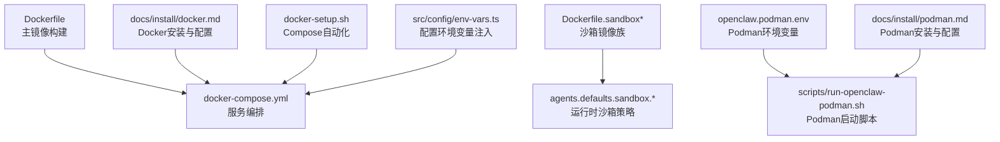
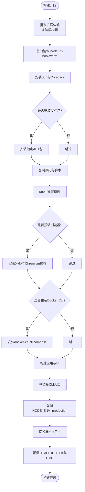
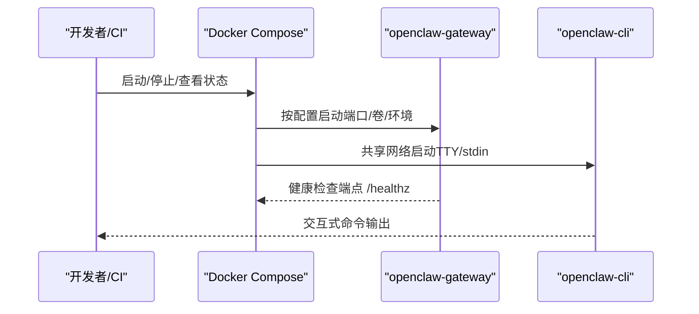
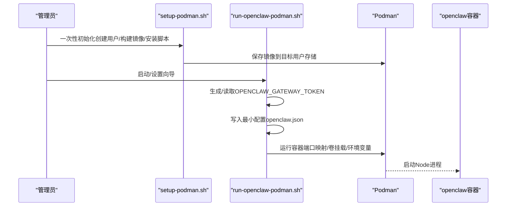
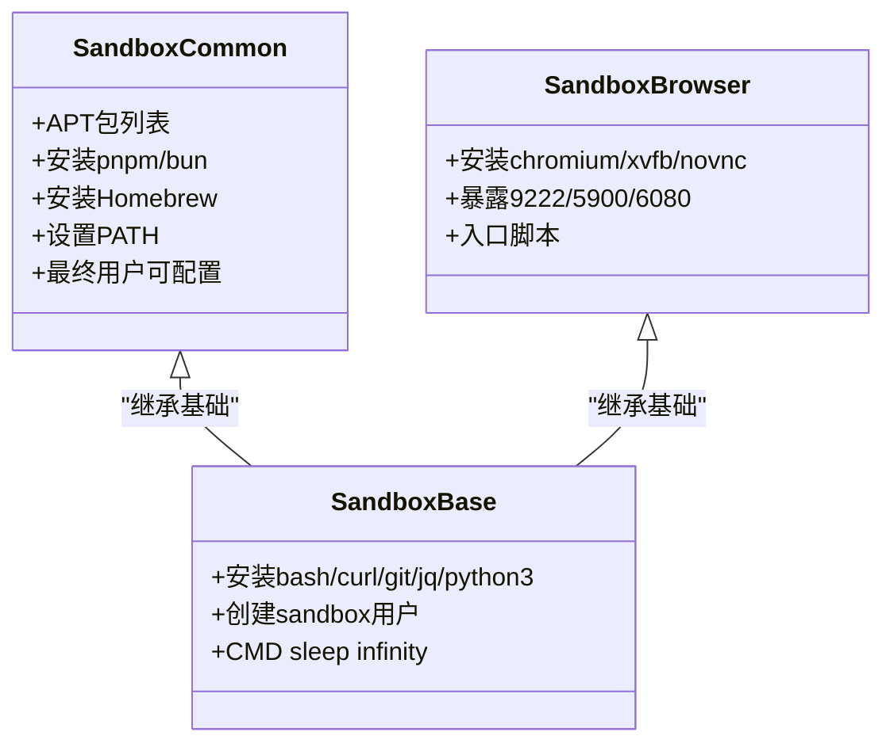
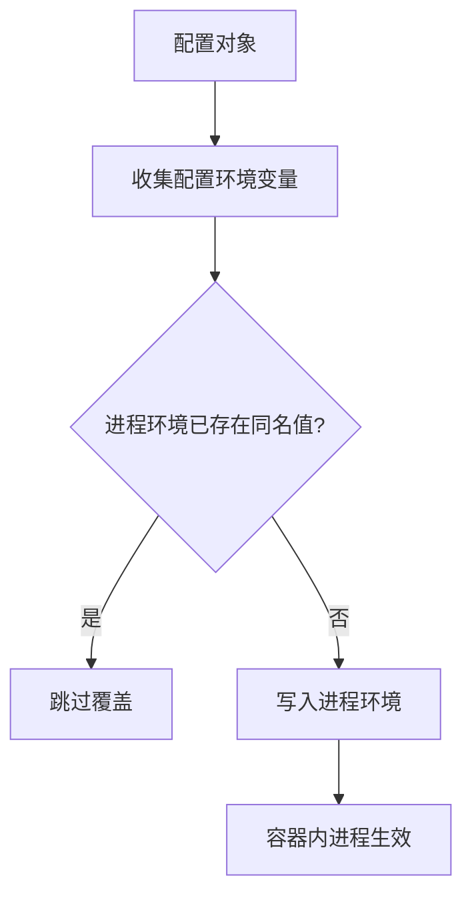
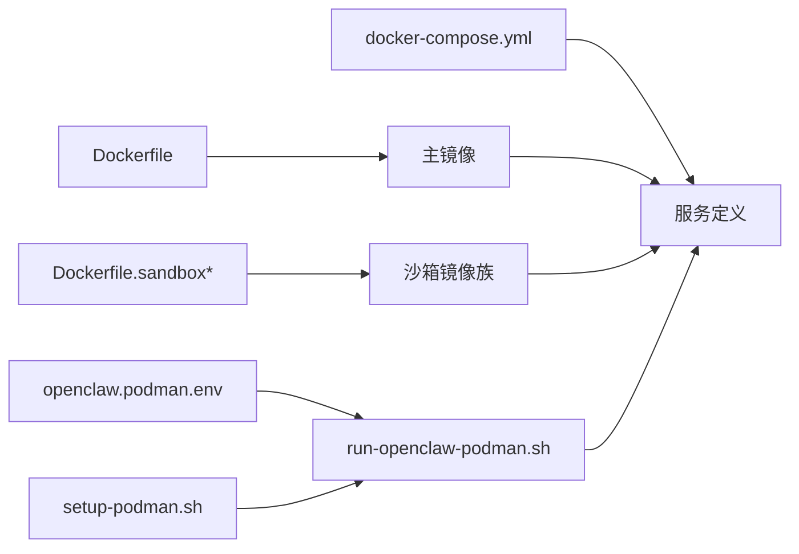

# 容器配置管理

<cite>
**本文引用的文件**
- [Dockerfile](file://Dockerfile)
- [docker-compose.yml](file://docker-compose.yml)
- [openclaw.podman.env](file://openclaw.podman.env)
- [docs/install/docker.md](file://docs/install/docker.md)
- [docs/install/podman.md](file://docs/install/podman.md)
- [scripts/run-openclaw-podman.sh](file://scripts/run-openclaw-podman.sh)
- [setup-podman.sh](file://setup-podman.sh)
- [Dockerfile.sandbox](file://Dockerfile.sandbox)
- [Dockerfile.sandbox-common](file://Dockerfile.sandbox-common)
- [Dockerfile.sandbox-browser](file://Dockerfile.sandbox-browser)
- [scripts/e2e/Dockerfile](file://scripts/e2e/Dockerfile)
- [scripts/docker/install-sh-smoke/Dockerfile](file://scripts/docker/install-sh-smoke/Dockerfile)
- [scripts/docker/install-sh-nonroot/Dockerfile](file://scripts/docker/install-sh-nonroot/Dockerfile)
- [docker-setup.sh](file://docker-setup.sh)
- [docs/zh-CN/install/hetzner.md](file://docs/zh-CN/install/hetzner.md)
- [src/config/env-vars.ts](file://src/config/env-vars.ts)
</cite>

## 目录
1. [简介](#简介)
2. [项目结构](#项目结构)
3. [核心组件](#核心组件)
4. [架构总览](#架构总览)
5. [详细组件分析](#详细组件分析)
6. [依赖关系分析](#依赖关系分析)
7. [性能考量](#性能考量)
8. [故障排查指南](#故障排查指南)
9. [结论](#结论)
10. [附录](#附录)

## 简介
本指南面向OpenClaw的容器化部署与运维，系统性讲解容器运行时配置、环境变量管理、配置文件组织、多环境策略（开发/测试/生产）、安全加固（非root运行、权限与安全上下文）、网络与端口、存储模型、监控与日志、更新与滚动升级/回滚策略，并总结最佳实践与常见陷阱。内容以仓库内的Dockerfile、Compose编排、Podman脚本、安装文档与相关源码为依据，确保可操作与可追溯。

## 项目结构
围绕容器配置的关键文件与目录如下：
- 容器镜像定义：根目录Dockerfile及多个专用Dockerfile（沙箱、浏览器等）
- 编排与运行：docker-compose.yml、Podman环境模板与启动脚本
- 文档与策略：官方安装文档（Docker/Podman）与平台部署说明
- 辅助脚本：docker-setup.sh、scripts/run-openclaw-podman.sh、setup-podman.sh
- 环境变量采集：src/config/env-vars.ts（用于理解配置注入流程）



图表来源
- [Dockerfile](file://Dockerfile#L1-L155)
- [docker-compose.yml](file://docker-compose.yml#L1-L77)
- [openclaw.podman.env](file://openclaw.podman.env#L1-L25)
- [scripts/run-openclaw-podman.sh](file://scripts/run-openclaw-podman.sh#L1-L214)
- [setup-podman.sh](file://setup-podman.sh#L1-L308)
- [Dockerfile.sandbox](file://Dockerfile.sandbox#L1-L21)
- [Dockerfile.sandbox-common](file://Dockerfile.sandbox-common#L1-L46)
- [Dockerfile.sandbox-browser](file://Dockerfile.sandbox-browser#L1-L33)
- [docs/install/docker.md](file://docs/install/docker.md#L1-L843)
- [docs/install/podman.md](file://docs/install/podman.md#L1-L123)
- [docker-setup.sh](file://docker-setup.sh#L313-L360)
- [src/config/env-vars.ts](file://src/config/env-vars.ts#L56-L80)

章节来源
- [Dockerfile](file://Dockerfile#L1-L155)
- [docker-compose.yml](file://docker-compose.yml#L1-L77)
- [openclaw.podman.env](file://openclaw.podman.env#L1-L25)
- [docs/install/docker.md](file://docs/install/docker.md#L1-L843)
- [docs/install/podman.md](file://docs/install/podman.md#L1-L123)
- [scripts/run-openclaw-podman.sh](file://scripts/run-openclaw-podman.sh#L1-L214)
- [setup-podman.sh](file://setup-podman.sh#L1-L308)
- [Dockerfile.sandbox](file://Dockerfile.sandbox#L1-L21)
- [Dockerfile.sandbox-common](file://Dockerfile.sandbox-common#L1-L46)
- [Dockerfile.sandbox-browser](file://Dockerfile.sandbox-browser#L1-L33)
- [docker-setup.sh](file://docker-setup.sh#L313-L360)
- [src/config/env-vars.ts](file://src/config/env-vars.ts#L56-L80)

## 核心组件
- 主镜像与运行时
  - 主镜像基于node:22-bookworm，采用多阶段构建，显式使用非root用户运行，内置健康检查端点，支持按需安装浏览器与Docker CLI。
- Compose编排
  - 提供网关与CLI两个服务，共享网络模式与卷挂载，CLI具备能力降级与安全选项，支持健康检查与重启策略。
- Podman运行
  - 通过openclaw.podman.env与run-openclaw-podman.sh实现rootless运行、用户命名空间映射、端口映射与最小化配置写入。
- 沙箱镜像族
  - 提供基础沙箱、通用工具沙箱与带浏览器的沙箱镜像，配合agents.defaults.sandbox.*进行隔离执行。
- 环境变量与配置注入
  - 通过配置收集函数与Compose/Podman环境变量注入，实现运行时参数传递与最小化敏感信息暴露。

章节来源
- [Dockerfile](file://Dockerfile#L1-L155)
- [docker-compose.yml](file://docker-compose.yml#L1-L77)
- [openclaw.podman.env](file://openclaw.podman.env#L1-L25)
- [scripts/run-openclaw-podman.sh](file://scripts/run-openclaw-podman.sh#L150-L214)
- [Dockerfile.sandbox](file://Dockerfile.sandbox#L1-L21)
- [Dockerfile.sandbox-common](file://Dockerfile.sandbox-common#L1-L46)
- [Dockerfile.sandbox-browser](file://Dockerfile.sandbox-browser#L1-L33)
- [src/config/env-vars.ts](file://src/config/env-vars.ts#L56-L80)

## 架构总览
下图展示容器化运行时的整体交互：Compose/Podman负责编排与运行，主镜像承载网关与CLI，沙箱镜像用于工具执行隔离，健康检查与探针保障可观测性。

```mermaid
graph TB
subgraph "宿主机"
U["用户/CI/编排系统"]
end
subgraph "容器运行时"
R["Docker/Podman"]
end
subgraph "容器"
GW["openclaw-gateway<br/>Node进程"]
CLI["openclaw-cli<br/>Node进程"]
SBX["沙箱容器<br/>工具执行隔离"]
end
subgraph "存储"
CFG["/home/node/.openclaw<br/>配置与工作区"]
CACHE["Playwright/缓存路径<br/>可持久化"]
end
U --> R
R --> GW
R --> CLI
R --> SBX
GW <- --> CFG
CLI <- --> CFG
SBX <- --> CFG
GW --> SBX
GW --> CLI
```

图表来源
- [docker-compose.yml](file://docker-compose.yml#L1-L77)
- [Dockerfile](file://Dockerfile#L135-L155)
- [Dockerfile.sandbox](file://Dockerfile.sandbox#L1-L21)
- [Dockerfile.sandbox-common](file://Dockerfile.sandbox-common#L1-L46)
- [Dockerfile.sandbox-browser](file://Dockerfile.sandbox-browser#L1-L33)
- [docs/install/docker.md](file://docs/install/docker.md#L538-L543)

## 详细组件分析

### 组件A：主镜像与运行时配置
- 多阶段构建与扩展依赖提取，减少无关变更导致的层失效
- 非root用户运行，降低逃逸风险
- 健康检查端点与命令行入口，便于编排系统探测
- 可选安装浏览器与Docker CLI，满足沙箱与自动化需求
- 环境变量与工作目录权限处理，避免运行时权限问题



图表来源
- [Dockerfile](file://Dockerfile#L1-L155)

章节来源
- [Dockerfile](file://Dockerfile#L1-L155)

### 组件B：Compose编排与服务配置
- openclaw-gateway服务：绑定端口、健康检查、重启策略、命令行参数（如bind/port）
- openclaw-cli服务：共享网络、能力降级、安全选项、TTY与stdin、entrypoint
- 卷挂载：配置目录与工作区目录映射至/home/node/.openclaw与/workspace
- 环境变量：HOME、TERM、令牌、可选第三方Provider凭据等



图表来源
- [docker-compose.yml](file://docker-compose.yml#L1-L77)

章节来源
- [docker-compose.yml](file://docker-compose.yml#L1-L77)
- [docs/install/docker.md](file://docs/install/docker.md#L130-L147)

### 组件C：Podman运行与环境变量
- openclaw.podman.env：集中存放令牌、端口映射、可选Provider密钥
- run-openclaw-podman.sh：生成/注入令牌、写入最小化配置、解析用户命名空间、运行容器
- setup-podman.sh：一次性初始化openclaw用户、构建镜像、加载到目标用户存储、可选安装systemd Quadlet



图表来源
- [openclaw.podman.env](file://openclaw.podman.env#L1-L25)
- [scripts/run-openclaw-podman.sh](file://scripts/run-openclaw-podman.sh#L150-L214)
- [setup-podman.sh](file://setup-podman.sh#L253-L277)

章节来源
- [openclaw.podman.env](file://openclaw.podman.env#L1-L25)
- [scripts/run-openclaw-podman.sh](file://scripts/run-openclaw-podman.sh#L1-L214)
- [setup-podman.sh](file://setup-podman.sh#L1-L308)
- [docs/install/podman.md](file://docs/install/podman.md#L1-L123)

### 组件D：沙箱镜像与运行策略
- 基础沙箱镜像：安装常用工具，创建非特权用户
- 通用工具沙箱镜像：集成Node/Go/Rust等工具链与包管理器
- 浏览器沙箱镜像：Chromium/Xvfb/noVNC等，暴露调试端口
- 运行时策略：agents.defaults.sandbox.*控制镜像、网络、资源限制、安全配置与自动清理



图表来源
- [Dockerfile.sandbox](file://Dockerfile.sandbox#L1-L21)
- [Dockerfile.sandbox-common](file://Dockerfile.sandbox-common#L1-L46)
- [Dockerfile.sandbox-browser](file://Dockerfile.sandbox-browser#L1-L33)

章节来源
- [Dockerfile.sandbox](file://Dockerfile.sandbox#L1-L21)
- [Dockerfile.sandbox-common](file://Dockerfile.sandbox-common#L1-L46)
- [Dockerfile.sandbox-browser](file://Dockerfile.sandbox-browser#L1-L33)
- [docs/install/docker.md](file://docs/install/docker.md#L544-L788)

### 组件E：环境变量与配置注入
- 配置环境变量收集：从配置对象中提取键值对，注入到进程环境
- Compose/Podman注入：通过environment/env_file/volume挂载注入令牌与Provider密钥
- 安全建议：避免在命令行直接暴露敏感变量，优先使用env_file与只读卷



图表来源
- [src/config/env-vars.ts](file://src/config/env-vars.ts#L56-L80)
- [docker-compose.yml](file://docker-compose.yml#L4-L12)
- [openclaw.podman.env](file://openclaw.podman.env#L6-L25)

章节来源
- [src/config/env-vars.ts](file://src/config/env-vars.ts#L56-L80)
- [docker-compose.yml](file://docker-compose.yml#L4-L12)
- [openclaw.podman.env](file://openclaw.podman.env#L6-L25)

## 依赖关系分析
- 构建期依赖：Dockerfile依赖于扩展package.json提取、APT包、Playwright浏览器缓存
- 运行期依赖：Compose/Podman依赖于环境变量文件、卷挂载、端口映射
- 沙箱依赖：agents.defaults.sandbox.*依赖沙箱镜像与Docker CLI（当启用沙箱时）



图表来源
- [Dockerfile](file://Dockerfile#L1-L155)
- [Dockerfile.sandbox](file://Dockerfile.sandbox#L1-L21)
- [Dockerfile.sandbox-common](file://Dockerfile.sandbox-common#L1-L46)
- [Dockerfile.sandbox-browser](file://Dockerfile.sandbox-browser#L1-L33)
- [docker-compose.yml](file://docker-compose.yml#L1-L77)
- [openclaw.podman.env](file://openclaw.podman.env#L1-L25)
- [scripts/run-openclaw-podman.sh](file://scripts/run-openclaw-podman.sh#L1-L214)
- [setup-podman.sh](file://setup-podman.sh#L1-L308)

章节来源
- [Dockerfile](file://Dockerfile#L1-L155)
- [docker-compose.yml](file://docker-compose.yml#L1-L77)
- [openclaw.podman.env](file://openclaw.podman.env#L1-L25)
- [scripts/run-openclaw-podman.sh](file://scripts/run-openclaw-podman.sh#L1-L214)
- [setup-podman.sh](file://setup-podman.sh#L1-L308)
- [Dockerfile.sandbox](file://Dockerfile.sandbox#L1-L21)
- [Dockerfile.sandbox-common](file://Dockerfile.sandbox-common#L1-L46)
- [Dockerfile.sandbox-browser](file://Dockerfile.sandbox-browser#L1-L33)

## 性能考量
- 构建缓存优化：将依赖安装层置于源码复制之前，避免锁文件变化导致重复安装
- 浏览器缓存持久化：通过PLAYWRIGHT_BROWSERS_PATH与持久卷减少冷启动时间
- 资源限制：沙箱镜像默认限制内存/CPU/ulimit，避免资源争用
- 端口与网络：Compose/Podman仅映射必要端口，避免暴露不必要的服务面

章节来源
- [Dockerfile](file://Dockerfile#L420-L435)
- [docs/install/docker.md](file://docs/install/docker.md#L384-L390)
- [Dockerfile.sandbox-common](file://Dockerfile.sandbox-common#L6-L41)

## 故障排查指南
- 权限与EACCES
  - 镜像以node(uid 1000)运行，宿主挂载目录需匹配该UID/GID
- 端口与网络
  - Docker桥接网络下，容器回环绑定可能无法从宿主访问；可通过host网络或将bind改为lan并设置认证
- 健康检查失败
  - 使用内置/readyz探针与Compose内置健康检查策略
- Podman子UID/子GID
  - openclaw用户需有subuid/subgid范围，否则rootless Podman会失败
- 沙箱socket挂载
  - 需要Docker CLI支持；若缺失，脚本会重置沙箱模式避免错误配置

章节来源
- [docs/install/docker.md](file://docs/install/docker.md#L391-L403)
- [docs/install/docker.md](file://docs/install/docker.md#L507-L531)
- [docs/install/docker.md](file://docs/install/docker.md#L105-L116)
- [docs/install/podman.md](file://docs/install/podman.md#L73-L78)
- [docker-setup.sh](file://docker-setup.sh#L325-L331)

## 结论
OpenClaw的容器配置以“安全优先、可审计、可移植”为核心设计原则：非root运行、最小权限、明确的卷与端口策略、完善的健康检查与日志路径、以及可插拔的沙箱执行模型。结合Docker与Podman两种运行时，可在开发、测试与生产环境中灵活落地。遵循本文档的配置策略与最佳实践，可显著提升部署稳定性与安全性。

## 附录

### 不同部署环境的配置策略
- 开发环境
  - 使用Compose快速启动，开启TTY与交互式CLI；挂载本地源码与配置，便于热迭代
  - 可开启额外APT包与浏览器缓存持久化，加速前端构建与浏览器自动化
- 测试环境
  - 使用Compose或Podman运行，关闭不必要端口，启用只读卷与能力降级
  - 通过环境变量注入测试所需的Provider密钥，但避免硬编码到镜像
- 生产环境
  - 使用Podman rootless与systemd Quadlet自启；严格限制资源与安全上下文
  - 仅暴露必要端口，结合防火墙策略与反向代理；启用健康检查与自动重启

章节来源
- [docs/install/docker.md](file://docs/install/docker.md#L1-L843)
- [docs/install/podman.md](file://docs/install/podman.md#L1-L123)
- [docker-compose.yml](file://docker-compose.yml#L1-L77)
- [openclaw.podman.env](file://openclaw.podman.env#L1-L25)

### 容器安全配置要点
- 非root用户运行：镜像与Podman均以非root身份启动
- 文件权限与安全上下文：能力降级、no-new-privileges、只读根文件系统、最小化capabilities
- 网络隔离：沙箱默认禁用出站，必要时通过策略显式允许
- 证书与密钥：通过env_file与只读卷注入，避免明文写入镜像

章节来源
- [Dockerfile](file://Dockerfile#L135-L138)
- [docker-compose.yml](file://docker-compose.yml#L54-L58)
- [docs/install/docker.md](file://docs/install/docker.md#L665-L668)

### 容器网络与端口
- 默认端口：网关18789、桥接18790；Compose/Podman支持自定义映射
- 绑定模式：lan/loopback/custom等，避免直接使用0.0.0.0/127.0.0.1等别名
- 沙箱网络：默认none，禁止host与容器网络加入

章节来源
- [docker-compose.yml](file://docker-compose.yml#L23-L26)
- [openclaw.podman.env](file://openclaw.podman.env#L16-L17)
- [docs/install/docker.md](file://docs/install/docker.md#L507-L522)
- [docs/install/docker.md](file://docs/install/docker.md#L594-L596)

### 存储模型与持久化
- 持久化路径：/home/node/.openclaw与/workspace；通过卷挂载保留
- 沙箱tmpfs：/tmp、/var/tmp、/run内存后端，随容器销毁而消失
- 热点目录：media、sessions、transcripts、cron/runs、滚动日志

章节来源
- [docs/install/docker.md](file://docs/install/docker.md#L538-L543)
- [docs/install/podman.md](file://docs/install/podman.md#L96-L100)

### 监控、日志与可观测性
- 健康检查端点：/healthz（liveness）与/readyz（readiness），Compose内置健康检查
- 认证深探针：通过token调用健康命令获取通道状态快照
- 日志位置：容器内滚动日志与macOS服务日志分离

章节来源
- [Dockerfile](file://Dockerfile#L148-L153)
- [docker-compose.yml](file://docker-compose.yml#L38-L49)
- [docs/install/docker.md](file://docs/install/docker.md#L489-L494)

### 更新策略、滚动升级与回滚
- Compose自动化：docker-setup.sh生成附加Compose文件，支持回滚时强制使用已知安全的服务定义
- 回滚路径：保留基础Compose参数集，必要时强制无沙箱overlay
- 版本与镜像：支持远程镜像拉取与本地构建，便于灰度与回滚

章节来源
- [docker-setup.sh](file://docker-setup.sh#L325-L331)
- [docs/install/docker.md](file://docs/install/docker.md#L149-L204)

### 最佳实践与常见陷阱
- 最佳实践
  - 以非root运行，最小化capabilities，启用no-new-privileges
  - 使用env_file与只读卷注入敏感信息
  - 仅暴露必要端口，结合防火墙策略
  - 持久化关键目录，避免运行时安装依赖
- 常见陷阱
  - 在容器内安装二进制导致重启丢失
  - 直接使用root用户运行容器
  - 将敏感令牌硬编码到镜像或命令行
  - 忘记调整UID/GID导致权限问题

章节来源
- [docs/zh-CN/install/hetzner.md](file://docs/zh-CN/install/hetzner.md#L207-L212)
- [docs/install/docker.md](file://docs/install/docker.md#L391-L403)
- [Dockerfile](file://Dockerfile#L135-L138)