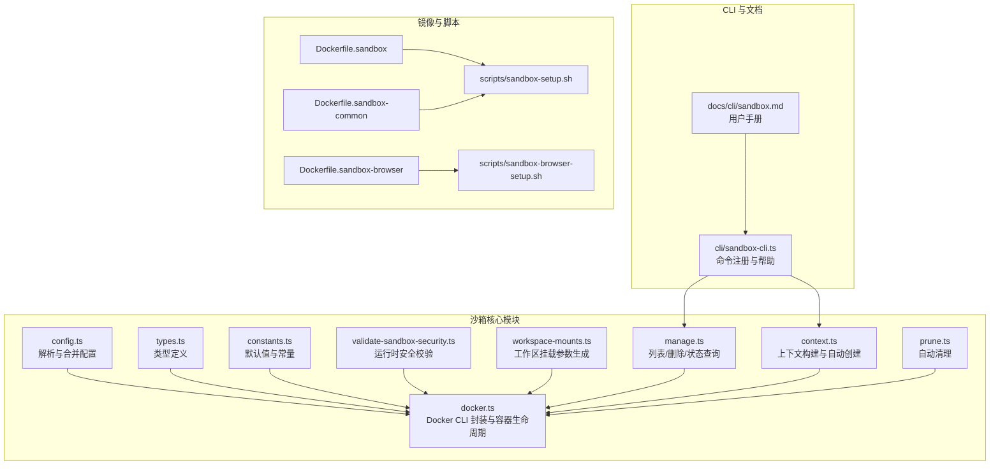
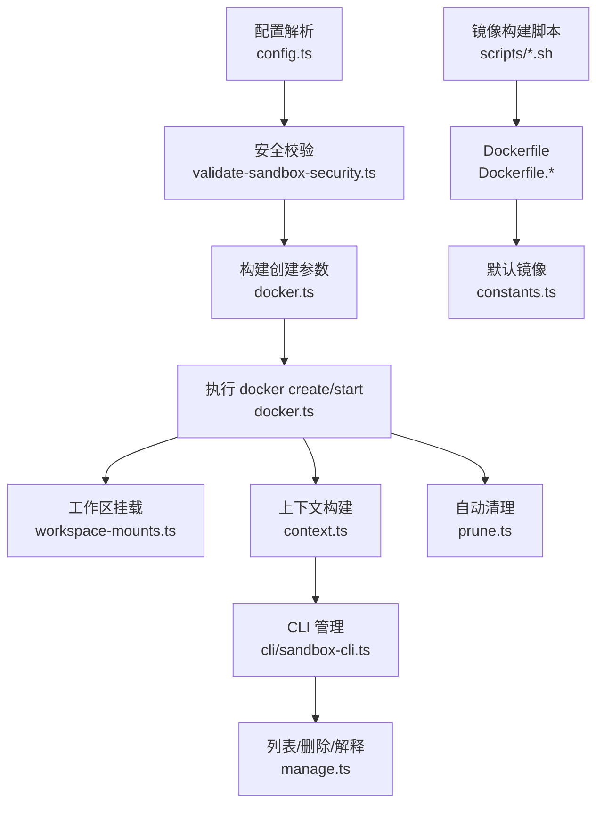
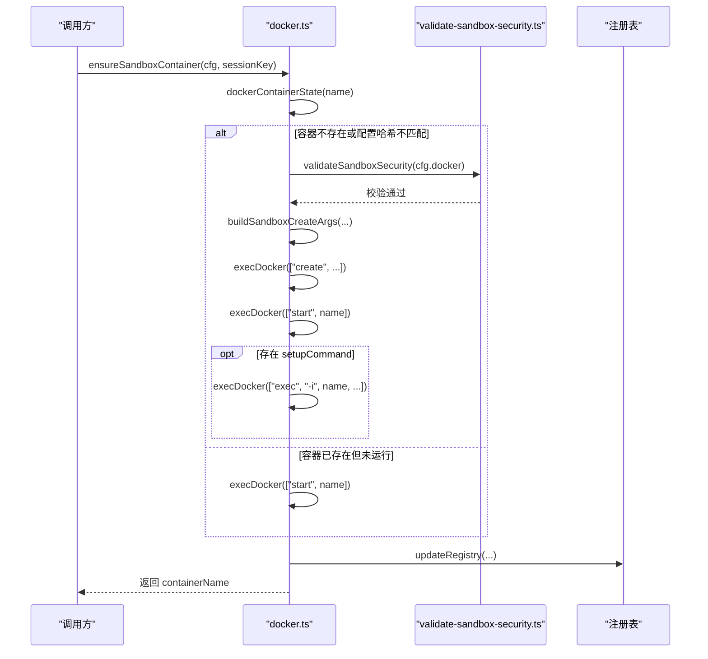
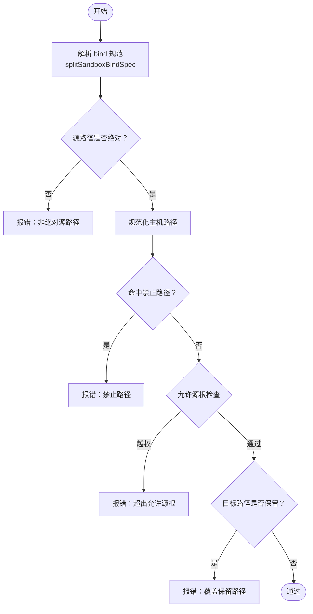
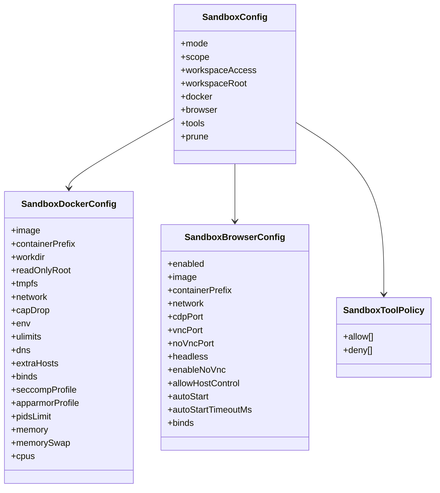
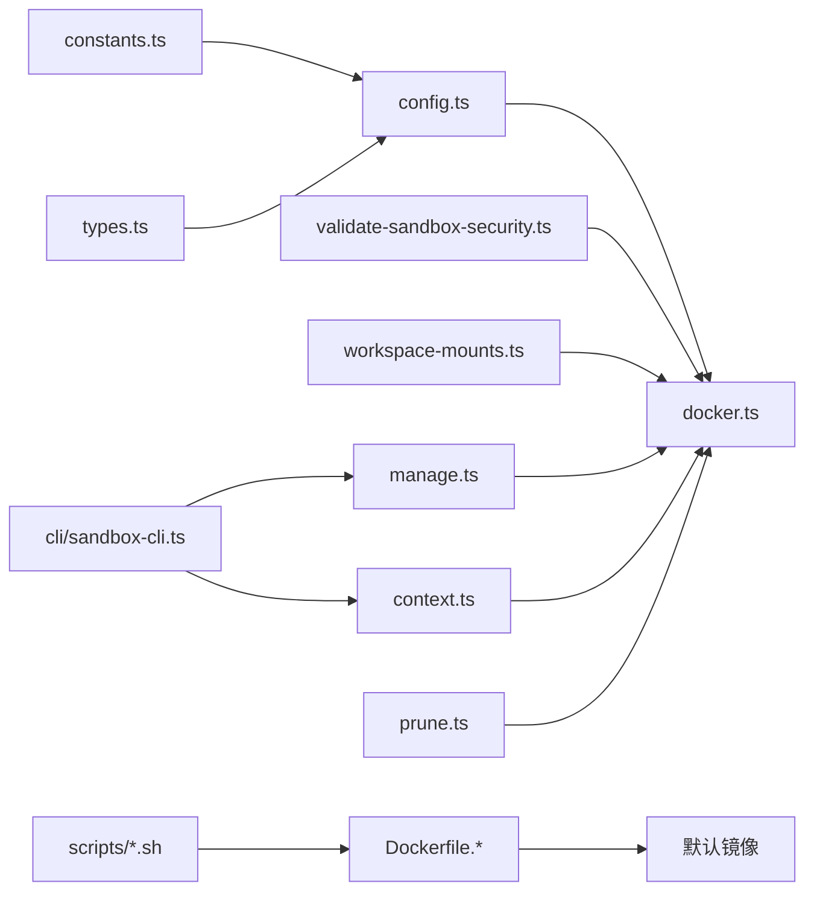

# 沙箱容器管理

<cite>
**本文引用的文件**
- [src/agents/sandbox/docker.ts](file://src/agents/sandbox/docker.ts)
- [src/agents/sandbox/config.ts](file://src/agents/sandbox/config.ts)
- [src/agents/sandbox/types.ts](file://src/agents/sandbox/types.ts)
- [src/agents/sandbox/constants.ts](file://src/agents/sandbox/constants.ts)
- [src/agents/sandbox/workspace-mounts.ts](file://src/agents/sandbox/workspace-mounts.ts)
- [src/agents/sandbox/validate-sandbox-security.ts](file://src/agents/sandbox/validate-sandbox-security.ts)
- [src/agents/sandbox/manage.ts](file://src/agents/sandbox/manage.ts)
- [src/agents/sandbox/context.ts](file://src/agents/sandbox/context.ts)
- [src/agents/sandbox/prune.ts](file://src/agents/sandbox/prune.ts)
- [src/cli/sandbox-cli.ts](file://src/cli/sandbox-cli.ts)
- [docs/cli/sandbox.md](file://docs/cli/sandbox.md)
- [Dockerfile.sandbox](file://Dockerfile.sandbox)
- [Dockerfile.sandbox-browser](file://Dockerfile.sandbox-browser)
- [Dockerfile.sandbox-common](file://Dockerfile.sandbox-common)
- [scripts/sandbox-setup.sh](file://scripts/sandbox-setup.sh)
- [scripts/sandbox-browser-setup.sh](file://scripts/sandbox-browser-setup.sh)
- [src/commands/doctor-sandbox.ts](file://src/commands/doctor-sandbox.ts)
- [src/docker-setup.e2e.test.ts](file://src/docker-setup.e2e.test.ts)
</cite>

## 目录
1. [简介](#简介)
2. [项目结构](#项目结构)
3. [核心组件](#核心组件)
4. [架构总览](#架构总览)
5. [详细组件分析](#详细组件分析)
6. [依赖关系分析](#依赖关系分析)
7. [性能考量](#性能考量)
8. [故障排查指南](#故障排查指南)
9. [结论](#结论)
10. [附录](#附录)

## 简介
本文件系统化阐述 OpenClaw 的沙箱容器管理体系，覆盖隔离机制、安全边界、资源限制策略、生命周期管理（创建、启动、监控、销毁）、多类型沙箱配置（通用、浏览器、专用工具）、Docker CLI 集成、网络与存储卷映射、环境变量传递、性能监控与资源统计、权限与合规要求等。目标是帮助开发者与运维人员理解并正确使用沙箱容器，确保在生产环境中实现安全、可控、可观测的代理执行。

## 项目结构
围绕沙箱容器管理的核心代码主要位于 src/agents/sandbox 及其子模块，并通过 CLI 命令进行统一入口管理；镜像构建脚本与 Dockerfile 放置于仓库根目录及 scripts 目录。

图表来源
- [src/agents/sandbox/config.ts](file://src/agents/sandbox/config.ts#L1-L217)
- [src/agents/sandbox/docker.ts](file://src/agents/sandbox/docker.ts#L1-L565)
- [src/agents/sandbox/validate-sandbox-security.ts](file://src/agents/sandbox/validate-sandbox-security.ts#L1-L344)
- [src/agents/sandbox/workspace-mounts.ts](file://src/agents/sandbox/workspace-mounts.ts#L1-L29)
- [src/agents/sandbox/manage.ts](file://src/agents/sandbox/manage.ts#L1-L107)
- [src/agents/sandbox/context.ts](file://src/agents/sandbox/context.ts#L1-L211)
- [src/agents/sandbox/prune.ts](file://src/agents/sandbox/prune.ts#L1-L70)
- [src/cli/sandbox-cli.ts](file://src/cli/sandbox-cli.ts#L1-L175)
- [docs/cli/sandbox.md](file://docs/cli/sandbox.md#L1-L153)
- [Dockerfile.sandbox](file://Dockerfile.sandbox#L1-L21)
- [Dockerfile.sandbox-browser](file://Dockerfile.sandbox-browser#L1-L33)
- [Dockerfile.sandbox-common](file://Dockerfile.sandbox-common#L1-L46)
- [scripts/sandbox-setup.sh](file://scripts/sandbox-setup.sh#L1-L8)
- [scripts/sandbox-browser-setup.sh](file://scripts/sandbox-browser-setup.sh#L1-L8)

章节来源
- [src/agents/sandbox/docker.ts](file://src/agents/sandbox/docker.ts#L1-L565)
- [src/agents/sandbox/config.ts](file://src/agents/sandbox/config.ts#L1-L217)
- [src/cli/sandbox-cli.ts](file://src/cli/sandbox-cli.ts#L1-L175)
- [docs/cli/sandbox.md](file://docs/cli/sandbox.md#L1-L153)

## 核心组件
- 配置解析与合并：根据全局、代理级与共享作用域，合并 Docker、浏览器、工具策略与清理策略等配置。
- 安全校验：对 bind 挂载、网络模式、安全配置（seccomp/apparmor）进行严格校验，阻断高危设置。
- Docker CLI 封装：封装 execDocker/execDockerRaw，统一错误处理、超时与中止信号。
- 容器生命周期：创建、启动、检查状态、读取标签/环境变量、端口映射、镜像存在性校验与拉取。
- 工作区挂载：按访问级别（只读/读写）生成挂载参数，支持主工作区与代理工作区双挂载。
- 上下文构建：自动创建容器与浏览器，注入认证与桥接服务，返回可直接使用的沙箱上下文。
- 列表与删除：列出容器与浏览器状态，支持删除并清理注册表。
- 自动清理：基于空闲时长与最大存活时间的定期清理。
- CLI 管理：提供 list/recreate/explain 子命令，便于运维与排障。

章节来源
- [src/agents/sandbox/config.ts](file://src/agents/sandbox/config.ts#L76-L217)
- [src/agents/sandbox/validate-sandbox-security.ts](file://src/agents/sandbox/validate-sandbox-security.ts#L328-L344)
- [src/agents/sandbox/docker.ts](file://src/agents/sandbox/docker.ts#L66-L162)
- [src/agents/sandbox/workspace-mounts.ts](file://src/agents/sandbox/workspace-mounts.ts#L12-L28)
- [src/agents/sandbox/context.ts](file://src/agents/sandbox/context.ts#L108-L186)
- [src/agents/sandbox/manage.ts](file://src/agents/sandbox/manage.ts#L65-L107)
- [src/agents/sandbox/prune.ts](file://src/agents/sandbox/prune.ts#L36-L70)
- [src/cli/sandbox-cli.ts](file://src/cli/sandbox-cli.ts#L59-L175)

## 架构总览
下图展示从配置到容器运行、再到 CLI 管理与镜像构建的整体架构：

图表来源
- [src/agents/sandbox/config.ts](file://src/agents/sandbox/config.ts#L76-L120)
- [src/agents/sandbox/validate-sandbox-security.ts](file://src/agents/sandbox/validate-sandbox-security.ts#L328-L344)
- [src/agents/sandbox/docker.ts](file://src/agents/sandbox/docker.ts#L315-L472)
- [src/agents/sandbox/workspace-mounts.ts](file://src/agents/sandbox/workspace-mounts.ts#L12-L28)
- [src/agents/sandbox/context.ts](file://src/agents/sandbox/context.ts#L134-L139)
- [src/agents/sandbox/manage.ts](file://src/agents/sandbox/manage.ts#L65-L107)
- [src/agents/sandbox/prune.ts](file://src/agents/sandbox/prune.ts#L36-L70)
- [scripts/sandbox-setup.sh](file://scripts/sandbox-setup.sh#L1-L8)
- [scripts/sandbox-browser-setup.sh](file://scripts/sandbox-browser-setup.sh#L1-L8)
- [Dockerfile.sandbox](file://Dockerfile.sandbox#L1-L21)
- [Dockerfile.sandbox-browser](file://Dockerfile.sandbox-browser#L1-L33)
- [Dockerfile.sandbox-common](file://Dockerfile.sandbox-common#L1-L46)
- [src/agents/sandbox/constants.ts](file://src/agents/sandbox/constants.ts#L7-L11)

## 详细组件分析

### 组件A：Docker CLI 封装与容器生命周期
- 职责
  - 统一调用 docker 命令，支持输入/输出缓冲、中止信号、失败容忍。
  - 提供容器状态查询、镜像存在性检查与拉取、标签/环境变量读取、端口映射查询。
  - 生成创建参数（含安全选项、DNS、主机名、ulimit、CPU/内存限制、bind 挂载等），并创建与启动容器。
  - 在容器重启或配置变更时更新注册表与配置哈希。
- 关键点
  - 运行时安全校验前置，避免危险配置进入容器。
  - 对“热容器”（近期使用）采用提示重建而非强制删除，平衡一致性与可用性。
  - 支持 setupCommand 在容器内执行初始化脚本。

图表来源
- [src/agents/sandbox/docker.ts](file://src/agents/sandbox/docker.ts#L489-L565)
- [src/agents/sandbox/validate-sandbox-security.ts](file://src/agents/sandbox/validate-sandbox-security.ts#L328-L344)
- [src/agents/sandbox/config.ts](file://src/agents/sandbox/config.ts#L76-L120)

章节来源
- [src/agents/sandbox/docker.ts](file://src/agents/sandbox/docker.ts#L66-L162)
- [src/agents/sandbox/docker.ts](file://src/agents/sandbox/docker.ts#L315-L472)
- [src/agents/sandbox/docker.ts](file://src/agents/sandbox/docker.ts#L489-L565)

### 组件B：安全校验与隔离策略
- 职责
  - 禁止危险 bind 源路径（如 /etc、/proc、/sys、/dev、/root、/boot、/run*、docker.sock）。
  - 禁止保留目标路径（如 /workspace、/agent）被覆盖。
  - 禁止非绝对源路径与越权源根（除非显式允许）。
  - 禁止网络模式 host 与 container:*（除非显式允许）。
  - 禁止 unconfined seccomp/apparmor。
- 设计要点
  - 多轮校验：字符串预检查、规范化路径、祖先链解析以规避符号链接逃逸。
  - 明确的错误信息与建议，便于定位问题与修复。

图表来源
- [src/agents/sandbox/validate-sandbox-security.ts](file://src/agents/sandbox/validate-sandbox-security.ts#L96-L180)
- [src/agents/sandbox/validate-sandbox-security.ts](file://src/agents/sandbox/validate-sandbox-security.ts#L234-L281)

章节来源
- [src/agents/sandbox/validate-sandbox-security.ts](file://src/agents/sandbox/validate-sandbox-security.ts#L16-L37)
- [src/agents/sandbox/validate-sandbox-security.ts](file://src/agents/sandbox/validate-sandbox-security.ts#L283-L306)
- [src/agents/sandbox/validate-sandbox-security.ts](file://src/agents/sandbox/validate-sandbox-security.ts#L308-L326)

### 组件C：配置解析与多类型沙箱
- 通用沙箱
  - 默认镜像、容器前缀、工作目录、只读根文件系统、tmpfs、网络 none、能力降级、安全选项、DNS/hosts、ulimit、CPU/内存限制、bind 挂载等。
- 浏览器沙箱
  - 独立镜像与网络，暴露 CDP/VNC/noVNC 端口，支持无头模式与自动启动。
- 专用工具沙箱
  - 通过工具策略（allow/deny）控制代理可调用能力，结合默认白名单/黑名单策略。

图表来源
- [src/agents/sandbox/types.ts](file://src/agents/sandbox/types.ts#L55-L91)
- [src/agents/sandbox/config.ts](file://src/agents/sandbox/config.ts#L76-L120)
- [src/agents/sandbox/config.ts](file://src/agents/sandbox/config.ts#L122-L155)

章节来源
- [src/agents/sandbox/config.ts](file://src/agents/sandbox/config.ts#L76-L120)
- [src/agents/sandbox/config.ts](file://src/agents/sandbox/config.ts#L122-L155)
- [src/agents/sandbox/constants.ts](file://src/agents/sandbox/constants.ts#L13-L41)

### 组件D：工作区挂载与环境变量
- 工作区挂载
  - 主工作区与代理工作区分别挂载至容器工作目录与 /agent，按访问级别决定读写模式。
- 环境变量
  - 通过 sanitizeEnvVars 过滤敏感与可疑变量，仅允许白名单变量进入容器。
- 网络与 DNS
  - 默认 none 网络，可配置自定义网络、DNS、额外 hosts。

章节来源
- [src/agents/sandbox/workspace-mounts.ts](file://src/agents/sandbox/workspace-mounts.ts#L12-L28)
- [src/agents/sandbox/docker.ts](file://src/agents/sandbox/docker.ts#L368-L377)
- [src/agents/sandbox/config.ts](file://src/agents/sandbox/config.ts#L103-L118)

### 组件E：上下文构建与自动创建
- 自动创建
  - 解析沙箱会话，确保工作区布局、容器与浏览器，注入认证与桥接服务。
- 用户映射
  - 若未指定容器用户，则尝试从宿主工作区目录 UID/GID 推断并设置容器用户，提升权限一致性。
- 浏览器桥接
  - 为浏览器容器建立本地回环桥接与认证，支持 CDP/VNC/noVNC 访问。

章节来源
- [src/agents/sandbox/context.ts](file://src/agents/sandbox/context.ts#L108-L186)
- [src/agents/sandbox/context.ts](file://src/agents/sandbox/context.ts#L67-L88)

### 组件F：CLI 管理与运维
- list：列出容器与浏览器，显示运行状态、镜像匹配、年龄与空闲时间、关联会话/代理。
- recreate：移除旧容器以便下次使用时按新配置重建，支持按 all/session/agent/browser 过滤。
- explain：解释生效的沙箱模式/作用域/工作区访问、工具策略与升级门禁。

章节来源
- [src/cli/sandbox-cli.ts](file://src/cli/sandbox-cli.ts#L59-L175)
- [docs/cli/sandbox.md](file://docs/cli/sandbox.md#L18-L153)

## 依赖关系分析
- 模块耦合
  - config.ts 与 constants.ts 为全局配置与默认值中心，其他模块广泛依赖。
  - docker.ts 作为底层依赖，被 context.ts、manage.ts、prune.ts 等上层逻辑复用。
  - validate-sandbox-security.ts 作为安全守卫，在 docker.ts 创建阶段前置调用。
- 外部依赖
  - Docker CLI：沙箱管理的核心外部依赖，需保证可用性与版本兼容。
  - 镜像：默认基础镜像与浏览器镜像由 Dockerfile.* 构建，脚本提供便捷构建入口。

图表来源
- [src/agents/sandbox/constants.ts](file://src/agents/sandbox/constants.ts#L7-L11)
- [src/agents/sandbox/config.ts](file://src/agents/sandbox/config.ts#L76-L120)
- [src/agents/sandbox/docker.ts](file://src/agents/sandbox/docker.ts#L315-L472)
- [src/agents/sandbox/validate-sandbox-security.ts](file://src/agents/sandbox/validate-sandbox-security.ts#L328-L344)
- [src/agents/sandbox/workspace-mounts.ts](file://src/agents/sandbox/workspace-mounts.ts#L12-L28)
- [src/agents/sandbox/manage.ts](file://src/agents/sandbox/manage.ts#L65-L107)
- [src/agents/sandbox/context.ts](file://src/agents/sandbox/context.ts#L134-L139)
- [src/agents/sandbox/prune.ts](file://src/agents/sandbox/prune.ts#L36-L70)
- [src/cli/sandbox-cli.ts](file://src/cli/sandbox-cli.ts#L59-L175)
- [Dockerfile.sandbox](file://Dockerfile.sandbox#L1-L21)
- [Dockerfile.sandbox-browser](file://Dockerfile.sandbox-browser#L1-L33)
- [Dockerfile.sandbox-common](file://Dockerfile.sandbox-common#L1-L46)
- [scripts/sandbox-setup.sh](file://scripts/sandbox-setup.sh#L1-L8)
- [scripts/sandbox-browser-setup.sh](file://scripts/sandbox-browser-setup.sh#L1-L8)

## 性能考量
- 资源限制
  - 通过 pidsLimit、memory/memorySwap、cpus、ulimits 等参数限制容器资源，避免资源争用。
- 文件系统
  - 使用 tmpfs 减少持久化写入，降低磁盘 IO；合理挂载工作区，避免不必要的大体积挂载。
- 网络
  - 默认 none 网络最小化出站面；浏览器沙箱使用独立网络与端口映射，避免冲突。
- 清理策略
  - 结合 idleHours 与 maxAgeDays 的自动清理，释放闲置资源，保持系统健康。

章节来源
- [src/agents/sandbox/docker.ts](file://src/agents/sandbox/docker.ts#L398-L417)
- [src/agents/sandbox/config.ts](file://src/agents/sandbox/config.ts#L157-L168)
- [src/agents/sandbox/prune.ts](file://src/agents/sandbox/prune.ts#L36-L70)

## 故障排查指南
- Docker CLI 不可用
  - 现象：创建容器时报错提示需要安装 Docker。
  - 处理：安装 Docker 并确保 docker 命令在 PATH 中；或调整 agents.defaults.sandbox.mode=off。
- 镜像缺失
  - 现象：ensureDockerImage 抛出“未找到镜像”错误。
  - 处理：拉取或构建对应镜像；使用 doctor-sandbox 或脚本一键构建。
- 安全配置被阻断
  - 现象：validateSandboxSecurity 抛出 bind/network/seccomp/apparmor 相关错误。
  - 处理：修正配置（如改为绝对路径、自定义网络、禁用 unconfined）或使用危险开关（仅在完全信任时启用）。
- 容器无法启动/状态异常
  - 现象：容器存在但未运行，或端口映射异常。
  - 处理：使用 list 查看运行状态与镜像匹配；必要时 recreate 强制重建。
- 权限与用户映射
  - 现象：容器内文件权限与宿主不一致。
  - 处理：未指定 user 时，系统会尝试从工作区目录推断 UID/GID；也可手动指定 user。

章节来源
- [src/agents/sandbox/docker.ts](file://src/agents/sandbox/docker.ts#L114-L124)
- [src/agents/sandbox/docker.ts](file://src/agents/sandbox/docker.ts#L256-L267)
- [src/agents/sandbox/validate-sandbox-security.ts](file://src/agents/sandbox/validate-sandbox-security.ts#L201-L227)
- [src/commands/doctor-sandbox.ts](file://src/commands/doctor-sandbox.ts#L204-L248)
- [src/docker-setup.e2e.test.ts](file://src/docker-setup.e2e.test.ts#L257-L289)
- [src/agents/sandbox/context.ts](file://src/agents/sandbox/context.ts#L67-L88)

## 结论
OpenClaw 的沙箱容器管理以“安全优先、配置透明、操作可控”为核心设计原则：通过严格的运行时安全校验、完善的资源限制、清晰的生命周期管理与 CLI 运维工具，实现了对代理执行环境的安全隔离与稳定运行。配合镜像构建脚本与默认镜像，用户可在不同场景（通用、浏览器、专用工具）下快速部署与扩展。

## 附录
- 镜像构建
  - 通用沙箱镜像：Dockerfile.sandbox + scripts/sandbox-setup.sh
  - 浏览器沙箱镜像：Dockerfile.sandbox-browser + scripts/sandbox-browser-setup.sh
  - 通用增强镜像：Dockerfile.sandbox-common（预装常用工具）
- CLI 快速参考
  - openclaw sandbox list [--browser] [--json]
  - openclaw sandbox recreate [--all|--session|--agent|--browser] [--force]
  - openclaw sandbox explain [--session|--agent] [--json]

章节来源
- [Dockerfile.sandbox](file://Dockerfile.sandbox#L1-L21)
- [Dockerfile.sandbox-browser](file://Dockerfile.sandbox-browser#L1-L33)
- [Dockerfile.sandbox-common](file://Dockerfile.sandbox-common#L1-L46)
- [scripts/sandbox-setup.sh](file://scripts/sandbox-setup.sh#L1-L8)
- [scripts/sandbox-browser-setup.sh](file://scripts/sandbox-browser-setup.sh#L1-L8)
- [src/cli/sandbox-cli.ts](file://src/cli/sandbox-cli.ts#L59-L175)
- [docs/cli/sandbox.md](file://docs/cli/sandbox.md#L18-L153)