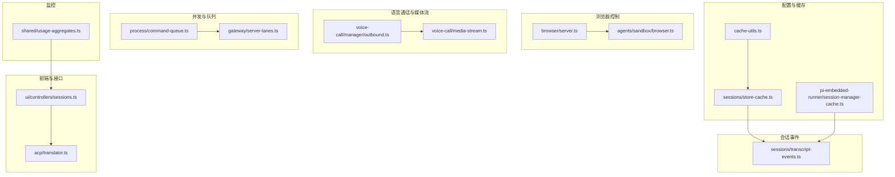
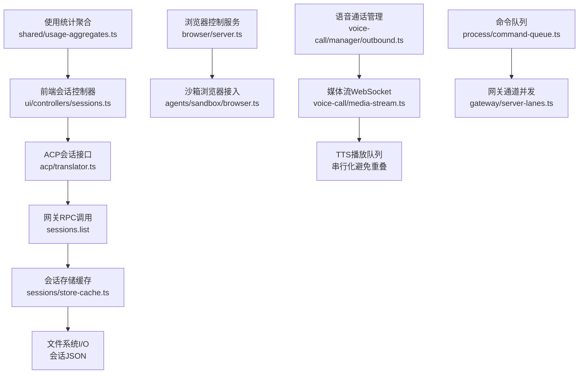
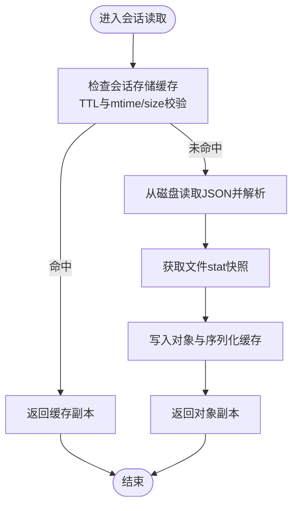
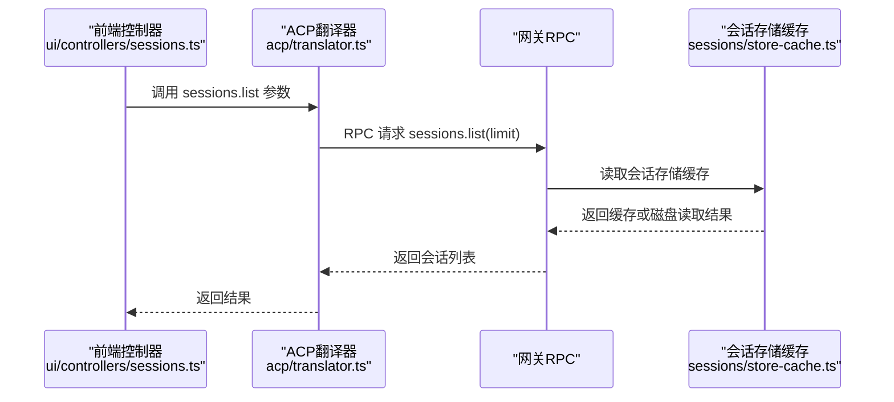
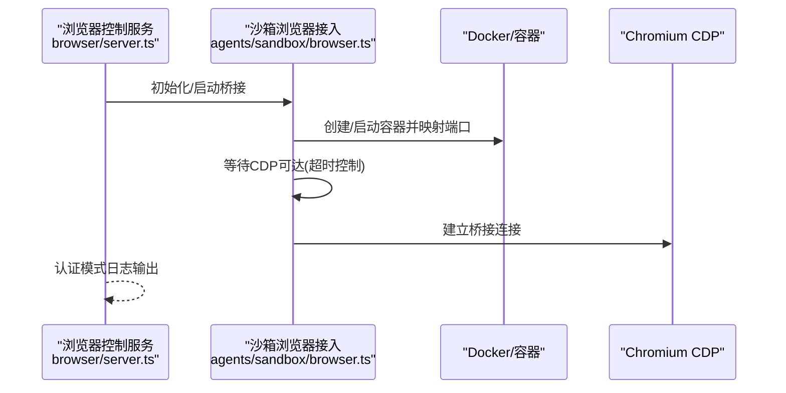
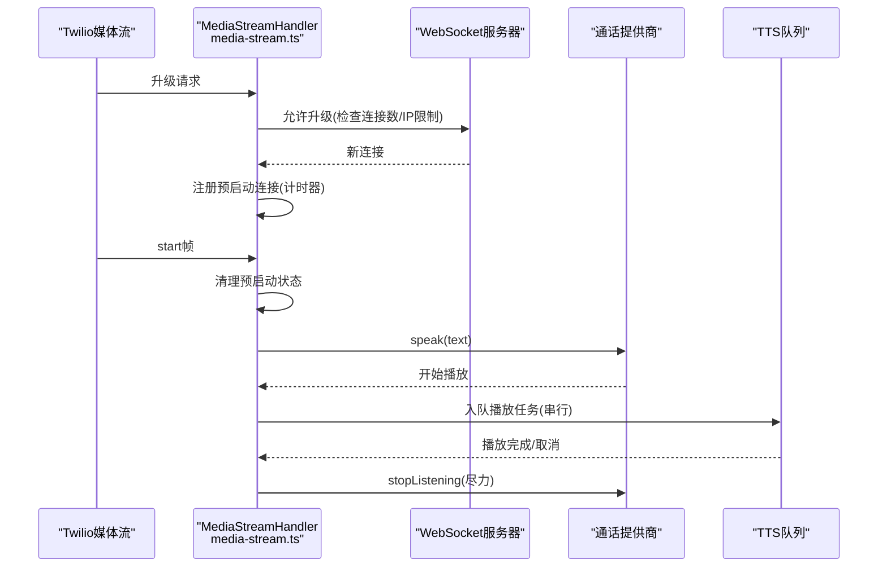
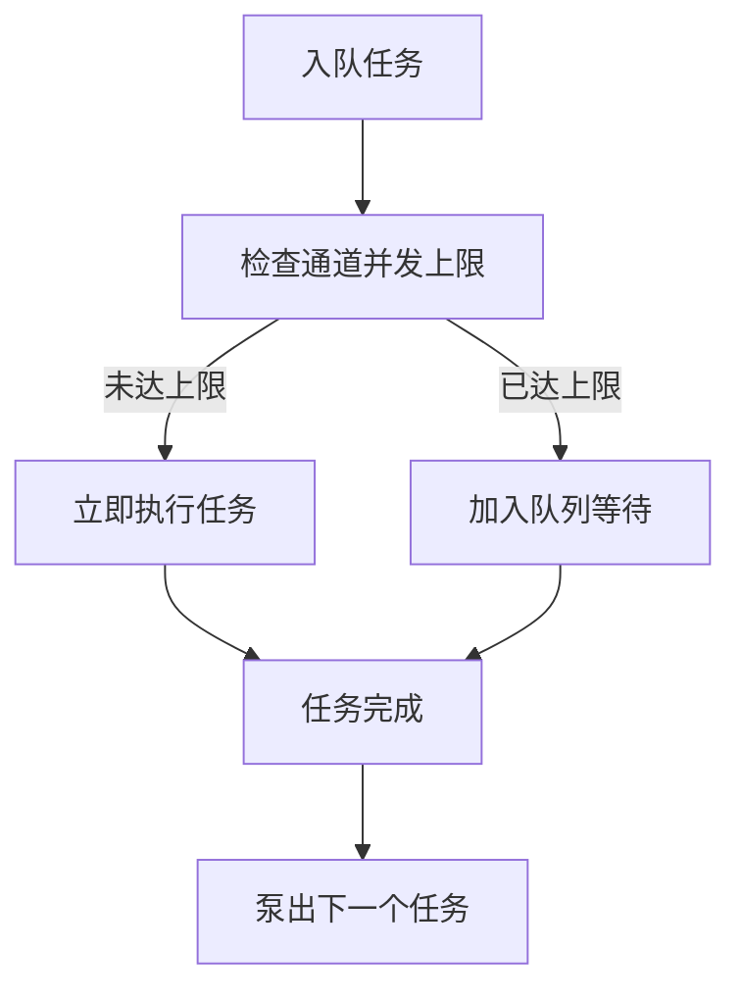
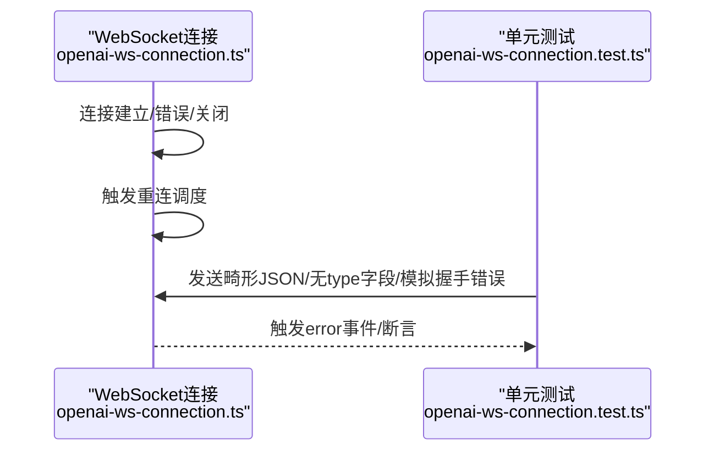
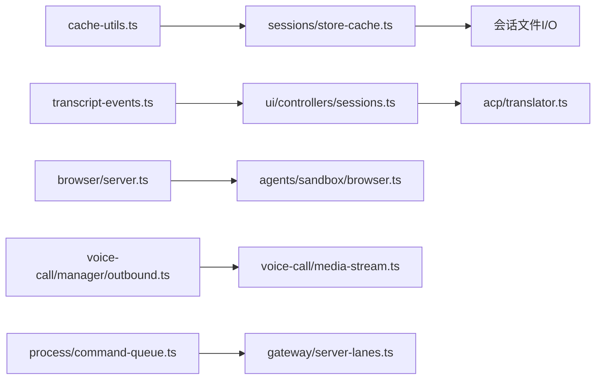

# I/O优化

<cite>
**本文引用的文件**
- [src/config/cache-utils.ts](file://src/config/cache-utils.ts)
- [src/config/sessions/store-cache.ts](file://src/config/sessions/store-cache.ts)
- [src/agents/pi-embedded-runner/session-manager-cache.ts](file://src/agents/pi-embedded-runner/session-manager-cache.ts)
- [src/sessions/transcript-events.ts](file://src/sessions/transcript-events.ts)
- [src/browser/server.ts](file://src/browser/server.ts)
- [src/agents/sandbox/browser.ts](file://src/agents/sandbox/browser.ts)
- [extensions/voice-call/src/manager/outbound.ts](file://extensions/voice-call/src/manager/outbound.ts)
- [extensions/voice-call/src/media-stream.ts](file://extensions/voice-call/src/media-stream.ts)
- [src/process/command-queue.ts](file://src/process/command-queue.ts)
- [src/gateway/server-lanes.ts](file://src/gateway/server-lanes.ts)
- [src/shared/usage-aggregates.ts](file://src/shared/usage-aggregates.ts)
- [src/agents/openai-ws-connection.ts](file://src/agents/openai-ws-connection.ts)
- [src/agents/openai-ws-connection.test.ts](file://src/agents/openai-ws-connection.test.ts)
- [ui/src/ui/controllers/sessions.ts](file://ui/src/ui/controllers/sessions.ts)
- [src/acp/translator.ts](file://src/acp/translator.ts)
</cite>

## 目录
1. [简介](#简介)
2. [项目结构](#项目结构)
3. [核心组件](#核心组件)
4. [架构总览](#架构总览)
5. [详细组件分析](#详细组件分析)
6. [依赖关系分析](#依赖关系分析)
7. [性能考量](#性能考量)
8. [故障排查指南](#故障排查指南)
9. [结论](#结论)
10. [附录](#附录)

## 简介
本文件面向OpenClaw的I/O优化，聚焦三类关键场景：文件系统I/O（会话存储与缓存）、网络通信（浏览器控制、语音通话媒体流、WebSocket连接）与媒体处理（TTS播放队列与并发控制）。文档系统性阐述缓存策略、批量与异步I/O、限流与背压、监控与延迟优化，并给出可落地的性能调优建议与排障路径。

## 项目结构
围绕I/O优化的关键目录与文件：
- 配置与缓存：cache-utils.ts、sessions/store-cache.ts、pi-embedded-runner/session-manager-cache.ts
- 会话事件：sessions/transcript-events.ts
- 浏览器控制与沙箱：browser/server.ts、agents/sandbox/browser.ts
- 语音通话与媒体流：voice-call/manager/outbound.ts、voice-call/media-stream.ts
- 并发与队列：process/command-queue.ts、gateway/server-lanes.ts
- 监控聚合：shared/usage-aggregates.ts
- WebSocket连接：agents/openai-ws-connection.ts 及其测试
- 前端会话列表：ui/controllers/sessions.ts
- ACP会话接口：acp/translator.ts

**图表来源**
- [src/config/cache-utils.ts](file://src/config/cache-utils.ts#L1-L37)
- [src/config/sessions/store-cache.ts](file://src/config/sessions/store-cache.ts#L1-L81)
- [src/agents/pi-embedded-runner/session-manager-cache.ts](file://src/agents/pi-embedded-runner/session-manager-cache.ts#L1-L54)
- [src/sessions/transcript-events.ts](file://src/sessions/transcript-events.ts#L1-L29)
- [src/browser/server.ts](file://src/browser/server.ts#L64-L121)
- [src/agents/sandbox/browser.ts](file://src/agents/sandbox/browser.ts#L1-L402)
- [extensions/voice-call/src/manager/outbound.ts](file://extensions/voice-call/src/manager/outbound.ts#L1-L381)
- [extensions/voice-call/src/media-stream.ts](file://extensions/voice-call/src/media-stream.ts#L56-L306)
- [src/process/command-queue.ts](file://src/process/command-queue.ts#L92-L228)
- [src/gateway/server-lanes.ts](file://src/gateway/server-lanes.ts#L1-L10)
- [src/shared/usage-aggregates.ts](file://src/shared/usage-aggregates.ts#L1-L66)
- [ui/src/ui/controllers/sessions.ts](file://ui/src/ui/controllers/sessions.ts#L1-L58)
- [src/acp/translator.ts](file://src/acp/translator.ts#L192-L234)

**章节来源**
- [src/config/cache-utils.ts](file://src/config/cache-utils.ts#L1-L37)
- [src/config/sessions/store-cache.ts](file://src/config/sessions/store-cache.ts#L1-L81)
- [src/agents/pi-embedded-runner/session-manager-cache.ts](file://src/agents/pi-embedded-runner/session-manager-cache.ts#L1-L54)
- [src/sessions/transcript-events.ts](file://src/sessions/transcript-events.ts#L1-L29)
- [src/browser/server.ts](file://src/browser/server.ts#L64-L121)
- [src/agents/sandbox/browser.ts](file://src/agents/sandbox/browser.ts#L1-L402)
- [extensions/voice-call/src/manager/outbound.ts](file://extensions/voice-call/src/manager/outbound.ts#L1-L381)
- [extensions/voice-call/src/media-stream.ts](file://extensions/voice-call/src/media-stream.ts#L56-L306)
- [src/process/command-queue.ts](file://src/process/command-queue.ts#L92-L228)
- [src/gateway/server-lanes.ts](file://src/gateway/server-lanes.ts#L1-L10)
- [src/shared/usage-aggregates.ts](file://src/shared/usage-aggregates.ts#L1-L66)
- [ui/src/ui/controllers/sessions.ts](file://ui/src/ui/controllers/sessions.ts#L1-L58)
- [src/acp/translator.ts](file://src/acp/translator.ts#L192-L234)

## 核心组件
- 文件系统I/O与缓存
  - 通用缓存工具：解析TTL、启用开关、文件stat快照
  - 会话存储缓存：基于内存的结构化克隆缓存，结合mtime/size校验
  - 会话管理器缓存：按会话文件的TTL缓存，预热与命中判定
- 网络通信
  - 浏览器控制服务：本地回环监听、扩展中继、安全认证模式
  - 沙箱浏览器：容器内Chromium CDP接入、端口映射、NoVNC令牌
  - 语音通话媒体流：WebSocket升级、预启动超时、连接数与IP限流、TTS串行队列
  - WebSocket连接：错误事件、重连调度、消息解析
- 媒体处理
  - TTS播放队列：每流串行播放，避免音频重叠；支持取消与清理
- 并发与队列
  - 命令队列：按通道限制并发、排队与告警、任务完成回调
  - 网关通道并发：根据配置设置不同命令通道的最大并发

**章节来源**
- [src/config/cache-utils.ts](file://src/config/cache-utils.ts#L1-L37)
- [src/config/sessions/store-cache.ts](file://src/config/sessions/store-cache.ts#L1-L81)
- [src/agents/pi-embedded-runner/session-manager-cache.ts](file://src/agents/pi-embedded-runner/session-manager-cache.ts#L1-L54)
- [src/browser/server.ts](file://src/browser/server.ts#L64-L121)
- [src/agents/sandbox/browser.ts](file://src/agents/sandbox/browser.ts#L1-L402)
- [extensions/voice-call/src/media-stream.ts](file://extensions/voice-call/src/media-stream.ts#L56-L306)
- [extensions/voice-call/src/manager/outbound.ts](file://extensions/voice-call/src/manager/outbound.ts#L198-L343)
- [src/process/command-queue.ts](file://src/process/command-queue.ts#L92-L228)
- [src/gateway/server-lanes.ts](file://src/gateway/server-lanes.ts#L1-L10)

## 架构总览
下图展示I/O优化相关模块在系统中的交互关系与数据流向。

**图表来源**
- [ui/src/ui/controllers/sessions.ts](file://ui/src/ui/controllers/sessions.ts#L17-L58)
- [src/acp/translator.ts](file://src/acp/translator.ts#L192-L234)
- [src/config/sessions/store-cache.ts](file://src/config/sessions/store-cache.ts#L41-L81)
- [src/browser/server.ts](file://src/browser/server.ts#L64-L121)
- [src/agents/sandbox/browser.ts](file://src/agents/sandbox/browser.ts#L327-L401)
- [extensions/voice-call/src/manager/outbound.ts](file://extensions/voice-call/src/manager/outbound.ts#L105-L196)
- [extensions/voice-call/src/media-stream.ts](file://extensions/voice-call/src/media-stream.ts#L76-L122)
- [src/process/command-queue.ts](file://src/process/command-queue.ts#L92-L123)
- [src/gateway/server-lanes.ts](file://src/gateway/server-lanes.ts#L6-L10)
- [src/shared/usage-aggregates.ts](file://src/shared/usage-aggregates.ts#L32-L66)

## 详细组件分析

### 文件系统I/O与缓存
- 通用缓存工具
  - 解析TTL与启用开关，避免无效或负值配置导致的异常行为
  - 提供文件stat快照，用于后续缓存一致性校验
- 会话存储缓存
  - 内存缓存条目包含对象副本、加载时间、mtime与size，以及序列化版本
  - 读取时先检查TTL与元信息变化，未过期且一致则直接返回缓存副本
  - 写入时同步更新对象缓存与序列化缓存，避免重复序列化开销
- 会话管理器缓存
  - 以会话文件为键，记录访问时间，按TTL判断是否缓存
  - 支持预热，减少首次访问的磁盘IO与解析成本

**图表来源**
- [src/config/sessions/store-cache.ts](file://src/config/sessions/store-cache.ts#L41-L81)
- [src/config/cache-utils.ts](file://src/config/cache-utils.ts#L21-L36)

**章节来源**
- [src/config/cache-utils.ts](file://src/config/cache-utils.ts#L1-L37)
- [src/config/sessions/store-cache.ts](file://src/config/sessions/store-cache.ts#L1-L81)
- [src/agents/pi-embedded-runner/session-manager-cache.ts](file://src/agents/pi-embedded-runner/session-manager-cache.ts#L1-L54)

### 会话文件读写与事件通知
- 会话转录更新事件
  - 维护监听者集合，发出更新事件时忽略空字符串
  - 事件广播对异常进行隔离，避免单个监听者失败影响整体
- 与前端的协作
  - 前端通过RPC请求列出会话，后端经缓存层读取并返回
  - ACP翻译器将请求转发到网关，再由网关调用sessions.list

**图表来源**
- [ui/src/ui/controllers/sessions.ts](file://ui/src/ui/controllers/sessions.ts#L17-L58)
- [src/acp/translator.ts](file://src/acp/translator.ts#L192-L234)
- [src/config/sessions/store-cache.ts](file://src/config/sessions/store-cache.ts#L41-L81)

**章节来源**
- [src/sessions/transcript-events.ts](file://src/sessions/transcript-events.ts#L1-L29)
- [ui/src/ui/controllers/sessions.ts](file://ui/src/ui/controllers/sessions.ts#L1-L58)
- [src/acp/translator.ts](file://src/acp/translator.ts#L192-L234)

### 浏览器控制与沙箱I/O
- 本地控制服务
  - 在127.0.0.1绑定端口，按认证模式（token/password/off）记录日志
  - 启动/停止时确保已知浏览器配置与Playwright连接关闭
- 沙箱浏览器
  - 容器内Chromium CDP端口映射与可达性探测
  - NoVNC密码生成与观察令牌签发，避免明文暴露
  - 配置哈希校验与“热窗口”复用策略，降低重建成本

**图表来源**
- [src/browser/server.ts](file://src/browser/server.ts#L64-L121)
- [src/agents/sandbox/browser.ts](file://src/agents/sandbox/browser.ts#L327-L401)

**章节来源**
- [src/browser/server.ts](file://src/browser/server.ts#L64-L121)
- [src/agents/sandbox/browser.ts](file://src/agents/sandbox/browser.ts#L1-L402)

### 语音通话媒体流与TTS优化
- 连接与安全
  - WebSocket升级前进行连接数与IP级挂起连接限制
  - 预启动超时（未发送start帧）主动关闭，防止资源泄漏
  - 达到最大连接上限时拒绝升级（503）
- 媒体流处理
  - 每流独立TTS队列，串行播放避免音频重叠
  - 支持AbortController取消当前播放，清理活跃控制器
- 通话生命周期
  - 发言、收听、等待最终转录、统计回合延迟与等待时间
  - 结束通话时清理定时器、转录等待器与活动状态

**图表来源**
- [extensions/voice-call/src/media-stream.ts](file://extensions/voice-call/src/media-stream.ts#L76-L122)
- [extensions/voice-call/src/media-stream.ts](file://extensions/voice-call/src/media-stream.ts#L280-L306)
- [extensions/voice-call/src/manager/outbound.ts](file://extensions/voice-call/src/manager/outbound.ts#L198-L343)

**章节来源**
- [extensions/voice-call/src/media-stream.ts](file://extensions/voice-call/src/media-stream.ts#L56-L306)
- [extensions/voice-call/src/manager/outbound.ts](file://extensions/voice-call/src/manager/outbound.ts#L1-L381)

### 并发与异步I/O最佳实践
- 命令队列与通道并发
  - 按命令通道（Main/Subagent/Cron等）设置最大并发
  - 排队时记录等待时长与队列长度，超过阈值触发告警
  - 任务完成后泵出下一个任务，保持高吞吐
- 网关通道并发
  - 依据配置动态设置不同命令通道并发度，避免阻塞

**图表来源**
- [src/process/command-queue.ts](file://src/process/command-queue.ts#L92-L123)
- [src/gateway/server-lanes.ts](file://src/gateway/server-lanes.ts#L6-L10)

**章节来源**
- [src/process/command-queue.ts](file://src/process/command-queue.ts#L92-L228)
- [src/gateway/server-lanes.ts](file://src/gateway/server-lanes.ts#L1-L10)

### 网络带宽与延迟监控
- 使用统计聚合
  - 合并每日/总体延迟指标，支持按日期分组与全局聚合
  - 便于生成延迟分布与性能趋势报告
- WebSocket连接健壮性
  - 错误事件与重连调度，保证消息可靠到达
  - 测试覆盖了错误消息、缺失字段、握手失败等边界情况

**图表来源**
- [src/agents/openai-ws-connection.ts](file://src/agents/openai-ws-connection.ts#L389-L428)
- [src/agents/openai-ws-connection.test.ts](file://src/agents/openai-ws-connection.test.ts#L564-L596)

**章节来源**
- [src/shared/usage-aggregates.ts](file://src/shared/usage-aggregates.ts#L1-L66)
- [src/agents/openai-ws-connection.ts](file://src/agents/openai-ws-connection.ts#L389-L428)
- [src/agents/openai-ws-connection.test.ts](file://src/agents/openai-ws-connection.test.ts#L564-L596)

## 依赖关系分析
- 缓存链路：cache-utils → sessions/store-cache → 会话文件I/O
- 事件链路：会话文件变更 → transcript事件 → 前端RPC刷新
- 控制链路：browser/server → agents/sandbox → Docker/CDP
- 媒体链路：voice-call/manager → media-stream → WebSocket/TTS
- 并发链路：process/command-queue → gateway/server-lanes

**图表来源**
- [src/config/cache-utils.ts](file://src/config/cache-utils.ts#L1-L37)
- [src/config/sessions/store-cache.ts](file://src/config/sessions/store-cache.ts#L1-L81)
- [src/sessions/transcript-events.ts](file://src/sessions/transcript-events.ts#L1-L29)
- [ui/src/ui/controllers/sessions.ts](file://ui/src/ui/controllers/sessions.ts#L1-L58)
- [src/acp/translator.ts](file://src/acp/translator.ts#L192-L234)
- [src/browser/server.ts](file://src/browser/server.ts#L64-L121)
- [src/agents/sandbox/browser.ts](file://src/agents/sandbox/browser.ts#L1-L402)
- [extensions/voice-call/src/manager/outbound.ts](file://extensions/voice-call/src/manager/outbound.ts#L1-L381)
- [extensions/voice-call/src/media-stream.ts](file://extensions/voice-call/src/media-stream.ts#L56-L306)
- [src/process/command-queue.ts](file://src/process/command-queue.ts#L92-L228)
- [src/gateway/server-lanes.ts](file://src/gateway/server-lanes.ts#L1-L10)

**章节来源**
- [src/config/cache-utils.ts](file://src/config/cache-utils.ts#L1-L37)
- [src/config/sessions/store-cache.ts](file://src/config/sessions/store-cache.ts#L1-L81)
- [src/sessions/transcript-events.ts](file://src/sessions/transcript-events.ts#L1-L29)
- [ui/src/ui/controllers/sessions.ts](file://ui/src/ui/controllers/sessions.ts#L1-L58)
- [src/acp/translator.ts](file://src/acp/translator.ts#L192-L234)
- [src/browser/server.ts](file://src/browser/server.ts#L64-L121)
- [src/agents/sandbox/browser.ts](file://src/agents/sandbox/browser.ts#L1-L402)
- [extensions/voice-call/src/manager/outbound.ts](file://extensions/voice-call/src/manager/outbound.ts#L1-L381)
- [extensions/voice-call/src/media-stream.ts](file://extensions/voice-call/src/media-stream.ts#L56-L306)
- [src/process/command-queue.ts](file://src/process/command-queue.ts#L92-L228)
- [src/gateway/server-lanes.ts](file://src/gateway/server-lanes.ts#L1-L10)

## 性能考量
- 磁盘I/O优化
  - 使用会话存储缓存与stat快照，减少重复读取与解析
  - 对象缓存采用结构化克隆，避免浅拷贝带来的副作用
  - 预热会话管理器缓存，降低首次访问延迟
- 网络带宽与延迟
  - WebSocket预启动超时与连接数/IP限流，防止拥塞与资源耗尽
  - TTS串行队列避免音频重叠，减少播放抖动
  - 命令队列通道并发与等待告警，平衡吞吐与延迟
- 媒体流处理
  - 每流独立TTS队列与活跃控制器，支持取消与清理
  - 通话回合统计（总时延、等待时延）用于性能评估与优化

[本节为通用指导，不直接分析具体文件]

## 故障排查指南
- 浏览器控制
  - 确认本地回环端口绑定成功与认证模式日志
  - 若Playwright连接异常，检查停止流程是否正确关闭
- 沙箱浏览器
  - CDP可达性探测失败时，检查端口映射与容器运行状态
  - 配置哈希不匹配时，确认是否处于“热窗口”，必要时重建容器
- 媒体流
  - 预启动超时被触发，检查客户端是否及时发送start帧
  - 连接数/IP限流导致拒绝，调整配置参数或限流阈值
- WebSocket
  - 错误事件与断开重连：查看错误消息与重连调度逻辑
  - 单元测试覆盖了多种异常路径，可参考断言定位问题

**章节来源**
- [src/browser/server.ts](file://src/browser/server.ts#L64-L121)
- [src/agents/sandbox/browser.ts](file://src/agents/sandbox/browser.ts#L327-L401)
- [extensions/voice-call/src/media-stream.ts](file://extensions/voice-call/src/media-stream.ts#L280-L306)
- [src/agents/openai-ws-connection.ts](file://src/agents/openai-ws-connection.ts#L389-L428)
- [src/agents/openai-ws-connection.test.ts](file://src/agents/openai-ws-connection.test.ts#L564-L596)

## 结论
通过在文件系统I/O、网络通信与媒体处理三个层面实施缓存、并发控制、限流与监控，OpenClaw实现了稳定且高效的I/O优化。建议在生产环境中：
- 启用并合理配置会话存储缓存与会话管理器缓存
- 为不同命令通道设置合适的并发上限，结合等待告警进行容量规划
- 对媒体流引入更细粒度的带宽与并发控制策略
- 持续收集延迟与吞吐指标，驱动迭代优化

[本节为总结，不直接分析具体文件]

## 附录
- 关键配置项与环境变量
  - 会话管理器缓存TTL：通过环境变量控制，避免无效值
  - 命令队列通道并发：依据配置动态设置
- 监控指标
  - 日常延迟聚合与总体延迟合并，支持按日期分组统计

**章节来源**
- [src/config/cache-utils.ts](file://src/config/cache-utils.ts#L3-L19)
- [src/gateway/server-lanes.ts](file://src/gateway/server-lanes.ts#L6-L10)
- [src/shared/usage-aggregates.ts](file://src/shared/usage-aggregates.ts#L32-L66)