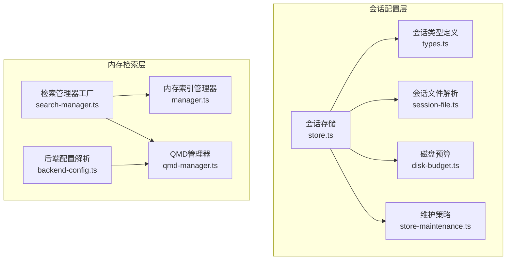
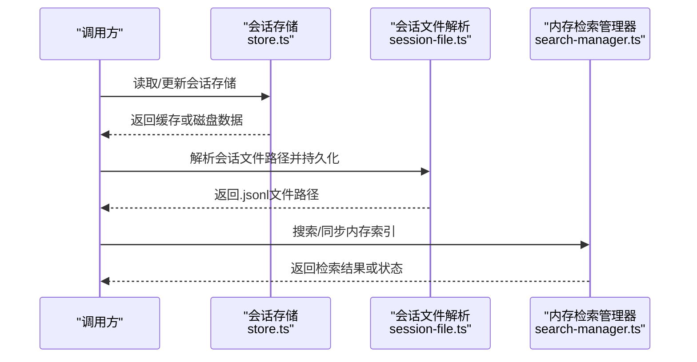
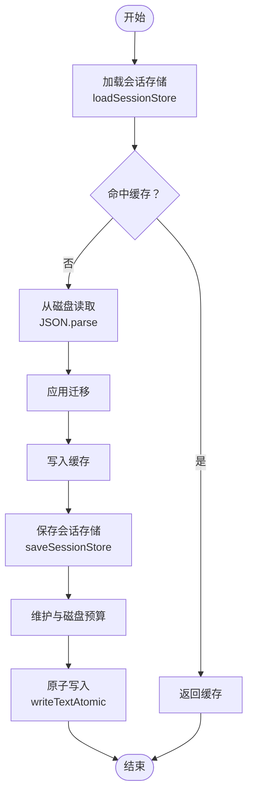
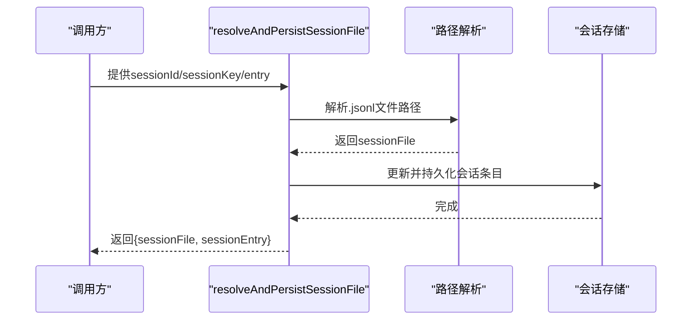
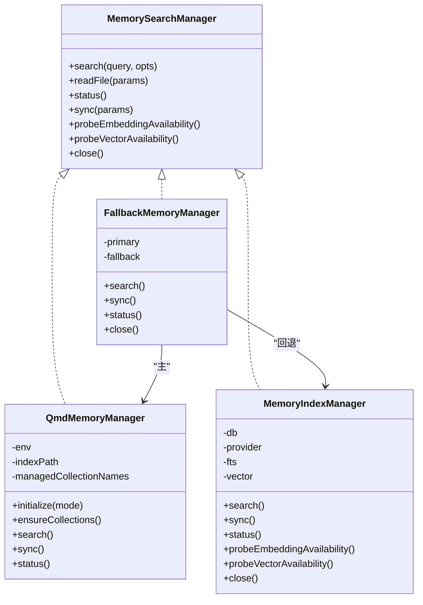
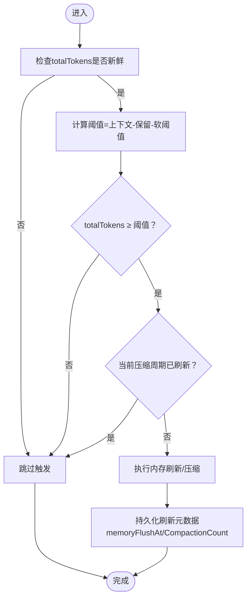
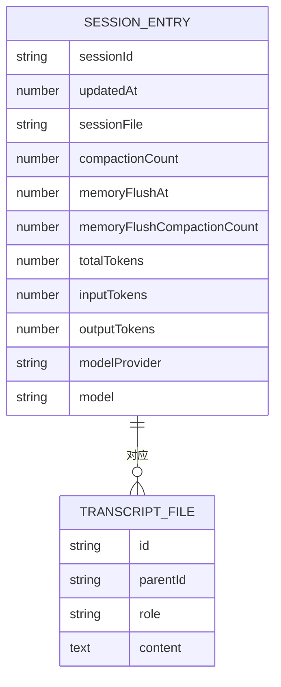
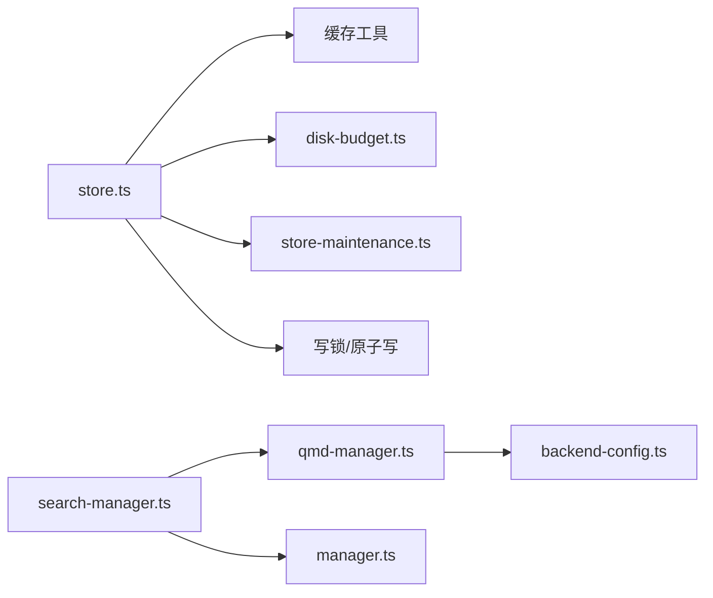

# 内存管理优化

<cite>
**本文档引用的文件**
- [src/config/sessions/store.ts](file://src/config/sessions/store.ts)
- [src/config/sessions/types.ts](file://src/config/sessions/types.ts)
- [src/config/sessions/session-file.ts](file://src/config/sessions/session-file.ts)
- [src/config/sessions/disk-budget.ts](file://src/config/sessions/disk-budget.ts)
- [src/config/sessions/store-maintenance.ts](file://src/config/sessions/store-maintenance.ts)
- [src/memory/index.ts](file://src/memory/index.ts)
- [src/memory/manager.ts](file://src/memory/manager.ts)
- [src/memory/search-manager.ts](file://src/memory/search-manager.ts)
- [src/memory/backend-config.ts](file://src/memory/backend-config.ts)
- [src/memory/qmd-manager.ts](file://src/memory/qmd-manager.ts)
- [src/auto-reply/reply/memory-flush.ts](file://src/auto-reply/reply/memory-flush.ts)
- [src/auto-reply/reply/agent-runner-memory.ts](file://src/auto-reply/reply/agent-runner-memory.ts)
- [src/agents/pi-embedded-runner/compaction-safety-timeout.ts](file://src/agents/pi-embedded-runner/compaction-safety-timeout.ts)
- [docs/reference/session-management-compaction.md](file://docs/reference/session-management-compaction.md)
</cite>

## 目录
1. [简介](#简介)
2. [项目结构](#项目结构)
3. [核心组件](#核心组件)
4. [架构总览](#架构总览)
5. [详细组件分析](#详细组件分析)
6. [依赖关系分析](#依赖关系分析)
7. [性能考量](#性能考量)
8. [故障排查指南](#故障排查指南)
9. [结论](#结论)
10. [附录](#附录)

## 简介
本文件面向OpenClaw的内存管理优化，系统性阐述会话存储机制、转录文件管理与内存压缩算法的工作原理。重点覆盖以下方面：
- sessions.json与.jsonl文件的存储结构、数据持久化策略与内存使用优化
- 自动压缩触发条件、手动压缩操作与预压缩内存刷新机制
- 内存泄漏防护、垃圾回收优化与内存池管理最佳实践
- 不同硬件配置下的内存调优策略与性能监控指标

## 项目结构
OpenClaw在“会话配置”和“内存检索”两大子系统中实现内存管理：
- 会话配置层：负责会话元数据的读写、缓存、维护与磁盘预算控制（sessions.json）
- 内存检索层：负责向量/关键词混合检索、索引构建与更新、缓存与回退策略（qmd/builtin）

**图表来源**
- [src/config/sessions/store.ts](file://src/config/sessions/store.ts#L1-L863)
- [src/config/sessions/types.ts](file://src/config/sessions/types.ts#L1-L376)
- [src/config/sessions/session-file.ts](file://src/config/sessions/session-file.ts#L1-L43)
- [src/config/sessions/disk-budget.ts](file://src/config/sessions/disk-budget.ts#L188-L225)
- [src/config/sessions/store-maintenance.ts](file://src/config/sessions/store-maintenance.ts#L38-L124)
- [src/memory/index.ts](file://src/memory/index.ts#L1-L8)
- [src/memory/manager.ts](file://src/memory/manager.ts#L1-L787)
- [src/memory/search-manager.ts](file://src/memory/search-manager.ts#L1-L237)
- [src/memory/backend-config.ts](file://src/memory/backend-config.ts#L1-L355)
- [src/memory/qmd-manager.ts](file://src/memory/qmd-manager.ts#L1-L800)

**章节来源**
- [src/config/sessions/store.ts](file://src/config/sessions/store.ts#L1-L863)
- [src/memory/index.ts](file://src/memory/index.ts#L1-L8)

## 核心组件
- 会话存储与缓存：提供带TTL的内存缓存、原子写入、并发锁队列、维护与磁盘预算控制
- 会话文件解析：根据会话键解析.jsonl文件路径，支持回退与持久化
- 内存检索管理器：内置索引与QMD双后端，支持混合检索、缓存、只读恢复与回退
- 内存压缩与刷新：基于token阈值与压缩计数的自动/手动触发，配合Pi嵌入式压缩安全超时

**章节来源**
- [src/config/sessions/store.ts](file://src/config/sessions/store.ts#L195-L270)
- [src/config/sessions/session-file.ts](file://src/config/sessions/session-file.ts#L1-L43)
- [src/memory/manager.ts](file://src/memory/manager.ts#L1-L787)
- [src/memory/search-manager.ts](file://src/memory/search-manager.ts#L1-L237)
- [src/auto-reply/reply/memory-flush.ts](file://src/auto-reply/reply/memory-flush.ts#L150-L183)
- [src/agents/pi-embedded-runner/compaction-safety-timeout.ts](file://src/agents/pi-embedded-runner/compaction-safety-timeout.ts#L1-L10)

## 架构总览
OpenClaw的内存管理由“会话配置层”和“内存检索层”协同完成：
- 会话配置层负责会话元数据的持久化与维护，确保磁盘空间与IO开销可控
- 内存检索层负责内容检索与索引，提供向量化与关键词混合检索，并在只读错误时进行连接重建与回退

**图表来源**
- [src/config/sessions/store.ts](file://src/config/sessions/store.ts#L195-L270)
- [src/config/sessions/session-file.ts](file://src/config/sessions/session-file.ts#L1-L43)
- [src/memory/search-manager.ts](file://src/memory/search-manager.ts#L25-L86)

## 详细组件分析

### 会话存储与缓存（sessions.json）
- 缓存策略：启用TTL的内存缓存，避免频繁磁盘IO；支持按mtime/size校验一致性
- 并发控制：基于会话文件路径的锁队列，保证同一store.json的串行写入
- 维护与磁盘预算：保存前执行过期清理、数量上限裁剪、归档清理、文件轮转与磁盘预算强制回收
- 原子写入：Windows平台采用重试策略，避免rename期间被读锁阻塞

**图表来源**
- [src/config/sessions/store.ts](file://src/config/sessions/store.ts#L195-L270)
- [src/config/sessions/store.ts](file://src/config/sessions/store.ts#L340-L524)
- [src/config/sessions/disk-budget.ts](file://src/config/sessions/disk-budget.ts#L188-L225)

**章节来源**
- [src/config/sessions/store.ts](file://src/config/sessions/store.ts#L195-L270)
- [src/config/sessions/store.ts](file://src/config/sessions/store.ts#L340-L524)
- [src/config/sessions/store.ts](file://src/config/sessions/store.ts#L577-L588)
- [src/config/sessions/disk-budget.ts](file://src/config/sessions/disk-budget.ts#L188-L225)

### 会话文件解析与.jsonl管理
- 解析逻辑：根据sessionId与会话条目中的可选字段决定最终.jsonl文件名与路径
- 持久化：当解析到的新路径与旧路径不一致时，更新会话条目并异步写回store.json
- 文件发现：在会话目录中查找最近主题变体、规范名称与重置后缀等文件

**图表来源**
- [src/config/sessions/session-file.ts](file://src/config/sessions/session-file.ts#L1-L43)

**章节来源**
- [src/config/sessions/session-file.ts](file://src/config/sessions/session-file.ts#L1-L43)

### 内存检索与索引管理（QMD/Builtin）
- 后端选择：优先QMD，失败则回退至内置索引管理器
- 混合检索：向量检索与关键词检索融合，支持BM25归一化与时间衰减
- 只读恢复：检测SQLite只读错误时重建连接并重试
- 缓存与回退：提供缓存统计与回退信息，便于诊断

**图表来源**
- [src/memory/search-manager.ts](file://src/memory/search-manager.ts#L88-L237)
- [src/memory/qmd-manager.ts](file://src/memory/qmd-manager.ts#L174-L281)
- [src/memory/manager.ts](file://src/memory/manager.ts#L45-L222)

**章节来源**
- [src/memory/search-manager.ts](file://src/memory/search-manager.ts#L1-L237)
- [src/memory/qmd-manager.ts](file://src/memory/qmd-manager.ts#L1-L800)
- [src/memory/manager.ts](file://src/memory/manager.ts#L1-L787)

### 内存压缩与刷新机制
- 触发条件：基于上下文窗口、保留token与软阈值计算触发点；若当前压缩周期已刷新则跳过
- 预压缩刷新：在一次压缩完成后记录memoryFlushAt与memoryFlushCompactionCount，避免重复触发
- 安全超时：Pi嵌入式压缩增加安全超时保护，防止长时间占用

**图表来源**
- [src/auto-reply/reply/memory-flush.ts](file://src/auto-reply/reply/memory-flush.ts#L150-L183)
- [src/auto-reply/reply/agent-runner-memory.ts](file://src/auto-reply/reply/agent-runner-memory.ts#L521-L557)
- [src/agents/pi-embedded-runner/compaction-safety-timeout.ts](file://src/agents/pi-embedded-runner/compaction-safety-timeout.ts#L1-L10)

**章节来源**
- [src/auto-reply/reply/memory-flush.ts](file://src/auto-reply/reply/memory-flush.ts#L150-L183)
- [src/auto-reply/reply/agent-runner-memory.ts](file://src/auto-reply/reply/agent-runner-memory.ts#L521-L557)
- [src/agents/pi-embedded-runner/compaction-safety-timeout.ts](file://src/agents/pi-embedded-runner/compaction-safety-timeout.ts#L1-L10)

### 会话存储结构与转录文件格式
- sessions.json：以字符串键映射到SessionEntry，包含会话标识、更新时间、模型计数、压缩计数、刷新元数据等
- .jsonl转录文件：首行为会话头，后续为消息条目，形成树形父子关系

**图表来源**
- [src/config/sessions/types.ts](file://src/config/sessions/types.ts#L68-L167)
- [docs/reference/session-management-compaction.md](file://docs/reference/session-management-compaction.md#L141-L170)

**章节来源**
- [src/config/sessions/types.ts](file://src/config/sessions/types.ts#L68-L167)
- [docs/reference/session-management-compaction.md](file://docs/reference/session-management-compaction.md#L141-L170)

## 依赖关系分析
- 会话存储依赖：缓存工具、磁盘预算、维护策略、写锁与原子写
- 内存检索依赖：后端配置解析、QMD命令行、SQLite、嵌入提供者
- 回退链路：QMD失败→内置索引管理器；内置失败→返回错误

**图表来源**
- [src/config/sessions/store.ts](file://src/config/sessions/store.ts#L1-L863)
- [src/memory/search-manager.ts](file://src/memory/search-manager.ts#L1-L237)
- [src/memory/qmd-manager.ts](file://src/memory/qmd-manager.ts#L1-L800)
- [src/memory/backend-config.ts](file://src/memory/backend-config.ts#L1-L355)

**章节来源**
- [src/config/sessions/store.ts](file://src/config/sessions/store.ts#L1-L863)
- [src/memory/search-manager.ts](file://src/memory/search-manager.ts#L1-L237)

## 性能考量
- 缓存与TTL：通过合理的TTL与一致性校验降低磁盘IO，建议在高并发场景下适当缩短TTL以平衡一致性
- 并发写入：锁队列避免竞态，但可能成为瓶颈；建议对批量写入合并与去抖
- 磁盘预算：设置合理上限与高水位线，结合归档清理与文件轮转，避免磁盘膨胀
- 检索性能：QMD与内置索引的混合模式需权衡召回与延迟；在CPU受限设备上优先“search”模式
- 只读恢复：SQLite只读错误的自动重建提升稳定性，但会带来额外开销，应监控并优化索引大小

[本节为通用指导，无需具体文件引用]

## 故障排查指南
- 会话存储读取异常：检查缓存一致性、Windows临时文件写入问题与空文件重试
- 磁盘预算超限：确认高水位线与清理策略是否生效，必要时手动触发维护
- QMD更新失败：关注空字节集合元数据与重复文档约束错误，按提示重建受管集合
- 只读数据库：监控readonlyRecovery统计，必要时调整索引大小与存储位置
- 压缩未触发：核对totalTokens新鲜度、压缩计数与阈值参数

**章节来源**
- [src/config/sessions/store.ts](file://src/config/sessions/store.ts#L213-L270)
- [src/config/sessions/disk-budget.ts](file://src/config/sessions/disk-budget.ts#L188-L225)
- [src/memory/qmd-manager.ts](file://src/memory/qmd-manager.ts#L700-L772)
- [src/memory/manager.ts](file://src/memory/manager.ts#L452-L535)
- [src/auto-reply/reply/memory-flush.ts](file://src/auto-reply/reply/memory-flush.ts#L150-L183)

## 结论
OpenClaw通过“会话配置层”的缓存、锁与磁盘预算，以及“内存检索层”的混合检索与回退机制，实现了稳定且高效的内存管理。结合自动/手动压缩与预刷新策略，可在不同硬件环境下保持良好的响应与资源占用。建议在生产环境中：
- 调整缓存TTL与磁盘预算参数，匹配实际负载
- 在CPU受限设备上优化QMD检索模式
- 监控只读恢复与QMD修复事件，及时优化索引与集合配置
- 使用Pi压缩安全超时保障长任务稳定性

[本节为总结，无需具体文件引用]

## 附录

### 最佳实践清单
- 内存泄漏防护
  - 使用回退管理器与连接重建，避免长期持有失效句柄
  - 对大查询结果进行分页与最小化返回字段
- 垃圾回收优化
  - 合理设置QMD集合与会话导出保留期，定期清理无用文件
  - 控制向量维度与批处理并发，减少峰值内存占用
- 内存池管理
  - 将热点会话与索引置于SSD，冷数据迁移至HDD
  - 对频繁访问的会话条目启用缓存，避免重复解析.jsonl

[本节为通用指导，无需具体文件引用]