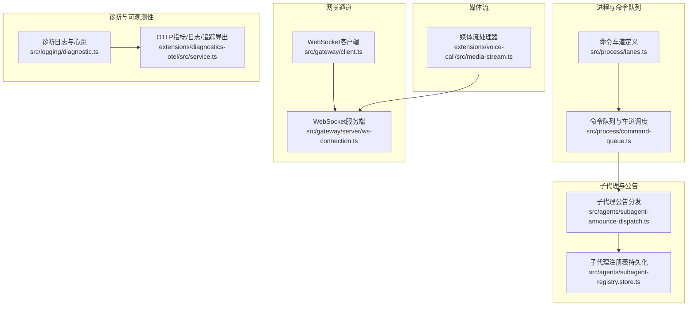
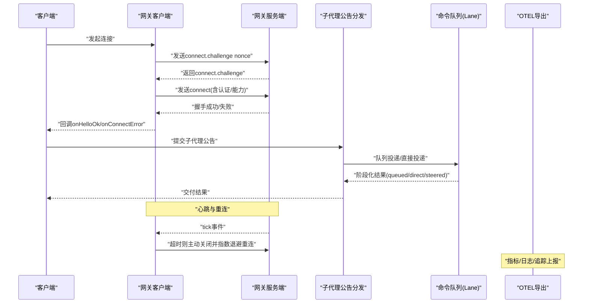
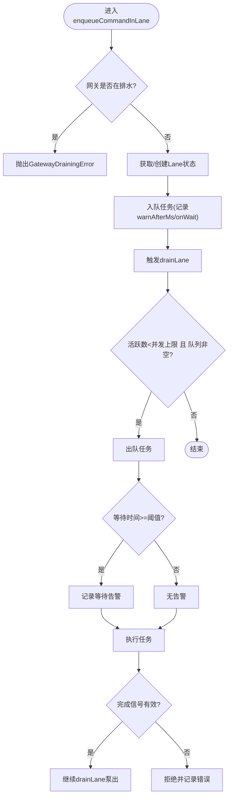
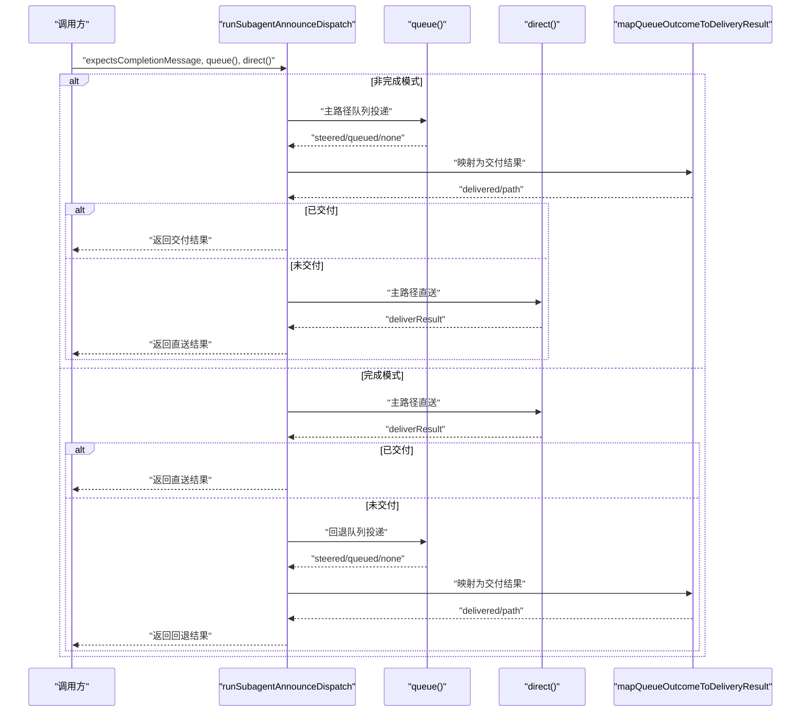
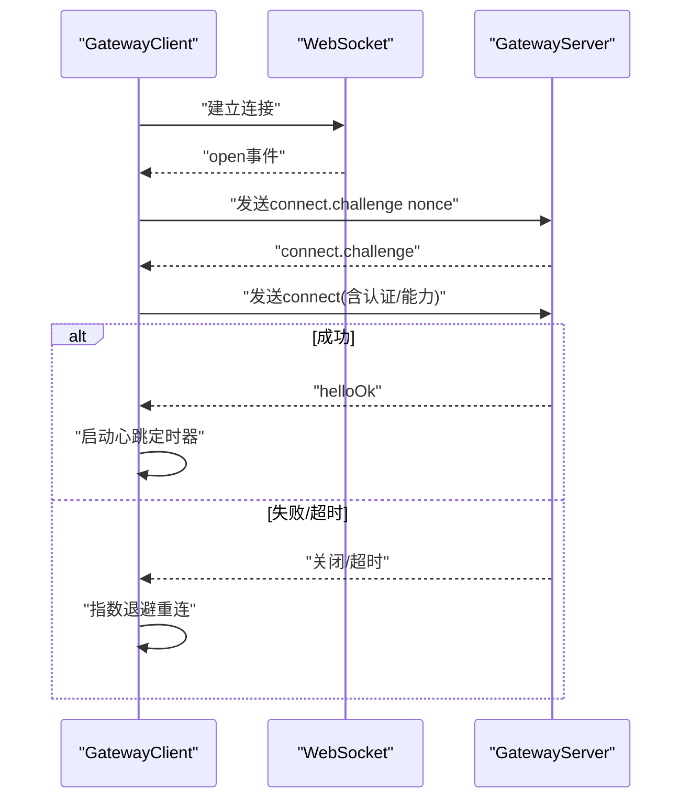
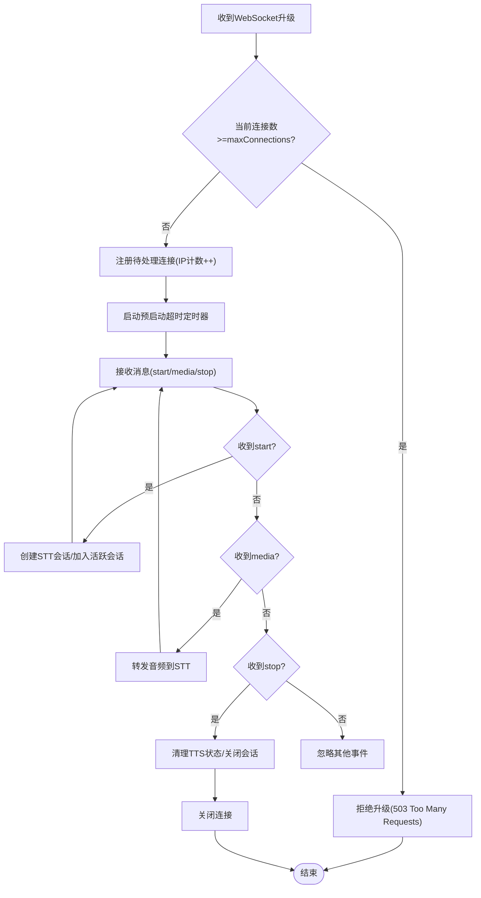
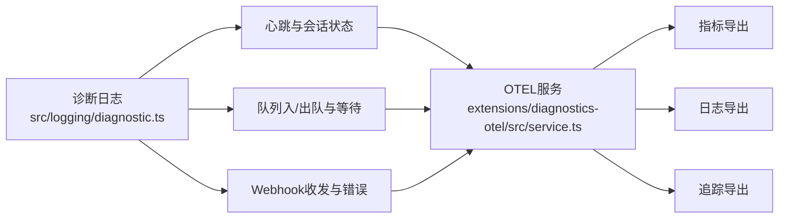
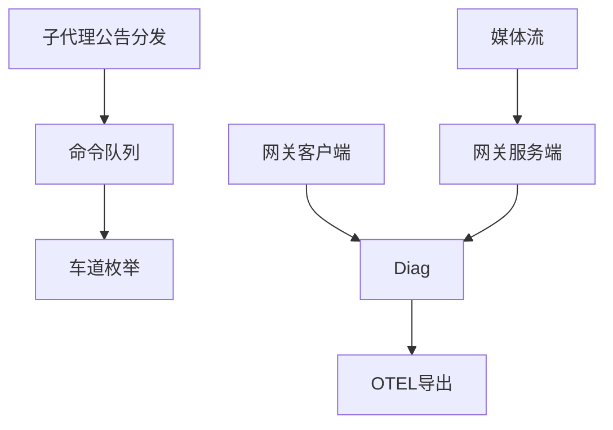

# 并发处理优化

<cite>
**本文引用的文件**
- [src/process/command-queue.ts](file://src/process/command-queue.ts)
- [src/process/lanes.ts](file://src/process/lanes.ts)
- [src/agents/subagent-announce-dispatch.ts](file://src/agents/subagent-announce-dispatch.ts)
- [src/agents/subagent-registry.store.ts](file://src/agents/subagent-registry.store.ts)
- [src/gateway/client.ts](file://src/gateway/client.ts)
- [src/gateway/server/ws-connection.ts](file://src/gateway/server/ws-connection.ts)
- [extensions/voice-call/src/media-stream.ts](file://extensions/voice-call/src/media-stream.ts)
- [apps/macos/Tests/OpenClawIPCTests/GatewayChannelConnectTests.swift](file://apps/macos/Tests/OpenClawIPCTests/GatewayChannelConnectTests.swift)
- [apps/macos/Tests/OpenClawIPCTests/GatewayChannelConfigureTests.swift](file://apps/macos/Tests/OpenClawIPCTests/GatewayChannelConfigureTests.swift)
- [apps/shared/OpenClawKit/Sources/OpenClawKit/GatewayChannel.swift](file://apps/shared/OpenClawKit/Sources/OpenClawKit/GatewayChannel.swift)
- [src/logging/diagnostic.ts](file://src/logging/diagnostic.ts)
- [extensions/diagnostics-otel/src/service.ts](file://extensions/diagnostics-otel/src/service.ts)
- [extensions/feishu/src/async.ts](file://extensions/feishu/src/async.ts)
- [scripts/test-parallel.mjs](file://scripts/test-parallel.mjs)
</cite>

## 目录
1. [引言](#引言)
2. [项目结构](#项目结构)
3. [核心组件](#核心组件)
4. [架构总览](#架构总览)
5. [详细组件分析](#详细组件分析)
6. [依赖关系分析](#依赖关系分析)
7. [性能考量](#性能考量)
8. [故障排查指南](#故障排查指南)
9. [结论](#结论)
10. [附录](#附录)

## 引言
本技术指南聚焦于OpenClaw在多代理并发调度、任务队列管理与资源分配方面的实现与优化策略，覆盖子代理注册表、通道管理与并行处理机制，以及WebSocket连接池、HTTP请求并发控制与异步任务调度的最佳实践。文档同时提供高并发场景下的性能调优建议、死锁预防与资源竞争规避策略，并给出并发监控指标、性能瓶颈识别与负载均衡优化技术。

## 项目结构
OpenClaw采用模块化分层设计，关键并发相关能力分布在以下模块：
- 进程与命令队列：基于“车道”（Lane）的任务串行化与并发控制
- 子代理与公告分发：面向子代理生命周期的调度与回退路径
- 网关通道：WebSocket客户端与服务端握手、心跳与重连机制
- 媒体流：语音通话中的WebSocket连接池与TTS播放队列
- 诊断与可观测性：日志、指标与链路追踪的统一采集与导出

**图表来源**
- [src/process/lanes.ts](file://src/process/lanes.ts#L1-L7)
- [src/process/command-queue.ts](file://src/process/command-queue.ts#L1-L325)
- [src/agents/subagent-announce-dispatch.ts](file://src/agents/subagent-announce-dispatch.ts#L1-L105)
- [src/agents/subagent-registry.store.ts](file://src/agents/subagent-registry.store.ts#L1-L132)
- [src/gateway/client.ts](file://src/gateway/client.ts#L1-L528)
- [src/gateway/server/ws-connection.ts](file://src/gateway/server/ws-connection.ts#L1-L319)
- [extensions/voice-call/src/media-stream.ts](file://extensions/voice-call/src/media-stream.ts#L1-L528)
- [src/logging/diagnostic.ts](file://src/logging/diagnostic.ts#L1-L434)
- [extensions/diagnostics-otel/src/service.ts](file://extensions/diagnostics-otel/src/service.ts#L1-L686)

**章节来源**
- [src/process/lanes.ts](file://src/process/lanes.ts#L1-L7)
- [src/process/command-queue.ts](file://src/process/command-queue.ts#L1-L325)
- [src/agents/subagent-announce-dispatch.ts](file://src/agents/subagent-announce-dispatch.ts#L1-L105)
- [src/agents/subagent-registry.store.ts](file://src/agents/subagent-registry.store.ts#L1-L132)
- [src/gateway/client.ts](file://src/gateway/client.ts#L1-L528)
- [src/gateway/server/ws-connection.ts](file://src/gateway/server/ws-connection.ts#L1-L319)
- [extensions/voice-call/src/media-stream.ts](file://extensions/voice-call/src/media-stream.ts#L1-L528)
- [src/logging/diagnostic.ts](file://src/logging/diagnostic.ts#L1-L434)
- [extensions/diagnostics-otel/src/service.ts](file://extensions/diagnostics-otel/src/service.ts#L1-L686)

## 核心组件
- 命令队列与车道（Lane）：通过Map维护每个Lane的状态，支持最大并发数、排队长度、生成代数（generation）以避免重启后旧任务完成信号干扰，提供清空车道、重置所有Lane、等待活动任务完成等运维能力。
- 子代理公告分发：根据是否期望完成消息，优先尝试队列投递或直接投递，并提供阶段化结果记录，便于回溯与审计。
- 网关通道：客户端负责握手挑战、TLS指纹校验、重连指数退避、心跳检测；服务端负责握手超时、连接关闭原因记录、广播与节点解绑。
- 媒体流：WebSocket升级与预启动超时限制、按源IP的并发限制、TTS播放串行队列与中断能力。
- 诊断与可观测性：统一的诊断日志、心跳统计、OTLP指标/日志/追踪导出，覆盖消息队列深度、等待时间、会话卡顿、运行尝试次数等关键指标。

**章节来源**
- [src/process/command-queue.ts](file://src/process/command-queue.ts#L1-L325)
- [src/agents/subagent-announce-dispatch.ts](file://src/agents/subagent-announce-dispatch.ts#L1-L105)
- [src/gateway/client.ts](file://src/gateway/client.ts#L1-L528)
- [src/gateway/server/ws-connection.ts](file://src/gateway/server/ws-connection.ts#L1-L319)
- [extensions/voice-call/src/media-stream.ts](file://extensions/voice-call/src/media-stream.ts#L1-L528)
- [src/logging/diagnostic.ts](file://src/logging/diagnostic.ts#L1-L434)
- [extensions/diagnostics-otel/src/service.ts](file://extensions/diagnostics-otel/src/service.ts#L1-L686)

## 架构总览
OpenClaw的并发架构以“车道”为单位进行任务调度，结合子代理公告分发与网关通道的握手/心跳/重连机制，形成从入口到执行再到观测的闭环。媒体流作为高并发实时场景的典型代表，提供了连接池与播放队列的并发控制范式。

**图表来源**
- [src/gateway/client.ts](file://src/gateway/client.ts#L356-L472)
- [src/gateway/server/ws-connection.ts](file://src/gateway/server/ws-connection.ts#L174-L196)
- [src/agents/subagent-announce-dispatch.ts](file://src/agents/subagent-announce-dispatch.ts#L42-L104)
- [src/process/command-queue.ts](file://src/process/command-queue.ts#L161-L197)
- [extensions/diagnostics-otel/src/service.ts](file://extensions/diagnostics-otel/src/service.ts#L200-L242)

## 详细组件分析

### 组件A：命令队列与车道（Lane）调度
- 设计要点
  - 每个Lane维护队列、活跃任务集合、最大并发、排水标记与生成代数。
  - drainLane循环泵出任务，严格控制活跃任务数量不超过maxConcurrent。
  - 支持设置并发度、清空车道、重置所有Lane、等待活动任务完成。
  - 提供队列大小查询与全局统计，便于运维与容量规划。
- 并发与安全
  - 使用generation字段区分不同重启周期，避免旧完成信号影响新周期。
  - 清空车道时拒绝新任务，防止静默丢弃。
- 性能与可观测性
  - 记录入队/出队、等待时间、任务耗时，配合诊断日志与OTEL指标。

**图表来源**
- [src/process/command-queue.ts](file://src/process/command-queue.ts#L161-L197)
- [src/process/command-queue.ts](file://src/process/command-queue.ts#L80-L144)
- [src/process/command-queue.ts](file://src/process/command-queue.ts#L244-L259)

**章节来源**
- [src/process/command-queue.ts](file://src/process/command-queue.ts#L1-L325)
- [src/process/lanes.ts](file://src/process/lanes.ts#L1-L7)
- [src/logging/diagnostic.ts](file://src/logging/diagnostic.ts#L247-L266)
- [extensions/diagnostics-otel/src/service.ts](file://extensions/diagnostics-otel/src/service.ts#L210-L225)

### 组件B：子代理公告分发与注册表
- 分发策略
  - 非完成模式：优先队列投递，若未送达再走直送；记录阶段化结果。
  - 完成模式：先直送，若未送达再回退队列投递。
  - 支持AbortSignal短路，避免无效工作。
- 注册表持久化
  - 支持版本迁移（v1->v2），规范化请求者上下文，保证重启后恢复运行并触发公告流程。
- 并发与一致性
  - 通过阶段化结果与错误字段，便于审计与重试策略制定。

**图表来源**
- [src/agents/subagent-announce-dispatch.ts](file://src/agents/subagent-announce-dispatch.ts#L42-L104)

**章节来源**
- [src/agents/subagent-announce-dispatch.ts](file://src/agents/subagent-announce-dispatch.ts#L1-L105)
- [src/agents/subagent-registry.store.ts](file://src/agents/subagent-registry.store.ts#L48-L132)

### 组件C：网关通道（WebSocket）连接池与重连
- 客户端
  - 握手挑战与超时保护、TLS指纹校验、指数退避重连、心跳检测与静默断开处理。
  - 请求响应模型：请求帧校验、挂起队列、最终响应判定。
- 服务端
  - 握手超时、连接关闭原因记录、广播与节点解绑、Canvas Host解析。
- 并发与单飞（single-flight）
  - 单元测试验证并发连接共享一次握手、失败共享，避免重复握手与资源浪费。

**图表来源**
- [src/gateway/client.ts](file://src/gateway/client.ts#L356-L472)
- [src/gateway/server/ws-connection.ts](file://src/gateway/server/ws-connection.ts#L174-L196)

**章节来源**
- [src/gateway/client.ts](file://src/gateway/client.ts#L1-L528)
- [src/gateway/server/ws-connection.ts](file://src/gateway/server/ws-connection.ts#L1-L319)
- [apps/macos/Tests/OpenClawIPCTests/GatewayChannelConnectTests.swift](file://apps/macos/Tests/OpenClawIPCTests/GatewayChannelConnectTests.swift#L37-L74)
- [apps/macos/Tests/OpenClawIPCTests/GatewayChannelConfigureTests.swift](file://apps/macos/Tests/OpenClawIPCTests/GatewayChannelConfigureTests.swift#L59-L86)
- [apps/shared/OpenClawKit/Sources/OpenClawKit/GatewayChannel.swift](file://apps/shared/OpenClawKit/Sources/OpenClawKit/GatewayChannel.swift#L511-L541)

### 组件D：媒体流（WebSocket连接池与TTS队列）
- 连接池与限流
  - 升级前的预启动连接限制、按源IP的并发限制、总连接上限、超时拒绝。
- 播放队列与中断
  - 每条流的TTS播放串行队列，支持中断与清空，避免音频重叠。
- 并发控制
  - 通过Map维护会话、待处理连接、播放控制器，确保每条流的播放顺序与可中断性。

**图表来源**
- [extensions/voice-call/src/media-stream.ts](file://extensions/voice-call/src/media-stream.ts#L107-L183)
- [extensions/voice-call/src/media-stream.ts](file://extensions/voice-call/src/media-stream.ts#L280-L323)
- [extensions/voice-call/src/media-stream.ts](file://extensions/voice-call/src/media-stream.ts#L355-L420)

**章节来源**
- [extensions/voice-call/src/media-stream.ts](file://extensions/voice-call/src/media-stream.ts#L1-L528)

### 组件E：并发监控与可观测性
- 诊断日志
  - Webhook收发统计、消息队列深度、会话状态变化、卡顿检测、运行尝试次数、心跳统计。
- OTEL导出
  - 指标：令牌用量、成本、运行时长、上下文窗口、消息队列深度/等待、会话状态/卡顿、运行尝试。
  - 日志：敏感信息脱敏、结构化属性、位置信息。
  - 追踪：span按事件类型与持续时间记录，错误状态标注。

**图表来源**
- [src/logging/diagnostic.ts](file://src/logging/diagnostic.ts#L247-L282)
- [extensions/diagnostics-otel/src/service.ts](file://extensions/diagnostics-otel/src/service.ts#L167-L241)
- [extensions/diagnostics-otel/src/service.ts](file://extensions/diagnostics-otel/src/service.ts#L619-L658)

**章节来源**
- [src/logging/diagnostic.ts](file://src/logging/diagnostic.ts#L1-L434)
- [extensions/diagnostics-otel/src/service.ts](file://extensions/diagnostics-otel/src/service.ts#L1-L686)

## 依赖关系分析
- 组件耦合
  - 命令队列依赖车道枚举；子代理公告分发依赖队列结果映射；网关通道独立但与诊断日志/OTEL存在观测依赖。
- 外部依赖
  - ws用于WebSocket通信；@opentelemetry/*用于指标/日志/追踪导出；Node原生crypto用于随机数与TLS指纹。
- 潜在环路
  - 当前模块间为单向依赖，未见循环导入；诊断与OTEL通过事件订阅解耦。

**图表来源**
- [src/process/command-queue.ts](file://src/process/command-queue.ts#L1-L325)
- [src/process/lanes.ts](file://src/process/lanes.ts#L1-L7)
- [src/agents/subagent-announce-dispatch.ts](file://src/agents/subagent-announce-dispatch.ts#L1-L105)
- [src/gateway/client.ts](file://src/gateway/client.ts#L1-L528)
- [src/gateway/server/ws-connection.ts](file://src/gateway/server/ws-connection.ts#L1-L319)
- [extensions/voice-call/src/media-stream.ts](file://extensions/voice-call/src/media-stream.ts#L1-L528)
- [src/logging/diagnostic.ts](file://src/logging/diagnostic.ts#L1-L434)
- [extensions/diagnostics-otel/src/service.ts](file://extensions/diagnostics-otel/src/service.ts#L1-L686)

**章节来源**
- [src/process/command-queue.ts](file://src/process/command-queue.ts#L1-L325)
- [src/agents/subagent-announce-dispatch.ts](file://src/agents/subagent-announce-dispatch.ts#L1-L105)
- [src/gateway/client.ts](file://src/gateway/client.ts#L1-L528)
- [src/gateway/server/ws-connection.ts](file://src/gateway/server/ws-connection.ts#L1-L319)
- [extensions/voice-call/src/media-stream.ts](file://extensions/voice-call/src/media-stream.ts#L1-L528)
- [src/logging/diagnostic.ts](file://src/logging/diagnostic.ts#L1-L434)
- [extensions/diagnostics-otel/src/service.ts](file://extensions/diagnostics-otel/src/service.ts#L1-L686)

## 性能考量
- 并发度与队列深度
  - 使用setCommandLaneConcurrency调整各Lane并发度；结合getQueueSize/getTotalQueueSize进行容量评估。
- 资源竞争与死锁预防
  - 通过generation与activeTaskIds避免重启后遗留状态导致的永久阻塞；drainLane在finally中复位draining标志。
- 心跳与超时
  - 客户端心跳检测与握手超时，服务端握手超时，均避免僵尸连接占用资源。
- 实时流控
  - 媒体流预启动超时与连接上限、按源IP限流，防止突发流量击穿。
- 测试与负载感知
  - 测试脚本根据主机CPU负载动态调整并发工人数，避免极端压力下的抖动。

**章节来源**
- [src/process/command-queue.ts](file://src/process/command-queue.ts#L154-L159)
- [src/process/command-queue.ts](file://src/process/command-queue.ts#L244-L259)
- [src/gateway/client.ts](file://src/gateway/client.ts#L450-L472)
- [src/gateway/server/ws-connection.ts](file://src/gateway/server/ws-connection.ts#L267-L277)
- [extensions/voice-call/src/media-stream.ts](file://extensions/voice-call/src/media-stream.ts#L280-L323)
- [scripts/test-parallel.mjs](file://scripts/test-parallel.mjs#L243-L269)

## 故障排查指南
- 常见问题定位
  - 队列堆积：查看队列等待时间与深度指标，确认是否有任务长时间未完成。
  - 会话卡顿：诊断日志中的stuck session告警，结合OTEL会话卡顿年龄直方图定位。
  - 网关连接异常：检查握手超时、心跳超时、TLS指纹不匹配、重连退避。
  - 媒体会话异常：预启动超时、连接数上限、按源IP限流触发。
- 排障步骤
  - 启用诊断日志与OTEL导出，收集事件序列与指标。
  - 使用waitForActiveTasks等待活动任务完成，或clearCommandLane清空车道快速止损。
  - 在单元测试中复现并发连接共享与失败共享，验证单飞（single-flight）行为。

**章节来源**
- [src/logging/diagnostic.ts](file://src/logging/diagnostic.ts#L229-L245)
- [extensions/diagnostics-otel/src/service.ts](file://extensions/diagnostics-otel/src/service.ts#L589-L607)
- [src/gateway/client.ts](file://src/gateway/client.ts#L410-L448)
- [extensions/voice-call/src/media-stream.ts](file://extensions/voice-call/src/media-stream.ts#L325-L337)
- [apps/macos/Tests/OpenClawIPCTests/GatewayChannelConnectTests.swift](file://apps/macos/Tests/OpenClawIPCTests/GatewayChannelConnectTests.swift#L37-L74)
- [apps/macos/Tests/OpenClawIPCTests/GatewayChannelConfigureTests.swift](file://apps/macos/Tests/OpenClawIPCTests/GatewayChannelConfigureTests.swift#L59-L86)

## 结论
OpenClaw通过“车道”驱动的命令队列、子代理公告分发、网关通道的握手/心跳/重连机制，以及媒体流的连接池与播放队列，构建了高并发下的稳定执行与可观测体系。结合诊断日志与OTEL导出，能够有效识别瓶颈、定位卡顿并指导容量规划与负载均衡优化。建议在生产环境中合理设置Lane并发度、启用心跳与超时保护、实施连接池限流，并通过指标与日志持续监控系统健康。

## 附录
- 最佳实践清单
  - 使用Lane隔离高风险并行任务，避免主线程日志与stdin交错。
  - 为子代理公告提供回退路径（队列->直送），并记录阶段化结果。
  - 网关客户端启用TLS指纹校验与指数退避，服务端设置握手超时。
  - 媒体会话实施预启动超时与按源IP限流，播放队列串行化。
  - 开启诊断日志与OTEL导出，关注队列等待、会话卡顿与运行尝试次数。
  - 在极端负载下动态调整测试并发工人数，保障稳定性。