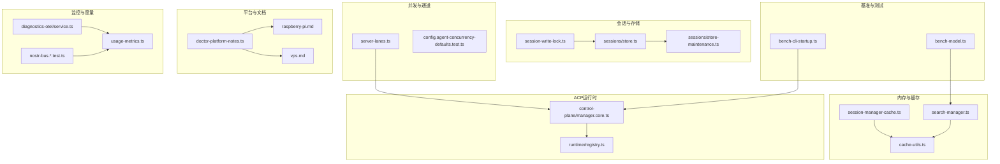
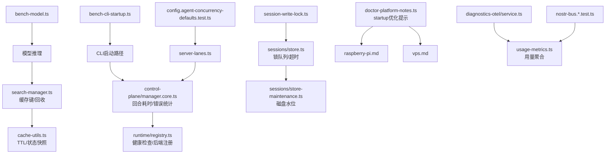
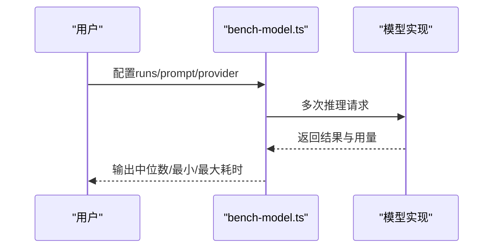
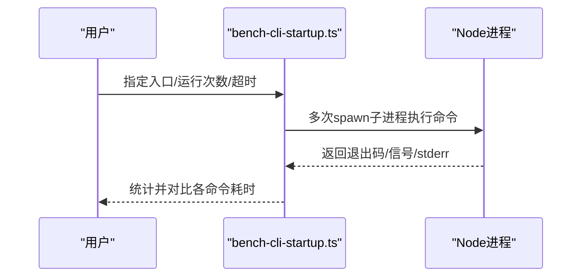
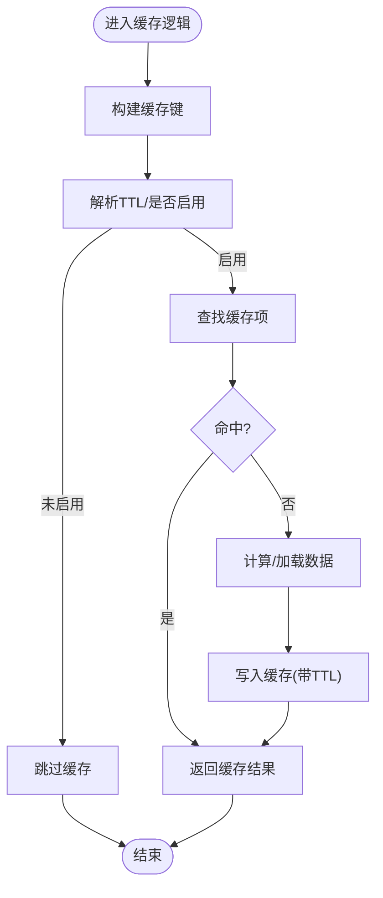
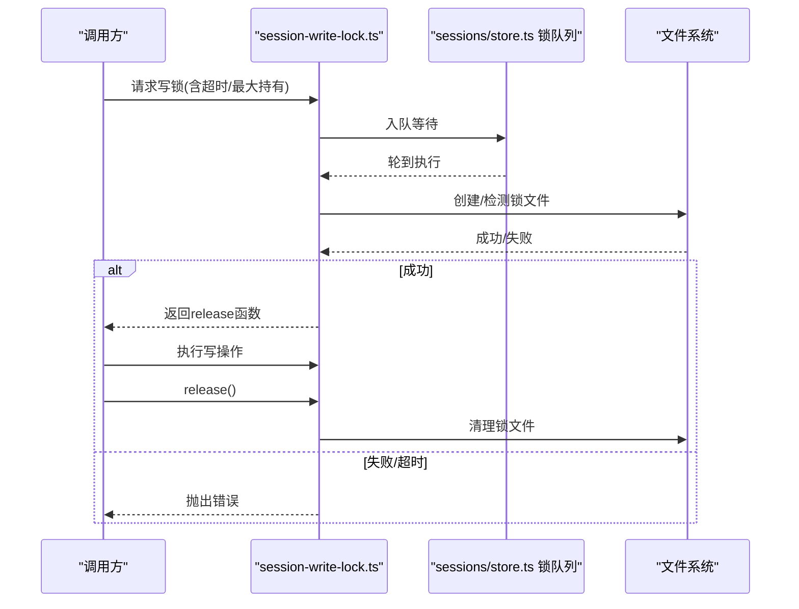
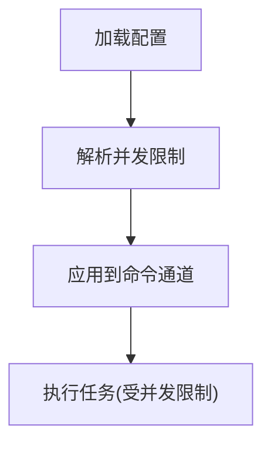
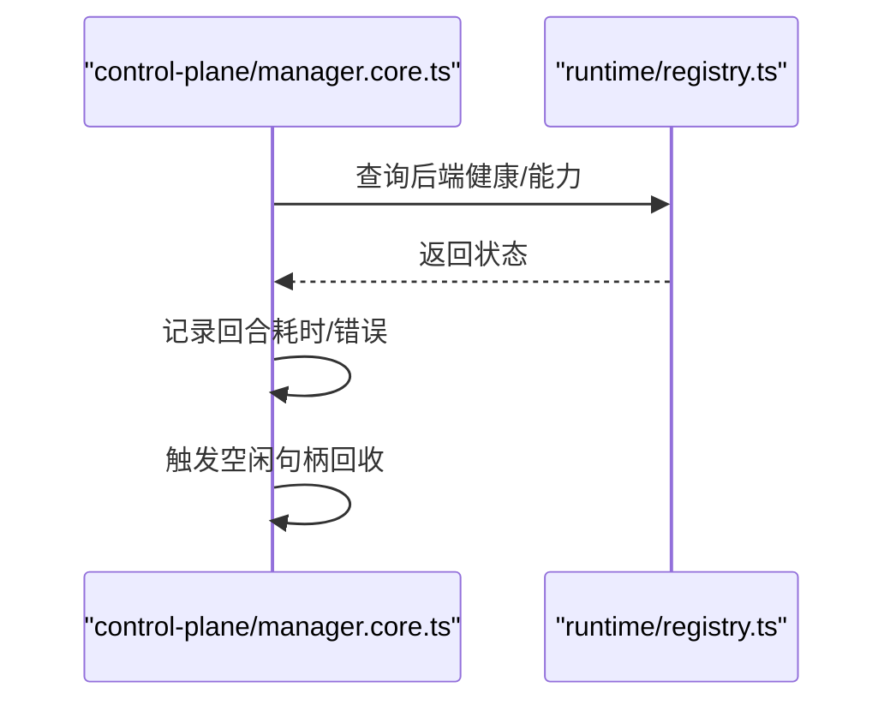
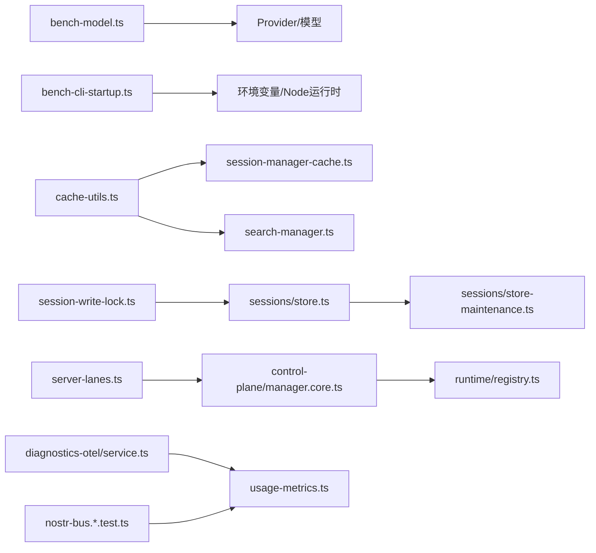

# 性能优化

<cite>
**本文引用的文件**
- [scripts/bench-model.ts](file://scripts/bench-model.ts)
- [scripts/bench-cli-startup.ts](file://scripts/bench-cli-startup.ts)
- [src/memory/search-manager.ts](file://src/memory/search-manager.ts)
- [src/agents/session-write-lock.ts](file://src/agents/session-write-lock.ts)
- [src/config/sessions/store.ts](file://src/config/sessions/store.ts)
- [src/config/sessions/store-maintenance.ts](file://src/config/sessions/store-maintenance.ts)
- [src/config/cache-utils.ts](file://src/config/cache-utils.ts)
- [src/agents/pi-embedded-runner/session-manager-cache.ts](file://src/agents/pi-embedded-runner/session-manager-cache.ts)
- [src/acp/control-plane/manager.core.ts](file://src/acp/control-plane/manager.core.ts)
- [src/acp/runtime/registry.ts](file://src/acp/runtime/registry.ts)
- [src/gateway/server-lanes.ts](file://src/gateway/server-lanes.ts)
- [src/config/config.agent-concurrency-defaults.test.ts](file://src/config/config.agent-concurrency-defaults.test.ts)
- [src/commands/doctor-platform-notes.ts](file://src/commands/doctor-platform-notes.ts)
- [src/commands/doctor-platform-notes.startup-optimization.test.ts](file://src/commands/doctor-platform-notes.startup-optimization.test.ts)
- [docs/platforms/raspberry-pi.md](file://docs/platforms/raspberry-pi.md)
- [docs/vps.md](file://docs/vps.md)
- [extensions/diagnostics-otel/src/service.ts](file://extensions/diagnostics-otel/src/service.ts)
- [extensions/nostr/src/nostr-bus.integration.test.ts](file://extensions/nostr/src/nostr-bus.integration.test.ts)
- [extensions/nostr/src/nostr-bus.fuzz.test.ts](file://extensions/nostr/src/nostr-bus.fuzz.test.ts)
- [ui/src/ui/views/usage-metrics.ts](file://ui/src/ui/views/usage-metrics.ts)
- [src/logging.ts](file://src/logging.ts)
- [src/utils.ts](file://src/utils.ts)
</cite>

## 目录
1. [引言](#引言)
2. [项目结构](#项目结构)
3. [核心组件](#核心组件)
4. [架构总览](#架构总览)
5. [详细组件分析](#详细组件分析)
6. [依赖关系分析](#依赖关系分析)
7. [性能考量与优化建议](#性能考量与优化建议)
8. [故障排查指南](#故障排查指南)
9. [结论](#结论)
10. [附录：性能监控指标与持续优化流程](#附录性能监控指标与持续优化流程)

## 引言
本指南面向OpenClaw系统的性能优化，目标是帮助开发者与运维人员建立系统化的性能基准测试、瓶颈识别与优化策略。内容覆盖内存管理、缓存机制、资源回收、会话管理、并发处理、I/O优化、不同硬件配置下的调优、模型推理优化、工具执行加速以及网络传输优化，并给出可落地的监控指标与持续优化流程。

## 项目结构
OpenClaw采用多语言混合架构（TypeScript/JavaScript、Kotlin、Swift等），核心逻辑集中在src目录，性能相关能力分布在以下区域：
- 基准脚本：scripts/bench-model.ts、scripts/bench-cli-startup.ts
- 内存与缓存：src/memory/*、src/agents/pi-embedded-runner/session-manager-cache.ts、src/config/cache-utils.ts
- 会话与锁：src/agents/session-write-lock.ts、src/config/sessions/store.ts、src/config/sessions/store-maintenance.ts
- 并发与通道：src/gateway/server-lanes.ts、src/config/config.agent-concurrency-defaults.test.ts
- ACP运行时与控制面：src/acp/control-plane/manager.core.ts、src/acp/runtime/registry.ts
- 平台优化建议：docs/platforms/raspberry-pi.md、docs/vps.md、src/commands/doctor-platform-notes.ts
- 监控与度量：extensions/diagnostics-otel/src/service.ts、extensions/nostr/src/nostr-bus.*.test.ts、ui/src/ui/views/usage-metrics.ts
- 日志与工具：src/logging.ts、src/utils.ts

图表来源
- [scripts/bench-model.ts](file://scripts/bench-model.ts#L1-L147)
- [scripts/bench-cli-startup.ts](file://scripts/bench-cli-startup.ts#L1-L201)
- [src/memory/search-manager.ts](file://src/memory/search-manager.ts#L223-L236)
- [src/agents/pi-embedded-runner/session-manager-cache.ts](file://src/agents/pi-embedded-runner/session-manager-cache.ts#L1-L54)
- [src/config/cache-utils.ts](file://src/config/cache-utils.ts#L1-L37)
- [src/agents/session-write-lock.ts](file://src/agents/session-write-lock.ts#L444-L478)
- [src/config/sessions/store.ts](file://src/config/sessions/store.ts#L606-L637)
- [src/config/sessions/store-maintenance.ts](file://src/config/sessions/store-maintenance.ts#L80-L124)
- [src/gateway/server-lanes.ts](file://src/gateway/server-lanes.ts#L1-L10)
- [src/config/config.agent-concurrency-defaults.test.ts](file://src/config/config.agent-concurrency-defaults.test.ts#L1-L57)
- [src/acp/control-plane/manager.core.ts](file://src/acp/control-plane/manager.core.ts#L400-L437)
- [src/acp/runtime/registry.ts](file://src/acp/runtime/registry.ts#L1-L47)
- [docs/platforms/raspberry-pi.md](file://docs/platforms/raspberry-pi.md#L195-L270)
- [docs/vps.md](file://docs/vps.md#L73-L103)
- [src/commands/doctor-platform-notes.ts](file://src/commands/doctor-platform-notes.ts#L188-L221)
- [extensions/diagnostics-otel/src/service.ts](file://extensions/diagnostics-otel/src/service.ts#L78-L108)
- [extensions/nostr/src/nostr-bus.integration.test.ts](file://extensions/nostr/src/nostr-bus.integration.test.ts#L1-L44)
- [extensions/nostr/src/nostr-bus.fuzz.test.ts](file://extensions/nostr/src/nostr-bus.fuzz.test.ts#L292-L336)
- [ui/src/ui/views/usage-metrics.ts](file://ui/src/ui/views/usage-metrics.ts#L407-L431)

章节来源
- [scripts/bench-model.ts](file://scripts/bench-model.ts#L1-L147)
- [scripts/bench-cli-startup.ts](file://scripts/bench-cli-startup.ts#L1-L201)
- [src/memory/search-manager.ts](file://src/memory/search-manager.ts#L223-L236)
- [src/agents/pi-embedded-runner/session-manager-cache.ts](file://src/agents/pi-embedded-runner/session-manager-cache.ts#L1-L54)
- [src/config/cache-utils.ts](file://src/config/cache-utils.ts#L1-L37)
- [src/agents/session-write-lock.ts](file://src/agents/session-write-lock.ts#L444-L478)
- [src/config/sessions/store.ts](file://src/config/sessions/store.ts#L606-L637)
- [src/config/sessions/store-maintenance.ts](file://src/config/sessions/store-maintenance.ts#L80-L124)
- [src/gateway/server-lanes.ts](file://src/gateway/server-lanes.ts#L1-L10)
- [src/config/config.agent-concurrency-defaults.test.ts](file://src/config/config.agent-concurrency-defaults.test.ts#L1-L57)
- [src/acp/control-plane/manager.core.ts](file://src/acp/control-plane/manager.core.ts#L400-L437)
- [src/acp/runtime/registry.ts](file://src/acp/runtime/registry.ts#L1-L47)
- [docs/platforms/raspberry-pi.md](file://docs/platforms/raspberry-pi.md#L195-L270)
- [docs/vps.md](file://docs/vps.md#L73-L103)
- [src/commands/doctor-platform-notes.ts](file://src/commands/doctor-platform-notes.ts#L188-L221)
- [extensions/diagnostics-otel/src/service.ts](file://extensions/diagnostics-otel/src/service.ts#L78-L108)
- [extensions/nostr/src/nostr-bus.integration.test.ts](file://extensions/nostr/src/nostr-bus.integration.test.ts#L1-L44)
- [extensions/nostr/src/nostr-bus.fuzz.test.ts](file://extensions/nostr/src/nostr-bus.fuzz.test.ts#L292-L336)
- [ui/src/ui/views/usage-metrics.ts](file://ui/src/ui/views/usage-metrics.ts#L407-L431)

## 核心组件
- 基准测试脚本：用于模型推理与CLI启动时间的统计分析，支持中位数、分位数与多次采样。
- 缓存与内存：基于TTL的缓存、会话文件预热、缓存键构建与回收策略。
- 会话与锁：写锁队列、锁超时与清理、磁盘空间维护阈值。
- 并发与通道：网关命令通道并发限制、代理并发默认值解析。
- ACP运行时：运行时句柄空闲回收、错误码统计与回合耗时记录。
- 平台优化：编译缓存、无自重启模式、systemd服务参数与存储介质选择。
- 监控与度量：OpenTelemetry导出、指标模糊测试与集成测试、UI用量聚合。

章节来源
- [scripts/bench-model.ts](file://scripts/bench-model.ts#L1-L147)
- [scripts/bench-cli-startup.ts](file://scripts/bench-cli-startup.ts#L1-L201)
- [src/memory/search-manager.ts](file://src/memory/search-manager.ts#L223-L236)
- [src/agents/pi-embedded-runner/session-manager-cache.ts](file://src/agents/pi-embedded-runner/session-manager-cache.ts#L1-L54)
- [src/config/cache-utils.ts](file://src/config/cache-utils.ts#L1-L37)
- [src/agents/session-write-lock.ts](file://src/agents/session-write-lock.ts#L444-L478)
- [src/config/sessions/store.ts](file://src/config/sessions/store.ts#L606-L637)
- [src/config/sessions/store-maintenance.ts](file://src/config/sessions/store-maintenance.ts#L80-L124)
- [src/gateway/server-lanes.ts](file://src/gateway/server-lanes.ts#L1-L10)
- [src/config/config.agent-concurrency-defaults.test.ts](file://src/config/config.agent-concurrency-defaults.test.ts#L1-L57)
- [src/acp/control-plane/manager.core.ts](file://src/acp/control-plane/manager.core.ts#L1142-L1171)
- [src/acp/runtime/registry.ts](file://src/acp/runtime/registry.ts#L1-L47)
- [docs/platforms/raspberry-pi.md](file://docs/platforms/raspberry-pi.md#L195-L270)
- [docs/vps.md](file://docs/vps.md#L73-L103)
- [extensions/diagnostics-otel/src/service.ts](file://extensions/diagnostics-otel/src/service.ts#L78-L108)
- [extensions/nostr/src/nostr-bus.integration.test.ts](file://extensions/nostr/src/nostr-bus.integration.test.ts#L1-L44)
- [extensions/nostr/src/nostr-bus.fuzz.test.ts](file://extensions/nostr/src/nostr-bus.fuzz.test.ts#L292-L336)
- [ui/src/ui/views/usage-metrics.ts](file://ui/src/ui/views/usage-metrics.ts#L407-L431)

## 架构总览
下图展示性能相关模块在系统中的交互关系：基准脚本驱动性能评估；缓存与会话管理降低I/O与锁竞争；并发通道与ACP运行时保障吞吐；平台文档与诊断扩展提供观测与优化建议。

图表来源
- [scripts/bench-model.ts](file://scripts/bench-model.ts#L1-L147)
- [scripts/bench-cli-startup.ts](file://scripts/bench-cli-startup.ts#L1-L201)
- [src/memory/search-manager.ts](file://src/memory/search-manager.ts#L223-L236)
- [src/config/cache-utils.ts](file://src/config/cache-utils.ts#L1-L37)
- [src/acp/control-plane/manager.core.ts](file://src/acp/control-plane/manager.core.ts#L1142-L1171)
- [src/acp/runtime/registry.ts](file://src/acp/runtime/registry.ts#L1-L47)
- [src/agents/session-write-lock.ts](file://src/agents/session-write-lock.ts#L444-L478)
- [src/config/sessions/store.ts](file://src/config/sessions/store.ts#L606-L637)
- [src/config/sessions/store-maintenance.ts](file://src/config/sessions/store-maintenance.ts#L80-L124)
- [src/gateway/server-lanes.ts](file://src/gateway/server-lanes.ts#L1-L10)
- [src/config/config.agent-concurrency-defaults.test.ts](file://src/config/config.agent-concurrency-defaults.test.ts#L1-L57)
- [src/commands/doctor-platform-notes.ts](file://src/commands/doctor-platform-notes.ts#L188-L221)
- [docs/platforms/raspberry-pi.md](file://docs/platforms/raspberry-pi.md#L195-L270)
- [docs/vps.md](file://docs/vps.md#L73-L103)
- [extensions/diagnostics-otel/src/service.ts](file://extensions/diagnostics-otel/src/service.ts#L78-L108)
- [extensions/nostr/src/nostr-bus.integration.test.ts](file://extensions/nostr/src/nostr-bus.integration.test.ts#L1-L44)
- [extensions/nostr/src/nostr-bus.fuzz.test.ts](file://extensions/nostr/src/nostr-bus.fuzz.test.ts#L292-L336)
- [ui/src/ui/views/usage-metrics.ts](file://ui/src/ui/views/usage-metrics.ts#L407-L431)

## 详细组件分析

### 模型推理性能基准（bench-model.ts）
- 功能要点
  - 支持多模型、多次运行，输出每轮耗时与用量（输入/输出/缓存读写/总token）。
  - 使用中位数统计减少异常值影响，便于对比不同Provider或模型配置。
- 优化建议
  - 固定提示词与上下文，避免动态变化引入噪声。
  - 在相同并发与网络条件下重复测量，结合分位数评估尾延迟。
  - 对比不同Provider与模型参数（如最大生成长度、温度）对吞吐与时延的影响。

图表来源
- [scripts/bench-model.ts](file://scripts/bench-model.ts#L50-L79)
- [scripts/bench-model.ts](file://scripts/bench-model.ts#L130-L144)

章节来源
- [scripts/bench-model.ts](file://scripts/bench-model.ts#L1-L147)

### CLI启动性能基准（bench-cli-startup.ts）
- 功能要点
  - 测量常见命令（版本、帮助、健康检查、状态）的平均、中位、95分位耗时。
  - 支持主入口与备选入口对比，计算增量与百分比变化。
- 优化建议
  - 结合平台优化提示启用编译缓存与禁用自重启，显著降低重复启动成本。
  - 在systemd中设置稳定的环境变量与超时参数，提升自动化恢复效率。

图表来源
- [scripts/bench-cli-startup.ts](file://scripts/bench-cli-startup.ts#L68-L96)
- [scripts/bench-cli-startup.ts](file://scripts/bench-cli-startup.ts#L129-L154)

章节来源
- [scripts/bench-cli-startup.ts](file://scripts/bench-cli-startup.ts#L1-L201)

### 缓存与内存管理（search-manager.ts、session-manager-cache.ts、cache-utils.ts）
- 关键点
  - 缓存键构建采用稳定序列化，避免深排序开销。
  - TTL控制缓存生命周期，支持按环境变量覆盖默认值。
  - 会话管理缓存记录加载时间，支持预热与命中判断。
- 优化建议
  - 合理设置TTL，平衡命中率与内存占用。
  - 对热点数据进行预热，减少首次访问延迟。
  - 定期清理过期条目，防止缓存膨胀。

图表来源
- [src/memory/search-manager.ts](file://src/memory/search-manager.ts#L223-L236)
- [src/agents/pi-embedded-runner/session-manager-cache.ts](file://src/agents/pi-embedded-runner/session-manager-cache.ts#L1-L54)
- [src/config/cache-utils.ts](file://src/config/cache-utils.ts#L1-L37)

章节来源
- [src/memory/search-manager.ts](file://src/memory/search-manager.ts#L223-L236)
- [src/agents/pi-embedded-runner/session-manager-cache.ts](file://src/agents/pi-embedded-runner/session-manager-cache.ts#L1-L54)
- [src/config/cache-utils.ts](file://src/config/cache-utils.ts#L1-L37)

### 会话管理与并发写锁（session-write-lock.ts、sessions/store.ts、store-maintenance.ts）
- 关键点
  - 写锁队列串行化写操作，支持超时与清理。
  - 锁文件路径规范化，支持重入与持有计数。
  - 磁盘空间维护包含最大容量与高水位阈值解析。
- 优化建议
  - 将频繁写入合并为批处理，减少锁竞争。
  - 合理设置超时与最大持有时间，避免死锁与饥饿。
  - 高水位阈值与定期清理策略降低磁盘压力。

图表来源
- [src/agents/session-write-lock.ts](file://src/agents/session-write-lock.ts#L444-L478)
- [src/config/sessions/store.ts](file://src/config/sessions/store.ts#L606-L637)

章节来源
- [src/agents/session-write-lock.ts](file://src/agents/session-write-lock.ts#L444-L478)
- [src/config/sessions/store.ts](file://src/config/sessions/store.ts#L606-L637)
- [src/config/sessions/store-maintenance.ts](file://src/config/sessions/store-maintenance.ts#L80-L124)

### 并发处理与通道（server-lanes.ts、config.agent-concurrency-defaults.test.ts）
- 关键点
  - 网关根据配置设置不同命令通道的最大并发。
  - 默认并发值在加载配置时注入，保证最小可用值。
- 优化建议
  - 根据CPU核数与负载动态调整并发上限，避免过度调度。
  - 对高延迟通道（如定时任务）降低并发，优先保障实时通道。

图表来源
- [src/gateway/server-lanes.ts](file://src/gateway/server-lanes.ts#L1-L10)
- [src/config/config.agent-concurrency-defaults.test.ts](file://src/config/config.agent-concurrency-defaults.test.ts#L1-L57)

章节来源
- [src/gateway/server-lanes.ts](file://src/gateway/server-lanes.ts#L1-L10)
- [src/config/config.agent-concurrency-defaults.test.ts](file://src/config/config.agent-concurrency-defaults.test.ts#L1-L57)

### ACP运行时与回合统计（control-plane/manager.core.ts、runtime/registry.ts）
- 关键点
  - 记录回合完成时间、最大耗时、失败次数与错误码分布。
  - 运行时句柄空闲回收，基于TTL与候选收集。
  - 注册表支持后端健康检查与规范化标识。
- 优化建议
  - 监控失败率与错误码分布，定位异常后端或配置问题。
  - 调整空闲回收TTL，平衡资源占用与冷启动成本。

图表来源
- [src/acp/control-plane/manager.core.ts](file://src/acp/control-plane/manager.core.ts#L1142-L1171)
- [src/acp/runtime/registry.ts](file://src/acp/runtime/registry.ts#L1-L47)

章节来源
- [src/acp/control-plane/manager.core.ts](file://src/acp/control-plane/manager.core.ts#L1142-L1171)
- [src/acp/runtime/registry.ts](file://src/acp/runtime/registry.ts#L1-L47)

### 平台优化与环境调优（raspberry-pi.md、vps.md、doctor-platform-notes.ts）
- 关键点
  - 在低功耗设备上启用Node模块编译缓存与禁用自重启，减少启动时间。
  - systemd服务参数（重启策略、启动超时、环境变量）稳定启动路径。
  - 文档提供内存使用与温度监控建议。
- 优化建议
  - 将状态与缓存放在SSD上，降低冷启动随机I/O惩罚。
  - 在systemd中固定环境变量，避免每次启动重新探测。

章节来源
- [docs/platforms/raspberry-pi.md](file://docs/platforms/raspberry-pi.md#L195-L270)
- [docs/vps.md](file://docs/vps.md#L73-L103)
- [src/commands/doctor-platform-notes.ts](file://src/commands/doctor-platform-notes.ts#L188-L221)
- [src/commands/doctor-platform-notes.startup-optimization.test.ts](file://src/commands/doctor-platform-notes.startup-optimization.test.ts#L1-L39)

### 监控与度量（diagnostics-otel、nostr-bus.*.test.ts、usage-metrics.ts）
- 关键点
  - OpenTelemetry导出器按协议与端点配置，支持采样率与资源属性。
  - 指标与集成测试验证边界条件与健壮性。
  - UI用量聚合按Provider、Agent、Channel维度汇总统计与延迟。
- 优化建议
  - 为关键路径打点，关注端到端延迟与错误率。
  - 使用分位数观察尾部延迟，避免均值掩盖异常。

章节来源
- [extensions/diagnostics-otel/src/service.ts](file://extensions/diagnostics-otel/src/service.ts#L78-L108)
- [extensions/nostr/src/nostr-bus.integration.test.ts](file://extensions/nostr/src/nostr-bus.integration.test.ts#L1-L44)
- [extensions/nostr/src/nostr-bus.fuzz.test.ts](file://extensions/nostr/src/nostr-bus.fuzz.test.ts#L292-L336)
- [ui/src/ui/views/usage-metrics.ts](file://ui/src/ui/views/usage-metrics.ts#L407-L431)

## 依赖关系分析
- 模块内聚与耦合
  - 基准脚本独立于核心业务逻辑，通过环境变量与外部Provider驱动。
  - 缓存与会话管理模块相互配合，共同降低I/O与锁竞争。
  - 并发通道与ACP控制面解耦，便于独立优化与扩展。
- 外部依赖与集成
  - OpenTelemetry作为统一观测出口，便于接入第三方APM。
  - 平台文档与systemd配置提供系统级优化手段。

图表来源
- [scripts/bench-model.ts](file://scripts/bench-model.ts#L1-L147)
- [scripts/bench-cli-startup.ts](file://scripts/bench-cli-startup.ts#L1-L201)
- [src/config/cache-utils.ts](file://src/config/cache-utils.ts#L1-L37)
- [src/agents/pi-embedded-runner/session-manager-cache.ts](file://src/agents/pi-embedded-runner/session-manager-cache.ts#L1-L54)
- [src/memory/search-manager.ts](file://src/memory/search-manager.ts#L223-L236)
- [src/agents/session-write-lock.ts](file://src/agents/session-write-lock.ts#L444-L478)
- [src/config/sessions/store.ts](file://src/config/sessions/store.ts#L606-L637)
- [src/config/sessions/store-maintenance.ts](file://src/config/sessions/store-maintenance.ts#L80-L124)
- [src/gateway/server-lanes.ts](file://src/gateway/server-lanes.ts#L1-L10)
- [src/acp/control-plane/manager.core.ts](file://src/acp/control-plane/manager.core.ts#L1142-L1171)
- [src/acp/runtime/registry.ts](file://src/acp/runtime/registry.ts#L1-L47)
- [extensions/diagnostics-otel/src/service.ts](file://extensions/diagnostics-otel/src/service.ts#L78-L108)
- [extensions/nostr/src/nostr-bus.integration.test.ts](file://extensions/nostr/src/nostr-bus.integration.test.ts#L1-L44)
- [extensions/nostr/src/nostr-bus.fuzz.test.ts](file://extensions/nostr/src/nostr-bus.fuzz.test.ts#L292-L336)
- [ui/src/ui/views/usage-metrics.ts](file://ui/src/ui/views/usage-metrics.ts#L407-L431)

## 性能考量与优化建议
- 内存与缓存
  - 合理设置TTL与预热策略，避免缓存击穿与雪崩。
  - 使用稳定键构建与快速序列化，降低热点路径开销。
- 会话与I/O
  - 合并写操作、缩短锁持有时间，避免长尾阻塞。
  - 设置高水位阈值与定期清理，保持磁盘空间健康。
- 并发与通道
  - 根据CPU与负载动态调整并发上限，优先保障关键通道。
  - 对高延迟任务降并发，避免放大尾延迟。
- 模型推理
  - 固定输入、对比不同Provider与参数，使用中位数与分位数评估。
  - 控制上下文长度与最大生成长度，权衡质量与时延。
- 工具执行与网络
  - 通过OpenTelemetry采集端到端链路，关注错误率与尾延迟。
  - 在systemd中固定环境变量与超时，提升稳定性与可观测性。
- 不同硬件配置
  - 低功耗设备启用编译缓存与禁用自重启，SSD存放状态与缓存。
  - VPS与服务器优化systemd重启策略与TimeoutStartSec，提升恢复速度。

[本节为通用指导，不直接分析具体文件]

## 故障排查指南
- CLI启动缓慢
  - 检查是否启用编译缓存与禁用自重启，确认环境变量配置。
  - 参考平台文档与诊断提示，必要时在systemd中固定环境。
- 会话写入阻塞
  - 查看锁队列状态与超时日志，确认是否存在长时间持有锁的任务。
  - 检查磁盘空间与高水位阈值，避免因清理不及时导致堆积。
- ACP运行时错误
  - 关注错误码分布与失败率，定位异常后端或配置问题。
  - 调整空闲回收TTL，避免资源泄漏或频繁重建。
- 监控缺失或异常
  - 校验OpenTelemetry导出端点、协议与采样率。
  - 使用集成与模糊测试验证指标边界行为。

章节来源
- [src/commands/doctor-platform-notes.ts](file://src/commands/doctor-platform-notes.ts#L188-L221)
- [src/agents/session-write-lock.ts](file://src/agents/session-write-lock.ts#L444-L478)
- [src/config/sessions/store.ts](file://src/config/sessions/store.ts#L606-L637)
- [src/acp/control-plane/manager.core.ts](file://src/acp/control-plane/manager.core.ts#L1142-L1171)
- [extensions/diagnostics-otel/src/service.ts](file://extensions/diagnostics-otel/src/service.ts#L78-L108)
- [extensions/nostr/src/nostr-bus.integration.test.ts](file://extensions/nostr/src/nostr-bus.integration.test.ts#L1-L44)
- [extensions/nostr/src/nostr-bus.fuzz.test.ts](file://extensions/nostr/src/nostr-bus.fuzz.test.ts#L292-L336)

## 结论
通过基准测试量化性能、利用缓存与会话优化I/O、以并发与通道策略提升吞吐、结合OpenTelemetry建立可观测体系，并针对不同硬件平台实施环境与系统级优化，可系统性地提升OpenClaw的整体性能与稳定性。建议将性能优化纳入日常开发流程，持续迭代与回归验证。

[本节为总结性内容，不直接分析具体文件]

## 附录：性能监控指标与持续优化流程
- 监控指标建议
  - 推理类：请求时延（中位数/95分位）、错误率、Token用量（输入/输出/缓存读写）。
  - 启动类：CLI启动时延（平均/中位/95分位）、退出码分布。
  - 会话类：写锁等待时延、锁超时次数、磁盘使用率与清理频率。
  - 并发类：通道排队长度、并发上限利用率、失败率与错误码分布。
- 持续优化流程
  - 建立基准脚本与回归测试，定期在相同环境下执行。
  - 以分位数与趋势分析识别异常，结合日志与追踪定位根因。
  - 实施小步快跑的变更策略，先在低流量环境验证，再逐步扩大范围。
  - 将优化建议固化为配置模板与平台文档，形成知识沉淀。

[本节为概念性内容，不直接分析具体文件]