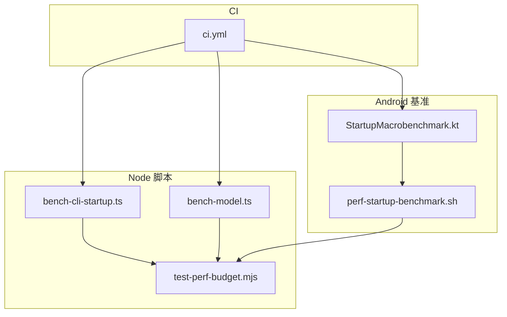
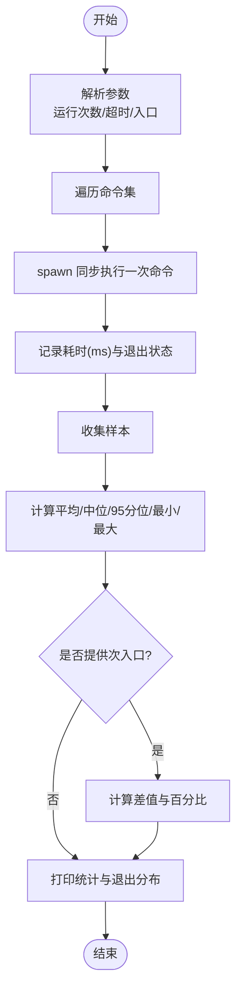
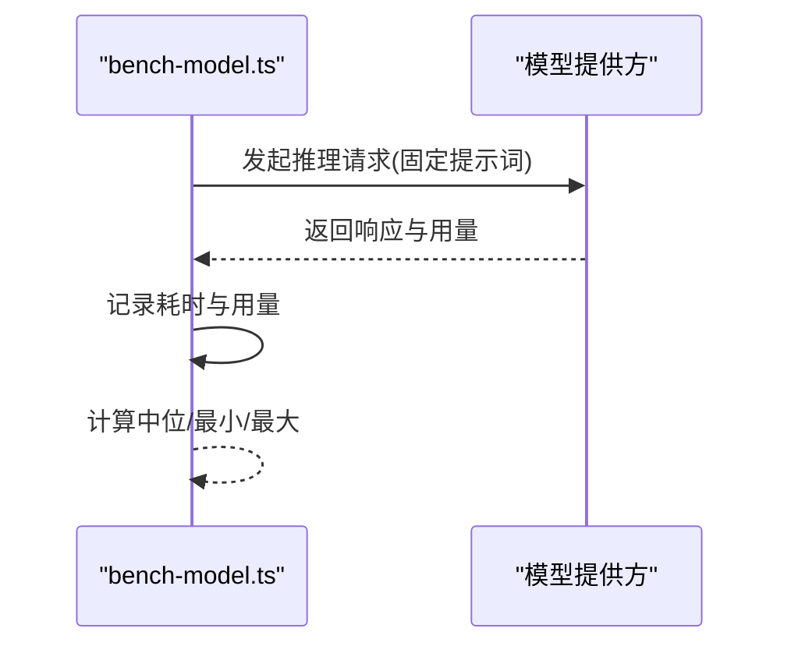
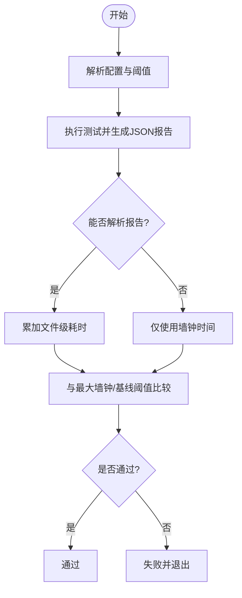
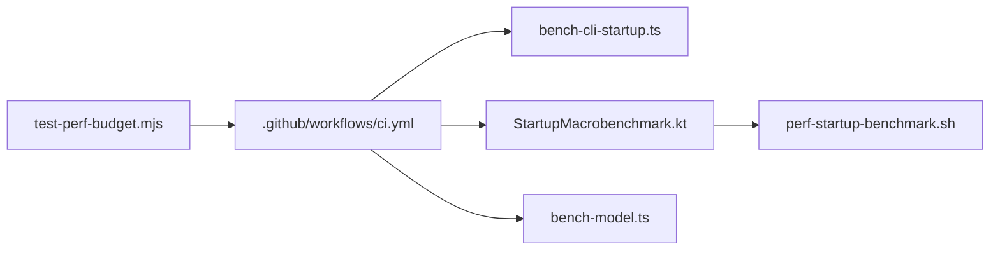

# 性能基准测试

<cite>
**本文引用的文件**   
- [scripts/bench-cli-startup.ts](file://scripts/bench-cli-startup.ts)
- [scripts/bench-model.ts](file://scripts/bench-model.ts)
- [scripts/test-perf-budget.mjs](file://scripts/test-perf-budget.mjs)
- [apps/android/benchmark/src/main/java/ai/openclaw/android/benchmark/StartupMacrobenchmark.kt](file://apps/android/benchmark/src/main/java/ai/openclaw/android/benchmark/StartupMacrobenchmark.kt)
- [apps/android/scripts/perf-startup-benchmark.sh](file://apps/android/scripts/perf-startup-benchmark.sh)
- [.github/workflows/ci.yml](file://.github/workflows/ci.yml)
- [src/commands/models/scan.ts](file://src/commands/models/scan.ts)
- [src/agents/cli-runner/helpers.ts](file://src/agents/cli-runner/helpers.ts)
</cite>

## 目录
1. [引言](#引言)
2. [项目结构](#项目结构)
3. [核心组件](#核心组件)
4. [架构总览](#架构总览)
5. [详细组件分析](#详细组件分析)
6. [依赖关系分析](#依赖关系分析)
7. [性能考量](#性能考量)
8. [故障排查指南](#故障排查指南)
9. [结论](#结论)
10. [附录](#附录)

## 引言
本指南面向OpenClaw的性能基准测试体系，系统化介绍性能测试框架、基准脚本与测试用例设计方法，覆盖模型推理性能测试、CLI启动时间测试以及系统整体性能评估的实现技术。文档同时提供自动化性能测试、回归测试与性能监控的最佳实践，给出不同场景下的测试方案、基准线建立与趋势分析方法，并说明如何在持续集成中进行性能验证与结果对比。

## 项目结构
OpenClaw的性能测试能力由多语言脚本与平台特定的基准工程共同构成：
- Node生态：CLI启动时间与模型推理基准脚本，配合性能预算门禁工具。
- Android生态：基于Macrobenchmark的冷启动与帧时序指标采集脚本与测试类。
- 持续集成：在CI中按变更范围智能跳过或执行相关性能任务。



图表来源
- [scripts/bench-cli-startup.ts](file://scripts/bench-cli-startup.ts#L1-L201)
- [scripts/bench-model.ts](file://scripts/bench-model.ts#L1-L147)
- [scripts/test-perf-budget.mjs](file://scripts/test-perf-budget.mjs#L1-L128)
- [apps/android/benchmark/src/main/java/ai/openclaw/android/benchmark/StartupMacrobenchmark.kt](file://apps/android/benchmark/src/main/java/ai/openclaw/android/benchmark/StartupMacrobenchmark.kt#L1-L77)
- [apps/android/scripts/perf-startup-benchmark.sh](file://apps/android/scripts/perf-startup-benchmark.sh#L1-L125)
- [.github/workflows/ci.yml](file://.github/workflows/ci.yml#L1-L776)

章节来源
- [scripts/bench-cli-startup.ts](file://scripts/bench-cli-startup.ts#L1-L201)
- [scripts/bench-model.ts](file://scripts/bench-model.ts#L1-L147)
- [scripts/test-perf-budget.mjs](file://scripts/test-perf-budget.mjs#L1-L128)
- [apps/android/benchmark/src/main/java/ai/openclaw/android/benchmark/StartupMacrobenchmark.kt](file://apps/android/benchmark/src/main/java/ai/openclaw/android/benchmark/StartupMacrobenchmark.kt#L1-L77)
- [apps/android/scripts/perf-startup-benchmark.sh](file://apps/android/scripts/perf-startup-benchmark.sh#L1-L125)
- [.github/workflows/ci.yml](file://.github/workflows/ci.yml#L1-L776)

## 核心组件
- CLI启动时间基准脚本：测量Node CLI命令的启动耗时（含平均、中位、95分位、最小/最大），支持多次运行与超时控制，并可对比主次入口差异。
- 模型推理基准脚本：对指定模型执行多次推理，统计耗时分布与token用量，便于跨模型对比。
- 性能预算门禁：在CI中以“墙钟时间”或“基线回归阈值”限制测试总耗时，防止性能退化。
- Android冷启动宏基准：使用Macrobenchmark采集冷启动与滚动帧时序指标，配套Shell脚本完成设备检测、运行与结果解析。
- 模型扫描与统计：在模型子命令中输出工具链与图像处理路径的耗时摘要与表格，辅助定位瓶颈。

章节来源
- [scripts/bench-cli-startup.ts](file://scripts/bench-cli-startup.ts#L1-L201)
- [scripts/bench-model.ts](file://scripts/bench-model.ts#L1-L147)
- [scripts/test-perf-budget.mjs](file://scripts/test-perf-budget.mjs#L1-L128)
- [apps/android/benchmark/src/main/java/ai/openclaw/android/benchmark/StartupMacrobenchmark.kt](file://apps/android/benchmark/src/main/java/ai/openclaw/android/benchmark/StartupMacrobenchmark.kt#L1-L77)
- [apps/android/scripts/perf-startup-benchmark.sh](file://apps/android/scripts/perf-startup-benchmark.sh#L1-L125)
- [src/commands/models/scan.ts](file://src/commands/models/scan.ts#L81-L130)
- [src/agents/cli-runner/helpers.ts](file://src/agents/cli-runner/helpers.ts#L101-L131)

## 架构总览
下图展示从脚本到CI的整体调用链路与数据流：

```mermaid
sequenceDiagram
participant Dev as "开发者/CI"
participant CLI as "bench-cli-startup.ts"
participant MODEL as "bench-model.ts"
participant PERF as "test-perf-budget.mjs"
participant AND as "StartupMacrobenchmark.kt"
participant SH as "perf-startup-benchmark.sh"
Dev->>CLI : 运行CLI启动时间基准
CLI-->>Dev : 输出平均/中位/95分位/最小/最大耗时
Dev->>MODEL : 运行模型推理基准
MODEL-->>Dev : 输出各模型耗时分布与token用量
Dev->>PERF : 运行性能预算门禁
PERF->>PERF : 解析JSON报告统计文件耗时
PERF-->>Dev : 判定是否超过墙钟上限或基线回归阈值
Dev->>AND : 执行Android冷启动宏基准
AND->>SH : 触发Gradle测试并产出benchmarkData.json
SH-->>Dev : 解析并打印冷启动指标与对比基线
```

图表来源
- [scripts/bench-cli-startup.ts](file://scripts/bench-cli-startup.ts#L156-L201)
- [scripts/bench-model.ts](file://scripts/bench-model.ts#L81-L147)
- [scripts/test-perf-budget.mjs](file://scripts/test-perf-budget.mjs#L61-L128)
- [apps/android/benchmark/src/main/java/ai/openclaw/android/benchmark/StartupMacrobenchmark.kt](file://apps/android/benchmark/src/main/java/ai/openclaw/android/benchmark/StartupMacrobenchmark.kt#L23-L77)
- [apps/android/scripts/perf-startup-benchmark.sh](file://apps/android/scripts/perf-startup-benchmark.sh#L62-L125)

## 详细组件分析

### CLI启动时间基准（bench-cli-startup.ts）
- 功能要点
  - 定义默认命令集（版本查询、帮助、健康检查、状态等）。
  - 支持指定运行次数与超时；每次运行记录耗时与退出码/信号。
  - 统计指标包括平均、中位、95分位、最小/最大；并汇总退出状态分布。
  - 可选对比两个入口（主/次），计算差值与百分比变化。
- 关键实现模式
  - 使用高精度时间戳测量单次耗时。
  - 通过spawn同步方式执行Node CLI，避免异步竞争。
  - 对空参数与非法输入进行健壮性处理。
- 测试用例设计建议
  - 针对不同入口（开发版/发布版）进行对比。
  - 在不同系统负载与磁盘缓存条件下重复运行，观察方差与异常值。
  - 结合性能预算门禁，设定最大允许耗时阈值。



图表来源
- [scripts/bench-cli-startup.ts](file://scripts/bench-cli-startup.ts#L28-L154)

章节来源
- [scripts/bench-cli-startup.ts](file://scripts/bench-cli-startup.ts#L1-L201)

### 模型推理基准（bench-model.ts）
- 功能要点
  - 通过统一接口发起多次推理请求，记录耗时与token用量。
  - 默认提示词与运行次数可配置；支持不同模型对比。
  - 输出中位/最小/最大耗时，便于稳健评估。
- 关键实现模式
  - 使用高精度时间戳统计单次耗时。
  - 将用量字段映射到统一结构，便于后续聚合分析。
- 测试用例设计建议
  - 固定提示词与上下文长度，确保可比性。
  - 多次运行消除抖动影响；必要时剔除异常样本。
  - 对比不同提供商/模型/后端配置的吞吐与延迟。



图表来源
- [scripts/bench-model.ts](file://scripts/bench-model.ts#L50-L79)

章节来源
- [scripts/bench-model.ts](file://scripts/bench-model.ts#L1-L147)

### 性能预算门禁（test-perf-budget.mjs）
- 功能要点
  - 以“墙钟时间”或“基线回归阈值”作为门禁条件。
  - 通过运行测试并解析JSON报告统计文件级耗时，叠加墙钟时间判断。
  - 支持通过环境变量或命令行参数配置阈值。
- 关键实现模式
  - 子进程执行测试并捕获耗时；解析报告失败时仍可用墙钟时间兜底。
  - 允许设置最大墙钟时间与基线回归百分比上限。
- 最佳实践
  - 将该门禁集成到CI的必经步骤，确保每次提交都受控。
  - 为不同配置（如单元测试、扩展测试、协议检查）分别设定阈值。



图表来源
- [scripts/test-perf-budget.mjs](file://scripts/test-perf-budget.mjs#L15-L128)

章节来源
- [scripts/test-perf-budget.mjs](file://scripts/test-perf-budget.mjs#L1-L128)

### Android冷启动宏基准（StartupMacrobenchmark.kt + perf-startup-benchmark.sh）
- 功能要点
  - Kotlin测试类使用Macrobenchmark规则，采集冷启动与滚动帧时序指标。
  - Shell脚本负责设备检测、触发Gradle测试、复制最新结果、解析JSON并打印关键指标。
  - 支持与最近历史快照进行对比，输出中位、最小/最大、变异系数与回归百分比。
- 关键实现模式
  - 通过ADB与Gradle命令驱动仪器化测试，确保结果可复现。
  - 使用jq解析benchmarkData.json，提取timeToInitialDisplayMs等指标。
- 测试用例设计建议
  - 在不同机型/系统版本上运行，建立跨设备基线。
  - 关注变异系数与异常波动，识别设备/系统差异。

```mermaid
sequenceDiagram
participant SH as "perf-startup-benchmark.sh"
participant GR as "Gradle 测试"
participant AND as "StartupMacrobenchmark.kt"
participant FS as "文件系统"
participant JQ as "jq解析"
SH->>GR : 触发connectedDebugAndroidTest
GR->>AND : 执行冷启动/滚动测试
AND-->>FS : 生成benchmarkData.json
SH->>FS : 复制最新JSON为快照
SH->>JQ : 提取中位/最小/最大/CV/设备信息
JQ-->>SH : 输出紧凑摘要与基线对比
```

图表来源
- [apps/android/benchmark/src/main/java/ai/openclaw/android/benchmark/StartupMacrobenchmark.kt](file://apps/android/benchmark/src/main/java/ai/openclaw/android/benchmark/StartupMacrobenchmark.kt#L23-L77)
- [apps/android/scripts/perf-startup-benchmark.sh](file://apps/android/scripts/perf-startup-benchmark.sh#L62-L125)

章节来源
- [apps/android/benchmark/src/main/java/ai/openclaw/android/benchmark/StartupMacrobenchmark.kt](file://apps/android/benchmark/src/main/java/ai/openclaw/android/benchmark/StartupMacrobenchmark.kt#L1-L77)
- [apps/android/scripts/perf-startup-benchmark.sh](file://apps/android/scripts/perf-startup-benchmark.sh#L1-L125)

### 模型扫描与统计（scan.ts 与 cli-runner/helpers.ts）
- 功能要点
  - 模型扫描命令输出工具链与图像处理路径的耗时摘要与表格，便于快速定位瓶颈。
  - CLI运行助手对模型别名进行归一化处理，确保不同入口指向同一模型。
- 应用场景
  - 在本地或CI中定期运行扫描，形成“模型性能清单”，用于回归对比与优化跟踪。

章节来源
- [src/commands/models/scan.ts](file://src/commands/models/scan.ts#L81-L130)
- [src/agents/cli-runner/helpers.ts](file://src/agents/cli-runner/helpers.ts#L101-L131)

## 依赖关系分析
- 耦合与内聚
  - Node脚本彼此独立，通过CI统一编排；与Android脚本解耦，各自面向平台特性。
  - 性能预算门禁与测试框架（Vitest）解耦，通过报告文件与环境变量交互。
- 外部依赖
  - Android宏基准依赖Macrobenchmark、ADB与Gradle；需要安装相应SDK与工具链。
  - Node脚本依赖Node运行时与外部模型提供方API密钥。
- 潜在循环依赖
  - 当前脚本无直接循环依赖；建议在新增脚本时保持单向依赖，避免CI复杂度上升。



图表来源
- [.github/workflows/ci.yml](file://.github/workflows/ci.yml#L1-L776)
- [scripts/bench-cli-startup.ts](file://scripts/bench-cli-startup.ts#L1-L201)
- [apps/android/benchmark/src/main/java/ai/openclaw/android/benchmark/StartupMacrobenchmark.kt](file://apps/android/benchmark/src/main/java/ai/openclaw/android/benchmark/StartupMacrobenchmark.kt#L1-L77)
- [scripts/bench-model.ts](file://scripts/bench-model.ts#L1-L147)
- [scripts/test-perf-budget.mjs](file://scripts/test-perf-budget.mjs#L1-L128)
- [apps/android/scripts/perf-startup-benchmark.sh](file://apps/android/scripts/perf-startup-benchmark.sh#L1-L125)

章节来源
- [.github/workflows/ci.yml](file://.github/workflows/ci.yml#L1-L776)

## 性能考量
- 测量粒度
  - CLI启动时间：关注冷启动与热启动差异；在不同入口间对比。
  - 模型推理：固定提示词与上下文，统计中位数与方差；关注token用量与延迟的关系。
  - Android冷启动：关注timeToInitialDisplayMs的中位与变异系数。
- 环境一致性
  - 统一Node/Gradle/Android SDK版本；在CI中使用固定镜像与缓存策略。
  - 控制并发与资源分配，避免抖动放大。
- 基线与回归
  - 建立历史快照库，按设备/系统版本维护基线。
  - 设定最大墙钟时间与基线回归阈值，防止性能退化。
- 报告与可视化
  - 输出紧凑摘要与JSON快照，便于自动化对比与趋势分析。
  - 在CI中记录关键指标，支持邮件/通知与工单联动。

## 故障排查指南
- Android宏基准
  - 设备未连接或ADB不可用：脚本会报错并退出；确认设备状态与权限。
  - benchmarkData.json缺失：检查Gradle测试日志，定位失败原因。
  - 已知设备问题：测试类内置忽略逻辑，遇到特定异常消息时会跳过该设备。
- Node脚本
  - 超时或异常退出：检查命令参数、入口路径与环境变量；适当提高超时。
  - 性能预算门禁失败：调整阈值或优化被测任务；查看wall与file-sum统计。
- 模型推理
  - API密钥缺失：脚本会抛出错误；确保环境变量正确配置。
  - 不同模型表现差异：固定提示词与上下文，多次运行取稳健统计。

章节来源
- [apps/android/benchmark/src/main/java/ai/openclaw/android/benchmark/StartupMacrobenchmark.kt](file://apps/android/benchmark/src/main/java/ai/openclaw/android/benchmark/StartupMacrobenchmark.kt#L62-L77)
- [apps/android/scripts/perf-startup-benchmark.sh](file://apps/android/scripts/perf-startup-benchmark.sh#L49-L82)
- [scripts/bench-cli-startup.ts](file://scripts/bench-cli-startup.ts#L156-L201)
- [scripts/test-perf-budget.mjs](file://scripts/test-perf-budget.mjs#L73-L128)
- [scripts/bench-model.ts](file://scripts/bench-model.ts#L82-L92)

## 结论
OpenClaw的性能基准测试体系以脚本化与平台化为核心，结合CI智能调度与性能预算门禁，实现了对CLI启动、模型推理与Android冷启动的全栈覆盖。通过建立基线与回归阈值，配合自动化报告与趋势分析，能够在持续交付中稳定保障性能质量。

## 附录
- 持续集成中的性能验证流程
  - 变更范围检测：根据diff自动跳过无关任务，降低CI成本。
  - 必经门禁：在关键阶段运行性能预算门禁，确保整体耗时可控。
  - 平台专属：Android与Node任务分别执行，互不干扰。
- 性能测试报告生成与对比
  - CLI与模型脚本输出紧凑摘要；Android脚本保存JSON快照，便于对比。
  - 建议在CI中上传快照与日志，支持回溯与趋势分析。

章节来源
- [.github/workflows/ci.yml](file://.github/workflows/ci.yml#L13-L776)