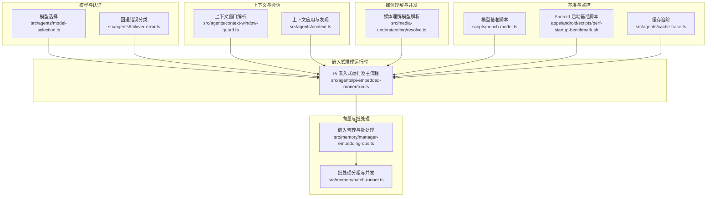
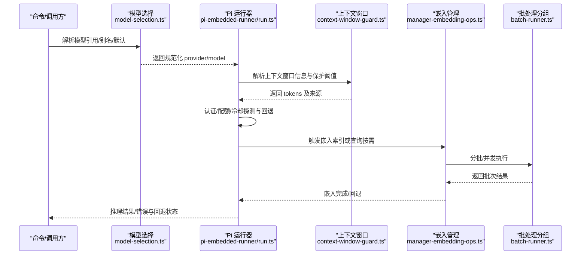
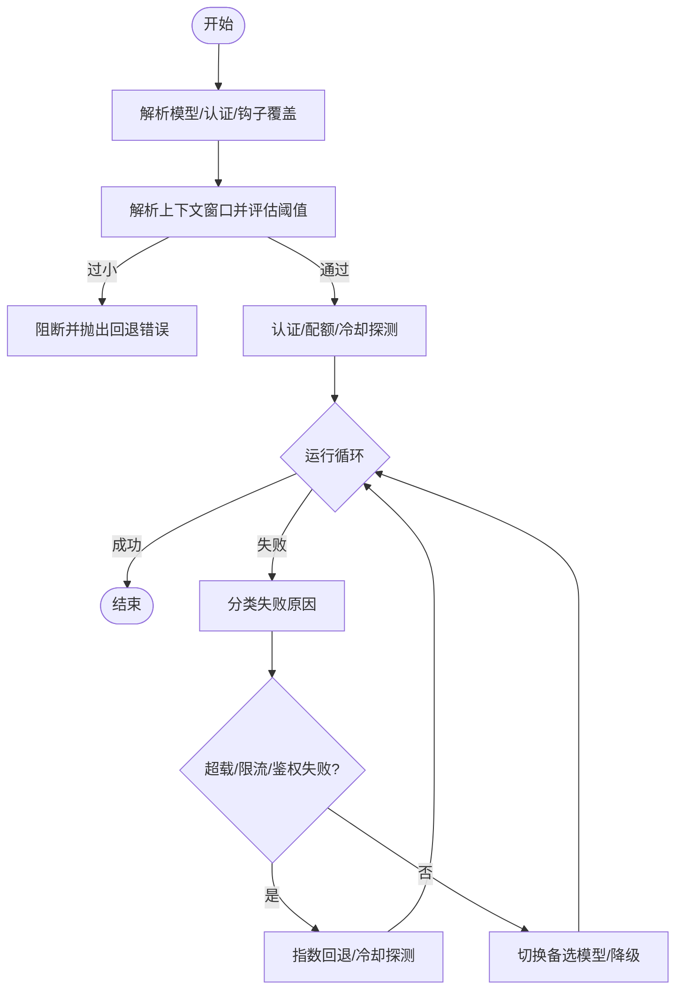
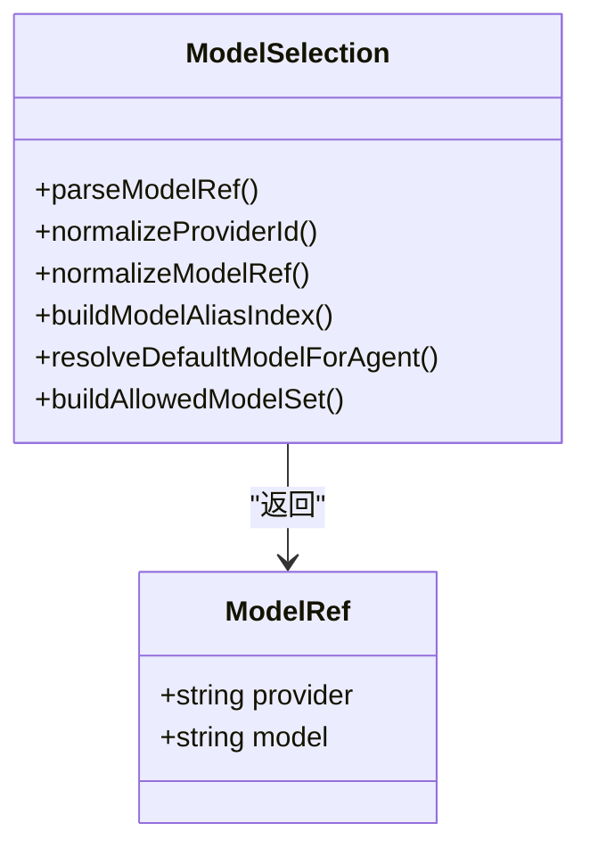
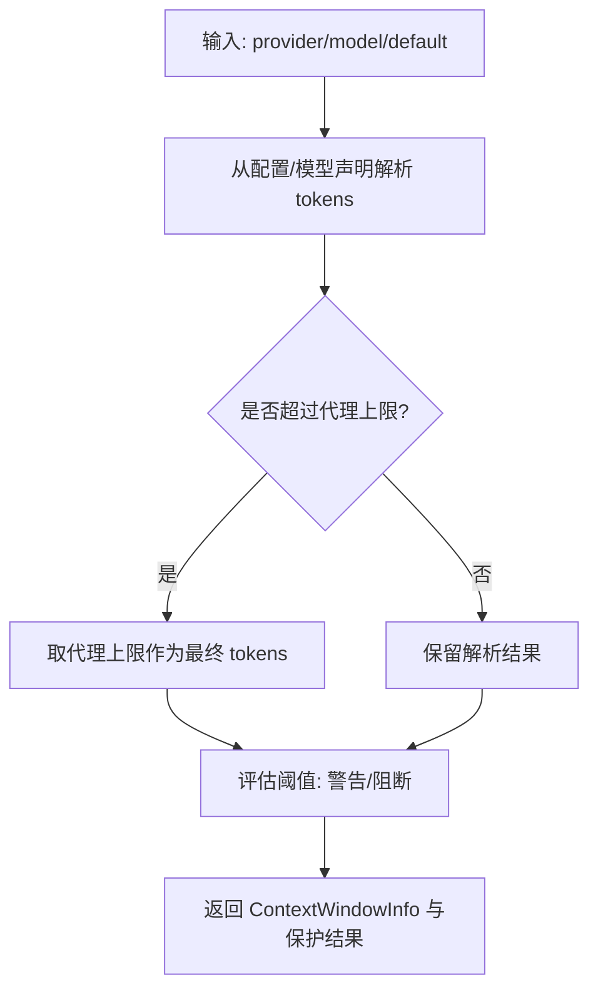
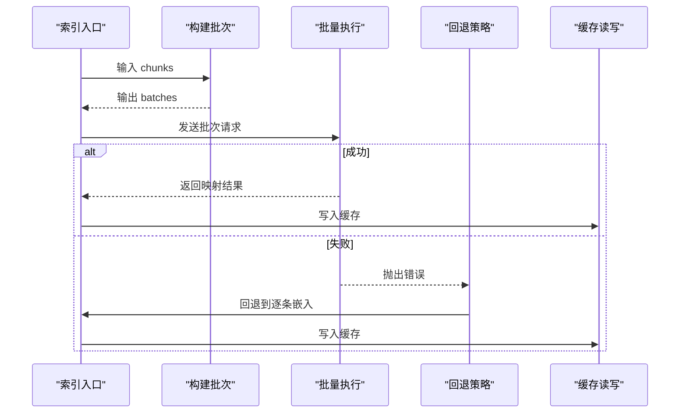
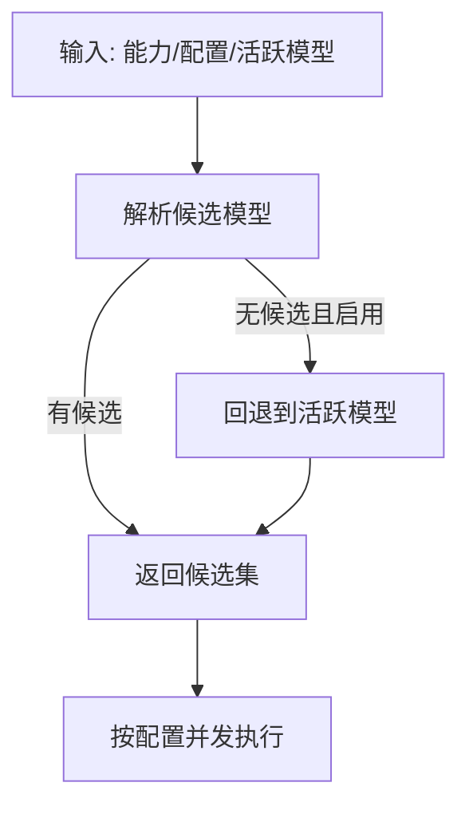
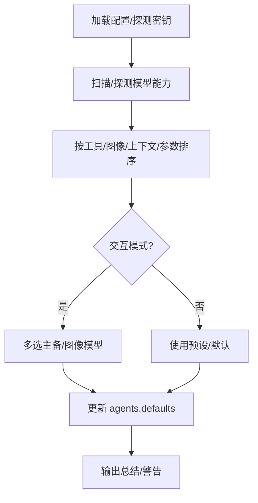
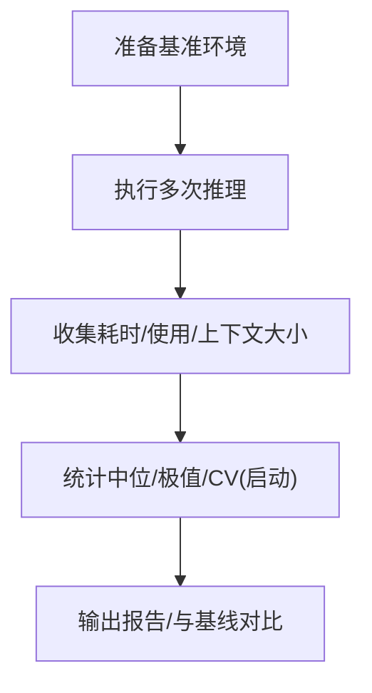
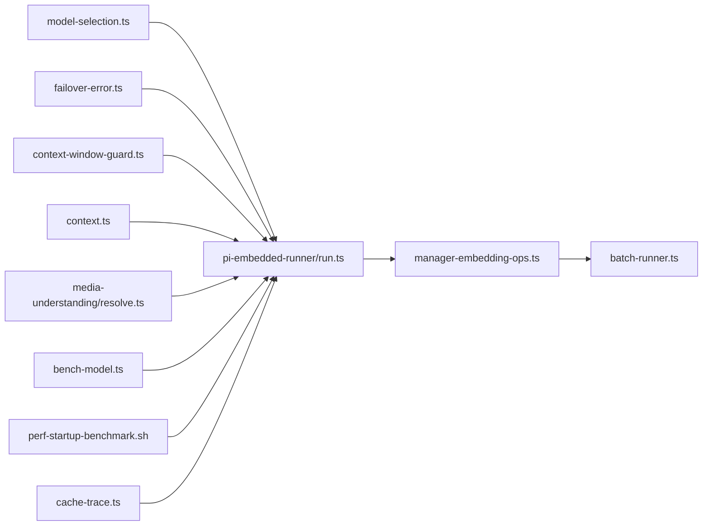

# 模型推理优化

<cite>
**本文引用的文件**
- [src/agents/pi-embedded-runner/run.ts](file://src/agents/pi-embedded-runner/run.ts)
- [src/agents/context-window-guard.ts](file://src/agents/context-window-guard.ts)
- [src/agents/context.ts](file://src/agents/context.ts)
- [src/agents/failover-error.ts](file://src/agents/failover-error.ts)
- [src/agents/model-selection.ts](file://src/agents/model-selection.ts)
- [src/commands/models/scan.ts](file://src/commands/models/scan.ts)
- [src/memory/manager-embedding-ops.ts](file://src/memory/manager-embedding-ops.ts)
- [src/memory/batch-runner.ts](file://src/memory/batch-runner.ts)
- [src/media-understanding/resolve.ts](file://src/media-understanding/resolve.ts)
- [scripts/bench-model.ts](file://scripts/bench-model.ts)
- [apps/android/scripts/perf-startup-benchmark.sh](file://apps/android/scripts/perf-startup-benchmark.sh)
- [src/agents/cache-trace.ts](file://src/agents/cache-trace.ts)
- [src/gateway/gateway-models.profiles.live.test.ts](file://src/gateway/gateway-models.profiles.live.test.ts)
</cite>

## 目录
1. [简介](#简介)
2. [项目结构](#项目结构)
3. [核心组件](#核心组件)
4. [架构总览](#架构总览)
5. [详细组件分析](#详细组件分析)
6. [依赖关系分析](#依赖关系分析)
7. [性能考量](#性能考量)
8. [故障排查指南](#故障排查指南)
9. [结论](#结论)
10. [附录](#附录)

## 简介
本技术指南聚焦于 OpenClaw 的模型推理优化，围绕嵌入式 Pi 代理运行时、模型选择与回退、上下文窗口管理、推理加速与批处理、性能基准测试与监控等主题，系统阐述如何在多硬件平台与多模型场景下实现稳定、高效且可扩展的推理体验。文档同时给出最佳实践、可视化流程图与排障建议，帮助开发者在资源受限与高并发环境下取得更优的吞吐与延迟表现。

## 项目结构
OpenClaw 将“模型选择/认证/回退”“上下文窗口与会话管理”“嵌入式推理运行时”“向量索引与批处理”“媒体理解与并发”“性能基准与监控”等模块化组织，形成从配置到执行再到观测的闭环。

图表来源
- [src/agents/model-selection.ts](file://src/agents/model-selection.ts#L1-L639)
- [src/agents/failover-error.ts](file://src/agents/failover-error.ts#L1-L241)
- [src/agents/context-window-guard.ts](file://src/agents/context-window-guard.ts#L1-L75)
- [src/agents/context.ts](file://src/agents/context.ts#L30-L74)
- [src/agents/pi-embedded-runner/run.ts](file://src/agents/pi-embedded-runner/run.ts#L1-L800)
- [src/memory/manager-embedding-ops.ts](file://src/memory/manager-embedding-ops.ts#L1-L800)
- [src/memory/batch-runner.ts](file://src/memory/batch-runner.ts#L1-L65)
- [src/media-understanding/resolve.ts](file://src/media-understanding/resolve.ts#L141-L187)
- [scripts/bench-model.ts](file://scripts/bench-model.ts#L1-L147)
- [apps/android/scripts/perf-startup-benchmark.sh](file://apps/android/scripts/perf-startup-benchmark.sh#L55-L113)
- [src/agents/cache-trace.ts](file://src/agents/cache-trace.ts#L46-L192)

章节来源
- [src/agents/pi-embedded-runner/run.ts](file://src/agents/pi-embedded-runner/run.ts#L1-L800)
- [src/agents/context-window-guard.ts](file://src/agents/context-window-guard.ts#L1-L75)
- [src/agents/context.ts](file://src/agents/context.ts#L30-L74)
- [src/agents/model-selection.ts](file://src/agents/model-selection.ts#L1-L639)
- [src/agents/failover-error.ts](file://src/agents/failover-error.ts#L1-L241)
- [src/memory/manager-embedding-ops.ts](file://src/memory/manager-embedding-ops.ts#L1-L800)
- [src/memory/batch-runner.ts](file://src/memory/batch-runner.ts#L1-L65)
- [src/media-understanding/resolve.ts](file://src/media-understanding/resolve.ts#L141-L187)
- [scripts/bench-model.ts](file://scripts/bench-model.ts#L1-L147)
- [apps/android/scripts/perf-startup-benchmark.sh](file://apps/android/scripts/perf-startup-benchmark.sh#L55-L113)
- [src/agents/cache-trace.ts](file://src/agents/cache-trace.ts#L46-L192)

## 核心组件
- 嵌入式 Pi 代理运行时：负责模型解析、认证、上下文窗口校验、回退重试、并发与超时控制、使用统计与错误分类。
- 模型选择与别名映射：支持别名索引、规范化提供商与模型 ID、构建允许列表与默认模型解析。
- 上下文窗口管理：从配置、模型声明与默认值综合推导上下文上限，并进行告警与阻断保护。
- 向量索引与批处理：对嵌入计算进行分批、重试、缓存与回退，支持多供应商批请求。
- 媒体理解并发：根据能力与活跃模型动态解析可用模型集合，保障媒体理解路径可用性。
- 性能基准与监控：提供模型级与启动级基准脚本，以及缓存追踪日志以辅助定位瓶颈。

章节来源
- [src/agents/pi-embedded-runner/run.ts](file://src/agents/pi-embedded-runner/run.ts#L253-L800)
- [src/agents/model-selection.ts](file://src/agents/model-selection.ts#L12-L351)
- [src/agents/context-window-guard.ts](file://src/agents/context-window-guard.ts#L21-L74)
- [src/agents/context.ts](file://src/agents/context.ts#L30-L74)
- [src/memory/manager-embedding-ops.ts](file://src/memory/manager-embedding-ops.ts#L1-L800)
- [src/memory/batch-runner.ts](file://src/memory/batch-runner.ts#L1-L65)
- [src/media-understanding/resolve.ts](file://src/media-understanding/resolve.ts#L141-L187)
- [scripts/bench-model.ts](file://scripts/bench-model.ts#L1-L147)
- [src/agents/cache-trace.ts](file://src/agents/cache-trace.ts#L167-L192)

## 架构总览
下图展示从“模型选择/认证/回退”到“嵌入式推理运行时”的关键交互，以及与“向量索引/批处理”“媒体理解并发”的衔接。

图表来源
- [src/agents/model-selection.ts](file://src/agents/model-selection.ts#L285-L351)
- [src/agents/pi-embedded-runner/run.ts](file://src/agents/pi-embedded-runner/run.ts#L357-L396)
- [src/agents/context-window-guard.ts](file://src/agents/context-window-guard.ts#L21-L74)
- [src/memory/manager-embedding-ops.ts](file://src/memory/manager-embedding-ops.ts#L340-L418)
- [src/memory/batch-runner.ts](file://src/memory/batch-runner.ts#L12-L48)

## 详细组件分析

### 嵌入式 Pi 代理运行时（推理主流程）
- 模型解析与认证：支持钩子覆盖、认证配置与配额冷却探测；失败时按原因分类并触发回退。
- 上下文窗口校验：在运行前解析并评估上下文窗口，低于阈值发出警告或直接阻断。
- 回退与重试：针对超载、限流、鉴权失败等进行指数回退与冷却探测，避免雪崩。
- 使用统计与提示词令牌：对缓存读写与输出累计，采用最后一次调用的输入/缓存字段修正总令牌估算。
- 并发与队列：基于会话/全局队列与并发限制，确保资源可控。

图表来源
- [src/agents/pi-embedded-runner/run.ts](file://src/agents/pi-embedded-runner/run.ts#L357-L396)
- [src/agents/pi-embedded-runner/run.ts](file://src/agents/pi-embedded-runner/run.ts#L531-L579)
- [src/agents/pi-embedded-runner/run.ts](file://src/agents/pi-embedded-runner/run.ts#L764-L783)
- [src/agents/failover-error.ts](file://src/agents/failover-error.ts#L151-L186)

章节来源
- [src/agents/pi-embedded-runner/run.ts](file://src/agents/pi-embedded-runner/run.ts#L253-L800)
- [src/agents/failover-error.ts](file://src/agents/failover-error.ts#L1-L241)

### 模型选择与别名映射
- 别名索引：支持将别名映射到具体 provider/model，便于在配置中简化引用。
- 规范化：统一提供商名称、模型 ID（含特殊提供商如 Anthropic/Vercel/Google）。
- 允许列表与合成目录：当允许列表为空时表示“全部允许”，否则仅允许白名单内的模型；默认模型也会被纳入允许集合。
- 默认模型解析：优先取代理级覆盖，其次取全局默认，最终回退到硬编码默认值。

图表来源
- [src/agents/model-selection.ts](file://src/agents/model-selection.ts#L12-L351)

章节来源
- [src/agents/model-selection.ts](file://src/agents/model-selection.ts#L1-L639)

### 上下文窗口管理
- 来源优先级：配置中的模型上下文 > 模型声明 > 默认值；随后受“代理上下文令牌上限”约束。
- 保护阈值：低于“警告阈值”发出告警，低于“硬性最小阈值”直接阻断，防止溢出与低效推理。
- 应用与发现：在会话与自动回复等场景中，结合缓存与配置更新上下文窗口，避免过度压缩。

图表来源
- [src/agents/context-window-guard.ts](file://src/agents/context-window-guard.ts#L21-L74)
- [src/agents/context.ts](file://src/agents/context.ts#L30-L74)

章节来源
- [src/agents/context-window-guard.ts](file://src/agents/context-window-guard.ts#L1-L75)
- [src/agents/context.ts](file://src/agents/context.ts#L30-L74)

### 向量索引与批处理（嵌入）
- 批处理策略：按最大令牌预算切分批次，支持 OpenAI/Gemini/Voyage 等供应商的批量接口；失败时自动回退到逐条嵌入。
- 缓存与去重：按 provider/model/provider_key/hash 维度缓存嵌入，避免重复计算；定期修剪超出上限的缓存项。
- 超时与重试：对批量与查询分别设置本地/远程超时阈值；对速率限制类错误进行指数退避重试。
- 并发与回退计数：记录批处理失败次数，达到阈值后禁用批处理并持续观察恢复。

图表来源
- [src/memory/manager-embedding-ops.ts](file://src/memory/manager-embedding-ops.ts#L49-L75)
- [src/memory/manager-embedding-ops.ts](file://src/memory/manager-embedding-ops.ts#L340-L418)
- [src/memory/manager-embedding-ops.ts](file://src/memory/manager-embedding-ops.ts#L656-L687)
- [src/memory/batch-runner.ts](file://src/memory/batch-runner.ts#L12-L48)

章节来源
- [src/memory/manager-embedding-ops.ts](file://src/memory/manager-embedding-ops.ts#L1-L800)
- [src/memory/batch-runner.ts](file://src/memory/batch-runner.ts#L1-L65)

### 媒体理解并发与回退
- 能力解析：根据配置与活跃模型能力动态生成候选集；若未找到候选但启用，则回退到活跃模型的 provider/model。
- 并发控制：从配置解析并发度，避免媒体理解阶段成为瓶颈。

图表来源
- [src/media-understanding/resolve.ts](file://src/media-understanding/resolve.ts#L141-L187)

章节来源
- [src/media-understanding/resolve.ts](file://src/media-understanding/resolve.ts#L141-L187)

### 模型扫描与回退策略
- 扫描与排序：按工具/图像能力、上下文长度、参数规模对模型进行排序与筛选。
- 交互选择：在交互模式下允许用户预选主备模型与图像模型，非交互模式可通过参数强制应用。
- 配置更新：将选定模型写入 agents.defaults，支持设置默认主模型与图像模型。

图表来源
- [src/commands/models/scan.ts](file://src/commands/models/scan.ts#L132-L360)

章节来源
- [src/commands/models/scan.ts](file://src/commands/models/scan.ts#L1-L360)

### 性能基准与监控
- 模型级基准：固定提示词与重复次数，统计单次耗时与使用指标，便于跨模型对比。
- 启动性能基准：Android 平台采集冷启动指标（中位/最小/最大/CV），并支持基线比较。
- 缓存追踪：在诊断开关开启时记录缓存事件序列，便于定位命中/未命中与回退路径。

图表来源
- [scripts/bench-model.ts](file://scripts/bench-model.ts#L50-L79)
- [apps/android/scripts/perf-startup-benchmark.sh](file://apps/android/scripts/perf-startup-benchmark.sh#L84-L113)
- [src/agents/cache-trace.ts](file://src/agents/cache-trace.ts#L167-L192)

章节来源
- [scripts/bench-model.ts](file://scripts/bench-model.ts#L1-L147)
- [apps/android/scripts/perf-startup-benchmark.sh](file://apps/android/scripts/perf-startup-benchmark.sh#L55-L113)
- [src/agents/cache-trace.ts](file://src/agents/cache-trace.ts#L46-L192)

## 依赖关系分析
- 模块内聚：模型选择与认证、上下文窗口、运行时回退、批处理与缓存构成推理主链路。
- 外部集成：媒体理解与供应商批处理接口（OpenAI/Gemini/Voyage）。
- 配置耦合：agents.defaults 的模型/上下文/并发等配置直接影响运行时行为与性能。

图表来源
- [src/agents/model-selection.ts](file://src/agents/model-selection.ts#L1-L639)
- [src/agents/failover-error.ts](file://src/agents/failover-error.ts#L1-L241)
- [src/agents/context-window-guard.ts](file://src/agents/context-window-guard.ts#L1-L75)
- [src/agents/context.ts](file://src/agents/context.ts#L30-L74)
- [src/agents/pi-embedded-runner/run.ts](file://src/agents/pi-embedded-runner/run.ts#L1-L800)
- [src/memory/manager-embedding-ops.ts](file://src/memory/manager-embedding-ops.ts#L1-L800)
- [src/memory/batch-runner.ts](file://src/memory/batch-runner.ts#L1-L65)
- [src/media-understanding/resolve.ts](file://src/media-understanding/resolve.ts#L141-L187)
- [scripts/bench-model.ts](file://scripts/bench-model.ts#L1-L147)
- [apps/android/scripts/perf-startup-benchmark.sh](file://apps/android/scripts/perf-startup-benchmark.sh#L55-L113)
- [src/agents/cache-trace.ts](file://src/agents/cache-trace.ts#L46-L192)

章节来源
- [src/agents/pi-embedded-runner/run.ts](file://src/agents/pi-embedded-runner/run.ts#L1-L800)
- [src/memory/manager-embedding-ops.ts](file://src/memory/manager-embedding-ops.ts#L1-L800)

## 性能考量
- 批处理与并发
  - 依据供应商能力启用批量接口，合理设置并发与轮询间隔，避免触发速率限制。
  - 对批处理失败进行回退与禁用策略，降低抖动。
- 上下文窗口
  - 在配置中设定合理的上下文上限，避免过长导致内存与延迟压力。
  - 结合会话压缩与工具结果截断策略，减少无效上下文。
- 认证与配额
  - 通过冷却探测与指数回退缓解瞬时过载，避免频繁重试造成雪崩。
- 嵌入缓存
  - 启用缓存并设置上限，定期修剪；对热点数据进行预热，提升命中率。
- 基准与观测
  - 定期运行模型级与启动级基准，建立基线；利用缓存追踪定位异常路径。

[本节为通用指导，无需特定文件引用]

## 故障排查指南
- 回退原因分类
  - 通过错误消息与状态码识别超载、限流、鉴权、超时、格式错误等类型，据此调整冷却/回退策略。
- 上下文窗口告警与阻断
  - 当 tokens 低于阈值时先告警，再阻断以避免溢出；检查配置与模型声明是否一致。
- 批处理失败
  - 记录失败次数与最后错误，达到阈值后禁用批处理；检查供应商接口可用性与凭据。
- 启动性能异常
  - Android 启动基准脚本输出中位/最小/最大/CV，与历史基线对比定位回归。
- 缓存追踪
  - 开启缓存追踪日志，查看事件序列与命中情况，辅助定位回退与未命中路径。

章节来源
- [src/agents/failover-error.ts](file://src/agents/failover-error.ts#L151-L186)
- [src/agents/context-window-guard.ts](file://src/agents/context-window-guard.ts#L57-L74)
- [src/memory/manager-embedding-ops.ts](file://src/memory/manager-embedding-ops.ts#L607-L687)
- [apps/android/scripts/perf-startup-benchmark.sh](file://apps/android/scripts/perf-startup-benchmark.sh#L84-L113)
- [src/agents/cache-trace.ts](file://src/agents/cache-trace.ts#L167-L192)

## 结论
通过将“模型选择/认证/回退”“上下文窗口保护”“向量批处理与缓存”“媒体理解并发”“性能基准与监控”整合为统一的推理优化体系，OpenClaw 能够在多硬件平台与多模型场景下实现稳定、高效与可观测的推理服务。建议在生产环境中结合配置约束、批处理策略与缓存机制，配合持续的基准测试与日志追踪，持续迭代以获得更优的吞吐与延迟表现。

[本节为总结性内容，无需特定文件引用]

## 附录
- 最佳实践清单
  - 明确上下文窗口上限并在配置中固化，避免动态波动。
  - 为常用模型启用批处理并设置合理的并发与超时。
  - 建立回退策略与冷却探测，避免瞬时过载。
  - 启用嵌入缓存并定期修剪，提高命中率。
  - 定期运行模型级与启动级基准，建立基线并跟踪趋势。
  - 使用缓存追踪日志定位异常路径，优化回退与未命中场景。

[本节为通用指导，无需特定文件引用]