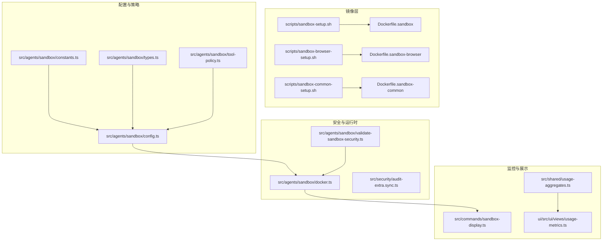
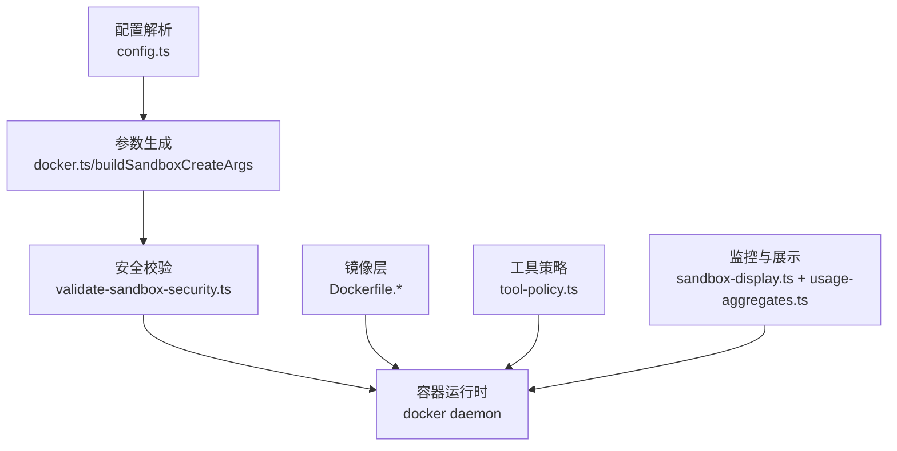
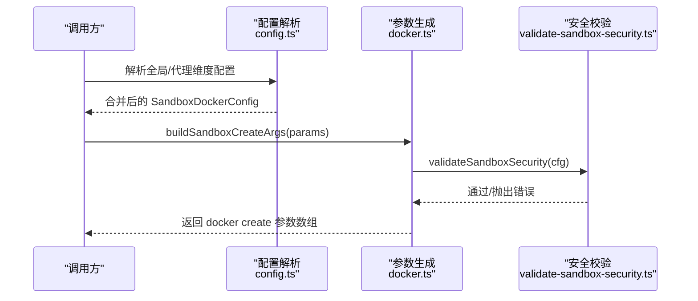
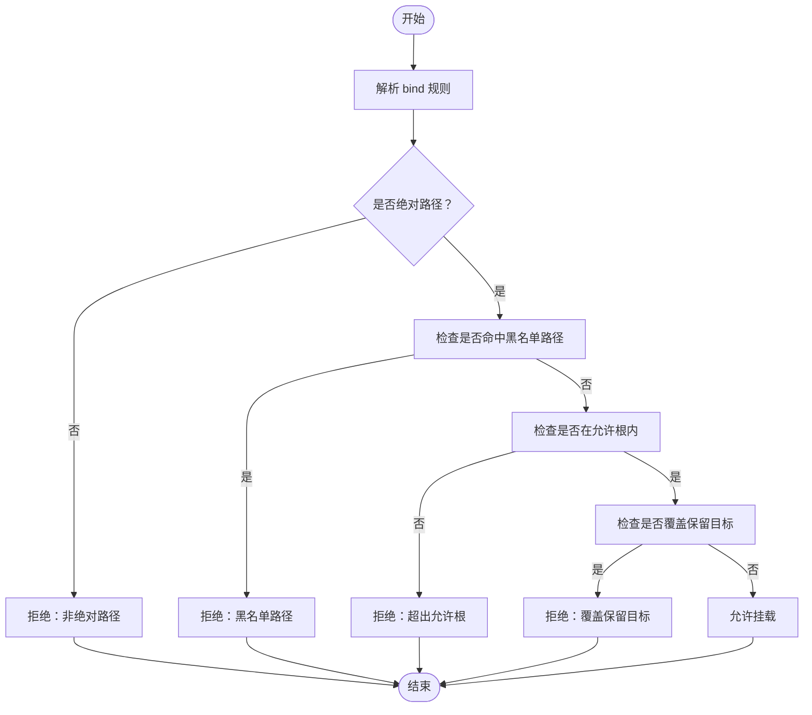
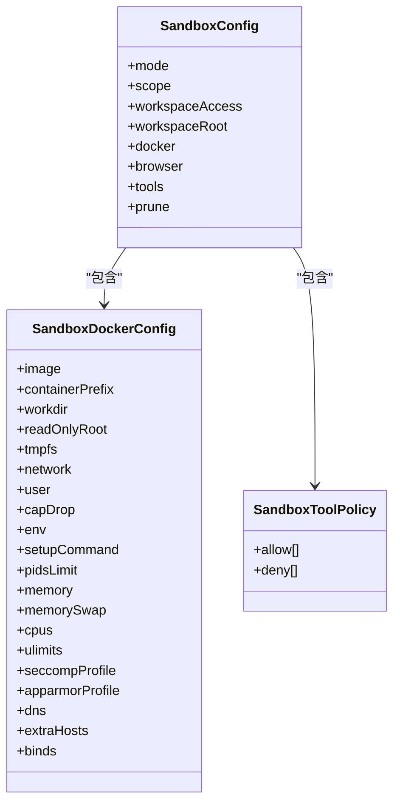
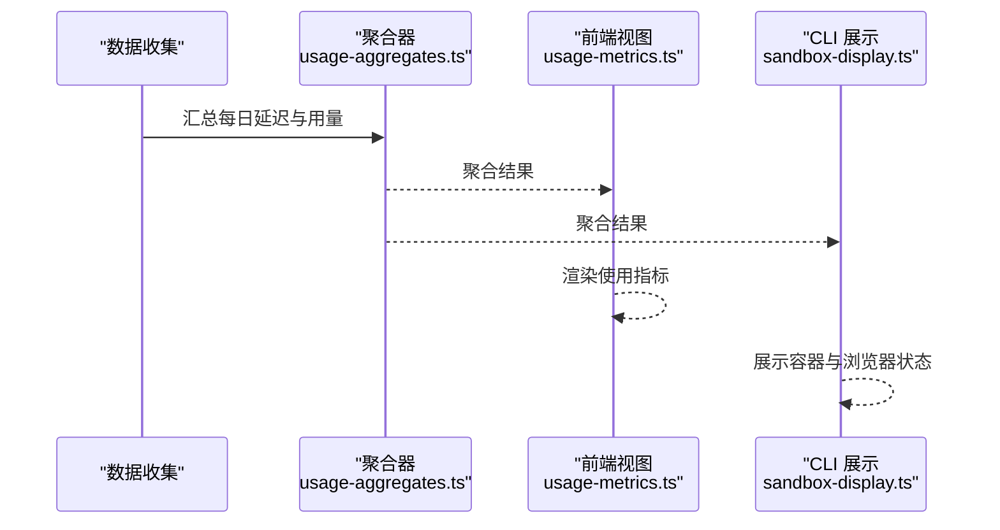
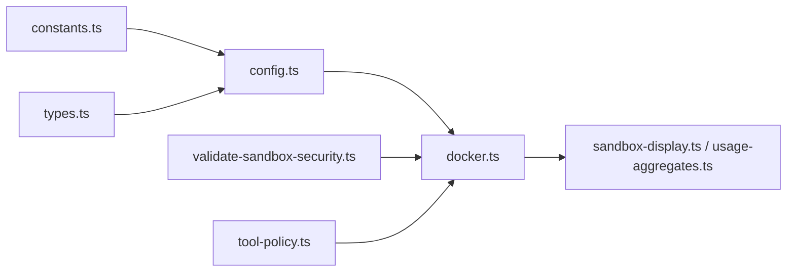

# 沙箱性能优化

<cite>
**本文引用的文件**
- [Dockerfile.sandbox](file://Dockerfile.sandbox)
- [Dockerfile.sandbox-browser](file://Dockerfile.sandbox-browser)
- [Dockerfile.sandbox-common](file://Dockerfile.sandbox-common)
- [scripts/sandbox-setup.sh](file://scripts/sandbox-setup.sh)
- [scripts/sandbox-browser-setup.sh](file://scripts/sandbox-browser-setup.sh)
- [scripts/sandbox-common-setup.sh](file://scripts/sandbox-common-setup.sh)
- [src/agents/sandbox/types.ts](file://src/agents/sandbox/types.ts)
- [src/agents/sandbox/config.ts](file://src/agents/sandbox/config.ts)
- [src/agents/sandbox/constants.ts](file://src/agents/sandbox/constants.ts)
- [src/agents/sandbox/validate-sandbox-security.ts](file://src/agents/sandbox/validate-sandbox-security.ts)
- [src/agents/sandbox/docker.ts](file://src/agents/sandbox/docker.ts)
- [src/agents/sandbox-create-args.test.ts](file://src/agents/sandbox-create-args.test.ts)
- [src/agents/sandbox-merge.test.ts](file://src/agents/sandbox-merge.test.ts)
- [src/agents/sandbox/tool-policy.ts](file://src/agents/sandbox/tool-policy.ts)
- [src/security/audit-extra.sync.ts](file://src/security/audit-extra.sync.ts)
- [src/commands/sandbox-display.ts](file://src/commands/sandbox-display.ts)
- [src/agents/pi-embedded-runner/sandbox-info.ts](file://src/agents/pi-embedded-runner/sandbox-info.ts)
- [src/shared/usage-aggregates.ts](file://src/shared/usage-aggregates.ts)
- [ui/src/ui/views/usage-metrics.ts](file://ui/src/ui/views/usage-metrics.ts)
</cite>

## 目录
1. [简介](#简介)
2. [项目结构](#项目结构)
3. [核心组件](#核心组件)
4. [架构总览](#架构总览)
5. [详细组件分析](#详细组件分析)
6. [依赖关系分析](#依赖关系分析)
7. [性能考量](#性能考量)
8. [故障排查指南](#故障排查指南)
9. [结论](#结论)
10. [附录](#附录)

## 简介
本技术文档聚焦于 OpenClaw 的沙箱性能优化，系统阐述沙箱隔离机制、资源限制管理与执行效率优化策略。文档覆盖路径策略（bind 挂载白名单与保留路径保护）、工具策略（允许/拒绝工具集）与安全策略（Seccomp/AppArmor、网络模式、容器命名空间）对性能与安全的影响；并给出容器化沙箱、进程隔离与资源配额的优化技术，以及在不同执行模式下的调优方案、安全开销控制与隔离强度平衡策略。最后提供监控指标、性能瓶颈分析与资源使用优化的最佳实践。

## 项目结构
围绕沙箱的实现主要分布在以下模块：
- 镜像构建：Dockerfile.sandbox、Dockerfile.sandbox-browser、Dockerfile.sandbox-common 及其构建脚本
- 配置解析与合并：types.ts、config.ts、constants.ts
- 安全校验：validate-sandbox-security.ts
- 容器生命周期与参数生成：docker.ts、create args 测试
- 工具策略：tool-policy.ts
- 审计与可视化：audit-extra.sync.ts、sandbox-display.ts、usage 聚合与 UI 展示

图表来源
- [Dockerfile.sandbox](file://Dockerfile.sandbox#L1-L21)
- [Dockerfile.sandbox-browser](file://Dockerfile.sandbox-browser#L1-L33)
- [Dockerfile.sandbox-common](file://Dockerfile.sandbox-common#L1-L46)
- [scripts/sandbox-setup.sh](file://scripts/sandbox-setup.sh#L1-L8)
- [scripts/sandbox-browser-setup.sh](file://scripts/sandbox-browser-setup.sh#L1-L8)
- [scripts/sandbox-common-setup.sh](file://scripts/sandbox-common-setup.sh#L1-L41)
- [src/agents/sandbox/config.ts](file://src/agents/sandbox/config.ts#L1-L217)
- [src/agents/sandbox/types.ts](file://src/agents/sandbox/types.ts#L1-L91)
- [src/agents/sandbox/constants.ts](file://src/agents/sandbox/constants.ts#L1-L55)
- [src/agents/sandbox/tool-policy.ts](file://src/agents/sandbox/tool-policy.ts#L1-L110)
- [src/agents/sandbox/validate-sandbox-security.ts](file://src/agents/sandbox/validate-sandbox-security.ts#L1-L344)
- [src/agents/sandbox/docker.ts](file://src/agents/sandbox/docker.ts#L164-L341)
- [src/security/audit-extra.sync.ts](file://src/security/audit-extra.sync.ts#L903-L926)
- [src/commands/sandbox-display.ts](file://src/commands/sandbox-display.ts#L53-L90)
- [src/shared/usage-aggregates.ts](file://src/shared/usage-aggregates.ts#L1-L66)
- [ui/src/ui/views/usage-metrics.ts](file://ui/src/ui/views/usage-metrics.ts#L407-L431)

章节来源
- [Dockerfile.sandbox](file://Dockerfile.sandbox#L1-L21)
- [Dockerfile.sandbox-browser](file://Dockerfile.sandbox-browser#L1-L33)
- [Dockerfile.sandbox-common](file://Dockerfile.sandbox-common#L1-L46)
- [scripts/sandbox-setup.sh](file://scripts/sandbox-setup.sh#L1-L8)
- [scripts/sandbox-browser-setup.sh](file://scripts/sandbox-browser-setup.sh#L1-L8)
- [scripts/sandbox-common-setup.sh](file://scripts/sandbox-common-setup.sh#L1-L41)
- [src/agents/sandbox/config.ts](file://src/agents/sandbox/config.ts#L1-L217)
- [src/agents/sandbox/types.ts](file://src/agents/sandbox/types.ts#L1-L91)
- [src/agents/sandbox/constants.ts](file://src/agents/sandbox/constants.ts#L1-L55)
- [src/agents/sandbox/tool-policy.ts](file://src/agents/sandbox/tool-policy.ts#L1-L110)
- [src/agents/sandbox/validate-sandbox-security.ts](file://src/agents/sandbox/validate-sandbox-security.ts#L1-L344)
- [src/agents/sandbox/docker.ts](file://src/agents/sandbox/docker.ts#L164-L341)
- [src/security/audit-extra.sync.ts](file://src/security/audit-extra.sync.ts#L903-L926)
- [src/commands/sandbox-display.ts](file://src/commands/sandbox-display.ts#L53-L90)
- [src/shared/usage-aggregates.ts](file://src/shared/usage-aggregates.ts#L1-L66)
- [ui/src/ui/views/usage-metrics.ts](file://ui/src/ui/views/usage-metrics.ts#L407-L431)

## 核心组件
- 镜像与运行时环境
  - 基础沙箱镜像：最小化 Debian slim，预装常用工具与 Python3，非 root 用户运行，适合通用任务。
  - 浏览器沙箱镜像：在基础镜像上安装 Chromium、VNC/WebSocket 组件，暴露调试端口，支持无头/有头模式。
  - 通用增强镜像：在基础镜像之上安装 Node/npm、pnpm、bun、Linuxbrew 等开发工具链，便于多语言与包管理。
- 配置解析与合并
  - 支持全局与代理维度的 Docker 参数合并（env、ulimits、binds 等），默认启用只读根文件系统、tmpfs、网络 none、能力集降级等硬核安全项。
  - 默认工具策略：允许 exec/process/read/write/edit/patch/image/session 等基础工具，拒绝 browser/canvas/nodes/cron/gateway/各通道等高风险工具。
- 安全校验
  - bind 挂载：严格禁止挂载系统关键目录与 Docker 套接字，支持“允许根”白名单与保留目标路径保护。
  - 网络模式：默认禁用 host 与 container:* 命名空间加入，避免绕过网络隔离。
  - 安全配置：阻止 seccomp/apparmor 使用 unconfined，强制使用自定义配置文件或移除设置。
- 运行时与参数生成
  - 构建容器创建参数时进行安全校验，确保资源限制（CPU、内存、ulimit、pid limit）与安全策略生效。
- 工具策略
  - 基于通配符与组展开的允许/拒绝策略，支持按代理维度覆盖全局策略，并自动注入 image 工具以保障多模态工作流。
- 监控与展示
  - 提供沙箱容器与浏览器容器的列表、状态、年龄与空闲时间等信息；聚合使用指标（延迟、总量）用于性能评估。

章节来源
- [Dockerfile.sandbox](file://Dockerfile.sandbox#L1-L21)
- [Dockerfile.sandbox-browser](file://Dockerfile.sandbox-browser#L1-L33)
- [Dockerfile.sandbox-common](file://Dockerfile.sandbox-common#L1-L46)
- [src/agents/sandbox/config.ts](file://src/agents/sandbox/config.ts#L76-L120)
- [src/agents/sandbox/tool-policy.ts](file://src/agents/sandbox/tool-policy.ts#L35-L110)
- [src/agents/sandbox/validate-sandbox-security.ts](file://src/agents/sandbox/validate-sandbox-security.ts#L328-L344)
- [src/agents/sandbox/docker.ts](file://src/agents/sandbox/docker.ts#L315-L341)
- [src/commands/sandbox-display.ts](file://src/commands/sandbox-display.ts#L53-L90)
- [src/shared/usage-aggregates.ts](file://src/shared/usage-aggregates.ts#L32-L66)
- [ui/src/ui/views/usage-metrics.ts](file://ui/src/ui/views/usage-metrics.ts#L407-L431)

## 架构总览
下图展示了从配置到运行时的沙箱架构，包括镜像层、配置层、安全校验层与运行时层之间的交互。

图表来源
- [src/agents/sandbox/config.ts](file://src/agents/sandbox/config.ts#L76-L120)
- [src/agents/sandbox/docker.ts](file://src/agents/sandbox/docker.ts#L315-L341)
- [src/agents/sandbox/validate-sandbox-security.ts](file://src/agents/sandbox/validate-sandbox-security.ts#L328-L344)
- [Dockerfile.sandbox](file://Dockerfile.sandbox#L1-L21)
- [Dockerfile.sandbox-browser](file://Dockerfile.sandbox-browser#L1-L33)
- [Dockerfile.sandbox-common](file://Dockerfile.sandbox-common#L1-L46)
- [src/agents/sandbox/tool-policy.ts](file://src/agents/sandbox/tool-policy.ts#L35-L110)
- [src/commands/sandbox-display.ts](file://src/commands/sandbox-display.ts#L53-L90)
- [src/shared/usage-aggregates.ts](file://src/shared/usage-aggregates.ts#L32-L66)

## 详细组件分析

### 组件A：容器创建参数与资源限制
- 参数生成流程
  - 输入：沙箱名称、配置对象、作用域键、创建时间戳、标签、配置哈希、是否包含自定义 binds、允许的宿主根、危险开关等。
  - 输出：符合安全策略的 docker create 参数数组。
- 关键点
  - 安全校验前置：在生成参数前调用 validateSandboxSecurity，阻断不安全的 binds、网络模式与安全配置。
  - 资源限制：pidsLimit、memory/memorySwap、cpus、ulimits（nofile/nproc/core）等通过配置合并后注入。
  - 文件系统：默认只读根文件系统、tmpfs、可选 workspace 挂载。
  - 网络：默认 none，浏览器容器可覆盖为自定义桥接网络。
- 性能影响
  - 合理设置 CPU 与内存上限可避免资源争抢与 OOM；ulimit 控制文件句柄与进程数，防止“文件描述符泄露”导致性能退化。
  - tmpfs 临时文件系统可显著降低磁盘 IO 开销，但需注意容量规划。

图表来源
- [src/agents/sandbox/config.ts](file://src/agents/sandbox/config.ts#L76-L120)
- [src/agents/sandbox/docker.ts](file://src/agents/sandbox/docker.ts#L315-L341)
- [src/agents/sandbox/validate-sandbox-security.ts](file://src/agents/sandbox/validate-sandbox-security.ts#L328-L344)

章节来源
- [src/agents/sandbox/docker.ts](file://src/agents/sandbox/docker.ts#L315-L341)
- [src/agents/sandbox-create-args.test.ts](file://src/agents/sandbox-create-args.test.ts#L40-L249)
- [src/agents/sandbox-merge.test.ts](file://src/agents/sandbox-merge.test.ts#L1-L35)

### 组件B：路径策略与安全边界
- 路径策略
  - 禁止挂载系统关键目录与 Docker 套接字路径；支持“允许根”白名单；保留目标路径（如 /workspace、/agent）不可被用户挂载覆盖。
  - 对非绝对路径、越权挂载、覆盖系统根等行为进行拦截。
- 安全审计
  - 审计器检测 seccomp/apparmor 是否为 unconfined，若为则标记严重风险并提示修复。
- 性能与安全平衡
  - 严格的路径策略会减少潜在攻击面，但可能增加配置复杂度；建议通过“允许根”白名单与危险开关的显式授权来平衡可用性与安全。

图表来源
- [src/agents/sandbox/validate-sandbox-security.ts](file://src/agents/sandbox/validate-sandbox-security.ts#L96-L180)

章节来源
- [src/agents/sandbox/validate-sandbox-security.ts](file://src/agents/sandbox/validate-sandbox-security.ts#L1-L344)
- [src/security/audit-extra.sync.ts](file://src/security/audit-extra.sync.ts#L903-L926)

### 组件C：工具策略与执行模式
- 工具策略
  - 允许/拒绝均基于通配符与组展开；全局与代理维度合并，代理优先；默认允许基础工具，拒绝高风险工具。
  - 自动注入 image 工具，保证多模态场景可用。
- 执行模式
  - 模式选择：off/non-main/all；作用域：session/agent/shared；工作区访问：none/ro/rw。
- 性能影响
  - 精准的工具策略可减少不必要的权限检查与工具加载开销；在“共享”作用域下可复用容器，降低冷启动成本。

图表来源
- [src/agents/sandbox/types.ts](file://src/agents/sandbox/types.ts#L55-L91)
- [src/agents/sandbox/config.ts](file://src/agents/sandbox/config.ts#L76-L120)
- [src/agents/sandbox/tool-policy.ts](file://src/agents/sandbox/tool-policy.ts#L35-L110)

章节来源
- [src/agents/sandbox/types.ts](file://src/agents/sandbox/types.ts#L1-L91)
- [src/agents/sandbox/config.ts](file://src/agents/sandbox/config.ts#L63-L168)
- [src/agents/sandbox/tool-policy.ts](file://src/agents/sandbox/tool-policy.ts#L1-L110)

### 组件D：监控与性能指标
- 指标采集
  - 使用聚合函数合并每日延迟与用量统计，支持按代理、渠道等维度汇总。
- 可视化
  - CLI 命令展示沙箱容器与浏览器容器的状态、镜像匹配、端口、年龄与空闲时间等。
- 性能分析
  - 结合延迟与用量趋势识别热点代理、高负载工具与长时间空闲容器，指导资源配额与清理策略。

图表来源
- [src/shared/usage-aggregates.ts](file://src/shared/usage-aggregates.ts#L32-L66)
- [ui/src/ui/views/usage-metrics.ts](file://ui/src/ui/views/usage-metrics.ts#L407-L431)
- [src/commands/sandbox-display.ts](file://src/commands/sandbox-display.ts#L53-L90)

章节来源
- [src/shared/usage-aggregates.ts](file://src/shared/usage-aggregates.ts#L1-L66)
- [ui/src/ui/views/usage-metrics.ts](file://ui/src/ui/views/usage-metrics.ts#L407-L431)
- [src/commands/sandbox-display.ts](file://src/commands/sandbox-display.ts#L53-L90)

## 依赖关系分析
- 配置层依赖常量与类型定义，决定默认值与作用域策略。
- 运行时依赖配置层输出的参数，同时在创建前进行安全校验。
- 工具策略独立于运行时，但在运行时生效，影响工具调用路径与权限检查。
- 监控层与运行时解耦，通过聚合与展示组件获取指标。

图表来源
- [src/agents/sandbox/constants.ts](file://src/agents/sandbox/constants.ts#L1-L55)
- [src/agents/sandbox/types.ts](file://src/agents/sandbox/types.ts#L1-L91)
- [src/agents/sandbox/config.ts](file://src/agents/sandbox/config.ts#L1-L217)
- [src/agents/sandbox/docker.ts](file://src/agents/sandbox/docker.ts#L164-L341)
- [src/agents/sandbox/validate-sandbox-security.ts](file://src/agents/sandbox/validate-sandbox-security.ts#L1-L344)
- [src/agents/sandbox/tool-policy.ts](file://src/agents/sandbox/tool-policy.ts#L1-L110)
- [src/commands/sandbox-display.ts](file://src/commands/sandbox-display.ts#L53-L90)
- [src/shared/usage-aggregates.ts](file://src/shared/usage-aggregates.ts#L1-L66)

章节来源
- [src/agents/sandbox/config.ts](file://src/agents/sandbox/config.ts#L1-L217)
- [src/agents/sandbox/docker.ts](file://src/agents/sandbox/docker.ts#L164-L341)
- [src/agents/sandbox/validate-sandbox-security.ts](file://src/agents/sandbox/validate-sandbox-security.ts#L1-L344)
- [src/agents/sandbox/tool-policy.ts](file://src/agents/sandbox/tool-policy.ts#L1-L110)
- [src/agents/sandbox/constants.ts](file://src/agents/sandbox/constants.ts#L1-L55)
- [src/agents/sandbox/types.ts](file://src/agents/sandbox/types.ts#L1-L91)

## 性能考量
- 容器化沙箱
  - 使用只读根文件系统与 tmpfs 减少持久化 IO；合理设置 tmpfs 大小，避免频繁写入导致 swap 或慢盘。
  - 将常用工具与依赖放入通用镜像，减少重复安装带来的冷启动时间。
- 进程隔离与资源配额
  - 设置 pidsLimit 与 ulimits（nofile/nproc）防止资源耗尽；CPU 与内存限制避免“大胃王”影响其他容器。
  - 在“共享”作用域下复用容器，降低创建/销毁开销；结合清理策略（空闲/最大存活时间）回收资源。
- 不同执行模式的调优
  - off：完全不启用沙箱，性能最优但无隔离；仅适用于受信环境。
  - non-main：仅在非主线程/非关键路径启用，降低对主流程的影响。
  - all：全面启用沙箱，配合严格的工具策略与资源限制，兼顾安全与性能。
- 安全开销与隔离强度平衡
  - Seccomp/AppArmor 会带来一定系统调用过滤与策略评估开销；建议使用自定义配置文件而非 unconfined。
  - 网络 none 可显著降低网络栈开销与逃逸风险；浏览器容器按需开启桥接网络。
- 最佳实践
  - 为高负载代理单独分配容器与资源配额；为低频工具使用“按需启动+自动清理”策略。
  - 使用“允许根”白名单集中管理数据挂载，减少安全检查次数。
  - 定期审查工具策略与镜像大小，保持最小化与可维护性。

## 故障排查指南
- 常见问题定位
  - bind 挂载失败：检查是否命中黑名单路径、是否超出允许根、是否覆盖保留目标路径。
  - 网络模式异常：确认未使用 host 或 container:*；必要时启用自定义桥接网络。
  - 安全配置风险：避免使用 unconfined 的 seccomp/apparmor；使用自定义策略文件。
- 运行时诊断
  - 通过 CLI 命令查看容器与浏览器状态、镜像匹配、端口、年龄与空闲时间，快速定位异常容器。
  - 结合使用指标（延迟、用量）判断是否存在资源瓶颈或工具滥用。
- 修复建议
  - 调整 allowedSourceRoots 与危险开关，确保合规前提下的可用性。
  - 优化工具策略，移除不必要的高风险工具；为特定代理放宽限制并加注审计日志。
  - 调整资源配额（CPU/内存/pids/nofile）并启用自动清理策略。

章节来源
- [src/agents/sandbox/validate-sandbox-security.ts](file://src/agents/sandbox/validate-sandbox-security.ts#L182-L227)
- [src/security/audit-extra.sync.ts](file://src/security/audit-extra.sync.ts#L903-L926)
- [src/commands/sandbox-display.ts](file://src/commands/sandbox-display.ts#L53-L90)

## 结论
OpenClaw 的沙箱体系通过“最小镜像 + 默认安全 + 可配置策略”的组合，在保证强隔离的同时提供了良好的性能弹性。通过对路径策略、工具策略与安全策略的精细化治理，可在不同执行模式下实现性能与安全的动态平衡。配合监控与清理策略，可有效降低资源浪费与安全风险，提升整体系统的稳定性与可运维性。

## 附录
- 镜像构建脚本
  - 基础沙箱镜像：scripts/sandbox-setup.sh
  - 浏览器沙箱镜像：scripts/sandbox-browser-setup.sh
  - 通用增强镜像：scripts/sandbox-common-setup.sh
- 关键配置参考
  - 默认镜像、容器前缀、工作目录、默认工具允许/拒绝列表、浏览器端口与网络等常量定义位于 constants.ts。
- 运行时入口
  - 容器创建参数生成与执行封装位于 docker.ts；安全校验位于 validate-sandbox-security.ts。

章节来源
- [scripts/sandbox-setup.sh](file://scripts/sandbox-setup.sh#L1-L8)
- [scripts/sandbox-browser-setup.sh](file://scripts/sandbox-browser-setup.sh#L1-L8)
- [scripts/sandbox-common-setup.sh](file://scripts/sandbox-common-setup.sh#L1-L41)
- [src/agents/sandbox/constants.ts](file://src/agents/sandbox/constants.ts#L1-L55)
- [src/agents/sandbox/docker.ts](file://src/agents/sandbox/docker.ts#L164-L341)
- [src/agents/sandbox/validate-sandbox-security.ts](file://src/agents/sandbox/validate-sandbox-security.ts#L1-L344)