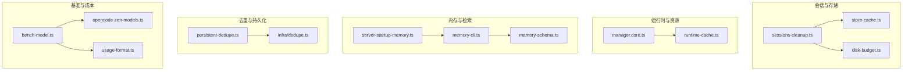
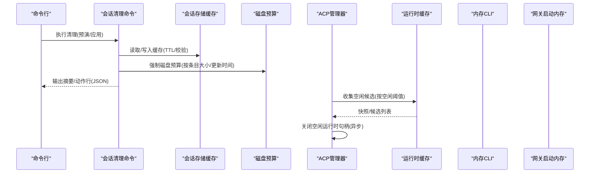
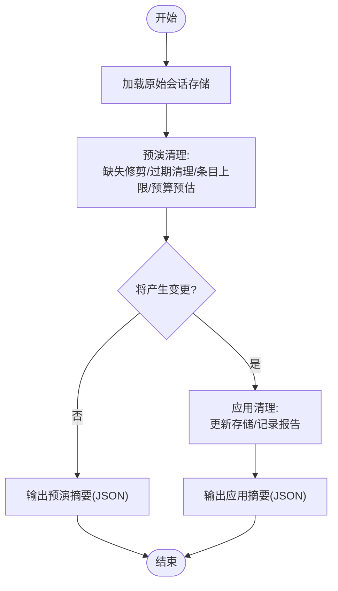
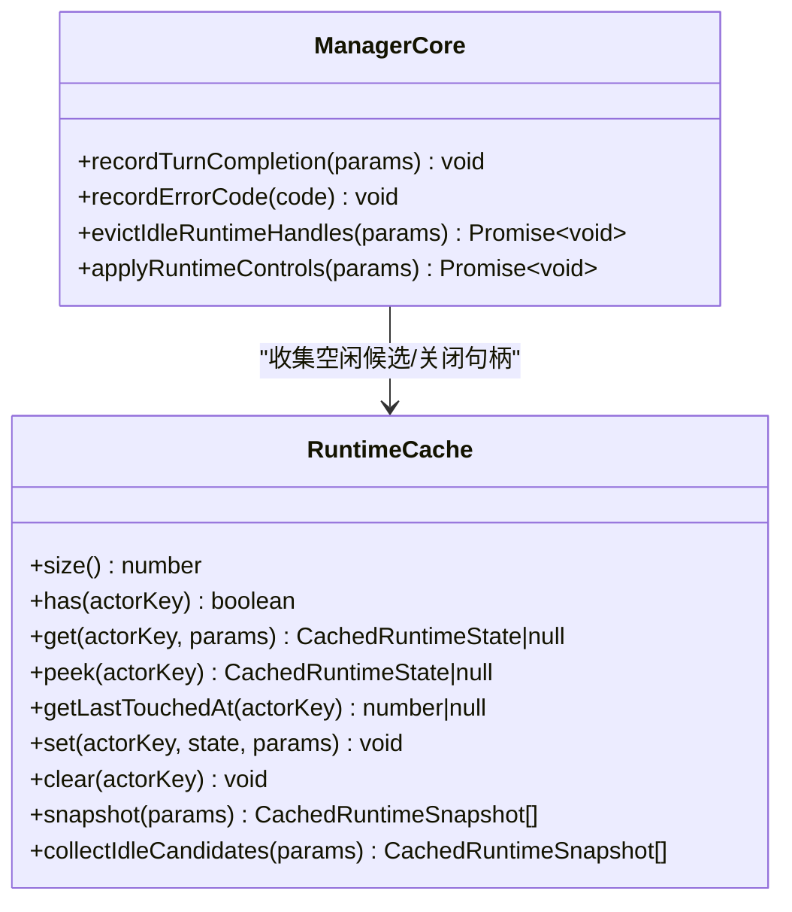
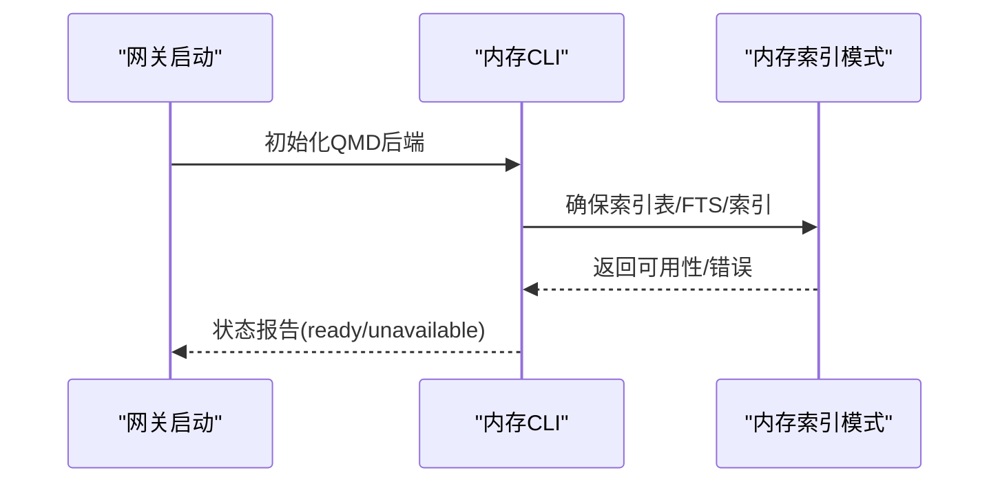
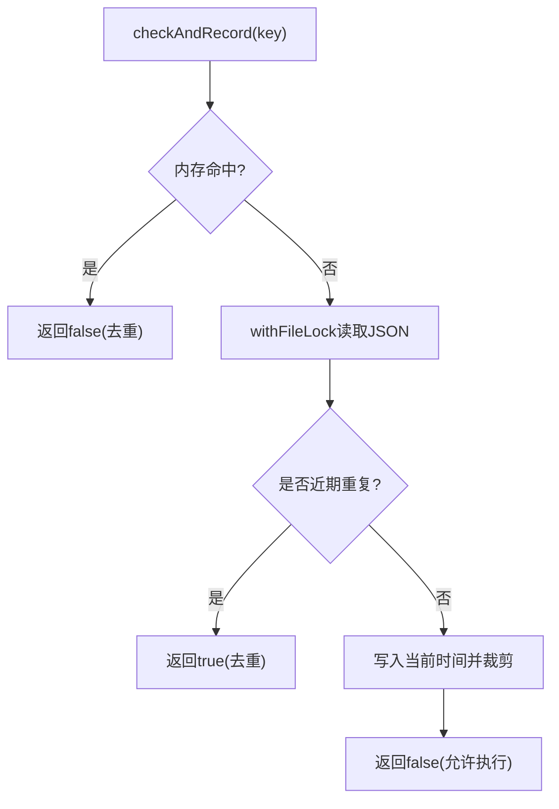
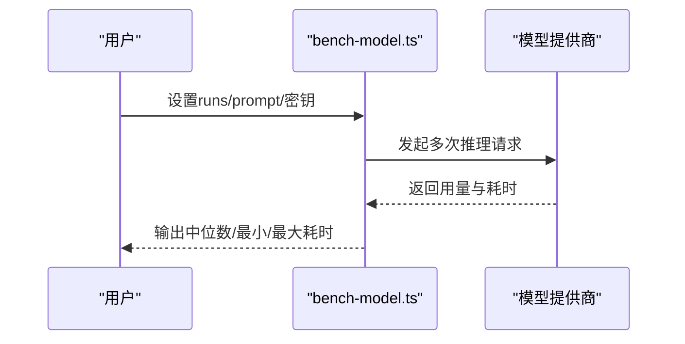
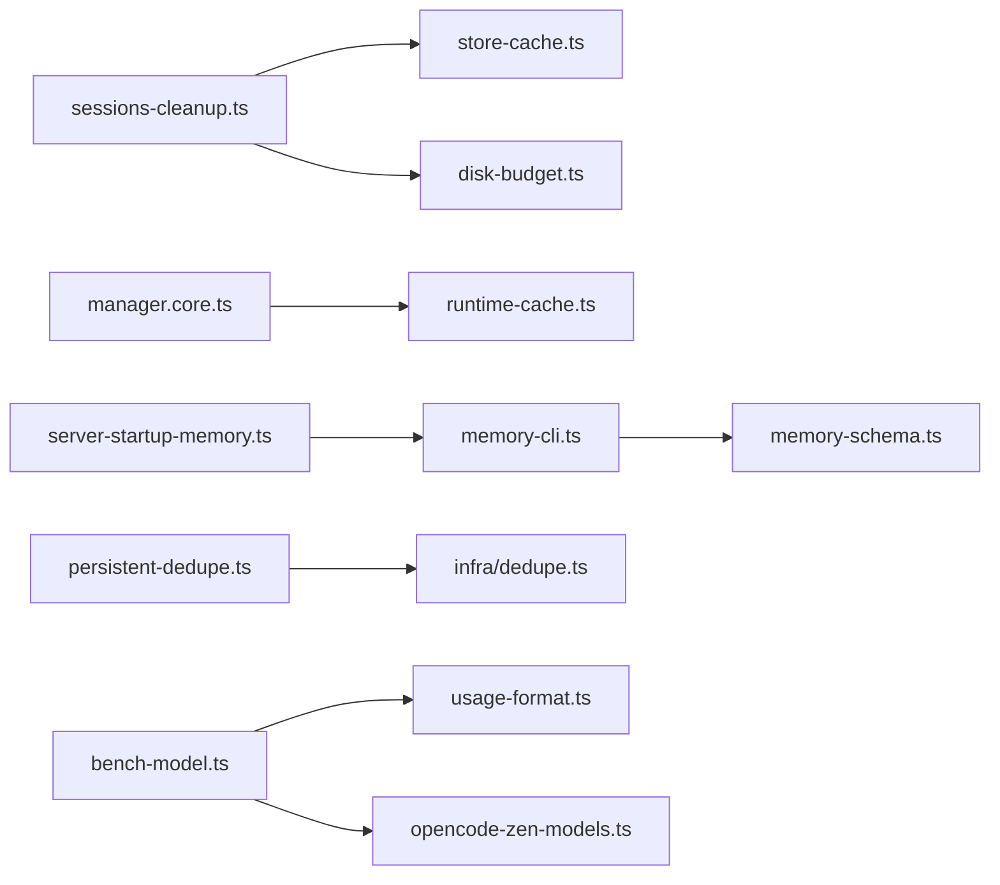

# 性能问题

<cite>
**本文引用的文件**
- [scripts/bench-model.ts](file://scripts/bench-model.ts)
- [src/commands/sessions-cleanup.ts](file://src/commands/sessions-cleanup.ts)
- [src/config/sessions/store-cache.ts](file://src/config/sessions/store-cache.ts)
- [src/config/sessions/disk-budget.ts](file://src/config/sessions/disk-budget.ts)
- [src/acp/control-plane/runtime-cache.ts](file://src/acp/control-plane/runtime-cache.ts)
- [src/acp/control-plane/manager.core.ts](file://src/acp/control-plane/manager.core.ts)
- [src/plugin-sdk/persistent-dedupe.ts](file://src/plugin-sdk/persistent-dedupe.ts)
- [src/infra/dedupe.ts](file://src/infra/dedupe.ts)
- [src/memory/memory-schema.ts](file://src/memory/memory-schema.ts)
- [src/cli/memory-cli.ts](file://src/cli/memory-cli.ts)
- [src/gateway/server-startup-memory.ts](file://src/gateway/server-startup-memory.ts)
- [src/commands/doctor-memory-search.ts](file://src/commands/doctor-memory-search.ts)
- [src/utils/usage-format.ts](file://src/utils/usage-format.ts)
- [src/agents/opencode-zen-models.ts](file://src/agents/opencode-zen-models.ts)
- [src/gateway/gateway-models.profiles.live.test.ts](file://src/gateway/gateway-models.profiles.live.test.ts)
</cite>

## 目录
1. [简介](#简介)
2. [项目结构](#项目结构)
3. [核心组件](#核心组件)
4. [架构总览](#架构总览)
5. [详细组件分析](#详细组件分析)
6. [依赖关系分析](#依赖关系分析)
7. [性能考量](#性能考量)
8. [故障排查指南](#故障排查指南)
9. [结论](#结论)
10. [附录](#附录)

## 简介
本指南聚焦于OpenClaw在运行时的性能问题诊断与优化，覆盖内存使用监控、垃圾回收与资源清理策略；会话压缩、缓存管理与存储优化；CPU占用过高、内存泄漏与响应延迟的定位方法；大模型推理性能优化、并发能力与I/O瓶颈的解决方案，并建立性能基准测试与监控告警机制。文档基于仓库中实际实现进行分析，提供可操作的建议与可视化图示。

## 项目结构
围绕性能主题的关键模块包括：
- 会话存储与维护：会话清理命令、会话存储缓存、磁盘配额与压缩
- 运行时与资源管理：ACP运行时缓存、空闲驱逐、并发控制
- 内存与检索：内存索引模式、向量化与FTS、CLI状态检查
- 去重与持久化：内存去重缓存、持久化去重（文件锁）
- 基准测试与成本估算：模型推理基准脚本、用量与费用格式化

**图表来源**
- [src/commands/sessions-cleanup.ts](file://src/commands/sessions-cleanup.ts#L1-L469)
- [src/config/sessions/store-cache.ts](file://src/config/sessions/store-cache.ts#L1-L82)
- [src/config/sessions/disk-budget.ts](file://src/config/sessions/disk-budget.ts#L50-L89)
- [src/acp/control-plane/runtime-cache.ts](file://src/acp/control-plane/runtime-cache.ts#L1-L100)
- [src/acp/control-plane/manager.core.ts](file://src/acp/control-plane/manager.core.ts#L1142-L1220)
- [src/cli/memory-cli.ts](file://src/cli/memory-cli.ts#L1-L813)
- [src/memory/memory-schema.ts](file://src/memory/memory-schema.ts#L1-L97)
- [src/gateway/server-startup-memory.ts](file://src/gateway/server-startup-memory.ts#L1-L31)
- [src/plugin-sdk/persistent-dedupe.ts](file://src/plugin-sdk/persistent-dedupe.ts#L1-L190)
- [src/infra/dedupe.ts](file://src/infra/dedupe.ts#L1-L80)
- [scripts/bench-model.ts](file://scripts/bench-model.ts#L1-L147)
- [src/utils/usage-format.ts](file://src/utils/usage-format.ts#L46-L86)
- [src/agents/opencode-zen-models.ts](file://src/agents/opencode-zen-models.ts#L119-L167)

**章节来源**
- [src/commands/sessions-cleanup.ts](file://src/commands/sessions-cleanup.ts#L1-L469)
- [src/config/sessions/store-cache.ts](file://src/config/sessions/store-cache.ts#L1-L82)
- [src/config/sessions/disk-budget.ts](file://src/config/sessions/disk-budget.ts#L50-L89)
- [src/acp/control-plane/runtime-cache.ts](file://src/acp/control-plane/runtime-cache.ts#L1-L100)
- [src/acp/control-plane/manager.core.ts](file://src/acp/control-plane/manager.core.ts#L1142-L1220)
- [src/cli/memory-cli.ts](file://src/cli/memory-cli.ts#L1-L813)
- [src/memory/memory-schema.ts](file://src/memory/memory-schema.ts#L1-L97)
- [src/gateway/server-startup-memory.ts](file://src/gateway/server-startup-memory.ts#L1-L31)
- [src/plugin-sdk/persistent-dedupe.ts](file://src/plugin-sdk/persistent-dedupe.ts#L1-L190)
- [src/infra/dedupe.ts](file://src/infra/dedupe.ts#L1-L80)
- [scripts/bench-model.ts](file://scripts/bench-model.ts#L1-L147)
- [src/utils/usage-format.ts](file://src/utils/usage-format.ts#L46-L86)
- [src/agents/opencode-zen-models.ts](file://src/agents/opencode-zen-models.ts#L119-L167)

## 核心组件
- 会话清理与存储优化
  - 会话清理命令：按维护策略预演或应用清理（缺失会话修剪、过期清理、条目上限、磁盘预算强制），并输出JSON摘要
  - 会话存储缓存：对象与序列化缓存，带TTL与mtime/size校验，支持失效与清空
  - 磁盘预算：按条目大小映射与更新时间排序，优先移除旧条目，保障总字节不超过阈值
- 运行时与资源管理
  - 运行时缓存：LRU式最近使用时间记录，快照与空闲候选收集，用于定期驱逐
  - ACP管理器：统计回合耗时、失败计数，按空闲阈值异步关闭空闲运行时句柄
- 内存与检索
  - 内存CLI：状态检查、深度探测（向量/嵌入）、索引重建、进度与错误报告
  - 内存索引模式：SQLite表结构、FTS虚拟表、索引列与更新时间索引
  - 网关启动内存后端：按代理启用QMD后端并初始化
- 去重与持久化
  - 内存去重缓存：TTL与最大容量裁剪，支持peek/check/清空/大小查询
  - 持久化去重：文件锁保护的JSON写入，支持TTL与文件条目上限裁剪
- 基准测试与成本
  - 基准脚本：多轮推理计时、中位数统计、用量采集
  - 成本格式化：输入/输出/缓存读写计费配置与估算

**章节来源**
- [src/commands/sessions-cleanup.ts](file://src/commands/sessions-cleanup.ts#L58-L240)
- [src/config/sessions/store-cache.ts](file://src/config/sessions/store-cache.ts#L41-L81)
- [src/config/sessions/disk-budget.ts](file://src/config/sessions/disk-budget.ts#L50-L89)
- [src/acp/control-plane/runtime-cache.ts](file://src/acp/control-plane/runtime-cache.ts#L25-L99)
- [src/acp/control-plane/manager.core.ts](file://src/acp/control-plane/manager.core.ts#L1142-L1201)
- [src/cli/memory-cli.ts](file://src/cli/memory-cli.ts#L335-L574)
- [src/memory/memory-schema.ts](file://src/memory/memory-schema.ts#L3-L82)
- [src/gateway/server-startup-memory.ts](file://src/gateway/server-startup-memory.ts#L7-L30)
- [src/infra/dedupe.ts](file://src/infra/dedupe.ts#L15-L79)
- [src/plugin-sdk/persistent-dedupe.ts](file://src/plugin-sdk/persistent-dedupe.ts#L94-L189)
- [scripts/bench-model.ts](file://scripts/bench-model.ts#L50-L147)
- [src/utils/usage-format.ts](file://src/utils/usage-format.ts#L46-L86)

## 架构总览
下图展示性能相关组件之间的交互：会话清理命令调用存储缓存与磁盘预算，运行时管理器通过运行时缓存进行空闲驱逐，内存CLI与网关启动共同保障检索可用性，去重组件贯穿内存与持久化层，基准脚本与成本工具支撑评估与优化。

**图表来源**
- [src/commands/sessions-cleanup.ts](file://src/commands/sessions-cleanup.ts#L158-L240)
- [src/config/sessions/store-cache.ts](file://src/config/sessions/store-cache.ts#L41-L81)
- [src/config/sessions/disk-budget.ts](file://src/config/sessions/disk-budget.ts#L50-L89)
- [src/acp/control-plane/manager.core.ts](file://src/acp/control-plane/manager.core.ts#L1159-L1201)
- [src/acp/control-plane/runtime-cache.ts](file://src/acp/control-plane/runtime-cache.ts#L78-L99)

## 详细组件分析

### 会话清理与存储优化
- 预演与应用流程
  - 预演阶段：加载原始存储，计算缺失会话修剪、过期清理、条目上限与磁盘预算后的结果，汇总wouldMutate
  - 应用阶段：按维护配置更新存储，记录应用报告，输出最终计数
- 存储缓存
  - 结构化克隆返回，避免外部修改影响缓存；TTL过期与mtime/size不一致自动失效
- 磁盘预算
  - 条目大小映射与更新时间排序，优先移除旧条目，确保总字节下降

**图表来源**
- [src/commands/sessions-cleanup.ts](file://src/commands/sessions-cleanup.ts#L158-L240)
- [src/config/sessions/store-cache.ts](file://src/config/sessions/store-cache.ts#L41-L81)
- [src/config/sessions/disk-budget.ts](file://src/config/sessions/disk-budget.ts#L50-L89)

**章节来源**
- [src/commands/sessions-cleanup.ts](file://src/commands/sessions-cleanup.ts#L58-L240)
- [src/config/sessions/store-cache.ts](file://src/config/sessions/store-cache.ts#L41-L81)
- [src/config/sessions/disk-budget.ts](file://src/config/sessions/disk-budget.ts#L50-L89)

### 运行时缓存与空闲驱逐
- 运行时缓存
  - 记录最近触摸时间，支持快照与空闲候选收集
- 空闲驱逐
  - 管理器按空闲阈值收集候选，异步关闭空闲运行时句柄，记录驱逐次数与时间

**图表来源**
- [src/acp/control-plane/runtime-cache.ts](file://src/acp/control-plane/runtime-cache.ts#L25-L99)
- [src/acp/control-plane/manager.core.ts](file://src/acp/control-plane/manager.core.ts#L1142-L1201)

**章节来源**
- [src/acp/control-plane/runtime-cache.ts](file://src/acp/control-plane/runtime-cache.ts#L25-L99)
- [src/acp/control-plane/manager.core.ts](file://src/acp/control-plane/manager.core.ts#L1142-L1201)

### 内存与检索：索引、FTS与CLI
- 内存索引模式
  - SQLite表结构：meta、files、chunks、embeddingCache；FTS虚拟表按需创建；索引列与更新时间索引
- 内存CLI
  - 状态检查：提供者、模型、索引文件、工作区、来源分布、向量/FTS/嵌入缓存状态、批处理状态、回退信息
  - 深度探测：向量可用性、嵌入可用性；索引重建与进度反馈
- 网关启动内存后端
  - 针对QMD后端初始化，记录日志

**图表来源**
- [src/gateway/server-startup-memory.ts](file://src/gateway/server-startup-memory.ts#L7-L30)
- [src/cli/memory-cli.ts](file://src/cli/memory-cli.ts#L335-L574)
- [src/memory/memory-schema.ts](file://src/memory/memory-schema.ts#L3-L82)

**章节来源**
- [src/memory/memory-schema.ts](file://src/memory/memory-schema.ts#L3-L82)
- [src/cli/memory-cli.ts](file://src/cli/memory-cli.ts#L335-L574)
- [src/gateway/server-startup-memory.ts](file://src/gateway/server-startup-memory.ts#L7-L30)

### 去重与持久化：内存与文件锁
- 内存去重缓存
  - TTL过期与最大容量裁剪，check/peek行为区分是否触碰时间戳
- 持久化去重
  - 文件锁保护JSON写入，TTL与文件条目上限裁剪，支持热身加载

**图表来源**
- [src/plugin-sdk/persistent-dedupe.ts](file://src/plugin-sdk/persistent-dedupe.ts#L102-L134)
- [src/infra/dedupe.ts](file://src/infra/dedupe.ts#L15-L79)

**章节来源**
- [src/infra/dedupe.ts](file://src/infra/dedupe.ts#L15-L79)
- [src/plugin-sdk/persistent-dedupe.ts](file://src/plugin-sdk/persistent-dedupe.ts#L94-L189)

### 基准测试与成本估算
- 基准脚本
  - 多轮推理计时、中位数统计、用量采集；支持参数解析与环境变量
- 成本估算
  - 输入/输出/缓存读写计费配置与估算函数

**图表来源**
- [scripts/bench-model.ts](file://scripts/bench-model.ts#L50-L147)
- [src/utils/usage-format.ts](file://src/utils/usage-format.ts#L46-L86)
- [src/agents/opencode-zen-models.ts](file://src/agents/opencode-zen-models.ts#L119-L167)

**章节来源**
- [scripts/bench-model.ts](file://scripts/bench-model.ts#L50-L147)
- [src/utils/usage-format.ts](file://src/utils/usage-format.ts#L46-L86)
- [src/agents/opencode-zen-models.ts](file://src/agents/opencode-zen-models.ts#L119-L167)

## 依赖关系分析
- 会话清理命令依赖存储缓存与磁盘预算模块，形成“预演—应用”的闭环
- 运行时管理器依赖运行时缓存进行空闲驱逐，降低资源占用
- 内存CLI与网关启动共同保障检索后端可用性
- 去重组件在内存与持久化层分别提供快速与可靠去重
- 基准脚本与成本工具为性能优化提供数据支撑

**图表来源**
- [src/commands/sessions-cleanup.ts](file://src/commands/sessions-cleanup.ts#L1-L469)
- [src/config/sessions/store-cache.ts](file://src/config/sessions/store-cache.ts#L1-L82)
- [src/config/sessions/disk-budget.ts](file://src/config/sessions/disk-budget.ts#L50-L89)
- [src/acp/control-plane/manager.core.ts](file://src/acp/control-plane/manager.core.ts#L1142-L1220)
- [src/acp/control-plane/runtime-cache.ts](file://src/acp/control-plane/runtime-cache.ts#L1-L100)
- [src/cli/memory-cli.ts](file://src/cli/memory-cli.ts#L1-L813)
- [src/memory/memory-schema.ts](file://src/memory/memory-schema.ts#L1-L97)
- [src/gateway/server-startup-memory.ts](file://src/gateway/server-startup-memory.ts#L1-L31)
- [src/plugin-sdk/persistent-dedupe.ts](file://src/plugin-sdk/persistent-dedupe.ts#L1-L190)
- [src/infra/dedupe.ts](file://src/infra/dedupe.ts#L1-L80)
- [scripts/bench-model.ts](file://scripts/bench-model.ts#L1-L147)
- [src/utils/usage-format.ts](file://src/utils/usage-format.ts#L46-L86)
- [src/agents/opencode-zen-models.ts](file://src/agents/opencode-zen-models.ts#L119-L167)

**章节来源**
- [src/commands/sessions-cleanup.ts](file://src/commands/sessions-cleanup.ts#L1-L469)
- [src/acp/control-plane/manager.core.ts](file://src/acp/control-plane/manager.core.ts#L1142-L1220)
- [src/cli/memory-cli.ts](file://src/cli/memory-cli.ts#L1-L813)

## 性能考量
- 内存使用监控
  - 使用内存CLI的状态输出识别向量/FTS/嵌入缓存状态，结合磁盘预算与会话存储缓存，避免索引与会话数据膨胀
- 垃圾回收与资源清理
  - 启用会话清理命令的预演与应用，定期强制磁盘预算；运行时管理器按空闲阈值驱逐空闲运行时
- 缓存管理
  - 调整会话存储缓存TTL与失效策略；合理设置去重缓存TTL与最大容量，平衡命中率与内存占用
- 并发与I/O
  - 控制同时进行的索引重建与批量操作；利用文件锁保护持久化去重，避免竞态
- 大模型推理
  - 使用基准脚本对比不同模型/供应商的中位耗时；结合成本估算工具评估输入/输出/缓存读写成本

[本节为通用指导，无需列出具体文件来源]

## 故障排查指南
- CPU使用率过高
  - 检查是否存在大量并发索引重建或批量操作；通过内存CLI查看批处理状态与失败次数
  - 审核会话清理命令的磁盘预算扫描范围，避免全量扫描导致I/O与CPU压力
- 内存泄漏
  - 确认运行时缓存的空闲驱逐是否生效；检查去重缓存内存清理接口调用
  - 核对内存索引模式的表与索引是否正确创建，避免重复初始化
- 响应延迟
  - 使用内存CLI进行深度探测，确认向量/嵌入可用性；若不可用，切换到本地或远程可用提供者
  - 对比基准脚本输出的中位耗时，定位异常波动
- 存储膨胀
  - 定期运行会话清理命令，启用磁盘预算强制；检查会话存储缓存是否正确失效与重建

**章节来源**
- [src/cli/memory-cli.ts](file://src/cli/memory-cli.ts#L335-L574)
- [src/commands/sessions-cleanup.ts](file://src/commands/sessions-cleanup.ts#L158-L240)
- [src/acp/control-plane/manager.core.ts](file://src/acp/control-plane/manager.core.ts#L1159-L1201)
- [src/plugin-sdk/persistent-dedupe.ts](file://src/plugin-sdk/persistent-dedupe.ts#L183-L189)
- [src/memory/memory-schema.ts](file://src/memory/memory-schema.ts#L3-L82)
- [scripts/bench-model.ts](file://scripts/bench-model.ts#L50-L147)

## 结论
通过会话清理与存储优化、运行时缓存与空闲驱逐、内存检索与索引管理、去重与持久化策略以及基准测试与成本估算，OpenClaw能够在多场景下维持稳定性能。建议将这些机制纳入日常运维与发布流程，配合监控告警，持续优化大模型推理与并发处理能力。

[本节为总结，无需列出具体文件来源]

## 附录
- 性能基准测试与监控告警建议
  - 基准测试：固定提示词与轮次，记录中位耗时与用量；定期对比不同模型/供应商表现
  - 监控告警：CPU使用率、内存占用、I/O等待、索引重建耗时、批处理失败率、会话存储增长速率
  - 优化策略：根据告警阈值触发自动清理、降级策略与资源扩容

[本节为通用指导，无需列出具体文件来源]