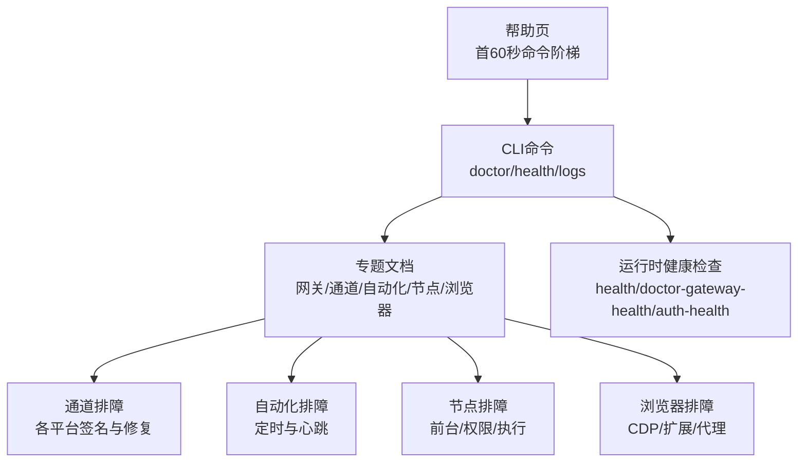
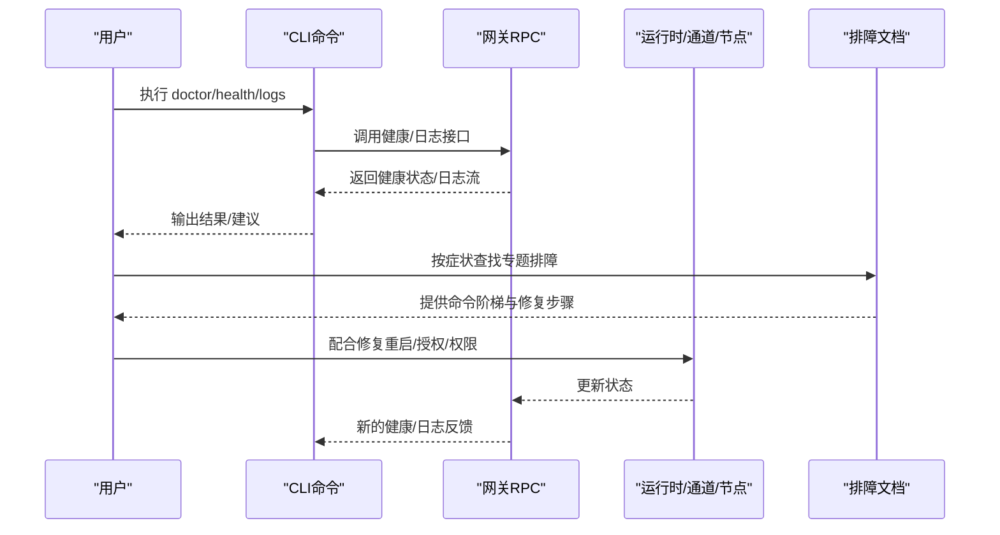
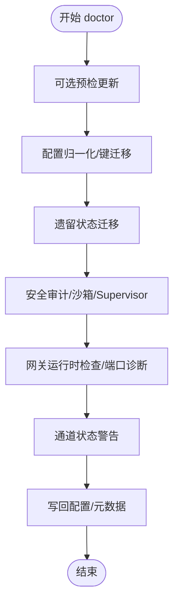
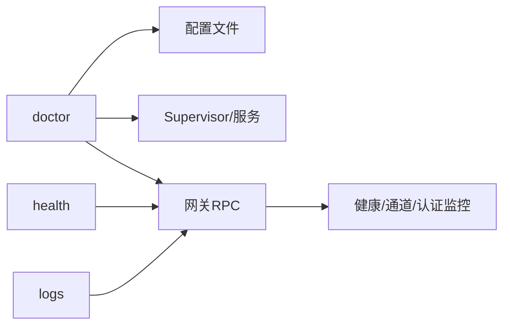
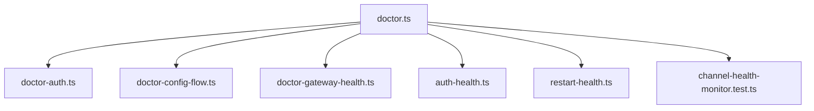

# 故障排除

<cite>
**本文引用的文件**
- [docs/help/troubleshooting.md](file://docs/help/troubleshooting.md)
- [docs/gateway/troubleshooting.md](file://docs/gateway/troubleshooting.md)
- [docs/channels/troubleshooting.md](file://docs/channels/troubleshooting.md)
- [docs/automation/troubleshooting.md](file://docs/automation/troubleshooting.md)
- [docs/nodes/troubleshooting.md](file://docs/nodes/troubleshooting.md)
- [docs/cli/doctor.md](file://docs/cli/doctor.md)
- [docs/gateway/doctor.md](file://docs/gateway/doctor.md)
- [docs/cli/logs.md](file://docs/cli/logs.md)
- [docs/cli/health.md](file://docs/cli/health.md)
- [docs/tools/browser-linux-troubleshooting.md](file://docs/tools/browser-linux-troubleshooting.md)
- [scripts/e2e/doctor-install-switch-docker.sh](file://scripts/e2e/doctor-install-switch-docker.sh)
- [src/commands/doctor-auth.ts](file://src/commands/doctor-auth.ts)
- [src/commands/doctor-config-flow.ts](file://src/commands/doctor-config-flow.ts)
- [src/commands/health.ts](file://src/commands/health.ts)
- [src/commands/doctor-gateway-health.ts](file://src/commands/doctor-gateway-health.ts)
- [src/agents/auth-health.ts](file://src/agents/auth-health.ts)
- [src/cli/daemon-cli/restart-health.ts](file://src/cli/daemon-cli/restart-health.ts)
- [src/gateway/channel-health-monitor.test.ts](file://src/gateway/channel-health-monitor.test.ts)
</cite>

## 目录
1. [简介](#简介)
2. [项目结构](#项目结构)
3. [核心组件](#核心组件)
4. [架构总览](#架构总览)
5. [详细组件分析](#详细组件分析)
6. [依赖关系分析](#依赖关系分析)
7. [性能考量](#性能考量)
8. [故障排除指南](#故障排除指南)
9. [结论](#结论)
10. [附录](#附录)

## 简介
本指南面向OpenClaw用户与运维工程师，提供系统化、可操作的故障排除流程与工具使用说明。内容覆盖：网络连接、权限与认证、依赖与环境、性能瓶颈、通道集成、自动化调度、节点工具执行等常见问题的诊断与修复路径，并给出日志分析技巧、调试工具使用与问题上报建议。

## 项目结构
OpenClaw的故障排除能力由“CLI命令 + 文档指引 + 运行时健康检查 + 测试用例”构成。关键入口包括：
- 快速排障入口：帮助页提供“首60秒命令阶梯”，并按症状分层引导到更深层文档
- 命令参考：doctor、health、logs等CLI命令用于自检与远程日志查看
- 分模块文档：网关、通道、自动化、节点、浏览器等专题排障手册
- 运行时与测试：健康检查、重启健康、通道健康监控等

**图表来源**
- [docs/help/troubleshooting.md](file://docs/help/troubleshooting.md#L13-L25)
- [docs/cli/doctor.md](file://docs/cli/doctor.md#L9-L24)
- [docs/cli/health.md](file://docs/cli/health.md#L8-L16)
- [docs/gateway/troubleshooting.md](file://docs/gateway/troubleshooting.md#L14-L24)

**章节来源**
- [docs/help/troubleshooting.md](file://docs/help/troubleshooting.md#L1-L297)
- [docs/cli/doctor.md](file://docs/cli/doctor.md#L1-L45)
- [docs/cli/health.md](file://docs/cli/health.md#L1-L22)

## 核心组件
- doctor（健康检查与修复）：集中式自检、配置归一化、迁移、服务与端口诊断、安全告警、模型认证健康、沙箱镜像修复、Supervisor审计等
- health（运行时健康端点）：通过RPC获取网关健康状态，支持JSON与详细模式
- logs（远程日志）：通过RPC尾随查看网关日志，支持JSON与本地时间显示
- 专题排障文档：网关、通道、自动化、节点、浏览器等模块化问题定位与修复清单
- 运行时健康辅助：重启健康、通道健康监控、认证健康等

**章节来源**
- [docs/gateway/doctor.md](file://docs/gateway/doctor.md#L59-L84)
- [docs/cli/health.md](file://docs/cli/health.md#L8-L22)
- [docs/cli/logs.md](file://docs/cli/logs.md#L9-L29)
- [docs/gateway/troubleshooting.md](file://docs/gateway/troubleshooting.md#L9-L31)

## 架构总览
下图展示从用户视角到系统内部的排障路径与交互：

**图表来源**
- [docs/cli/doctor.md](file://docs/cli/doctor.md#L9-L24)
- [docs/cli/health.md](file://docs/cli/health.md#L8-L16)
- [docs/cli/logs.md](file://docs/cli/logs.md#L9-L29)
- [docs/gateway/troubleshooting.md](file://docs/gateway/troubleshooting.md#L14-L31)

## 详细组件分析

### doctor（健康检查与修复）
- 功能要点
  - 预检更新（git安装）、UI协议新鲜度检查、健康检查与重启提示
  - 配置归一化与键迁移、遗留状态迁移（会话/代理/WA认证）
  - 安全审计（开放DM策略）、沙箱镜像修复、Supervisor审计与清理
  - 网关运行时检查（服务安装但未运行、缓存标签、端口冲突）
  - 通道状态警告、最佳实践检查（Node/Bun/版本管理器路径）
  - 写回配置与向导元数据
- 使用建议
  - 日常升级后先运行 doctor；遇到认证或连通性问题优先 doctor
  - headless/自动化场景使用 --yes/--repair/--non-interactive 控制行为
  - macOS launchctl环境变量可能覆盖配置，必要时检查并清理

**图表来源**
- [docs/gateway/doctor.md](file://docs/gateway/doctor.md#L59-L84)
- [docs/gateway/doctor.md](file://docs/gateway/doctor.md#L112-L130)
- [docs/gateway/doctor.md](file://docs/gateway/doctor.md#L216-L282)

**章节来源**
- [docs/cli/doctor.md](file://docs/cli/doctor.md#L9-L45)
- [docs/gateway/doctor.md](file://docs/gateway/doctor.md#L1-L310)

### health（运行时健康端点）
- 用途：通过RPC查询网关健康状态，支持JSON与详细模式
- 适用场景：快速确认网关是否在运行、账户探活、多代理会话状态
- 注意事项：详细模式会进行实时探测并打印每账户耗时

**章节来源**
- [docs/cli/health.md](file://docs/cli/health.md#L8-L22)

### logs（远程日志）
- 用途：通过RPC尾随查看网关日志，支持JSON格式与本地时间戳
- 适用场景：远程无SSH访问时的实时诊断、结合 doctor/health定位异常
- 建议：配合 --follow 与 --json，过滤关键字（如 unauthorized、EADDRINUSE、pairing、permission）

**章节来源**
- [docs/cli/logs.md](file://docs/cli/logs.md#L9-L29)

### 症状导向排障（帮助页）
- 首60秒命令阶梯：status/status-all/gateway probe/status/doctor/channels status/logs
- 决策树：按“无回复/控制UI无法连接/网关未启动/通道已连但消息不流动/自动化未触发/节点配对但工具失败/浏览器工具失败”分类
- 各类症状的命令组合与常见日志签名，直接链接到专题文档

**章节来源**
- [docs/help/troubleshooting.md](file://docs/help/troubleshooting.md#L13-L297)

### 网关专题排障
- 命令阶梯：status/gateway status/logs/doctor/channels status --probe
- 关键点：Anthropic长上下文429处理、无回复路由与策略、控制UI连通性（设备身份/nonce/签名）、网关服务未运行（模式/绑定/端口）、通道已连但消息不流、自动化调度与投递、节点前台/权限/批准、浏览器工具失败（CDP/扩展/代理）
- 升级后问题：URL/认证覆盖行为变化、绑定与认证护栏收紧、配对与设备身份状态变更

**章节来源**
- [docs/gateway/troubleshooting.md](file://docs/gateway/troubleshooting.md#L14-L367)

### 通道专题排障
- 命令阶梯：status/gateway status/logs/doctor/channels status --probe
- 平台速查表：WhatsApp/Telegram/Discord/Slack/iMessage/BlueBubbles/Signal/Matrix 的典型症状、最快检查与修复
- 常见签名：mention required、pairing/pending、missing_scope/401/403、隐私模式/允许列表

**章节来源**
- [docs/channels/troubleshooting.md](file://docs/channels/troubleshooting.md#L13-L118)

### 自动化专题排障
- 命令阶梯：status/gateway status/logs/doctor/channels status --probe；随后 cron status/list/runs 与 heartbeat last
- 关注点：调度器禁用、计时器tick失败、静默时段跳过、请求繁忙延迟、目标账户无效、时区与活动时段配置
- 时区与活动时段陷阱：userTimezone未设置、cron默认主机时区、heartbeat基于配置时区解析

**章节来源**
- [docs/automation/troubleshooting.md](file://docs/automation/troubleshooting.md#L14-L123)

### 节点专题排障
- 命令阶梯：status/gateway status/logs/doctor/channels status --probe；随后 nodes status/describe/approvals
- 关键点：前台限制（iOS/Android的canvas/camera/screen需前台）、权限矩阵（相机/屏幕/位置/系统执行）、配对与执行批准的区别
- 常见错误码：NODE_BACKGROUND_UNAVAILABLE、*_PERMISSION_REQUIRED、LOCATION_PERMISSION_REQUIRED、SYSTEM_RUN_DENIED

**章节来源**
- [docs/nodes/troubleshooting.md](file://docs/nodes/troubleshooting.md#L13-L115)

### 浏览器工具专题排障
- 命令阶梯：browser status/start/profiles/logs/doctor
- 关注点：可执行路径、CDP可达性、Chrome扩展中继与标签连接、attach-only模式下的目标可达性
- Linux特定：浏览器启动与权限、代理/防火墙影响

**章节来源**
- [docs/gateway/troubleshooting.md](file://docs/gateway/troubleshooting.md#L263-L293)
- [docs/tools/browser-linux-troubleshooting.md](file://docs/tools/browser-linux-troubleshooting.md)

## 依赖关系分析
- CLI命令与运行时健康检查的耦合：doctor/health/logs依赖网关RPC；doctor还依赖配置文件与Supervisor状态
- 文档与命令的映射：帮助页决策树直接映射到具体命令；专题文档提供平台化修复清单
- 运行时组件：重启健康、通道健康监控、认证健康等作为辅助诊断手段

**图表来源**
- [docs/cli/doctor.md](file://docs/cli/doctor.md#L26-L32)
- [docs/cli/health.md](file://docs/cli/health.md#L8-L16)
- [docs/cli/logs.md](file://docs/cli/logs.md#L9-L11)

**章节来源**
- [src/commands/doctor-gateway-health.ts](file://src/commands/doctor-gateway-health.ts)
- [src/agents/auth-health.ts](file://src/agents/auth-health.ts)
- [src/cli/daemon-cli/restart-health.ts](file://src/cli/daemon-cli/restart-health.ts)
- [src/gateway/channel-health-monitor.test.ts](file://src/gateway/channel-health-monitor.test.ts)

## 性能考量
- 状态目录I/O与路径：云同步/SD卡/eMMC路径会影响会话与凭证写入性能与稳定性
- 版本管理器路径：nvm/fnm/volta/asdf等可能导致服务加载失败或功能异常
- 沙箱镜像：Docker不可用时会触发高信号警告，建议安装Docker或关闭沙箱
- 端口冲突：默认端口被占用或隧道占用会导致网关不可达

**章节来源**
- [docs/gateway/doctor.md](file://docs/gateway/doctor.md#L172-L178)
- [docs/gateway/doctor.md](file://docs/gateway/doctor.md#L290-L296)
- [docs/gateway/doctor.md](file://docs/gateway/doctor.md#L283-L288)

## 故障排除指南

### 通用诊断流程（首60秒）
- 命令顺序：status、status --all、gateway probe、gateway status、doctor、channels status --probe、logs --follow
- 期望信号：通道配置正确且无明显认证错误；网关运行且RPC探测成功；doctor无阻塞性配置/服务问题；通道报告已连接/就绪；日志稳定无重复致命错误

**章节来源**
- [docs/help/troubleshooting.md](file://docs/help/troubleshooting.md#L13-L36)

### 症状到命令的映射
- 无回复：status/gateway status/channels status --probe/pairing list/logs
- 控制UI无法连接：status/gateway status/logs/doctor/channels status --probe
- 网关未启动/服务未运行：status/gateway status/logs/doctor/gateway status --deep
- 通道已连但消息不流：channels status --probe/pairing list/status --deep/logs/config get channels
- 自动化未触发/未投递：cron status/list/runs/system heartbeat last/logs
- 节点配对但工具失败：nodes status/describe/approvals/logs/status
- 浏览器工具失败：browser status/start/profiles/logs/doctor

**章节来源**
- [docs/help/troubleshooting.md](file://docs/help/troubleshooting.md#L90-L295)
- [docs/gateway/troubleshooting.md](file://docs/gateway/troubleshooting.md#L61-L293)
- [docs/automation/troubleshooting.md](file://docs/automation/troubleshooting.md#L14-L123)
- [docs/nodes/troubleshooting.md](file://docs/nodes/troubleshooting.md#L13-L115)

### 错误代码与日志签名解读
- 认证与URL相关
  - device identity required / device nonce required/mismatch/signature invalid/expired：设备身份/挑战参数不匹配
  - unauthorized/reconnect loop：令牌/密码不匹配或认证模式不一致
  - gateway connect failed：UI目标URL/端口错误或网关不可达
- 网关运行与绑定
  - Gateway start blocked：gateway.mode未设为local
  - refusing to bind gateway ... without auth：非环回绑定但缺少认证
  - another gateway instance is already listening/EADDRINUSE：端口冲突
- 通道与权限
  - mention required：群组提及策略导致忽略
  - pairing/pending：DM发送者未批准
  - not_in_channel/missing_scope/Forbidden/401/403：通道权限/作用域缺失
- 自动化
  - cron: scheduler disabled；cron: timer tick failed；heartbeat skipped（quiet-hours/requests-in-flight/alerts-disabled/unknown accountId）
- 节点
  - NODE_BACKGROUND_UNAVAILABLE：节点应用处于后台
  - *_PERMISSION_REQUIRED/LOCATION_PERMISSION_REQUIRED：系统权限缺失/拒绝
  - SYSTEM_RUN_DENIED：执行审批待定或不在允许列表
- 浏览器
  - Failed to start Chrome CDP on port：本地浏览器启动失败
  - browser.executablePath not found：配置的二进制路径错误
  - Chrome extension relay is running, but no tab is connected：扩展未附加
  - Browser attachOnly is enabled ... not reachable：仅附加模式无可达目标

**章节来源**
- [docs/help/troubleshooting.md](file://docs/help/troubleshooting.md#L107-L140)
- [docs/gateway/troubleshooting.md](file://docs/gateway/troubleshooting.md#L157-L161)
- [docs/gateway/troubleshooting.md](file://docs/gateway/troubleshooting.md#L187-L191)
- [docs/automation/troubleshooting.md](file://docs/automation/troubleshooting.md#L105-L115)
- [docs/nodes/troubleshooting.md](file://docs/nodes/troubleshooting.md#L81-L91)
- [docs/gateway/troubleshooting.md](file://docs/gateway/troubleshooting.md#L281-L286)

### 系统自检工具与诊断命令
- doctor
  - 基本：openclaw doctor
  - 修复：openclaw doctor --repair 或 --fix
  - 深度：openclaw doctor --deep
  - 非交互：openclaw doctor --non-interactive
- health
  - openclaw health；openclaw health --json；openclaw health --verbose
- logs
  - openclaw logs；openclaw logs --follow；openclaw logs --json；openclaw logs --limit N；openclaw logs --local-time

**章节来源**
- [docs/cli/doctor.md](file://docs/cli/doctor.md#L18-L32)
- [docs/cli/health.md](file://docs/cli/health.md#L12-L16)
- [docs/cli/logs.md](file://docs/cli/logs.md#L17-L29)

### 网络连接问题
- 排查步骤
  - 确认网关URL/端口与认证方式匹配；检查UI是否使用安全上下文
  - 检查bind与auth配置一致性；避免非环回绑定无认证
  - 使用 doctor --deep 检测额外网关实例与端口冲突
- 常见签名：gateway connect failed、refusing to bind gateway ... without auth、EADDRINUSE

**章节来源**
- [docs/gateway/troubleshooting.md](file://docs/gateway/troubleshooting.md#L139-L167)
- [docs/gateway/doctor.md](file://docs/gateway/doctor.md#L283-L288)

### 权限与认证问题
- 设备身份/挑战参数：确保客户端等待并正确签名 connect.challenge，发送与challenge一致的 device.nonce
- 令牌/密码：核对 gateway.auth.mode 与实际使用的凭据；macOS launchctl环境变量可能覆盖配置
- 通道权限：检查 scopes/allowlist/mention策略；必要时调整为 open 或放宽要求
- 修复建议：doctor --repair；doctor --fix；doctor --non-interactive（非交互修复）

**章节来源**
- [docs/gateway/troubleshooting.md](file://docs/gateway/troubleshooting.md#L91-L137)
- [docs/gateway/troubleshooting.md](file://docs/gateway/troubleshooting.md#L294-L316)
- [docs/cli/doctor.md](file://docs/cli/doctor.md#L34-L44)

### 依赖冲突与环境问题
- 版本管理器路径：nvm/fnm/volta/asdf等可能导致服务加载失败；doctor建议迁移到系统Node
- Docker与沙箱：沙箱启用但Docker不可用会触发警告；可安装Docker或关闭沙箱
- 状态目录路径：iCloud/云存储/SD/eMMC路径存在性能与稳定性风险

**章节来源**
- [docs/gateway/doctor.md](file://docs/gateway/doctor.md#L290-L296)
- [docs/gateway/doctor.md](file://docs/gateway/doctor.md#L211-L214)
- [docs/gateway/doctor.md](file://docs/gateway/doctor.md#L172-L178)

### 性能瓶颈排查
- 状态目录I/O：检查路径是否位于云同步/SD/eMMC
- 会话与转录：doctor检测会话目录缺失、转录不匹配、主会话单行等问题
- 重启健康：结合 restart-health 辅助判断服务重启后的恢复情况

**章节来源**
- [docs/gateway/doctor.md](file://docs/gateway/doctor.md#L161-L192)
- [src/cli/daemon-cli/restart-health.ts](file://src/cli/daemon-cli/restart-health.ts)

### 不同渠道集成问题定位
- 通用：status/gateway status/logs/doctor/channels status --probe
- 平台速查：WhatsApp/Telegram/Discord/Slack/iMessage/BlueBubbles/Signal/Matrix 的症状-检查-修复三段式
- 常见签名：mention required、pairing/pending、missing_scope/401/403、隐私模式/允许列表

**章节来源**
- [docs/channels/troubleshooting.md](file://docs/channels/troubleshooting.md#L13-L118)

### 日志分析技巧与调试工具
- 使用 openclaw logs --follow 实时观察；使用 --json 便于工具链处理
- 结合 doctor/health 获取上下文；按症状关键词过滤（如 pairing、permission、unauthorized、EADDRINUSE）
- 专题文档提供常见日志签名与对应修复

**章节来源**
- [docs/cli/logs.md](file://docs/cli/logs.md#L17-L29)
- [docs/help/troubleshooting.md](file://docs/help/troubleshooting.md#L107-L140)

### 问题上报流程
- 收集信息
  - openclaw status --all（完整报告）
  - openclaw logs --follow（最近日志）
  - openclaw doctor（健康检查与修复建议）
  - 针对模块的 status/probe/runs 等命令输出
- 上报要素
  - 环境信息（操作系统、OpenClaw版本、安装方式）
  - 复现步骤与症状描述
  - 关键命令输出与日志片段（脱敏敏感信息）
  - 已尝试的修复步骤

**章节来源**
- [docs/help/troubleshooting.md](file://docs/help/troubleshooting.md#L27-L35)

## 结论
通过“首60秒命令阶梯 + 专题排障文档 + doctor/health/logs等工具”的组合，OpenClaw提供了从症状到修复的闭环支持路径。建议在日常维护中定期运行 doctor，在升级后必跑 doctor，并结合 logs 与专题文档快速定位与解决网络、认证、权限、依赖与性能问题。

## 附录

### doctor命令选项速览
- openclaw doctor：基础健康检查与修复建议
- openclaw doctor --repair / --fix：应用推荐修复（含重启/服务/沙箱动作）
- openclaw doctor --deep：扫描系统服务与额外网关实例
- openclaw doctor --non-interactive：非交互模式，仅应用安全迁移与状态移动

**章节来源**
- [docs/cli/doctor.md](file://docs/cli/doctor.md#L18-L44)
- [docs/gateway/doctor.md](file://docs/gateway/doctor.md#L20-L44)

### doctor自检与修复流程（代码级概览）

**图表来源**
- [src/commands/doctor-auth.ts](file://src/commands/doctor-auth.ts)
- [src/commands/doctor-config-flow.ts](file://src/commands/doctor-config-flow.ts)
- [src/commands/doctor-gateway-health.ts](file://src/commands/doctor-gateway-health.ts)
- [src/agents/auth-health.ts](file://src/agents/auth-health.ts)
- [src/cli/daemon-cli/restart-health.ts](file://src/cli/daemon-cli/restart-health.ts)
- [src/gateway/channel-health-monitor.test.ts](file://src/gateway/channel-health-monitor.test.ts)