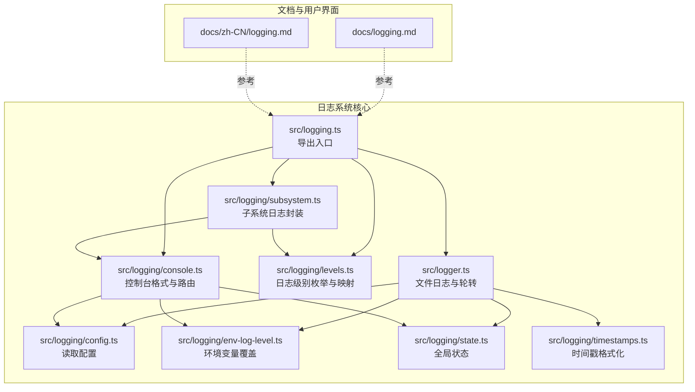
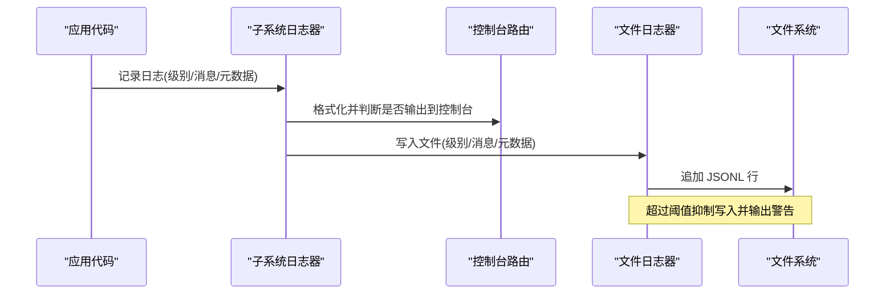
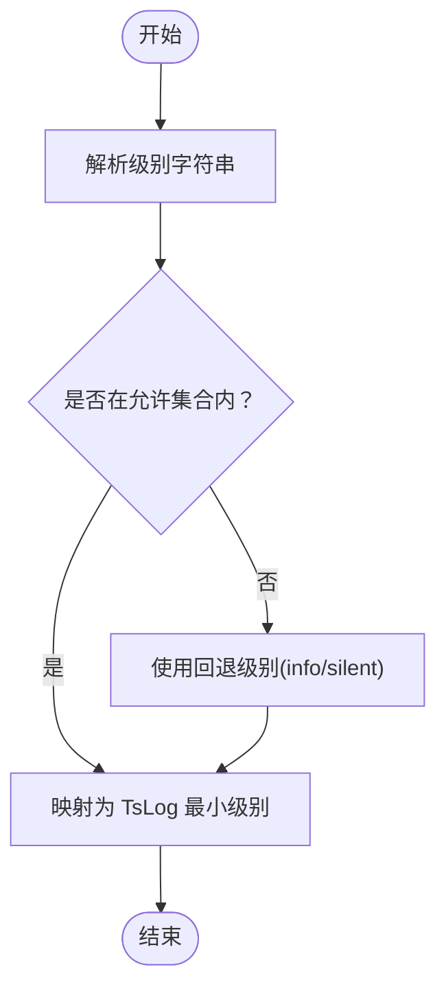
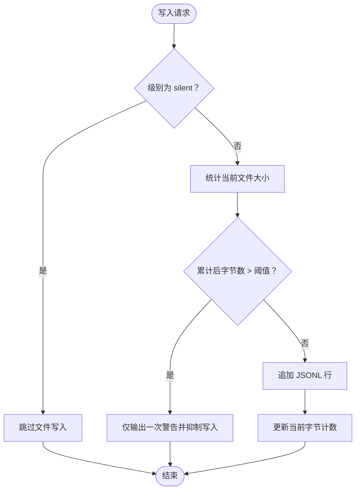
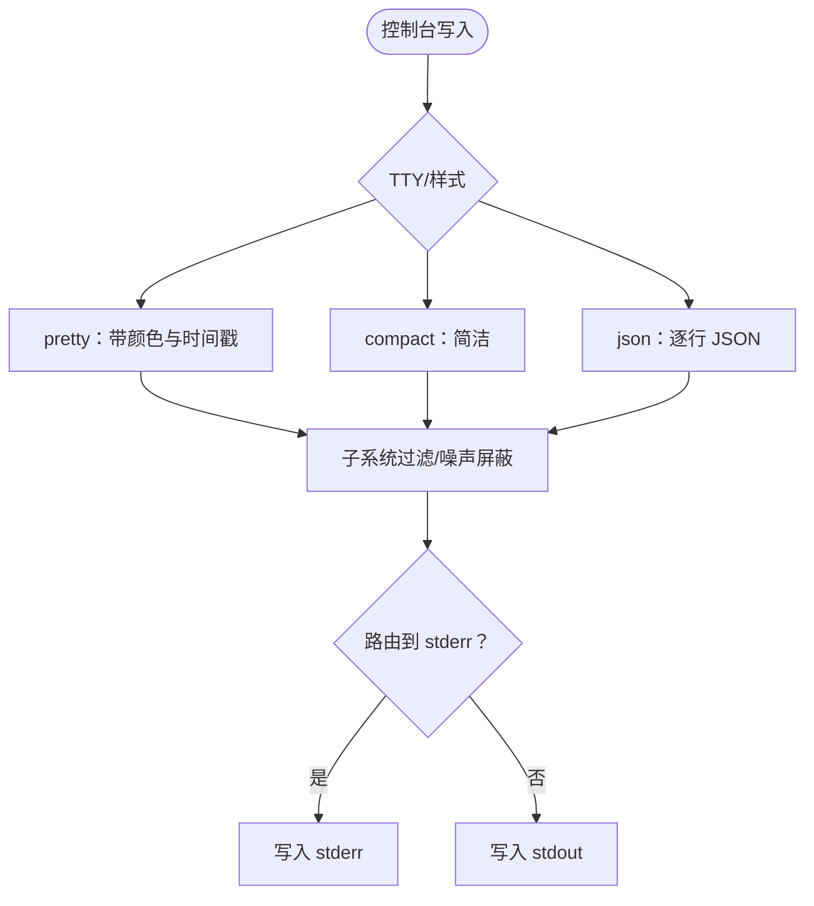
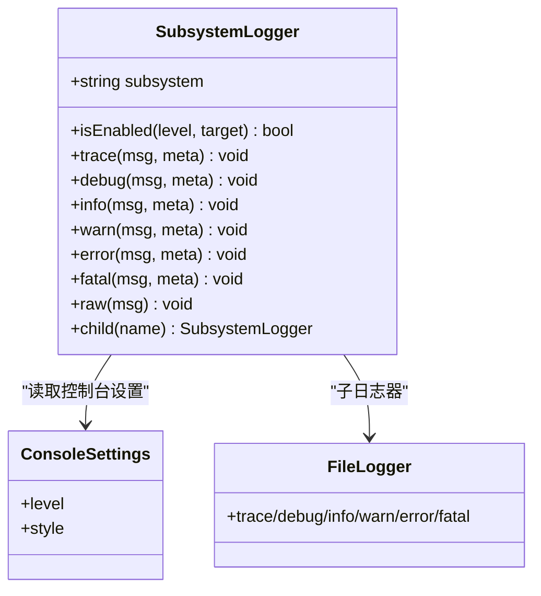
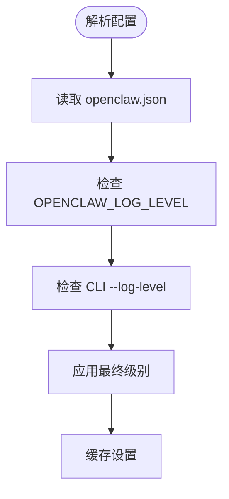
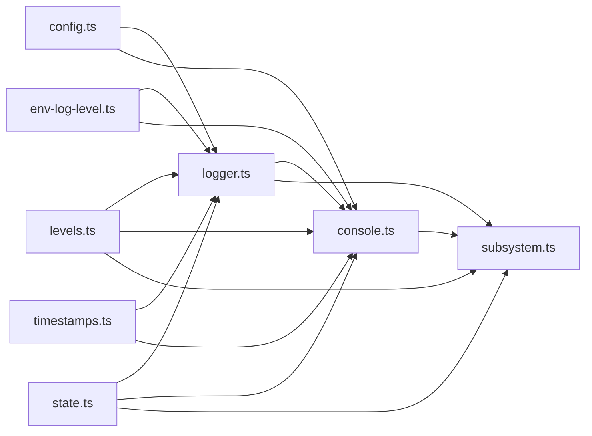

# 日志分析

<cite>
**本文引用的文件**
- [src/logging.ts](file://src/logging.ts)
- [src/logger.ts](file://src/logger.ts)
- [src/logging/levels.ts](file://src/logging/levels.ts)
- [src/logging/console.ts](file://src/logging/console.ts)
- [src/logging/subsystem.ts](file://src/logging/subsystem.ts)
- [src/logging/config.ts](file://src/logging/config.ts)
- [src/logging/env-log-level.ts](file://src/logging/env-log-level.ts)
- [src/logging/state.ts](file://src/logging/state.ts)
- [src/logging/timestamps.ts](file://src/logging/timestamps.ts)
- [src/logger.ts](file://src/logger.ts)
- [docs/logging.md](file://docs/logging.md)
- [docs/zh-CN/logging.md](file://docs/zh-CN/logging.md)
</cite>

## 目录
1. [简介](#简介)
2. [项目结构](#项目结构)
3. [核心组件](#核心组件)
4. [架构总览](#架构总览)
5. [详细组件分析](#详细组件分析)
6. [依赖关系分析](#依赖关系分析)
7. [性能考量](#性能考量)
8. [故障排查指南](#故障排查指南)
9. [结论](#结论)
10. [附录](#附录)

## 简介
本技术文档面向 OpenClaw 日志分析与运维，聚焦于日志级别、日志格式与日志轮转机制，覆盖多组件日志输出模式、关键信息提取与错误模式识别，并提供日志聚合、过滤与搜索的实用技巧，以及常见错误日志的含义解释、根因分析方法与修复建议。同时给出日志监控仪表板与告警规则配置指南，帮助团队建立高效可观测体系。

## 项目结构
OpenClaw 的日志系统由“文件日志（JSONL）+ 控制台输出”双通道构成，核心位于 src/logging 目录，配合 CLI 与控制 UI 提供实时尾随与可视化展示。文档层提供了中文与英文版本的配置与使用说明。

**图表来源**
- [src/logging.ts](file://src/logging.ts#L1-L70)
- [src/logger.ts](file://src/logger.ts#L1-L348)
- [src/logging/levels.ts](file://src/logging/levels.ts#L1-L38)
- [src/logging/console.ts](file://src/logging/console.ts#L1-L327)
- [src/logging/subsystem.ts](file://src/logging/subsystem.ts#L1-L395)
- [src/logging/config.ts](file://src/logging/config.ts#L1-L25)
- [src/logging/env-log-level.ts](file://src/logging/env-log-level.ts#L1-L24)
- [src/logging/state.ts](file://src/logging/state.ts#L1-L20)
- [src/logging/timestamps.ts](file://src/logging/timestamps.ts#L1-L37)
- [docs/logging.md](file://docs/logging.md#L1-L353)
- [docs/zh-CN/logging.md](file://docs/zh-CN/logging.md#L1-L330)

**章节来源**
- [src/logging.ts](file://src/logging.ts#L1-L70)
- [src/logger.ts](file://src/logger.ts#L1-L348)
- [docs/logging.md](file://docs/logging.md#L1-L353)
- [docs/zh-CN/logging.md](file://docs/zh-CN/logging.md#L1-L330)

## 核心组件
- 日志级别与解析
  - 支持级别：silent → fatal → error → warn → info → debug → trace
  - 提供级别解析与归一化函数，保证输入健壮性
- 文件日志与轮转
  - 默认滚动文件名：基于本地时区的 YYYY-MM-DD
  - 默认最大文件字节：500MB；超过阈值抑制写入并输出警告
  - 清理超过 24 小时的历史滚动日志
- 控制台输出
  - 自动识别 TTY/非 TTY，选择 pretty/compact
  - 支持 json、pretty、compact 三种风格
  - 可路由至 stderr，保持 stdout 清洁
- 子系统日志
  - 自动剥离冗余前缀，按颜色与层级格式化
  - 支持子日志器与元数据透传
- 配置与覆盖
  - 从 ~/.openclaw/openclaw.json 读取 logging 节点
  - 支持 OPENCLAW_LOG_LEVEL 环境变量覆盖
  - 支持 CLI --log-level 临时覆盖

**章节来源**
- [src/logging/levels.ts](file://src/logging/levels.ts#L1-L38)
- [src/logger.ts](file://src/logger.ts#L1-L348)
- [src/logging/console.ts](file://src/logging/console.ts#L1-L327)
- [src/logging/subsystem.ts](file://src/logging/subsystem.ts#L1-L395)
- [src/logging/config.ts](file://src/logging/config.ts#L1-L25)
- [src/logging/env-log-level.ts](file://src/logging/env-log-level.ts#L1-L24)
- [docs/logging.md](file://docs/logging.md#L116-L141)

## 架构总览
OpenClaw 日志系统采用“双通道 + 多层封装”的设计：TsLog 作为底层日志库，负责文件写入与级别过滤；控制台通道通过拦截 console.* 并格式化输出；子系统日志器负责结构化与颜色化；配置层统一解析与覆盖策略。

**图表来源**
- [src/logging/subsystem.ts](file://src/logging/subsystem.ts#L276-L371)
- [src/logging/console.ts](file://src/logging/console.ts#L203-L326)
- [src/logger.ts](file://src/logger.ts#L126-L184)

**章节来源**
- [src/logging/subsystem.ts](file://src/logging/subsystem.ts#L276-L371)
- [src/logging/console.ts](file://src/logging/console.ts#L203-L326)
- [src/logger.ts](file://src/logger.ts#L126-L184)

## 详细组件分析

### 日志级别与解析
- 支持级别集合与解析
  - 允许级别：silent、fatal、error、warn、info、debug、trace
  - 解析失败返回 undefined，避免异常传播
- 级别到最小级别的映射
  - 用于 TsLog 的 minLevel 设置，实现“>=”过滤
- 归一化与回退
  - 未提供时使用 info 回退，确保默认可用

**图表来源**
- [src/logging/levels.ts](file://src/logging/levels.ts#L13-L37)

**章节来源**
- [src/logging/levels.ts](file://src/logging/levels.ts#L1-L38)

### 文件日志与轮转
- 默认路径与滚动命名
  - 默认目录：首选 tmp 目录
  - 默认文件：openclaw.log（兼容旧版）
  - 滚动文件：openclaw-YYYY-MM-DD.log（按本地时区）
- 轮转阈值与抑制策略
  - 默认最大文件字节：500MB
  - 超过阈值：输出一次警告并抑制后续写入，防止磁盘打满
- 历史清理
  - 清理超过 24 小时的滚动文件
- 写入流程
  - 格式化为 JSONL，追加写入
  - 异常捕获，不阻塞主流程

**图表来源**
- [src/logger.ts](file://src/logger.ts#L149-L184)
- [src/logger.ts](file://src/logger.ts#L314-L347)

**章节来源**
- [src/logger.ts](file://src/logger.ts#L1-L348)

### 控制台输出与格式化
- 自适应样式
  - TTY：pretty（带时间戳与颜色）
  - 非 TTY：compact（简洁）
  - 可强制 json 模式
- 时间戳策略
  - pretty：本地时钟 HH:MM:SS
  - json/compact：ISO8601 带时区偏移
- 路由与安全
  - 可强制路由到 stderr，保持 stdout 清洁
  - 捕获 console.* 并转发到文件日志，确保所有输出被记录
  - 屏蔽特定噪声（如会话开关提示、慢监听告警等）
- 子系统过滤
  - 支持按前缀过滤输出，便于聚焦特定模块

**图表来源**
- [src/logging/console.ts](file://src/logging/console.ts#L50-L91)
- [src/logging/console.ts](file://src/logging/console.ts#L169-L178)
- [src/logging/console.ts](file://src/logging/console.ts#L203-L326)
- [src/logging/subsystem.ts](file://src/logging/subsystem.ts#L126-L191)

**章节来源**
- [src/logging/console.ts](file://src/logging/console.ts#L1-L327)
- [src/logging/subsystem.ts](file://src/logging/subsystem.ts#L1-L395)
- [src/logging/timestamps.ts](file://src/logging/timestamps.ts#L1-L37)

### 子系统日志封装
- 结构化与可读性
  - 自动去除冗余前缀（如 gateway/channels/telegram）
  - 颜色化子系统标识，便于快速定位
  - 支持元数据透传，控制台可替换消息
- 运行时集成
  - 提供 runtimeForLogger/richRuntime，将日志映射为运行时输出
- 细粒度控制
  - 支持按级别与目标（console/file/任意）查询启用状态

**图表来源**
- [src/logging/subsystem.ts](file://src/logging/subsystem.ts#L17-L371)

**章节来源**
- [src/logging/subsystem.ts](file://src/logging/subsystem.ts#L1-L395)

### 配置与覆盖
- 配置来源
  - 优先读取 ~/.openclaw/openclaw.json 的 logging 节点
  - 支持 JSON5 解析，容错性更好
- 环境变量覆盖
  - OPENCLAW_LOG_LEVEL 可覆盖文件日志级别
  - 无效值会被记录并忽略，避免破坏启动
- CLI 覆盖
  - --log-level 可在单次命令中覆盖环境变量
- 控制台级别与样式
  - consoleLevel：控制台详细程度
  - consoleStyle：pretty/compact/json

**图表来源**
- [src/logging/config.ts](file://src/logging/config.ts#L8-L24)
- [src/logging/env-log-level.ts](file://src/logging/env-log-level.ts#L4-L23)
- [src/logging/console.ts](file://src/logging/console.ts#L60-L91)

**章节来源**
- [src/logging/config.ts](file://src/logging/config.ts#L1-L25)
- [src/logging/env-log-level.ts](file://src/logging/env-log-level.ts#L1-L24)
- [src/logging/console.ts](file://src/logging/console.ts#L1-L327)
- [docs/logging.md](file://docs/logging.md#L101-L141)

## 依赖关系分析
- 组件耦合
  - logger.ts 为核心，依赖 levels.ts、config.ts、env-log-level.ts、timestamps.ts、state.ts
  - console.ts 依赖 logger.ts、levels.ts、config.ts、env-log-level.ts、timestamps.ts、state.ts
  - subsystem.ts 依赖 console.ts、levels.ts、logger.ts、state.ts
- 外部依赖
  - 使用 tslog 作为底层日志库
  - 使用 json5 解析配置
  - 使用 Intl.DateTimeFormat 格式化时间戳
- 循环依赖
  - 通过导出入口与状态单例避免循环导入

**图表来源**
- [src/logging/levels.ts](file://src/logging/levels.ts#L1-L38)
- [src/logger.ts](file://src/logger.ts#L1-L348)
- [src/logging/config.ts](file://src/logging/config.ts#L1-L25)
- [src/logging/env-log-level.ts](file://src/logging/env-log-level.ts#L1-L24)
- [src/logging/timestamps.ts](file://src/logging/timestamps.ts#L1-L37)
- [src/logging/state.ts](file://src/logging/state.ts#L1-L20)
- [src/logging/console.ts](file://src/logging/console.ts#L1-L327)
- [src/logging/subsystem.ts](file://src/logging/subsystem.ts#L1-L395)

**章节来源**
- [src/logging.ts](file://src/logging.ts#L1-L70)
- [src/logger.ts](file://src/logger.ts#L1-L348)
- [src/logging/console.ts](file://src/logging/console.ts#L1-L327)
- [src/logging/subsystem.ts](file://src/logging/subsystem.ts#L1-L395)

## 性能考量
- 文件写入
  - 使用追加写入，避免随机 IO
  - 超阈值抑制写入，降低磁盘压力
- 控制台输出
  - TTY/非 TTY 自适应，减少不必要的颜色与空格开销
  - 屏蔽噪声，降低控制台刷屏频率
- 内存与缓存
  - 设置缓存 logger 与 settings，避免重复初始化
  - 测试场景下 silent 快路径，加速启动
- 外部传输
  - 支持注册外部传输，便于扩展到 OTLP/其他后端

[本节为通用指导，无需列出具体文件来源]

## 故障排查指南
- Gateway 不可达
  - 使用 openclaw doctor 排查
- 日志为空
  - 检查 logging.file 是否正确，确认网关正在运行
- 需要更详细日志
  - 将 logging.level 提升到 debug 或 trace
- 控制台输出异常
  - 检查 consoleLevel 与 consoleStyle
  - 使用 --no-color 或 --plain 排除终端问题
- 磁盘空间不足
  - 检查滚动文件是否超过阈值，确认历史清理是否生效
- 子系统噪音过多
  - 使用 setConsoleSubsystemFilter 按前缀过滤
- 环境变量覆盖无效
  - 检查 OPENCLAW_LOG_LEVEL 是否为允许值，查看 stderr 警告

**章节来源**
- [docs/logging.md](file://docs/logging.md#L347-L353)
- [src/logging/env-log-level.ts](file://src/logging/env-log-level.ts#L16-L22)
- [src/logging/console.ts](file://src/logging/console.ts#L119-L138)
- [src/logger.ts](file://src/logger.ts#L156-L171)

## 结论
OpenClaw 的日志系统以清晰的双通道设计、灵活的配置与覆盖机制、完善的子系统封装与控制台格式化，为生产可观测性提供了坚实基础。通过合理设置日志级别、利用滚动与抑制策略、结合 CLI/控制 UI 实时监控，团队可以高效定位问题并建立稳定的告警体系。

[本节为总结性内容，无需列出具体文件来源]

## 附录

### 日志级别与含义
- silent：完全静默（不写文件）
- fatal：致命错误
- error：一般错误
- warn：警告
- info：常规信息
- debug：调试信息
- trace：最详细日志

**章节来源**
- [src/logging/levels.ts](file://src/logging/levels.ts#L1-L38)

### 日志格式与字段
- 文件日志（JSONL）
  - 每行一个 JSON 对象，包含时间、级别、子系统、消息等
- 控制台输出
  - pretty：带颜色与时间戳
  - compact：简洁
  - json：逐行 JSON

**章节来源**
- [docs/logging.md](file://docs/logging.md#L82-L98)
- [src/logging/console.ts](file://src/logging/console.ts#L169-L178)

### 日志轮转与清理
- 滚动文件命名：openclaw-YYYY-MM-DD.log
- 最大文件字节：默认 500MB
- 历史清理：保留 24 小时内的滚动文件

**章节来源**
- [src/logger.ts](file://src/logger.ts#L15-L21)
- [src/logger.ts](file://src/logger.ts#L309-L347)

### 配置项速览
- logging.level：文件日志级别
- logging.consoleLevel：控制台级别
- logging.consoleStyle：pretty/compact/json
- logging.file：自定义文件路径
- OPENCLAW_LOG_LEVEL：环境变量覆盖

**章节来源**
- [docs/logging.md](file://docs/logging.md#L101-L141)
- [src/logging/config.ts](file://src/logging/config.ts#L8-L24)
- [src/logging/env-log-level.ts](file://src/logging/env-log-level.ts#L4-L23)

### 常见错误模式与修复建议
- “日志为空”
  - 检查网关运行状态与 logging.file 路径
- “磁盘写入被抑制”
  - 降低日志级别或增大 maxFileBytes，或清理历史滚动文件
- “控制台刷屏”
  - 使用 setConsoleSubsystemFilter 过滤噪声，或切换到 compact/json
- “环境变量无效”
  - 确认值在允许集合内，查看 stderr 警告

**章节来源**
- [src/logger.ts](file://src/logger.ts#L156-L171)
- [src/logging/console.ts](file://src/logging/console.ts#L119-L138)
- [src/logging/env-log-level.ts](file://src/logging/env-log-level.ts#L16-L22)

### 日志聚合、过滤与搜索技巧
- CLI 实时尾随
  - openclaw logs --follow
  - --json 获取结构化事件
  - --plain/--no-color 适配不同终端
- 控制台过滤
  - setConsoleSubsystemFilter 按前缀过滤
  - --log-level 临时提升级别
- 文本搜索
  - 使用 grep/ripgrep 过滤关键字与子系统
  - 建议先按子系统再按关键字分层缩小范围

**章节来源**
- [docs/logging.md](file://docs/logging.md#L40-L81)

### 监控仪表板与告警规则配置指南
- 仪表板建议
  - 按子系统聚合错误/警告趋势
  - 显示磁盘容量与日志文件大小
  - 展示最近关键事件（如 fatal/error）
- 告警规则
  - 错误/致命日志量突增
  - 控制台抑制写入告警（表示文件过大）
  - 子系统特定错误（如 webhook.error、message.processed.error）
  - 建议结合时间窗口与阈值触发

**章节来源**
- [docs/logging.md](file://docs/logging.md#L142-L346)