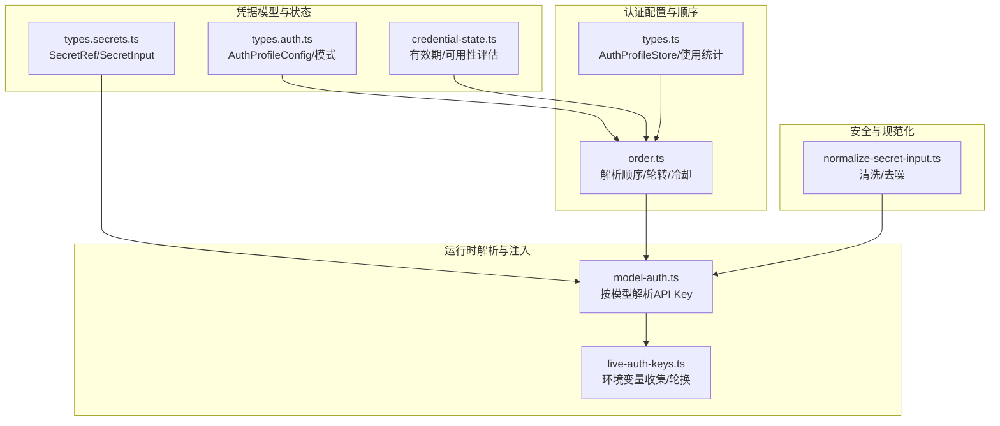
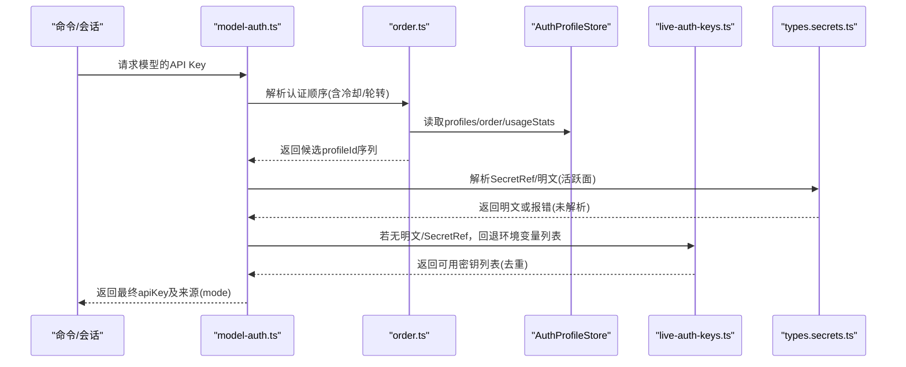
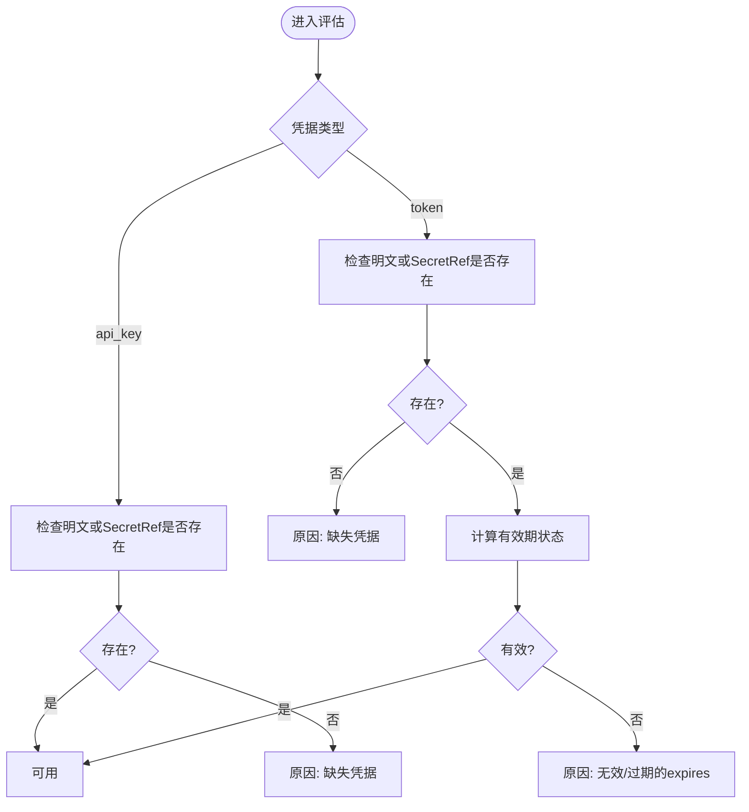
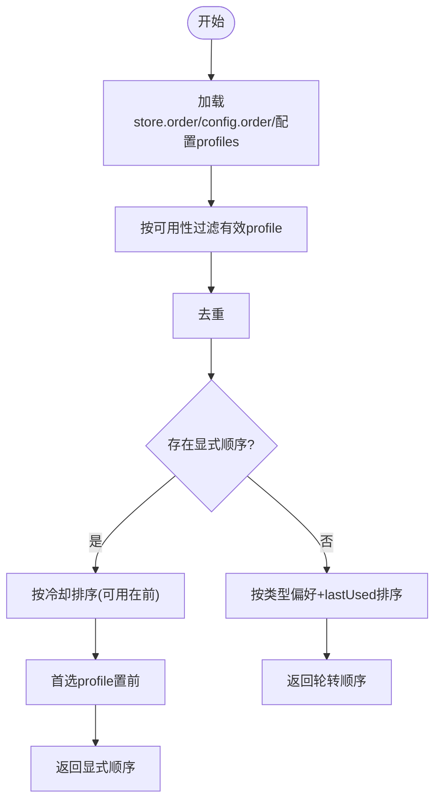
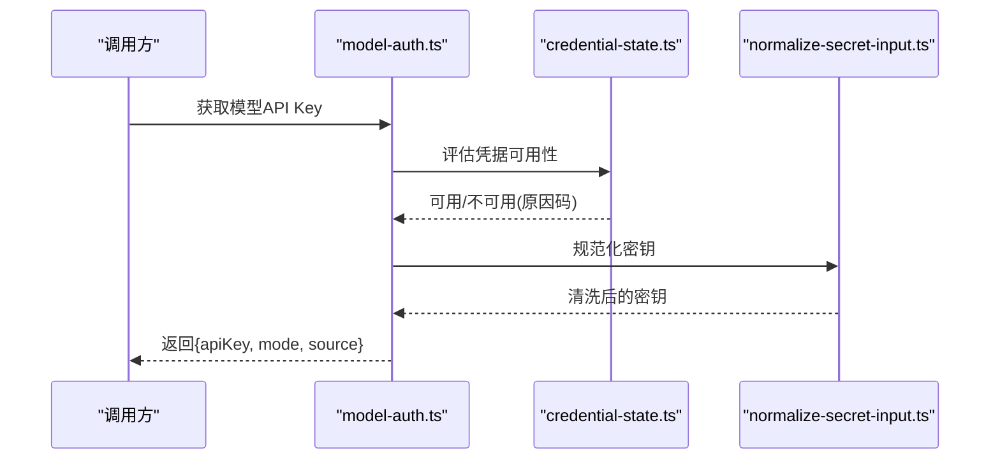
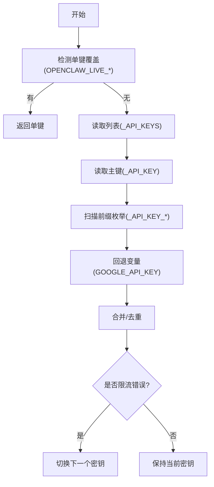
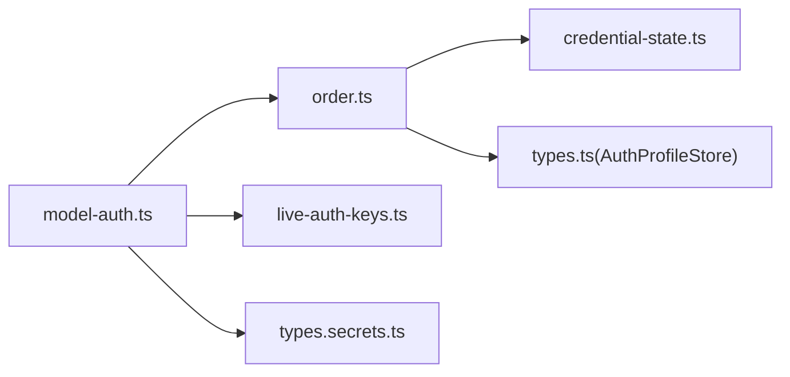

# API密钥管理

<cite>
**本文引用的文件**
- [src/agents/model-auth.ts](file://src/agents/model-auth.ts)
- [src/agents/auth-profiles/order.ts](file://src/agents/auth-profiles/order.ts)
- [src/agents/auth-profiles/credential-state.ts](file://src/agents/auth-profiles/credential-state.ts)
- [src/agents/auth-profiles/types.ts](file://src/agents/auth-profiles/types.ts)
- [src/agents/live-auth-keys.ts](file://src/agents/live-auth-keys.ts)
- [src/config/types.secrets.ts](file://src/config/types.secrets.ts)
- [src/config/types.auth.ts](file://src/config/types.auth.ts)
- [src/commands/auth-choice.apply.api-providers.ts](file://src/commands/auth-choice.apply.api-providers.ts)
- [src/commands/onboard-non-interactive/api-keys.ts](file://src/commands/onboard-non-interactive/api-keys.ts)
- [src/utils/normalize-secret-input.ts](file://src/utils/normalize-secret-input.ts)
- [docs/gateway/authentication.md](file://docs/gateway/authentication.md)
- [docs/gateway/secrets.md](file://docs/gateway/secrets.md)
</cite>

## 目录
1. [简介](#简介)
2. [项目结构](#项目结构)
3. [核心组件](#核心组件)
4. [架构总览](#架构总览)
5. [详细组件分析](#详细组件分析)
6. [依赖关系分析](#依赖关系分析)
7. [性能考量](#性能考量)
8. [故障排查指南](#故障排查指南)
9. [结论](#结论)
10. [附录](#附录)

## 简介
本文件系统性阐述 OpenClaw 的 API 密钥管理能力，覆盖凭据解析优先级、密钥存储机制、安全验证流程、多种认证方式（API 密钥、密码、令牌）的配置与使用、凭据来源优先级规则、环境变量处理与配置文件合并策略、API 密钥轮换与失效处理、多提供商密钥管理与注入机制，以及敏感信息保护的最佳实践。

## 项目结构
围绕“凭据解析—凭据选择—凭据注入—运行时安全”的主线，OpenClaw 在以下模块协同工作：
- 凭据模型与状态：定义凭据类型、有效期判定、可用性评估
- 认证配置与顺序：解析 auth-profiles.json 与配置中的 auth.order，结合冷却与轮转策略
- 运行时凭据解析：支持 SecretRef（env/file/exec）与明文混合，按活跃面过滤
- 环境变量与列表：支持单键覆盖、列表、主键、前缀枚举与回退变量
- 安全与规范化：对粘贴的密钥进行清洗，避免换行与非拉丁字符导致的头部构造错误

**图表来源**
- [src/config/types.auth.ts](file://src/config/types.auth.ts#L1-L30)
- [src/config/types.secrets.ts](file://src/config/types.secrets.ts#L1-L225)
- [src/agents/auth-profiles/credential-state.ts](file://src/agents/auth-profiles/credential-state.ts#L1-L75)
- [src/agents/auth-profiles/order.ts](file://src/agents/auth-profiles/order.ts#L1-L209)
- [src/agents/auth-profiles/types.ts](file://src/agents/auth-profiles/types.ts#L1-L82)
- [src/agents/model-auth.ts](file://src/agents/model-auth.ts#L175-L223)
- [src/agents/live-auth-keys.ts](file://src/agents/live-auth-keys.ts#L1-L203)
- [src/utils/normalize-secret-input.ts](file://src/utils/normalize-secret-input.ts#L1-L34)

**章节来源**
- [src/config/types.auth.ts](file://src/config/types.auth.ts#L1-L30)
- [src/config/types.secrets.ts](file://src/config/types.secrets.ts#L1-L225)
- [src/agents/auth-profiles/credential-state.ts](file://src/agents/auth-profiles/credential-state.ts#L1-L75)
- [src/agents/auth-profiles/order.ts](file://src/agents/auth-profiles/order.ts#L1-L209)
- [src/agents/auth-profiles/types.ts](file://src/agents/auth-profiles/types.ts#L1-L82)
- [src/agents/model-auth.ts](file://src/agents/model-auth.ts#L175-L223)
- [src/agents/live-auth-keys.ts](file://src/agents/live-auth-keys.ts#L1-L203)
- [src/utils/normalize-secret-input.ts](file://src/utils/normalize-secret-input.ts#L1-L34)

## 核心组件
- 凭据类型与模式
  - 支持三种模式：api_key（静态）、token（静态可过期）、oauth（可刷新）
  - 模型配置中声明期望的模式，用于校验与兼容
- SecretRef 合同
  - 统一的 SecretRef 结构：source（env/file/exec）、provider、id
  - 明文与 SecretRef 可并存，支持在活跃面强制解析
- 凭据可用性评估
  - API Key：要求至少存在明文或 SecretRef
  - Token：要求明文或 SecretRef；若带过期时间，需有效且未过期
- 认证顺序与轮转
  - 基于 auth-profiles.json 与配置中的 auth.order 决定候选顺序
  - 轮转策略：优先 oauth > token > api_key；其次按 lastUsed 轮询
  - 冷却：失败计数与冷却窗口，避免反复选择已限流/失败的密钥
- 运行时解析与注入
  - 按模型解析 API Key，支持按会话/代理覆盖
  - SecretRef 解析采用“活跃面”策略：仅对有效表面进行解析
- 环境变量与密钥列表
  - 单键覆盖、列表、主键、前缀枚举、回退变量（如 Google 提供商的额外回退）
  - 列表去重，避免重复尝试同一密钥
- 安全与规范化
  - 清洗复制粘贴的密钥：去除换行、保留拉丁字符、保留内部空格
  - SecretRef 解析失败时给出明确诊断，避免静默失败

**章节来源**
- [src/config/types.auth.ts](file://src/config/types.auth.ts#L1-L30)
- [src/config/types.secrets.ts](file://src/config/types.secrets.ts#L1-L225)
- [src/agents/auth-profiles/credential-state.ts](file://src/agents/auth-profiles/credential-state.ts#L34-L75)
- [src/agents/auth-profiles/order.ts](file://src/agents/auth-profiles/order.ts#L67-L209)
- [src/agents/auth-profiles/types.ts](file://src/agents/auth-profiles/types.ts#L5-L36)
- [src/agents/model-auth.ts](file://src/agents/model-auth.ts#L175-L223)
- [src/agents/live-auth-keys.ts](file://src/agents/live-auth-keys.ts#L100-L140)
- [src/utils/normalize-secret-input.ts](file://src/utils/normalize-secret-input.ts#L1-L34)

## 架构总览
下图展示从配置到运行时凭据注入的关键路径与决策点。

**图表来源**
- [src/agents/model-auth.ts](file://src/agents/model-auth.ts#L175-L223)
- [src/agents/auth-profiles/order.ts](file://src/agents/auth-profiles/order.ts#L67-L209)
- [src/agents/auth-profiles/types.ts](file://src/agents/auth-profiles/types.ts#L61-L82)
- [src/agents/live-auth-keys.ts](file://src/agents/live-auth-keys.ts#L100-L140)
- [src/config/types.secrets.ts](file://src/config/types.secrets.ts#L158-L174)

## 详细组件分析

### 凭据可用性与有效期判定
- API Key：只要存在明文或 SecretRef 即视为可用
- Token：必须存在明文或 SecretRef；若提供 expires，需为有限正数且未过期
- 无效原因码：缺失凭据、无效/过期的 expires、未解析的 SecretRef

**图表来源**
- [src/agents/auth-profiles/credential-state.ts](file://src/agents/auth-profiles/credential-state.ts#L34-L75)

**章节来源**
- [src/agents/auth-profiles/credential-state.ts](file://src/agents/auth-profiles/credential-state.ts#L1-L75)

### 认证顺序解析与轮转策略
- 顺序来源优先级
  - 显式存储/配置中的 provider 认证顺序
  - 配置中显式列出的该 provider 的 profile
  - 存储中该 provider 的所有有效 profile
- 有效性过滤
  - 使用凭据可用性评估结果过滤不可用 profile
- 轮转与冷却
  - 类型偏好：oauth > token > api_key
  - 同类型内按 lastUsed 最早优先（轮询）
  - 已进入冷却的 profile 排在末尾，并按冷却结束时间升序排列
  - 可指定首选 profile，优先置于首位
- 多提供商兼容
  - 对于某些 provider（如 google/google-vertex），允许回退到通用回退变量

**图表来源**
- [src/agents/auth-profiles/order.ts](file://src/agents/auth-profiles/order.ts#L67-L209)

**章节来源**
- [src/agents/auth-profiles/order.ts](file://src/agents/auth-profiles/order.ts#L1-L209)
- [src/agents/auth-profiles/types.ts](file://src/agents/auth-profiles/types.ts#L50-L82)

### 运行时凭据解析与注入
- 模型级解析
  - 支持按 profileId 直接解析
  - 支持按 provider 解析，遵循认证顺序
  - 支持 AWS SDK 模式（特定场景）
- SecretRef 解析
  - 明文与 SecretRef 并存时，SecretRef 在活跃面生效
  - 未解析的 SecretRef 将触发错误（严格路径）或降级输出（只读路径）
- 注入与规范化
  - 对解析出的密钥进行清洗，去除换行与非拉丁字符，保留内部空格
  - 不改变“Bearer <token>”等格式中的空格

**图表来源**
- [src/agents/model-auth.ts](file://src/agents/model-auth.ts#L424-L448)
- [src/agents/auth-profiles/credential-state.ts](file://src/agents/auth-profiles/credential-state.ts#L34-L75)
- [src/utils/normalize-secret-input.ts](file://src/utils/normalize-secret-input.ts#L16-L34)

**章节来源**
- [src/agents/model-auth.ts](file://src/agents/model-auth.ts#L175-L223)
- [src/agents/model-auth.ts](file://src/agents/model-auth.ts#L424-L448)
- [src/utils/normalize-secret-input.ts](file://src/utils/normalize-secret-input.ts#L1-L34)

### 环境变量与密钥列表（API 密钥轮换）
- 变量优先级（以某提供商为例）
  - 单键覆盖：OPENCLAW_LIVE_<PROVIDER>_KEY
  - 列表： <PROVIDER>_API_KEYS
  - 主键： <PROVIDER>_API_KEY
  - 前缀枚举： <PROVIDER>_API_KEY_*
  - 回退变量：如 GOOGLE_API_KEY（针对 google/google-vertex）
- 行为特征
  - 单键覆盖优先，直接返回单一密钥
  - 列表、主键、前缀枚举合并后去重
  - 仅在限流类错误时自动切换下一个密钥
- 文档建议
  - 长生命周期网关推荐使用 API Key
  - systemd/launchd 下建议将密钥写入 ~/.openclaw/.env

**图表来源**
- [src/agents/live-auth-keys.ts](file://src/agents/live-auth-keys.ts#L71-L140)
- [docs/gateway/authentication.md](file://docs/gateway/authentication.md#L123-L139)

**章节来源**
- [src/agents/live-auth-keys.ts](file://src/agents/live-auth-keys.ts#L1-L203)
- [docs/gateway/authentication.md](file://docs/gateway/authentication.md#L123-L139)

### 多提供商密钥管理与注入机制
- SecretRef 注入
  - 在模型配置中，apiKey 字段可为明文或 SecretRef
  - 当同时提供明文与 SecretRef 时，SecretRef 在活跃面生效
- 提供商别名与兼容
  - 对 google 与 google-vertex，统一映射到 GEMINI 前缀
  - 支持回退变量（如 GOOGLE_API_KEY）
- 配置合并与兼容
  - 对常见误配（如将 "${ENV_VAR}" 写成字符串而非 SecretRef）进行自动修复
  - 兼容旧版静态存储，运行时不再依赖明文持久化

**章节来源**
- [src/config/types.secrets.ts](file://src/config/types.secrets.ts#L1-L225)
- [src/agents/live-auth-keys.ts](file://src/agents/live-auth-keys.ts#L19-L44)
- [src/agents/models-config.providers.ts](file://src/agents/models-config.providers.ts#L497-L519)

### 安全验证与敏感信息保护
- SecretRef 合同与校验
  - source、provider、id 的格式与长度约束
  - 兼容旧版 SecretRef（无 provider 字段）并自动补全默认 provider
- 活跃面过滤
  - 仅对有效表面进行解析，未激活的 SecretRef 不阻塞启动/重载
- 解析失败与诊断
  - 严格路径：未解析的 SecretRef 抛错
  - 只读路径：降级输出并提示“在该命令路径下不可用”
- 密钥清洗
  - 去除换行与 Unicode 非拉丁字符，保留内部空格，避免 HTTP ByteString 构造错误
- 一次性安全策略
  - 不写入包含历史明文的回滚备份，采用预检+原子替换

**章节来源**
- [src/config/types.secrets.ts](file://src/config/types.secrets.ts#L1-L225)
- [docs/gateway/secrets.md](file://docs/gateway/secrets.md#L1-L446)
- [src/utils/normalize-secret-input.ts](file://src/utils/normalize-secret-input.ts#L1-L34)

## 依赖关系分析
- 组件耦合
  - model-auth.ts 依赖 order.ts 的认证顺序与轮转逻辑
  - order.ts 依赖 credential-state.ts 的可用性评估与 AuthProfileStore 的使用统计
  - model-auth.ts 与 live-auth-keys.ts 在无明文/SecretRef 时形成回退链路
  - types.secrets.ts 为 SecretRef 解析与校验的核心契约
- 外部集成
  - 环境变量与密钥列表由 live-auth-keys.ts 统一采集
  - 文档层提供“活跃面”“回退变量”等策略指导

**图表来源**
- [src/agents/model-auth.ts](file://src/agents/model-auth.ts#L175-L223)
- [src/agents/auth-profiles/order.ts](file://src/agents/auth-profiles/order.ts#L1-L209)
- [src/agents/auth-profiles/credential-state.ts](file://src/agents/auth-profiles/credential-state.ts#L1-L75)
- [src/agents/auth-profiles/types.ts](file://src/agents/auth-profiles/types.ts#L61-L82)
- [src/agents/live-auth-keys.ts](file://src/agents/live-auth-keys.ts#L1-L203)
- [src/config/types.secrets.ts](file://src/config/types.secrets.ts#L1-L225)

**章节来源**
- [src/agents/model-auth.ts](file://src/agents/model-auth.ts#L175-L223)
- [src/agents/auth-profiles/order.ts](file://src/agents/auth-profiles/order.ts#L1-L209)
- [src/agents/auth-profiles/credential-state.ts](file://src/agents/auth-profiles/credential-state.ts#L1-L75)
- [src/agents/auth-profiles/types.ts](file://src/agents/auth-profiles/types.ts#L61-L82)
- [src/agents/live-auth-keys.ts](file://src/agents/live-auth-keys.ts#L1-L203)
- [src/config/types.secrets.ts](file://src/config/types.secrets.ts#L1-L225)

## 性能考量
- 解析与激活
  - Secret 解析在激活阶段“急切”完成，避免热路径上的延迟
  - 重载采用原子交换，失败则保留上次已知良好快照
- 顺序与轮转
  - 轮转按 lastUsed 排序，避免热点集中
  - 冷却窗口减少对限流/失败密钥的反复尝试
- 环境变量扫描
  - 前缀枚举扫描遍历 process.env，建议控制前缀枚举数量，避免过多冗余变量

[本节为通用性能讨论，不直接分析具体文件]

## 故障排查指南
- “未找到凭据”
  - 检查 auth-profiles.json 中对应 provider 的 profile 是否存在且可用
  - 使用 models status 或 doctor 查看候选与下一认证配置
- “凭据不可用”
  - 检查 SecretRef 是否在活跃面；非活跃面不会阻塞启动但会降级
  - 若为 token，请确认 expires 是否为有限正数且未过期
- “密钥轮换未生效”
  - 确认是否为限流错误；仅在限流类错误时自动切换
  - 检查 OPENCLAW_LIVE_<PROVIDER>_KEY 是否被设置（优先级最高）
  - 确认 <PROVIDER>_API_KEYS、主键、前缀枚举是否正确配置且去重后非空
- “命令路径不可用”
  - 只读命令路径在 SecretRef 不可用时会降级输出并提示原因
  - 严格命令路径会在 SecretRef 不可用时直接报错
- “密钥格式问题”
  - 使用 normalize-secret-input 清洗后仍失败，检查是否包含非拉丁字符或隐藏控制符

**章节来源**
- [docs/gateway/authentication.md](file://docs/gateway/authentication.md#L160-L169)
- [docs/gateway/secrets.md](file://docs/gateway/secrets.md#L340-L355)
- [src/agents/auth-profiles/credential-state.ts](file://src/agents/auth-profiles/credential-state.ts#L13-L24)

## 结论
OpenClaw 的 API 密钥管理通过“凭据模型—认证顺序—SecretRef 活跃面—环境变量回退—清洗与安全”的完整闭环，实现了高可用、可轮换、可审计的密钥管理。推荐在长生命周期网关中使用 API Key 并配合环境变量与 SecretRef；在需要动态刷新或短期任务中使用 token/oath；通过认证顺序与冷却机制降低限流风险；通过 SecretRef 与一次性安全策略保障敏感信息的安全。

[本节为总结性内容，不直接分析具体文件]

## 附录

### 凭据来源优先级与合并策略
- 认证顺序
  - 显式顺序 > 配置显式列出的 profile > 存储中该 provider 的所有有效 profile
- 轮转策略
  - oauth > token > api_key；同类型按 lastUsed 最早优先
- 冷却与首选
  - 已失败的 profile 进入冷却队列，按结束时间升序；可指定首选 profile 置前
- SecretRef 与明文
  - 明文与 SecretRef 并存时，SecretRef 在活跃面生效
- 环境变量与列表
  - 单键覆盖 > 列表 > 主键 > 前缀枚举；合并后去重
  - 某些提供商支持回退变量（如 GOOGLE_API_KEY）

**章节来源**
- [src/agents/auth-profiles/order.ts](file://src/agents/auth-profiles/order.ts#L67-L209)
- [src/config/types.secrets.ts](file://src/config/types.secrets.ts#L1-L225)
- [src/agents/live-auth-keys.ts](file://src/agents/live-auth-keys.ts#L71-L140)
- [docs/gateway/authentication.md](file://docs/gateway/authentication.md#L123-L139)

### 多认证方式配置与使用
- API 密钥
  - 支持明文与 SecretRef；可通过会话/代理覆盖
- 密码与令牌
  - 令牌支持可选过期时间；过期或无效将被视为不可用
- OAuth
  - 可刷新的 OAuth 凭据在模式兼容下可与 token 互换使用

**章节来源**
- [src/config/types.auth.ts](file://src/config/types.auth.ts#L1-L30)
- [src/agents/auth-profiles/types.ts](file://src/agents/auth-profiles/types.ts#L15-L36)
- [src/agents/auth-profiles/order.ts](file://src/agents/auth-profiles/order.ts#L30-L65)

### API 密钥轮换与失效处理
- 自动轮换条件
  - 仅在限流类错误（如 429、rate_limit、quota、resource exhausted）时切换
  - 所有密钥均失败时，返回最后一次尝试的错误
- 失效处理
  - 过期/无效的 token 将被标记为不可用
  - 密钥清洗可避免因粘贴导致的格式问题

**章节来源**
- [src/agents/live-auth-keys.ts](file://src/agents/live-auth-keys.ts#L150-L203)
- [src/agents/auth-profiles/credential-state.ts](file://src/agents/auth-profiles/credential-state.ts#L13-L24)
- [src/utils/normalize-secret-input.ts](file://src/utils/normalize-secret-input.ts#L1-L34)

### 安全最佳实践
- 使用 SecretRef 替代明文存储
- 启用活跃面过滤，避免未激活凭据影响启动
- 使用一次性安全策略，避免历史明文回滚
- 对只读命令路径启用降级输出，避免影响严格路径
- 对密钥进行清洗，避免非拉丁字符与换行导致的请求失败

**章节来源**
- [docs/gateway/secrets.md](file://docs/gateway/secrets.md#L16-L26)
- [docs/gateway/secrets.md](file://docs/gateway/secrets.md#L416-L425)
- [src/utils/normalize-secret-input.ts](file://src/utils/normalize-secret-input.ts#L1-L34)