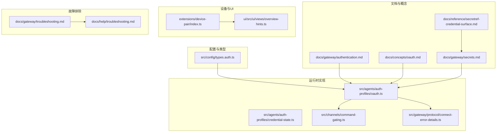
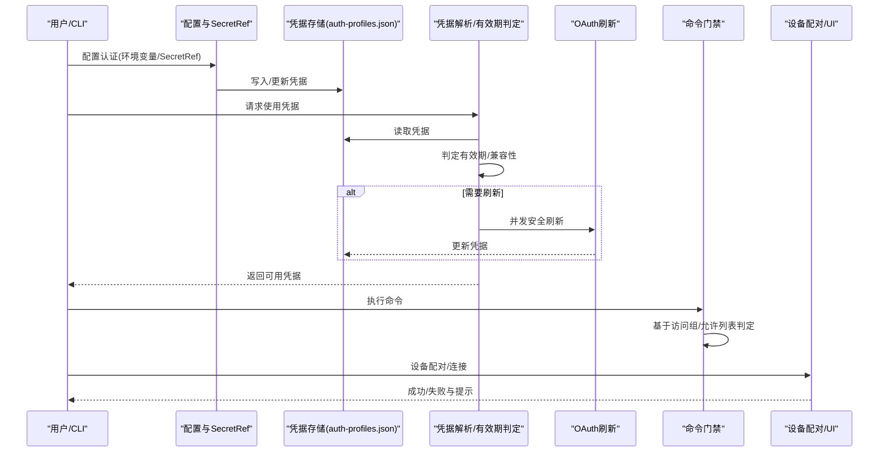
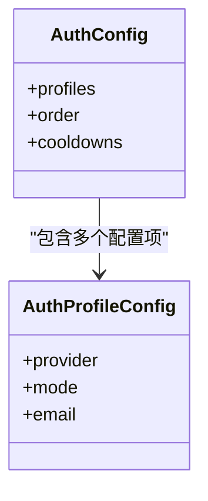
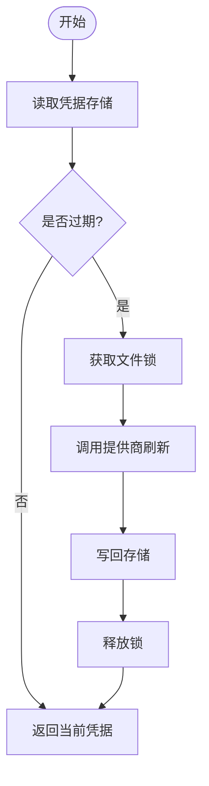
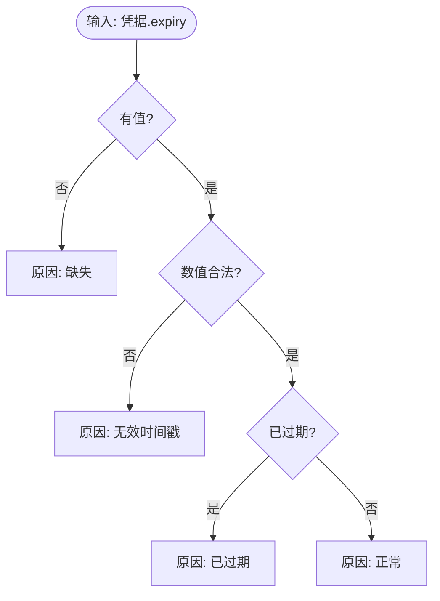
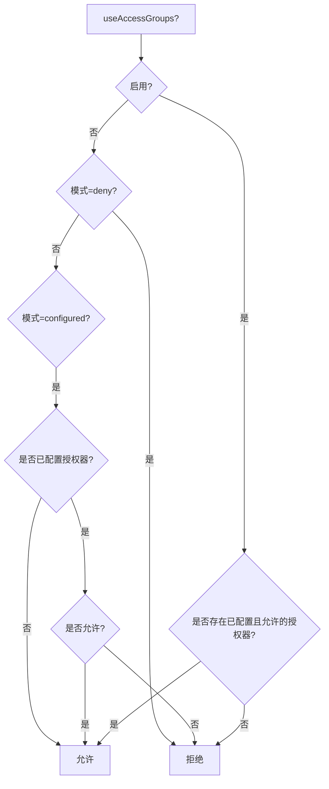
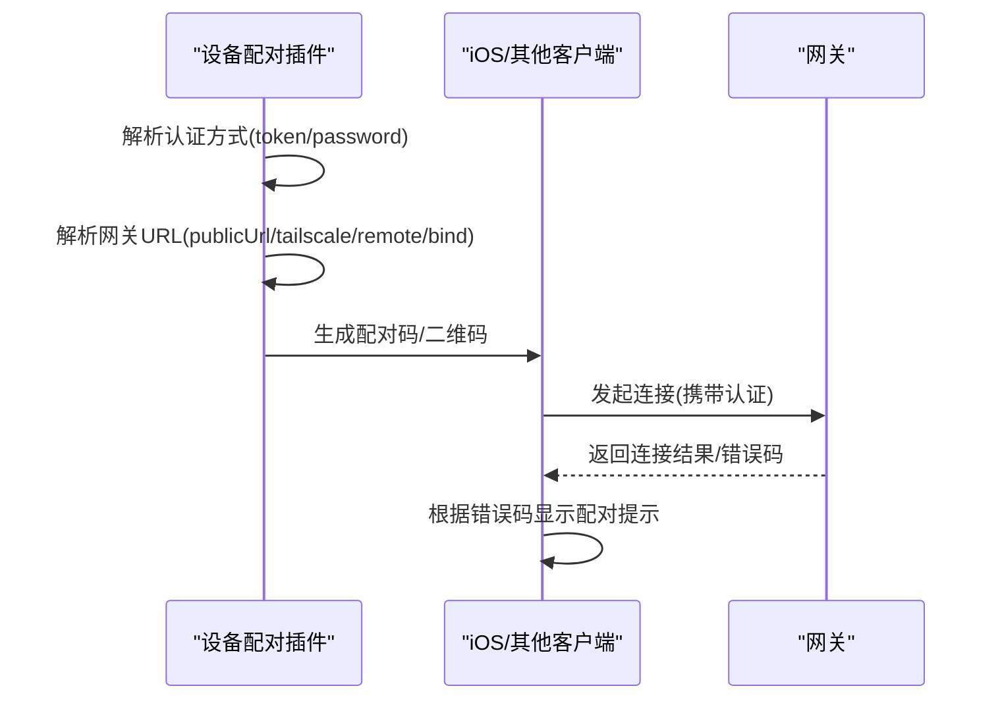
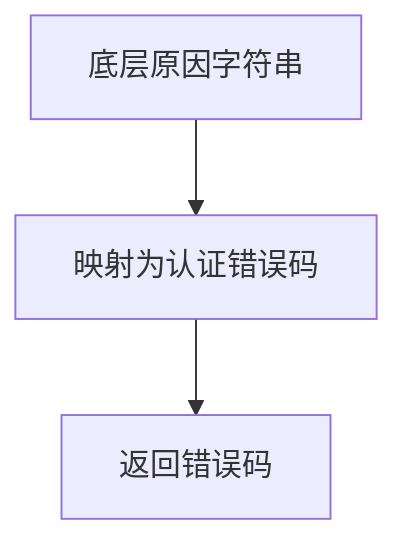
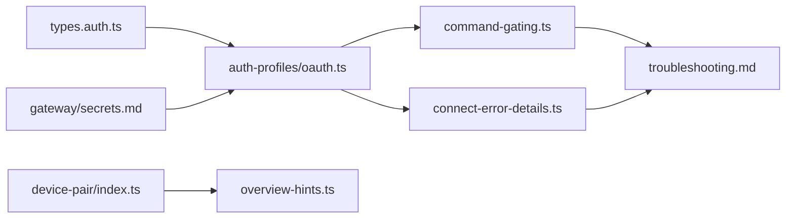

# 权限和认证问题

<cite>
**本文引用的文件**
- [src/config/types.auth.ts](file://src/config/types.auth.ts)
- [docs/gateway/authentication.md](file://docs/gateway/authentication.md)
- [docs/concepts/oauth.md](file://docs/concepts/oauth.md)
- [docs/gateway/secrets.md](file://docs/gateway/secrets.md)
- [docs/reference/secretref-credential-surface.md](file://docs/reference/secretref-credential-surface.md)
- [src/agents/auth-profiles/oauth.ts](file://src/agents/auth-profiles/oauth.ts)
- [src/agents/auth-profiles/credential-state.ts](file://src/agents/auth-profiles/credential-state.ts)
- [src/gateway/protocol/connect-error-details.ts](file://src/gateway/protocol/connect-error-details.ts)
- [src/channels/command-gating.ts](file://src/channels/command-gating.ts)
- [extensions/device-pair/index.ts](file://extensions/device-pair/index.ts)
- [ui/src/ui/views/overview-hints.ts](file://ui/src/ui/views/overview-hints.ts)
- [docs/gateway/troubleshooting.md](file://docs/gateway/troubleshooting.md)
- [docs/help/troubleshooting.md](file://docs/help/troubleshooting.md)
- [src/security/windows-acl.ts](file://src/security/windows-acl.ts)
- [src/security/audit-fs.ts](file://src/security/audit-fs.ts)
- [src/auto-reply/command-auth.ts](file://src/auto-reply/command-auth.ts)
- [extensions/google-gemini-cli-auth/oauth.ts](file://extensions/google-gemini-cli-auth/oauth.ts)
- [src/providers/qwen-portal-oauth.test.ts](file://src/providers/qwen-portal-oauth.test.ts)
- [apps/ios/Sources/Onboarding/OnboardingWizardView.swift](file://apps/ios/Sources/Onboarding/OnboardingWizardView.swift)
- [scripts/mobile-reauth.sh](file://scripts/mobile-reauth.sh)
- [scripts/setup-auth-system.sh](file://scripts/setup-auth-system.sh)
- [scripts/termux-auth-widget.sh](file://scripts/termux-auth-widget.sh)
</cite>

## 目录
1. [简介](#简介)
2. [项目结构](#项目结构)
3. [核心组件](#核心组件)
4. [架构总览](#架构总览)
5. [详细组件分析](#详细组件分析)
6. [依赖关系分析](#依赖关系分析)
7. [性能考量](#性能考量)
8. [故障排除指南](#故障排除指南)
9. [结论](#结论)
10. [附录](#附录)

## 简介
本技术文档聚焦于 OpenClaw 的权限与认证体系，覆盖设备身份验证、API 密钥管理、OAuth 流程、凭据优先级与安全策略验证，并提供针对设备配对失败、权限不足、认证循环等常见问题的诊断流程与解决方案。同时给出权限检查清单与安全最佳实践，帮助运维与开发者快速定位并修复问题。

## 项目结构
OpenClaw 将认证与权限相关能力分布在多个层次：
- 配置与类型定义：认证配置模型、凭据状态与有效期判定
- 文档与指引：认证与 OAuth 概念、密钥轮换、SecretRef 使用
- 运行时实现：OAuth 刷新、凭据解析、命令授权门禁
- 设备配对与 UI 提示：设备配对流程、配对提示逻辑
- 故障排除：连接错误码映射、UI 连接问题、服务不可用等

图表来源
- [src/config/types.auth.ts](file://src/config/types.auth.ts#L1-L30)
- [docs/gateway/authentication.md](file://docs/gateway/authentication.md#L1-L180)
- [docs/concepts/oauth.md](file://docs/concepts/oauth.md#L1-L159)
- [docs/gateway/secrets.md](file://docs/gateway/secrets.md#L1-L446)
- [docs/reference/secretref-credential-surface.md](file://docs/reference/secretref-credential-surface.md#L1-L87)
- [src/agents/auth-profiles/oauth.ts](file://src/agents/auth-profiles/oauth.ts#L1-L492)
- [src/agents/auth-profiles/credential-state.ts](file://src/agents/auth-profiles/credential-state.ts#L1-L39)
- [src/channels/command-gating.ts](file://src/channels/command-gating.ts#L1-L45)
- [src/gateway/protocol/connect-error-details.ts](file://src/gateway/protocol/connect-error-details.ts#L31-L64)
- [extensions/device-pair/index.ts](file://extensions/device-pair/index.ts#L1-L550)
- [ui/src/ui/views/overview-hints.ts](file://ui/src/ui/views/overview-hints.ts#L1-L16)
- [docs/gateway/troubleshooting.md](file://docs/gateway/troubleshooting.md#L1-L367)
- [docs/help/troubleshooting.md](file://docs/help/troubleshooting.md#L1-L297)

章节来源
- [src/config/types.auth.ts](file://src/config/types.auth.ts#L1-L30)
- [docs/gateway/authentication.md](file://docs/gateway/authentication.md#L1-L180)
- [docs/concepts/oauth.md](file://docs/concepts/oauth.md#L1-L159)
- [docs/gateway/secrets.md](file://docs/gateway/secrets.md#L1-L446)
- [docs/reference/secretref-credential-surface.md](file://docs/reference/secretref-credential-surface.md#L1-L87)
- [src/agents/auth-profiles/oauth.ts](file://src/agents/auth-profiles/oauth.ts#L1-L492)
- [src/agents/auth-profiles/credential-state.ts](file://src/agents/auth-profiles/credential-state.ts#L1-L39)
- [src/channels/command-gating.ts](file://src/channels/command-gating.ts#L1-L45)
- [src/gateway/protocol/connect-error-details.ts](file://src/gateway/protocol/connect-error-details.ts#L31-L64)
- [extensions/device-pair/index.ts](file://extensions/device-pair/index.ts#L1-L550)
- [ui/src/ui/views/overview-hints.ts](file://ui/src/ui/views/overview-hints.ts#L1-L16)
- [docs/gateway/troubleshooting.md](file://docs/gateway/troubleshooting.md#L1-L367)
- [docs/help/troubleshooting.md](file://docs/help/troubleshooting.md#L1-L297)

## 核心组件
- 认证配置模型：定义认证配置结构、凭据类型（api_key、oauth、token）与优先级冷却策略
- 凭据状态与有效期：判定凭据是否有效、过期或无效
- OAuth 解析与刷新：按文件锁并发安全地刷新 OAuth 凭据，兼容多种提供商
- 命令授权门禁：基于访问组与允许列表决定命令是否可执行
- 设备配对与 UI 提示：生成配对码、渲染二维码、处理通知与批准
- 连接错误码映射：将底层原因映射到统一的认证错误码
- SecretRef 与密钥面：集中管理密钥来源、激活策略与审计

章节来源
- [src/config/types.auth.ts](file://src/config/types.auth.ts#L1-L30)
- [src/agents/auth-profiles/credential-state.ts](file://src/agents/auth-profiles/credential-state.ts#L1-L39)
- [src/agents/auth-profiles/oauth.ts](file://src/agents/auth-profiles/oauth.ts#L1-L492)
- [src/channels/command-gating.ts](file://src/channels/command-gating.ts#L1-L45)
- [extensions/device-pair/index.ts](file://extensions/device-pair/index.ts#L1-L550)
- [src/gateway/protocol/connect-error-details.ts](file://src/gateway/protocol/connect-error-details.ts#L31-L64)
- [docs/gateway/secrets.md](file://docs/gateway/secrets.md#L1-L446)

## 架构总览
OpenClaw 的认证与权限由“配置—解析—存储—使用—校验—故障处理”闭环构成。用户通过 CLI 或向导配置认证方式；系统在运行时解析 SecretRef、加载 auth-profiles.json 并进行有效期与兼容性校验；命令执行前通过门禁策略；设备连接时进行设备身份验证与配对；出现异常时根据错误码与日志进行诊断。

图表来源
- [src/agents/auth-profiles/oauth.ts](file://src/agents/auth-profiles/oauth.ts#L158-L215)
- [src/agents/auth-profiles/credential-state.ts](file://src/agents/auth-profiles/credential-state.ts#L13-L24)
- [src/channels/command-gating.ts](file://src/channels/command-gating.ts#L8-L29)
- [extensions/device-pair/index.ts](file://extensions/device-pair/index.ts#L326-L549)
- [docs/gateway/secrets.md](file://docs/gateway/secrets.md#L16-L34)

## 详细组件分析

### 组件A：认证配置与凭据优先级
- 支持三种模式：api_key（静态）、oauth（可刷新）、token（可选过期的 bearer）
- 支持 per-agent 的 auth.order 控制优先级
- 提供默认与按提供商的退避策略（billing backoff）

图表来源
- [src/config/types.auth.ts](file://src/config/types.auth.ts#L13-L29)

章节来源
- [src/config/types.auth.ts](file://src/config/types.auth.ts#L1-L30)
- [docs/gateway/authentication.md](file://docs/gateway/authentication.md#L140-L159)

### 组件B：OAuth 解析与刷新流程
- 并发安全：使用文件锁保护 auth-profiles.json
- 自动刷新：过期则调用对应提供商刷新，失败时回退到主代理凭据或建议替代 profile
- 兼容性：token 与 oauth 在 bearer 场景下双向兼容
- 错误提示：格式化医生建议，便于自助重试

图表来源
- [src/agents/auth-profiles/oauth.ts](file://src/agents/auth-profiles/oauth.ts#L158-L215)
- [src/agents/auth-profiles/oauth.ts](file://src/agents/auth-profiles/oauth.ts#L244-L256)

章节来源
- [src/agents/auth-profiles/oauth.ts](file://src/agents/auth-profiles/oauth.ts#L1-L492)
- [src/providers/qwen-portal-oauth.test.ts](file://src/providers/qwen-portal-oauth.test.ts#L50-L105)

### 组件C：凭据有效性与状态判定
- 有效期判定：缺失、非法、过期、有效
- 存储凭据评估：结合类型与过期状态输出原因码

图表来源
- [src/agents/auth-profiles/credential-state.ts](file://src/agents/auth-profiles/credential-state.ts#L13-L24)

章节来源
- [src/agents/auth-profiles/credential-state.ts](file://src/agents/auth-profiles/credential-state.ts#L1-L39)

### 组件D：命令授权门禁
- 当启用访问组时，仅当存在已配置且允许的授权器时才放行
- 当关闭访问组时，支持 allow/deny/configured 三种模式
- 控制命令在未授权时可被阻断

图表来源
- [src/channels/command-gating.ts](file://src/channels/command-gating.ts#L8-L29)
- [src/channels/command-gating.ts](file://src/channels/command-gating.ts#L31-L45)

章节来源
- [src/channels/command-gating.ts](file://src/channels/command-gating.ts#L1-L45)

### 组件E：设备配对与 UI 提示
- 生成配对码/二维码，支持 Telegram 一键通知
- 解析网关 URL 与认证方式，优先 publicUrl、Tailscale、remote.url、bind
- UI 层根据错误码与错误消息决定是否展示配对提示

图表来源
- [extensions/device-pair/index.ts](file://extensions/device-pair/index.ts#L190-L291)
- [extensions/device-pair/index.ts](file://extensions/device-pair/index.ts#L326-L549)
- [ui/src/ui/views/overview-hints.ts](file://ui/src/ui/views/overview-hints.ts#L4-L16)

章节来源
- [extensions/device-pair/index.ts](file://extensions/device-pair/index.ts#L1-L550)
- [ui/src/ui/views/overview-hints.ts](file://ui/src/ui/views/overview-hints.ts#L1-L16)

### 组件F：连接错误码映射
- 将底层原因映射为统一的认证错误码，便于 UI 与日志识别
- 覆盖 token 缺失/不匹配、密码缺失/不匹配、速率限制、设备令牌不匹配等

图表来源
- [src/gateway/protocol/connect-error-details.ts](file://src/gateway/protocol/connect-error-details.ts#L31-L64)

章节来源
- [src/gateway/protocol/connect-error-details.ts](file://src/gateway/protocol/connect-error-details.ts#L31-L64)

### 组件G：SecretRef 与密钥面
- SecretRef 合约：env/file/exec 三类提供者，支持默认提供者与批量解析
- 激活策略：启动即刻解析、热重载原子替换、失败保留上次健康快照
- 支持面：列出受支持与不受支持的密钥字段，避免对动态旋转凭据的只读解析

章节来源
- [docs/gateway/secrets.md](file://docs/gateway/secrets.md#L74-L173)
- [docs/reference/secretref-credential-surface.md](file://docs/reference/secretref-credential-surface.md#L1-L87)

## 依赖关系分析
- 配置层依赖类型定义与 SecretRef 合约
- 运行时依赖配置层提供的凭据与有效期判定
- 命令门禁依赖访问组与允许列表策略
- 设备配对依赖网关 URL 解析与认证方式
- 连接错误码映射贯穿 UI 与日志

图表来源
- [src/config/types.auth.ts](file://src/config/types.auth.ts#L1-L30)
- [docs/gateway/secrets.md](file://docs/gateway/secrets.md#L1-L446)
- [src/agents/auth-profiles/oauth.ts](file://src/agents/auth-profiles/oauth.ts#L1-L492)
- [src/channels/command-gating.ts](file://src/channels/command-gating.ts#L1-L45)
- [src/gateway/protocol/connect-error-details.ts](file://src/gateway/protocol/connect-error-details.ts#L31-L64)
- [extensions/device-pair/index.ts](file://extensions/device-pair/index.ts#L1-L550)
- [ui/src/ui/views/overview-hints.ts](file://ui/src/ui/views/overview-hints.ts#L1-L16)
- [docs/gateway/troubleshooting.md](file://docs/gateway/troubleshooting.md#L1-L367)

章节来源
- [src/config/types.auth.ts](file://src/config/types.auth.ts#L1-L30)
- [docs/gateway/secrets.md](file://docs/gateway/secrets.md#L1-L446)
- [src/agents/auth-profiles/oauth.ts](file://src/agents/auth-profiles/oauth.ts#L1-L492)
- [src/channels/command-gating.ts](file://src/channels/command-gating.ts#L1-L45)
- [src/gateway/protocol/connect-error-details.ts](file://src/gateway/protocol/connect-error-details.ts#L31-L64)
- [extensions/device-pair/index.ts](file://extensions/device-pair/index.ts#L1-L550)
- [ui/src/ui/views/overview-hints.ts](file://ui/src/ui/views/overview-hints.ts#L1-L16)
- [docs/gateway/troubleshooting.md](file://docs/gateway/troubleshooting.md#L1-L367)

## 性能考量
- OAuth 刷新采用文件锁并发保护，避免竞态与重复刷新
- API Key 轮换仅在 429 等速率限制错误时自动切换下一个 Key，减少不必要的重试
- SecretRef 解析在启动阶段一次性完成，热重载采用原子替换，降低请求路径上的阻塞风险

章节来源
- [src/agents/auth-profiles/oauth.ts](file://src/agents/auth-profiles/oauth.ts#L158-L215)
- [docs/gateway/authentication.md](file://docs/gateway/authentication.md#L123-L139)
- [docs/gateway/secrets.md](file://docs/gateway/secrets.md#L16-L26)

## 故障排除指南

### 设备配对失败
- 症状：UI 显示“需要配对”或“配对请求”
- 排查步骤：
  - 确认网关 URL 解析成功（publicUrl、Tailscale、remote.url、bind）
  - 确认认证方式（token/password）配置正确且与客户端一致
  - 检查 UI 是否收到“配对请求”，并在后端批准
  - iOS 上可在“打开 QR 扫描器”后暂停重连以避免生成多个待审批请求

章节来源
- [extensions/device-pair/index.ts](file://extensions/device-pair/index.ts#L244-L291)
- [extensions/device-pair/index.ts](file://extensions/device-pair/index.ts#L396-L431)
- [apps/ios/Sources/Onboarding/OnboardingWizardView.swift](file://apps/ios/Sources/Onboarding/OnboardingWizardView.swift#L661-L684)
- [ui/src/ui/views/overview-hints.ts](file://ui/src/ui/views/overview-hints.ts#L4-L16)

### 权限不足
- 症状：命令被阻断、通道消息未处理、节点工具执行失败
- 排查步骤：
  - 检查访问组与允许列表策略（useAccessGroups、allowFrom、groupAllowFrom）
  - 确认命令门禁在关闭访问组时的模式（allow/deny/configured）
  - 检查通道/群组/DM 的配对与允许列表状态
  - 检查节点/浏览器工具的权限授予与执行批准

章节来源
- [src/channels/command-gating.ts](file://src/channels/command-gating.ts#L8-L29)
- [docs/gateway/troubleshooting.md](file://docs/gateway/troubleshooting.md#L61-L90)

### 认证循环与 UI 连接问题
- 症状：UI 不断重连、显示“未授权”、“设备身份/签名无效”等
- 排查步骤：
  - 确认 UI 使用正确的协议（ws/wss）与端口
  - 确认设备身份挑战/签名流程完整（challenge、nonce、signature）
  - 检查错误码映射，定位具体原因（token/password 不匹配、速率限制、设备令牌不匹配）

章节来源
- [docs/gateway/troubleshooting.md](file://docs/gateway/troubleshooting.md#L91-L138)
- [src/gateway/protocol/connect-error-details.ts](file://src/gateway/protocol/connect-error-details.ts#L31-L64)

### OAuth 流程问题与令牌过期
- 症状：OAuth 刷新失败、令牌过期、刷新响应缺少必要字段
- 排查步骤：
  - 查看刷新错误提示与医生建议
  - 确认刷新响应包含有效的 expires_in
  - 对于 Qwen 等提供商，确认刷新响应中的 refresh_token 处理逻辑
  - 回退到主代理凭据或建议的 profile ID

章节来源
- [src/agents/auth-profiles/oauth.ts](file://src/agents/auth-profiles/oauth.ts#L477-L491)
- [src/providers/qwen-portal-oauth.test.ts](file://src/providers/qwen-portal-oauth.test.ts#L81-L105)

### 多账户切换
- 症状：不同账号凭据冲突、切换后仍使用旧凭据
- 排查步骤：
  - 使用会话级覆盖（/model ...@profileId）或 per-agent 的 auth.order
  - 确保 auth-profiles.json 中存在多个 profile 并正确排序
  - 对于主代理与次代理，确认凭据继承与过期判定逻辑

章节来源
- [docs/concepts/oauth.md](file://docs/concepts/oauth.md#L123-L159)
- [src/agents/auth-profiles/oauth.ts](file://src/agents/auth-profiles/oauth.ts#L373-L457)

### 安全策略验证
- 症状：密钥明文残留、SecretRef 未生效、权限不当
- 排查步骤：
  - 使用 secrets audit 检测明文与未解析引用
  - 使用 secrets configure/apply 正确配置 SecretRef 并应用计划
  - 检查 Windows ACL（icacls）与 POSIX 权限，确保最小暴露

章节来源
- [docs/gateway/secrets.md](file://docs/gateway/secrets.md#L361-L415)
- [src/security/windows-acl.ts](file://src/security/windows-acl.ts#L246-L287)
- [src/security/audit-fs.ts](file://src/security/audit-fs.ts#L1-L60)

## 结论
OpenClaw 的认证与权限体系通过“配置—解析—存储—使用—校验—故障处理”的闭环，提供了灵活而安全的多模式认证支持。借助 SecretRef、OAuth 自动刷新、命令门禁与设备配对流程，用户可以高效地管理 API 密钥与 OAuth 凭据，并在出现问题时依据统一的错误码与诊断流程快速定位与修复。

## 附录

### 权限检查清单
- [ ] 确认认证模式（api_key/oauth/token）与配置顺序
- [ ] 确认 SecretRef 提供者与默认提供者配置正确
- [ ] 确认 auth-profiles.json 中凭据有效且未过期
- [ ] 确认命令门禁策略（访问组、允许列表）符合预期
- [ ] 确认设备配对流程完成（URL、认证、批准）
- [ ] 确认 UI 连接使用的协议/端口/凭据正确
- [ ] 确认密钥面支持范围与明文残留情况

### 安全最佳实践
- [ ] 使用 SecretRef 替代明文密钥，限制密钥面
- [ ] 启用文件锁与原子激活，避免并发竞争
- [ ] 严格绑定非回环地址与认证配置
- [ ] 定期轮换 API Key，仅在 429 等特定错误时切换
- [ ] 在 Windows 上使用 icacls 重置并最小化权限
- [ ] 对多账户使用独立代理或明确的 profile 分离