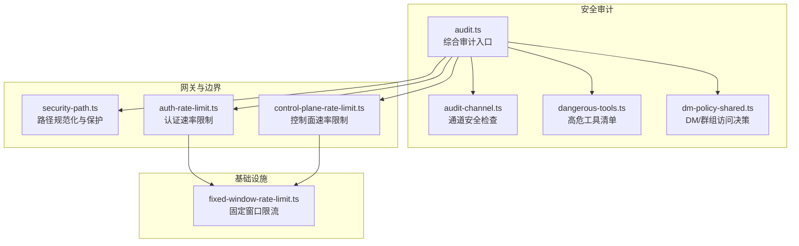
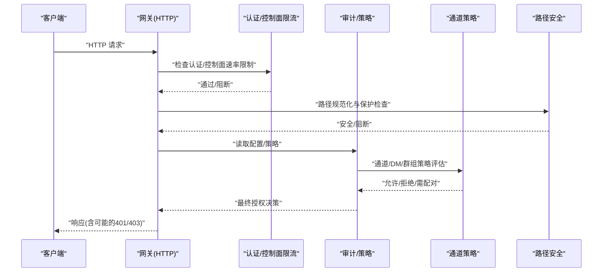
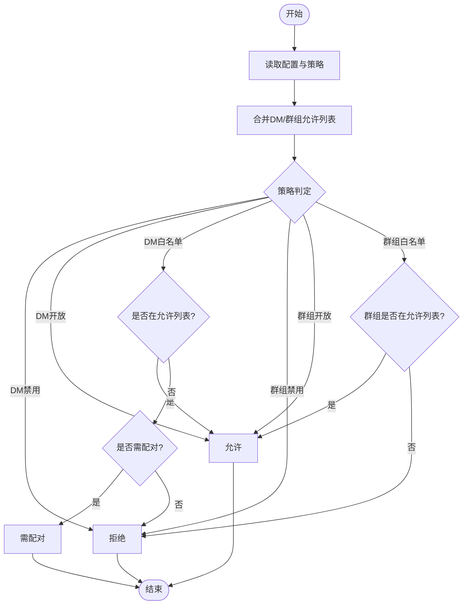
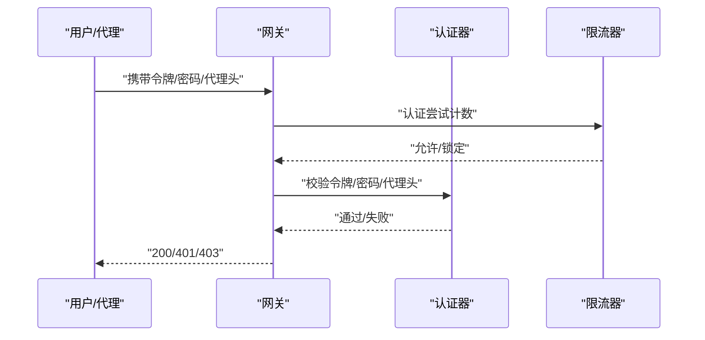
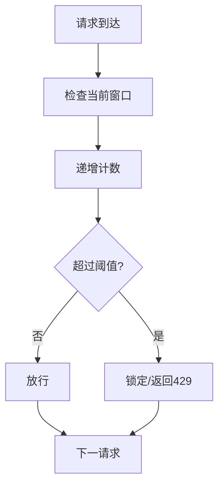
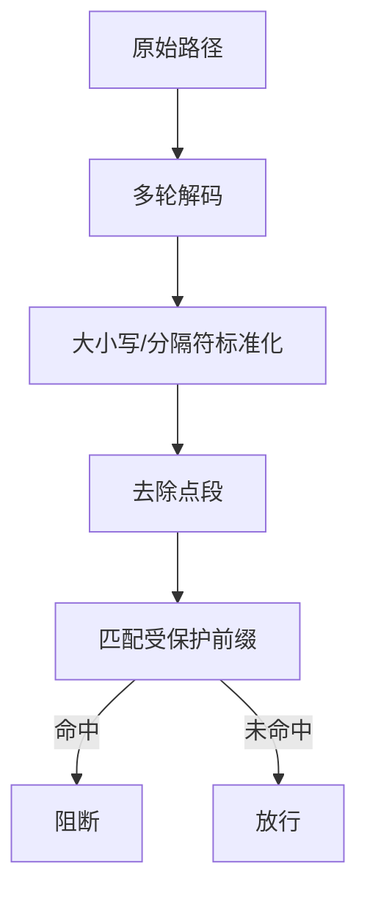
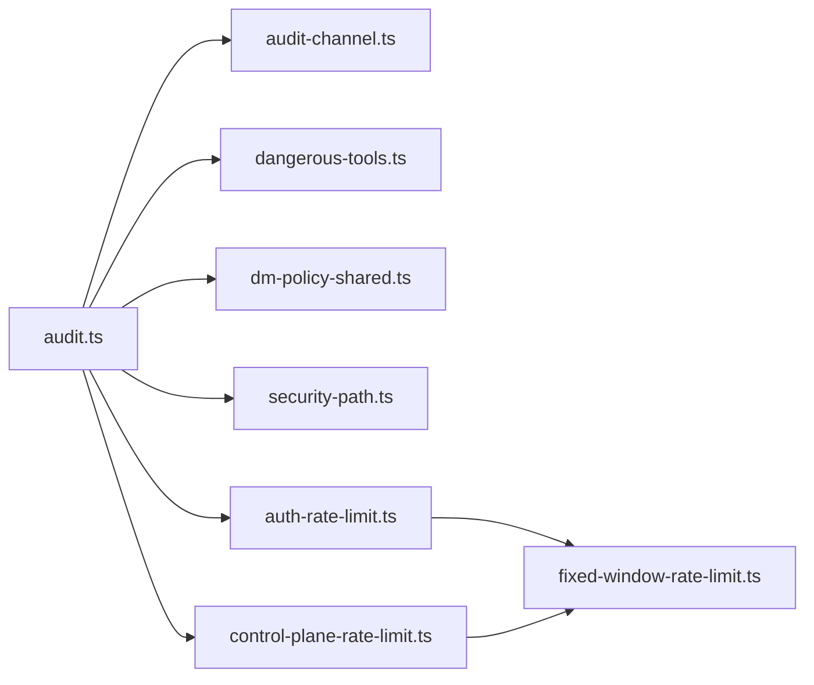

# 权限控制机制

<cite>
**本文引用的文件**
- [src/security/audit.ts](file://src/security/audit.ts)
- [src/security/audit-channel.ts](file://src/security/audit-channel.ts)
- [src/security/dangerous-tools.ts](file://src/security/dangerous-tools.ts)
- [src/security/dm-policy-shared.ts](file://src/security/dm-policy-shared.ts)
- [src/gateway/security-path.ts](file://src/gateway/security-path.ts)
- [src/gateway/auth-rate-limit.ts](file://src/gateway/auth-rate-limit.ts)
- [src/gateway/control-plane-rate-limit.ts](file://src/gateway/control-plane-rate-limit.ts)
- [src/infra/fixed-window-rate-limit.ts](file://src/infra/fixed-window-rate-limit.ts)
- [docs/gateway/authentication.md](file://docs/gateway/authentication.md)
</cite>

## 目录
1. [引言](#引言)
2. [项目结构](#项目结构)
3. [核心组件](#核心组件)
4. [架构总览](#架构总览)
5. [详细组件分析](#详细组件分析)
6. [依赖关系分析](#依赖关系分析)
7. [性能考量](#性能考量)
8. [故障排查指南](#故障排查指南)
9. [结论](#结论)

## 引言
本文件系统性梳理 OpenClaw 的权限控制机制，覆盖访问控制策略、权限级别定义、授权决策流程、认证模式（令牌验证、密码认证、代理信任）、速率限制与并发控制、资源保护策略、权限绕过与降级处理、安全边界检查以及审计与日志记录。目标是帮助开发者与运维人员在理解现有实现的基础上，正确配置与扩展安全能力。

## 项目结构
围绕权限控制的核心代码主要分布在以下模块：
- 安全审计与通道安全：src/security/*
- 网关路径安全与路由保护：src/gateway/security-path.ts
- 认证与速率限制：src/gateway/auth-rate-limit.ts、src/gateway/control-plane-rate-limit.ts
- 通用速率限制基元：src/infra/fixed-window-rate-limit.ts
- 文档与概念：docs/gateway/authentication.md

图表来源
- [src/security/audit.ts](file://src/security/audit.ts#L1-L1254)
- [src/security/audit-channel.ts](file://src/security/audit-channel.ts#L1-L726)
- [src/security/dangerous-tools.ts](file://src/security/dangerous-tools.ts#L1-L40)
- [src/security/dm-policy-shared.ts](file://src/security/dm-policy-shared.ts#L1-L321)
- [src/gateway/security-path.ts](file://src/gateway/security-path.ts#L1-L162)
- [src/gateway/auth-rate-limit.ts](file://src/gateway/auth-rate-limit.ts)
- [src/gateway/control-plane-rate-limit.ts](file://src/gateway/control-plane-rate-limit.ts)
- [src/infra/fixed-window-rate-limit.ts](file://src/infra/fixed-window-rate-limit.ts)

章节来源
- [src/security/audit.ts](file://src/security/audit.ts#L1-L1254)
- [src/security/audit-channel.ts](file://src/security/audit-channel.ts#L1-L726)
- [src/security/dangerous-tools.ts](file://src/security/dangerous-tools.ts#L1-L40)
- [src/security/dm-policy-shared.ts](file://src/security/dm-policy-shared.ts#L1-L321)
- [src/gateway/security-path.ts](file://src/gateway/security-path.ts#L1-L162)
- [src/gateway/auth-rate-limit.ts](file://src/gateway/auth-rate-limit.ts)
- [src/gateway/control-plane-rate-limit.ts](file://src/gateway/control-plane-rate-limit.ts)
- [src/infra/fixed-window-rate-limit.ts](file://src/infra/fixed-window-rate-limit.ts)

## 核心组件
- 综合安全审计器：负责收集文件系统权限、网关暴露与鉴权、浏览器控制端点、通道安全等多维度发现，并输出分级报告。
- 通道安全检查器：针对 Discord、Slack、Telegram 等渠道的 DM/群组策略、允许列表、名称匹配风险进行评估。
- 高危工具清单：集中定义默认禁止通过 HTTP 调用的高风险工具集合，作为网关 HTTP 屏蔽与 ACP 审批的依据。
- DM/群组访问决策：统一解析 DM 策略、群组策略、允许列表合并与归一化，输出允许/拒绝/需配对三种决策。
- 路径安全与保护：对请求路径进行多轮解码、规范化与前缀匹配，识别潜在路径穿越与编码逃逸。
- 认证与控制面速率限制：在认证尝试与控制面操作上实施固定窗口限流，缓解暴力破解与滥用。
- 通用限流基元：提供固定窗口计数器与滑动窗口抽象，支撑上层策略复用。

章节来源
- [src/security/audit.ts](file://src/security/audit.ts#L1-L1254)
- [src/security/audit-channel.ts](file://src/security/audit-channel.ts#L1-L726)
- [src/security/dangerous-tools.ts](file://src/security/dangerous-tools.ts#L1-L40)
- [src/security/dm-policy-shared.ts](file://src/security/dm-policy-shared.ts#L1-L321)
- [src/gateway/security-path.ts](file://src/gateway/security-path.ts#L1-L162)
- [src/gateway/auth-rate-limit.ts](file://src/gateway/auth-rate-limit.ts)
- [src/gateway/control-plane-rate-limit.ts](file://src/gateway/control-plane-rate-limit.ts)
- [src/infra/fixed-window-rate-limit.ts](file://src/infra/fixed-window-rate-limit.ts)

## 架构总览
下图展示从请求进入网关到完成鉴权与授权决策的整体流程，包括速率限制、路径安全与通道策略的协同。

图表来源
- [src/gateway/auth-rate-limit.ts](file://src/gateway/auth-rate-limit.ts)
- [src/gateway/control-plane-rate-limit.ts](file://src/gateway/control-plane-rate-limit.ts)
- [src/gateway/security-path.ts](file://src/gateway/security-path.ts#L106-L162)
- [src/security/audit-channel.ts](file://src/security/audit-channel.ts#L119-L726)
- [src/security/dm-policy-shared.ts](file://src/security/dm-policy-shared.ts#L103-L280)

## 详细组件分析

### 访问控制策略与授权决策
- DM/群组访问决策
  - 输入：DM 策略、群组策略、允许列表（含配置与配对存储）、是否为群组消息、是否启用接入组等。
  - 处理：将 DM 允许列表与群组允许列表分别归一化并合并；根据策略判定允许/拒绝/需配对。
  - 输出：决策结果与原因码，便于审计与告警。
- 通道安全策略
  - 针对 Discord/Slack/Telegram 等渠道，检查命令启用状态、允许列表完整性、名称匹配风险、群组策略一致性等。
  - 对于 Telegram，明确要求使用数字 ID 并禁止通配符；对于 Discord/Slack，若未配置允许列表且命令启用，则发出警告或严重告警。
- 高危工具屏蔽
  - 默认禁止通过 HTTP 远程调用的高风险工具集合，作为网关 HTTP 屏蔽与 ACP 审批的硬约束。

图表来源
- [src/security/dm-policy-shared.ts](file://src/security/dm-policy-shared.ts#L103-L280)
- [src/security/audit-channel.ts](file://src/security/audit-channel.ts#L201-L262)
- [src/security/dangerous-tools.ts](file://src/security/dangerous-tools.ts#L9-L40)

章节来源
- [src/security/dm-policy-shared.ts](file://src/security/dm-policy-shared.ts#L1-L321)
- [src/security/audit-channel.ts](file://src/security/audit-channel.ts#L1-L726)
- [src/security/dangerous-tools.ts](file://src/security/dangerous-tools.ts#L1-L40)

### 认证模式与授权验证
- 令牌验证
  - 支持通过环境变量或配置注入的共享密钥令牌；当令牌长度过短时会给出警告。
  - 网关绑定非回环地址且未配置认证时，会触发严重告警。
- 密码认证
  - 当显式选择密码模式或在未配置令牌的情况下启用密码模式，密码即生效。
  - 浏览器控制端点启用但未配置令牌/密码时，会触发严重告警。
- 代理信任机制
  - 受信代理模式下，认证委托给反向代理（如 Pomerium、Caddy、nginx），必须严格限定受信代理 IP 并配置用户头字段。
  - 若未配置受信代理或未设置用户头字段，将触发严重告警。

图表来源
- [src/security/audit.ts](file://src/security/audit.ts#L339-L687)
- [src/gateway/auth-rate-limit.ts](file://src/gateway/auth-rate-limit.ts)
- [docs/gateway/authentication.md](file://docs/gateway/authentication.md#L1-L180)

章节来源
- [src/security/audit.ts](file://src/security/audit.ts#L339-L687)
- [docs/gateway/authentication.md](file://docs/gateway/authentication.md#L1-L180)

### 速率限制与并发控制
- 固定窗口限流基元
  - 提供计数器与到期时间管理，支持并发安全的计数与重置。
- 认证速率限制
  - 在网关认证接口上实施固定窗口限流，避免暴力破解；当网关对外暴露且未配置限流时，审计器会发出警告。
- 控制面速率限制
  - 对控制面敏感操作（如工具调用、配置变更）实施限流，降低滥用风险。
- 并发控制
  - 限流器内部以原子方式更新计数，避免竞态；可结合令牌桶/滑动窗口扩展。

图表来源
- [src/infra/fixed-window-rate-limit.ts](file://src/infra/fixed-window-rate-limit.ts)
- [src/gateway/auth-rate-limit.ts](file://src/gateway/auth-rate-limit.ts)
- [src/gateway/control-plane-rate-limit.ts](file://src/gateway/control-plane-rate-limit.ts)

章节来源
- [src/infra/fixed-window-rate-limit.ts](file://src/infra/fixed-window-rate-limit.ts)
- [src/gateway/auth-rate-limit.ts](file://src/gateway/auth-rate-limit.ts)
- [src/gateway/control-plane-rate-limit.ts](file://src/gateway/control-plane-rate-limit.ts)

### 资源保护策略与安全边界
- 路径规范化与保护
  - 对路径进行多轮解码、大小写与分隔符标准化、去除点段，生成候选路径集。
  - 检查候选路径是否命中受保护前缀（如插件 API 前缀），若无法完全解析或存在畸形编码则按“按封关闭”策略阻断。
- 文件系统与配置安全
  - 审计器检查状态目录与配置文件的权限，若可被其他用户写入或可被世界读取，会给出严重/警告等级告警，并提供修复建议。
- 通道安全边界
  - 对 Telegram 的允许列表强制数字 ID 与禁止通配符；对 Discord/Slack 的命令启用与允许列表缺失进行分级告警。

图表来源
- [src/gateway/security-path.ts](file://src/gateway/security-path.ts#L45-L162)

章节来源
- [src/gateway/security-path.ts](file://src/gateway/security-path.ts#L1-L162)
- [src/security/audit.ts](file://src/security/audit.ts#L208-L337)
- [src/security/audit-channel.ts](file://src/security/audit-channel.ts#L586-L721)

### 权限绕过、降级处理与审计
- 权限绕过
  - 受信代理模式下，仅在代理正确终止 TLS、认证用户并严格限定代理 IP 时才允许绕过本地鉴权；否则一律拒绝。
- 降级处理
  - 当配置项开启危险标志（如允许主机头来源回退、禁用设备身份校验）时，审计器会给出严重告警，提示短期应急场景与修复建议。
- 审计与日志
  - 审计器输出分级报告（信息/警告/严重），包含检查 ID、标题、详情与修复建议；深检模式可探测网关可达性与错误原因。
  - 日志方面，审计器提供可选的深检网关探测结果，便于定位网络与认证问题。

章节来源
- [src/security/audit.ts](file://src/security/audit.ts#L568-L687)
- [src/security/audit.ts](file://src/security/audit.ts#L799-L800)

## 依赖关系分析
- 审计器依赖各子模块：通道安全、危险工具清单、DM/群组策略、路径安全、限流器等。
- 通道安全依赖允许列表合并与归一化、配对存储读取、命令门控等。
- 限流器为认证与控制面提供通用能力，支持固定窗口策略。

图表来源
- [src/security/audit.ts](file://src/security/audit.ts#L1-L1254)
- [src/security/audit-channel.ts](file://src/security/audit-channel.ts#L1-L726)
- [src/security/dangerous-tools.ts](file://src/security/dangerous-tools.ts#L1-L40)
- [src/security/dm-policy-shared.ts](file://src/security/dm-policy-shared.ts#L1-L321)
- [src/gateway/security-path.ts](file://src/gateway/security-path.ts#L1-L162)
- [src/gateway/auth-rate-limit.ts](file://src/gateway/auth-rate-limit.ts)
- [src/gateway/control-plane-rate-limit.ts](file://src/gateway/control-plane-rate-limit.ts)
- [src/infra/fixed-window-rate-limit.ts](file://src/infra/fixed-window-rate-limit.ts)

章节来源
- [src/security/audit.ts](file://src/security/audit.ts#L1-L1254)
- [src/security/audit-channel.ts](file://src/security/audit-channel.ts#L1-L726)
- [src/security/dangerous-tools.ts](file://src/security/dangerous-tools.ts#L1-L40)
- [src/security/dm-policy-shared.ts](file://src/security/dm-policy-shared.ts#L1-L321)
- [src/gateway/security-path.ts](file://src/gateway/security-path.ts#L1-L162)
- [src/gateway/auth-rate-limit.ts](file://src/gateway/auth-rate-limit.ts)
- [src/gateway/control-plane-rate-limit.ts](file://src/gateway/control-plane-rate-limit.ts)
- [src/infra/fixed-window-rate-limit.ts](file://src/infra/fixed-window-rate-limit.ts)

## 性能考量
- 限流实现采用固定窗口计数，时间复杂度低、内存占用小，适合高并发场景。
- 路径规范化在最大解码次数内完成，避免恶意编码导致的 CPU 消耗。
- 审计器支持缓存与深检超时参数，减少重复计算与外部探测开销。

## 故障排查指南
- 认证失败/401
  - 检查网关绑定与认证配置；确认令牌/密码长度与格式；若启用受信代理，核对代理 IP 与用户头字段。
- 429 过载
  - 观察认证/控制面限流是否触发；适当提高阈值或缩短窗口；检查是否存在异常扫描。
- 通道命令不可用
  - 检查命令启用与允许列表配置；对 Telegram 使用数字 ID 并移除通配符；对 Discord/Slack 补充 per-guild/channel 用户允许列表。
- 路径异常/被阻断
  - 检查 URL 编码与路径前缀；确保未命中受保护前缀；避免畸形编码逃逸。
- 审计报告
  - 关注严重/警告等级告警，优先修复严重项；按修复建议调整权限与配置。

章节来源
- [src/security/audit.ts](file://src/security/audit.ts#L134-L148)
- [src/gateway/auth-rate-limit.ts](file://src/gateway/auth-rate-limit.ts)
- [src/gateway/security-path.ts](file://src/gateway/security-path.ts#L106-L162)
- [src/security/audit-channel.ts](file://src/security/audit-channel.ts#L586-L721)

## 结论
OpenClaw 的权限控制机制以“最小权限+强边界”为核心设计原则：通过集中化的安全审计、严格的通道策略、高危工具屏蔽、路径安全与速率限制，构建了从配置到运行时的多层防护。建议在生产环境中：
- 优先使用令牌认证并强化其强度；
- 对外暴露的网关务必配置认证与速率限制；
- 通道命令启用需配套允许列表与稳定标识；
- 定期运行安全审计，及时修复告警项；
- 在受信代理模式下严格限定代理与用户头字段。