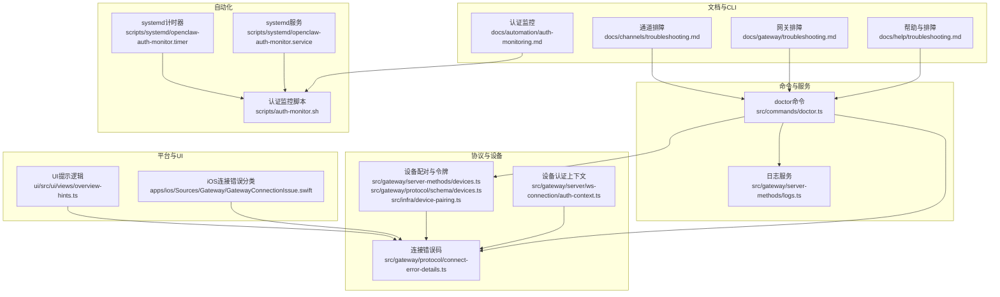
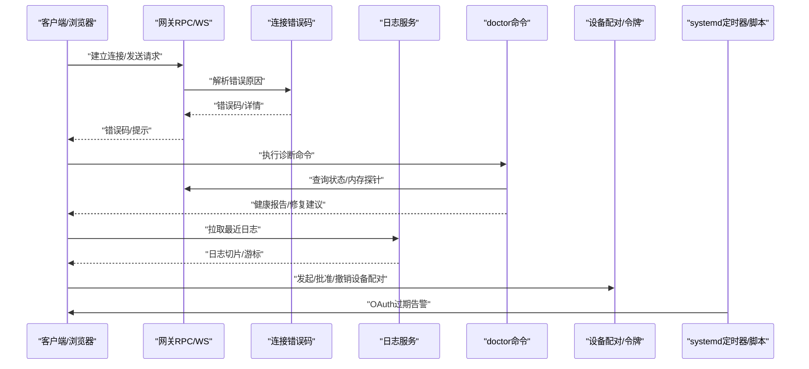
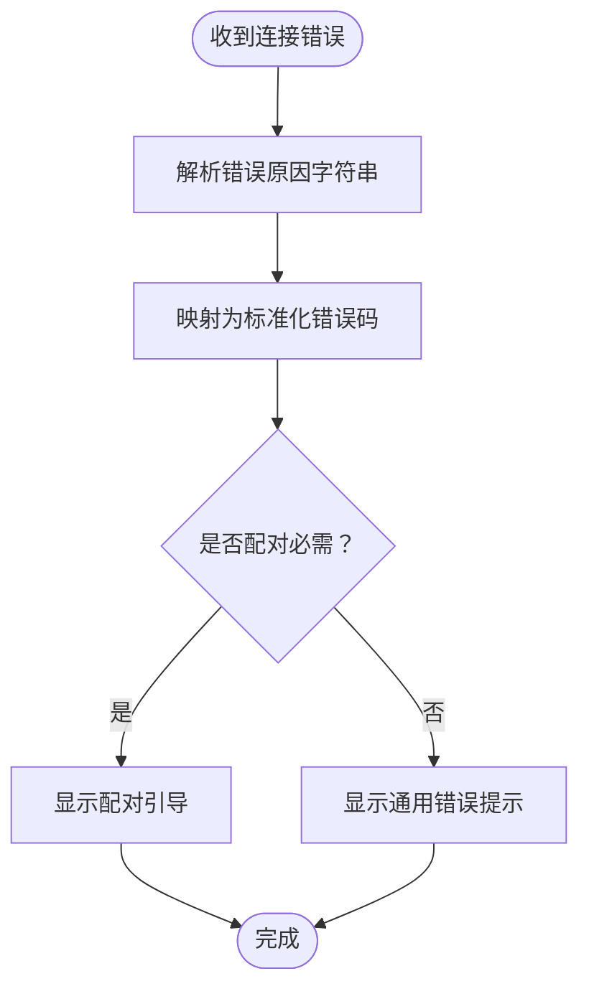
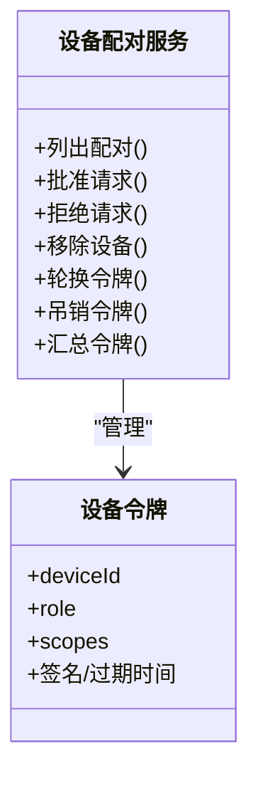
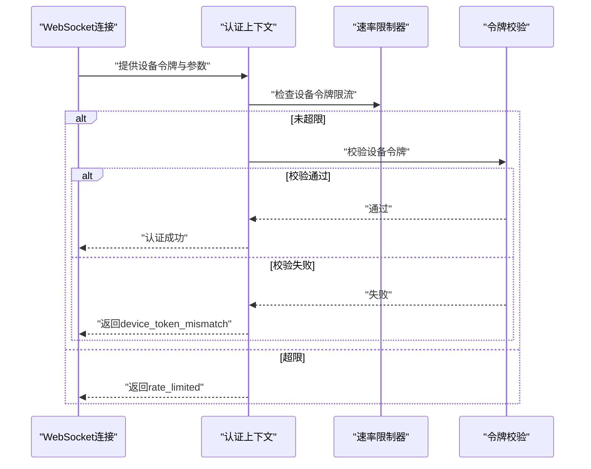
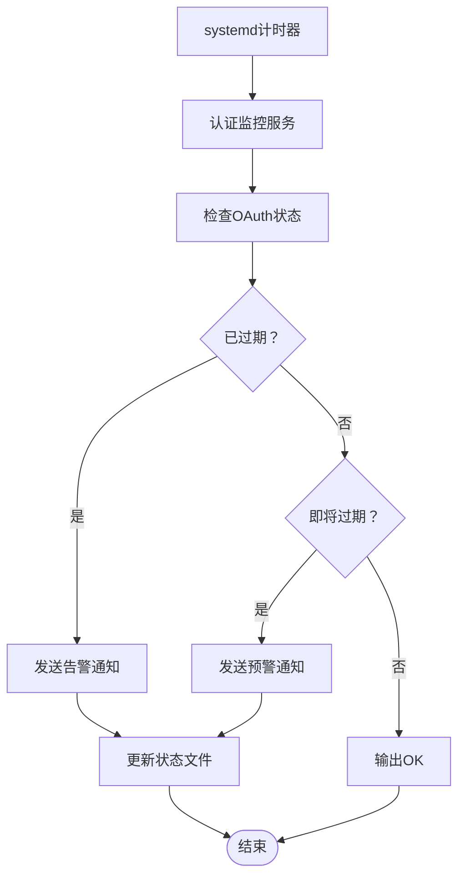
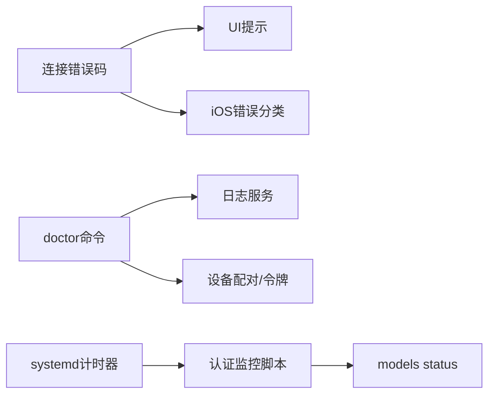

# 认证问题诊断

<cite>
**本文引用的文件**
- [docs/help/troubleshooting.md](file://docs/help/troubleshooting.md)
- [docs/gateway/troubleshooting.md](file://docs/gateway/troubleshooting.md)
- [docs/channels/troubleshooting.md](file://docs/channels/troubleshooting.md)
- [docs/automation/auth-monitoring.md](file://docs/automation/auth-monitoring.md)
- [scripts/systemd/openclaw-auth-monitor.service](file://scripts/systemd/openclaw-auth-monitor.service)
- [scripts/systemd/openclaw-auth-monitor.timer](file://scripts/systemd/openclaw-auth-monitor.timer)
- [scripts/auth-monitor.sh](file://scripts/auth-monitor.sh)
- [src/gateway/protocol/connect-error-details.ts](file://src/gateway/protocol/connect-error-details.ts)
- [src/gateway/server/ws-connection/auth-context.ts](file://src/gateway/server/ws-connection/auth-context.ts)
- [src/gateway/server-methods/devices.ts](file://src/gateway/server-methods/devices.ts)
- [src/gateway/protocol/schema/devices.ts](file://src/gateway/protocol/schema/devices.ts)
- [src/infra/device-pairing.ts](file://src/infra/device-pairing.ts)
- [apps/ios/Sources/Gateway/GatewayConnectionIssue.swift](file://apps/ios/Sources/Gateway/GatewayConnectionIssue.swift)
- [ui/src/ui/views/overview-hints.ts](file://ui/src/ui/views/overview-hints.ts)
- [src/commands/doctor.ts](file://src/commands/doctor.ts)
- [src/gateway/server-methods/logs.ts](file://src/gateway/server-methods/logs.ts)
- [src/agents/auth-health.test.ts](file://src/agents/auth-health.test.ts)
- [docs/zh-CN/gateway/security/index.md](file://docs/zh-CN/gateway/security/index.md)
</cite>

## 目录
1. [简介](#简介)
2. [项目结构](#项目结构)
3. [核心组件](#核心组件)
4. [架构总览](#架构总览)
5. [详细组件分析](#详细组件分析)
6. [依赖关系分析](#依赖关系分析)
7. [性能考量](#性能考量)
8. [故障排除指南](#故障排除指南)
9. [结论](#结论)
10. [附录](#附录)

## 简介
本文件面向OpenClaw技术支持与运维工程师，提供系统化的认证问题诊断流程与实操指引。内容覆盖设备配对、API密钥与OAuth过期、权限不足、认证循环等常见问题，配套日志分析方法、调试工具使用、错误码含义解析，并给出多平台与多渠道的解决方案、预防性检查清单、安全配置验证与性能优化建议。

## 项目结构
OpenClaw围绕“网关-通道-节点-扩展”的分层架构组织认证与故障排除能力：
- 文档层：提供端到端排障路径与各子系统的快速定位方法
- 命令层：doctor/status/gateway/probe等CLI命令用于健康检查与自动化监控
- 协议与服务层：定义连接错误码、设备配对协议与设备令牌管理
- 平台与UI层：iOS客户端错误分类、Web控制界面提示逻辑
- 自动化脚本：systemd定时器与通知脚本实现OAuth过期监控与告警

图表来源
- [docs/help/troubleshooting.md](file://docs/help/troubleshooting.md#L1-L297)
- [docs/gateway/troubleshooting.md](file://docs/gateway/troubleshooting.md#L1-L367)
- [docs/channels/troubleshooting.md](file://docs/channels/troubleshooting.md#L1-L118)
- [docs/automation/auth-monitoring.md](file://docs/automation/auth-monitoring.md#L1-L45)
- [src/commands/doctor.ts](file://src/commands/doctor.ts#L1-L364)
- [src/gateway/server-methods/logs.ts](file://src/gateway/server-methods/logs.ts#L1-L181)
- [src/gateway/protocol/connect-error-details.ts](file://src/gateway/protocol/connect-error-details.ts#L1-L94)
- [src/gateway/server/ws-connection/auth-context.ts](file://src/gateway/server/ws-connection/auth-context.ts#L180-L218)
- [src/gateway/server-methods/devices.ts](file://src/gateway/server-methods/devices.ts#L1-L32)
- [src/gateway/protocol/schema/devices.ts](file://src/gateway/protocol/schema/devices.ts#L1-L36)
- [src/infra/device-pairing.ts](file://src/infra/device-pairing.ts#L195-L235)
- [apps/ios/Sources/Gateway/GatewayConnectionIssue.swift](file://apps/ios/Sources/Gateway/GatewayConnectionIssue.swift#L1-L35)
- [ui/src/ui/views/overview-hints.ts](file://ui/src/ui/views/overview-hints.ts#L1-L16)
- [scripts/systemd/openclaw-auth-monitor.service](file://scripts/systemd/openclaw-auth-monitor.service#L1-L15)
- [scripts/systemd/openclaw-auth-monitor.timer](file://scripts/systemd/openclaw-auth-monitor.timer#L1-L11)
- [scripts/auth-monitor.sh](file://scripts/auth-monitor.sh#L1-L90)

章节来源
- [docs/help/troubleshooting.md](file://docs/help/troubleshooting.md#L1-L297)
- [docs/gateway/troubleshooting.md](file://docs/gateway/troubleshooting.md#L1-L367)
- [docs/channels/troubleshooting.md](file://docs/channels/troubleshooting.md#L1-L118)
- [docs/automation/auth-monitoring.md](file://docs/automation/auth-monitoring.md#L1-L45)
- [src/commands/doctor.ts](file://src/commands/doctor.ts#L1-L364)
- [src/gateway/server-methods/logs.ts](file://src/gateway/server-methods/logs.ts#L1-L181)
- [src/gateway/protocol/connect-error-details.ts](file://src/gateway/protocol/connect-error-details.ts#L1-L94)
- [src/gateway/server/ws-connection/auth-context.ts](file://src/gateway/server/ws-connection/auth-context.ts#L180-L218)
- [src/gateway/server-methods/devices.ts](file://src/gateway/server-methods/devices.ts#L1-L32)
- [src/gateway/protocol/schema/devices.ts](file://src/gateway/protocol/schema/devices.ts#L1-L36)
- [src/infra/device-pairing.ts](file://src/infra/device-pairing.ts#L195-L235)
- [apps/ios/Sources/Gateway/GatewayConnectionIssue.swift](file://apps/ios/Sources/Gateway/GatewayConnectionIssue.swift#L1-L35)
- [ui/src/ui/views/overview-hints.ts](file://ui/src/ui/views/overview-hints.ts#L1-L16)
- [scripts/systemd/openclaw-auth-monitor.service](file://scripts/systemd/openclaw-auth-monitor.service#L1-L15)
- [scripts/systemd/openclaw-auth-monitor.timer](file://scripts/systemd/openclaw-auth-monitor.timer#L1-L11)
- [scripts/auth-monitor.sh](file://scripts/auth-monitor.sh#L1-L90)

## 核心组件
- 连接错误码与解析：统一的错误码常量与解析函数，便于UI与客户端映射到用户可理解的提示。
- 设备配对与令牌：设备侧请求批准/拒绝、移除；服务端校验角色与作用域；令牌轮换与吊销。
- 认证上下文：基于设备令牌的速率限制与校验流程，失败时记录并返回具体原因。
- CLI诊断与自动化：doctor命令进行健康检查与修复建议；日志服务提供滚动日志读取；systemd定时器与脚本实现OAuth过期监控。
- 平台与UI：iOS侧错误分类；Web UI根据错误码显示配对引导提示。

章节来源
- [src/gateway/protocol/connect-error-details.ts](file://src/gateway/protocol/connect-error-details.ts#L1-L94)
- [src/gateway/server-methods/devices.ts](file://src/gateway/server-methods/devices.ts#L1-L32)
- [src/gateway/protocol/schema/devices.ts](file://src/gateway/protocol/schema/devices.ts#L1-L36)
- [src/infra/device-pairing.ts](file://src/infra/device-pairing.ts#L195-L235)
- [src/gateway/server/ws-connection/auth-context.ts](file://src/gateway/server/ws-connection/auth-context.ts#L180-L218)
- [src/commands/doctor.ts](file://src/commands/doctor.ts#L1-L364)
- [src/gateway/server-methods/logs.ts](file://src/gateway/server-methods/logs.ts#L1-L181)
- [apps/ios/Sources/Gateway/GatewayConnectionIssue.swift](file://apps/ios/Sources/Gateway/GatewayConnectionIssue.swift#L1-L35)
- [ui/src/ui/views/overview-hints.ts](file://ui/src/ui/views/overview-hints.ts#L1-L16)

## 架构总览
下图展示认证问题诊断的关键交互：客户端/网关通过错误码与UI提示反馈问题；doctor与日志服务提供健康检查与日志切片；设备配对与令牌管理贯穿移动端与Web端；systemd定时器驱动OAuth过期监控脚本。

图表来源
- [src/gateway/protocol/connect-error-details.ts](file://src/gateway/protocol/connect-error-details.ts#L1-L94)
- [src/gateway/server-methods/logs.ts](file://src/gateway/server-methods/logs.ts#L1-L181)
- [src/commands/doctor.ts](file://src/commands/doctor.ts#L1-L364)
- [src/gateway/server-methods/devices.ts](file://src/gateway/server-methods/devices.ts#L1-L32)
- [scripts/systemd/openclaw-auth-monitor.timer](file://scripts/systemd/openclaw-auth-monitor.timer#L1-L11)
- [scripts/auth-monitor.sh](file://scripts/auth-monitor.sh#L1-L90)

## 详细组件分析

### 组件A：连接错误码与UI提示
- 错误码覆盖：认证缺失、不匹配、未配置、密码类、设备认证、配对必需、速率限制等。
- 解析逻辑：将底层reason映射为标准化错误码，便于前端与移动端一致处理。
- UI提示：当错误码为配对必需或包含“配对所需”时，UI显示设备配对引导。

图表来源
- [src/gateway/protocol/connect-error-details.ts](file://src/gateway/protocol/connect-error-details.ts#L31-L94)
- [ui/src/ui/views/overview-hints.ts](file://ui/src/ui/views/overview-hints.ts#L1-L16)

章节来源
- [src/gateway/protocol/connect-error-details.ts](file://src/gateway/protocol/connect-error-details.ts#L1-L94)
- [ui/src/ui/views/overview-hints.ts](file://ui/src/ui/views/overview-hints.ts#L1-L16)

### 组件B：设备配对与令牌管理
- 配对操作：列出、批准、拒绝、移除已配对设备；令牌轮换与吊销；汇总令牌摘要。
- 角色与作用域：支持角色与作用域参数；作用域存在隐含关系，系统自动展开。
- 令牌生成：新令牌生成与复制设备令牌集合。

图表来源
- [src/gateway/server-methods/devices.ts](file://src/gateway/server-methods/devices.ts#L1-L32)
- [src/gateway/protocol/schema/devices.ts](file://src/gateway/protocol/schema/devices.ts#L1-L36)
- [src/infra/device-pairing.ts](file://src/infra/device-pairing.ts#L195-L235)

章节来源
- [src/gateway/server-methods/devices.ts](file://src/gateway/server-methods/devices.ts#L1-L32)
- [src/gateway/protocol/schema/devices.ts](file://src/gateway/protocol/schema/devices.ts#L1-L36)
- [src/infra/device-pairing.ts](file://src/infra/device-pairing.ts#L195-L235)

### 组件C：认证上下文与速率限制
- 速率限制：按设备维度对设备令牌校验进行限流；失败记录，成功重置。
- 设备令牌校验：携带deviceId、token、role、scopes；若显式设备令牌不匹配，返回device_token_mismatch。
- 失败原因：结合速率限制与令牌校验结果，返回具体reason供UI映射。

图表来源
- [src/gateway/server/ws-connection/auth-context.ts](file://src/gateway/server/ws-connection/auth-context.ts#L180-L218)

章节来源
- [src/gateway/server/ws-connection/auth-context.ts](file://src/gateway/server/ws-connection/auth-context.ts#L180-L218)

### 组件D：OAuth过期监控与自动化
- CLI检查：models status --check提供退出码区分“正常/过期/即将过期”，适合自动化与定时任务。
- systemd定时器：每30分钟触发一次认证监控服务；服务执行通知脚本。
- 通知策略：优先通过OpenClaw通道发送消息，其次通过ntfy推送；带去重与阈值控制。

图表来源
- [docs/automation/auth-monitoring.md](file://docs/automation/auth-monitoring.md#L1-L45)
- [scripts/systemd/openclaw-auth-monitor.service](file://scripts/systemd/openclaw-auth-monitor.service#L1-L15)
- [scripts/systemd/openclaw-auth-monitor.timer](file://scripts/systemd/openclaw-auth-monitor.timer#L1-L11)
- [scripts/auth-monitor.sh](file://scripts/auth-monitor.sh#L1-L90)

章节来源
- [docs/automation/auth-monitoring.md](file://docs/automation/auth-monitoring.md#L1-L45)
- [scripts/systemd/openclaw-auth-monitor.service](file://scripts/systemd/openclaw-auth-monitor.service#L1-L15)
- [scripts/systemd/openclaw-auth-monitor.timer](file://scripts/systemd/openclaw-auth-monitor.timer#L1-L11)
- [scripts/auth-monitor.sh](file://scripts/auth-monitor.sh#L1-L90)

### 组件E：平台与UI辅助诊断
- iOS错误分类：将连接失败归类为无令牌、未授权、需要配对、网络异常、未知等，便于客户端针对性处理。
- Web UI提示：当错误码为PAIRING_REQUIRED或包含“配对所需”时，显示配对引导。

章节来源
- [apps/ios/Sources/Gateway/GatewayConnectionIssue.swift](file://apps/ios/Sources/Gateway/GatewayConnectionIssue.swift#L1-L35)
- [ui/src/ui/views/overview-hints.ts](file://ui/src/ui/views/overview-hints.ts#L1-L16)

## 依赖关系分析
- 错误码与UI/平台：错误码解析模块被UI与iOS共享，确保跨端一致性。
- 诊断命令与服务：doctor命令依赖网关RPC与日志服务；日志服务依赖配置解析与文件系统。
- 设备配对与令牌：设备配对API与令牌管理模块被网关服务端方法调用。
- 自动化监控：脚本依赖CLI命令作为权威状态源，systemd负责调度。

图表来源
- [src/gateway/protocol/connect-error-details.ts](file://src/gateway/protocol/connect-error-details.ts#L1-L94)
- [ui/src/ui/views/overview-hints.ts](file://ui/src/ui/views/overview-hints.ts#L1-L16)
- [apps/ios/Sources/Gateway/GatewayConnectionIssue.swift](file://apps/ios/Sources/Gateway/GatewayConnectionIssue.swift#L1-L35)
- [src/commands/doctor.ts](file://src/commands/doctor.ts#L1-L364)
- [src/gateway/server-methods/logs.ts](file://src/gateway/server-methods/logs.ts#L1-L181)
- [src/gateway/server-methods/devices.ts](file://src/gateway/server-methods/devices.ts#L1-L32)
- [docs/automation/auth-monitoring.md](file://docs/automation/auth-monitoring.md#L1-L45)
- [scripts/systemd/openclaw-auth-monitor.timer](file://scripts/systemd/openclaw-auth-monitor.timer#L1-L11)

章节来源
- [src/gateway/protocol/connect-error-details.ts](file://src/gateway/protocol/connect-error-details.ts#L1-L94)
- [ui/src/ui/views/overview-hints.ts](file://ui/src/ui/views/overview-hints.ts#L1-L16)
- [apps/ios/Sources/Gateway/GatewayConnectionIssue.swift](file://apps/ios/Sources/Gateway/GatewayConnectionIssue.swift#L1-L35)
- [src/commands/doctor.ts](file://src/commands/doctor.ts#L1-L364)
- [src/gateway/server-methods/logs.ts](file://src/gateway/server-methods/logs.ts#L1-L181)
- [src/gateway/server-methods/devices.ts](file://src/gateway/server-methods/devices.ts#L1-L32)
- [docs/automation/auth-monitoring.md](file://docs/automation/auth-monitoring.md#L1-L45)
- [scripts/systemd/openclaw-auth-monitor.timer](file://scripts/systemd/openclaw-auth-monitor.timer#L1-L11)

## 性能考量
- 日志读取：限制最大字节数与行数，避免一次性读取过大日志导致阻塞；支持游标与重置机制。
- 速率限制：设备令牌校验采用限流，防止暴力尝试；成功后重置，失败记录，降低资源消耗。
- 自动化频率：systemd计时器默认30分钟一次，避免频繁检查带来的负载；通知去重与阈值控制减少噪音。

章节来源
- [src/gateway/server-methods/logs.ts](file://src/gateway/server-methods/logs.ts#L1-L181)
- [src/gateway/server/ws-connection/auth-context.ts](file://src/gateway/server/ws-connection/auth-context.ts#L180-L218)
- [scripts/systemd/openclaw-auth-monitor.timer](file://scripts/systemd/openclaw-auth-monitor.timer#L1-L11)

## 故障排除指南

### 通用排障流程（症状导向）
- 快速三板斧：status、gateway status、logs --follow；随后doctor与channels status --probe。
- 分类排查：根据“先连通、后认证、再业务”的顺序，逐步缩小范围。
- 常见症状与定位：
  - 控制UI无法连接：检查URL、认证模式、设备身份要求、非安全上下文。
  - 网关启动/服务异常：检查gateway.mode、绑定地址与认证配置、端口占用。
  - 通道已连但消息不流动：检查配对/允许列表、提及策略、权限与作用域。
  - 节点已配对但工具执行失败：检查前台状态、系统权限、执行审批与白名单。
  - 浏览器工具失败：检查浏览器可执行路径、CDP可达性、扩展连接状态。

章节来源
- [docs/help/troubleshooting.md](file://docs/help/troubleshooting.md#L13-L297)
- [docs/gateway/troubleshooting.md](file://docs/gateway/troubleshooting.md#L14-L367)
- [docs/channels/troubleshooting.md](file://docs/channels/troubleshooting.md#L13-L118)

### 设备配对问题
- 现象：UI提示“需要配对”或日志出现“pairing required”。
- 诊断步骤：
  - 在网关侧列出待审批请求，确认设备ID与角色。
  - 若设备已批准但仍失败，检查设备令牌的角色与作用域是否满足当前请求。
  - 如需撤销或轮换令牌，使用对应管理命令清理无效令牌。
- 平台差异：
  - iOS：连接错误分类包含“需要配对”，客户端应引导用户在网关完成配对。
  - Web UI：当错误码为PAIRING_REQUIRED时显示配对引导。

章节来源
- [src/gateway/server-methods/devices.ts](file://src/gateway/server-methods/devices.ts#L1-L32)
- [src/gateway/protocol/schema/devices.ts](file://src/gateway/protocol/schema/devices.ts#L1-L36)
- [src/infra/device-pairing.ts](file://src/infra/device-pairing.ts#L195-L235)
- [apps/ios/Sources/Gateway/GatewayConnectionIssue.swift](file://apps/ios/Sources/Gateway/GatewayConnectionIssue.swift#L1-L35)
- [ui/src/ui/views/overview-hints.ts](file://ui/src/ui/views/overview-hints.ts#L1-L16)

### API密钥与OAuth失效
- 现象：429/401/403、模型状态显示过期或即将过期、自动化告警。
- 诊断步骤：
  - 使用models status --check获取退出码判断状态。
  - 对于Claude Code等，使用scripts/claude-auth-status.sh与scripts/auth-monitor.sh进行检查与告警。
  - systemd定时器每30分钟触发一次监控服务，必要时调整WARN_HOURS阈值。
- 预防与修复：
  - 在CI/定时任务中集成models status --check。
  - 使用systemd计时器与通知脚本，确保及时发现与提醒。

章节来源
- [docs/automation/auth-monitoring.md](file://docs/automation/auth-monitoring.md#L1-L45)
- [scripts/systemd/openclaw-auth-monitor.service](file://scripts/systemd/openclaw-auth-monitor.service#L1-L15)
- [scripts/systemd/openclaw-auth-monitor.timer](file://scripts/systemd/openclaw-auth-monitor.timer#L1-L11)
- [scripts/auth-monitor.sh](file://scripts/auth-monitor.sh#L1-L90)

### 权限不足与作用域问题
- 现象：通道报错“missing_scope”、“not_in_channel”、“401/403”。
- 诊断步骤：
  - 检查通道API权限与scope配置，确保具备必要的读写与管理权限。
  - 对于设备令牌，确认角色与作用域展开后满足请求。
- 修复建议：
  - 为设备分配最小必要作用域；通过轮换令牌更新权限范围。

章节来源
- [src/gateway/protocol/schema/devices.ts](file://src/gateway/protocol/schema/devices.ts#L1-L36)
- [src/infra/device-pairing.ts](file://src/infra/device-pairing.ts#L195-L235)

### 认证循环与速率限制
- 现象：反复重连、UI提示“unauthorized”、日志出现“rate_limited”。
- 诊断步骤：
  - 检查客户端与网关的认证模式是否一致（token/password）。
  - 查看设备令牌是否正确传递且未过期。
  - 关注速率限制器记录，确认是否存在恶意尝试或客户端重试策略不当。
- 修复建议：
  - 统一认证模式；为客户端增加退避重试；必要时临时放宽限流阈值以定位问题。

章节来源
- [src/gateway/server/ws-connection/auth-context.ts](file://src/gateway/server/ws-connection/auth-context.ts#L180-L218)

### 日志分析方法与调试工具
- 日志读取：使用logs.tail获取最近日志切片，支持limit与maxBytes限制，避免大文件读取卡顿。
- 健康检查：doctor命令输出综合诊断报告，包含配置有效性、服务状态、内存检索可用性、安全警告等。
- UI与平台：iOS侧错误分类帮助客户端快速定位问题；Web UI根据错误码显示配对提示。

章节来源
- [src/gateway/server-methods/logs.ts](file://src/gateway/server-methods/logs.ts#L1-L181)
- [src/commands/doctor.ts](file://src/commands/doctor.ts#L1-L364)
- [apps/ios/Sources/Gateway/GatewayConnectionIssue.swift](file://apps/ios/Sources/Gateway/GatewayConnectionIssue.swift#L1-L35)
- [ui/src/ui/views/overview-hints.ts](file://ui/src/ui/views/overview-hints.ts#L1-L16)

### 不同平台与渠道的解决方案
- iOS：遇到“需要配对”或“未授权”时，引导用户在网关完成配对或更换认证方式。
- Web：当错误码为PAIRING_REQUIRED时显示配对引导；检查HTTPS与设备身份要求。
- 通道（Discord/Telegram/WhatsApp/Slack等）：检查配对列表、提及策略、允许列表与权限scope。

章节来源
- [apps/ios/Sources/Gateway/GatewayConnectionIssue.swift](file://apps/ios/Sources/Gateway/GatewayConnectionIssue.swift#L1-L35)
- [ui/src/ui/views/overview-hints.ts](file://ui/src/ui/views/overview-hints.ts#L1-L16)
- [docs/channels/troubleshooting.md](file://docs/channels/troubleshooting.md#L1-L118)

### 预防性检查清单
- 启动前：gateway.mode、绑定地址与认证配置、systemd用户会话留驻（Linux）。
- 运行中：OAuth过期监控、速率限制与告警、日志滚动与容量控制。
- 安全：最小权限作用域、敏感信息脱敏、定期安全审计。

章节来源
- [src/commands/doctor.ts](file://src/commands/doctor.ts#L1-L364)
- [docs/automation/auth-monitoring.md](file://docs/automation/auth-monitoring.md#L1-L45)
- [docs/zh-CN/gateway/security/index.md](file://docs/zh-CN/gateway/security/index.md#L1-L45)

### 安全配置验证
- 安全审计：定期运行openclaw security audit，收紧组策略、日志敏感度与文件权限。
- 最小权限：为代理与工具分配最小必要权限，避免全局读写与shell执行。
- 机密管理：使用SecretRef管理外部机密，避免明文存储。

章节来源
- [docs/zh-CN/gateway/security/index.md](file://docs/zh-CN/gateway/security/index.md#L1-L45)
- [src/commands/doctor.ts](file://src/commands/doctor.ts#L1-L364)

### 性能优化建议
- 日志：限制每次读取大小与行数，启用游标与重置，避免阻塞。
- 速率限制：合理设置设备令牌校验限流，平衡安全与性能。
- 自动化：使用systemd计时器与阈值控制，避免过于频繁的检查。

章节来源
- [src/gateway/server-methods/logs.ts](file://src/gateway/server-methods/logs.ts#L1-L181)
- [src/gateway/server/ws-connection/auth-context.ts](file://src/gateway/server/ws-connection/auth-context.ts#L180-L218)
- [scripts/systemd/openclaw-auth-monitor.timer](file://scripts/systemd/openclaw-auth-monitor.timer#L1-L11)

## 结论
通过统一的错误码体系、完善的设备配对与令牌管理、系统化的CLI诊断与自动化监控，OpenClaw能够有效支撑认证问题的快速定位与修复。建议在日常运维中结合doctor命令、日志服务与systemd定时器，形成“预防—监控—诊断—修复”的闭环，持续提升系统稳定性与安全性。

## 附录

### 常见错误码速查
- AUTH_REQUIRED/AUTH_UNAUTHORIZED/AUTH_TOKEN_MISSING/AUTH_TOKEN_MISMATCH/AUTH_TOKEN_NOT_CONFIGURED
- AUTH_PASSWORD_MISSING/AUTH_PASSWORD_MISMATCH/AUTH_PASSWORD_NOT_CONFIGURED
- AUTH_DEVICE_TOKEN_MISMATCH
- AUTH_RATE_LIMITED
- DEVICE_AUTH_* 系列
- PAIRING_REQUIRED/CONTROL_UI_DEVICE_IDENTITY_REQUIRED/DEVICE_IDENTITY_REQUIRED

章节来源
- [src/gateway/protocol/connect-error-details.ts](file://src/gateway/protocol/connect-error-details.ts#L1-L94)