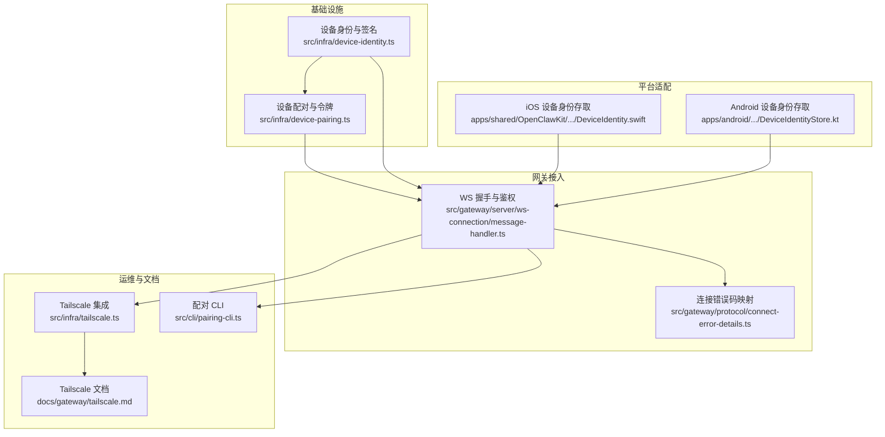
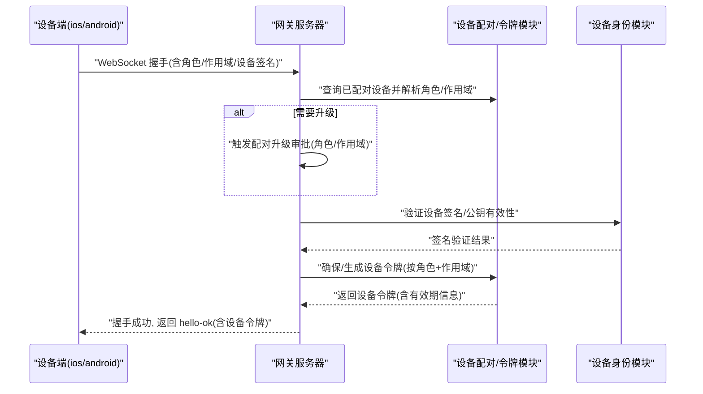
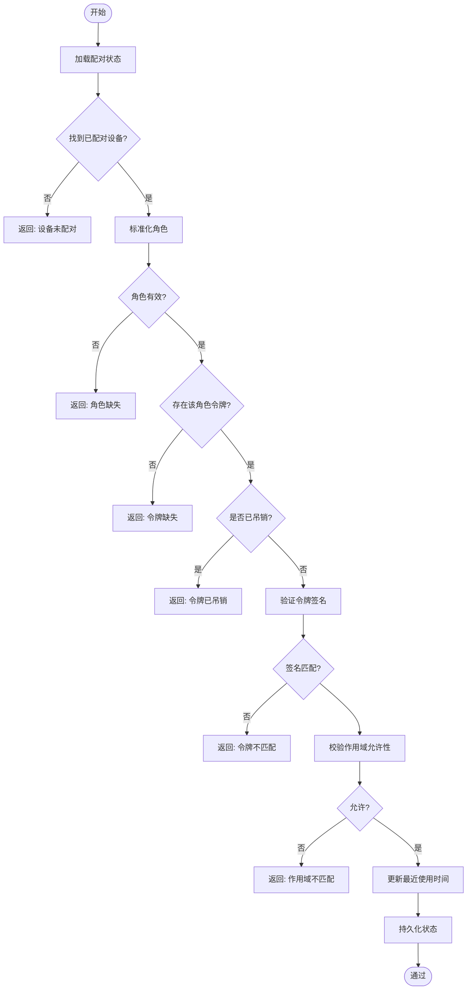
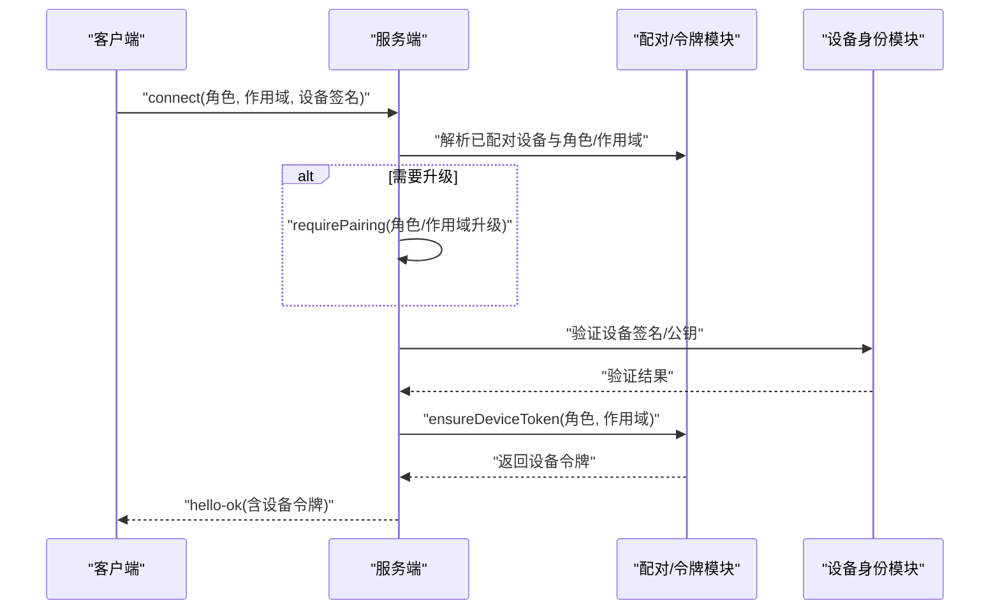
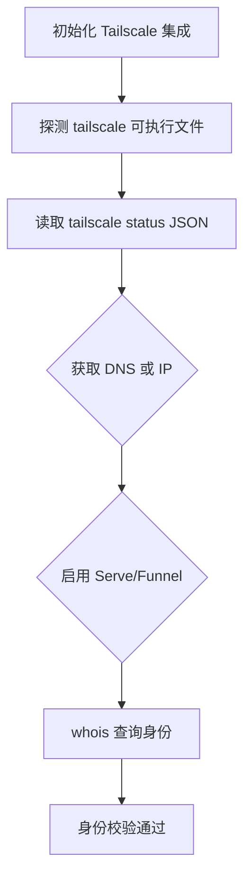
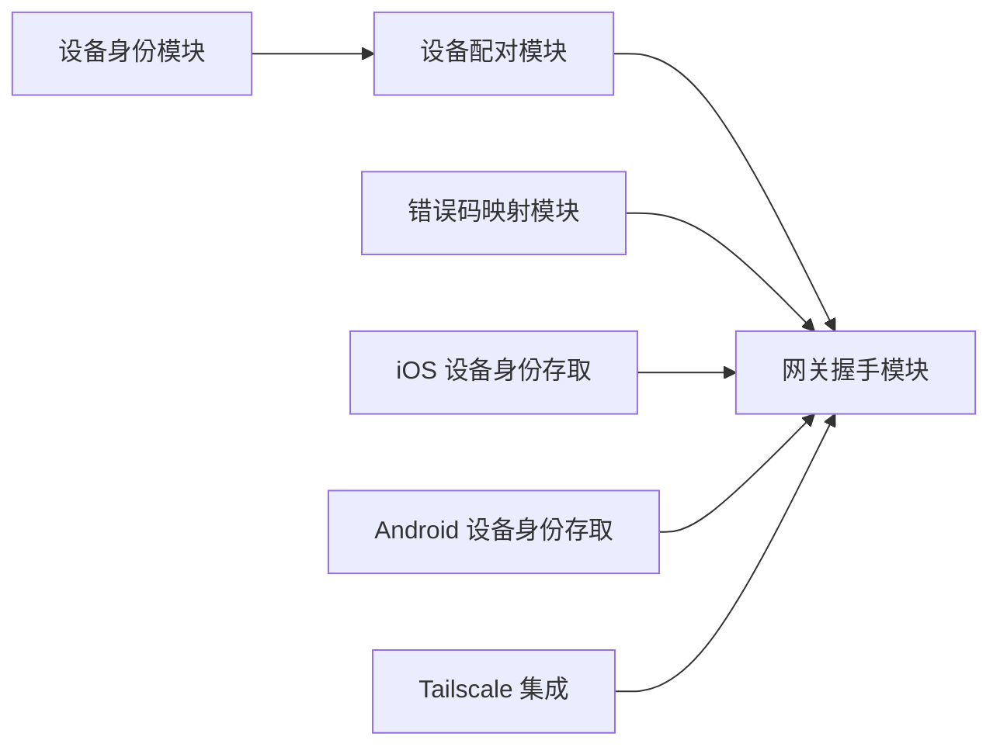

# 设备身份验证

<cite>
**本文引用的文件**
- [src/infra/device-pairing.ts](file://src/infra/device-pairing.ts)
- [src/infra/device-identity.ts](file://src/infra/device-identity.ts)
- [src/gateway/server/ws-connection/message-handler.ts](file://src/gateway/server/ws-connection/message-handler.ts)
- [src/gateway/protocol/connect-error-details.ts](file://src/gateway/protocol/connect-error-details.ts)
- [src/infra/tailscale.ts](file://src/infra/tailscale.ts)
- [docs/gateway/tailscale.md](file://docs/gateway/tailscale.md)
- [src/gateway/server-methods/devices.ts](file://src/gateway/server-methods/devices.ts)
- [apps/shared/OpenClawKit/Sources/OpenClawKit/DeviceIdentity.swift](file://apps/shared/OpenClawKit/Sources/OpenClawKit/DeviceIdentity.swift)
- [apps/android/app/src/main/java/ai/openclaw/android/gateway/DeviceIdentityStore.kt](file://apps/android/app/src/main/java/ai/openclaw/android/gateway/DeviceIdentityStore.kt)
- [ui/src/ui/controllers/devices.ts](file://ui/src/ui/controllers/devices.ts)
- [src/cli/pairing-cli.ts](file://src/cli/pairing-cli.ts)
</cite>

## 目录
1. [简介](#简介)
2. [项目结构](#项目结构)
3. [核心组件](#核心组件)
4. [架构总览](#架构总览)
5. [详细组件分析](#详细组件分析)
6. [依赖分析](#依赖分析)
7. [性能考虑](#性能考虑)
8. [故障排除指南](#故障排除指南)
9. [结论](#结论)
10. [附录](#附录)

## 简介
本技术文档聚焦于 OpenClaw 的“设备身份验证”子系统，系统性阐述设备配对流程、设备令牌生成与验证机制、Tailscale 集成、设备标识符管理以及跨平台兼容性。文档覆盖从初始配对到持续验证的完整生命周期，并提供设备配对失败的诊断方法、常见错误处理与重试策略，以及设备权限升级、信任关系建立与撤销的实现细节。

## 项目结构
OpenClaw 将设备身份验证能力分布在多个层次：
- 基础设施层：设备配对状态持久化、设备身份生成与签名、设备令牌生命周期管理
- 网关接入层：WebSocket 连接握手、角色与作用域校验、设备令牌发放与更新
- 平台适配层：iOS/Android 端设备身份存储与签名
- 文档与运维：Tailscale 集成说明、CLI 配对工具



图表来源
- [src/infra/device-pairing.ts](file://src/infra/device-pairing.ts#L1-L120)
- [src/infra/device-identity.ts](file://src/infra/device-identity.ts#L1-L120)
- [src/gateway/server/ws-connection/message-handler.ts](file://src/gateway/server/ws-connection/message-handler.ts#L900-L1099)
- [src/gateway/protocol/connect-error-details.ts](file://src/gateway/protocol/connect-error-details.ts#L1-L94)
- [src/infra/tailscale.ts](file://src/infra/tailscale.ts#L1-L120)
- [docs/gateway/tailscale.md](file://docs/gateway/tailscale.md#L1-L133)
- [src/cli/pairing-cli.ts](file://src/cli/pairing-cli.ts#L1-L174)

章节来源
- [src/infra/device-pairing.ts](file://src/infra/device-pairing.ts#L1-L120)
- [src/infra/device-identity.ts](file://src/infra/device-identity.ts#L1-L120)
- [src/gateway/server/ws-connection/message-handler.ts](file://src/gateway/server/ws-connection/message-handler.ts#L900-L1099)
- [src/gateway/protocol/connect-error-details.ts](file://src/gateway/protocol/connect-error-details.ts#L1-L94)
- [src/infra/tailscale.ts](file://src/infra/tailscale.ts#L1-L120)
- [docs/gateway/tailscale.md](file://docs/gateway/tailscale.md#L1-L133)
- [src/cli/pairing-cli.ts](file://src/cli/pairing-cli.ts#L1-L174)

## 核心组件
- 设备配对与令牌管理：负责待配对请求合并、批准/拒绝、已配对设备元数据更新、设备令牌生成/轮换/吊销、令牌验证等
- 设备身份与签名：生成 Ed25519 密钥对，计算设备指纹（deviceId），签名与验证负载
- 网关握手与鉴权：解析客户端角色与作用域，执行角色/作用域升级审批，发放设备令牌
- 平台设备身份存取：iOS/Android 分别提供设备身份加载/生成与签名能力
- Tailscale 集成：自动探测/启用 Serve/Funnel，身份头校验，whois 查询
- CLI 配对工具：列出/批准渠道配对请求，通知配对结果

章节来源
- [src/infra/device-pairing.ts](file://src/infra/device-pairing.ts#L255-L420)
- [src/infra/device-identity.ts](file://src/infra/device-identity.ts#L57-L123)
- [src/gateway/server/ws-connection/message-handler.ts](file://src/gateway/server/ws-connection/message-handler.ts#L900-L1099)
- [apps/shared/OpenClawKit/Sources/OpenClawKit/DeviceIdentity.swift](file://apps/shared/OpenClawKit/Sources/OpenClawKit/DeviceIdentity.swift#L39-L65)
- [apps/android/app/src/main/java/ai/openclaw/android/gateway/DeviceIdentityStore.kt](file://apps/android/app/src/main/java/ai/openclaw/android/gateway/DeviceIdentityStore.kt#L94-L124)
- [src/infra/tailscale.ts](file://src/infra/tailscale.ts#L106-L144)
- [src/cli/pairing-cli.ts](file://src/cli/pairing-cli.ts#L64-L172)

## 架构总览
下图展示从设备发起连接到网关完成鉴权与令牌发放的关键交互：



图表来源
- [src/gateway/server/ws-connection/message-handler.ts](file://src/gateway/server/ws-connection/message-handler.ts#L900-L1099)
- [src/infra/device-pairing.ts](file://src/infra/device-pairing.ts#L510-L547)
- [src/infra/device-identity.ts](file://src/infra/device-identity.ts#L125-L182)

章节来源
- [src/gateway/server/ws-connection/message-handler.ts](file://src/gateway/server/ws-connection/message-handler.ts#L900-L1099)
- [src/infra/device-pairing.ts](file://src/infra/device-pairing.ts#L510-L547)
- [src/infra/device-identity.ts](file://src/infra/device-identity.ts#L125-L182)

## 详细组件分析

### 设备配对与令牌生命周期
- 待配对请求合并：支持多来源请求合并，保留交互性标记，修复模式标记
- 批准/拒绝：批准时合并角色与作用域，生成新令牌；拒绝删除待配对记录
- 已配对设备元数据更新：允许在不改变已批准平台/机型的前提下更新访问元数据
- 令牌生成/轮换/吊销：按角色与作用域生成新令牌；轮换时检查批准的作用域影响；吊销后不可再用
- 令牌验证：校验设备是否已配对、角色是否存在、令牌未被吊销、签名一致、作用域允许



图表来源
- [src/infra/device-pairing.ts](file://src/infra/device-pairing.ts#L470-L508)

章节来源
- [src/infra/device-pairing.ts](file://src/infra/device-pairing.ts#L272-L420)
- [src/infra/device-pairing.ts](file://src/infra/device-pairing.ts#L470-L640)

### 设备身份与签名
- 密钥对生成：Ed25519，导出 SPKI/PKCS8 PEM
- 设备指纹：基于公钥派生原始字节并做 SHA-256 哈希
- 负载签名与验证：支持 Base64/URL 安全编码转换与多种输入格式
- 平台存取：iOS/Android 分别提供加载/生成与签名能力，保证本地安全存储

```mermaid
classDiagram
class DeviceIdentity {
+string deviceId
+string publicKeyPem
+string privateKeyPem
}
class DeviceIdentityStore_iOS {
+loadOrCreate() DeviceIdentity
+signPayload(payload, identity) string?
}
class DeviceIdentityStore_Android {
+loadOrCreate() DeviceIdentity
+signPayload(payload, identity) string?
}
class DevicePairing {
+ensureDeviceToken(params) DeviceAuthToken
+verifyDeviceToken(params) {ok, reason}
}
class DeviceIdentityModule {
+generateIdentity() DeviceIdentity
+signDevicePayload(privateKeyPem, payload) string
+verifyDeviceSignature(publicKey, payload, signature) boolean
}
DevicePairing --> DeviceIdentityModule : "使用"
DeviceIdentityStore_iOS --> DeviceIdentityModule : "签名/验证"
DeviceIdentityStore_Android --> DeviceIdentityModule : "签名/验证"
```

图表来源
- [src/infra/device-identity.ts](file://src/infra/device-identity.ts#L6-L182)
- [apps/shared/OpenClawKit/Sources/OpenClawKit/DeviceIdentity.swift](file://apps/shared/OpenClawKit/Sources/OpenClawKit/DeviceIdentity.swift#L39-L65)
- [apps/android/app/src/main/java/ai/openclaw/android/gateway/DeviceIdentityStore.kt](file://apps/android/app/src/main/java/ai/openclaw/android/gateway/DeviceIdentityStore.kt#L94-L124)
- [src/infra/device-pairing.ts](file://src/infra/device-pairing.ts#L510-L547)

章节来源
- [src/infra/device-identity.ts](file://src/infra/device-identity.ts#L57-L182)
- [apps/shared/OpenClawKit/Sources/OpenClawKit/DeviceIdentity.swift](file://apps/shared/OpenClawKit/Sources/OpenClawKit/DeviceIdentity.swift#L39-L65)
- [apps/android/app/src/main/java/ai/openclaw/android/gateway/DeviceIdentityStore.kt](file://apps/android/app/src/main/java/ai/openclaw/android/gateway/DeviceIdentityStore.kt#L94-L124)

### 网关握手与鉴权
- 角色与作用域升级：若客户端请求的角色或作用域不在已批准范围内，触发配对升级审批
- 元数据固定：平台/机型固定在已批准配对记录中，重连可更新但不得越权变更
- 设备令牌发放：确保/生成对应角色与作用域的令牌，并在 hello-ok 中下发
- 错误码映射：将内部原因映射为标准连接错误码，便于前端与 CLI 统一处理



图表来源
- [src/gateway/server/ws-connection/message-handler.ts](file://src/gateway/server/ws-connection/message-handler.ts#L900-L1099)
- [src/gateway/protocol/connect-error-details.ts](file://src/gateway/protocol/connect-error-details.ts#L31-L84)

章节来源
- [src/gateway/server/ws-connection/message-handler.ts](file://src/gateway/server/ws-connection/message-handler.ts#L900-L1099)
- [src/gateway/protocol/connect-error-details.ts](file://src/gateway/protocol/connect-error-details.ts#L31-L84)

### Tailscale 集成
- 自动探测与启用：支持 Serve/Funnel 模式，自动获取尾网主机名/IP，whois 解析身份
- 身份校验：在 Serve 模式下，通过本地 tailscaled whois 校验 x-forwarded-* 头，确认请求来自可信尾网
- 文档与限制：提供配置示例、端口限制、Funnel 权限要求与版本限制说明



图表来源
- [src/infra/tailscale.ts](file://src/infra/tailscale.ts#L106-L144)
- [src/infra/tailscale.ts](file://src/infra/tailscale.ts#L469-L500)
- [docs/gateway/tailscale.md](file://docs/gateway/tailscale.md#L1-L133)

章节来源
- [src/infra/tailscale.ts](file://src/infra/tailscale.ts#L106-L144)
- [src/infra/tailscale.ts](file://src/infra/tailscale.ts#L469-L500)
- [docs/gateway/tailscale.md](file://docs/gateway/tailscale.md#L1-L133)

### 跨平台设备兼容性
- iOS：通过 Swift 提供设备身份加载/生成与签名，确保密钥安全存储
- Android：通过 Kotlin 提供设备身份加载/生成与签名，本地文件安全存储
- 共同点：均以设备指纹作为 deviceId，使用 Ed25519 签名，遵循统一的握手与令牌协议

章节来源
- [apps/shared/OpenClawKit/Sources/OpenClawKit/DeviceIdentity.swift](file://apps/shared/OpenClawKit/Sources/OpenClawKit/DeviceIdentity.swift#L39-L65)
- [apps/android/app/src/main/java/ai/openclaw/android/gateway/DeviceIdentityStore.kt](file://apps/android/app/src/main/java/ai/openclaw/android/gateway/DeviceIdentityStore.kt#L94-L124)

### 设备权限升级、信任关系与撤销
- 权限升级：当请求的角色或作用域不在已批准范围内时，触发配对升级审批流程
- 信任关系：已批准的设备记录包含平台/机型固定约束，元数据更新需在批准范围内
- 撤销与轮换：支持按角色吊销令牌与轮换令牌，轮换时会校验批准的作用域影响

章节来源
- [src/gateway/server/ws-connection/message-handler.ts](file://src/gateway/server/ws-connection/message-handler.ts#L900-L961)
- [src/gateway/server-methods/devices.ts](file://src/gateway/server-methods/devices.ts#L157-L215)
- [src/infra/device-pairing.ts](file://src/infra/device-pairing.ts#L572-L640)

## 依赖分析
- 设备配对模块依赖设备身份模块进行签名验证与设备指纹计算
- 网关握手模块依赖配对模块获取/生成设备令牌，并依赖错误码映射模块输出标准化错误
- 平台适配模块独立负责设备身份的本地存取与签名，不直接依赖网关逻辑
- Tailscale 集成模块为网关提供身份校验与路由能力，属于外部依赖



图表来源
- [src/infra/device-pairing.ts](file://src/infra/device-pairing.ts#L1-L120)
- [src/infra/device-identity.ts](file://src/infra/device-identity.ts#L1-L120)
- [src/gateway/server/ws-connection/message-handler.ts](file://src/gateway/server/ws-connection/message-handler.ts#L900-L1099)
- [src/gateway/protocol/connect-error-details.ts](file://src/gateway/protocol/connect-error-details.ts#L1-L94)
- [src/infra/tailscale.ts](file://src/infra/tailscale.ts#L1-L120)

章节来源
- [src/infra/device-pairing.ts](file://src/infra/device-pairing.ts#L1-L120)
- [src/infra/device-identity.ts](file://src/infra/device-identity.ts#L1-L120)
- [src/gateway/server/ws-connection/message-handler.ts](file://src/gateway/server/ws-connection/message-handler.ts#L900-L1099)
- [src/gateway/protocol/connect-error-details.ts](file://src/gateway/protocol/connect-error-details.ts#L1-L94)
- [src/infra/tailscale.ts](file://src/infra/tailscale.ts#L1-L120)

## 性能考虑
- 异步锁与原子写入：配对状态采用异步锁与原子写入，避免并发冲突
- TTL 清理：待配对请求具备 TTL 清理，防止垃圾数据堆积
- 缓存优化：Tailscale whois 结果带缓存，降低重复查询开销
- 作用域扩展：在轮换/生成令牌前进行作用域影响扩展，减少后续校验成本

章节来源
- [src/infra/device-pairing.ts](file://src/infra/device-pairing.ts#L81-L103)
- [src/infra/device-pairing.ts](file://src/infra/device-pairing.ts#L195-L220)
- [src/infra/tailscale.ts](file://src/infra/tailscale.ts#L465-L467)

## 故障排除指南
- 常见错误码与原因
  - 设备未配对：设备不在已配对列表中
  - 角色缺失：请求缺少角色参数
  - 令牌缺失/已吊销：对应角色无令牌或已被吊销
  - 令牌不匹配：签名验证失败
  - 作用域不匹配：请求作用域超出允许范围
  - Tailscale 身份缺失/代理缺失/whois 失败/身份不匹配：Serve 模式下身份校验失败
- 诊断步骤
  - 检查配对状态与设备记录：确认设备已批准且角色/作用域正确
  - 校验设备签名与公钥：确保公钥格式与签名一致
  - 查看错误码映射：根据错误码定位具体问题
  - Tailscale 校验：确认 Serve/Funnel 配置、whois 可用性与身份头
- 重试机制
  - 待配对请求 TTL 到期后自动清理，建议重新发起配对
  - Tailscale whois 查询带缓存与错误 TTL，等待缓存过期后重试

章节来源
- [src/gateway/protocol/connect-error-details.ts](file://src/gateway/protocol/connect-error-details.ts#L31-L84)
- [src/infra/device-pairing.ts](file://src/infra/device-pairing.ts#L470-L508)
- [src/infra/tailscale.ts](file://src/infra/tailscale.ts#L469-L500)

## 结论
OpenClaw 的设备身份验证体系以“设备指纹 + Ed25519 签名”为核心，结合严格的配对与令牌管理、清晰的角色/作用域控制、以及 Tailscale 的身份校验能力，实现了跨平台、可审计、可撤销的设备信任链。通过 CLI 与 UI 的配合，用户可以高效完成配对、升级、轮换与撤销操作，同时系统提供了完善的错误码与缓存策略，保障了稳定性与可观测性。

## 附录
- 设备令牌轮换与吊销的 UI/CLI 行为
  - UI 控制器：支持轮换与吊销设备令牌，并在轮换时更新本地存储
  - CLI：提供配对请求列表与批准入口，便于自动化与运维

章节来源
- [ui/src/ui/controllers/devices.ts](file://ui/src/ui/controllers/devices.ts#L105-L159)
- [src/cli/pairing-cli.ts](file://src/cli/pairing-cli.ts#L64-L172)