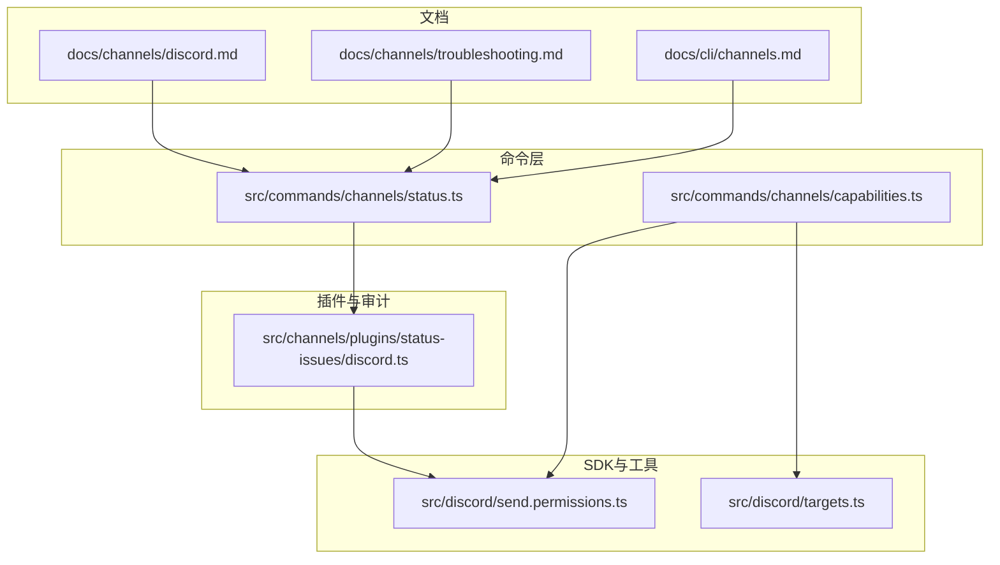
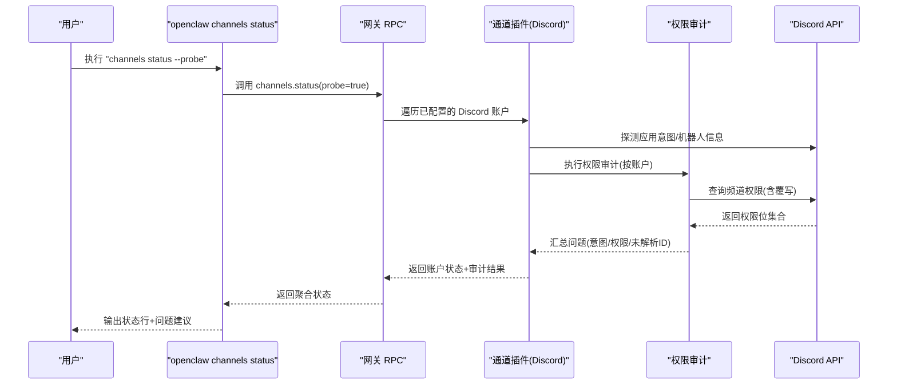
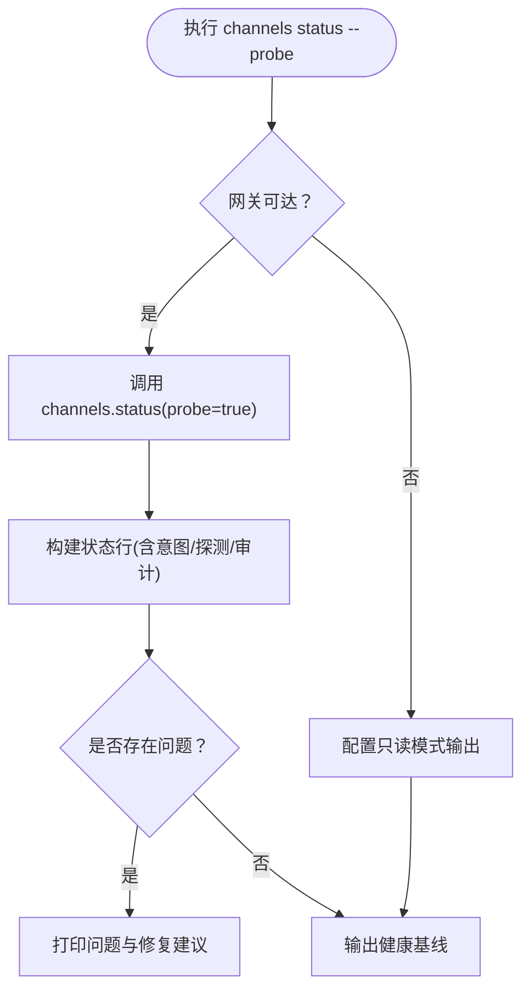
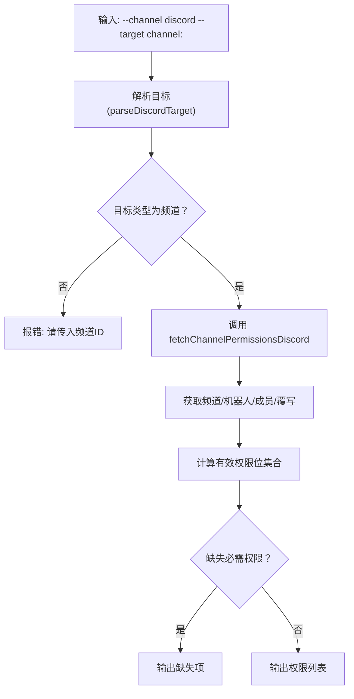
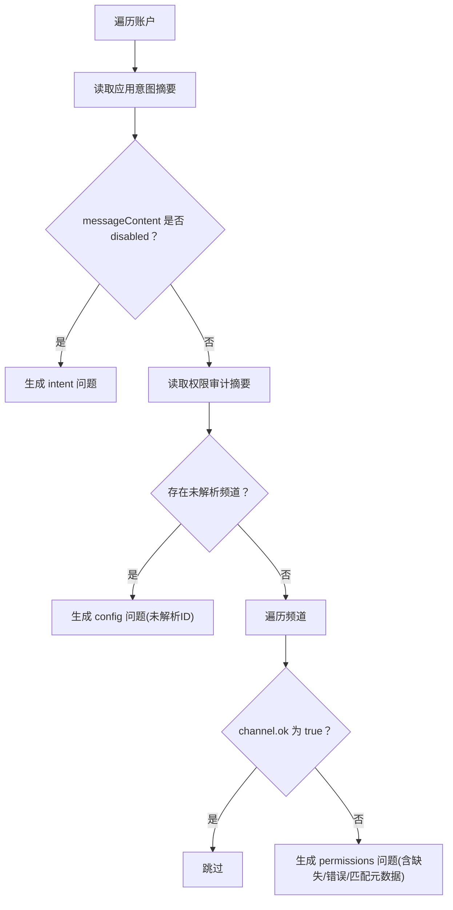
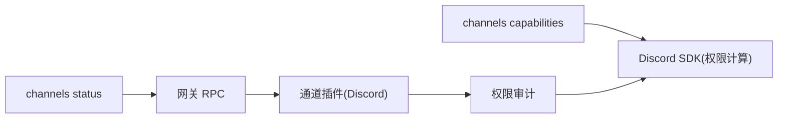

# Discord渠道问题

<cite>
**本文引用的文件**
- [docs/channels/discord.md](file://docs/channels/discord.md)
- [docs/channels/troubleshooting.md](file://docs/channels/troubleshooting.md)
- [docs/cli/channels.md](file://docs/cli/channels.md)
- [src/commands/channels/status.ts](file://src/commands/channels/status.ts)
- [src/commands/channels/capabilities.ts](file://src/commands/channels/capabilities.ts)
- [src/channels/plugins/status-issues/discord.ts](file://src/channels/plugins/status-issues/discord.ts)
- [src/discord/send.permissions.ts](file://src/discord/send.permissions.ts)
- [src/discord/targets.ts](file://src/discord/targets.ts)
</cite>

## 目录
1. [简介](#简介)
2. [项目结构](#项目结构)
3. [核心组件](#核心组件)
4. [架构总览](#架构总览)
5. [详细组件分析](#详细组件分析)
6. [依赖关系分析](#依赖关系分析)
7. [性能考量](#性能考量)
8. [故障排除指南](#故障排除指南)
9. [结论](#结论)
10. [附录](#附录)

## 简介
本文件面向在使用 OpenClaw 的 Discord 渠道时遇到“机器人在线但公会回复缺失”“群组消息被忽略”“私信回复缺失”等典型症状的用户与运维人员，提供系统化的快速检查清单与操作指引。内容覆盖服务器权限配置、频道访问权限、消息内容意图验证、提及门控规则检查，并详解 openclaw channels status --probe 命令的使用与权限范围验证方法。

## 项目结构
围绕 Discord 故障排除，本仓库中与之直接相关的关键模块包括：
- 文档层：Discord 渠道指南、通道故障排除指南、CLI 参考
- 命令层：channels status/capabilities 命令实现与输出格式化
- 插件与审计：Discord 权限审计与问题收集
- Discord SDK：权限计算、意图解析、目标解析

图表来源
- [docs/channels/discord.md](file://docs/channels/discord.md#L1-L1216)
- [docs/channels/troubleshooting.md](file://docs/channels/troubleshooting.md#L1-L118)
- [docs/cli/channels.md](file://docs/cli/channels.md#L1-L102)
- [src/commands/channels/status.ts](file://src/commands/channels/status.ts#L1-L339)
- [src/commands/channels/capabilities.ts](file://src/commands/channels/capabilities.ts#L1-L555)
- [src/channels/plugins/status-issues/discord.ts](file://src/channels/plugins/status-issues/discord.ts#L1-L167)
- [src/discord/send.permissions.ts](file://src/discord/send.permissions.ts#L1-L233)
- [src/discord/targets.ts](file://src/discord/targets.ts#L1-L158)

章节来源
- [docs/channels/discord.md](file://docs/channels/discord.md#L1-L1216)
- [docs/channels/troubleshooting.md](file://docs/channels/troubleshooting.md#L1-L118)
- [docs/cli/channels.md](file://docs/cli/channels.md#L1-L102)
- [src/commands/channels/status.ts](file://src/commands/channels/status.ts#L1-L339)
- [src/commands/channels/capabilities.ts](file://src/commands/channels/capabilities.ts#L1-L555)
- [src/channels/plugins/status-issues/discord.ts](file://src/channels/plugins/status-issues/discord.ts#L1-L167)
- [src/discord/send.permissions.ts](file://src/discord/send.permissions.ts#L1-L233)
- [src/discord/targets.ts](file://src/discord/targets.ts#L1-L158)

## 核心组件
- channels status 命令：拉取网关状态并输出通道账户信息；支持 --probe 模式进行连通性探测与审计汇总。
- channels capabilities 命令：展示各通道能力、意图/作用域提示以及可选的目标权限审计（Discord）。
- Discord 权限审计：读取应用意图与权限审计结果，生成问题列表（如消息内容意图禁用、未解析的频道ID、权限缺失等）。
- Discord SDK：计算成员在频道中的有效权限位集合，处理管理员豁免与覆写优先级。

章节来源
- [src/commands/channels/status.ts](file://src/commands/channels/status.ts#L279-L339)
- [src/commands/channels/capabilities.ts](file://src/commands/channels/capabilities.ts#L56-L555)
- [src/channels/plugins/status-issues/discord.ts](file://src/channels/plugins/status-issues/discord.ts#L110-L167)
- [src/discord/send.permissions.ts](file://src/discord/send.permissions.ts#L154-L233)

## 架构总览
下图展示了从命令到网关、再到 Discord 平台的调用链路与关键检查点。

图表来源
- [src/commands/channels/status.ts](file://src/commands/channels/status.ts#L279-L339)
- [src/channels/plugins/status-issues/discord.ts](file://src/channels/plugins/status-issues/discord.ts#L110-L167)
- [src/discord/send.permissions.ts](file://src/discord/send.permissions.ts#L154-L233)

## 详细组件分析

### 组件A：channels status --probe 的工作流
- 功能要点
  - 通过网关 RPC 获取通道账户快照，包含运行状态、连接状态、最近收发时间、机器人用户名、DM 策略、允许来源、意图状态、探测结果与审计结果。
  - 若网关不可达，回退到仅基于配置的“配置只读”状态输出。
  - 将问题汇总（issues）以统一格式输出，并给出修复建议。
- 关键字段解读
  - 运行/连接：判断通道进程是否正常。
  - 最近收发：定位延迟或断流。
  - 机器人用户名：确认接入账号正确。
  - DM 策略/允许来源：排查 DM 访问控制。
  - 意图状态：消息内容意图、成员意图、存在意图等。
  - 探测结果：probe.ok 与错误信息。
  - 审计结果：audit.ok 与具体问题。
- 典型症状映射
  - “机器人在线但无公会回复”：关注 intent 与权限；查看 probe.ok 与 audit.ok。
  - “群组消息被忽略”：检查 requireMention 与 mention 规则；查看日志中“提及门控丢弃”。
  - “私信回复缺失”：检查 DM 策略与配对状态；查看 pairing 列表。

图表来源
- [src/commands/channels/status.ts](file://src/commands/channels/status.ts#L279-L339)

章节来源
- [src/commands/channels/status.ts](file://src/commands/channels/status.ts#L97-L210)
- [docs/channels/troubleshooting.md](file://docs/channels/troubleshooting.md#L13-L30)

### 组件B：channels capabilities 与 Discord 权限审计
- 功能要点
  - 展示各通道能力与作用域提示；对 Discord 支持目标权限审计（需提供 --target channel:<id>）。
  - 对 Discord 目标进行解析，校验是否为频道；若为 DM 用户则提示改用频道目标。
  - 使用 Discord REST 获取频道信息、机器人用户ID、成员角色与覆写，计算有效权限位集合。
  - 缺失权限检测：默认要求 ViewChannel、SendMessages。
- 关键流程
  - 解析目标：支持 user:、channel:、@mention、纯数字等格式。
  - 权限计算：合并成员角色位，考虑管理员豁免，再叠加覆写（允许/拒绝）。
  - 报告缺失：对比 REQUIRED_DISCORD_PERMISSIONS，输出缺失项。

图表来源
- [src/commands/channels/capabilities.ts](file://src/commands/channels/capabilities.ts#L120-L336)
- [src/discord/send.permissions.ts](file://src/discord/send.permissions.ts#L154-L233)
- [src/discord/targets.ts](file://src/discord/targets.ts#L19-L51)

章节来源
- [src/commands/channels/capabilities.ts](file://src/commands/channels/capabilities.ts#L56-L555)
- [src/discord/send.permissions.ts](file://src/discord/send.permissions.ts#L154-L233)
- [src/discord/targets.ts](file://src/discord/targets.ts#L19-L51)

### 组件C：Discord 权限审计与问题收集
- 功能要点
  - 读取应用意图摘要（messageContent 状态），若为 disabled，提示启用“消息内容意图”或改为“需要提及”模式。
  - 读取权限审计摘要：统计未解析频道数量；逐频道检查 ok、缺失权限、错误来源与匹配元数据。
  - 生成统一问题对象，包含 channel、accountId、kind（intent/permissions/config）、message、fix。
- 适用场景
  - “机器人在线但无公会回复”：检查 intent 与权限；若未解析频道ID，提示使用数值ID。
  - “群组消息被忽略”：检查 requireMention 与 mention 规则；查看日志中“提及门控丢弃”。

图表来源
- [src/channels/plugins/status-issues/discord.ts](file://src/channels/plugins/status-issues/discord.ts#L110-L167)

章节来源
- [src/channels/plugins/status-issues/discord.ts](file://src/channels/plugins/status-issues/discord.ts#L110-L167)

## 依赖关系分析
- 命令层依赖网关 RPC 与通道插件；当网关不可达时，回退到配置只读输出。
- capabilities 命令依赖 Discord SDK 的权限计算函数，用于生成目标权限报告。
- 权限审计依赖应用意图与频道覆写，最终汇总为统一问题对象。

图表来源
- [src/commands/channels/status.ts](file://src/commands/channels/status.ts#L279-L339)
- [src/commands/channels/capabilities.ts](file://src/commands/channels/capabilities.ts#L437-L555)
- [src/channels/plugins/status-issues/discord.ts](file://src/channels/plugins/status-issues/discord.ts#L110-L167)
- [src/discord/send.permissions.ts](file://src/discord/send.permissions.ts#L154-L233)

章节来源
- [src/commands/channels/status.ts](file://src/commands/channels/status.ts#L1-L339)
- [src/commands/channels/capabilities.ts](file://src/commands/channels/capabilities.ts#L1-L555)
- [src/channels/plugins/status-issues/discord.ts](file://src/channels/plugins/status-issues/discord.ts#L1-L167)
- [src/discord/send.permissions.ts](file://src/discord/send.permissions.ts#L1-L233)

## 性能考量
- --probe 模式会触发多次 API 调用（意图探测、权限审计），建议在问题定位阶段使用，日常巡检可先看常规 status 输出。
- 权限计算涉及多处 API 查询与覆写合并，网络抖动可能影响耗时；必要时增加超时参数或重试策略。
- 配置只读模式避免了网关交互，适合离线或无法访问网关时的快速诊断。

[本节为通用指导，不直接分析具体文件]

## 故障排除指南

### 快速检查清单（按症状）
- 机器人在线但公会回复缺失
  - 执行：openclaw channels status --probe
  - 关注：意图状态（消息内容意图）、探测结果（probe.ok）、审计结果（audit.ok）
  - 若 intent 为 disabled 或权限缺失，参考修复建议启用消息内容意图或补齐权限
- 群组消息被忽略
  - 执行：openclaw channels status --probe
  - 关注：日志中“提及门控丢弃”；检查 requireMention 与 mention 规则
  - 修复：设置 guild/channel requireMention:false 或确保消息包含机器人提及
- 私信回复缺失
  - 执行：openclaw pairing list discord
  - 关注：配对状态与 DM 策略；检查 allowFrom 与 DM policy
  - 修复：批准配对或调整 DM policy（如从 pairing 切换为 open）

章节来源
- [docs/channels/troubleshooting.md](file://docs/channels/troubleshooting.md#L56-L66)
- [docs/channels/discord.md](file://docs/channels/discord.md#L368-L460)

### openclaw channels status --probe 使用指南
- 基本用法
  - openclaw channels status --probe
  - openclaw channels status --probe --timeout 15000
- 输出解读
  - 状态行包含：enabled/configured/linked、running/connected、in/out、dm 策略、意图状态、探测结果、审计结果、最后错误等
  - 问题汇总：统一列出 intent/permissions/config 类问题及修复建议
- 网关不可达时
  - 回退到配置只读模式，显示配置状态与令牌来源信息

章节来源
- [src/commands/channels/status.ts](file://src/commands/channels/status.ts#L279-L339)
- [docs/cli/channels.md](file://docs/cli/channels.md#L65-L71)

### 权限范围验证方法（channels capabilities）
- 目标权限审计
  - openclaw channels capabilities --channel discord --target channel:<id>
  - 输出包含：支持能力、意图/作用域提示、权限列表、缺失必需权限
- 关键检查点
  - 目标必须为频道（channel:<id>）；DM 用户目标会提示改用频道
  - 必需权限：ViewChannel、SendMessages
  - 权限计算考虑管理员豁免与覆写优先级
- 修复建议
  - 若缺失权限：在 Discord 服务器中为机器人角色授予相应权限，并确保覆写未显式拒绝
  - 若未解析频道ID：使用数值频道ID作为配置键，重新运行 --probe

章节来源
- [src/commands/channels/capabilities.ts](file://src/commands/channels/capabilities.ts#L56-L555)
- [src/discord/send.permissions.ts](file://src/discord/send.permissions.ts#L154-L233)
- [src/discord/targets.ts](file://src/discord/targets.ts#L19-L51)

### 服务器权限配置与频道访问权限
- 服务器权限
  - 在 Discord 开发者门户启用“消息内容意图”，并根据需要启用“服务器成员意图”
  - 为机器人角色授予“查看频道”“发送消息”等基础权限
  - 避免使用“管理服务器”等全量权限，遵循最小权限原则
- 频道访问权限
  - 使用数值频道ID作为配置键，避免名称/别名导致的解析失败
  - 检查覆写：确保未对机器人角色显式拒绝“查看”“发送”
- 提及门控规则
  - requireMention 默认开启，可在 guild/channel 级别关闭
  - ignoreOtherMentions 可过滤掉除机器人外的其他提及
  - 通过 mention 模式与 reply-to 行为控制响应范围

章节来源
- [docs/channels/discord.md](file://docs/channels/discord.md#L36-L42)
- [docs/channels/discord.md](file://docs/channels/discord.md#L396-L460)
- [src/channels/plugins/status-issues/discord.ts](file://src/channels/plugins/status-issues/discord.ts#L136-L163)

### 消息内容意图验证
- 检查点
  - openclaw channels status --probe 中的意图状态
  - 若 messageContent 为 disabled，将无法看到普通频道消息
- 修复
  - 在 Discord 开发者门户启用“消息内容意图”
  - 或在 guild/channel 级别设置 requireMention:false 以降低对消息内容的依赖

章节来源
- [src/channels/plugins/status-issues/discord.ts](file://src/channels/plugins/status-issues/discord.ts#L124-L134)
- [docs/channels/discord.md](file://docs/channels/discord.md#L36-L42)

## 结论
通过“channels status --probe + channels capabilities”的组合检查，可以快速定位 Discord 渠道问题的根本原因：意图配置、权限覆写、提及门控与目标解析。建议在问题出现时优先执行 status --probe，结合文档中的症状对照与修复建议，逐项验证并修正配置，从而恢复稳定的消息流转。

[本节为总结性内容，不直接分析具体文件]

## 附录

### 常见症状与命令对照
- 机器人在线但无公会回复
  - 命令：openclaw channels status --probe
  - 关注：意图状态、探测/审计结果
- 群组消息被忽略
  - 命令：openclaw channels status --probe
  - 关注：日志中的“提及门控丢弃”；requireMention 与 mention 规则
- 私信回复缺失
  - 命令：openclaw pairing list discord
  - 关注：配对状态与 DM 策略

章节来源
- [docs/channels/troubleshooting.md](file://docs/channels/troubleshooting.md#L56-L66)