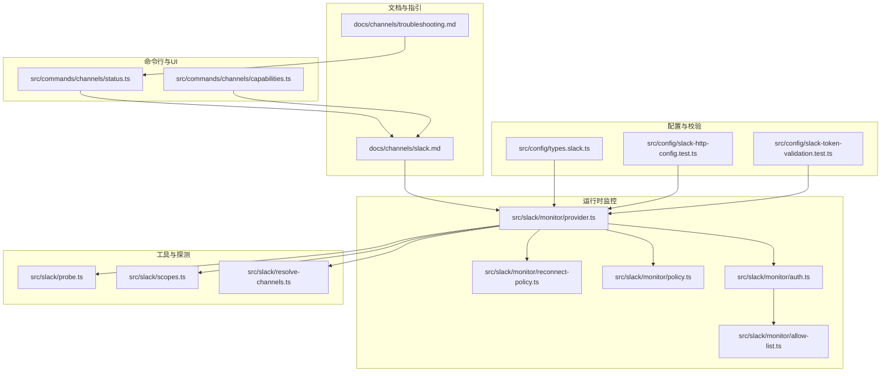
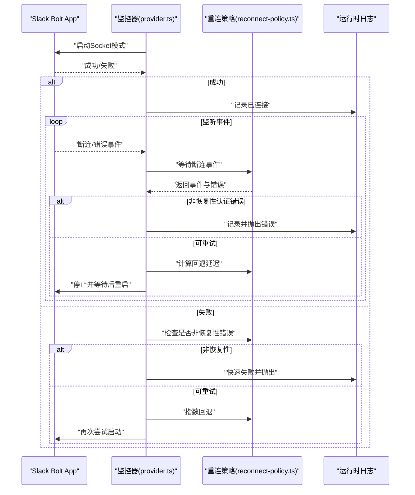
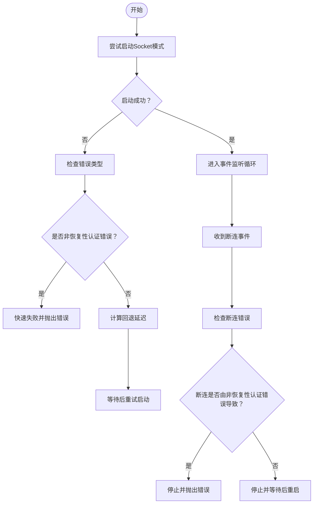
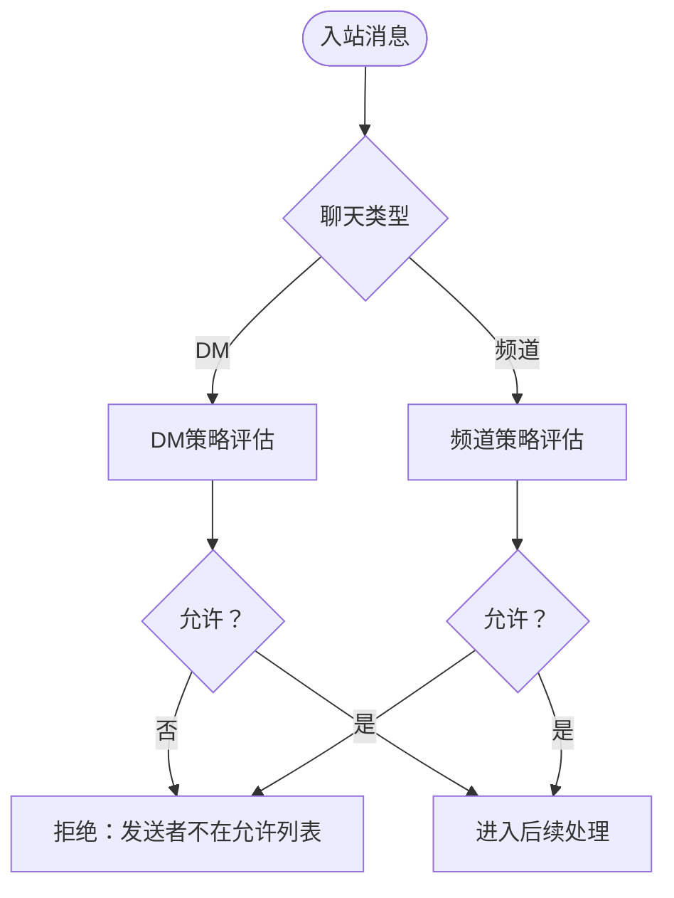
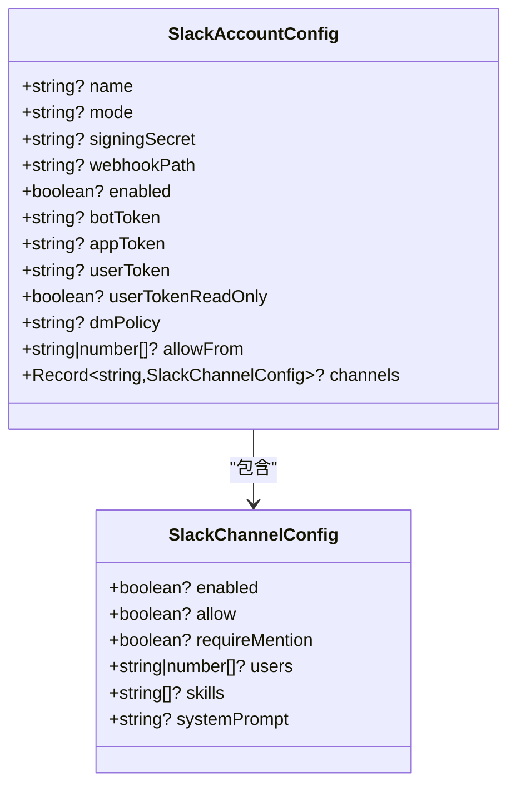
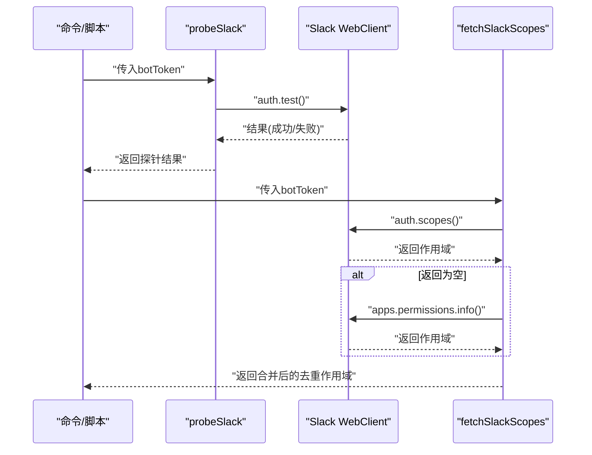
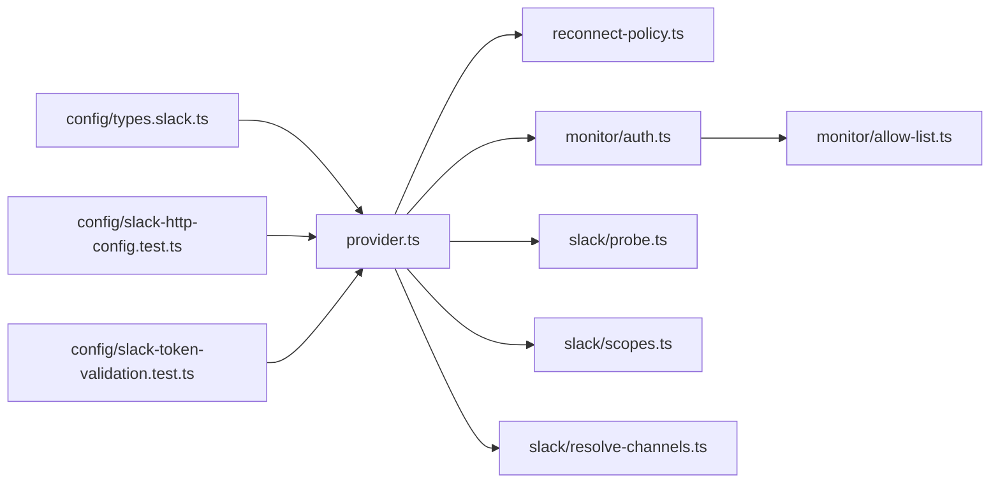

# Slack渠道问题

<cite>
**本文引用的文件**
- [docs/channels/slack.md](file://docs/channels/slack.md)
- [docs/channels/troubleshooting.md](file://docs/channels/troubleshooting.md)
- [src/slack/monitor/provider.ts](file://src/slack/monitor/provider.ts)
- [src/slack/monitor/reconnect-policy.ts](file://src/slack/monitor/reconnect-policy.ts)
- [src/slack/monitor/policy.ts](file://src/slack/monitor/policy.ts)
- [src/slack/monitor/auth.ts](file://src/slack/monitor/auth.ts)
- [src/slack/monitor/allow-list.ts](file://src/slack/monitor/allow-list.ts)
- [src/slack/resolve-channels.ts](file://src/slack/resolve-channels.ts)
- [src/slack/probe.ts](file://src/slack/probe.ts)
- [src/slack/scopes.ts](file://src/slack/scopes.ts)
- [src/config/types.slack.ts](file://src/config/types.slack.ts)
- [src/config/slack-http-config.test.ts](file://src/config/slack-http-config.test.ts)
- [src/config/slack-token-validation.test.ts](file://src/config/slack-token-validation.test.ts)
- [src/commands/channels/status.ts](file://src/commands/channels/status.ts)
- [src/commands/channels/capabilities.ts](file://src/commands/channels/capabilities.ts)
- [src/channels/plugins/onboarding/slack.ts](file://src/channels/plugins/onboarding/slack.ts)
- [src/slack/http/registry.ts](file://src/slack/http/registry.ts)
</cite>

## 目录
1. [简介](#简介)
2. [项目结构](#项目结构)
3. [核心组件](#核心组件)
4. [架构总览](#架构总览)
5. [详细组件分析](#详细组件分析)
6. [依赖关系分析](#依赖关系分析)
7. [性能考量](#性能考量)
8. [故障排除指南](#故障排除指南)
9. [结论](#结论)
10. [附录](#附录)

## 简介
本指南聚焦于Slack渠道在Socket模式连接但无响应、私信被阻止、频道消息被忽略等常见问题的系统性故障排除。内容覆盖应用令牌与机器人令牌验证、作用域检查、群组策略与频道允许列表管理，并提供完整的权限检查清单与配置修复步骤。

## 项目结构
围绕Slack渠道的故障排除，相关实现分布在以下模块：
- 文档与指引：Slack通道文档与通用通道故障排除页
- 运行时监控：Socket模式启动、断连重连策略、授权与访问控制
- 配置类型与校验：Slack配置字段、HTTP模式校验、用户令牌校验
- 工具与探测：Slack探针、作用域查询、频道/用户解析
- 命令行与UI：通道状态命令、能力展示

**图示来源**
- [docs/channels/slack.md](file://docs/channels/slack.md#L1-L555)
- [docs/channels/troubleshooting.md](file://docs/channels/troubleshooting.md#L68-L78)
- [src/slack/monitor/provider.ts](file://src/slack/monitor/provider.ts#L68-L200)
- [src/slack/monitor/reconnect-policy.ts](file://src/slack/monitor/reconnect-policy.ts#L1-L43)
- [src/slack/monitor/policy.ts](file://src/slack/monitor/policy.ts#L1-L17)
- [src/slack/monitor/auth.ts](file://src/slack/monitor/auth.ts#L1-L132)
- [src/slack/monitor/allow-list.ts](file://src/slack/monitor/allow-list.ts#L84-L109)
- [src/config/types.slack.ts](file://src/config/types.slack.ts#L194-L200)
- [src/config/slack-http-config.test.ts](file://src/config/slack-http-config.test.ts#L1-L57)
- [src/config/slack-token-validation.test.ts](file://src/config/slack-token-validation.test.ts#L1-L72)
- [src/slack/probe.ts](file://src/slack/probe.ts#L1-L45)
- [src/slack/scopes.ts](file://src/slack/scopes.ts#L92-L116)
- [src/slack/resolve-channels.ts](file://src/slack/resolve-channels.ts#L93-L132)
- [src/commands/channels/status.ts](file://src/commands/channels/status.ts#L279-L322)
- [src/commands/channels/capabilities.ts](file://src/commands/channels/capabilities.ts#L210-L227)

**章节来源**
- [docs/channels/slack.md](file://docs/channels/slack.md#L1-L555)
- [docs/channels/troubleshooting.md](file://docs/channels/troubleshooting.md#L68-L78)

## 核心组件
- Socket模式监控与断连重连：负责Socket模式的启动、认证错误快速失败、断连检测与指数回退重连。
- 授权与访问控制：基于策略与允许列表进行DM与频道消息的准入判断。
- 配置类型与校验：定义Slack配置字段、HTTP模式签名密钥校验、用户令牌类型校验。
- 工具与探测：通过探针验证令牌有效性与服务可达性；通过作用域查询确认权限范围；通过频道/用户解析完成名称到ID的映射。
- 命令行与UI：通道状态命令用于快速定位问题；能力展示帮助核对平台特性。

**章节来源**
- [src/slack/monitor/provider.ts](file://src/slack/monitor/provider.ts#L68-L200)
- [src/slack/monitor/reconnect-policy.ts](file://src/slack/monitor/reconnect-policy.ts#L1-L43)
- [src/slack/monitor/auth.ts](file://src/slack/monitor/auth.ts#L1-L132)
- [src/config/types.slack.ts](file://src/config/types.slack.ts#L194-L200)
- [src/config/slack-http-config.test.ts](file://src/config/slack-http-config.test.ts#L1-L57)
- [src/config/slack-token-validation.test.ts](file://src/config/slack-token-validation.test.ts#L1-L72)
- [src/slack/probe.ts](file://src/slack/probe.ts#L1-L45)
- [src/slack/scopes.ts](file://src/slack/scopes.ts#L92-L116)
- [src/slack/resolve-channels.ts](file://src/slack/resolve-channels.ts#L93-L132)
- [src/commands/channels/status.ts](file://src/commands/channels/status.ts#L279-L322)
- [src/commands/channels/capabilities.ts](file://src/commands/channels/capabilities.ts#L210-L227)

## 架构总览
下图展示了Socket模式下的关键交互：应用启动、事件监听、断连检测与重连、以及非恢复性认证错误的快速失败路径。

**图示来源**
- [src/slack/monitor/provider.ts](file://src/slack/monitor/provider.ts#L386-L479)
- [src/slack/monitor/reconnect-policy.ts](file://src/slack/monitor/reconnect-policy.ts#L1-L43)

**章节来源**
- [src/slack/monitor/provider.ts](file://src/slack/monitor/provider.ts#L386-L479)
- [src/slack/monitor/reconnect-policy.ts](file://src/slack/monitor/reconnect-policy.ts#L1-L43)

## 详细组件分析

### Socket模式连接与断连处理
- 启动阶段：Socket模式要求同时具备机器人令牌与应用令牌；若认证失败且属于不可恢复错误（如无效令牌、缺少作用域），将直接失败并阻止持续重试。
- 断连与重连：断连事件支持多种类型，包括无法启动Socket模式、断开、错误等；采用指数回退策略限制最大重试次数，避免无限循环。
- 非恢复性错误：一旦检测到非恢复性认证错误，立即终止当前通道，防止阻塞网关。

**图示来源**
- [src/slack/monitor/provider.ts](file://src/slack/monitor/provider.ts#L386-L479)
- [src/slack/monitor/reconnect-policy.ts](file://src/slack/monitor/reconnect-policy.ts#L1-L43)

**章节来源**
- [src/slack/monitor/provider.ts](file://src/slack/monitor/provider.ts#L386-L479)
- [src/slack/monitor/reconnect-policy.ts](file://src/slack/monitor/reconnect-policy.ts#L1-L43)

### 授权与访问控制（DM/频道）
- DM策略与允许列表：支持配对、开放、白名单、禁用等多种策略；允许通过“允许来自”列表或配对存储动态扩展。
- 频道策略与允许列表：支持开放、白名单、禁用；默认在配置缺失时回退为白名单策略。
- 用户与频道级授权：在频道级别可设置用户白名单与是否必须提及；未满足条件的消息会被拒绝。

**图示来源**
- [src/slack/monitor/auth.ts](file://src/slack/monitor/auth.ts#L250-L285)
- [src/slack/monitor/policy.ts](file://src/slack/monitor/policy.ts#L1-L17)

**章节来源**
- [src/slack/monitor/auth.ts](file://src/slack/monitor/auth.ts#L250-L285)
- [src/slack/monitor/policy.ts](file://src/slack/monitor/policy.ts#L1-L17)

### 配置类型与校验（令牌与HTTP模式）
- Slack配置类型：定义了账户级配置、DM配置、频道配置、动作配置、流式传输配置等字段。
- HTTP模式校验：当启用HTTP模式时，必须提供签名密钥；支持明文或密钥引用两种方式。
- 用户令牌校验：用户令牌及其只读标志需符合类型约束。

**图示来源**
- [src/config/types.slack.ts](file://src/config/types.slack.ts#L82-L192)

**章节来源**
- [src/config/types.slack.ts](file://src/config/types.slack.ts#L82-L192)
- [src/config/slack-http-config.test.ts](file://src/config/slack-http-config.test.ts#L1-L57)
- [src/config/slack-token-validation.test.ts](file://src/config/slack-token-validation.test.ts#L1-L72)

### 工具与探测（令牌、作用域、解析）
- Slack探针：通过auth.test验证令牌有效性与服务可达性，返回团队与机器人信息。
- 作用域查询：优先调用auth.scopes，其次调用apps.permissions.info，汇总并去重作用域。
- 频道/用户解析：将输入的频道名/ID或用户@name解析为真实ID，支持归档频道标识。

**图示来源**
- [src/slack/probe.ts](file://src/slack/probe.ts#L12-L45)
- [src/slack/scopes.ts](file://src/slack/scopes.ts#L92-L116)

**章节来源**
- [src/slack/probe.ts](file://src/slack/probe.ts#L12-L45)
- [src/slack/scopes.ts](file://src/slack/scopes.ts#L92-L116)
- [src/slack/resolve-channels.ts](file://src/slack/resolve-channels.ts#L93-L132)

## 依赖关系分析
- Socket模式监控依赖重连策略模块以决定断连后的处理行为。
- 授权模块依赖允许列表匹配与上下文缓存，以支持配对与动态扩展。
- 配置校验模块为运行时提供类型安全的配置输入，减少运行期错误。
- 工具模块为诊断与修复提供基础能力，如探针与作用域查询。

**图示来源**
- [src/slack/monitor/provider.ts](file://src/slack/monitor/provider.ts#L68-L200)
- [src/slack/monitor/reconnect-policy.ts](file://src/slack/monitor/reconnect-policy.ts#L1-L43)
- [src/slack/monitor/auth.ts](file://src/slack/monitor/auth.ts#L1-L132)
- [src/slack/monitor/allow-list.ts](file://src/slack/monitor/allow-list.ts#L84-L109)
- [src/slack/probe.ts](file://src/slack/probe.ts#L1-L45)
- [src/slack/scopes.ts](file://src/slack/scopes.ts#L92-L116)
- [src/slack/resolve-channels.ts](file://src/slack/resolve-channels.ts#L93-L132)
- [src/config/types.slack.ts](file://src/config/types.slack.ts#L194-L200)
- [src/config/slack-http-config.test.ts](file://src/config/slack-http-config.test.ts#L1-L57)
- [src/config/slack-token-validation.test.ts](file://src/config/slack-token-validation.test.ts#L1-L72)

**章节来源**
- [src/slack/monitor/provider.ts](file://src/slack/monitor/provider.ts#L68-L200)
- [src/slack/monitor/reconnect-policy.ts](file://src/slack/monitor/reconnect-policy.ts#L1-L43)
- [src/slack/monitor/auth.ts](file://src/slack/monitor/auth.ts#L1-L132)
- [src/slack/monitor/allow-list.ts](file://src/slack/monitor/allow-list.ts#L84-L109)
- [src/slack/probe.ts](file://src/slack/probe.ts#L1-L45)
- [src/slack/scopes.ts](file://src/slack/scopes.ts#L92-L116)
- [src/slack/resolve-channels.ts](file://src/slack/resolve-channels.ts#L93-L132)
- [src/config/types.slack.ts](file://src/config/types.slack.ts#L194-L200)
- [src/config/slack-http-config.test.ts](file://src/config/slack-http-config.test.ts#L1-L57)
- [src/config/slack-token-validation.test.ts](file://src/config/slack-token-validation.test.ts#L1-L72)

## 性能考量
- 指数回退与最大重试次数：避免在认证失败场景下无限重试，降低资源消耗。
- 请求体限制与超时：HTTP模式下对请求体大小与处理时间进行限制，防止异常流量影响稳定性。
- 作用域与解析：仅在必要时进行用户/频道解析，解析失败时保留原始条目以保证可用性。

[本节为通用指导，无需特定文件来源]

## 故障排除指南

### 快速命令阶梯
在任何通道连接但行为异常时，先执行以下命令以建立健康基线：
- openclaw status
- openclaw gateway status
- openclaw logs --follow
- openclaw doctor
- openclaw channels status --probe

健康基线：
- 运行时状态为运行中
- RPC探测正常
- 通道探测显示已连接/就绪

**章节来源**
- [docs/channels/troubleshooting.md](file://docs/channels/troubleshooting.md#L13-L30)

### Socket模式连接但无响应
症状：Socket模式已连接，但无回复。
- 检查顺序
  - 确认应用令牌与机器人令牌均正确配置且Socket Mode已启用
  - 确认所需作用域齐全（见“权限检查清单”）
  - 查看通道探测与日志，确认是否存在认证错误
  - 观察断连事件与重连行为，确认是否触发非恢复性错误
- 建议操作
  - 使用探针验证令牌有效性
  - 使用作用域查询确认权限范围
  - 若出现非恢复性认证错误，立即修正令牌或权限

**章节来源**
- [docs/channels/troubleshooting.md](file://docs/channels/troubleshooting.md#L68-L78)
- [docs/channels/slack.md](file://docs/channels/slack.md#L467-L469)
- [src/slack/probe.ts](file://src/slack/probe.ts#L12-L45)
- [src/slack/scopes.ts](file://src/slack/scopes.ts#L92-L116)
- [src/slack/monitor/provider.ts](file://src/slack/monitor/provider.ts#L386-L479)
- [src/slack/monitor/reconnect-policy.ts](file://src/slack/monitor/reconnect-policy.ts#L1-L43)

### 私信被阻止
症状：DM消息被忽略。
- 检查顺序
  - DM开关与DM策略（配对/开放/白名单/禁用）
  - 允许来自列表或配对存储
  - 频道探测与日志，确认是否命中拒绝原因
- 建议操作
  - 使用配对命令查看当前配对状态
  - 调整DM策略或向允许列表添加发送者
  - 对于开放策略，确保允许来自包含通配符

**章节来源**
- [docs/channels/troubleshooting.md](file://docs/channels/troubleshooting.md#L68-L78)
- [docs/channels/slack.md](file://docs/channels/slack.md#L454-L465)

### 频道消息被忽略
症状：频道消息未触发回复。
- 检查顺序
  - 群组策略（开放/白名单/禁用）
  - 频道允许列表与“需要提及”
  - 频道用户白名单
- 建议操作
  - 将目标频道加入允许列表或切换为开放策略
  - 在频道配置中关闭“需要提及”或确保消息中包含机器人提及
  - 如需按用户放行，配置频道用户白名单

**章节来源**
- [docs/channels/troubleshooting.md](file://docs/channels/troubleshooting.md#L68-L78)
- [docs/channels/slack.md](file://docs/channels/slack.md#L436-L452)

### HTTP模式未接收事件
症状：HTTP模式未收到事件。
- 检查顺序
  - 签名密钥是否正确配置
  - Webhook路径是否与Slack设置一致
  - 事件订阅/交互/斜杠命令请求URL是否指向同一路径
  - 多账户HTTP模式是否为每个账户设置了唯一Webhook路径
- 建议操作
  - 校验HTTP模式配置并通过单元测试用例对照
  - 确保Webhook路径规范化且唯一

**章节来源**
- [docs/channels/slack.md](file://docs/channels/slack.md#L471-L479)
- [src/config/slack-http-config.test.ts](file://src/config/slack-http-config.test.ts#L1-L57)
- [src/slack/http/registry.ts](file://src/slack/http/registry.ts#L17-L36)

### 权限检查清单
- 令牌与模式
  - Socket模式：机器人令牌 + 应用令牌
  - HTTP模式：机器人令牌 + 签名密钥
  - 用户令牌（可选）：读写权限取决于配置
- 作用域
  - 机器人作用域：聊天发送、历史读取、用户读取、反应读写、钉选读写、表情读取、文件读写、命令等
  - 可选用户作用域：历史读取、用户读取、反应读取、钉选读取、表情读取、搜索读取
- 策略与允许列表
  - DM策略与允许列表
  - 频道策略与允许列表
  - 频道用户白名单与“需要提及”
- 运行时行为
  - 断连重连策略与非恢复性错误处理
  - 探针与作用域查询工具

**章节来源**
- [docs/channels/slack.md](file://docs/channels/slack.md#L340-L431)
- [src/slack/scopes.ts](file://src/slack/scopes.ts#L92-L116)
- [src/config/types.slack.ts](file://src/config/types.slack.ts#L194-L200)
- [src/slack/monitor/reconnect-policy.ts](file://src/slack/monitor/reconnect-policy.ts#L1-L43)

### 配置修复步骤
- Socket模式
  - 确认Slack应用设置中启用了Socket Mode
  - 在配置中提供机器人令牌与应用令牌
  - 使用探针与作用域查询验证
- HTTP模式
  - 设置模式为HTTP并提供签名密钥
  - 在Slack端设置事件订阅/交互/斜杠命令请求URL至相同Webhook路径
  - 多账户时为每账户设置唯一Webhook路径
- 访问控制
  - DM：根据需求选择配对/开放/白名单/禁用，并维护允许列表
  - 频道：选择开放/白名单/禁用，将目标频道加入允许列表
  - 频道用户：在频道配置中设置用户白名单
- 令牌与用户令牌
  - 机器人令牌与应用令牌类型校验通过
  - 用户令牌类型与只读标志符合预期

**章节来源**
- [docs/channels/slack.md](file://docs/channels/slack.md#L24-L121)
- [src/config/slack-http-config.test.ts](file://src/config/slack-http-config.test.ts#L1-L57)
- [src/config/slack-token-validation.test.ts](file://src/config/slack-token-validation.test.ts#L1-L72)
- [src/channels/plugins/onboarding/slack.ts](file://src/channels/plugins/onboarding/slack.ts#L300-L333)

## 结论
通过结合Socket模式断连重连策略、授权与访问控制、配置类型与校验、以及探针与作用域查询等工具，可以系统化地定位与修复Slack渠道问题。建议在日常运维中定期使用通道状态命令与探针进行健康检查，并在变更配置后进行最小化回归验证。

[本节为总结，无需特定文件来源]

## 附录

### 常用命令参考
- 打印通道状态与探测结果：openclaw channels status --probe
- 实时查看日志：openclaw logs --follow
- 运行诊断：openclaw doctor
- Slack配对列表：openclaw pairing list slack

**章节来源**
- [docs/channels/troubleshooting.md](file://docs/channels/troubleshooting.md#L13-L30)
- [src/commands/channels/status.ts](file://src/commands/channels/status.ts#L279-L322)
- [src/commands/channels/capabilities.ts](file://src/commands/channels/capabilities.ts#L210-L227)