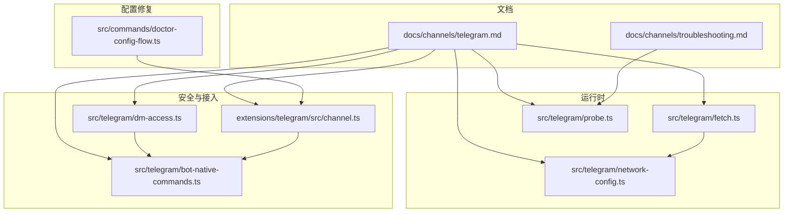
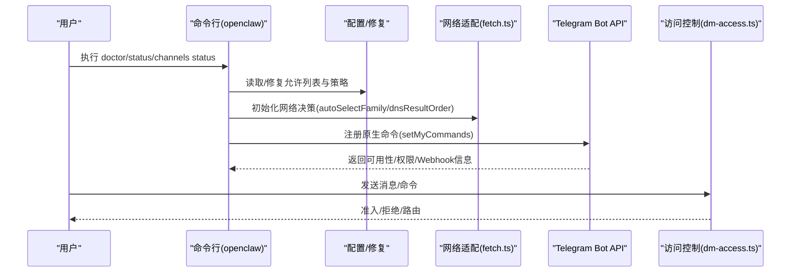
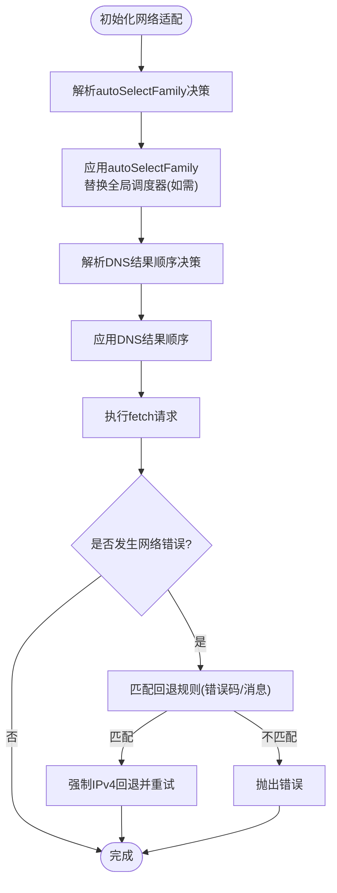
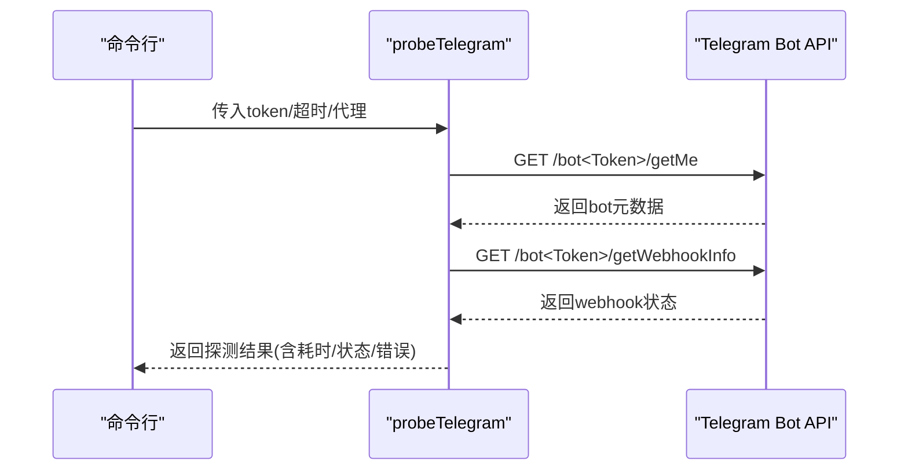
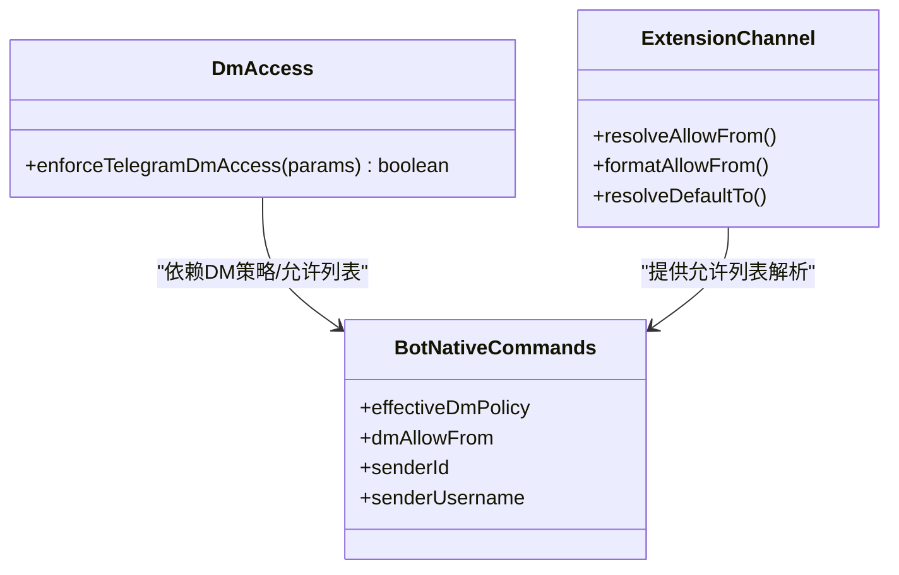
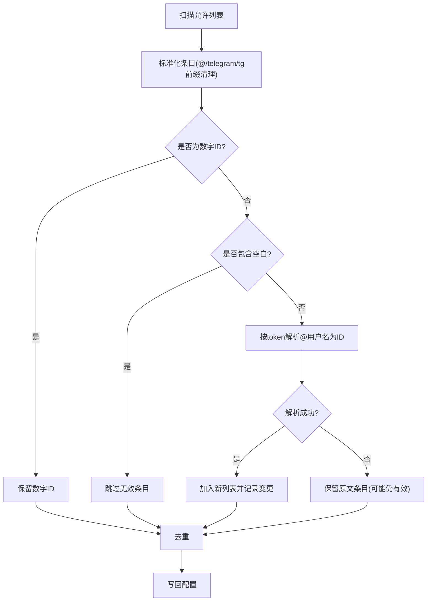
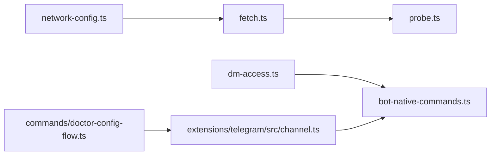

# Telegram渠道问题

<cite>
**本文引用的文件**
- [docs/channels/telegram.md](file://docs/channels/telegram.md)
- [docs/channels/troubleshooting.md](file://docs/channels/troubleshooting.md)
- [src/telegram/fetch.ts](file://src/telegram/fetch.ts)
- [src/telegram/network-config.ts](file://src/telegram/network-config.ts)
- [src/telegram/probe.ts](file://src/telegram/probe.ts)
- [src/commands/doctor-config-flow.ts](file://src/commands/doctor-config-flow.ts)
- [src/telegram/dm-access.ts](file://src/telegram/dm-access.ts)
- [src/telegram/bot-native-commands.ts](file://src/telegram/bot-native-commands.ts)
- [extensions/telegram/src/channel.ts](file://extensions/telegram/src/channel.ts)
</cite>

## 目录
1. [简介](#简介)
2. [项目结构](#项目结构)
3. [核心组件](#核心组件)
4. [架构总览](#架构总览)
5. [详细组件分析](#详细组件分析)
6. [依赖关系分析](#依赖关系分析)
7. [性能考量](#性能考量)
8. [故障排除指南](#故障排除指南)
9. [结论](#结论)
10. [附录](#附录)

## 简介
本指南聚焦于Telegram渠道在生产使用中常见的四大问题：/start命令无响应、机器人在线但群组静默、发送失败出现网络错误、升级后允许列表阻止。我们将从权限与隐私模式、DNS/IPv6/代理路由、配对与允许列表管理等维度，提供可操作的诊断与修复路径，并结合命令行检查步骤与配置修改建议，帮助快速恢复服务。

## 项目结构
与Telegram渠道相关的实现主要分布在以下位置：
- 文档层：channels/telegram.md、channels/troubleshooting.md
- 运行时网络与探测：src/telegram/fetch.ts、src/telegram/network-config.ts、src/telegram/probe.ts
- 安全与访问控制：src/telegram/dm-access.ts、src/telegram/bot-native-commands.ts、extensions/telegram/src/channel.ts
- 配置修复与迁移：src/commands/doctor-config-flow.ts

**图表来源**
- [docs/channels/telegram.md](file://docs/channels/telegram.md#L1-L800)
- [docs/channels/troubleshooting.md](file://docs/channels/troubleshooting.md#L1-L118)
- [src/telegram/network-config.ts](file://src/telegram/network-config.ts#L1-L107)
- [src/telegram/fetch.ts](file://src/telegram/fetch.ts#L1-L209)
- [src/telegram/probe.ts](file://src/telegram/probe.ts#L1-L121)
- [src/telegram/dm-access.ts](file://src/telegram/dm-access.ts#L34-L68)
- [src/telegram/bot-native-commands.ts](file://src/telegram/bot-native-commands.ts#L183-L214)
- [extensions/telegram/src/channel.ts](file://extensions/telegram/src/channel.ts#L168-L200)
- [src/commands/doctor-config-flow.ts](file://src/commands/doctor-config-flow.ts#L500-L604)

**章节来源**
- [docs/channels/telegram.md](file://docs/channels/telegram.md#L1-L800)
- [docs/channels/troubleshooting.md](file://docs/channels/troubleshooting.md#L1-L118)

## 核心组件
- 网络工作流与IPv4回退：负责自动选择地址族、DNS结果顺序、全局代理调度器替换，以及在特定网络错误时触发IPv4回退。
- 探测器：对Telegram Bot API进行getMe/getWebhookInfo探测，输出可用性、权限能力与Webhook状态。
- 访问控制：基于dmPolicy与allowFrom的DM准入策略；群组侧基于groupPolicy与groupAllowFrom的授权策略。
- 原生命令注册：启动时调用setMyCommands，若失败通常指向到api.telegram.org的出站可达性问题。
- 配置修复：针对升级后@username允许列表条目进行解析与去重，必要时提示修复。

**章节来源**
- [src/telegram/fetch.ts](file://src/telegram/fetch.ts#L54-L118)
- [src/telegram/network-config.ts](file://src/telegram/network-config.ts#L31-L102)
- [src/telegram/probe.ts](file://src/telegram/probe.ts#L20-L121)
- [src/telegram/dm-access.ts](file://src/telegram/dm-access.ts#L34-L68)
- [src/telegram/bot-native-commands.ts](file://src/telegram/bot-native-commands.ts#L183-L214)
- [src/commands/doctor-config-flow.ts](file://src/commands/doctor-config-flow.ts#L500-L604)

## 架构总览
下图展示Telegram渠道从配置到运行时的关键交互，包括网络适配、权限与隐私模式、命令注册、探测与准入控制。

**图表来源**
- [src/commands/doctor-config-flow.ts](file://src/commands/doctor-config-flow.ts#L500-L604)
- [src/telegram/fetch.ts](file://src/telegram/fetch.ts#L54-L118)
- [src/telegram/probe.ts](file://src/telegram/probe.ts#L20-L121)
- [src/telegram/dm-access.ts](file://src/telegram/dm-access.ts#L34-L68)

## 详细组件分析

### 组件A：网络与IPv4回退
- 自动地址族选择：根据Node版本、WSL2、环境变量与配置，决定是否启用autoSelectFamily以在IPv6不可达时回退至IPv4。
- DNS结果顺序：在Node 22+默认优先IPv4，避免某些网络IPv6导致的解析/连接失败。
- 全局代理调度器：在Node 22+场景下，替换undici全局调度器以确保后续fetch继承正确的连接选项。
- 回退规则：当捕获到特定网络错误码或“fetch failed”等错误时，自动切换为IPv4优先并重试一次。

**图表来源**
- [src/telegram/fetch.ts](file://src/telegram/fetch.ts#L54-L118)
- [src/telegram/fetch.ts](file://src/telegram/fetch.ts#L154-L202)
- [src/telegram/network-config.ts](file://src/telegram/network-config.ts#L31-L102)

**章节来源**
- [src/telegram/fetch.ts](file://src/telegram/fetch.ts#L54-L118)
- [src/telegram/fetch.ts](file://src/telegram/fetch.ts#L154-L202)
- [src/telegram/network-config.ts](file://src/telegram/network-config.ts#L31-L102)

### 组件B：探测器与健康检查
- 功能：对/getMe与/getWebhookInfo进行探测，记录耗时、状态码与错误描述；Webhook信息作为附加诊断。
- 适用场景：通道连通性、权限能力（能否加入群组、是否可见全部群消息、是否支持内联查询）、Webhook配置状态。

**图表来源**
- [src/telegram/probe.ts](file://src/telegram/probe.ts#L20-L121)

**章节来源**
- [src/telegram/probe.ts](file://src/telegram/probe.ts#L20-L121)

### 组件C：访问控制与配对
- DM策略：dmPolicy支持pairing、allowlist、open、disabled；pairing默认，open需要allowFrom包含"*"。
- 群组策略：groupPolicy支持open、allowlist、disabled；groupAllowFrom用于群组发送者过滤。
- 原生命令：setMyCommands失败通常意味着到api.telegram.org的出站HTTPS/DNS不可达。
- 配对与允许列表：扩展层提供resolveAllowFrom/formatAllowFrom，支持@username解析与规范化。

**图表来源**
- [src/telegram/dm-access.ts](file://src/telegram/dm-access.ts#L34-L68)
- [src/telegram/bot-native-commands.ts](file://src/telegram/bot-native-commands.ts#L183-L214)
- [extensions/telegram/src/channel.ts](file://extensions/telegram/src/channel.ts#L168-L200)

**章节来源**
- [src/telegram/dm-access.ts](file://src/telegram/dm-access.ts#L34-L68)
- [src/telegram/bot-native-commands.ts](file://src/telegram/bot-native-commands.ts#L183-L214)
- [extensions/telegram/src/channel.ts](file://extensions/telegram/src/channel.ts#L168-L200)

### 组件D：配置修复与升级兼容
- 升级后@username允许列表：扫描allowFrom/groupAllowFrom，尝试解析为数字ID并去重；支持doctor --fix自动修复。
- 规则：忽略空值与通配符；保留已为数字ID的条目；对@前缀进行标准化；最多尝试多个token解析。

**图表来源**
- [src/commands/doctor-config-flow.ts](file://src/commands/doctor-config-flow.ts#L500-L604)

**章节来源**
- [src/commands/doctor-config-flow.ts](file://src/commands/doctor-config-flow.ts#L500-L604)

## 依赖关系分析
- 网络适配依赖Node内置net/dns与undici代理；在Node 22+场景下对全局调度器进行替换以保证一致性。
- 探测器依赖fetch超时封装与可选代理；返回结构化结果供上层判断。
- 访问控制依赖配置解析与扩展层提供的允许列表格式化；原生命令注册依赖Bot API可达性。
- 配置修复依赖Telegram API解析用户名ID的能力，需要有效token。

**图表来源**
- [src/telegram/network-config.ts](file://src/telegram/network-config.ts#L1-L107)
- [src/telegram/fetch.ts](file://src/telegram/fetch.ts#L1-L209)
- [src/telegram/probe.ts](file://src/telegram/probe.ts#L1-L121)
- [src/telegram/dm-access.ts](file://src/telegram/dm-access.ts#L34-L68)
- [src/telegram/bot-native-commands.ts](file://src/telegram/bot-native-commands.ts#L183-L214)
- [extensions/telegram/src/channel.ts](file://extensions/telegram/src/channel.ts#L168-L200)
- [src/commands/doctor-config-flow.ts](file://src/commands/doctor-config-flow.ts#L500-L604)

**章节来源**
- [src/telegram/network-config.ts](file://src/telegram/network-config.ts#L1-L107)
- [src/telegram/fetch.ts](file://src/telegram/fetch.ts#L1-L209)
- [src/telegram/probe.ts](file://src/telegram/probe.ts#L1-L121)
- [src/telegram/dm-access.ts](file://src/telegram/dm-access.ts#L34-L68)
- [src/telegram/bot-native-commands.ts](file://src/telegram/bot-native-commands.ts#L183-L214)
- [extensions/telegram/src/channel.ts](file://extensions/telegram/src/channel.ts#L168-L200)
- [src/commands/doctor-config-flow.ts](file://src/commands/doctor-config-flow.ts#L500-L604)

## 性能考量
- 长轮询并发：Telegram长轮询使用grammy runner，整体并发受agents.defaults.maxConcurrent影响。
- 流式预览：在支持的场景下，先发送草稿再编辑，减少往返延迟。
- 重试与超时：发送辅助工具对可恢复的出站API错误进行重试；合理设置timeoutSeconds避免长时间阻塞。
- DNS/IPv6：在Node 22+默认启用IPv4优先，有助于规避部分网络环境下的IPv6不可达问题。

[本节为通用指导，无需具体文件分析]

## 故障排除指南

### 一、/start命令无响应
- 症状：用户发送/start后无回复。
- 快速检查清单
  - 使用命令行查看配对状态与DM策略：openclaw pairing list telegram
  - 若dmPolicy为pairing且未批准，先批准再测试
  - 若dmPolicy为allowlist，确认allowFrom中包含发送者ID（支持@username解析）
  - 使用doctor修复升级后的@username条目：openclaw doctor --fix
- 根因定位
  - DM准入策略与允许列表：参考dm-access.ts与extensions/telegram/src/channel.ts
  - 原生命令注册失败：若setMyCommands失败，通常指向到api.telegram.org的出站可达性问题
- 修复步骤
  - 在配置中调整channels.telegram.dmPolicy与allowFrom
  - 如需@username解析，确保有有效token并运行doctor --fix
  - 重启网关使策略生效

**章节来源**
- [docs/channels/troubleshooting.md](file://docs/channels/troubleshooting.md#L49-L54)
- [src/telegram/dm-access.ts](file://src/telegram/dm-access.ts#L34-L68)
- [extensions/telegram/src/channel.ts](file://extensions/telegram/src/channel.ts#L168-L200)
- [src/commands/doctor-config-flow.ts](file://src/commands/doctor-config-flow.ts#L500-L604)

### 二、机器人在线但群组静默
- 症状：机器人显示在线，但群组消息无响应。
- 快速检查清单
  - 检查群组策略与允许列表：channels.telegram.groups与groupPolicy
  - 检查隐私模式与BotFather设置：/setprivacy禁用隐私模式或提升为管理员
  - 使用channels status --probe检查群组ID可达性
- 根因定位
  - 群组未列入允许列表或groupPolicy为allowlist且未配置
  - 隐私模式导致看不到非提及消息
  - 原生命令注册失败（setMyCommands failed）常伴随群组可见性问题
- 修复步骤
  - 在channels.telegram.groups中添加目标群组ID或"*"
  - 将groupPolicy设为open或在对应群组配置allowFrom
  - 在BotFather中禁用隐私模式并重新加群
  - 通过openclaw channels status --probe验证

**章节来源**
- [docs/channels/telegram.md](file://docs/channels/telegram.md#L767-L795)
- [docs/channels/troubleshooting.md](file://docs/channels/troubleshooting.md#L50-L54)
- [src/telegram/probe.ts](file://src/telegram/probe.ts#L20-L121)

### 三、发送失败出现网络错误
- 症状：日志出现Network request for 'sendMessage' failed或sendChatAction失败。
- 快速检查清单
  - 查看日志中的具体错误码与消息
  - 检查DNS解析与到api.telegram.org的出站可达性
  - 检查系统IPv6连通性与代理配置
- 根因定位
  - Node 22+默认autoSelectFamily=true，但在某些网络IPv6不可达时会失败
  - DNS结果顺序可能导致解析到不可达的IPv6地址
  - 代理环境与自定义fetch/AbortSignal类型不匹配
- 修复步骤
  - 强制IPv4：设置OPENCLAW_TELEGRAM_ENABLE_AUTO_SELECT_FAMILY=false或在配置中关闭autoSelectFamily
  - 强制IPv4优先：设置OPENCLAW_TELEGRAM_DNS_RESULT_ORDER=ipv4first
  - 在代理环境下确保代理Agent与全局调度器一致
  - 使用openclaw channels status --probe验证网络连通性

**章节来源**
- [docs/channels/troubleshooting.md](file://docs/channels/troubleshooting.md#L51-L54)
- [src/telegram/fetch.ts](file://src/telegram/fetch.ts#L54-L118)
- [src/telegram/network-config.ts](file://src/telegram/network-config.ts#L31-L102)
- [src/telegram/probe.ts](file://src/telegram/probe.ts#L20-L121)

### 四、升级后允许列表阻止
- 症状：升级后@username条目导致允许列表不生效。
- 快速检查清单
  - 运行openclaw doctor --fix自动修复@username为数字ID
  - 检查allowFrom与groupAllowFrom中是否存在@username条目
- 根因定位
  - 允许列表条目必须为数字ID；@username需解析为ID
  - 扩展层提供格式化与解析逻辑，但需要有效token
- 修复步骤
  - 运行openclaw doctor --fix，系统会尝试解析@username并替换为数字ID
  - 对于无法解析的条目，保留原文但建议手动修正
  - 重启网关使修复后的配置生效

**章节来源**
- [docs/channels/troubleshooting.md](file://docs/channels/troubleshooting.md#L52-L54)
- [src/commands/doctor-config-flow.ts](file://src/commands/doctor-config-flow.ts#L500-L604)
- [extensions/telegram/src/channel.ts](file://extensions/telegram/src/channel.ts#L168-L200)

### 五、通用命令行检查步骤
- 基础健康检查
  - openclaw status
  - openclaw gateway status
  - openclaw logs --follow
- 渠道专项检查
  - openclaw doctor
  - openclaw channels status --probe
  - openclaw pairing list telegram（查看配对状态）
- 配置修复
  - openclaw doctor --fix（自动修复@username为ID）

**章节来源**
- [docs/channels/troubleshooting.md](file://docs/channels/troubleshooting.md#L13-L23)

## 结论
Telegram渠道的稳定性取决于“权限与隐私模式正确、网络可达性良好、允许列表与配对策略清晰”。通过上述组件与流程的协同，结合命令行检查与配置修复，可高效定位并解决/start无响应、群组静默、网络错误与升级后允许列表问题。建议在部署与变更后，使用channels status --probe与doctor进行例行巡检。

[本节为总结，无需具体文件分析]

## 附录

### A. 关键配置与环境变量
- OPENCLAW_TELEGRAM_ENABLE_AUTO_SELECT_FAMILY / OPENCLAW_TELEGRAM_DISABLE_AUTO_SELECT_FAMILY
- OPENCLAW_TELEGRAM_DNS_RESULT_ORDER=ipv4first|verbatim
- channels.telegram.dmPolicy与allowFrom
- channels.telegram.groupPolicy与groupAllowFrom
- channels.telegram.network.autoSelectFamily与dnsResultOrder

**章节来源**
- [src/telegram/network-config.ts](file://src/telegram/network-config.ts#L6-L102)
- [docs/channels/telegram.md](file://docs/channels/telegram.md#L105-L180)

### B. 常见错误与对策速查
- setMyCommands failed → 检查到api.telegram.org的出站HTTPS/DNS可达性
- Privacy mode导致群组消息不可见 → BotFather禁用隐私模式或提权为管理员
- 网络错误(ETIMEDOUT/ENETUNREACH) → 强制IPv4或调整DNS结果顺序
- @username允许列表 → 运行doctor --fix解析为数字ID

**章节来源**
- [docs/channels/telegram.md](file://docs/channels/telegram.md#L314-L317)
- [docs/channels/telegram.md](file://docs/channels/telegram.md#L767-L795)
- [docs/channels/troubleshooting.md](file://docs/channels/troubleshooting.md#L49-L54)