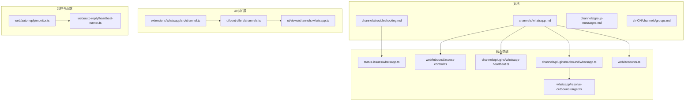
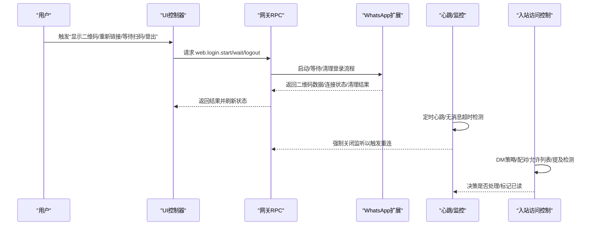
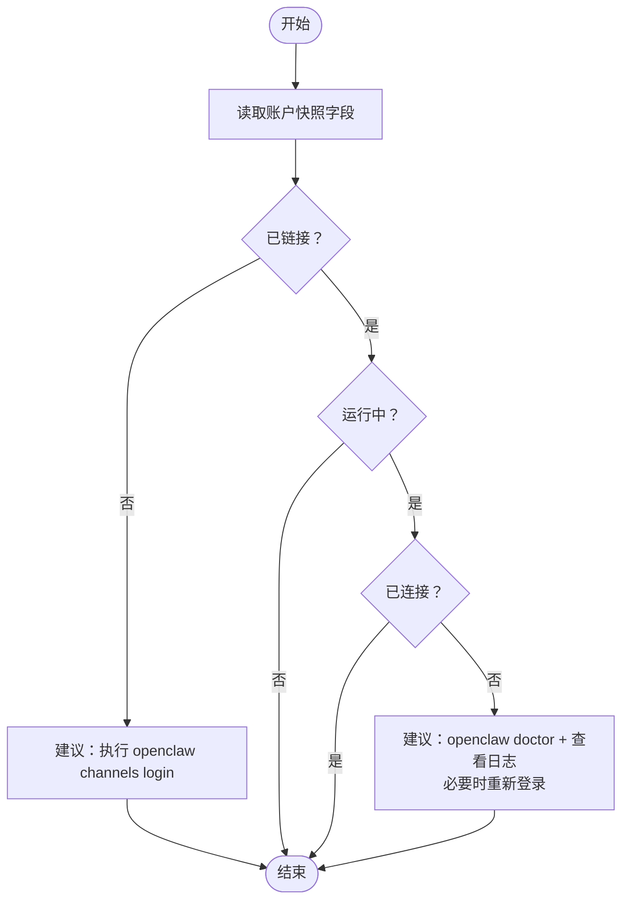
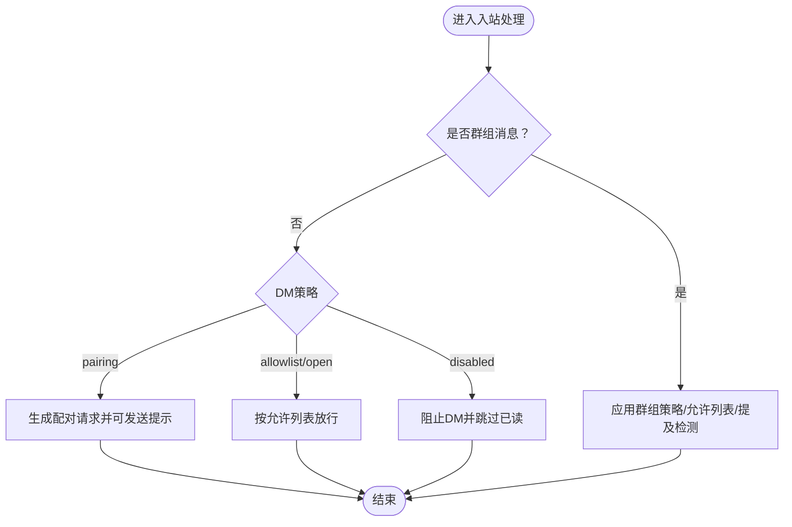
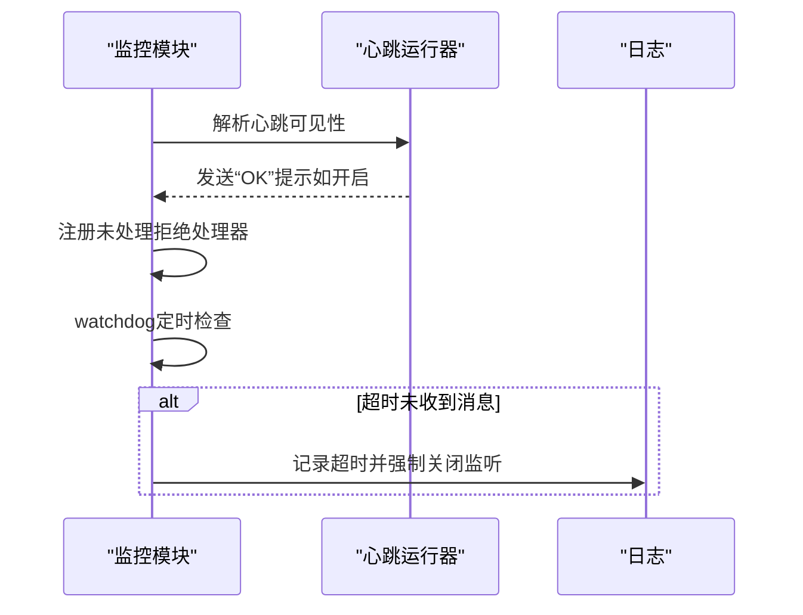
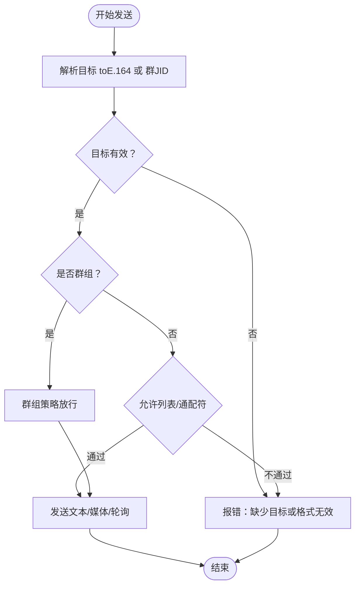
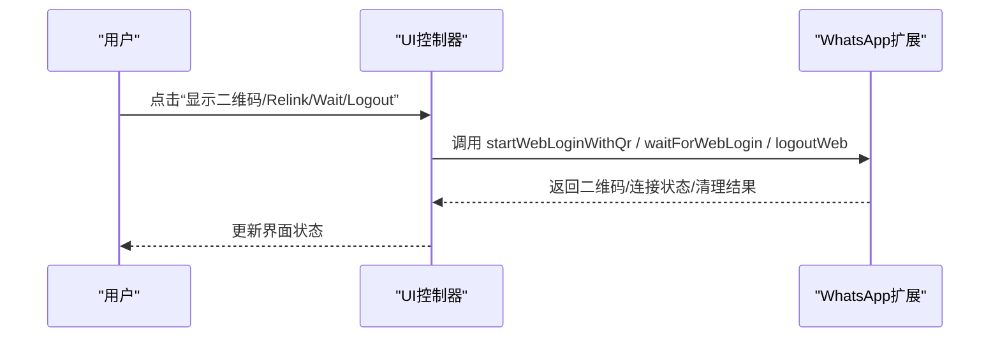
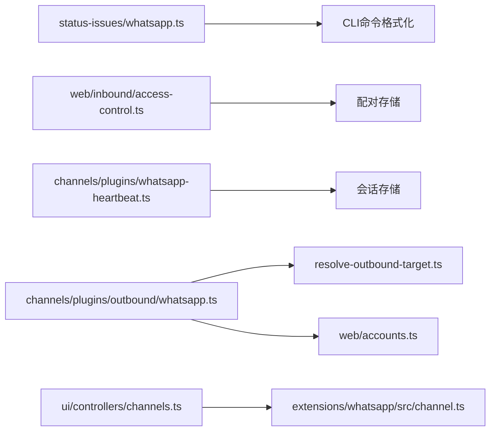

# WhatsApp渠道问题

<cite>
**本文引用的文件**
- [docs/channels/troubleshooting.md](file://docs/channels/troubleshooting.md)
- [docs/channels/whatsapp.md](file://docs/channels/whatsapp.md)
- [src/channels/plugins/status-issues/whatsapp.ts](file://src/channels/plugins/status-issues/whatsapp.ts)
- [src/web/inbound/access-control.ts](file://src/web/inbound/access-control.ts)
- [src/channels/plugins/whatsapp-heartbeat.ts](file://src/channels/plugins/whatsapp-heartbeat.ts)
- [src/channels/plugins/outbound/whatsapp.ts](file://src/channels/plugins/outbound/whatsapp.ts)
- [src/whatsapp/resolve-outbound-target.ts](file://src/whatsapp/resolve-outbound-target.ts)
- [src/web/accounts.ts](file://src/web/accounts.ts)
- [extensions/whatsapp/src/channel.ts](file://extensions/whatsapp/src/channel.ts)
- [ui/src/ui/controllers/channels.ts](file://ui/src/ui/controllers/channels.ts)
- [ui/src/ui/views/channels.whatsapp.ts](file://ui/src/ui/views/channels.whatsapp.ts)
- [src/web/auto-reply/monitor.ts](file://src/web/auto-reply/monitor.ts)
- [src/web/auto-reply/heartbeat-runner.ts](file://src/web/auto-reply/heartbeat-runner.ts)
- [src/channels/ack-reactions.test.ts](file://src/channels/ack-reactions.test.ts)
- [docs/channels/group-messages.md](file://docs/channels/group-messages.md)
- [docs/zh-CN/channels/groups.md](file://docs/zh-CN/channels/groups.md)
</cite>

## 目录
1. [简介](#简介)
2. [项目结构](#项目结构)
3. [核心组件](#核心组件)
4. [架构总览](#架构总览)
5. [详细组件分析](#详细组件分析)
6. [依赖关系分析](#依赖关系分析)
7. [性能考量](#性能考量)
8. [故障排除指南](#故障排除指南)
9. [结论](#结论)
10. [附录](#附录)

## 简介
本指南聚焦于WhatsApp渠道在OpenClaw中的常见问题与排障方法，覆盖连接状态检查、消息回复失败、群组消息忽略、随机断开与重连循环等问题。文档提供基于仓库内现有实现与文档的实操步骤，包括如何使用openclaw pairing list whatsapp命令检查配对状态、如何调整DM策略与允许列表、如何解决认证凭据问题，以及如何配置WhatsApp API权限、排查网络连接与消息转发失败。

## 项目结构
与WhatsApp渠道相关的实现分布在以下区域：
- 文档层：channels/troubleshooting.md、channels/whatsapp.md、channels/group-messages.md、zh-CN/channels/groups.md
- 核心逻辑层：状态问题收集、入站访问控制、心跳与监控、出站适配器、目标解析、媒体大小限制、UI控制器与视图
- 扩展层：WhatsApp扩展通道定义与安全策略

**图表来源**
- [docs/channels/troubleshooting.md](file://docs/channels/troubleshooting.md#L1-L41)
- [docs/channels/whatsapp.md](file://docs/channels/whatsapp.md#L1-L446)
- [src/channels/plugins/status-issues/whatsapp.ts](file://src/channels/plugins/status-issues/whatsapp.ts#L1-L67)
- [src/web/inbound/access-control.ts](file://src/web/inbound/access-control.ts#L149-L185)
- [src/channels/plugins/whatsapp-heartbeat.ts](file://src/channels/plugins/whatsapp-heartbeat.ts#L1-L100)
- [src/channels/plugins/outbound/whatsapp.ts](file://src/channels/plugins/outbound/whatsapp.ts#L1-L49)
- [src/whatsapp/resolve-outbound-target.ts](file://src/whatsapp/resolve-outbound-target.ts#L1-L53)
- [src/web/accounts.ts](file://src/web/accounts.ts#L152-L166)
- [ui/src/ui/controllers/channels.ts](file://ui/src/ui/controllers/channels.ts#L1-L94)
- [ui/src/ui/views/channels.whatsapp.ts](file://ui/src/ui/views/channels.whatsapp.ts#L1-L118)
- [extensions/whatsapp/src/channel.ts](file://extensions/whatsapp/src/channel.ts#L75-L144)
- [src/web/auto-reply/monitor.ts](file://src/web/auto-reply/monitor.ts#L219-L327)
- [src/web/auto-reply/heartbeat-runner.ts](file://src/web/auto-reply/heartbeat-runner.ts#L29-L76)

**章节来源**
- [docs/channels/troubleshooting.md](file://docs/channels/troubleshooting.md#L1-L41)
- [docs/channels/whatsapp.md](file://docs/channels/whatsapp.md#L1-L446)

## 核心组件
- 状态问题收集：用于从通道快照中识别WhatsApp账户的“未链接”“运行但未连接”等典型问题，并给出修复建议。
- 入站访问控制：针对DM与群组消息的策略（配对、白名单、开放、禁用），以及提及检测与激活模式。
- 心跳与监控：周期性心跳可见性与超时强制重连机制，保障连接健康。
- 出站适配器：文本分块、媒体发送、轮询发送等能力，以及目标解析与允许列表校验。
- UI控制器与视图：展示WhatsApp状态、二维码登录、等待扫码、登出等操作入口。
- 扩展通道：描述账户启用/禁用、是否已配置/已链接、默认收件人解析、安全策略等。

**章节来源**
- [src/channels/plugins/status-issues/whatsapp.ts](file://src/channels/plugins/status-issues/whatsapp.ts#L30-L67)
- [src/web/inbound/access-control.ts](file://src/web/inbound/access-control.ts#L149-L185)
- [src/web/auto-reply/monitor.ts](file://src/web/auto-reply/monitor.ts#L219-L327)
- [src/channels/plugins/outbound/whatsapp.ts](file://src/channels/plugins/outbound/whatsapp.ts#L8-L49)
- [src/whatsapp/resolve-outbound-target.ts](file://src/whatsapp/resolve-outbound-target.ts#L8-L53)
- [ui/src/ui/controllers/channels.ts](file://ui/src/ui/controllers/channels.ts#L29-L94)
- [ui/src/ui/views/channels.whatsapp.ts](file://ui/src/ui/views/channels.whatsapp.ts#L7-L118)
- [extensions/whatsapp/src/channel.ts](file://extensions/whatsapp/src/channel.ts#L75-L144)

## 架构总览
WhatsApp渠道在OpenClaw中的运行路径概览如下：

**图表来源**
- [ui/src/ui/controllers/channels.ts](file://ui/src/ui/controllers/channels.ts#L29-L94)
- [extensions/whatsapp/src/channel.ts](file://extensions/whatsapp/src/channel.ts#L437-L468)
- [src/web/auto-reply/monitor.ts](file://src/web/auto-reply/monitor.ts#L219-L327)
- [src/web/inbound/access-control.ts](file://src/web/inbound/access-control.ts#L149-L185)

## 详细组件分析

### 组件A：状态问题收集（WhatsApp）
- 功能要点
  - 读取通道账户快照，提取linked/running/connected/reconnectAttempts/lastError等关键字段
  - 若未链接，提示执行openclaw channels login
  - 若运行但未连接，提示doctor/logs与重连
- 适用场景
  - 连接后出现随机断开/重连循环
  - 无法定位是认证问题还是网络问题

**图表来源**
- [src/channels/plugins/status-issues/whatsapp.ts](file://src/channels/plugins/status-issues/whatsapp.ts#L30-L67)

**章节来源**
- [src/channels/plugins/status-issues/whatsapp.ts](file://src/channels/plugins/status-issues/whatsapp.ts#L30-L67)

### 组件B：入站访问控制（DM策略与配对）
- 功能要点
  - DM策略默认为配对；当策略为配对且非自聊时，会生成配对请求并可自动发送提示消息
  - dmPolicy=disabled会直接阻止DM
  - 自聊场景跳过已读回执与自触发行为
- 适用场景
  - 已连接但DM回复失败
  - 需要通过openclaw pairing list whatsapp查看待审批的发送者

**图表来源**
- [src/web/inbound/access-control.ts](file://src/web/inbound/access-control.ts#L149-L185)

**章节来源**
- [src/web/inbound/access-control.ts](file://src/web/inbound/access-control.ts#L149-L185)

### 组件C：心跳与监控（连接健康与超时重连）
- 功能要点
  - 心跳可见性按渠道解析，可选择显示“OK”提示
  - 监控模块注册未处理拒绝，遇到可能的加密错误时强制关闭监听以触发重连
  - 超时 watchdog：若超过阈值未收到消息，记录警告并强制重连
- 适用场景
  - 随机断开/重连循环
  - 网络波动导致连接异常

**图表来源**
- [src/web/auto-reply/heartbeat-runner.ts](file://src/web/auto-reply/heartbeat-runner.ts#L29-L76)
- [src/web/auto-reply/monitor.ts](file://src/web/auto-reply/monitor.ts#L219-L327)

**章节来源**
- [src/web/auto-reply/heartbeat-runner.ts](file://src/web/auto-reply/heartbeat-runner.ts#L29-L76)
- [src/web/auto-reply/monitor.ts](file://src/web/auto-reply/monitor.ts#L219-L327)

### 组件D：出站适配器与目标解析（消息转发）
- 功能要点
  - 文本分块与媒体发送，支持轮询发送
  - 目标解析：要求to为E.164或群JID；若不在允许列表且未配置通配符，则拒绝
  - 媒体大小限制：按账户配置转换为字节
- 适用场景
  - 消息转发失败（目标不合法/超出媒体限制）

**图表来源**
- [src/channels/plugins/outbound/whatsapp.ts](file://src/channels/plugins/outbound/whatsapp.ts#L8-L49)
- [src/whatsapp/resolve-outbound-target.ts](file://src/whatsapp/resolve-outbound-target.ts#L8-L53)
- [src/web/accounts.ts](file://src/web/accounts.ts#L152-L166)

**章节来源**
- [src/channels/plugins/outbound/whatsapp.ts](file://src/channels/plugins/outbound/whatsapp.ts#L8-L49)
- [src/whatsapp/resolve-outbound-target.ts](file://src/whatsapp/resolve-outbound-target.ts#L8-L53)
- [src/web/accounts.ts](file://src/web/accounts.ts#L152-L166)

### 组件E：UI与扩展（登录、等待扫码、登出）
- 功能要点
  - UI控制器提供启动登录、等待扫码、登出接口
  - 扩展通道描述账户启用/禁用、已链接/未链接、默认收件人解析、安全策略
- 适用场景
  - 需要手动触发登录流程或清理凭据

**图表来源**
- [ui/src/ui/controllers/channels.ts](file://ui/src/ui/controllers/channels.ts#L29-L94)
- [extensions/whatsapp/src/channel.ts](file://extensions/whatsapp/src/channel.ts#L437-L468)

**章节来源**
- [ui/src/ui/controllers/channels.ts](file://ui/src/ui/controllers/channels.ts#L29-L94)
- [extensions/whatsapp/src/channel.ts](file://extensions/whatsapp/src/channel.ts#L75-L144)

## 依赖关系分析
- 状态问题收集依赖通道快照与CLI命令格式化工具
- 入站访问控制依赖配对存储与通道策略
- 心跳与监控依赖会话存储与渠道配置
- 出站适配器依赖目标解析与媒体大小限制
- UI控制器依赖网关RPC与扩展通道

**图表来源**
- [src/channels/plugins/status-issues/whatsapp.ts](file://src/channels/plugins/status-issues/whatsapp.ts#L1-L3)
- [src/web/inbound/access-control.ts](file://src/web/inbound/access-control.ts#L149-L185)
- [src/channels/plugins/whatsapp-heartbeat.ts](file://src/channels/plugins/whatsapp-heartbeat.ts#L1-L100)
- [src/channels/plugins/outbound/whatsapp.ts](file://src/channels/plugins/outbound/whatsapp.ts#L1-L49)
- [src/whatsapp/resolve-outbound-target.ts](file://src/whatsapp/resolve-outbound-target.ts#L1-L53)
- [src/web/accounts.ts](file://src/web/accounts.ts#L152-L166)
- [ui/src/ui/controllers/channels.ts](file://ui/src/ui/controllers/channels.ts#L1-L94)
- [extensions/whatsapp/src/channel.ts](file://extensions/whatsapp/src/channel.ts#L75-L144)

**章节来源**
- [src/channels/plugins/status-issues/whatsapp.ts](file://src/channels/plugins/status-issues/whatsapp.ts#L1-L67)
- [src/web/inbound/access-control.ts](file://src/web/inbound/access-control.ts#L149-L185)
- [src/channels/plugins/whatsapp-heartbeat.ts](file://src/channels/plugins/whatsapp-heartbeat.ts#L1-L100)
- [src/channels/plugins/outbound/whatsapp.ts](file://src/channels/plugins/outbound/whatsapp.ts#L1-L49)
- [src/whatsapp/resolve-outbound-target.ts](file://src/whatsapp/resolve-outbound-target.ts#L1-L53)
- [src/web/accounts.ts](file://src/web/accounts.ts#L152-L166)
- [ui/src/ui/controllers/channels.ts](file://ui/src/ui/controllers/channels.ts#L1-L94)
- [extensions/whatsapp/src/channel.ts](file://extensions/whatsapp/src/channel.ts#L75-L144)

## 性能考量
- 文本分块与换行优先：默认文本分块上限与模式可配置，避免单条消息过大
- 媒体优化：图片自动优化以满足尺寸限制，发送失败时首项回退为文本警告
- 心跳可见性：可按渠道关闭“OK”提示，减少冗余输出
- 会话隔离：群组会话独立，避免跨会话干扰

[本节为通用指导，无需具体文件分析]

## 故障排除指南

### 一、连接状态检查
- 快速命令
  - openclaw status
  - openclaw gateway status
  - openclaw logs --follow
  - openclaw doctor
  - openclaw channels status --probe
- 健康基线
  - Runtime: running
  - RPC探针: ok
  - 通道探针: connected/ready
- 常见症状与修复
  - 未链接：执行 openclaw channels login 并扫描二维码
  - 运行但未连接：执行 openclaw doctor 或重启网关；如仍失败，重新登录并检查日志

**章节来源**
- [docs/channels/troubleshooting.md](file://docs/channels/troubleshooting.md#L13-L41)
- [docs/channels/whatsapp.md](file://docs/channels/whatsapp.md#L374-L424)
- [src/channels/plugins/status-issues/whatsapp.ts](file://src/channels/plugins/status-issues/whatsapp.ts#L44-L63)

### 二、消息回复失败（DM）
- 现象
  - 已连接但DM回复失败
- 快速检查
  - openclaw pairing list whatsapp
- 处理步骤
  - 若处于配对模式，先批准发送者
  - 调整DM策略与允许列表：channels.whatsapp.dmPolicy 与 allowFrom
  - 自聊保护：若自聊场景，系统会跳过已读回执与自触发行为
- 相关实现
  - DM策略与配对请求生成、阻止逻辑

**章节来源**
- [docs/channels/troubleshooting.md](file://docs/channels/troubleshooting.md#L35-L37)
- [docs/channels/whatsapp.md](file://docs/channels/whatsapp.md#L134-L210)
- [src/web/inbound/access-control.ts](file://src/web/inbound/access-control.ts#L149-L185)

### 三、群组消息忽略
- 现象
  - 群组消息被忽略
- 快速检查
  - 检查 groupPolicy 与 groupAllowFrom/allowFrom
  - 检查 groups 允许列表与 requireMention 设置
  - 检查提及检测与激活模式（mention/always）
- 处理步骤
  - 放宽群组策略或添加允许列表
  - 在群组配置中调整 requireMention
  - 使用 /activation mention 或 /activation always 切换激活模式
- 相关实现
  - 群组策略、允许列表、提及检测与激活模式

**章节来源**
- [docs/channels/troubleshooting.md](file://docs/channels/troubleshooting.md#L38-L38)
- [docs/channels/whatsapp.md](file://docs/channels/whatsapp.md#L157-L200)
- [docs/channels/group-messages.md](file://docs/channels/group-messages.md#L14-L22)
- [docs/zh-CN/channels/groups.md](file://docs/zh-CN/channels/groups.md#L326-L358)

### 四、随机断开与重连循环
- 现象
  - 连接后频繁断开/重连
- 快速检查
  - openclaw channels status --probe + openclaw logs --follow
- 处理步骤
  - 执行 openclaw doctor 排查环境与依赖
  - 重新登录：openclaw channels login
  - 检查凭据目录健康状况
- 相关实现
  - 心跳可见性与“OK”提示
  - 未处理拒绝与超时 watchdog 强制重连

**章节来源**
- [docs/channels/troubleshooting.md](file://docs/channels/troubleshooting.md#L39-L39)
- [docs/channels/whatsapp.md](file://docs/channels/whatsapp.md#L389-L401)
- [src/web/auto-reply/heartbeat-runner.ts](file://src/web/auto-reply/heartbeat-runner.ts#L29-L76)
- [src/web/auto-reply/monitor.ts](file://src/web/auto-reply/monitor.ts#L219-L327)

### 五、认证凭据问题
- 现象
  - 登录后仍提示未链接或反复断开
- 处理步骤
  - 清理凭据：openclaw channels logout --channel whatsapp [--account <id>]
  - 重新登录：openclaw channels login --channel whatsapp
  - 检查凭据目录位置与备份文件
- 相关实现
  - 登出清理与凭据迁移

**章节来源**
- [docs/channels/whatsapp.md](file://docs/channels/whatsapp.md#L352-L364)
- [extensions/whatsapp/src/channel.ts](file://extensions/whatsapp/src/channel.ts#L459-L466)
- [ui/src/ui/controllers/channels.ts](file://ui/src/ui/controllers/channels.ts#L79-L94)

### 六、WhatsApp API权限配置
- 关键配置项
  - channels.whatsapp.dmPolicy：配对/允许列表/开放/禁用
  - channels.whatsapp.allowFrom：允许的发送者列表（E.164）
  - channels.whatsapp.groupPolicy：群组策略（open/allowlist/disabled）
  - channels.whatsapp.groupAllowFrom：群组发送者允许列表
  - channels.whatsapp.groups：群组级配置（如 requireMention）
  - channels.whatsapp.sendReadReceipts：是否发送已读回执
  - channels.whatsapp.ackReaction：确认表情反应配置
- 多账户与凭据
  - channels.whatsapp.accounts.<id>.enabled、authDir
  - 凭据路径：~/.openclaw/credentials/whatsapp/<accountId>/creds.json
- 相关实现
  - 配置模式校验与默认策略解析

**章节来源**
- [docs/channels/whatsapp.md](file://docs/channels/whatsapp.md#L24-L200)
- [src/config/zod-schema.providers-whatsapp.ts](file://src/config/zod-schema.providers-whatsapp.ts#L115-L155)

### 七、网络连接问题
- 排查步骤
  - openclaw doctor
  - openclaw logs --follow
  - 心跳可见性与 watchdog 超时
- 处理建议
  - 保持稳定的网络环境
  - 如需，重新登录并检查日志

**章节来源**
- [docs/channels/whatsapp.md](file://docs/channels/whatsapp.md#L389-L401)
- [src/web/auto-reply/monitor.ts](file://src/web/auto-reply/monitor.ts#L297-L327)

### 八、消息转发失败
- 现象
  - 出站发送失败或部分失败
- 快速检查
  - 目标是否为有效E.164或群JID
  - 是否在允许列表或配置了通配符
  - 媒体大小是否超过限制
- 处理步骤
  - 修正目标格式与允许列表
  - 调整媒体大小限制
  - 开启最佳努力模式时，关注部分失败回退逻辑

**章节来源**
- [src/whatsapp/resolve-outbound-target.ts](file://src/whatsapp/resolve-outbound-target.ts#L8-L53)
- [src/web/accounts.ts](file://src/web/accounts.ts#L152-L166)
- [src/channels/plugins/outbound/whatsapp.ts](file://src/channels/plugins/outbound/whatsapp.ts#L8-L49)

### 九、UI与登录流程辅助
- 操作入口
  - 显示二维码、Relink、Wait for scan、Logout
  - 刷新状态
- 相关实现
  - UI控制器与扩展通道登录接口

**章节来源**
- [ui/src/ui/views/channels.whatsapp.ts](file://ui/src/ui/views/channels.whatsapp.ts#L7-L118)
- [ui/src/ui/controllers/channels.ts](file://ui/src/ui/controllers/channels.ts#L29-L94)
- [extensions/whatsapp/src/channel.ts](file://extensions/whatsapp/src/channel.ts#L437-L468)

## 结论
本指南基于仓库内的实现与文档，提供了针对WhatsApp渠道常见问题的系统化排障路径。通过结合通道状态检查、配对与策略调整、凭据清理与重新登录、网络与心跳监控，以及出站目标与媒体限制的核查，可高效定位并解决问题。建议在生产环境中遵循最小权限原则与自聊保护策略，合理配置群组策略与提及检测，以获得更稳定的消息体验。

[本节为总结，无需具体文件分析]

## 附录
- 相关文档与参考
  - 通道故障排除快速清单与命令阶梯
  - WhatsApp渠道完整配置与行为说明
  - 群组消息处理与提及检测细节
  - 中文版群组配置示例

**章节来源**
- [docs/channels/troubleshooting.md](file://docs/channels/troubleshooting.md#L1-L41)
- [docs/channels/whatsapp.md](file://docs/channels/whatsapp.md#L1-L446)
- [docs/channels/group-messages.md](file://docs/channels/group-messages.md#L1-L22)
- [docs/zh-CN/channels/groups.md](file://docs/zh-CN/channels/groups.md#L326-L358)