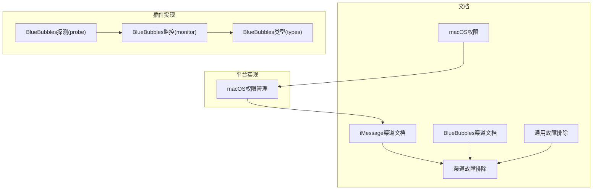
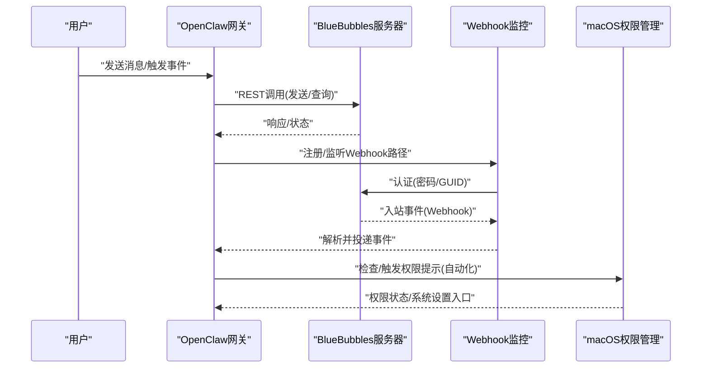
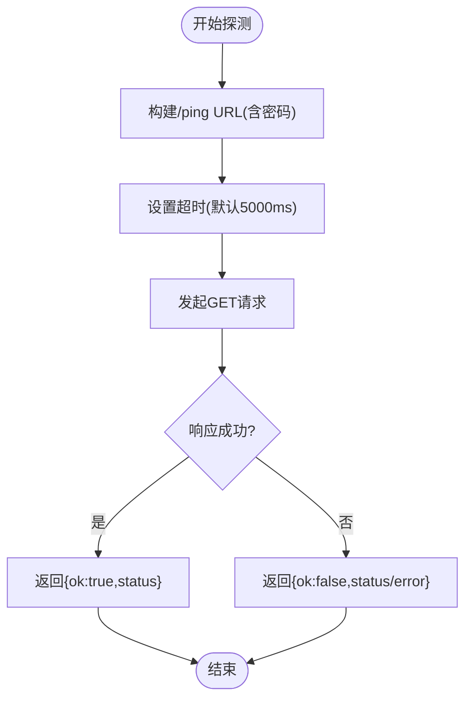
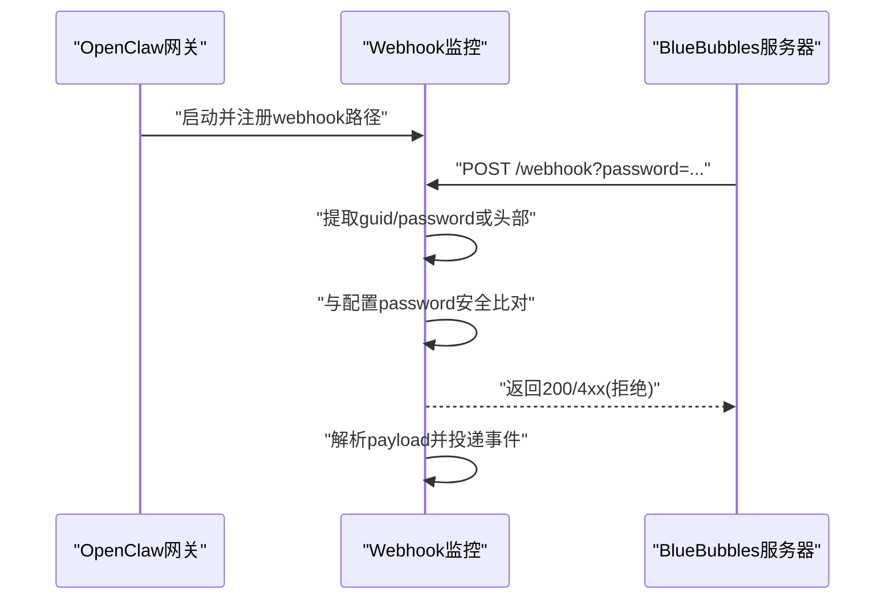
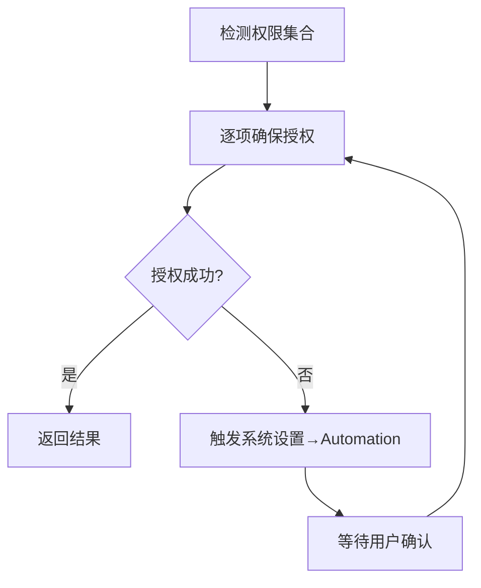
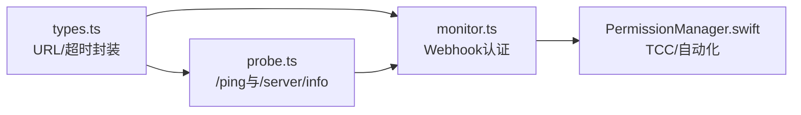

# iMessage和BlueBubbles问题

<cite>
**本文引用的文件**
- [docs/channels/imessage.md](file://docs/channels/imessage.md)
- [docs/channels/bluebubbles.md](file://docs/channels/bluebubbles.md)
- [docs/channels/troubleshooting.md](file://docs/channels/troubleshooting.md)
- [docs/help/troubleshooting.md](file://docs/help/troubleshooting.md)
- [docs/gateway/troubleshooting.md](file://docs/gateway/troubleshooting.md)
- [extensions/bluebubbles/src/probe.ts](file://extensions/bluebubbles/src/probe.ts)
- [extensions/bluebubbles/src/monitor.ts](file://extensions/bluebubbles/src/monitor.ts)
- [extensions/bluebubbles/src/types.ts](file://extensions/bluebubbles/src/types.ts)
- [apps/macos/Sources/OpenClaw/PermissionManager.swift](file://apps/macos/Sources/OpenClaw/PermissionManager.swift)
- [docs/platforms/mac/permissions.md](file://docs/platforms/mac/permissions.md)
</cite>

## 目录
1. [简介](#简介)
2. [项目结构](#项目结构)
3. [核心组件](#核心组件)
4. [架构总览](#架构总览)
5. [详细组件分析](#详细组件分析)
6. [依赖关系分析](#依赖关系分析)
7. [性能考虑](#性能考虑)
8. [故障排除指南](#故障排除指南)
9. [结论](#结论)

## 简介
本文件聚焦于iMessage与BlueBubbles渠道的常见问题与系统化故障排除流程，覆盖以下核心症状：
- 无入站事件（Webhook/服务器可达性）
- macOS上可发送但无接收（隐私权限/TCC）
- 直接消息（DM）发送方被阻止（配对/白名单）

同时提供：
- Webhook/服务器可达性检查清单
- macOS隐私权限（TCC）重新授予权限步骤
- 应用自动化权限验证方法
- 渠道进程重启与状态监控
- BlueBubbles服务器状态检查与私有API能力识别

## 项目结构
围绕iMessage与BlueBubbles的故障排除，相关知识与实现分布在如下位置：
- 文档层：渠道文档、通用故障排除、macOS权限说明
- 插件层：BlueBubbles插件的探测、监控与类型定义
- 平台层：macOS权限管理与持久化策略

**图表来源**
- [docs/channels/imessage.md](file://docs/channels/imessage.md#L1-L368)
- [docs/channels/bluebubbles.md](file://docs/channels/bluebubbles.md#L1-L348)
- [docs/channels/troubleshooting.md](file://docs/channels/troubleshooting.md#L80-L93)
- [docs/help/troubleshooting.md](file://docs/help/troubleshooting.md#L1-L297)
- [extensions/bluebubbles/src/probe.ts](file://extensions/bluebubbles/src/probe.ts#L1-L130)
- [extensions/bluebubbles/src/monitor.ts](file://extensions/bluebubbles/src/monitor.ts#L142-L327)
- [extensions/bluebubbles/src/types.ts](file://extensions/bluebubbles/src/types.ts#L112-L137)
- [apps/macos/Sources/OpenClaw/PermissionManager.swift](file://apps/macos/Sources/OpenClaw/PermissionManager.swift#L1-L408)
- [docs/platforms/mac/permissions.md](file://docs/platforms/mac/permissions.md#L1-L41)

**章节来源**
- [docs/channels/imessage.md](file://docs/channels/imessage.md#L1-L368)
- [docs/channels/bluebubbles.md](file://docs/channels/bluebubbles.md#L1-L348)
- [docs/channels/troubleshooting.md](file://docs/channels/troubleshooting.md#L80-L93)
- [docs/help/troubleshooting.md](file://docs/help/troubleshooting.md#L1-L297)
- [extensions/bluebubbles/src/probe.ts](file://extensions/bluebubbles/src/probe.ts#L1-L130)
- [extensions/bluebubbles/src/monitor.ts](file://extensions/bluebubbles/src/monitor.ts#L142-L327)
- [extensions/bluebubbles/src/types.ts](file://extensions/bluebubbles/src/types.ts#L112-L137)
- [apps/macos/Sources/OpenClaw/PermissionManager.swift](file://apps/macos/Sources/OpenClaw/PermissionManager.swift#L1-L408)
- [docs/platforms/mac/permissions.md](file://docs/platforms/mac/permissions.md#L1-L41)

## 核心组件
- BlueBubbles渠道插件：负责REST API探测、Webhook注册与认证、服务器信息缓存（含macOS版本与私有API能力）、动作能力自适应。
- macOS权限管理：统一处理TCC授权、自动化权限提示与系统设置入口。
- 通用故障排除命令链：status、gateway status、logs、doctor、channels status --probe。

**章节来源**
- [extensions/bluebubbles/src/probe.ts](file://extensions/bluebubbles/src/probe.ts#L1-L130)
- [extensions/bluebubbles/src/monitor.ts](file://extensions/bluebubbles/src/monitor.ts#L142-L327)
- [extensions/bluebubbles/src/types.ts](file://extensions/bluebubbles/src/types.ts#L112-L137)
- [apps/macos/Sources/OpenClaw/PermissionManager.swift](file://apps/macos/Sources/OpenClaw/PermissionManager.swift#L1-L408)
- [docs/help/troubleshooting.md](file://docs/help/troubleshooting.md#L13-L25)

## 架构总览
下图展示从用户到OpenClaw网关、再到BlueBubbles服务器与Webhook的端到端交互，以及macOS权限在其中的关键作用。

**图表来源**
- [extensions/bluebubbles/src/monitor.ts](file://extensions/bluebubbles/src/monitor.ts#L142-L327)
- [extensions/bluebubbles/src/probe.ts](file://extensions/bluebubbles/src/probe.ts#L137-L164)
- [apps/macos/Sources/OpenClaw/PermissionManager.swift](file://apps/macos/Sources/OpenClaw/PermissionManager.swift#L378-L394)

## 详细组件分析

### BlueBubbles探测与服务器信息缓存
- 探测逻辑：构造/ping接口URL并带密码参数，超时控制，返回成功/失败与HTTP状态。
- 服务器信息缓存：拉取/server/info，缓存10分钟，按账号ID区分键，限制最大条目数，避免重复请求。
- macOS版本与私有API能力：解析os_version主版本号，判断是否macOS 26及以上，并据此调整可用动作能力。

**图表来源**
- [extensions/bluebubbles/src/probe.ts](file://extensions/bluebubbles/src/probe.ts#L137-L164)
- [extensions/bluebubbles/src/types.ts](file://extensions/bluebubbles/src/types.ts#L112-L137)

**章节来源**
- [extensions/bluebubbles/src/probe.ts](file://extensions/bluebubbles/src/probe.ts#L1-L130)
- [extensions/bluebubbles/src/types.ts](file://extensions/bluebubbles/src/types.ts#L112-L137)

### BlueBubbles Webhook认证与注册
- 认证机制：支持查询参数guid/password或多个头部(x-guid/x-password/x-bluebubbles-guid/authorization)，与配置中的password进行安全比较。
- 注册流程：根据配置的webhookPath注册监听，启动后记录日志；Abort信号触发时停止并清理。
- 服务器信息注入：启动时拉取并记录macOS版本与私有API状态，便于后续动作能力判定。

**图表来源**
- [extensions/bluebubbles/src/monitor.ts](file://extensions/bluebubbles/src/monitor.ts#L142-L181)
- [extensions/bluebubbles/src/monitor.ts](file://extensions/bluebubbles/src/monitor.ts#L277-L327)

**章节来源**
- [extensions/bluebubbles/src/monitor.ts](file://extensions/bluebubbles/src/monitor.ts#L142-L327)

### macOS权限与自动化
- 权限检查：统一能力检查与授权流程，支持异步授权与系统设置入口打开。
- 自动化权限提示：当AppleScript事件需要用户同意(-1743)时，记录并返回未授权状态。
- 权限持久化：签名、Bundle ID、安装路径一致性对TCC持久化至关重要；必要时可通过tccutil重置。

**图表来源**
- [apps/macos/Sources/OpenClaw/PermissionManager.swift](file://apps/macos/Sources/OpenClaw/PermissionManager.swift#L25-L30)
- [apps/macos/Sources/OpenClaw/PermissionManager.swift](file://apps/macos/Sources/OpenClaw/PermissionManager.swift#L378-L394)

**章节来源**
- [apps/macos/Sources/OpenClaw/PermissionManager.swift](file://apps/macos/Sources/OpenClaw/PermissionManager.swift#L1-L408)
- [docs/platforms/mac/permissions.md](file://docs/platforms/mac/permissions.md#L1-L41)

## 依赖关系分析
- BlueBubbles插件依赖：
  - 类型与网络：构建URL、带超时的fetch封装
  - 探测：/ping与/server/info
  - 监控：Webhook注册与认证
- macOS权限依赖：
  - 系统设置入口与AppleEvents/AppleScript权限
  - TCC数据库与签名一致性

**图表来源**
- [extensions/bluebubbles/src/types.ts](file://extensions/bluebubbles/src/types.ts#L112-L137)
- [extensions/bluebubbles/src/probe.ts](file://extensions/bluebubbles/src/probe.ts#L137-L164)
- [extensions/bluebubbles/src/monitor.ts](file://extensions/bluebubbles/src/monitor.ts#L142-L327)
- [apps/macos/Sources/OpenClaw/PermissionManager.swift](file://apps/macos/Sources/OpenClaw/PermissionManager.swift#L1-L408)

**章节来源**
- [extensions/bluebubbles/src/types.ts](file://extensions/bluebubbles/src/types.ts#L112-L137)
- [extensions/bluebubbles/src/probe.ts](file://extensions/bluebubbles/src/probe.ts#L137-L164)
- [extensions/bluebubbles/src/monitor.ts](file://extensions/bluebubbles/src/monitor.ts#L142-L327)
- [apps/macos/Sources/OpenClaw/PermissionManager.swift](file://apps/macos/Sources/OpenClaw/PermissionManager.swift#L1-L408)

## 性能考虑
- BlueBubbles探测与服务器信息缓存采用10分钟TTL，减少频繁API调用。
- Webhook认证在读取完整body之前进行，降低无效负载开销。
- macOS权限检查与系统设置入口调用为轻量异步操作，避免阻塞主流程。

[本节为通用指导，无需特定文件分析]

## 故障排除指南

### 一、无入站事件（Webhook/服务器可达性）
- 快速检查命令链
  - 使用通用命令链快速定位：status、gateway status、logs、doctor、channels status --probe
  - BlueBubbles专属：确认webhook路径与密码匹配，检查服务器信息缓存与macOS版本
- 具体步骤
  - 确认网关可访问性与端口绑定
  - 检查BlueBubbles服务器/ping连通性与密码配置
  - 核对webhook路径与密码（查询参数或头部），确保与配置一致
  - 查看Webhook注册日志与认证失败记录
  - 如需，临时开启更详细日志以捕获payload解析错误
- 相关参考
  - 通用命令链与健康基线
  - BlueBubbles Webhook认证与注册流程
  - BlueBubbles探测与服务器信息缓存

**章节来源**
- [docs/help/troubleshooting.md](file://docs/help/troubleshooting.md#L13-L25)
- [docs/channels/troubleshooting.md](file://docs/channels/troubleshooting.md#L80-L93)
- [extensions/bluebubbles/src/monitor.ts](file://extensions/bluebubbles/src/monitor.ts#L142-L181)
- [extensions/bluebubbles/src/monitor.ts](file://extensions/bluebubbles/src/monitor.ts#L277-L327)
- [extensions/bluebubbles/src/probe.ts](file://extensions/bluebubbles/src/probe.ts#L137-L164)

### 二、macOS上可发送但无接收（隐私权限/TCC）
- 快速检查命令链
  - 使用通用命令链定位：status、gateway status、logs、doctor、channels status --probe
- 具体步骤
  - 触发一次交互式命令以弹出权限提示（例如列出聊天或发送测试消息）
  - 打开系统设置→隐私与安全→自动化，确认“允许AppleScript控制其他应用程序”已授予
  - 若权限消失或被隐藏，按macOS权限持久化指南重置并重新授权
  - 对于headless/SSH/LaunchAgent场景，先在同一上下文运行一次交互命令以触发提示
- 相关参考
  - macOS权限持久化与签名要求
  - 权限检查与系统设置入口
  - iMessage渠道权限要求（Full Disk Access、Automation）

**章节来源**
- [docs/help/troubleshooting.md](file://docs/help/troubleshooting.md#L13-L25)
- [docs/platforms/mac/permissions.md](file://docs/platforms/mac/permissions.md#L1-L41)
- [apps/macos/Sources/OpenClaw/PermissionManager.swift](file://apps/macos/Sources/OpenClaw/PermissionManager.swift#L25-L30)
- [apps/macos/Sources/OpenClaw/PermissionManager.swift](file://apps/macos/Sources/OpenClaw/PermissionManager.swift#L378-L394)
- [docs/channels/imessage.md](file://docs/channels/imessage.md#L117-L132)

### 三、DM发送方被阻止（配对/白名单）
- 快速检查命令链
  - 使用通用命令链定位：status、gateway status、logs、doctor、channels status --probe
- 具体步骤
  - 列出待审批的配对请求，确认是否处于待批准状态
  - 检查DM策略与允许列表（dmPolicy与allowFrom），必要时切换为开放或加入允许列表
  - 对于BlueBubbles，确认webhook密码正确且路径匹配，避免因认证失败导致事件不入队
- 相关参考
  - 渠道故障排除快速表（iMessage与BlueBubbles）
  - BlueBubbles配对与策略说明
  - iMessage配对与路由

**章节来源**
- [docs/channels/troubleshooting.md](file://docs/channels/troubleshooting.md#L80-L93)
- [docs/channels/bluebubbles.md](file://docs/channels/bluebubbles.md#L149-L195)
- [docs/channels/imessage.md](file://docs/channels/imessage.md#L319-L326)

### 四、Webhook/服务器可达性检查清单
- 网络连通性
  - 确认BlueBubbles服务器URL与端口可达
  - 确认防火墙/代理未阻断
- 认证配置
  - webhook路径与密码必须与配置一致
  - 支持查询参数或多个头部字段进行认证
- 超时与重试
  - BlueBubbles探测默认超时5000ms，必要时增加
- 日志与诊断
  - 启用详细日志，观察认证失败与payload解析错误
  - 检查Webhook注册日志与服务器信息缓存

**章节来源**
- [extensions/bluebubbles/src/types.ts](file://extensions/bluebubbles/src/types.ts#L112-L137)
- [extensions/bluebubbles/src/probe.ts](file://extensions/bluebubbles/src/probe.ts#L137-L164)
- [extensions/bluebubbles/src/monitor.ts](file://extensions/bluebubbles/src/monitor.ts#L142-L181)

### 五、macOS隐私权限（TCC）重新授予权限步骤
- 触发权限提示
  - 在同一用户/会话上下文中运行一次交互命令（如列出聊天或发送测试消息）
- 系统设置入口
  - 打开系统设置→隐私与安全→自动化，确认已授权
- 权限持久化
  - 固定安装路径、保持Bundle ID与签名一致
  - 如权限异常，按macOS权限持久化指南重置并重新授权
- 适用场景
  - Headless/SSH/LaunchAgent运行环境首次授权
  - 应用签名变更或路径变更后权限丢失

**章节来源**
- [docs/platforms/mac/permissions.md](file://docs/platforms/mac/permissions.md#L1-L41)
- [apps/macos/Sources/OpenClaw/PermissionManager.swift](file://apps/macos/Sources/OpenClaw/PermissionManager.swift#L378-L394)
- [docs/channels/imessage.md](file://docs/channels/imessage.md#L117-L132)

### 六、应用自动化权限验证方法
- 自动化权限检查
  - 通过AppleEvents/AppleScript尝试与Messages交互，若返回-1743则表示需要用户同意
- 系统设置入口
  - 提供一键打开系统设置→隐私与安全→自动化页面
- 交互式授权
  - 在同一用户/会话上下文运行一次命令以触发系统提示

**章节来源**
- [apps/macos/Sources/OpenClaw/PermissionManager.swift](file://apps/macos/Sources/OpenClaw/PermissionManager.swift#L367-L376)
- [apps/macos/Sources/OpenClaw/PermissionManager.swift](file://apps/macos/Sources/OpenClaw/PermissionManager.swift#L378-L394)

### 七、通道进程重启方法
- 通用命令链
  - 使用status、gateway status、logs、doctor、channels status --probe进行诊断
- 重启建议
  - 通道进程通常随网关生命周期管理；若需强制刷新，可先停止再启动网关
  - 对于BlueBubbles，确认Webhook路径与密码正确后重启网关以重新注册

**章节来源**
- [docs/help/troubleshooting.md](file://docs/help/troubleshooting.md#L13-L25)
- [docs/gateway/troubleshooting.md](file://docs/gateway/troubleshooting.md#L169-L198)

### 八、BlueBubbles服务器状态检查指南
- 服务器信息缓存
  - 拉取/server/info并缓存10分钟，包含os_version、private_api等关键信息
- 版本与能力
  - 解析macOS主版本号，识别macOS 26及以上时的已知限制（如编辑功能）
  - 私有API能力用于启用/禁用高级动作
- 探测与认证
  - /ping探测与Webhook认证均需正确配置密码
  - 认证失败将导致事件无法入队

**章节来源**
- [extensions/bluebubbles/src/probe.ts](file://extensions/bluebubbles/src/probe.ts#L1-L130)
- [extensions/bluebubbles/src/probe.ts](file://extensions/bluebubbles/src/probe.ts#L137-L164)
- [extensions/bluebubbles/src/monitor.ts](file://extensions/bluebubbles/src/monitor.ts#L277-L327)
- [docs/channels/bluebubbles.md](file://docs/channels/bluebubbles.md#L337-L345)

## 结论
针对iMessage与BlueBubbles渠道问题，建议遵循“先命令链诊断、再分模块排查”的流程：
- 无入站事件：优先检查Webhook可达性与认证配置，结合BlueBubbles探测与服务器信息缓存定位问题
- macOS可发送但无接收：重点核查TCC与自动化权限，按macOS权限持久化指南重置并重新授权
- DM发送方被阻止：核对配对状态与策略/白名单，必要时切换策略或加入允许列表

通过上述步骤与参考文件，可系统化地定位并修复iMessage与BlueBubbles集成中的常见问题。