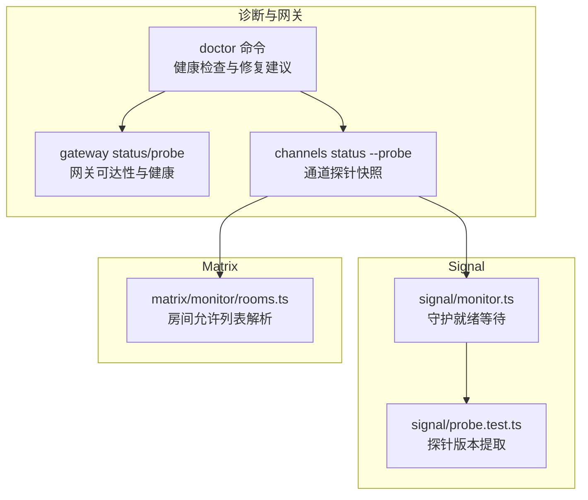
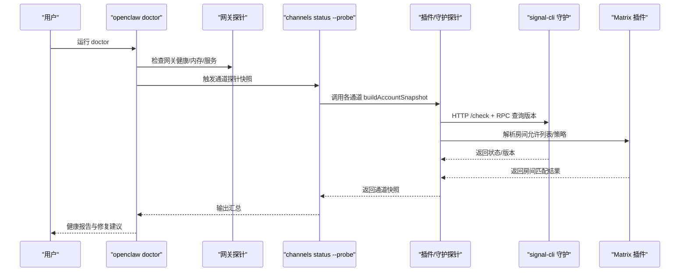
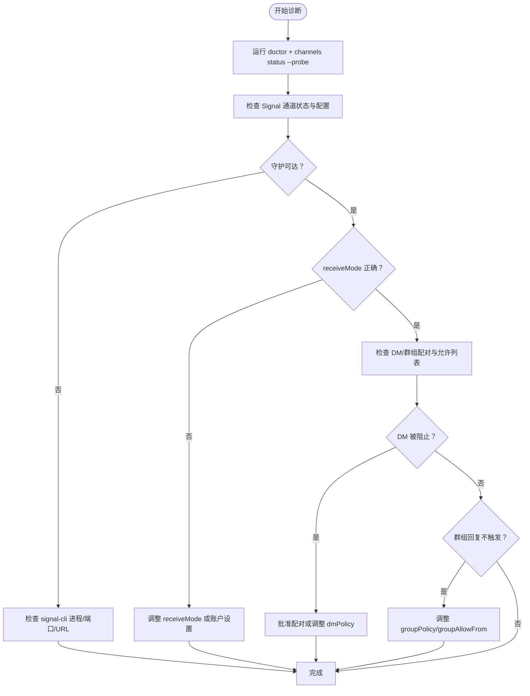
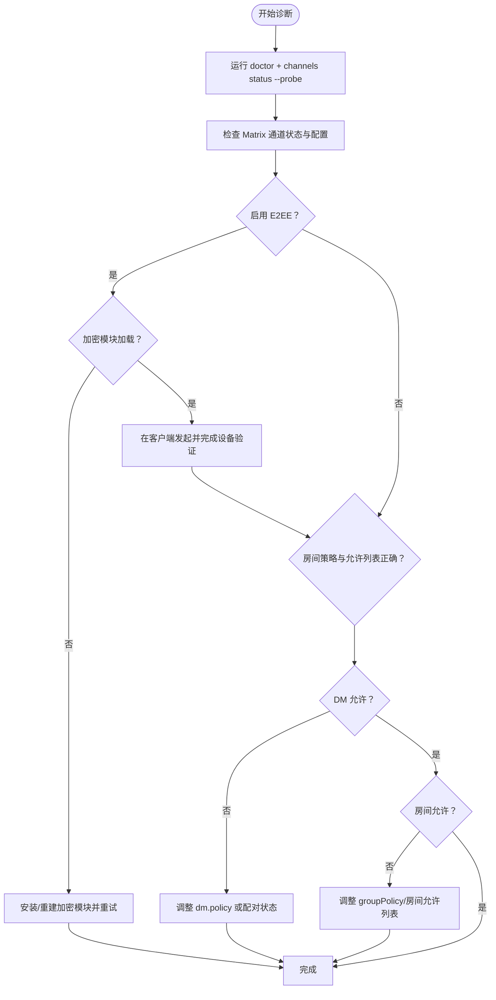
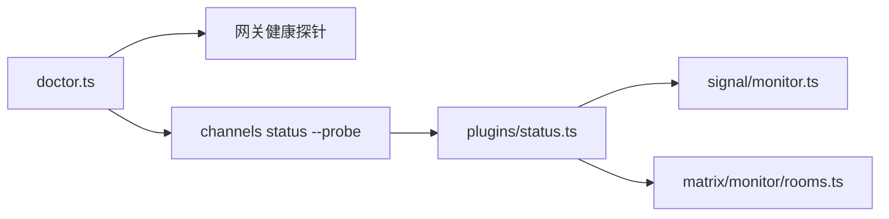

# 其他渠道问题

<cite>
**本文引用的文件**
- [docs/channels/troubleshooting.md](file://docs/channels/troubleshooting.md)
- [docs/channels/signal.md](file://docs/channels/signal.md)
- [docs/channels/matrix.md](file://docs/channels/matrix.md)
- [src/signal/monitor.ts](file://src/signal/monitor.ts)
- [src/signal/probe.test.ts](file://src/signal/probe.test.ts)
- [extensions/matrix/src/matrix/monitor/rooms.ts](file://extensions/matrix/src/matrix/monitor/rooms.ts)
- [extensions/matrix/src/matrix/monitor/rooms.test.ts](file://extensions/matrix/src/matrix/monitor/rooms.test.ts)
- [src/commands/doctor.ts](file://src/commands/doctor.ts)
- [src/channels/plugins/status.ts](file://src/channels/plugins/status.ts)
- [src/cli/gateway-cli/register.ts](file://src/cli/gateway-cli/register.ts)
- [src/commands/status.scan.ts](file://src/commands/status.scan.ts)
- [docs/channels/pairing.md](file://docs/channels/pairing.md)
- [src/security/dm-policy-shared.ts](file://src/security/dm-policy-shared.ts)
- [src/security/dm-policy-shared.test.ts](file://src/security/dm-policy-shared.test.ts)
</cite>

## 目录
1. [简介](#简介)
2. [项目结构](#项目结构)
3. [核心组件](#核心组件)
4. [架构总览](#架构总览)
5. [详细组件分析](#详细组件分析)
6. [依赖分析](#依赖分析)
7. [性能考虑](#性能考虑)
8. [故障排除指南](#故障排除指南)
9. [结论](#结论)
10. [附录](#附录)

## 简介
本指南聚焦于除 WhatsApp、Telegram、Discord、Slack 之外的其他渠道（Signal、Matrix 等）常见问题的系统化诊断与修复流程。内容覆盖：
- Signal 守护进程可达但机器人静默、DM 被阻止、群组回复不触发等问题的定位方法
- Matrix 加密房间失败、加密模块验证与加密设置配置
- 通用渠道健康检查清单、网络连接测试与权限验证方法

## 项目结构
OpenClaw 通过“网关 + 插件/外部守护”的方式接入多渠道。Signal 通过 signal-cli 外部守护通信，Matrix 作为插件独立安装与运行。诊断工具链包括 doctor、channels status --probe、gateway 探针等。

图表来源
- [src/commands/doctor.ts](file://src/commands/doctor.ts#L72-L364)
- [src/channels/plugins/status.ts](file://src/channels/plugins/status.ts#L1-L90)
- [src/signal/monitor.ts](file://src/signal/monitor.ts#L205-L232)
- [src/signal/probe.test.ts](file://src/signal/probe.test.ts#L1-L46)
- [extensions/matrix/src/matrix/monitor/rooms.ts](file://extensions/matrix/src/matrix/monitor/rooms.ts#L1-L47)

章节来源
- [src/commands/doctor.ts](file://src/commands/doctor.ts#L72-L364)
- [src/channels/plugins/status.ts](file://src/channels/plugins/status.ts#L1-L90)

## 核心组件
- doctor 命令：集中执行健康检查、修复建议、配置校验与环境扫描，输出可操作的诊断结论与修复路径。
- channels status --probe：对已安装的通道（含 Matrix 插件、Signal 外部守护）生成只读快照，包含 enabled/configured 状态与关键字段投影。
- Signal 探测与守护就绪：基于 HTTP /check 与 RPC 版本查询，确保 signal-cli 守护可用且版本兼容。
- Matrix 房间允许列表解析：根据房间 ID、别名与通配符匹配策略，判定是否允许进入群组会话。

章节来源
- [src/commands/doctor.ts](file://src/commands/doctor.ts#L72-L364)
- [src/channels/plugins/status.ts](file://src/channels/plugins/status.ts#L1-L90)
- [src/signal/monitor.ts](file://src/signal/monitor.ts#L205-L232)
- [src/signal/probe.test.ts](file://src/signal/probe.test.ts#L1-L46)
- [extensions/matrix/src/matrix/monitor/rooms.ts](file://extensions/matrix/src/matrix/monitor/rooms.ts#L1-L47)

## 架构总览
下图展示从诊断命令到通道探针、再到具体实现模块的调用关系与数据流。

图表来源
- [src/commands/doctor.ts](file://src/commands/doctor.ts#L310-L329)
- [src/channels/plugins/status.ts](file://src/channels/plugins/status.ts#L68-L89)
- [src/signal/monitor.ts](file://src/signal/monitor.ts#L205-L232)
- [src/signal/probe.test.ts](file://src/signal/probe.test.ts#L18-L31)
- [extensions/matrix/src/matrix/monitor/rooms.ts](file://extensions/matrix/src/matrix/monitor/rooms.ts#L12-L46)

## 详细组件分析

### Signal 故障排除与诊断
- 关键症状与快速检查
  - 守护可达但机器人静默：确认 account/httpUrl、receiveMode、daemon 是否正常监听
  - DM 被阻止：检查 pairing 列表与 dmPolicy
  - 群组回复不触发：核对 groupPolicy 与 groupAllowFrom
- 诊断要点
  - 使用 doctor 与 channels status --probe 快速定位通道状态
  - 通过 signal/monitor.ts 的守护就绪等待逻辑，结合 HTTP /check 与 RPC 版本查询，验证 signal-cli 可用性
  - 若采用外部守护模式，需确保 httpUrl 正确且未被 autoStart 干扰

图表来源
- [docs/channels/troubleshooting.md](file://docs/channels/troubleshooting.md#L95-L105)
- [docs/channels/signal.md](file://docs/channels/signal.md#L251-L285)
- [src/signal/monitor.ts](file://src/signal/monitor.ts#L205-L232)
- [src/signal/probe.test.ts](file://src/signal/probe.test.ts#L18-L31)

章节来源
- [docs/channels/troubleshooting.md](file://docs/channels/troubleshooting.md#L95-L105)
- [docs/channels/signal.md](file://docs/channels/signal.md#L251-L285)
- [src/signal/monitor.ts](file://src/signal/monitor.ts#L205-L232)
- [src/signal/probe.test.ts](file://src/signal/probe.test.ts#L1-L46)

### Matrix 加密房间与配置
- 常见症状
  - 登录后忽略房间消息：检查 groupPolicy 与房间允许列表
  - DM 不处理：检查 dm.policy 与配对状态
  - 加密房间失败：确认加密模块加载与设备验证流程
- 诊断要点
  - doctor 与 channels status --probe 提供通道快照
  - Matrix 插件通过 rooms.ts 的解析函数判断房间是否允许，支持直接 ID/别名与通配符匹配
  - E2EE 需要加密模块加载成功，并在客户端完成设备验证

图表来源
- [docs/channels/troubleshooting.md](file://docs/channels/troubleshooting.md#L107-L117)
- [docs/channels/matrix.md](file://docs/channels/matrix.md#L248-L272)
- [extensions/matrix/src/matrix/monitor/rooms.ts](file://extensions/matrix/src/matrix/monitor/rooms.ts#L12-L46)
- [extensions/matrix/src/matrix/monitor/rooms.test.ts](file://extensions/matrix/src/matrix/monitor/rooms.test.ts#L5-L38)

章节来源
- [docs/channels/troubleshooting.md](file://docs/channels/troubleshooting.md#L107-L117)
- [docs/channels/matrix.md](file://docs/channels/matrix.md#L248-L272)
- [extensions/matrix/src/matrix/monitor/rooms.ts](file://extensions/matrix/src/matrix/monitor/rooms.ts#L1-L47)
- [extensions/matrix/src/matrix/monitor/rooms.test.ts](file://extensions/matrix/src/matrix/monitor/rooms.test.ts#L1-L39)

## 依赖分析
- doctor 命令依赖网关健康探针与通道快照构建器，用于统一输出健康报告与修复建议
- channels status --probe 通过插件接口构建只读快照，避免写入副作用
- Signal 依赖 signal-cli 守护进程与 HTTP/RPC 协议
- Matrix 依赖插件安装与加密模块（可选）

图表来源
- [src/commands/doctor.ts](file://src/commands/doctor.ts#L310-L329)
- [src/channels/plugins/status.ts](file://src/channels/plugins/status.ts#L68-L89)
- [src/signal/monitor.ts](file://src/signal/monitor.ts#L205-L232)
- [extensions/matrix/src/matrix/monitor/rooms.ts](file://extensions/matrix/src/matrix/monitor/rooms.ts#L1-L47)

章节来源
- [src/commands/doctor.ts](file://src/commands/doctor.ts#L310-L329)
- [src/channels/plugins/status.ts](file://src/channels/plugins/status.ts#L1-L90)

## 性能考虑
- 通道探针应避免阻塞，优先使用轻量级 HTTP /check 与版本查询
- 对慢启动场景（如 signal-cli JVM 冷启动），可通过外部守护模式减少启动延迟
- 对于 Matrix，合理设置初始同步限制与线程回复策略，降低内存与带宽压力

## 故障排除指南

### 通用渠道健康检查清单
- 运行 doctor 与 channels status --probe，确认通道 enabled/configured 状态
- 检查网关连通性与鉴权参数（token/password）
- 核对各通道的 DM/群组策略与允许列表
- 验证外部守护（Signal）或插件（Matrix）是否正确安装与加载

章节来源
- [docs/channels/troubleshooting.md](file://docs/channels/troubleshooting.md#L13-L30)
- [src/commands/doctor.ts](file://src/commands/doctor.ts#L310-L329)
- [src/channels/plugins/status.ts](file://src/channels/plugins/status.ts#L1-L90)

### Signal 专项诊断
- 守护可达但机器人静默
  - 检查 account/httpUrl、receiveMode 与 daemon 监听状态
  - 使用 doctor 与 channels status --probe 确认通道状态
- DM 被阻止
  - 查看 pairing 列表，批准未知发送方或调整 dmPolicy
- 群组回复不触发
  - 核对 groupPolicy 与 groupAllowFrom，必要时放宽策略

章节来源
- [docs/channels/troubleshooting.md](file://docs/channels/troubleshooting.md#L95-L105)
- [docs/channels/signal.md](file://docs/channels/signal.md#L251-L285)
- [src/signal/monitor.ts](file://src/signal/monitor.ts#L205-L232)

### Matrix 专项诊断
- 登录后忽略房间消息
  - 检查 groupPolicy 与房间允许列表（支持直接 ID/别名与通配符）
- DM 不处理
  - 检查 dm.policy 与配对状态
- 加密房间失败
  - 确认加密模块加载成功，并在客户端完成设备验证
  - 如缺失模块，按文档指引安装/重建并重试

章节来源
- [docs/channels/troubleshooting.md](file://docs/channels/troubleshooting.md#L107-L117)
- [docs/channels/matrix.md](file://docs/channels/matrix.md#L248-L272)
- [extensions/matrix/src/matrix/monitor/rooms.ts](file://extensions/matrix/src/matrix/monitor/rooms.ts#L12-L46)

### 权限与配对验证
- DM 策略与允许列表
  - 支持 open/allowlist/pairing/disabled 等策略，未知发送方在 pairing 模式下需批准
- 配对流程
  - 使用 pairing list 与 pairing approve 命令管理通道配对
- 多通道一致性
  - 测试用例覆盖了 bluebubbles、imessage、signal、telegram、whatsapp、msteams、matrix、zalo 等通道的 DM/群组访问一致性

章节来源
- [docs/channels/pairing.md](file://docs/channels/pairing.md#L32-L37)
- [src/security/dm-policy-shared.ts](file://src/security/dm-policy-shared.ts#L60-L84)
- [src/security/dm-policy-shared.test.ts](file://src/security/dm-policy-shared.test.ts#L277-L451)

### 网络连接测试与权限验证
- doctor 命令提供网关健康与服务检查，辅助定位网络与鉴权问题
- gateway status/probe 子命令支持显式 URL、SSH 隧道与超时控制，便于远程网关探测

章节来源
- [src/commands/doctor.ts](file://src/commands/doctor.ts#L310-L329)
- [src/cli/gateway-cli/register.ts](file://src/cli/gateway-cli/register.ts#L190-L205)
- [src/commands/status.scan.ts](file://src/commands/status.scan.ts#L74-L107)

## 结论
通过 doctor、channels status --probe 与通道特定诊断手段（Signal 的守护就绪与版本查询、Matrix 的房间允许列表解析与加密模块验证），可系统化地定位其他渠道的常见问题。建议在变更配置后优先运行 doctor 与通道探针，再结合具体症状进行针对性修复。

## 附录
- 信号与矩阵的配置参考与最小示例可参阅各自文档页面
- 若问题仍未解决，建议开启日志跟踪并结合通道探针输出进行深入分析