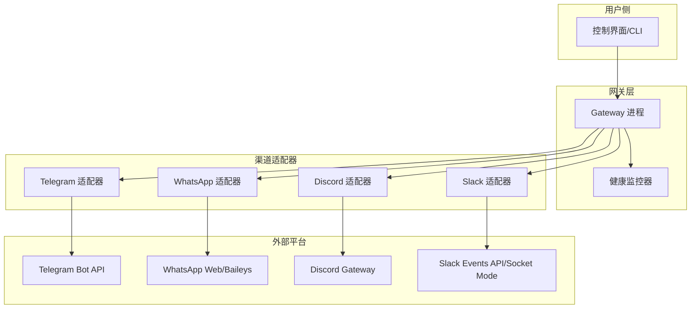
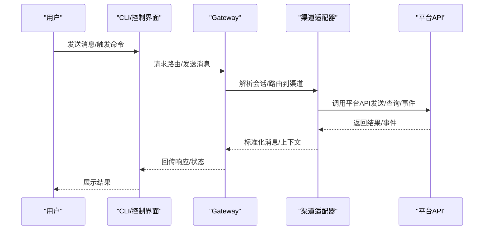
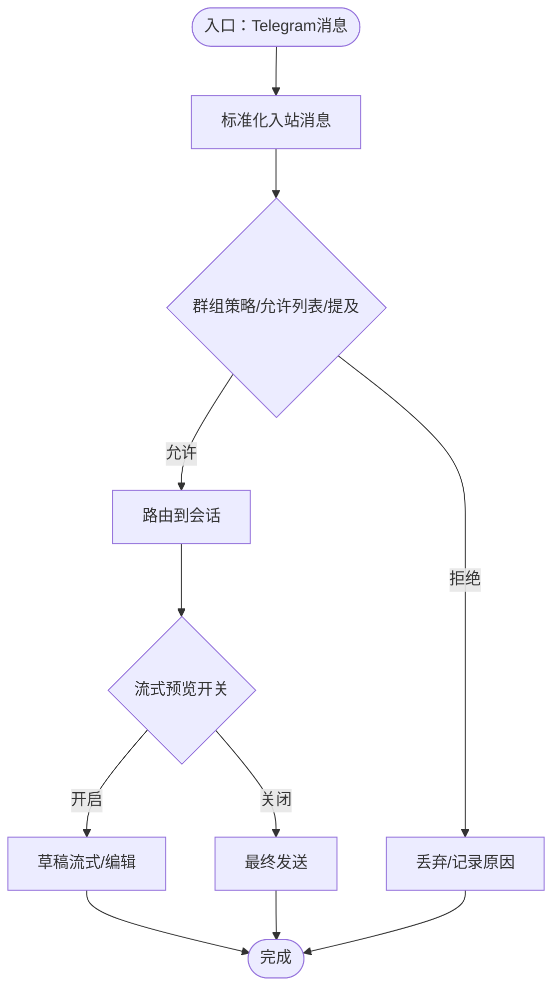
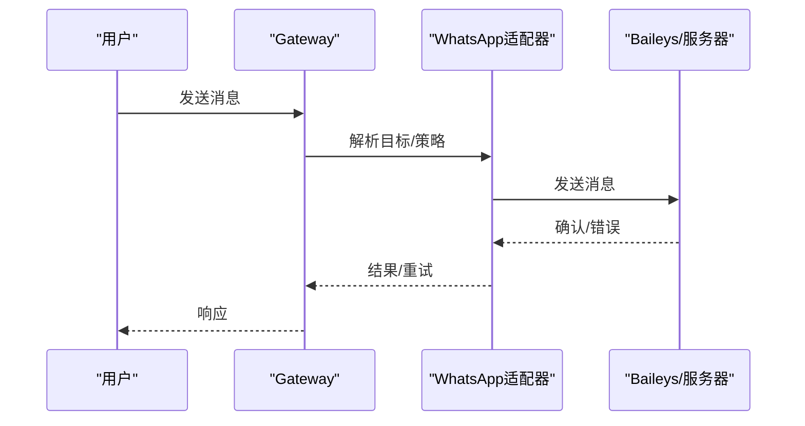
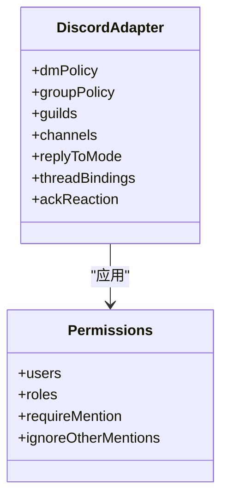
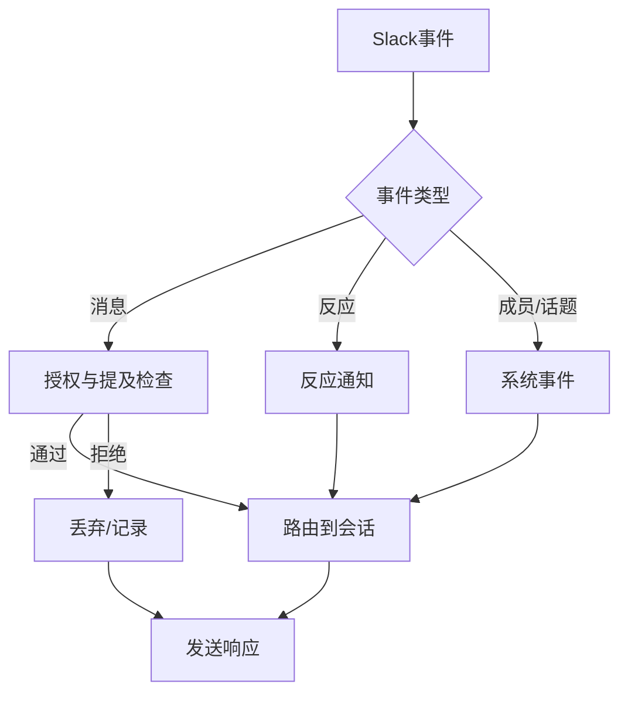
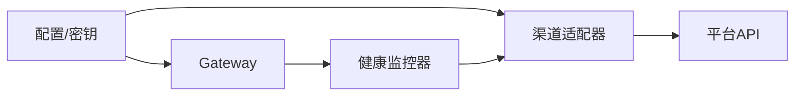

# 渠道集成问题

<cite>
**本文引用的文件**
- [docs/channels/troubleshooting.md](file://docs/channels/troubleshooting.md)
- [docs/gateway/troubleshooting.md](file://docs/gateway/troubleshooting.md)
- [docs/help/troubleshooting.md](file://docs/help/troubleshooting.md)
- [docs/channels/telegram.md](file://docs/channels/telegram.md)
- [docs/channels/whatsapp.md](file://docs/channels/whatsapp.md)
- [docs/channels/discord.md](file://docs/channels/discord.md)
- [docs/channels/slack.md](file://docs/channels/slack.md)
- [docs/gateway/configuration.md](file://docs/gateway/configuration.md)
- [docs/channels/index.md](file://docs/channels/index.md)
- [docs/gateway/health.md](file://docs/gateway/health.md)
- [src/config/telegram-webhook-secret.test.ts](file://src/config/telegram-webhook-secret.test.ts)
- [src/secrets/runtime.test.ts](file://src/secrets/runtime.test.ts)
- [src/secrets/runtime-config-collectors-channels.ts](file://src/secrets/runtime-config-collectors-channels.ts)
- [apps/macos/Sources/OpenClaw/ChannelsStore+Lifecycle.swift](file://apps/macos/Sources/OpenClaw/ChannelsStore+Lifecycle.swift)
- [apps/macos/Sources/OpenClaw/HealthStore.swift](file://apps/macos/Sources/OpenClaw/HealthStore.swift)
- [src/gateway/channel-health-monitor.ts](file://src/gateway/channel-health-monitor.ts)
- [src/gateway/channel-health-monitor.test.ts](file://src/gateway/channel-health-monitor.test.ts)
- [docs/channels/groups.md](file://docs/channels/groups.md)
</cite>

## 目录
1. [简介](#简介)
2. [项目结构](#项目结构)
3. [核心组件](#核心组件)
4. [架构总览](#架构总览)
5. [详细组件分析](#详细组件分析)
6. [依赖关系分析](#依赖关系分析)
7. [性能考量](#性能考量)
8. [故障排除指南](#故障排除指南)
9. [结论](#结论)
10. [附录](#附录)

## 简介
本指南聚焦于OpenClaw在主流即时通讯渠道（Telegram、WhatsApp、Discord、Slack等）中的集成与排障。内容覆盖连接状态、消息路由、权限配置、API权限缺失、Webhook配置错误、消息转发失败、认证问题、速率限制以及消息格式问题的处理策略，并提供渠道健康检查清单与性能优化建议。

## 项目结构
OpenClaw通过“网关（Gateway）+ 渠道适配器（Channel Adapter）+ 控制界面/CLI”的方式实现跨渠道通信。渠道文档集中于docs/channels目录，网关运行时与健康监控位于src/gateway与apps/macos中，配置与安全策略由docs/gateway与src/secrets共同定义。

图示来源
- [docs/channels/index.md](file://docs/channels/index.md#L14-L37)
- [docs/gateway/configuration.md](file://docs/gateway/configuration.md#L77-L103)

章节来源
- [docs/channels/index.md](file://docs/channels/index.md#L14-L37)
- [docs/gateway/configuration.md](file://docs/gateway/configuration.md#L77-L103)

## 核心组件
- 渠道适配器：负责与各平台API交互、消息收发、权限校验、会话路由与线程管理。
- 网关（Gateway）：统一调度、配置热更新、健康监控、会话与工具策略、钩子（Hooks）与自动化。
- 安全与密钥：SecretRef、环境变量注入、Webhook密钥验证与失效提示。
- 健康监控：周期性通道健康检查、重启策略与冷却窗口。
- 文档与CLI：提供快速排障命令、健康检查、诊断流程与配置参考。

章节来源
- [docs/gateway/configuration.md](file://docs/gateway/configuration.md#L61-L73)
- [src/gateway/channel-health-monitor.ts](file://src/gateway/channel-health-monitor.ts#L76-L199)

## 架构总览
下图展示从用户到渠道再到平台API的端到端调用链路与关键决策点（权限、路由、格式化、流式输出）。

图示来源
- [docs/gateway/configuration.md](file://docs/gateway/configuration.md#L77-L103)
- [docs/channels/telegram.md](file://docs/channels/telegram.md#L222-L231)
- [docs/channels/discord.md](file://docs/channels/discord.md#L254-L262)
- [docs/channels/slack.md](file://docs/channels/slack.md#L234-L254)

## 详细组件分析

### Telegram 渠道
- 连接模式：长轮询（默认）或可选Webhook；Webhook需配置URL与密钥。
- 权限与隐私：隐私模式影响群组可见性；提及要求与群组允许列表共同决定回复触发。
- 消息路由：入站消息标准化为共享信封，群组会话按群ID隔离，论坛主题附加topic标识。
- 流式预览：支持草稿流式与编辑式预览；HTML解析失败自动降级为纯文本。
- 故障排查要点：命令注册失败通常源于到api.telegram.org的DNS/HTTPS可达性；网络不稳定可能与IPv6相关。

图示来源
- [docs/channels/telegram.md](file://docs/channels/telegram.md#L222-L231)
- [docs/channels/telegram.md](file://docs/channels/telegram.md#L267-L276)
- [docs/channels/telegram.md](file://docs/channels/telegram.md#L706-L722)

章节来源
- [docs/channels/telegram.md](file://docs/channels/telegram.md#L10-L11)
- [docs/channels/telegram.md](file://docs/channels/telegram.md#L767-L800)

### WhatsApp 渠道
- 连接模式：基于WhatsApp Web（Baileys），需要二维码登录与凭据存储。
- 权限模型：DM策略（配对/白名单/开放/禁用）；群组策略（开放/允许列表/禁用）与发送者允许列表。
- 会话与历史：群组消息缓冲注入上下文；自聊保护避免自我触发与读取回执。
- 故障排查要点：未链接/断连循环需重新登录；无活动监听导致发送失败需确认账户已链接且网关存在监听。

图示来源
- [docs/channels/whatsapp.md](file://docs/channels/whatsapp.md#L126-L133)
- [docs/channels/whatsapp.md](file://docs/channels/whatsapp.md#L374-L424)

章节来源
- [docs/channels/whatsapp.md](file://docs/channels/whatsapp.md#L8-L11)
- [docs/channels/whatsapp.md](file://docs/channels/whatsapp.md#L374-L424)

### Discord 渠道
- 连接模式：官方网关；支持公有服务器/私有服务器/群组DM。
- 权限模型：DM策略与群组策略；每服务器/频道可配置提及要求与用户/角色允许列表。
- 组件与交互：支持容器块、按钮、选择菜单、模态表单；线程绑定会话以保持上下文。
- 故障排查要点：未授权/403/401通常来自权限/作用域缺失；提及策略导致消息被忽略。

图示来源
- [docs/channels/discord.md](file://docs/channels/discord.md#L368-L460)
- [docs/channels/discord.md](file://docs/channels/discord.md#L641-L686)

章节来源
- [docs/channels/discord.md](file://docs/channels/discord.md#L8-L11)
- [docs/channels/discord.md](file://docs/channels/discord.md#L432-L531)

### Slack 渠道
- 连接模式：Socket Mode（默认）或HTTP事件API；需正确配置令牌与签名密钥。
- 权限模型：DM策略与通道策略；提及要求与用户允许列表；线程与历史限制。
- 事件映射：消息编辑/删除、反应增删、成员加入/离开、话题变更等事件映射为系统事件。
- 故障排查要点：Socket模式未连接检查令牌与启用；HTTP模式检查签名密钥与请求URL一致性。

图示来源
- [docs/channels/slack.md](file://docs/channels/slack.md#L298-L310)
- [docs/channels/slack.md](file://docs/channels/slack.md#L433-L490)

章节来源
- [docs/channels/slack.md](file://docs/channels/slack.md#L8-L11)
- [docs/channels/slack.md](file://docs/channels/slack.md#L433-L490)

## 依赖关系分析
- 渠道间共性：均遵循DM策略、群组策略、提及 gating、会话隔离与线程绑定等通用模型。
- 平台差异：提及检测、组件能力、线程模型、媒体处理、流式输出策略存在差异。
- 配置与密钥：SecretRef用于敏感字段（如Webhook密钥、令牌），环境变量与配置文件优先级明确。
- 健康监控：统一的通道健康检查器按周期扫描运行快照，触发重启与冷却控制。

图示来源
- [src/secrets/runtime-config-collectors-channels.ts](file://src/secrets/runtime-config-collectors-channels.ts#L202-L240)
- [src/gateway/channel-health-monitor.ts](file://src/gateway/channel-health-monitor.ts#L76-L199)

章节来源
- [docs/gateway/configuration.md](file://docs/gateway/configuration.md#L501-L536)
- [src/secrets/runtime.test.ts](file://src/secrets/runtime.test.ts#L1241-L1272)
- [src/config/telegram-webhook-secret.test.ts](file://src/config/telegram-webhook-secret.test.ts#L43-L96)

## 性能考量
- 会话与线程：合理设置线程绑定与历史限制，避免过长上下文带来的延迟与成本。
- 流式输出：根据平台特性选择草稿流式或分块流式，平衡实时性与重复发送风险。
- 并发与限速：关注平台速率限制与内部限流器（如Synology Chat的固定窗口限流器），避免突发流量触发限流。
- 媒体与大小：严格控制媒体尺寸与分片，减少传输与解析开销。
- 健康监控与重启：通过健康监控器自动重启异常通道，配合冷却窗口防止风暴式重启。

章节来源
- [docs/channels/discord.md](file://docs/channels/discord.md#L574-L617)
- [docs/channels/slack.md](file://docs/channels/slack.md#L492-L518)
- [extensions/synology-chat/src/security.ts](file://extensions/synology-chat/src/security.ts#L89-L124)
- [src/gateway/channel-health-monitor.ts](file://src/gateway/channel-health-monitor.ts#L76-L199)

## 故障排除指南

### 通用排障流程（CLI命令阶梯）
- 健康基线：运行状态、网关状态、日志跟踪、医生诊断、渠道探针。
- 无回复定位：检查配对状态、群组提及策略、通道/群组允许列表。
- 控制界面/远程连接：核对URL、鉴权模式、设备身份挑战与nonce流程。
- 渠道已连接但消息不流动：检查提及策略、配对/允许列表、权限作用域。
- Cron/心跳：检查调度器状态、作业运行历史、静默时段与目标有效性。

章节来源
- [docs/help/troubleshooting.md](file://docs/help/troubleshooting.md#L13-L25)
- [docs/gateway/troubleshooting.md](file://docs/gateway/troubleshooting.md#L14-L24)
- [docs/gateway/troubleshooting.md](file://docs/gateway/troubleshooting.md#L61-L71)
- [docs/gateway/troubleshooting.md](file://docs/gateway/troubleshooting.md#L169-L179)

### Telegram 排障清单
- 常见症状与修复
  - 启动后无可用回复流：检查配对状态与DM策略。
  - 群组保持沉默：检查提及要求与隐私模式；必要时关闭隐私模式或机器人管理员。
  - 发送失败伴随网络错误：检查到api.telegram.org的DNS/IPv6/代理路由。
  - 升级后白名单阻断：运行安全审计与doctor修复，将用户名转换为数字ID。
- Webhook配置：确保webhookUrl与webhookSecret成对配置，且账户级别覆盖正确。
- 命令注册失败：通常因到api.telegram.org的HTTPS/DNS不可达。

章节来源
- [docs/channels/troubleshooting.md](file://docs/channels/troubleshooting.md#L31-L54)
- [docs/channels/telegram.md](file://docs/channels/telegram.md#L767-L800)
- [docs/channels/telegram.md](file://docs/channels/telegram.md#L706-L722)
- [src/config/telegram-webhook-secret.test.ts](file://src/config/telegram-webhook-secret.test.ts#L43-L96)
- [src/secrets/runtime.test.ts](file://src/secrets/runtime.test.ts#L1241-L1272)

### WhatsApp 排障清单
- 常见症状与修复
  - 已连接但无DM回复：检查配对列表与DM策略/允许列表。
  - 群组消息被忽略：检查requireMention与提及模式；确认群组允许列表。
  - 随机断开/重登循环：重新登录并检查凭据目录健康状况。
  - 无活动监听导致发送失败：确认网关运行且账户已链接。
- 速率限制与运行时：Bun与WhatsApp运行时兼容性提示。

章节来源
- [docs/channels/troubleshooting.md](file://docs/channels/troubleshooting.md#L31-L41)
- [docs/channels/whatsapp.md](file://docs/channels/whatsapp.md#L374-L424)

### Discord 排障清单
- 常见症状与修复
  - 机器人在线但公会回复缺失：允许公会/频道并检查消息意图与内容意图。
  - 群组消息被忽略：检查提及策略与requireMention。
  - DM回复缺失：检查配对状态与DM策略。
- 权限与作用域：确保Bot Token具备消息读写、历史读取、嵌入链接、附件、反应等作用域。
- 线程绑定：使用/focus等命令绑定线程到会话，保持上下文连续。

章节来源
- [docs/channels/troubleshooting.md](file://docs/channels/troubleshooting.md#L56-L66)
- [docs/channels/discord.md](file://docs/channels/discord.md#L432-L531)

### Slack 排障清单
- 常见症状与修复
  - Socket模式未连接：核对Bot Token与App Token及Socket Mode启用。
  - HTTP模式未接收事件：核对签名密钥、Webhook路径与请求URL一致性。
  - 公会无回复：检查groupPolicy、通道允许列表、requireMention与用户允许列表。
  - DM消息被忽略：检查dm.enabled与dmPolicy、配对状态。
- 原生/斜杠命令：确认是否启用原生命令模式并已在Slack注册对应命令。

章节来源
- [docs/channels/troubleshooting.md](file://docs/channels/troubleshooting.md#L68-L78)
- [docs/channels/slack.md](file://docs/channels/slack.md#L433-L490)

### 权限与认证问题
- API权限缺失
  - Telegram：命令注册失败常因到api.telegram.org的HTTPS/DNS不可达。
  - Discord：缺少消息读写、历史读取、嵌入链接、附件、反应等作用域。
  - Slack：Socket模式需Bot Token+App Token；HTTP模式需Bot Token+Signing Secret。
- Webhook配置错误
  - Telegram：webhookUrl与webhookSecret必须成对配置；账户级覆盖需显式声明。
  - Slack：HTTP模式需唯一webhookPath且与Event Subscriptions/Interactivity一致。
- 速率限制
  - 平台侧：遵循各平台速率限制与配额。
  - 内部限流：如Synology Chat的固定窗口限流器，按用户维度滑动窗口控制。
- 消息格式问题
  - Telegram：HTML解析失败自动降级为纯文本；启用链接预览开关。
  - Discord/Slack：组件块数量与字段长度限制，注意超限回退策略。

章节来源
- [docs/channels/telegram.md](file://docs/channels/telegram.md#L314-L317)
- [docs/channels/discord.md](file://docs/channels/discord.md#L499-L531)
- [docs/channels/slack.md](file://docs/channels/slack.md#L340-L431)
- [extensions/synology-chat/src/security.ts](file://extensions/synology-chat/src/security.ts#L89-L124)

### 渠道健康检查清单
- 运行状态与探针
  - openclaw status / openclaw status --all / openclaw status --deep
  - openclaw health --json（报告通道探针摘要、会话存储摘要、探针耗时）
- 日志与诊断
  - tail日志并过滤web-heartbeat、web-reconnect、web-auto-reply、web-inbound等关键词。
  - openclaw logs --follow持续观察。
- 凭据与会话
  - 检查凭据文件最近修改时间与会话存储最近收件人。
- 重新登录与重启
  - 当出现状态码409–515或“logged out”时，执行logout再login流程。
  - Gateway不可达时启动服务；通道异常可通过健康监控自动重启。

章节来源
- [docs/gateway/health.md](file://docs/gateway/health.md#L12-L20)
- [docs/gateway/health.md](file://docs/gateway/health.md#L27-L35)
- [apps/macos/Sources/OpenClaw/HealthStore.swift](file://apps/macos/Sources/OpenClaw/HealthStore.swift#L153-L180)
- [src/gateway/channel-health-monitor.ts](file://src/gateway/channel-health-monitor.ts#L76-L199)

### 性能优化建议
- 合理配置会话与线程绑定，避免过长历史上下文。
- 选择合适的流式输出模式，兼顾实时性与重复发送风险。
- 控制媒体尺寸与分片，减少传输与解析开销。
- 使用健康监控器自动重启异常通道，配合冷却窗口防止风暴式重启。
- 在群组场景中，结合提及策略与允许列表，减少无效处理。

章节来源
- [docs/channels/discord.md](file://docs/channels/discord.md#L574-L617)
- [docs/channels/slack.md](file://docs/channels/slack.md#L492-L518)
- [src/gateway/channel-health-monitor.ts](file://src/gateway/channel-health-monitor.ts#L76-L199)

## 结论
通过统一的配置模型、严格的权限与密钥管理、完善的健康监控与排障流程，OpenClaw能够在Telegram、WhatsApp、Discord、Slack等多渠道上稳定运行。遇到问题时，建议先使用CLI命令阶梯进行快速定位，再结合各渠道文档与健康检查清单逐项排查，必要时借助健康监控器自动恢复通道。

## 附录

### 渠道特定命令与操作
- Telegram
  - 配对与DM策略：openclaw pairing list telegram；openclaw pairing approve telegram <CODE>。
  - Webhook配置：channels.telegram.webhookUrl与webhookSecret。
- WhatsApp
  - 登录与状态：openclaw channels login --channel whatsapp；openclaw channels status。
  - 重新登录：openclaw channels logout --channel whatsapp；openclaw channels login。
- Discord
  - 邀请与权限：在开发者门户生成Bot Token与OAuth URL；启用Message Content Intent等。
  - 配对与DM：openclaw pairing list discord；openclaw pairing approve discord <CODE>。
- Slack
  - Socket模式：配置xapp-...与xoxb-...；启用Socket Mode。
  - HTTP模式：配置Signing Secret与Webhook路径；确保Event Subscriptions一致。

章节来源
- [docs/channels/telegram.md](file://docs/channels/telegram.md#L54-L64)
- [docs/channels/whatsapp.md](file://docs/channels/whatsapp.md#L44-L76)
- [docs/channels/discord.md](file://docs/channels/discord.md#L28-L106)
- [docs/channels/slack.md](file://docs/channels/slack.md#L27-L121)