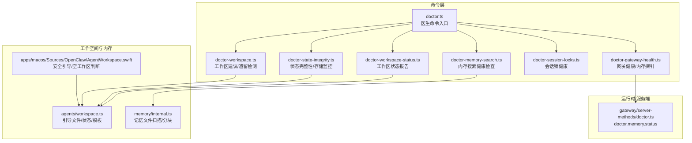
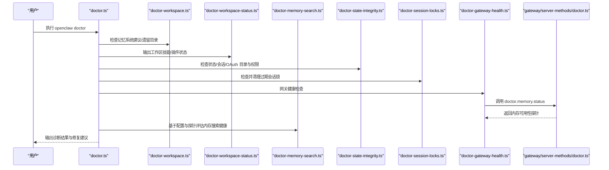
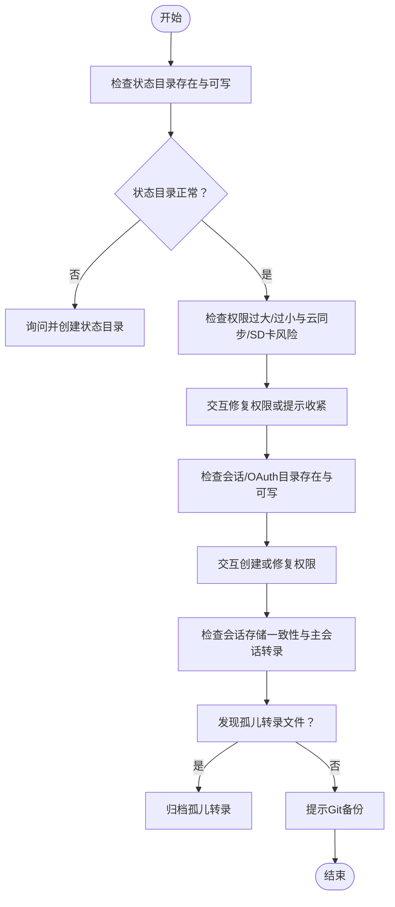
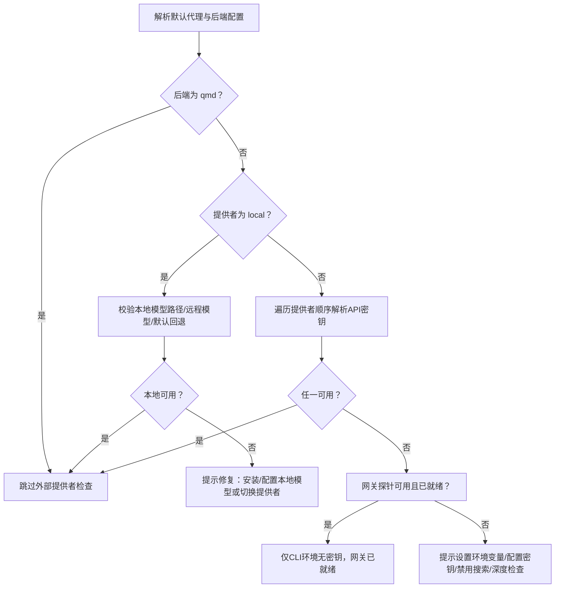
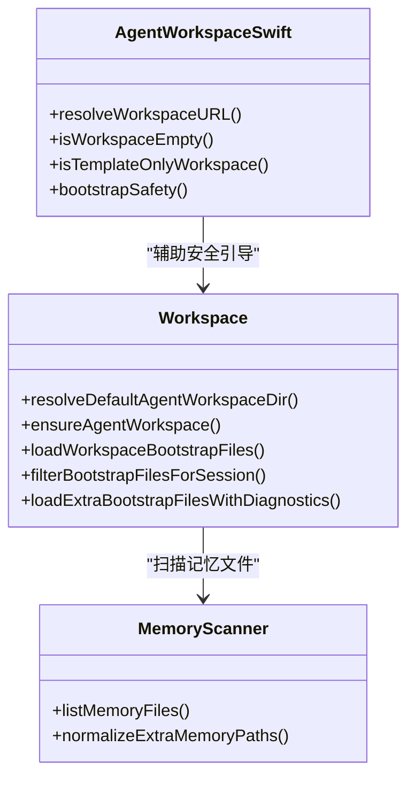
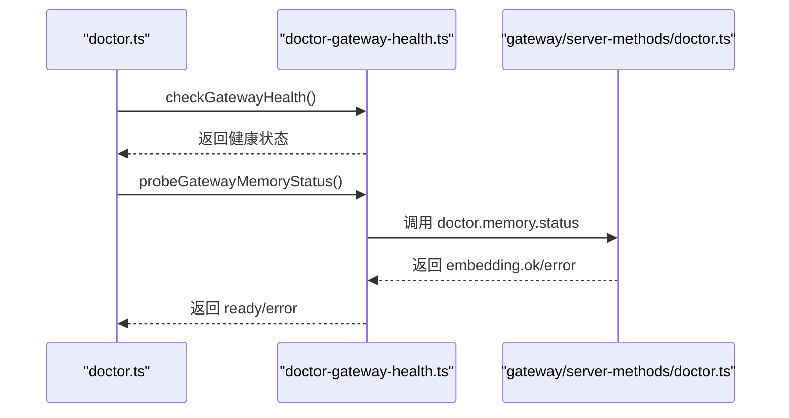
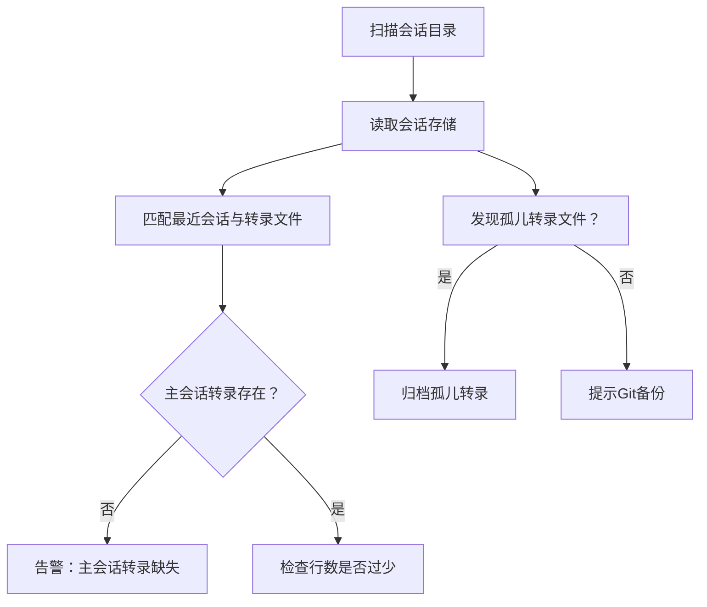
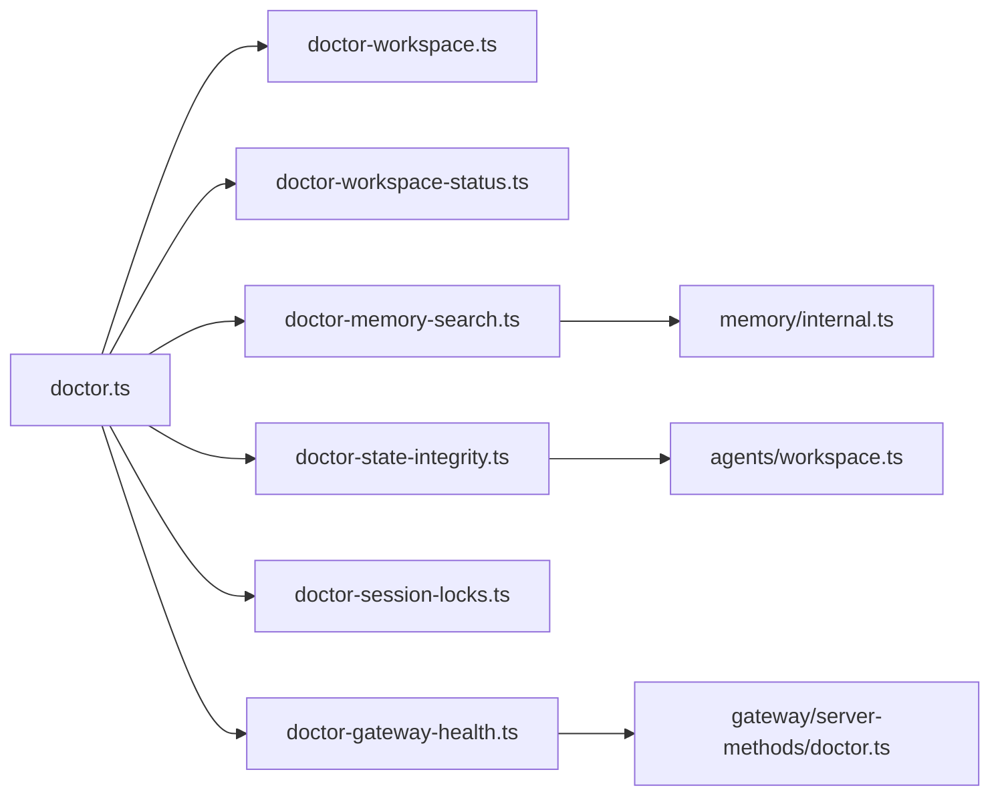

# 工作空间诊断

<cite>
**本文引用的文件**
- [src/commands/doctor.ts](file://src/commands/doctor.ts)
- [src/commands/doctor-workspace.ts](file://src/commands/doctor-workspace.ts)
- [src/commands/doctor-workspace-status.ts](file://src/commands/doctor-workspace-status.ts)
- [src/commands/doctor-memory-search.ts](file://src/commands/doctor-memory-search.ts)
- [src/commands/doctor-state-integrity.ts](file://src/commands/doctor-state-integrity.ts)
- [src/commands/doctor-session-locks.ts](file://src/commands/doctor-session-locks.ts)
- [src/commands/doctor-gateway-health.ts](file://src/commands/doctor-gateway-health.ts)
- [src/gateway/server-methods/doctor.ts](file://src/gateway/server-methods/doctor.ts)
- [src/agents/workspace.ts](file://src/agents/workspace.ts)
- [src/memory/internal.ts](file://src/memory/internal.ts)
- [apps/macos/Sources/OpenClaw/AgentWorkspace.swift](file://apps/macos/Sources/OpenClaw/AgentWorkspace.swift)
- [docs/gateway/doctor.md](file://docs/gateway/doctor.md)
</cite>

## 目录
1. [简介](#简介)
2. [项目结构](#项目结构)
3. [核心组件](#核心组件)
4. [架构总览](#架构总览)
5. [详细组件分析](#详细组件分析)
6. [依赖关系分析](#依赖关系分析)
7. [性能考量](#性能考量)
8. [故障排查指南](#故障排查指南)
9. [结论](#结论)
10. [附录](#附录)

## 简介
本技术文档围绕 OpenClaw 的“工作空间诊断”能力，系统阐述以下关键主题：
- 工作空间状态检查：目录结构、文件存在性、权限与可写性、云同步与 SD 卡风险识别
- 内存搜索功能验证：本地/远程嵌入模型可用性、API 密钥与配置健康度、网关内存探针联动
- 代理工作区完整性检测：引导文件加载、记忆文件扫描、插件与技能状态
- 存储空间监控：会话转录缺失与孤儿文件、主会话历史校验
- 代理运行时状态检查：网关健康探测、通道状态收集、内存可用性探针
- 会话文件完整性验证：会话锁文件健康、过期锁清理、会话存储一致性
- 工作空间备份状态检测：提示 Git 备份、模板与引导文件建议
- 诊断方法、修复策略与性能优化建议：权限收紧、孤儿文件归档、会话增量阈值、并发处理
- 锁定状态检查、文件系统一致性验证、内存使用分析流程

## 项目结构
OpenClaw 的工作空间诊断由命令行子系统驱动，核心入口在 doctor 命令，围绕工作空间、内存、状态、网关等模块进行检查与修复。

**图表来源**
- [src/commands/doctor.ts](file://src/commands/doctor.ts#L72-L364)
- [src/commands/doctor-workspace.ts](file://src/commands/doctor-workspace.ts#L1-L61)
- [src/commands/doctor-workspace-status.ts](file://src/commands/doctor-workspace-status.ts#L1-L69)
- [src/commands/doctor-memory-search.ts](file://src/commands/doctor-memory-search.ts#L1-L234)
- [src/commands/doctor-state-integrity.ts](file://src/commands/doctor-state-integrity.ts#L470-L800)
- [src/commands/doctor-session-locks.ts](file://src/commands/doctor-session-locks.ts#L1-L86)
- [src/commands/doctor-gateway-health.ts](file://src/commands/doctor-gateway-health.ts#L1-L93)
- [src/gateway/server-methods/doctor.ts](file://src/gateway/server-methods/doctor.ts#L1-L62)
- [src/agents/workspace.ts](file://src/agents/workspace.ts#L1-L656)
- [src/memory/internal.ts](file://src/memory/internal.ts#L1-L332)
- [apps/macos/Sources/OpenClaw/AgentWorkspace.swift](file://apps/macos/Sources/OpenClaw/AgentWorkspace.swift#L40-L92)

**章节来源**
- [src/commands/doctor.ts](file://src/commands/doctor.ts#L72-L364)
- [src/commands/doctor-workspace.ts](file://src/commands/doctor-workspace.ts#L1-L61)
- [src/commands/doctor-workspace-status.ts](file://src/commands/doctor-workspace-status.ts#L1-L69)
- [src/commands/doctor-memory-search.ts](file://src/commands/doctor-memory-search.ts#L1-L234)
- [src/commands/doctor-state-integrity.ts](file://src/commands/doctor-state-integrity.ts#L470-L800)
- [src/commands/doctor-session-locks.ts](file://src/commands/doctor-session-locks.ts#L1-L86)
- [src/commands/doctor-gateway-health.ts](file://src/commands/doctor-gateway-health.ts#L1-L93)
- [src/gateway/server-methods/doctor.ts](file://src/gateway/server-methods/doctor.ts#L1-L62)
- [src/agents/workspace.ts](file://src/agents/workspace.ts#L1-L656)
- [src/memory/internal.ts](file://src/memory/internal.ts#L1-L332)
- [apps/macos/Sources/OpenClaw/AgentWorkspace.swift](file://apps/macos/Sources/OpenClaw/AgentWorkspace.swift#L40-L92)

## 核心组件
- 医生命令入口：集中调度各诊断步骤，按需交互式修复，持久化配置变更并输出向导元数据
- 工作区建议与遗留检测：检测是否缺少记忆系统、提示安装；识别遗留工作区目录
- 工作区状态报告：统计技能与插件状态，输出工作区概览
- 内存搜索健康检查：解析默认代理与后端配置，判定本地/远程嵌入可用性，联动网关探针
- 状态完整性与存储监控：检查状态目录、会话目录、OAuth 目录存在性与可写性；识别云同步/SD 卡风险；会话转录缺失与孤儿文件处理
- 会话锁健康：扫描并清理过期锁文件，输出锁状态摘要
- 网关健康与内存探针：执行健康检查，收集通道警告，并通过 doctor.memory.status 探测内存可用性
- 运行时工作区工具：边界读取、缓存、模板加载、引导文件生成、Git 初始化
- 记忆文件扫描：递归扫描 MEMORY.md 与 memory 目录，支持额外路径去重
- macOS 安全引导：判断空/模板/非空工作区，阻止不安全的引导

**章节来源**
- [src/commands/doctor.ts](file://src/commands/doctor.ts#L72-L364)
- [src/commands/doctor-workspace.ts](file://src/commands/doctor-workspace.ts#L15-L61)
- [src/commands/doctor-workspace-status.ts](file://src/commands/doctor-workspace-status.ts#L8-L69)
- [src/commands/doctor-memory-search.ts](file://src/commands/doctor-memory-search.ts#L17-L234)
- [src/commands/doctor-state-integrity.ts](file://src/commands/doctor-state-integrity.ts#L470-L800)
- [src/commands/doctor-session-locks.ts](file://src/commands/doctor-session-locks.ts#L38-L86)
- [src/commands/doctor-gateway-health.ts](file://src/commands/doctor-gateway-health.ts#L16-L93)
- [src/agents/workspace.ts](file://src/agents/workspace.ts#L12-L459)
- [src/memory/internal.ts](file://src/memory/internal.ts#L80-L146)
- [apps/macos/Sources/OpenClaw/AgentWorkspace.swift](file://apps/macos/Sources/OpenClaw/AgentWorkspace.swift#L73-L92)

## 架构总览
下图展示 doctor 命令到各子系统的调用链路与数据流。

**图表来源**
- [src/commands/doctor.ts](file://src/commands/doctor.ts#L72-L364)
- [src/commands/doctor-workspace.ts](file://src/commands/doctor-workspace.ts#L15-L61)
- [src/commands/doctor-workspace-status.ts](file://src/commands/doctor-workspace-status.ts#L8-L69)
- [src/commands/doctor-memory-search.ts](file://src/commands/doctor-memory-search.ts#L17-L234)
- [src/commands/doctor-state-integrity.ts](file://src/commands/doctor-state-integrity.ts#L470-L800)
- [src/commands/doctor-session-locks.ts](file://src/commands/doctor-session-locks.ts#L38-L86)
- [src/commands/doctor-gateway-health.ts](file://src/commands/doctor-gateway-health.ts#L16-L93)
- [src/gateway/server-methods/doctor.ts](file://src/gateway/server-methods/doctor.ts#L17-L62)

## 详细组件分析

### 工作空间状态检查
- 目录结构验证：确保状态目录、会话目录、OAuth 目录存在；若不存在可交互创建；对多状态目录给出分裂会话历史的风险提示
- 权限检查：状态目录与配置文件的可写性、权限过宽/过松、云同步与 SD 卡风险提示
- 文件系统一致性：会话存储一致性、主会话转录缺失与极少量行数告警、孤儿转录文件归档
- 备份提示：未处于 Git 仓库时提示私有仓库备份

**图表来源**
- [src/commands/doctor-state-integrity.ts](file://src/commands/doctor-state-integrity.ts#L470-L800)
- [src/commands/doctor-workspace.ts](file://src/commands/doctor-workspace.ts#L15-L61)

**章节来源**
- [src/commands/doctor-state-integrity.ts](file://src/commands/doctor-state-integrity.ts#L470-L800)
- [src/commands/doctor-workspace.ts](file://src/commands/doctor-workspace.ts#L15-L61)

### 内存搜索功能验证
- 配置解析：默认代理、后端（builtin/qmd）、本地/远程提供者
- 本地模型可用性：显式路径、远程/下载模型、默认回退模型
- 远程提供者可用性：环境变量/API 密钥解析
- 网关探针联动：当 CLI 环境无密钥但网关报告就绪时给出差异说明
- 建议修复：设置环境变量、切换提供者、禁用搜索、深度检查

**图表来源**
- [src/commands/doctor-memory-search.ts](file://src/commands/doctor-memory-search.ts#L17-L234)
- [src/commands/doctor-gateway-health.ts](file://src/commands/doctor-gateway-health.ts#L67-L93)
- [src/gateway/server-methods/doctor.ts](file://src/gateway/server-methods/doctor.ts#L17-L62)

**章节来源**
- [src/commands/doctor-memory-search.ts](file://src/commands/doctor-memory-search.ts#L17-L234)
- [src/commands/doctor-gateway-health.ts](file://src/commands/doctor-gateway-health.ts#L67-L93)
- [src/gateway/server-methods/doctor.ts](file://src/gateway/server-methods/doctor.ts#L17-L62)

### 代理工作区完整性检测
- 引导文件加载：边界安全读取、缓存、去重、最小白名单过滤
- 记忆文件扫描：MEMORY.md/memory.md 与 memory 目录递归扫描，额外路径规范化与去重
- 技能与插件状态：统计可使用/缺失/受限数量，输出错误插件列表
- macOS 安全引导：空/模板/非空工作区的安全性判断

**图表来源**
- [src/agents/workspace.ts](file://src/agents/workspace.ts#L12-L459)
- [src/memory/internal.ts](file://src/memory/internal.ts#L80-L146)
- [apps/macos/Sources/OpenClaw/AgentWorkspace.swift](file://apps/macos/Sources/OpenClaw/AgentWorkspace.swift#L40-L92)

**章节来源**
- [src/agents/workspace.ts](file://src/agents/workspace.ts#L12-L459)
- [src/memory/internal.ts](file://src/memory/internal.ts#L80-L146)
- [apps/macos/Sources/OpenClaw/AgentWorkspace.swift](file://apps/macos/Sources/OpenClaw/AgentWorkspace.swift#L40-L92)

### 代理运行时状态检查
- 网关健康：执行健康检查，收集通道状态问题
- 内存可用性探针：通过 doctor.memory.status 获取嵌入可用性与错误信息

**图表来源**
- [src/commands/doctor.ts](file://src/commands/doctor.ts#L310-L321)
- [src/commands/doctor-gateway-health.ts](file://src/commands/doctor-gateway-health.ts#L16-L93)
- [src/gateway/server-methods/doctor.ts](file://src/gateway/server-methods/doctor.ts#L17-L62)

**章节来源**
- [src/commands/doctor.ts](file://src/commands/doctor.ts#L310-L321)
- [src/commands/doctor-gateway-health.ts](file://src/commands/doctor-gateway-health.ts#L16-L93)
- [src/gateway/server-methods/doctor.ts](file://src/gateway/server-methods/doctor.ts#L17-L62)

### 会话文件完整性验证与工作空间备份状态检测
- 会话锁健康：扫描并清理过期锁文件，输出锁路径、PID、年龄、是否过期与移除状态
- 会话存储一致性：最近会话条目与转录文件匹配，主会话转录行数异常告警
- 孤儿转录文件：未被引用的转录文件归档
- 备份提示：未处于 Git 仓库时提示私有仓库备份

**图表来源**
- [src/commands/doctor-state-integrity.ts](file://src/commands/doctor-state-integrity.ts#L698-L800)
- [src/commands/doctor-session-locks.ts](file://src/commands/doctor-session-locks.ts#L38-L86)
- [src/commands/doctor-workspace.ts](file://src/commands/doctor-workspace.ts#L809-L825)

**章节来源**
- [src/commands/doctor-state-integrity.ts](file://src/commands/doctor-state-integrity.ts#L698-L800)
- [src/commands/doctor-session-locks.ts](file://src/commands/doctor-session-locks.ts#L38-L86)
- [src/commands/doctor-workspace.ts](file://src/commands/doctor-workspace.ts#L809-L825)

## 依赖关系分析
- doctor.ts 作为编排器，依赖各子诊断模块与网关 RPC
- doctor-memory-search.ts 依赖 agents/memory-search.js、memory/backend-config.js、model-auth.js
- doctor-state-integrity.ts 依赖 sessions、paths、channels-status-issues
- doctor-gateway-health.ts 依赖 gateway/call.js 与 gateway/server-methods/doctor.ts
- agents/workspace.ts 提供边界读取、模板加载、引导文件生成
- memory/internal.ts 提供记忆文件扫描与分块工具

**图表来源**
- [src/commands/doctor.ts](file://src/commands/doctor.ts#L62-L364)
- [src/commands/doctor-memory-search.ts](file://src/commands/doctor-memory-search.ts#L1-L234)
- [src/commands/doctor-state-integrity.ts](file://src/commands/doctor-state-integrity.ts#L1-L800)
- [src/commands/doctor-session-locks.ts](file://src/commands/doctor-session-locks.ts#L1-L86)
- [src/commands/doctor-gateway-health.ts](file://src/commands/doctor-gateway-health.ts#L1-L93)
- [src/gateway/server-methods/doctor.ts](file://src/gateway/server-methods/doctor.ts#L1-L62)
- [src/agents/workspace.ts](file://src/agents/workspace.ts#L1-L656)
- [src/memory/internal.ts](file://src/memory/internal.ts#L1-L332)

**章节来源**
- [src/commands/doctor.ts](file://src/commands/doctor.ts#L62-L364)
- [src/commands/doctor-memory-search.ts](file://src/commands/doctor-memory-search.ts#L1-L234)
- [src/commands/doctor-state-integrity.ts](file://src/commands/doctor-state-integrity.ts#L1-L800)
- [src/commands/doctor-session-locks.ts](file://src/commands/doctor-session-locks.ts#L1-L86)
- [src/commands/doctor-gateway-health.ts](file://src/commands/doctor-gateway-health.ts#L1-L93)
- [src/gateway/server-methods/doctor.ts](file://src/gateway/server-methods/doctor.ts#L1-L62)
- [src/agents/workspace.ts](file://src/agents/workspace.ts#L1-L656)
- [src/memory/internal.ts](file://src/memory/internal.ts#L1-L332)

## 性能考量
- 并发控制：记忆文件分块与任务执行采用并发限制，避免高负载
- I/O 优化：边界安全读取与内容缓存，减少重复 IO
- 会话增量阈值：基于字节与消息计数的增量同步，降低频繁写入
- 存储介质风险：云同步与 SD/eMMC 存储可能导致随机 I/O 缓慢与磨损，建议优先本地 SSD/NVMe

**章节来源**
- [src/memory/internal.ts](file://src/memory/internal.ts#L318-L332)
- [src/commands/doctor-state-integrity.ts](file://src/commands/doctor-state-integrity.ts#L470-L508)
- [src/memory/manager-sync-ops.ts](file://src/memory/manager-sync-ops.ts#L474-L515)

## 故障排查指南
- 网关未运行：提示连接细节，建议启动服务
- 权限问题：状态目录/配置文件权限过大或过小，提供收紧/修复建议
- 云同步/SD 卡风险：提示慢速 I/O 与同步竞争风险，建议迁移至本地存储
- 会话锁过期：自动清理或交互确认清理
- 会话转录缺失/孤儿文件：提供预览与归档操作
- 内存搜索不可用：根据提供者类型与网关探针状态给出修复建议

**章节来源**
- [src/commands/doctor-gateway-health.ts](file://src/commands/doctor-gateway-health.ts#L21-L65)
- [src/commands/doctor-state-integrity.ts](file://src/commands/doctor-state-integrity.ts#L535-L611)
- [src/commands/doctor-session-locks.ts](file://src/commands/doctor-session-locks.ts#L38-L86)
- [src/commands/doctor-state-integrity.ts](file://src/commands/doctor-state-integrity.ts#L719-L799)
- [src/commands/doctor-memory-search.ts](file://src/commands/doctor-memory-search.ts#L46-L114)

## 结论
OpenClaw 的工作空间诊断体系以 doctor 命令为核心，覆盖工作区结构、权限、存储、内存搜索、网关健康与会话一致性等关键维度。通过配置解析、网关探针与交互式修复，能够快速定位问题并提供可执行的修复建议，同时兼顾性能与安全性。

## 附录
- 工作空间备份建议与记忆系统提示参见 doctor 文档中的工作区概念与 doctor 步骤说明

**章节来源**
- [docs/gateway/doctor.md](file://docs/gateway/doctor.md#L298-L310)