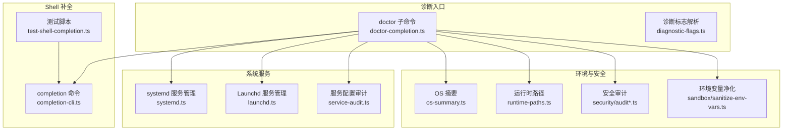
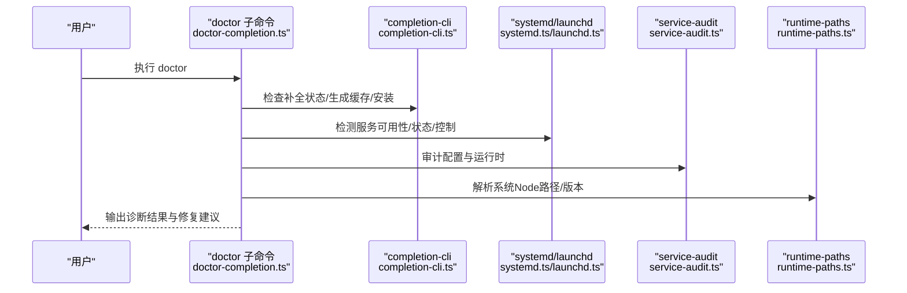
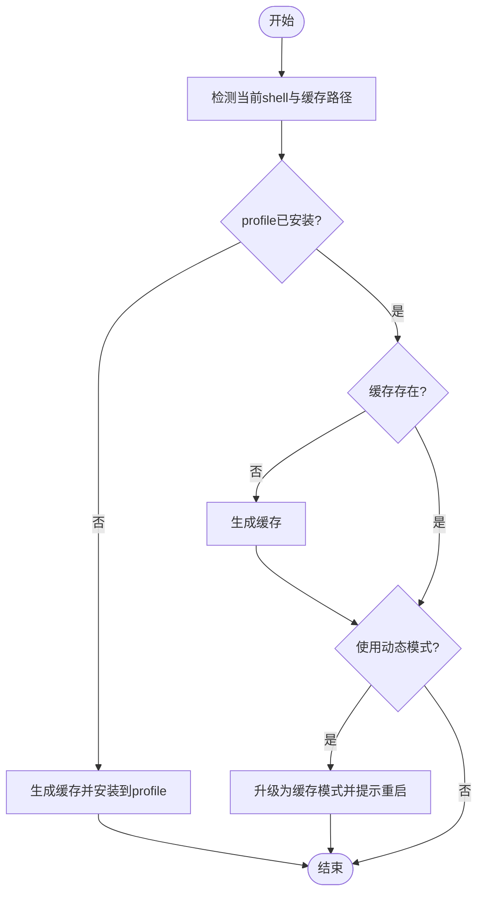
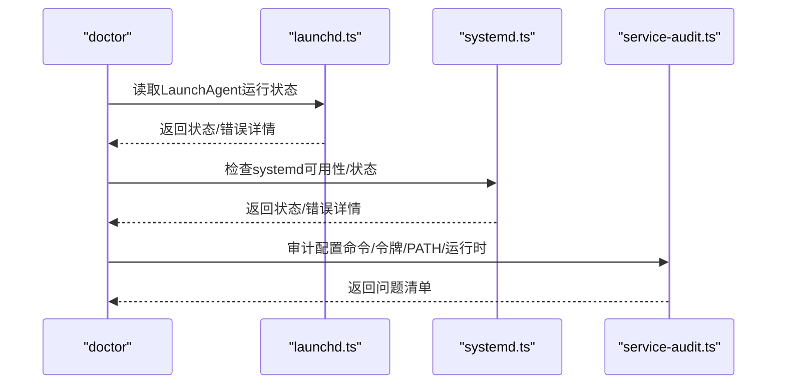
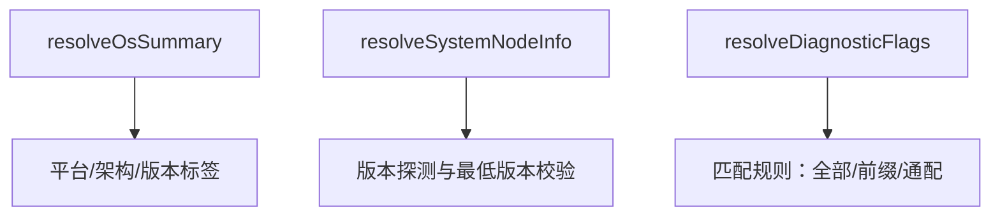
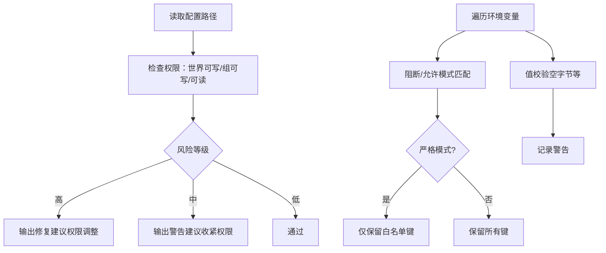
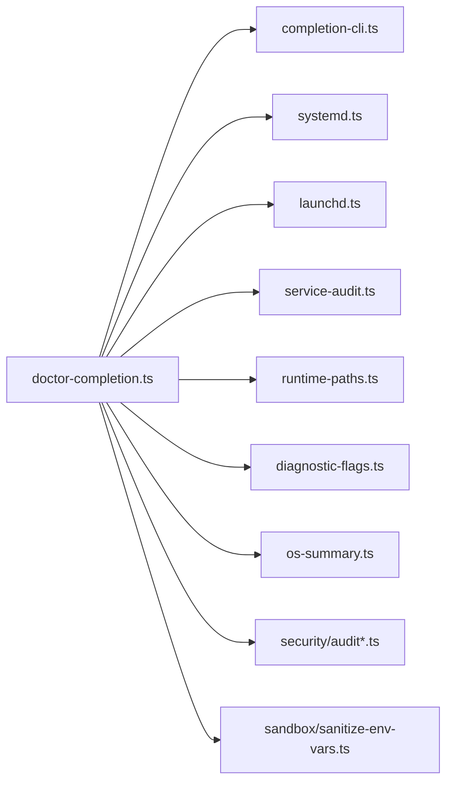

# 平台诊断

<cite>
**本文引用的文件**
- [src/commands/doctor-completion.ts](file://src/commands/doctor-completion.ts)
- [src/cli/completion-cli.ts](file://src/cli/completion-cli.ts)
- [scripts/test-shell-completion.ts](file://scripts/test-shell-completion.ts)
- [src/daemon/systemd.ts](file://src/daemon/systemd.ts)
- [src/daemon/launchd.ts](file://src/daemon/launchd.ts)
- [src/daemon/service-audit.ts](file://src/daemon/service-audit.ts)
- [src/infra/diagnostic-flags.ts](file://src/infra/diagnostic-flags.ts)
- [src/infra/os-summary.ts](file://src/infra/os-summary.ts)
- [src/daemon/runtime-paths.ts](file://src/daemon/runtime-paths.ts)
- [src/cli/daemon-cli/status.print.ts](file://src/cli/daemon-cli/status.print.ts)
- [docs/cli/doctor.md](file://docs/cli/doctor.md)
- [src/security/audit.ts](file://src/security/audit.ts)
- [src/security/audit-extra.async.ts](file://src/security/audit-extra.async.ts)
- [src/agents/sandbox/sanitize-env-vars.ts](file://src/agents/sandbox/sanitize-env-vars.ts)
</cite>

## 目录
1. [简介](#简介)
2. [项目结构](#项目结构)
3. [核心组件](#核心组件)
4. [架构总览](#架构总览)
5. [详细组件分析](#详细组件分析)
6. [依赖关系分析](#依赖关系分析)
7. [性能考量](#性能考量)
8. [故障排查指南](#故障排查指南)
9. [结论](#结论)
10. [附录](#附录)

## 简介
本文件面向OpenClaw平台的“平台诊断”能力，聚焦以下目标：
- 操作系统兼容性检查与摘要
- 安装环境验证（含系统服务可用性）
- Shell补全诊断与自动修复
- 平台特定配置检查（systemd/Launchd）
- 依赖项与运行时路径校验
- 环境变量安全与权限审计
- 系统服务状态诊断流程与修复建议

本指南既适用于开发者自检，也适用于运维人员在多平台部署场景下的健康巡检。

## 项目结构
围绕“平台诊断”的关键模块分布如下：
- 命令行诊断：doctor子命令与相关提示器
- Shell补全：生成、缓存、安装与诊断
- 系统服务：Linux systemd 与 macOS Launchd 的安装、运行状态与配置审计
- 运行时与环境：OS摘要、Node路径解析、诊断标志
- 安全与权限：配置文件权限、环境变量净化与审计

图表来源
- [src/commands/doctor-completion.ts](file://src/commands/doctor-completion.ts#L78-L162)
- [src/cli/completion-cli.ts](file://src/cli/completion-cli.ts#L231-L301)
- [scripts/test-shell-completion.ts](file://scripts/test-shell-completion.ts#L121-L153)
- [src/daemon/systemd.ts](file://src/daemon/systemd.ts#L293-L422)
- [src/daemon/launchd.ts](file://src/daemon/launchd.ts#L372-L443)
- [src/daemon/service-audit.ts](file://src/daemon/service-audit.ts#L384-L405)
- [src/infra/os-summary.ts](file://src/infra/os-summary.ts#L21-L35)
- [src/daemon/runtime-paths.ts](file://src/daemon/runtime-paths.ts#L38-L87)
- [src/security/audit.ts](file://src/security/audit.ts#L276-L337)
- [src/security/audit-extra.async.ts](file://src/security/audit-extra.async.ts#L915-L954)
- [src/agents/sandbox/sanitize-env-vars.ts](file://src/agents/sandbox/sanitize-env-vars.ts#L62-L102)

章节来源
- [src/commands/doctor-completion.ts](file://src/commands/doctor-completion.ts#L1-L180)
- [src/cli/completion-cli.ts](file://src/cli/completion-cli.ts#L1-L666)
- [src/daemon/systemd.ts](file://src/daemon/systemd.ts#L1-L546)
- [src/daemon/launchd.ts](file://src/daemon/launchd.ts#L1-L497)
- [src/daemon/service-audit.ts](file://src/daemon/service-audit.ts#L1-L406)
- [src/infra/diagnostic-flags.ts](file://src/infra/diagnostic-flags.ts#L1-L93)
- [src/infra/os-summary.ts](file://src/infra/os-summary.ts#L1-L35)
- [src/daemon/runtime-paths.ts](file://src/daemon/runtime-paths.ts#L38-L87)
- [src/cli/daemon-cli/status.print.ts](file://src/cli/daemon-cli/status.print.ts#L174-L205)
- [docs/cli/doctor.md](file://docs/cli/doctor.md#L1-L45)
- [src/security/audit.ts](file://src/security/audit.ts#L276-L337)
- [src/security/audit-extra.async.ts](file://src/security/audit-extra.async.ts#L915-L954)
- [src/agents/sandbox/sanitize-env-vars.ts](file://src/agents/sandbox/sanitize-env-vars.ts#L62-L102)

## 核心组件
- Shell补全诊断与修复
  - 通过 doctor 子命令对当前shell的补全状态进行检查，识别是否使用低效的动态模式、缓存是否存在、是否已安装到profile等，并提供自动修复或引导用户手动修复。
  - 补全脚本支持 zsh/bash/fish/powershell；缓存写入到状态目录，profile安装采用幂等更新。
- 系统服务诊断与审计
  - Linux：systemd 用户服务可用性检测、单元文件存在性与网络在线依赖、重启策略、遗留单元清理、运行状态查询与控制。
  - macOS：Launchd LaunchAgent 加载状态、plist存在性、引导与重启流程、遗留Agent清理。
  - 通用审计：命令树完整性、令牌一致性、PATH最小化、运行时选择（Node/Bun）与版本要求。
- 运行时与环境
  - OS摘要：平台、架构、内核/发行版版本标签。
  - Node路径解析：系统Node候选路径、版本探测、最低版本要求。
  - 诊断标志：从配置与环境变量解析启用的诊断子集，支持通配匹配。
- 安全与权限
  - 配置文件与include文件权限审计（可写/可读范围），给出修复建议。
  - 环境变量净化：基于模式的允许/阻断列表，严格模式下仅保留白名单键值，过滤异常值并告警。

章节来源
- [src/commands/doctor-completion.ts](file://src/commands/doctor-completion.ts#L49-L162)
- [src/cli/completion-cli.ts](file://src/cli/completion-cli.ts#L63-L229)
- [src/daemon/systemd.ts](file://src/daemon/systemd.ts#L252-L479)
- [src/daemon/launchd.ts](file://src/daemon/launchd.ts#L149-L218)
- [src/daemon/service-audit.ts](file://src/daemon/service-audit.ts#L384-L405)
- [src/infra/os-summary.ts](file://src/infra/os-summary.ts#L21-L35)
- [src/daemon/runtime-paths.ts](file://src/daemon/runtime-paths.ts#L38-L87)
- [src/infra/diagnostic-flags.ts](file://src/infra/diagnostic-flags.ts#L44-L92)
- [src/security/audit.ts](file://src/security/audit.ts#L276-L337)
- [src/security/audit-extra.async.ts](file://src/security/audit-extra.async.ts#L915-L954)
- [src/agents/sandbox/sanitize-env-vars.ts](file://src/agents/sandbox/sanitize-env-vars.ts#L62-L102)

## 架构总览
OpenClaw平台诊断以“doctor”为中心，串联补全、系统服务、运行时与安全等子系统，形成跨平台的健康检查与修复闭环。

图表来源
- [src/commands/doctor-completion.ts](file://src/commands/doctor-completion.ts#L78-L162)
- [src/cli/completion-cli.ts](file://src/cli/completion-cli.ts#L19-L61)
- [src/daemon/systemd.ts](file://src/daemon/systemd.ts#L252-L479)
- [src/daemon/launchd.ts](file://src/daemon/launchd.ts#L149-L218)
- [src/daemon/service-audit.ts](file://src/daemon/service-audit.ts#L384-L405)
- [src/daemon/runtime-paths.ts](file://src/daemon/runtime-paths.ts#L38-L87)

## 详细组件分析

### 组件A：Shell补全诊断与修复
- 功能要点
  - 识别当前shell类型，定位profile路径与缓存位置
  - 判断是否使用低效的动态模式（如 source <(...)）
  - 检查缓存文件是否存在，必要时自动生成
  - 自动将补全安装到profile，支持交互确认
- 修复流程
  - 若使用动态模式：优先生成缓存，再升级为缓存模式并提示重启shell
  - 若仅有profile无缓存：生成缓存并提示
  - 若未安装：询问后生成缓存并安装
- 测试与验证
  - 提供独立测试脚本，打印shell、平台、profile路径、缓存路径、状态等信息，支持只检查不修改模式

图表来源
- [src/commands/doctor-completion.ts](file://src/commands/doctor-completion.ts#L78-L162)
- [src/cli/completion-cli.ts](file://src/cli/completion-cli.ts#L186-L229)
- [scripts/test-shell-completion.ts](file://scripts/test-shell-completion.ts#L121-L153)

章节来源
- [src/commands/doctor-completion.ts](file://src/commands/doctor-completion.ts#L49-L162)
- [src/cli/completion-cli.ts](file://src/cli/completion-cli.ts#L63-L229)
- [scripts/test-shell-completion.ts](file://scripts/test-shell-completion.ts#L94-L153)

### 组件B：系统服务检查（Linux systemd 与 macOS Launchd）
- Linux systemd
  - 可用性检测：systemctl --user status
  - 单元文件存在性与内容审计：After/Wants网络在线目标、RestartSec策略
  - 运行状态查询：ActiveState/SubState/MainPID/ExecMainStatus/ExecMainCode
  - 控制与安装：enable/restart、daemon-reload、备份旧单元
  - 遗留单元清理：扫描历史名称并禁用/卸载/删除
- macOS Launchd
  - 加载状态与plist存在性检测：launchctl print/list
  - 引导与重启：bootstrap/kickstart，必要时等待进程退出
  - 安装：生成plist、清理遗留Agent、启用并引导
  - 遗留Agent清理：bootout/unload并移动至垃圾桶
- 诊断输出
  - 当systemd不可用时，输出可用性提示与WSL相关建议
  - 对缺失网络在线依赖、非推荐RestartSec等给出建议

图表来源
- [src/daemon/launchd.ts](file://src/daemon/launchd.ts#L175-L218)
- [src/daemon/systemd.ts](file://src/daemon/systemd.ts#L439-L479)
- [src/daemon/service-audit.ts](file://src/daemon/service-audit.ts#L384-L405)
- [src/cli/daemon-cli/status.print.ts](file://src/cli/daemon-cli/status.print.ts#L197-L205)

章节来源
- [src/daemon/launchd.ts](file://src/daemon/launchd.ts#L149-L218)
- [src/daemon/systemd.ts](file://src/daemon/systemd.ts#L252-L479)
- [src/daemon/service-audit.ts](file://src/daemon/service-audit.ts#L122-L171)
- [src/cli/daemon-cli/status.print.ts](file://src/cli/daemon-cli/status.print.ts#L197-L205)

### 组件C：运行时与环境诊断
- OS摘要
  - 采集平台、架构、内核/发行版版本，生成人类可读标签
- Node路径解析
  - 不同平台的系统Node候选路径
  - 版本探测与最低版本要求（例如Node 22+）
- 诊断标志
  - 支持从配置与环境变量解析启用的诊断子集，支持“全部/前缀/通配”匹配

图表来源
- [src/infra/os-summary.ts](file://src/infra/os-summary.ts#L21-L35)
- [src/daemon/runtime-paths.ts](file://src/daemon/runtime-paths.ts#L38-L87)
- [src/infra/diagnostic-flags.ts](file://src/infra/diagnostic-flags.ts#L44-L92)

章节来源
- [src/infra/os-summary.ts](file://src/infra/os-summary.ts#L1-L35)
- [src/daemon/runtime-paths.ts](file://src/daemon/runtime-paths.ts#L38-L87)
- [src/infra/diagnostic-flags.ts](file://src/infra/diagnostic-flags.ts#L1-L93)

### 组件D：安全与权限审计
- 配置文件与include文件权限
  - 检测世界可写/组可写/世界可读/组可读等风险
  - 提供权限修复建议（POSIX模式、平台差异处理）
- 环境变量净化
  - 基于阻断/允许模式的严格筛选
  - 警告或阻断包含空字节等异常值
  - 支持自定义阻断/允许模式扩展

图表来源
- [src/security/audit.ts](file://src/security/audit.ts#L276-L337)
- [src/security/audit-extra.async.ts](file://src/security/audit-extra.async.ts#L915-L954)
- [src/agents/sandbox/sanitize-env-vars.ts](file://src/agents/sandbox/sanitize-env-vars.ts#L62-L102)

章节来源
- [src/security/audit.ts](file://src/security/audit.ts#L276-L337)
- [src/security/audit-extra.async.ts](file://src/security/audit-extra.async.ts#L915-L954)
- [src/agents/sandbox/sanitize-env-vars.ts](file://src/agents/sandbox/sanitize-env-vars.ts#L62-L102)

## 依赖关系分析
- 低耦合高内聚
  - doctor-completion 仅依赖 completion-cli 的状态查询与安装逻辑，避免直接耦合系统服务细节
  - systemd/launchd 与 service-audit 分离，前者负责安装/控制/状态，后者专注配置审计
- 外部依赖
  - Linux：systemd 用户服务接口（systemctl --user）
  - macOS：Launchd 接口（launchctl）与用户GUI域
  - 运行时：Node二进制与版本探测
- 潜在循环依赖
  - 未见直接循环；各模块通过函数调用与类型接口交互

图表来源
- [src/commands/doctor-completion.ts](file://src/commands/doctor-completion.ts#L1-L180)
- [src/cli/completion-cli.ts](file://src/cli/completion-cli.ts#L1-L666)
- [src/daemon/systemd.ts](file://src/daemon/systemd.ts#L1-L546)
- [src/daemon/launchd.ts](file://src/daemon/launchd.ts#L1-L497)
- [src/daemon/service-audit.ts](file://src/daemon/service-audit.ts#L1-L406)
- [src/daemon/runtime-paths.ts](file://src/daemon/runtime-paths.ts#L1-L87)
- [src/infra/diagnostic-flags.ts](file://src/infra/diagnostic-flags.ts#L1-L93)
- [src/infra/os-summary.ts](file://src/infra/os-summary.ts#L1-L35)
- [src/security/audit.ts](file://src/security/audit.ts#L1-L343)
- [src/security/audit-extra.async.ts](file://src/security/audit-extra.async.ts#L1-L954)
- [src/agents/sandbox/sanitize-env-vars.ts](file://src/agents/sandbox/sanitize-env-vars.ts#L1-L110)

章节来源
- [src/commands/doctor-completion.ts](file://src/commands/doctor-completion.ts#L1-L180)
- [src/cli/completion-cli.ts](file://src/cli/completion-cli.ts#L1-L666)
- [src/daemon/systemd.ts](file://src/daemon/systemd.ts#L1-L546)
- [src/daemon/launchd.ts](file://src/daemon/launchd.ts#L1-L497)
- [src/daemon/service-audit.ts](file://src/daemon/service-audit.ts#L1-L406)
- [src/daemon/runtime-paths.ts](file://src/daemon/runtime-paths.ts#L1-L87)
- [src/infra/diagnostic-flags.ts](file://src/infra/diagnostic-flags.ts#L1-L93)
- [src/infra/os-summary.ts](file://src/infra/os-summary.ts#L1-L35)
- [src/security/audit.ts](file://src/security/audit.ts#L1-L343)
- [src/security/audit-extra.async.ts](file://src/security/audit-extra.async.ts#L1-L954)
- [src/agents/sandbox/sanitize-env-vars.ts](file://src/agents/sandbox/sanitize-env-vars.ts#L1-L110)

## 性能考量
- Shell补全
  - 使用缓存替代动态模式，显著降低shell启动时的计算开销
  - 仅在必要时生成缓存，避免重复I/O
- 系统服务
  - systemd/launchd 操作尽量复用已解析的用户作用域参数，减少多次调用失败重试
  - 审计仅读取必要文件，避免深度递归扫描
- 运行时
  - Node版本探测仅在需要时执行，避免不必要的子进程开销
- 权限审计
  - 对路径集合进行批量检查，减少重复系统调用

## 故障排查指南
- Shell补全
  - 症状：动态模式导致启动缓慢
  - 处理：执行 doctor，按提示升级为缓存模式；若缓存缺失，先生成缓存再安装
  - 验证：使用测试脚本查看profile与缓存状态
- Linux systemd
  - 症状：systemd不可用或服务未运行
  - 处理：检查systemctl --user可用性；若不可用，按提示修复；确保单元文件包含网络在线依赖与推荐重启策略
  - 验证：使用 doctor 查询运行状态，必要时重启服务
- macOS Launchd
  - 症状：LaunchAgent未加载或无法重启
  - 处理：确保处于有登录会话的GUI用户上下文；必要时清理遗留Agent并重新引导
  - 验证：检查plist存在性与launchctl打印状态
- 运行时与环境
  - 症状：Node版本过低或使用版本管理器导致升级后失效
  - 处理：安装系统Node 22+；迁移运行时路径；确认PATH最小化
- 安全与权限
  - 症状：配置文件可被他人写入或世界可读
  - 处理：调整权限至0600；对include文件同样收紧；对环境变量进行净化

章节来源
- [src/commands/doctor-completion.ts](file://src/commands/doctor-completion.ts#L78-L162)
- [src/cli/completion-cli.ts](file://src/cli/completion-cli.ts#L186-L229)
- [scripts/test-shell-completion.ts](file://scripts/test-shell-completion.ts#L121-L153)
- [src/daemon/systemd.ts](file://src/daemon/systemd.ts#L252-L479)
- [src/daemon/launchd.ts](file://src/daemon/launchd.ts#L149-L218)
- [src/daemon/service-audit.ts](file://src/daemon/service-audit.ts#L122-L171)
- [src/daemon/runtime-paths.ts](file://src/daemon/runtime-paths.ts#L38-L87)
- [src/security/audit.ts](file://src/security/audit.ts#L276-L337)
- [src/security/audit-extra.async.ts](file://src/security/audit-extra.async.ts#L915-L954)
- [src/agents/sandbox/sanitize-env-vars.ts](file://src/agents/sandbox/sanitize-env-vars.ts#L62-L102)

## 结论
OpenClaw平台诊断体系覆盖了跨平台的健康检查与修复路径：从Shell补全到系统服务，从运行时环境到安全权限，形成闭环。通过doctor子命令统一入口，结合自动化修复与明确的修复建议，能够有效提升部署与运维效率，降低平台差异带来的风险。

## 附录
- 诊断标志使用示例
  - 环境变量：设置 OPENCLAW_DIAGNOSTICS=“all” 或 “category.*”
  - 配置：在配置中提供 diagnostics.flags 数组
- macOS doctor 注意事项
  - launchctl setenv 设置的环境变量可能覆盖配置，需按文档说明清理

章节来源
- [src/infra/diagnostic-flags.ts](file://src/infra/diagnostic-flags.ts#L44-L92)
- [docs/cli/doctor.md](file://docs/cli/doctor.md#L34-L44)