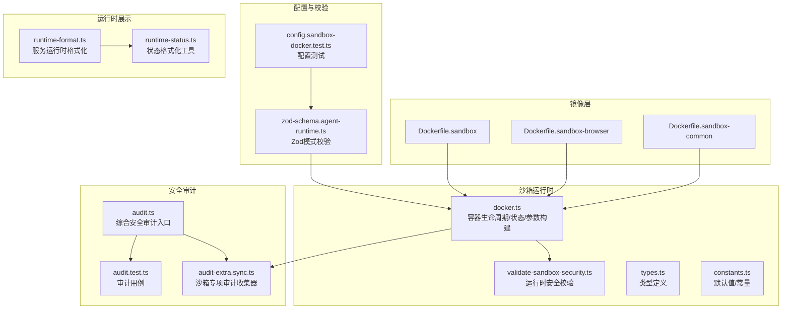
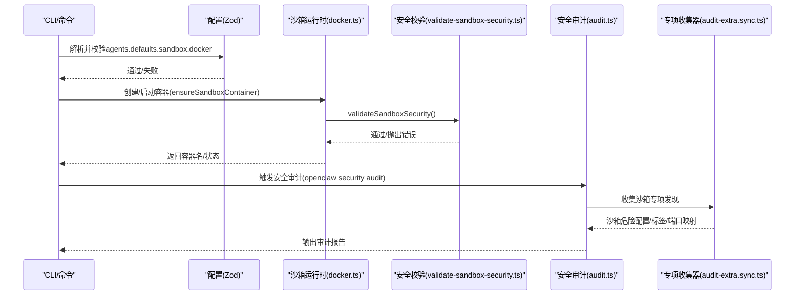
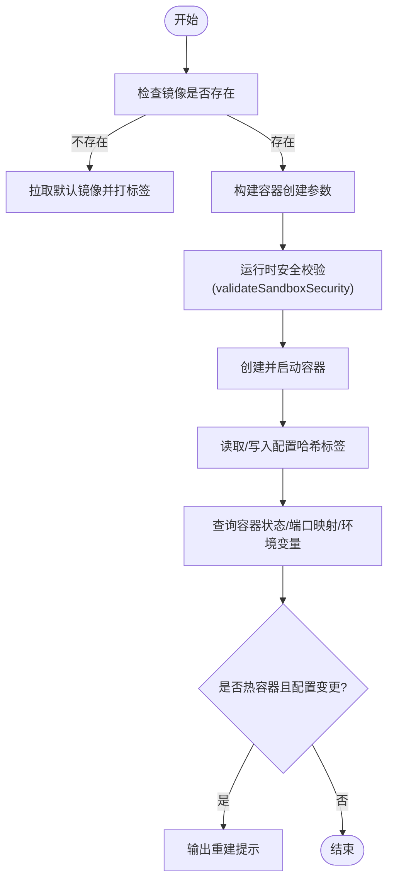
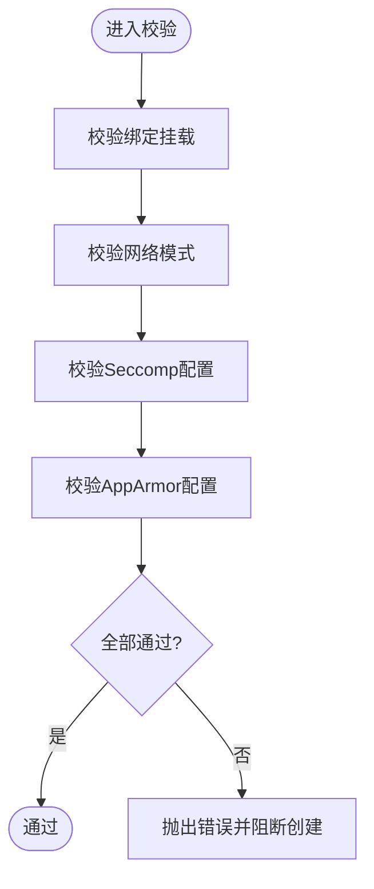
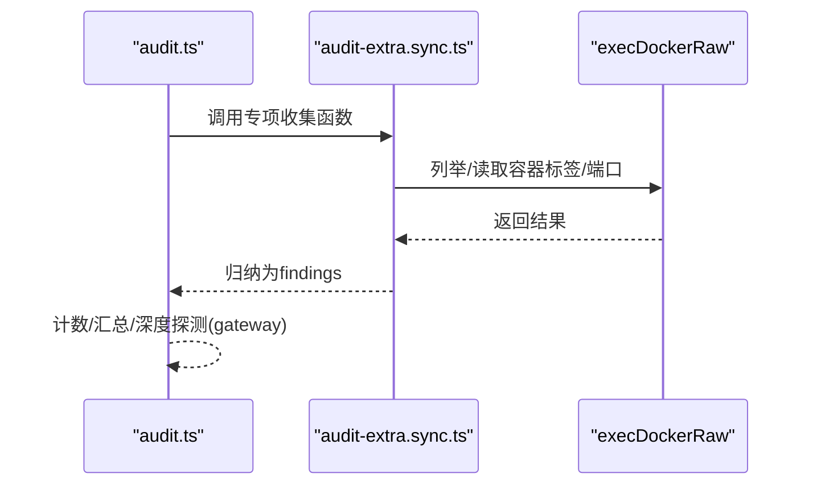
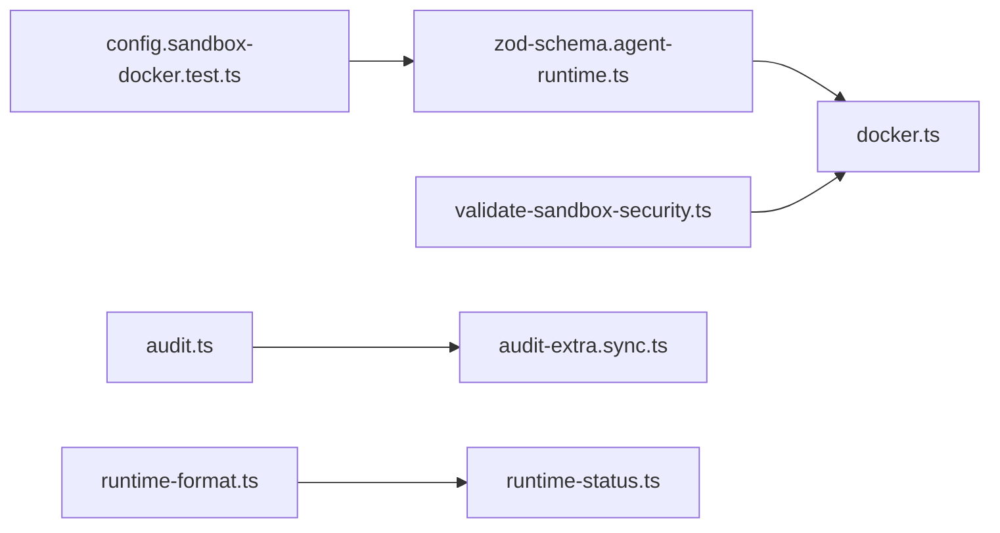

# 沙箱诊断

<cite>
**本文引用的文件**
- [Dockerfile.sandbox](file://Dockerfile.sandbox)
- [Dockerfile.sandbox-browser](file://Dockerfile.sandbox-browser)
- [Dockerfile.sandbox-common](file://Dockerfile.sandbox-common)
- [docker.ts](file://src/agents/sandbox/docker.ts)
- [validate-sandbox-security.ts](file://src/agents/sandbox/validate-sandbox-security.ts)
- [types.ts](file://src/agents/sandbox/types.ts)
- [constants.ts](file://src/agents/sandbox/constants.ts)
- [audit.ts](file://src/security/audit.ts)
- [audit-extra.sync.ts](file://src/security/audit-extra.sync.ts)
- [audit.test.ts](file://src/security/audit.test.ts)
- [config.sandbox-docker.test.ts](file://src/config/config.sandbox-docker.test.ts)
- [zod-schema.agent-runtime.ts](file://src/config/zod-schema.agent-runtime.ts)
- [runtime-format.ts](file://src/daemon/runtime-format.ts)
- [runtime-status.ts](file://src/infra/runtime-status.ts)
- [doctor-sandbox.warns-sandbox-enabled-without-docker.test.ts](file://src/commands/doctor-sandbox.warns-sandbox-enabled-without-docker.test.ts)
</cite>

## 目录
1. [简介](#简介)
2. [项目结构](#项目结构)
3. [核心组件](#核心组件)
4. [架构总览](#架构总览)
5. [详细组件分析](#详细组件分析)
6. [依赖关系分析](#依赖关系分析)
7. [性能考量](#性能考量)
8. [故障排查指南](#故障排查指南)
9. [结论](#结论)
10. [附录](#附录)

## 简介
本文件面向OpenClaw的沙箱诊断能力，系统化阐述沙箱环境检查、安全策略验证、容器运行时状态监控、镜像完整性检查、权限配置验证、资源限制检测、Docker容器状态检查、安全策略执行验证、访问控制列表审核、网络配置检查、文件系统挂载验证以及安全上下文分析等诊断流程，并提供问题定位方法、安全加固建议与性能调优方案。

## 项目结构
围绕沙箱诊断的关键代码分布在以下模块：
- 镜像构建：Dockerfile.sandbox、Dockerfile.sandbox-browser、Dockerfile.sandbox-common
- 运行时与状态：src/agents/sandbox/docker.ts、src/agents/sandbox/validate-sandbox-security.ts、src/agents/sandbox/types.ts、src/agents/sandbox/constants.ts
- 安全审计：src/security/audit.ts、src/security/audit-extra.sync.ts、src/security/audit.test.ts
- 配置校验：src/config/zod-schema.agent-runtime.ts、src/config/config.sandbox-docker.test.ts
- 运行时格式化：src/daemon/runtime-format.ts、src/infra/runtime-status.ts
- 诊断命令辅助：src/commands/doctor-sandbox.warns-sandbox-enabled-without-docker.test.ts

图示来源
- [Dockerfile.sandbox](file://Dockerfile.sandbox#L1-L21)
- [Dockerfile.sandbox-browser](file://Dockerfile.sandbox-browser#L1-L33)
- [Dockerfile.sandbox-common](file://Dockerfile.sandbox-common#L1-L46)
- [docker.ts](file://src/agents/sandbox/docker.ts#L1-L565)
- [validate-sandbox-security.ts](file://src/agents/sandbox/validate-sandbox-security.ts#L1-L344)
- [types.ts](file://src/agents/sandbox/types.ts#L1-L91)
- [constants.ts](file://src/agents/sandbox/constants.ts#L1-L55)
- [audit.ts](file://src/security/audit.ts#L1-L800)
- [audit-extra.sync.ts](file://src/security/audit-extra.sync.ts#L804-L926)
- [audit.test.ts](file://src/security/audit.test.ts#L645-L2849)
- [zod-schema.agent-runtime.ts](file://src/config/zod-schema.agent-runtime.ts#L131-L165)
- [config.sandbox-docker.test.ts](file://src/config/config.sandbox-docker.test.ts#L80-L180)
- [runtime-format.ts](file://src/daemon/runtime-format.ts#L1-L44)
- [runtime-status.ts](file://src/infra/runtime-status.ts#L1-L28)

章节来源
- [Dockerfile.sandbox](file://Dockerfile.sandbox#L1-L21)
- [Dockerfile.sandbox-browser](file://Dockerfile.sandbox-browser#L1-L33)
- [Dockerfile.sandbox-common](file://Dockerfile.sandbox-common#L1-L46)
- [docker.ts](file://src/agents/sandbox/docker.ts#L1-L565)
- [validate-sandbox-security.ts](file://src/agents/sandbox/validate-sandbox-security.ts#L1-L344)
- [types.ts](file://src/agents/sandbox/types.ts#L1-L91)
- [constants.ts](file://src/agents/sandbox/constants.ts#L1-L55)
- [audit.ts](file://src/security/audit.ts#L1-L800)
- [audit-extra.sync.ts](file://src/security/audit-extra.sync.ts#L804-L926)
- [audit.test.ts](file://src/security/audit.test.ts#L645-L2849)
- [zod-schema.agent-runtime.ts](file://src/config/zod-schema.agent-runtime.ts#L131-L165)
- [config.sandbox-docker.test.ts](file://src/config/config.sandbox-docker.test.ts#L80-L180)
- [runtime-format.ts](file://src/daemon/runtime-format.ts#L1-L44)
- [runtime-status.ts](file://src/infra/runtime-status.ts#L1-L28)

## 核心组件
- 沙箱容器运行与状态管理：负责镜像存在性检查、容器创建/启动、标签读取、端口映射查询、配置哈希一致性校验与热容器重建提示。
- 运行时安全校验：对绑定挂载、网络模式、Seccomp/AppArmor配置进行严格校验，阻断高危设置。
- 安全审计：综合文件系统权限、网关暴露面、浏览器控制、沙箱危险配置等维度生成审计报告。
- 配置校验：通过Zod模式在配置阶段拦截不安全的沙箱Docker设置。
- 运行时状态格式化：统一输出服务运行时状态，便于诊断与可视化。

章节来源
- [docker.ts](file://src/agents/sandbox/docker.ts#L180-L565)
- [validate-sandbox-security.ts](file://src/agents/sandbox/validate-sandbox-security.ts#L328-L344)
- [audit.ts](file://src/security/audit.ts#L1-L800)
- [zod-schema.agent-runtime.ts](file://src/config/zod-schema.agent-runtime.ts#L131-L165)

## 架构总览
下图展示了从“配置—运行时—审计”的整体诊断路径，包括镜像准备、容器生命周期、安全策略执行与状态监控。

图示来源
- [docker.ts](file://src/agents/sandbox/docker.ts#L489-L565)
- [validate-sandbox-security.ts](file://src/agents/sandbox/validate-sandbox-security.ts#L328-L344)
- [audit.ts](file://src/security/audit.ts#L1-L800)
- [audit-extra.sync.ts](file://src/security/audit-extra.sync.ts#L804-L926)

## 详细组件分析

### 组件A：沙箱容器运行与状态监控
- 职责
  - 镜像存在性检查与拉取（默认镜像回退）
  - 容器创建参数构建（标签、只读根、tmpfs、网络、用户、环境变量、能力、安全选项、DNS、主机、PID/CPU/内存/ulimit等）
  - 容器状态查询（存在性、运行中）、端口映射解析、环境变量读取
  - 配置哈希一致性校验与热容器重建提示
- 关键流程
  - ensureSandboxContainer：根据作用域生成容器名，计算配置哈希，若哈希不一致且容器最近使用则提示重建，否则删除后重建
  - buildSandboxCreateArgs：在构建参数前先执行validateSandboxSecurity，确保安全基线
  - readDockerContainerLabel/envVar/port：用于状态与安全上下文核查

图示来源
- [docker.ts](file://src/agents/sandbox/docker.ts#L256-L565)
- [validate-sandbox-security.ts](file://src/agents/sandbox/validate-sandbox-security.ts#L328-L344)

章节来源
- [docker.ts](file://src/agents/sandbox/docker.ts#L242-L565)
- [constants.ts](file://src/agents/sandbox/constants.ts#L1-L55)

### 组件B：运行时安全校验
- 职责
  - 绑定挂载：禁止系统关键目录、保留目标路径、非绝对源路径、超出允许根目录
  - 网络模式：默认拒绝host与container:*命名空间加入；支持显式危险覆盖
  - 安全配置：禁止seccomp与apparmor设为unconfined；支持自定义路径或命名配置
- 关键点
  - BLOCKED_HOST_PATHS、RESERVED_CONTAINER_TARGET_PATHS、BLOCKED_SECCOMP_PROFILES、BLOCKED_APPARMOR_PROFILES
  - validateBindMounts/validateNetworkMode/validateSeccompProfile/validateApparmorProfile/validateSandboxSecurity

图示来源
- [validate-sandbox-security.ts](file://src/agents/sandbox/validate-sandbox-security.ts#L16-L344)

章节来源
- [validate-sandbox-security.ts](file://src/agents/sandbox/validate-sandbox-security.ts#L16-L344)

### 组件C：安全审计与专项收集
- 职责
  - 综合文件系统权限、网关暴露面、浏览器控制、沙箱危险配置等
  - 专项收集器：沙箱docker配置模式关闭提示、危险配置（绑定/网络/Seccomp/AppArmor）、浏览器容器哈希标签缺失/过期/非回环发布端口
- 关键点
  - audit.ts入口聚合各收集器
  - audit-extra.sync.ts实现具体收集逻辑
  - audit.test.ts覆盖Windows ACL、浏览器哈希标签等场景

图示来源
- [audit.ts](file://src/security/audit.ts#L1-L800)
- [audit-extra.sync.ts](file://src/security/audit-extra.sync.ts#L804-L926)
- [audit.test.ts](file://src/security/audit.test.ts#L645-L2849)

章节来源
- [audit.ts](file://src/security/audit.ts#L1-L800)
- [audit-extra.sync.ts](file://src/security/audit-extra.sync.ts#L804-L926)
- [audit.test.ts](file://src/security/audit.test.ts#L645-L2849)

### 组件D：配置校验与模式约束
- 职责
  - 在配置阶段通过Zod模式拦截危险Docker设置（如unconfined、非绝对源路径、container:*网络默认拒绝）
  - 单元测试覆盖schema校验与代理覆盖优先级
- 关键点
  - zod-schema.agent-runtime.ts中的superRefine与getBlockedNetworkModeReason配合
  - config.sandbox-docker.test.ts验证行为

章节来源
- [zod-schema.agent-runtime.ts](file://src/config/zod-schema.agent-runtime.ts#L131-L165)
- [config.sandbox-docker.test.ts](file://src/config/config.sandbox-docker.test.ts#L80-L180)

### 组件E：运行时状态格式化
- 职责
  - 将服务运行时状态（状态码、子状态、PID、退出原因、上次运行结果/时间、详情）格式化为可读字符串
- 关键点
  - runtime-format.ts基于runtime-status.ts组合细节字段

章节来源
- [runtime-format.ts](file://src/daemon/runtime-format.ts#L1-L44)
- [runtime-status.ts](file://src/infra/runtime-status.ts#L1-L28)

## 依赖关系分析
- docker.ts依赖validate-sandbox-security.ts进行运行时安全校验
- audit.ts依赖audit-extra.sync.ts进行沙箱专项收集
- 配置阶段由zod-schema.agent-runtime.ts与config.sandbox-docker.test.ts共同保障
- 运行时状态格式化由runtime-format.ts与runtime-status.ts协作

图示来源
- [zod-schema.agent-runtime.ts](file://src/config/zod-schema.agent-runtime.ts#L131-L165)
- [config.sandbox-docker.test.ts](file://src/config/config.sandbox-docker.test.ts#L80-L180)
- [docker.ts](file://src/agents/sandbox/docker.ts#L315-L341)
- [validate-sandbox-security.ts](file://src/agents/sandbox/validate-sandbox-security.ts#L328-L344)
- [audit.ts](file://src/security/audit.ts#L1-L800)
- [audit-extra.sync.ts](file://src/security/audit-extra.sync.ts#L804-L926)
- [runtime-format.ts](file://src/daemon/runtime-format.ts#L1-L44)
- [runtime-status.ts](file://src/infra/runtime-status.ts#L1-L28)

章节来源
- [docker.ts](file://src/agents/sandbox/docker.ts#L315-L341)
- [validate-sandbox-security.ts](file://src/agents/sandbox/validate-sandbox-security.ts#L328-L344)
- [audit.ts](file://src/security/audit.ts#L1-L800)
- [audit-extra.sync.ts](file://src/security/audit-extra.sync.ts#L804-L926)
- [zod-schema.agent-runtime.ts](file://src/config/zod-schema.agent-runtime.ts#L131-L165)
- [config.sandbox-docker.test.ts](file://src/config/config.sandbox-docker.test.ts#L80-L180)
- [runtime-format.ts](file://src/daemon/runtime-format.ts#L1-L44)
- [runtime-status.ts](file://src/infra/runtime-status.ts#L1-L28)

## 性能考量
- 容器热窗口与重建提示：当容器最近被使用但配置变更时，优先提示重建而非强制删除，减少频繁重启带来的开销。
- 资源限制：通过CPU、内存、ulimit、PIDs限制降低单容器对宿主资源的影响。
- 端口映射与网络隔离：避免host网络与容器命名空间加入，减少不必要的网络栈开销与潜在逃逸风险。
- 建议
  - 合理设置sandbox.prune（空闲/最大年龄），定期清理闲置容器
  - 使用tmpfs减少持久化IO
  - 仅在必要时开启浏览器沙箱容器，避免额外进程与端口占用

## 故障排查指南

### 沙箱环境检查
- Docker可用性
  - 当沙箱启用但Docker不可用时，应给出明确警告并指导修复
- 镜像完整性
  - 若默认镜像缺失，自动拉取debian:bookworm-slim并打标签为默认镜像
- 容器状态
  - 查询容器存在性、运行状态、端口映射、环境变量，定位启动/暴露问题

章节来源
- [doctor-sandbox.warns-sandbox-enabled-without-docker.test.ts](file://src/commands/doctor-sandbox.warns-sandbox-enabled-without-docker.test.ts#L54-L108)
- [docker.ts](file://src/agents/sandbox/docker.ts#L256-L277)
- [docker.ts](file://src/agents/sandbox/docker.ts#L226-L240)

### 安全策略验证
- 绑定挂载
  - 禁止系统关键目录、保留目标路径、非绝对源路径、超出允许根目录
- 网络模式
  - 默认拒绝host与container:*命名空间加入；可通过危险覆盖开关放宽
- 安全配置
  - 禁止seccomp与apparmor设为unconfined；推荐自定义配置文件或命名配置

章节来源
- [validate-sandbox-security.ts](file://src/agents/sandbox/validate-sandbox-security.ts#L16-L344)
- [docker.ts](file://src/agents/sandbox/docker.ts#L315-L341)

### 容器运行时状态监控
- 标签与哈希
  - 读取openclaw.configHash标签，若缺失或过期需重建容器
- 端口映射
  - 检查非回环发布的端口，避免对外暴露
- 环境变量
  - 读取容器内环境变量，核对敏感信息未泄露

章节来源
- [docker.ts](file://src/agents/sandbox/docker.ts#L189-L224)
- [audit-extra.sync.ts](file://src/security/audit-extra.sync.ts#L444-L483)

### 沙箱镜像完整性检查
- 默认镜像回退：若默认镜像不存在，自动拉取debian:bookworm-slim并打标签
- 自定义镜像：要求显式构建/拉取后方可使用

章节来源
- [docker.ts](file://src/agents/sandbox/docker.ts#L256-L267)
- [Dockerfile.sandbox](file://Dockerfile.sandbox#L1-L21)

### 权限配置验证
- 文件系统权限
  - 状态目录与配置文件的可写/可读权限检查，Windows ACL支持
- 浏览器控制
  - 无认证时发出严重告警，建议配置网关认证令牌或密码

章节来源
- [audit.ts](file://src/security/audit.ts#L208-L337)
- [audit.test.ts](file://src/security/audit.test.ts#L645-L722)

### 资源限制检测
- CPU/内存/PIDs/ulimit：通过构建参数传入，确保容器资源上限
- tmpfs：减少持久化IO，提升隔离性

章节来源
- [docker.ts](file://src/agents/sandbox/docker.ts#L388-L417)

### Docker容器状态检查
- 存在性与运行态：通过inspect判断
- 端口映射：解析published host与映射端口
- 环境变量：逐行匹配目标变量

章节来源
- [docker.ts](file://src/agents/sandbox/docker.ts#L269-L277)
- [docker.ts](file://src/agents/sandbox/docker.ts#L226-L240)
- [docker.ts](file://src/agents/sandbox/docker.ts#L207-L224)

### 安全策略执行验证
- 运行时校验：创建容器前强制执行validateSandboxSecurity
- 配置阶段校验：Zod模式拦截危险设置

章节来源
- [docker.ts](file://src/agents/sandbox/docker.ts#L315-L341)
- [zod-schema.agent-runtime.ts](file://src/config/zod-schema.agent-runtime.ts#L131-L165)

### 访问控制列表审核
- 工具策略：默认允许/拒绝列表与来源标注，便于审计
- 网关暴露面：bind与auth配置影响暴露面，需结合trusted proxies与origin白名单

章节来源
- [types.ts](file://src/agents/sandbox/types.ts#L6-L27)
- [audit.ts](file://src/security/audit.ts#L339-L687)

### 沙箱网络配置检查
- 网络模式：默认bridge/none，避免host与container:*命名空间加入
- DNS/extraHosts：仅允许受控配置
- 端口发布：避免非回环host发布

章节来源
- [docker.ts](file://src/agents/sandbox/docker.ts#L362-L396)
- [audit-extra.sync.ts](file://src/security/audit-extra.sync.ts#L444-L483)

### 文件系统挂载验证
- 绑定挂载：禁止系统关键目录、保留目标路径、非绝对源路径、超出允许根目录
- 外部源与保留目标：支持危险覆盖开关，但需明确信任边界

章节来源
- [validate-sandbox-security.ts](file://src/agents/sandbox/validate-sandbox-security.ts#L96-L281)

### 安全上下文分析
- 标签与哈希：openclaw.configHash用于识别配置变更
- epoch校验：浏览器沙箱安全哈希epoch，过期需重建
- 端口发布：非回环host发布需关注暴露风险

章节来源
- [docker.ts](file://src/agents/sandbox/docker.ts#L474-L476)
- [audit-extra.sync.ts](file://src/security/audit-extra.sync.ts#L444-L483)

## 结论
OpenClaw的沙箱诊断体系以“配置阶段拦截+运行时强制校验+审计专项收集”三位一体，覆盖镜像完整性、权限与资源限制、网络与挂载安全、容器状态与安全上下文等关键维度。通过严格的默认安全基线与可选的危险覆盖机制，既保证了隔离性，又为高阶用户提供可控的灵活性。建议在生产环境中坚持默认安全策略，定期运行安全审计，及时修补发现项，并结合运行时状态格式化工具进行可视化监控。

## 附录

### 诊断清单
- 镜像：默认镜像存在/可拉取；自定义镜像已构建/拉取
- 容器：存在、运行、端口映射、环境变量、标签与哈希
- 安全：绑定挂载合规、网络模式安全、Seccomp/AppArmor配置
- 权限：状态目录/配置文件权限；Windows ACL
- 网络：DNS/hosts/网络模式；非回环端口发布
- 工具策略：允许/拒绝列表与来源标注
- 运行时：CPU/内存/PIDs/ulimit；tmpfs

### 安全加固建议
- 默认拒绝host与container:*网络模式，除非有明确需求并使用危险覆盖开关
- 禁止seccomp与apparmor设为unconfined，使用自定义配置文件或命名配置
- 严格限制绑定挂载，禁止系统关键目录与保留目标路径
- 仅在必要时启用浏览器沙箱容器，避免对外暴露端口
- 设置合理的资源限制与prune策略，降低资源滥用风险

### 性能调优方案
- 使用tmpfs减少持久化IO
- 合理设置CPU/内存/ulimit/PIDs上限
- 定期清理闲置容器，缩短热容器窗口
- 仅在需要时开启浏览器沙箱，减少额外进程与端口