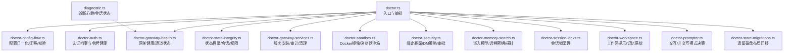
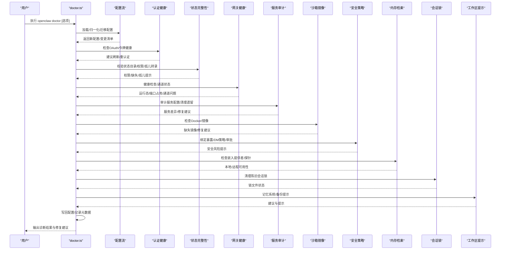
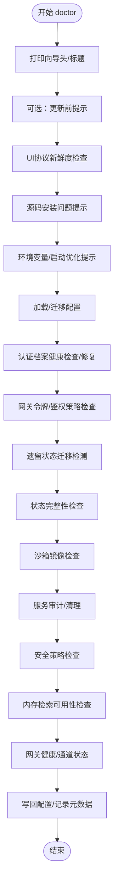
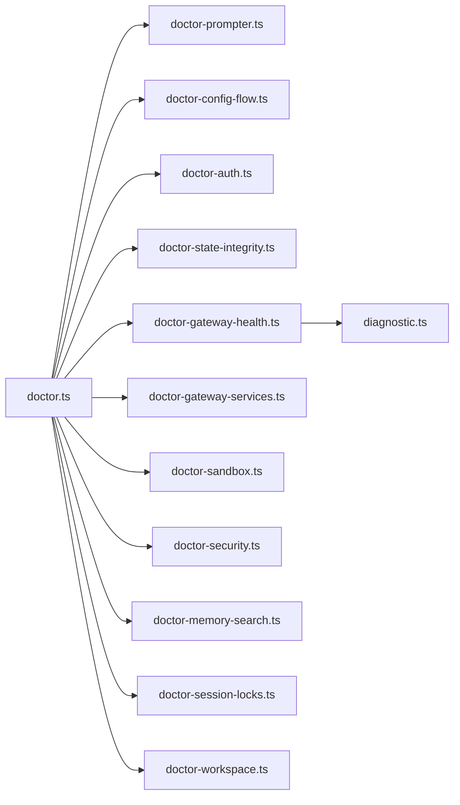

# 系统诊断

<cite>
**本文引用的文件**
- [docs/cli/doctor.md](file://docs/cli/doctor.md)
- [docs/gateway/doctor.md](file://docs/gateway/doctor.md)
- [src/commands/doctor.ts](file://src/commands/doctor.ts)
- [src/commands/doctor-auth.ts](file://src/commands/doctor-auth.ts)
- [src/commands/doctor-config-flow.ts](file://src/commands/doctor-config-flow.ts)
- [src/commands/doctor-state-integrity.ts](file://src/commands/doctor-state-integrity.ts)
- [src/commands/doctor-gateway-health.ts](file://src/commands/doctor-gateway-health.ts)
- [src/commands/doctor-gateway-services.ts](file://src/commands/doctor-gateway-services.ts)
- [src/commands/doctor-sandbox.ts](file://src/commands/doctor-sandbox.ts)
- [src/commands/doctor-security.ts](file://src/commands/doctor-security.ts)
- [src/commands/doctor-memory-search.ts](file://src/commands/doctor-memory-search.ts)
- [src/commands/doctor-session-locks.ts](file://src/commands/doctor-session-locks.ts)
- [src/commands/doctor-prompter.ts](file://src/commands/doctor-prompter.ts)
- [src/commands/doctor-state-migrations.ts](file://src/commands/doctor-state-migrations.ts)
- [src/commands/doctor-workspace.ts](file://src/commands/doctor-workspace.ts)
- [src/logging/diagnostic.ts](file://src/logging/diagnostic.ts)
</cite>

## 目录
1. [简介](#简介)
2. [项目结构](#项目结构)
3. [核心组件](#核心组件)
4. [架构总览](#架构总览)
5. [详细组件分析](#详细组件分析)
6. [依赖关系分析](#依赖关系分析)
7. [性能考量](#性能考量)
8. [故障排查指南](#故障排查指南)
9. [结论](#结论)
10. [附录](#附录)

## 简介
本文件面向OpenClaw系统诊断（doctor）的使用者与维护者，系统化阐述doctor命令的工作原理、诊断流程与输出解读方法；覆盖系统健康检查的关键指标、配置验证规则、权限检查机制、服务状态监控、配置文件完整性检查、依赖项验证与环境兼容性测试；并提供常见诊断场景的判断标准、修复建议、日志分析技巧、错误代码含义以及自动化诊断工具的使用方法。

## 项目结构
doctor命令位于CLI命令体系中，围绕“配置加载与迁移、健康检查、修复提示、写回配置”这一主干流程展开，并通过子模块完成对认证、状态目录、网关服务、沙箱、安全策略、内存检索等领域的专项诊断。

图示来源
- [src/commands/doctor.ts](file://src/commands/doctor.ts#L72-L364)
- [src/commands/doctor-config-flow.ts](file://src/commands/doctor-config-flow.ts#L1-L200)
- [src/commands/doctor-auth.ts](file://src/commands/doctor-auth.ts#L1-L120)
- [src/commands/doctor-state-integrity.ts](file://src/commands/doctor-state-integrity.ts#L470-L800)
- [src/commands/doctor-gateway-health.ts](file://src/commands/doctor-gateway-health.ts#L16-L65)
- [src/commands/doctor-gateway-services.ts](file://src/commands/doctor-gateway-services.ts#L188-L346)
- [src/commands/doctor-sandbox.ts](file://src/commands/doctor-sandbox.ts#L178-L248)
- [src/commands/doctor-security.ts](file://src/commands/doctor-security.ts#L51-L233)
- [src/commands/doctor-memory-search.ts](file://src/commands/doctor-memory-search.ts#L17-L156)
- [src/commands/doctor-session-locks.ts](file://src/commands/doctor-session-locks.ts#L38-L85)
- [src/commands/doctor-workspace.ts](file://src/commands/doctor-workspace.ts#L15-L38)
- [src/commands/doctor-prompter.ts](file://src/commands/doctor-prompter.ts#L26-L114)
- [src/commands/doctor-state-migrations.ts](file://src/commands/doctor-state-migrations.ts#L1-L13)
- [src/logging/diagnostic.ts](file://src/logging/diagnostic.ts#L333-L410)

章节来源
- [src/commands/doctor.ts](file://src/commands/doctor.ts#L72-L364)

## 核心组件
- doctor命令入口：负责打印向导头、按阶段调用各诊断子模块、处理交互与非交互模式、最终写回配置并记录元数据。
- 配置流：加载/归一化/迁移/校验，移除未知键、修正历史字段、生成修复建议。
- 认证健康：扫描OAuth过期/将过期/缺失，必要时刷新或提示重认证。
- 状态完整性：检测状态目录、会话存储、凭证目录存在性与权限，识别孤儿转录文件并可归档。
- 网关健康：探测运行态、端口占用、通道状态问题；可联动重启与守护进程修复。
- 服务审计：对比当前安装计划与服务配置差异，必要时覆盖默认配置或清理遗留服务。
- 沙箱镜像：检测Docker可用性与镜像存在，必要时引导构建或更新配置。
- 安全策略：绑定暴露风险、DM策略、审批策略、心跳直接投递策略等。
- 内存检索：检查本地/远程嵌入提供者可用性，结合网关探针给出修复建议。
- 会话锁：清理陈旧锁文件，避免并发写入阻塞。
- 工作区提示：建议启用记忆系统、备份提示等。

章节来源
- [src/commands/doctor.ts](file://src/commands/doctor.ts#L72-L364)
- [src/commands/doctor-config-flow.ts](file://src/commands/doctor-config-flow.ts#L111-L145)
- [src/commands/doctor-auth.ts](file://src/commands/doctor-auth.ts#L251-L357)
- [src/commands/doctor-state-integrity.ts](file://src/commands/doctor-state-integrity.ts#L470-L800)
- [src/commands/doctor-gateway-health.ts](file://src/commands/doctor-gateway-health.ts#L16-L65)
- [src/commands/doctor-gateway-services.ts](file://src/commands/doctor-gateway-services.ts#L188-L346)
- [src/commands/doctor-sandbox.ts](file://src/commands/doctor-sandbox.ts#L178-L248)
- [src/commands/doctor-security.ts](file://src/commands/doctor-security.ts#L51-L233)
- [src/commands/doctor-memory-search.ts](file://src/commands/doctor-memory-search.ts#L17-L156)
- [src/commands/doctor-session-locks.ts](file://src/commands/doctor-session-locks.ts#L38-L85)
- [src/commands/doctor-workspace.ts](file://src/commands/doctor-workspace.ts#L15-L38)

## 架构总览
doctor命令以“阶段化流水线”组织诊断逻辑，每个阶段独立、可组合，支持交互式确认与非交互式批量修复。

图示来源
- [src/commands/doctor.ts](file://src/commands/doctor.ts#L72-L364)
- [src/commands/doctor-config-flow.ts](file://src/commands/doctor-config-flow.ts#L111-L145)
- [src/commands/doctor-auth.ts](file://src/commands/doctor-auth.ts#L251-L357)
- [src/commands/doctor-state-integrity.ts](file://src/commands/doctor-state-integrity.ts#L470-L800)
- [src/commands/doctor-gateway-health.ts](file://src/commands/doctor-gateway-health.ts#L16-L65)
- [src/commands/doctor-gateway-services.ts](file://src/commands/doctor-gateway-services.ts#L188-L346)
- [src/commands/doctor-sandbox.ts](file://src/commands/doctor-sandbox.ts#L178-L248)
- [src/commands/doctor-security.ts](file://src/commands/doctor-security.ts#L51-L233)
- [src/commands/doctor-memory-search.ts](file://src/commands/doctor-memory-search.ts#L17-L156)
- [src/commands/doctor-session-locks.ts](file://src/commands/doctor-session-locks.ts#L38-L85)
- [src/commands/doctor-workspace.ts](file://src/commands/doctor-workspace.ts#L15-L38)

## 详细组件分析

### doctor命令入口与交互控制
- 负责打印向导头、解析doctor选项、决定交互/非交互行为、按顺序调用各诊断模块、写回配置并记录元数据。
- 交互策略由prompter统一管理，支持yes/非交互/强制修复等模式。

图示来源
- [src/commands/doctor.ts](file://src/commands/doctor.ts#L72-L364)
- [src/commands/doctor-prompter.ts](file://src/commands/doctor-prompter.ts#L26-L114)

章节来源
- [src/commands/doctor.ts](file://src/commands/doctor.ts#L72-L364)
- [src/commands/doctor-prompter.ts](file://src/commands/doctor-prompter.ts#L26-L114)

### 配置归一化与迁移
- 移除未知键，保留有效配置；对历史字段进行归一化与迁移，确保schema一致性。
- 对特定渠道的allowFrom等字段进行修复（如Telegram/ Discord），自动转换类型或解析用户名为ID。
- 提供OpenCode Zen覆盖警告，建议移除覆盖以恢复内置路由与成本计算。

章节来源
- [src/commands/doctor-config-flow.ts](file://src/commands/doctor-config-flow.ts#L111-L145)
- [src/commands/doctor-config-flow.ts](file://src/commands/doctor-config-flow.ts#L461-L604)
- [src/commands/doctor-config-flow.ts](file://src/commands/doctor-config-flow.ts#L718-L762)
- [src/commands/doctor-config-flow.ts](file://src/commands/doctor-config-flow.ts#L147-L182)

### 认证健康与令牌刷新
- 检测OAuth过期/将过期/缺失，必要时刷新令牌；对不可用的外部密钥源给出提示与指引。
- 支持移除已弃用的CLI认证档案，避免历史残留影响。

章节来源
- [src/commands/doctor-auth.ts](file://src/commands/doctor-auth.ts#L21-L45)
- [src/commands/doctor-auth.ts](file://src/commands/doctor-auth.ts#L113-L201)
- [src/commands/doctor-auth.ts](file://src/commands/doctor-auth.ts#L251-L357)

### 状态完整性检查
- 检查状态目录、会话存储、OAuth目录是否存在与可写；对权限过宽/过窄给出收紧/修复建议。
- 检测多份状态目录与云同步路径，提示分裂历史与I/O风险。
- 发现孤儿转录文件并可归档，释放空间并避免误判。

章节来源
- [src/commands/doctor-state-integrity.ts](file://src/commands/doctor-state-integrity.ts#L470-L800)

### 网关健康与通道状态
- 通过健康检查判定网关运行态；若健康则进一步探测通道状态，汇总问题与修复建议。
- 可结合网关内存检索探针，辅助判断嵌入模型可用性。

章节来源
- [src/commands/doctor-gateway-health.ts](file://src/commands/doctor-gateway-health.ts#L16-L65)

### 服务审计与遗留清理
- 审计服务配置与当前安装计划差异，必要时覆盖默认配置或提示强制覆盖。
- 清理遗留的Darwin/Linux用户级服务，减少冲突与资源浪费。
- 检测并提示系统Node运行时迁移需求。

章节来源
- [src/commands/doctor-gateway-services.ts](file://src/commands/doctor-gateway-services.ts#L188-L346)
- [src/commands/doctor-gateway-services.ts](file://src/commands/doctor-gateway-services.ts#L348-L413)

### 沙箱镜像与Docker可用性
- 当启用沙箱时，检查Docker可用性与镜像存在；缺失时提供构建脚本或更新配置建议。
- 对浏览器沙箱镜像进行独立检查与修复。

章节来源
- [src/commands/doctor-sandbox.ts](file://src/commands/doctor-sandbox.ts#L178-L248)

### 安全策略检查
- 绑定暴露风险：当网关对外绑定且未配置共享密钥时，发出高危警告并提供更安全的访问方式。
- DM策略：检查各渠道DM策略与白名单配置，提示“open”但无通配导致的矛盾。
- 心跳直接投递策略：未显式设置时给出升级行为提示，避免默认行为变化带来的影响。

章节来源
- [src/commands/doctor-security.ts](file://src/commands/doctor-security.ts#L51-L233)

### 内存检索可用性检查
- 检查本地/远程嵌入提供者是否可用；结合网关探针输出更准确的诊断信息。
- 提供切换提供者、配置密钥、禁用等功能建议。

章节来源
- [src/commands/doctor-memory-search.ts](file://src/commands/doctor-memory-search.ts#L17-L156)

### 会话锁清理
- 扫描并清理陈旧会话锁文件，避免并发写入阻塞；在非交互模式下仅报告不自动删除。

章节来源
- [src/commands/doctor-session-locks.ts](file://src/commands/doctor-session-locks.ts#L38-L85)

### 工作区提示与记忆系统
- 检测工作区是否缺少记忆系统说明文件，建议应用补丁或添加说明。
- 对未启用git的环境给出备份提示。

章节来源
- [src/commands/doctor-workspace.ts](file://src/commands/doctor-workspace.ts#L15-L38)

## 依赖关系分析
- doctor命令对各子模块呈现“低耦合、高内聚”的设计：每个模块负责单一领域，通过统一的prompter与配置对象协作。
- 诊断事件与心跳通过诊断子系统上报，便于集中观测与告警。

图示来源
- [src/commands/doctor.ts](file://src/commands/doctor.ts#L72-L364)
- [src/logging/diagnostic.ts](file://src/logging/diagnostic.ts#L333-L410)

章节来源
- [src/commands/doctor.ts](file://src/commands/doctor.ts#L72-L364)
- [src/logging/diagnostic.ts](file://src/logging/diagnostic.ts#L333-L410)

## 性能考量
- 交互模式下，doctor会进行网络与系统探测（如通道状态、内存探针、Docker镜像检查），耗时取决于网络与磁盘I/O。
- 非交互模式跳过交互确认，优先执行幂等且快速的检查与修复，适合CI/自动化场景。
- 诊断心跳与会话状态清理有助于及时发现卡顿与堆积，避免长期劣化。

## 故障排查指南
- 常见症状与定位
  - 网关未运行：健康检查失败，提示连接细节与修复建议。
  - 通道异常：通道状态探测返回具体问题与修复建议。
  - 状态目录权限问题：权限过宽/过窄、云同步路径、多份状态目录等。
  - OAuth过期/缺失：认证健康模块给出刷新/重认证指引。
  - 沙箱镜像缺失：Docker不可用或镜像不存在，提供构建/切换建议。
  - 绑定暴露风险：对外绑定且无鉴权，建议改为本地绑定或隧道。
  - 内存检索不可用：提供者未配置或密钥缺失，结合网关探针给出更准诊断。
  - 会话锁陈旧：清理后可恢复并发写入。
- 修复建议
  - 使用doctor --fix批量应用推荐修复；--force用于覆盖自定义服务配置。
  - 使用doctor --yes在CI中自动接受默认修复；--non-interactive跳过交互。
  - 对遗留状态迁移，先预览再确认；必要时归档孤儿转录文件。
  - 对云同步状态目录与SD/eMMC路径，建议迁移到本地SSD/NVMe。
  - 对多实例/多账户场景，明确默认账户与绑定策略，避免路由歧义。
- 日志分析技巧
  - 诊断心跳周期性输出webhook接收/处理/错误数、等待/排队队列深度，便于定位瓶颈。
  - 结合网关内存探针与通道状态，缩小问题范围。
  - 使用doctor --deep扫描额外网关服务，清理遗留实例。

章节来源
- [src/commands/doctor.ts](file://src/commands/doctor.ts#L310-L360)
- [src/commands/doctor-gateway-health.ts](file://src/commands/doctor-gateway-health.ts#L16-L65)
- [src/commands/doctor-state-integrity.ts](file://src/commands/doctor-state-integrity.ts#L470-L800)
- [src/commands/doctor-auth.ts](file://src/commands/doctor-auth.ts#L306-L339)
- [src/commands/doctor-sandbox.ts](file://src/commands/doctor-sandbox.ts#L178-L248)
- [src/commands/doctor-security.ts](file://src/commands/doctor-security.ts#L105-L134)
- [src/commands/doctor-memory-search.ts](file://src/commands/doctor-memory-search.ts#L17-L156)
- [src/commands/doctor-session-locks.ts](file://src/commands/doctor-session-locks.ts#L38-L85)
- [src/logging/diagnostic.ts](file://src/logging/diagnostic.ts#L333-L410)

## 结论
doctor命令以“可读、可操作、可自动化”的方式，系统化地完成OpenClaw的健康检查与修复。通过分层模块化设计与严格的交互控制，既能满足日常运维的快速诊断，也能胜任CI/自动化场景下的批量修复。建议在日常维护中定期运行doctor，并结合其输出完善安全策略、优化存储路径与鉴权配置。

## 附录
- 命令与文档参考
  - CLI参考与注意事项：参见CLI文档中的doctor条目。
  - 网关侧doctor说明与行为：参见网关文档中的doctor条目。
- 术语与选项速查
  - --yes：接受默认修复，跳过交互。
  - --repair/--fix：应用推荐修复，不提示。
  - --force：覆盖自定义服务配置。
  - --non-interactive：跳过交互，仅执行安全迁移。
  - --deep：扫描额外网关服务实例。

章节来源
- [docs/cli/doctor.md](file://docs/cli/doctor.md#L1-L45)
- [docs/gateway/doctor.md](file://docs/gateway/doctor.md#L1-L310)