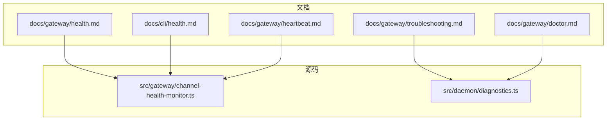
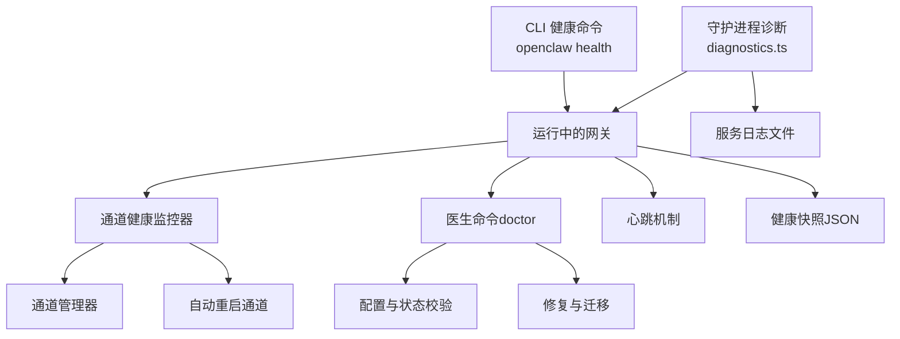
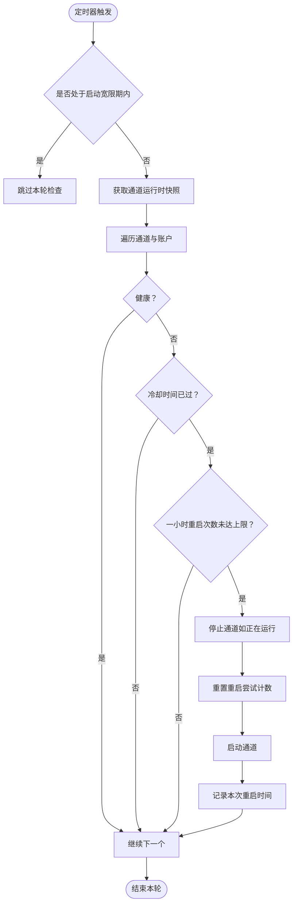
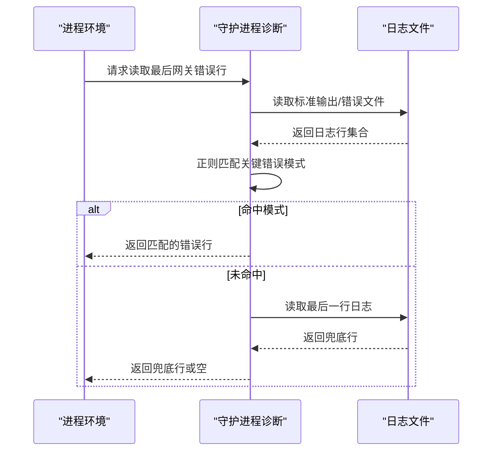
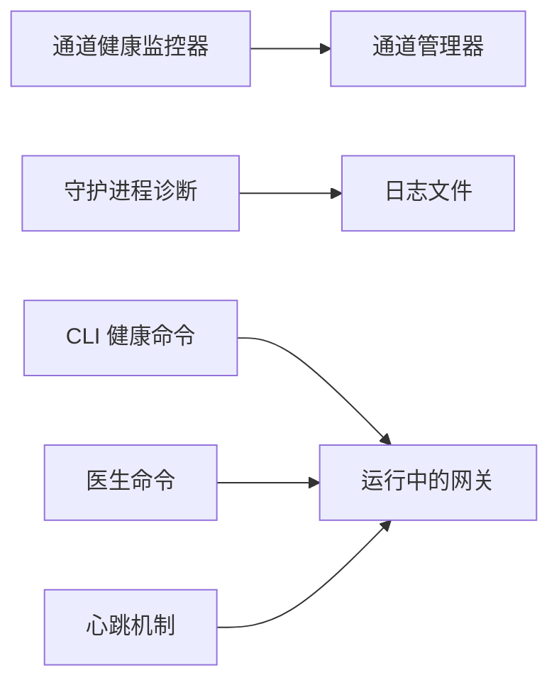

# 网关健康诊断

<cite>
**本文引用的文件**
- [docs/gateway/health.md](file://docs/gateway/health.md)
- [docs/cli/health.md](file://docs/cli/health.md)
- [docs/gateway/troubleshooting.md](file://docs/gateway/troubleshooting.md)
- [docs/gateway/doctor.md](file://docs/gateway/doctor.md)
- [docs/gateway/heartbeat.md](file://docs/gateway/heartbeat.md)
- [src/gateway/channel-health-monitor.ts](file://src/gateway/channel-health-monitor.ts)
- [src/daemon/diagnostics.ts](file://src/daemon/diagnostics.ts)
</cite>

## 目录
1. [简介](#简介)
2. [项目结构](#项目结构)
3. [核心组件](#核心组件)
4. [架构总览](#架构总览)
5. [详细组件分析](#详细组件分析)
6. [依赖关系分析](#依赖关系分析)
7. [性能考量](#性能考量)
8. [故障排查指南](#故障排查指南)
9. [结论](#结论)
10. [附录](#附录)

## 简介
本技术文档聚焦于 OpenClaw 网关的健康诊断能力，系统化阐述服务状态检查、健康状况评估与故障检测机制；覆盖连接测试、内存与性能指标分析、守护进程状态检查、服务发现与网络连通性测试；并提供异常诊断方法、故障排除步骤与自动修复策略，以及日志分析、错误码解读与监控告警处理流程。内容以官方文档与源码实现为依据，兼顾可操作性与工程实践。

## 项目结构
围绕“健康诊断”的知识与实现主要分布在以下位置：
- 文档层：网关健康检查、CLI 健康命令、排障手册、医生命令、心跳机制等
- 源码层：通道健康监控器（自动重启）、守护进程诊断（日志错误模式匹配）

图表来源
- [docs/gateway/health.md](file://docs/gateway/health.md#L1-L36)
- [docs/cli/health.md](file://docs/cli/health.md#L1-L22)
- [docs/gateway/troubleshooting.md](file://docs/gateway/troubleshooting.md#L1-L367)
- [docs/gateway/doctor.md](file://docs/gateway/doctor.md#L1-L310)
- [docs/gateway/heartbeat.md](file://docs/gateway/heartbeat.md#L1-L386)
- [src/gateway/channel-health-monitor.ts](file://src/gateway/channel-health-monitor.ts#L1-L200)
- [src/daemon/diagnostics.ts](file://src/daemon/diagnostics.ts#L1-L45)

章节来源
- [docs/gateway/health.md](file://docs/gateway/health.md#L1-L36)
- [docs/cli/health.md](file://docs/cli/health.md#L1-L22)
- [docs/gateway/troubleshooting.md](file://docs/gateway/troubleshooting.md#L1-L367)
- [docs/gateway/doctor.md](file://docs/gateway/doctor.md#L1-L310)
- [docs/gateway/heartbeat.md](file://docs/gateway/heartbeat.md#L1-L386)
- [src/gateway/channel-health-monitor.ts](file://src/gateway/channel-health-monitor.ts#L1-L200)
- [src/daemon/diagnostics.ts](file://src/daemon/diagnostics.ts#L1-L45)

## 核心组件
- 通道健康监控器：周期性扫描各通道账户运行状态，识别“假死事件”并触发自动重启，限制重启频率与冷却时间，避免风暴式重启。
- 守护进程诊断：从服务日志中提取关键错误模式，辅助定位启动失败、绑定冲突、鉴权缺失等问题。
- CLI 健康快照：通过 RPC 向运行中的网关请求健康快照，包含认证信息、通道探测摘要、会话存储摘要与探测耗时。
- 医生命令：综合健康检查、配置迁移与修复，支持非交互式修复、深度扫描额外网关实例、端口冲突诊断、鉴权与安全检查等。
- 心跳机制：定期在主会话中触发代理回合，用于“无打扰提醒”与异常提示，支持可见性控制与主动唤醒。

章节来源
- [src/gateway/channel-health-monitor.ts](file://src/gateway/channel-health-monitor.ts#L76-L200)
- [src/daemon/diagnostics.ts](file://src/daemon/diagnostics.ts#L27-L44)
- [docs/cli/health.md](file://docs/cli/health.md#L8-L22)
- [docs/gateway/doctor.md](file://docs/gateway/doctor.md#L59-L84)
- [docs/gateway/heartbeat.md](file://docs/gateway/heartbeat.md#L18-L44)

## 架构总览
下图展示健康诊断相关模块之间的交互关系与数据流：

图表来源
- [src/gateway/channel-health-monitor.ts](file://src/gateway/channel-health-monitor.ts#L76-L200)
- [src/daemon/diagnostics.ts](file://src/daemon/diagnostics.ts#L27-L44)
- [docs/cli/health.md](file://docs/cli/health.md#L8-L22)
- [docs/gateway/doctor.md](file://docs/gateway/doctor.md#L59-L84)
- [docs/gateway/heartbeat.md](file://docs/gateway/heartbeat.md#L18-L44)

## 详细组件分析

### 通道健康监控器（自动重启与故障检测）
- 周期性检查：默认每 5 分钟执行一次，启动宽限期后开始正式评估。
- 健康判定：基于“连接宽限时间”“事件过期阈值”等参数，识别“半死连接”（连接仍显示健康但无事件流入）。
- 冷却与节流：重启冷却周期与每小时最大重启次数限制，防止抖动。
- 自动重启：对不健康通道执行停止、重置重启尝试计数、重新启动，并记录重启时间窗口内的次数。
- 可中断：支持 AbortSignal，便于外部取消。

图表来源
- [src/gateway/channel-health-monitor.ts](file://src/gateway/channel-health-monitor.ts#L99-L175)

章节来源
- [src/gateway/channel-health-monitor.ts](file://src/gateway/channel-health-monitor.ts#L20-L75)
- [src/gateway/channel-health-monitor.ts](file://src/gateway/channel-health-monitor.ts#L76-L200)

### 守护进程诊断（日志错误模式匹配）
- 功能：从标准输出/错误日志中提取最近一行匹配的关键错误模式，辅助快速定位启动失败、绑定冲突、鉴权缺失等问题。
- 错误模式：包括拒绝绑定、鉴权模式、启动被阻止、绑定套接字失败、Tailscale 需求等。
- 失败回退：若未命中预设模式，则回退到读取最后一行日志作为兜底。

图表来源
- [src/daemon/diagnostics.ts](file://src/daemon/diagnostics.ts#L27-L44)

章节来源
- [src/daemon/diagnostics.ts](file://src/daemon/diagnostics.ts#L1-L45)

### CLI 健康快照（RPC 调用）
- 命令：openclaw health（支持 --json、--verbose），向运行中的网关请求健康快照。
- 输出：包含认证信息（可用时）、通道探测摘要、会话存储摘要、探测耗时；不可达或超时将非零退出。
- 超时：支持 --timeout 覆盖默认 10 秒。

章节来源
- [docs/cli/health.md](file://docs/cli/health.md#L8-L22)
- [docs/gateway/health.md](file://docs/gateway/health.md#L33-L36)

### 医生命令（综合健康检查与修复）
- 能力概览：更新提示、协议新鲜度检查、健康检查与重启建议、技能状态汇总、配置归一化、历史状态迁移、状态完整性与权限检查、模型鉴权健康、沙箱镜像修复、服务迁移与清理提示、安全警告、systemd 潜留检查、网关鉴权检查、健康检查与重启、通道状态警告、监督者配置审计与修复、端口冲突诊断、最佳实践检查、写回配置与向导元数据。
- 运行模式：支持 --yes、--repair、--repair --force、--non-interactive 等，覆盖不同交互强度与修复范围。

章节来源
- [docs/gateway/doctor.md](file://docs/gateway/doctor.md#L14-L84)
- [docs/gateway/doctor.md](file://docs/gateway/doctor.md#L255-L282)

### 心跳机制（周期性提醒与可见性控制）
- 触发：默认每 30 分钟（Anthropic 使用设置令牌时为 1 小时）在主会话中触发一次代理回合。
- 行为：支持目标路由（last/none/指定渠道）、直接消息策略（允许/阻止）、轻量上下文、活动时段限制、推理消息透传、会话键覆盖等。
- 响应契约：仅包含“HEARTBEAT_OK”时可能被裁剪并丢弃，避免噪声；包含告警内容时不裁剪。
- 可见性：可通过通道/账户级配置控制是否显示“OK”、告警与指示事件。

章节来源
- [docs/gateway/heartbeat.md](file://docs/gateway/heartbeat.md#L18-L44)
- [docs/gateway/heartbeat.md](file://docs/gateway/heartbeat.md#L238-L284)

## 依赖关系分析
- 通道健康监控器依赖通道管理器提供的运行时快照与启停接口，内部维护重启记录与冷却节流逻辑。
- 守护进程诊断依赖服务日志路径解析与文件读取，结合正则模式进行错误识别。
- CLI 健康命令与医生命令均面向运行中的网关，前者侧重“即时健康快照”，后者侧重“系统性修复与迁移”。

图表来源
- [src/gateway/channel-health-monitor.ts](file://src/gateway/channel-health-monitor.ts#L10-L11)
- [src/daemon/diagnostics.ts](file://src/daemon/diagnostics.ts#L1-L2)
- [docs/cli/health.md](file://docs/cli/health.md#L8-L22)
- [docs/gateway/doctor.md](file://docs/gateway/doctor.md#L59-L84)
- [docs/gateway/heartbeat.md](file://docs/gateway/heartbeat.md#L18-L44)

章节来源
- [src/gateway/channel-health-monitor.ts](file://src/gateway/channel-health-monitor.ts#L1-L200)
- [src/daemon/diagnostics.ts](file://src/daemon/diagnostics.ts#L1-L45)
- [docs/cli/health.md](file://docs/cli/health.md#L8-L22)
- [docs/gateway/doctor.md](file://docs/gateway/doctor.md#L59-L84)
- [docs/gateway/heartbeat.md](file://docs/gateway/heartbeat.md#L18-L44)

## 性能考量
- 周期性检查间隔：默认 5 分钟，适合平衡资源占用与及时性；可根据通道数量与负载调优。
- 冷却与节流：重启冷却周期与每小时最大重启次数限制，避免频繁重启导致抖动与资源浪费。
- 日志读取：诊断仅读取最近日志行，避免全量扫描带来的 I/O 压力。
- 心跳成本：短间隔与昂贵模型会增加 Token 消耗；建议使用轻量上下文或关闭外发以降低开销。

## 故障排查指南
- 快速检查链路（按顺序执行）：
  - openclaw status → openclaw gateway status → openclaw logs --follow → openclaw doctor → openclaw channels status --probe
  - 健康信号：网关运行且 RPC 探测成功；doctor 无阻断问题；通道探测显示已连接/就绪。
- 常见症状与定位要点：
  - 网关未运行/无法访问：检查服务安装、端口绑定、鉴权配置；必要时强制生成本地网关令牌。
  - 通道连接但无入站：核对配对状态、允许列表、群组提及规则；检查通道权限与作用域。
  - 控制 UI/仪表盘无法连接：验证 URL、鉴权模式、设备身份与安全上下文；关注 nonce/signature 相关错误。
  - 升级后异常：检查 gateway.mode、远程 URL、鉴权模式；确认绑定与鉴权护栏变更；必要时重新安装服务元数据。
  - Cron/心跳未触发：检查调度器状态、作业运行历史、静默时段与告警开关。
  - 节点/浏览器工具失败：检查节点在线与权限、浏览器可执行路径与 CDP 可达性、扩展中继连接状态。
- 日志与错误码：
  - 关键错误模式：拒绝绑定、鉴权模式、启动被阻止、绑定套接字失败、Tailscale 需求等；守护进程诊断可快速定位。
  - 常见错误线索：logged out、状态码 409–515、设备身份/nonce/signature 相关、未授权/重连循环、端口占用等。
- 自动修复策略：
  - 医生命令：非交互式修复、深度扫描额外网关实例、端口冲突诊断、鉴权与安全检查、监督者配置审计与修复。
  - 通道健康监控器：自动重启不健康通道，配合冷却与节流限制重启风暴。
  - 心跳机制：通过可见性控制减少噪声，必要时手动唤醒以快速验证。

章节来源
- [docs/gateway/troubleshooting.md](file://docs/gateway/troubleshooting.md#L14-L31)
- [docs/gateway/troubleshooting.md](file://docs/gateway/troubleshooting.md#L139-L168)
- [docs/gateway/troubleshooting.md](file://docs/gateway/troubleshooting.md#L169-L199)
- [docs/gateway/troubleshooting.md](file://docs/gateway/troubleshooting.md#L200-L231)
- [docs/gateway/troubleshooting.md](file://docs/gateway/troubleshooting.md#L232-L262)
- [docs/gateway/troubleshooting.md](file://docs/gateway/troubleshooting.md#L263-L293)
- [docs/gateway/troubleshooting.md](file://docs/gateway/troubleshooting.md#L294-L367)
- [src/daemon/diagnostics.ts](file://src/daemon/diagnostics.ts#L4-L10)
- [src/gateway/channel-health-monitor.ts](file://src/gateway/channel-health-monitor.ts#L140-L150)

## 结论
OpenClaw 的网关健康诊断体系由“实时健康快照（CLI/RPC）”“通道健康监控器（自动重启）”“医生命令（系统性修复）”“守护进程诊断（日志错误模式）”“心跳机制（周期提醒）”共同构成。通过标准化的检查链路、可配置的健康策略与自动化修复手段，能够在多数场景下快速定位问题并恢复服务稳定运行。建议在生产环境中结合日志分析、错误码解读与监控告警，形成闭环运维。

## 附录
- 健康检查与诊断常用命令与要点参见：
  - 网关健康检查与 CLI 健康命令：[docs/gateway/health.md](file://docs/gateway/health.md#L8-L36)、[docs/cli/health.md](file://docs/cli/health.md#L8-L22)
  - 综合排障手册：[docs/gateway/troubleshooting.md](file://docs/gateway/troubleshooting.md#L1-L367)
  - 医生命令能力与运行模式：[docs/gateway/doctor.md](file://docs/gateway/doctor.md#L14-L84)
  - 心跳机制配置与行为：[docs/gateway/heartbeat.md](file://docs/gateway/heartbeat.md#L18-L44)