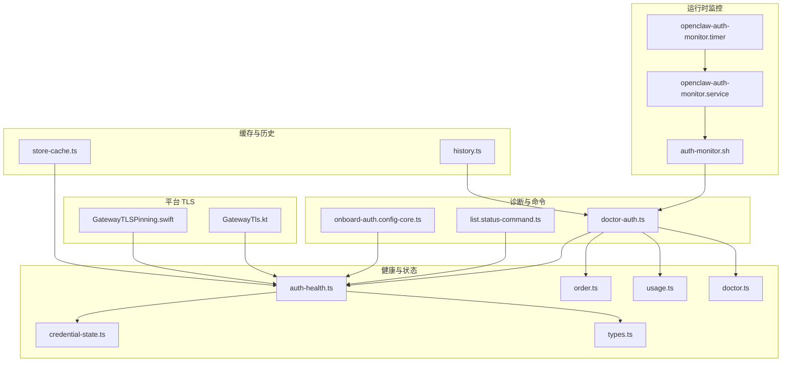
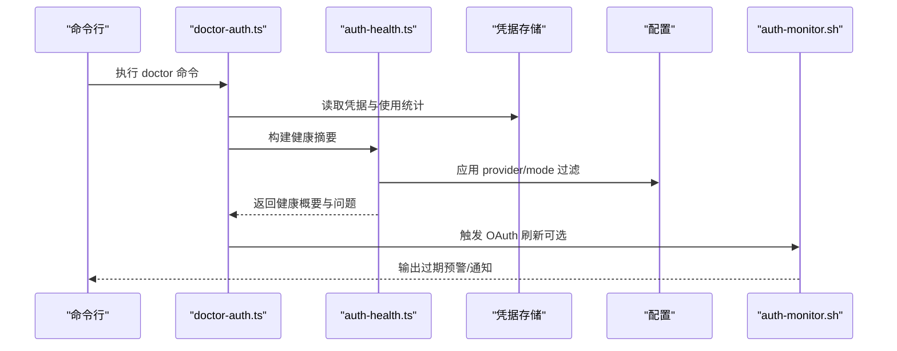
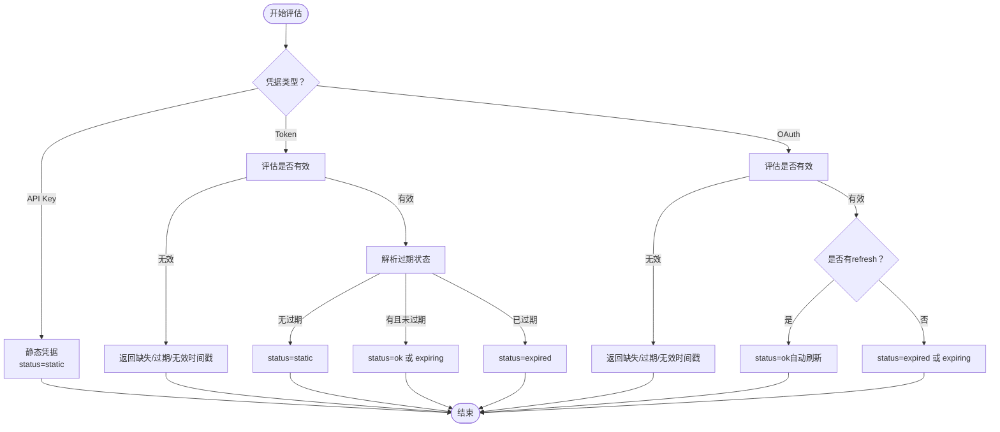
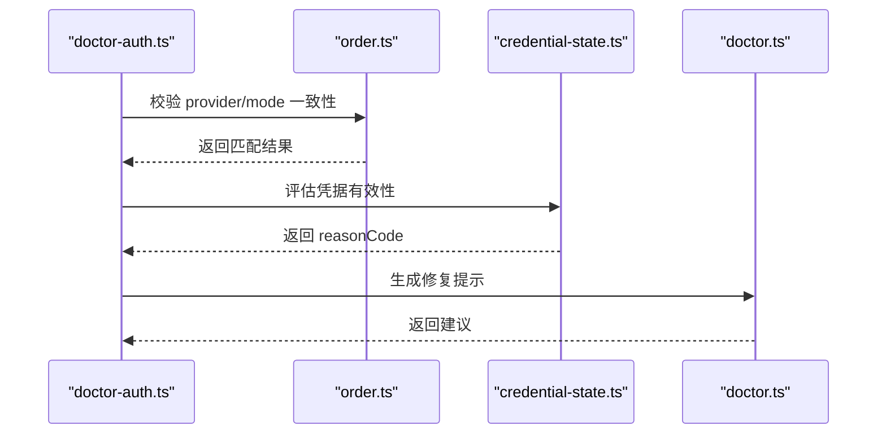
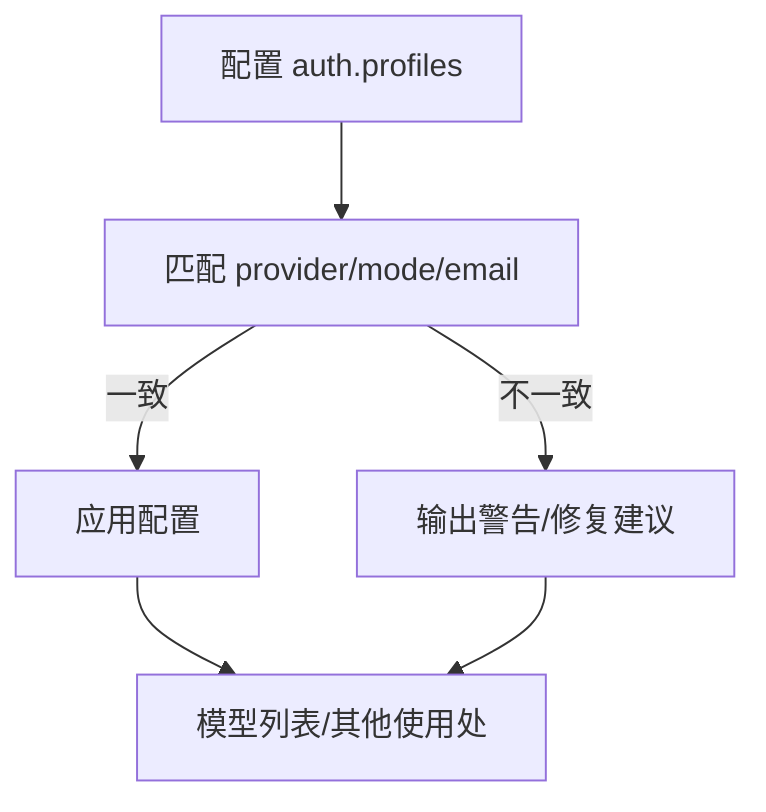
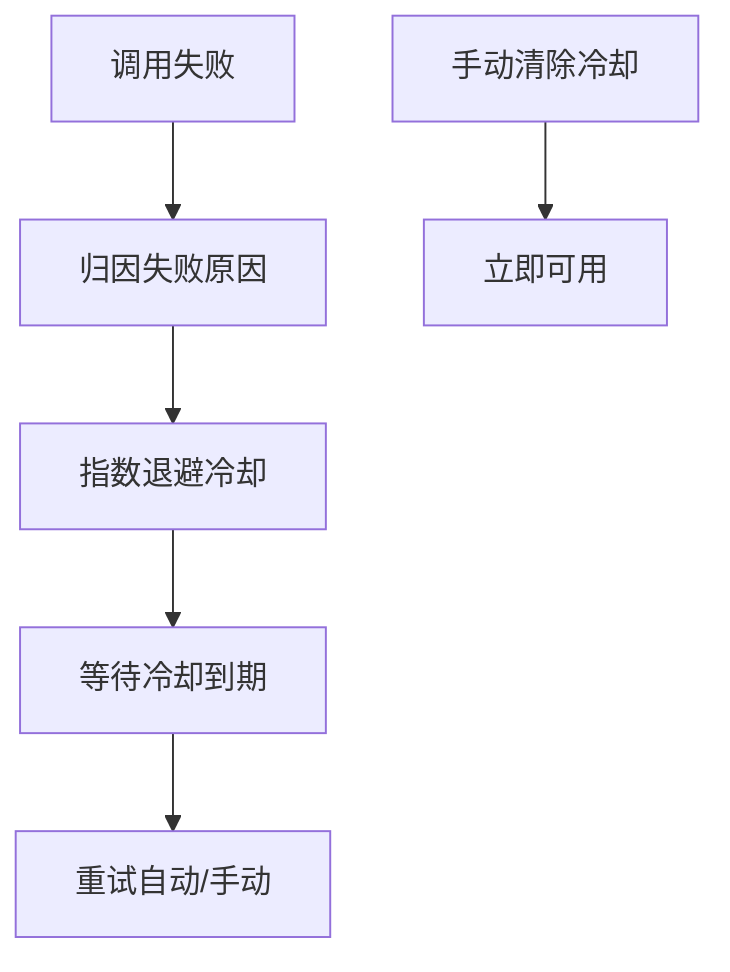
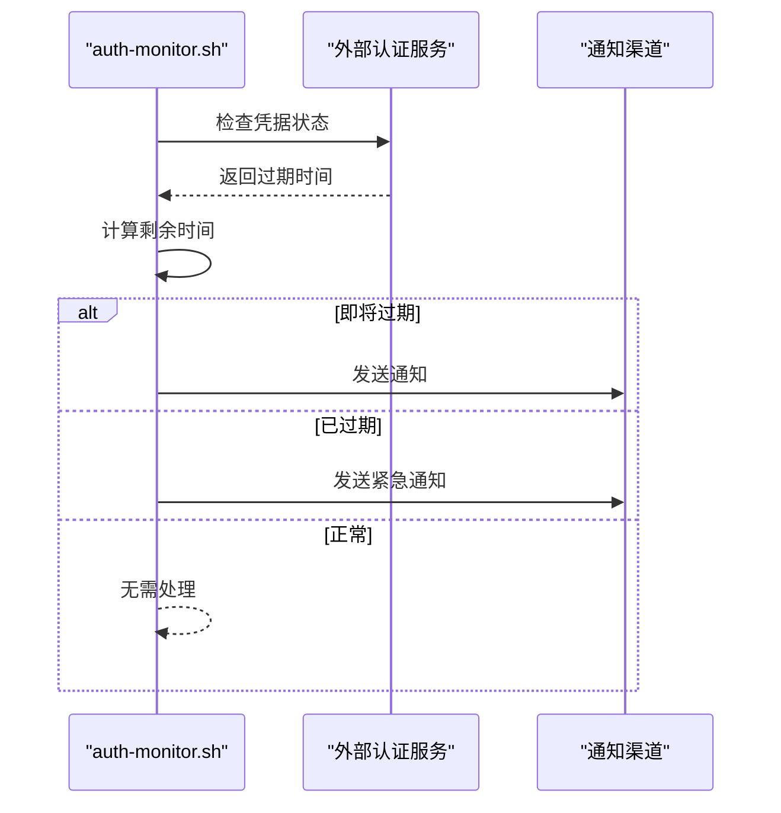
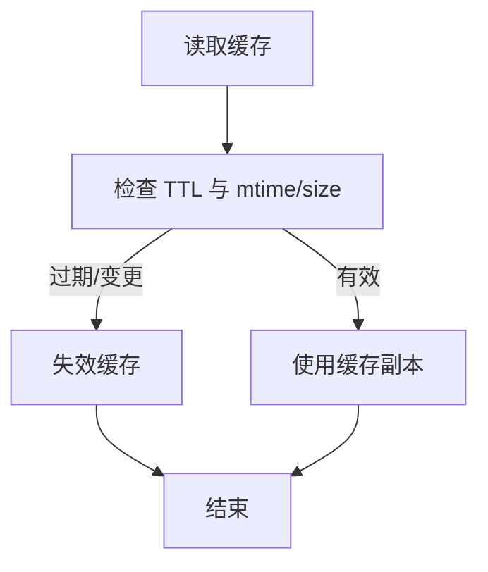
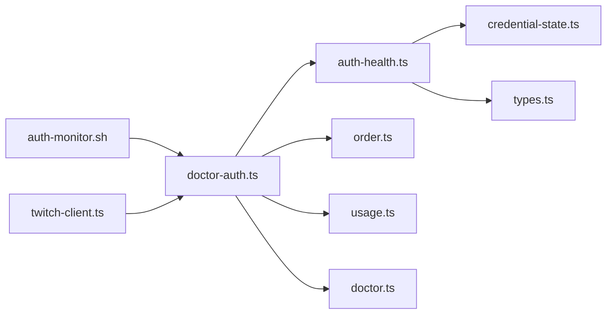

# 认证诊断

<cite>
**本文引用的文件**
- [src/agents/auth-health.ts](file://src/agents/auth-health.ts)
- [src/agents/auth-profiles/credential-state.ts](file://src/agents/auth-profiles/credential-state.ts)
- [src/agents/auth-profiles/types.ts](file://src/agents/auth-profiles/types.ts)
- [src/agents/auth-profiles/order.ts](file://src/agents/auth-profiles/order.ts)
- [src/agents/auth-profiles/usage.ts](file://src/agents/auth-profiles/usage.ts)
- [src/agents/auth-profiles/doctor.ts](file://src/agents/auth-profiles/doctor.ts)
- [src/commands/doctor-auth.ts](file://src/commands/doctor-auth.ts)
- [scripts/auth-monitor.sh](file://scripts/auth-monitor.sh)
- [scripts/systemd/openclaw-auth-monitor.service](file://scripts/systemd/openclaw-auth-monitor.service)
- [scripts/systemd/openclaw-auth-monitor.timer](file://scripts/systemd/openclaw-auth-monitor.timer)
- [apps/android/app/src/main/java/ai/openclaw/android/gateway/GatewayTls.kt](file://apps/android/app/src/main/java/ai/openclaw/android/gateway/GatewayTls.kt)
- [apps/shared/OpenClawKit/Sources/OpenClawKit/GatewayTLSPinning.swift](file://apps/shared/OpenClawKit/Sources/OpenClawKit/GatewayTLSPinning.swift)
- [src/config/sessions/store-cache.ts](file://src/config/sessions/store-cache.ts)
- [src/auto-reply/reply/history.ts](file://src/auto-reply/reply/history.ts)
- [src/gateway/client.watchdog.test.ts](file://src/gateway/client.watchdog.test.ts)
- [src/commands/models/list.status-command.ts](file://src/commands/models/list.status-command.ts)
- [src/commands/onboard-auth.config-core.ts](file://src/commands/onboard-auth.config-core.ts)
- [extensions/twitch/src/twitch-client.ts](file://extensions/twitch/src/twitch-client.ts)
- [docs/reference/secretref-credential-surface.md](file://docs/reference/secretref-credential-surface.md)
</cite>

## 目录
1. [简介](#简介)
2. [项目结构](#项目结构)
3. [核心组件](#核心组件)
4. [架构总览](#架构总览)
5. [详细组件分析](#详细组件分析)
6. [依赖关系分析](#依赖关系分析)
7. [性能考量](#性能考量)
8. [故障排查指南](#故障排查指南)
9. [结论](#结论)
10. [附录](#附录)

## 简介
本技术文档聚焦于 OpenClaw 的认证诊断能力，系统性阐述认证配置验证、凭据状态检查与 OAuth 流程诊断的实现机制与使用方法。内容覆盖：
- 认证配置文件检查与策略校验
- 凭据有效性与过期状态评估
- OAuth 刷新与轮换检测
- 第三方认证提供商连接测试与 TLS 证书校验
- 认证失败诊断、凭据修复建议与安全配置优化
- 认证缓存清理、历史记录分析与策略验证流程

## 项目结构
围绕认证诊断的关键模块分布如下：
- 健康度与状态评估：auth-health、credential-state、types
- 配置与策略：order、usage、doctor
- 诊断命令与提示：doctor-auth
- 运行时监控与通知：auth-monitor.sh 及 systemd 单元
- 平台侧 TLS 校验：Android 与 iOS
- 缓存与历史：会话缓存、自动回复历史
- 模型列表与配置应用：models/status-command、onboard 配置

**图表来源**
- [src/agents/auth-health.ts](file://src/agents/auth-health.ts#L1-L284)
- [src/agents/auth-profiles/credential-state.ts](file://src/agents/auth-profiles/credential-state.ts#L1-L75)
- [src/agents/auth-profiles/types.ts](file://src/agents/auth-profiles/types.ts#L1-L82)
- [src/agents/auth-profiles/order.ts](file://src/agents/auth-profiles/order.ts#L25-L65)
- [src/agents/auth-profiles/usage.ts](file://src/agents/auth-profiles/usage.ts#L82-L544)
- [src/agents/auth-profiles/doctor.ts](file://src/agents/auth-profiles/doctor.ts#L1-L35)
- [src/commands/doctor-auth.ts](file://src/commands/doctor-auth.ts#L1-L358)
- [src/commands/models/list.status-command.ts](file://src/commands/models/list.status-command.ts#L258-L277)
- [src/commands/onboard-auth.config-core.ts](file://src/commands/onboard-auth.config-core.ts#L469-L491)
- [scripts/auth-monitor.sh](file://scripts/auth-monitor.sh#L1-L90)
- [scripts/systemd/openclaw-auth-monitor.service](file://scripts/systemd/openclaw-auth-monitor.service#L1-L15)
- [scripts/systemd/openclaw-auth-monitor.timer](file://scripts/systemd/openclaw-auth-monitor.timer#L1-L11)
- [apps/android/app/src/main/java/ai/openclaw/android/gateway/GatewayTls.kt](file://apps/android/app/src/main/java/ai/openclaw/android/gateway/GatewayTls.kt#L35-L66)
- [apps/shared/OpenClawKit/Sources/OpenClawKit/GatewayTLSPinning.swift](file://apps/shared/OpenClawKit/Sources/OpenClawKit/GatewayTLSPinning.swift#L89-L137)
- [src/config/sessions/store-cache.ts](file://src/config/sessions/store-cache.ts#L37-L81)
- [src/auto-reply/reply/history.ts](file://src/auto-reply/reply/history.ts#L52-L104)

**章节来源**
- [src/agents/auth-health.ts](file://src/agents/auth-health.ts#L1-L284)
- [src/commands/doctor-auth.ts](file://src/commands/doctor-auth.ts#L1-L358)

## 核心组件
- 认证健康度评估：对每个凭据进行类型识别、有效期判定与状态汇总，支持按提供商聚合。
- 凭据状态判定：区分 API Key、静态 Token 与 OAuth，分别评估缺失、过期、无效时间戳等情形。
- 配置与策略：校验配置文件中的 provider/mode 一致性，支持模式兼容（如 token 与 oauth）。
- 使用统计与冷却：记录失败原因、错误计数与冷却窗口，提供最短冷却到期时间查询。
- 诊断命令：输出健康摘要、问题列表、修复建议，并可触发 OAuth 刷新。
- 运行时监控：定时检查第三方认证（如 Claude）过期风险并推送通知。
- 平台 TLS 校验：基于指纹固定或 TOFU 允许策略，保障网关通信安全。

**章节来源**
- [src/agents/auth-health.ts](file://src/agents/auth-health.ts#L17-L96)
- [src/agents/auth-profiles/credential-state.ts](file://src/agents/auth-profiles/credential-state.ts#L34-L75)
- [src/agents/auth-profiles/order.ts](file://src/agents/auth-profiles/order.ts#L30-L65)
- [src/agents/auth-profiles/usage.ts](file://src/agents/auth-profiles/usage.ts#L82-L161)
- [src/commands/doctor-auth.ts](file://src/commands/doctor-auth.ts#L251-L358)
- [scripts/auth-monitor.sh](file://scripts/auth-monitor.sh#L68-L90)
- [apps/android/app/src/main/java/ai/openclaw/android/gateway/GatewayTls.kt](file://apps/android/app/src/main/java/ai/openclaw/android/gateway/GatewayTls.kt#L35-L66)
- [apps/shared/OpenClawKit/Sources/OpenClawKit/GatewayTLSPinning.swift](file://apps/shared/OpenClawKit/Sources/OpenClawKit/GatewayTLSPinning.swift#L89-L137)

## 架构总览
下图展示从诊断命令到健康评估、配置校验与运行时监控的整体交互：

**图表来源**
- [src/commands/doctor-auth.ts](file://src/commands/doctor-auth.ts#L251-L358)
- [src/agents/auth-health.ts](file://src/agents/auth-health.ts#L187-L284)
- [scripts/auth-monitor.sh](file://scripts/auth-monitor.sh#L68-L90)

## 详细组件分析

### 认证健康度与状态评估
- 类型识别：API Key（静态）、Token（静态，可带过期）、OAuth（含 access/refresh/expires）。
- 有效期判定：对 OAuth 与 Token，依据 expires 与当前时间计算剩余时长；若存在 refresh，则在首次调用时自动刷新，不视为“即将过期”。
- 聚合策略：按 provider 聚合，综合“ok/expiring/expired/missing/static”状态，选择最小过期时间作为提供商级别指标。

**图表来源**
- [src/agents/auth-health.ts](file://src/agents/auth-health.ts#L98-L185)
- [src/agents/auth-profiles/credential-state.ts](file://src/agents/auth-profiles/credential-state.ts#L13-L24)

**章节来源**
- [src/agents/auth-health.ts](file://src/agents/auth-health.ts#L80-L185)
- [src/agents/auth-profiles/credential-state.ts](file://src/agents/auth-profiles/credential-state.ts#L34-L75)

### 凭据状态检查与 OAuth 流程诊断
- 凭据有效性：API Key/Token 支持明文或 SecretRef；OAuth 必须具备 access/refresh 至少一项。
- 过期判定：仅当 expires 为合法正数且未来时点才计入评估；否则视为“无效时间戳”。
- OAuth 自动刷新：若存在 refresh，即使显示“即将过期”，也以“ok”处理，避免误报。
- 诊断提示：针对特定 provider（如 Anthropic）给出迁移建议与修复提示。

**图表来源**
- [src/commands/doctor-auth.ts](file://src/commands/doctor-auth.ts#L21-L45)
- [src/agents/auth-profiles/order.ts](file://src/agents/auth-profiles/order.ts#L30-L65)
- [src/agents/auth-profiles/credential-state.ts](file://src/agents/auth-profiles/credential-state.ts#L34-L75)
- [src/agents/auth-profiles/doctor.ts](file://src/agents/auth-profiles/doctor.ts#L8-L35)

**章节来源**
- [src/commands/doctor-auth.ts](file://src/commands/doctor-auth.ts#L21-L45)
- [src/agents/auth-profiles/order.ts](file://src/agents/auth-profiles/order.ts#L30-L65)
- [src/agents/auth-profiles/credential-state.ts](file://src/agents/auth-profiles/credential-state.ts#L34-L75)
- [src/agents/auth-profiles/doctor.ts](file://src/agents/auth-profiles/doctor.ts#L8-L35)

### 认证配置文件检查与策略验证
- 配置项映射：支持在配置中声明 provider/mode/email 等字段，与存储中的凭据进行一致性比对。
- 模式兼容：当配置 mode 为 oauth，而凭据类型为 token 时，仍可接受（兼容场景）。
- 应用策略：在模型列表等场景中，仅保留存储中存在的有效配置条目，避免无效引用。

**图表来源**
- [src/commands/onboard-auth.config-core.ts](file://src/commands/onboard-auth.config-core.ts#L469-L491)
- [src/gateway/gateway-models.profiles.live.test.ts](file://src/gateway/gateway-models.profiles.live.test.ts#L570-L619)

**章节来源**
- [src/commands/onboard-auth.config-core.ts](file://src/commands/onboard-auth.config-core.ts#L469-L491)
- [src/gateway/gateway-models.profiles.live.test.ts](file://src/gateway/gateway-models.profiles.live.test.ts#L570-L619)

### 凭据轮换检测与密钥管理
- 轮换信号：当凭据具备 refresh 且处于“即将过期/已过期”状态时，系统以“ok”处理，表示可自动刷新。
- 失败归因：使用统计记录失败原因（如 billing、rate_limit、auth 等），用于冷却策略与诊断提示。
- 冷却策略：指数退避（1min、5min、25min，上限 1 小时），并支持手动清除冷却。

**图表来源**
- [src/agents/auth-profiles/usage.ts](file://src/agents/auth-profiles/usage.ts#L82-L161)
- [src/agents/auth-profiles/usage.ts](file://src/agents/auth-profiles/usage.ts#L511-L544)

**章节来源**
- [src/agents/auth-profiles/usage.ts](file://src/agents/auth-profiles/usage.ts#L82-L161)
- [src/agents/auth-profiles/usage.ts](file://src/agents/auth-profiles/usage.ts#L511-L544)

### 第三方认证提供商连接测试与 TLS 证书验证
- 连接测试：通过 auth-monitor.sh 检查第三方凭据（如 Claude）是否存在、是否过期，并在临近过期时发出通知。
- TLS 校验：Android/iOS 提供基于证书指纹固定或 TOFU（信任新指纹）的安全策略，确保网关证书可信。

**图表来源**
- [scripts/auth-monitor.sh](file://scripts/auth-monitor.sh#L68-L90)

**章节来源**
- [scripts/auth-monitor.sh](file://scripts/auth-monitor.sh#L68-L90)
- [apps/android/app/src/main/java/ai/openclaw/android/gateway/GatewayTls.kt](file://apps/android/app/src/main/java/ai/openclaw/android/gateway/GatewayTls.kt#L35-L66)
- [apps/shared/OpenClawKit/Sources/OpenClawKit/GatewayTLSPinning.swift](file://apps/shared/OpenClawKit/Sources/OpenClawKit/GatewayTLSPinning.swift#L89-L137)

### 认证缓存清理与历史记录分析
- 缓存清理：会话存储缓存提供 TTL 与文件元信息校验，超时或变更后主动失效，避免脏读。
- 历史记录：自动回复历史支持限制长度与键驱逐，防止内存无限增长；可用于分析认证相关的历史行为。

**图表来源**
- [src/config/sessions/store-cache.ts](file://src/config/sessions/store-cache.ts#L41-L81)
- [src/auto-reply/reply/history.ts](file://src/auto-reply/reply/history.ts#L52-L104)

**章节来源**
- [src/config/sessions/store-cache.ts](file://src/config/sessions/store-cache.ts#L41-L81)
- [src/auto-reply/reply/history.ts](file://src/auto-reply/reply/history.ts#L52-L104)

## 依赖关系分析
- 组件耦合：
  - doctor-auth 依赖 auth-health、order、usage、doctor，形成诊断闭环。
  - auth-health 依赖 credential-state 与 types，负责状态计算与汇总。
  - 运行时监控独立于核心逻辑，通过脚本与 systemd 定时器触发。
- 外部集成：
  - 第三方认证（如 Twitch）使用刷新提供者进行令牌刷新与失败回调，便于诊断刷新链路。

**图表来源**
- [src/commands/doctor-auth.ts](file://src/commands/doctor-auth.ts#L1-L358)
- [src/agents/auth-health.ts](file://src/agents/auth-health.ts#L1-L284)
- [src/agents/auth-profiles/credential-state.ts](file://src/agents/auth-profiles/credential-state.ts#L1-L75)
- [src/agents/auth-profiles/types.ts](file://src/agents/auth-profiles/types.ts#L1-L82)
- [src/agents/auth-profiles/order.ts](file://src/agents/auth-profiles/order.ts#L25-L65)
- [src/agents/auth-profiles/usage.ts](file://src/agents/auth-profiles/usage.ts#L82-L544)
- [src/agents/auth-profiles/doctor.ts](file://src/agents/auth-profiles/doctor.ts#L1-L35)
- [scripts/auth-monitor.sh](file://scripts/auth-monitor.sh#L1-L90)
- [extensions/twitch/src/twitch-client.ts](file://extensions/twitch/src/twitch-client.ts#L34-L72)

**章节来源**
- [src/commands/doctor-auth.ts](file://src/commands/doctor-auth.ts#L1-L358)
- [extensions/twitch/src/twitch-client.ts](file://extensions/twitch/src/twitch-client.ts#L34-L72)

## 性能考量
- 健康度计算复杂度：对每个凭据进行一次状态评估，整体 O(N)，适合大规模凭据集。
- 缓存命中：会话缓存采用 TTL 与文件元信息双重校验，减少重复 IO。
- 冷却策略：指数退避降低重试压力，避免雪崩效应。

[本节为通用指导，无需具体文件分析]

## 故障排查指南
- 认证失败诊断
  - 使用 doctor 命令查看健康摘要与问题列表，按提示修复配置或重新认证。
  - 对于“即将过期”的 OAuth，可直接触发刷新；对于静态 Token，需重新配置。
- 凭据修复建议
  - 若 reasonCode 为 invalid_expires，修正 expires 时间戳或移除该字段。
  - 对于已停用的 CLI 凭据，按提示移除并使用新的认证方式。
- 安全配置优化
  - 优先使用 SecretRef 存储敏感信息，避免明文写入配置。
  - 启用 TLS 指纹固定或 TOFU 策略，确保网关通信安全。
- 认证缓存清理
  - 当怀疑缓存污染时，调用缓存清理函数使缓存失效并重建。
- 认证历史记录分析
  - 结合使用统计与历史记录，定位频繁失败的原因（如 billing、rate_limit）。
- 认证策略验证
  - 在模型列表等场景中，确认配置与存储的一致性，避免无效引用。

**章节来源**
- [src/commands/doctor-auth.ts](file://src/commands/doctor-auth.ts#L251-L358)
- [src/agents/auth-profiles/credential-state.ts](file://src/agents/auth-profiles/credential-state.ts#L227-L241)
- [src/agents/auth-profiles/usage.ts](file://src/agents/auth-profiles/usage.ts#L82-L161)
- [src/config/sessions/store-cache.ts](file://src/config/sessions/store-cache.ts#L37-L81)
- [docs/reference/secretref-credential-surface.md](file://docs/reference/secretref-credential-surface.md#L14-L17)

## 结论
OpenClaw 的认证诊断体系通过“健康度评估 + 配置校验 + 使用统计 + 运行时监控 + 平台 TLS 校验”的多维组合，实现了对认证配置、凭据状态与 OAuth 流程的全面可观测与可诊断。配合 doctor 命令与 systemd 定时任务，可在问题发生前主动预警并提供修复路径，显著提升系统的稳定性与安全性。

[本节为总结，无需具体文件分析]

## 附录
- 运行时监控安装与配置
  - systemd 单元与定时器已预置，可通过环境变量配置通知通道与告警阈值。
- 平台 TLS 策略
  - Android/iOS 分别提供指纹固定与 TOFU 允许策略，满足不同部署场景的安全需求。

**章节来源**
- [scripts/systemd/openclaw-auth-monitor.service](file://scripts/systemd/openclaw-auth-monitor.service#L1-L15)
- [scripts/systemd/openclaw-auth-monitor.timer](file://scripts/systemd/openclaw-auth-monitor.timer#L1-L11)
- [apps/android/app/src/main/java/ai/openclaw/android/gateway/GatewayTls.kt](file://apps/android/app/src/main/java/ai/openclaw/android/gateway/GatewayTls.kt#L35-L66)
- [apps/shared/OpenClawKit/Sources/OpenClawKit/GatewayTLSPinning.swift](file://apps/shared/OpenClawKit/Sources/OpenClawKit/GatewayTLSPinning.swift#L89-L137)