# 配置诊断

<cite>
**本文引用的文件**
- [src/config/config.ts](file://src/config/config.ts)
- [src/config/io.ts](file://src/config/io.ts)
- [src/config/validation.ts](file://src/config/validation.ts)
- [src/config/legacy.ts](file://src/config/legacy.ts)
- [src/config/legacy-migrate.ts](file://src/config/legacy-migrate.ts)
- [src/config/backup-rotation.ts](file://src/config/backup-rotation.ts)
- [src/config/env-substitution.ts](file://src/config/env-substitution.ts)
- [src/config/paths.ts](file://src/config/paths.ts)
- [src/config/types.openclaw.ts](file://src/config/types.openclaw.ts)
- [src/cli/config-cli.ts](file://src/cli/config-cli.ts)
</cite>

## 目录
1. [简介](#简介)
2. [项目结构](#项目结构)
3. [核心组件](#核心组件)
4. [架构总览](#架构总览)
5. [详细组件分析](#详细组件分析)
6. [依赖关系分析](#依赖关系分析)
7. [性能考量](#性能考量)
8. [故障排查指南](#故障排查指南)
9. [结论](#结论)
10. [附录](#附录)

## 简介
本文件面向OpenClaw的配置诊断能力，系统化阐述配置文件验证流程、状态完整性检查与遗留状态迁移机制，覆盖配置加载、有效性验证、损坏检测、备份恢复、版本兼容与迁移策略，并提供错误识别、修复建议与预防措施，以及配置文件格式校验、路径解析与环境变量注入的检查流程。

## 项目结构
OpenClaw的配置诊断能力由“配置I/O层”“验证层”“遗留迁移层”“备份轮转层”“路径解析层”“CLI诊断工具”等模块协同完成。关键文件如下：
- 配置I/O与写入：io.ts
- 验证与警告：validation.ts
- 遗留检测与迁移：legacy.ts、legacy-migrate.ts
- 备份轮转与恢复：backup-rotation.ts
- 环境变量注入与替换：env-substitution.ts
- 路径解析与默认候选：paths.ts
- 类型定义：types.openclaw.ts
- CLI诊断命令：config-cli.ts

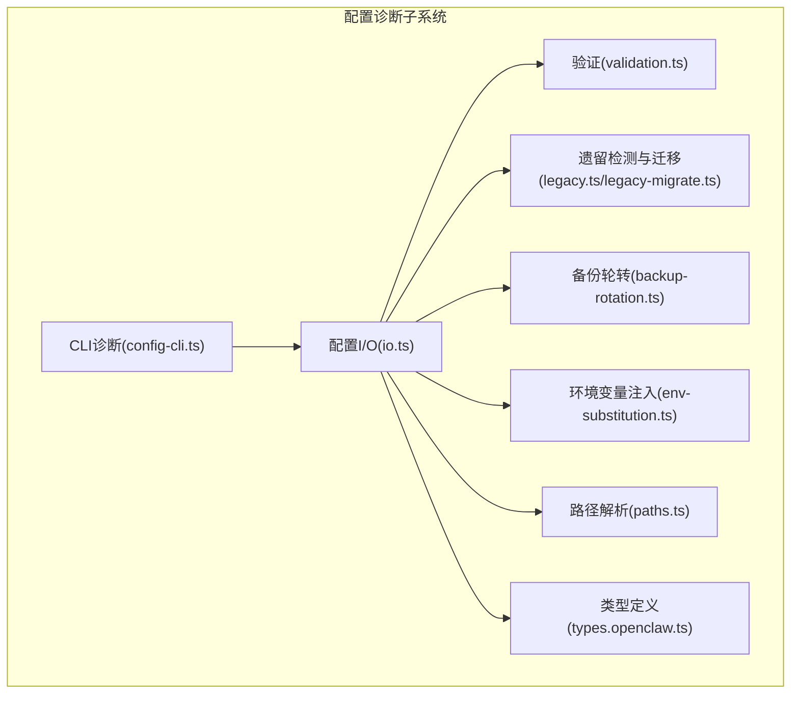

图表来源
- [src/config/io.ts](file://src/config/io.ts#L673-L1286)
- [src/config/validation.ts](file://src/config/validation.ts#L229-L622)
- [src/config/legacy.ts](file://src/config/legacy.ts#L16-L58)
- [src/config/legacy-migrate.ts](file://src/config/legacy-migrate.ts#L5-L19)
- [src/config/backup-rotation.ts](file://src/config/backup-rotation.ts#L16-L125)
- [src/config/env-substitution.ts](file://src/config/env-substitution.ts#L169-L172)
- [src/config/paths.ts](file://src/config/paths.ts#L118-L224)
- [src/config/types.openclaw.ts](file://src/config/types.openclaw.ts#L31-L155)
- [src/cli/config-cli.ts](file://src/cli/config-cli.ts#L395-L476)

章节来源
- [src/config/config.ts](file://src/config/config.ts#L1-L24)

## 核心组件
- 配置I/O与快照：负责读取、解析、合并、写回配置，生成文件快照并记录审计日志；支持环境变量注入、包含文件解析、运行时默认应用与路径规范化。
- 验证器：基于Zod模式与业务规则进行严格校验，输出问题与警告列表；支持插件配置schema校验与通道合法性检查。
- 遗留检测与迁移：扫描旧键与不兼容结构，生成迁移变更清单并尝试自动迁移。
- 备份轮转：在写入前旋转备份，维护固定数量的备份文件，确保可恢复性。
- 环境变量注入：解析${VAR}语法，支持转义与缺失检测，保证配置安全与可追溯。
- 路径解析：解析状态目录、配置文件候选路径、OAuth存储路径等，兼容历史目录与文件名。
- CLI诊断：提供config get/set/unset/file/validate等命令，结合快照输出问题与修复建议。

章节来源
- [src/config/io.ts](file://src/config/io.ts#L673-L1400)
- [src/config/validation.ts](file://src/config/validation.ts#L229-L622)
- [src/config/legacy.ts](file://src/config/legacy.ts#L16-L58)
- [src/config/legacy-migrate.ts](file://src/config/legacy-migrate.ts#L5-L19)
- [src/config/backup-rotation.ts](file://src/config/backup-rotation.ts#L16-L125)
- [src/config/env-substitution.ts](file://src/config/env-substitution.ts#L169-L172)
- [src/config/paths.ts](file://src/config/paths.ts#L118-L224)
- [src/config/types.openclaw.ts](file://src/config/types.openclaw.ts#L31-L155)
- [src/cli/config-cli.ts](file://src/cli/config-cli.ts#L395-L476)

## 架构总览
下图展示从CLI到配置文件的完整诊断链路：CLI调用配置I/O读取快照，I/O执行包含解析、环境变量注入、验证与默认应用，最终生成可写入的配置对象，并在写入时进行备份轮转与审计记录。

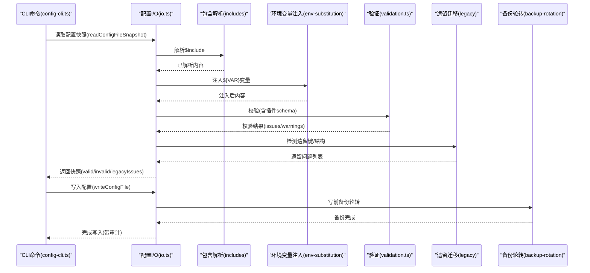

图表来源
- [src/cli/config-cli.ts](file://src/cli/config-cli.ts#L344-L393)
- [src/config/io.ts](file://src/config/io.ts#L820-L1018)
- [src/config/env-substitution.ts](file://src/config/env-substitution.ts#L169-L172)
- [src/config/validation.ts](file://src/config/validation.ts#L288-L622)
- [src/config/legacy.ts](file://src/config/legacy.ts#L16-L58)
- [src/config/backup-rotation.ts](file://src/config/backup-rotation.ts#L115-L125)

## 详细组件分析

### 组件A：配置I/O与快照（io.ts）
职责与流程要点：
- 读取阶段：解析JSON5、$include、${ENV}，执行预校验（如重复代理目录）、验证、应用默认值、路径规范化、环境变量应用与shell环境回退加载。
- 写入阶段：计算差异补丁、恢复被注入的${VAR}引用、按需unset路径、写入临时文件、原子重命名或复制回退、维护备份轮转、记录审计日志。
- 快照：返回包含原始/解析/已注入/最终配置、哈希、问题与警告、遗留问题等信息，用于CLI操作与诊断。

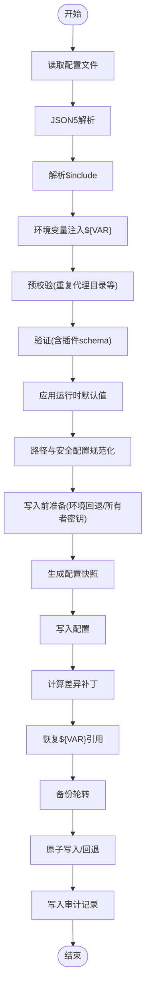

图表来源
- [src/config/io.ts](file://src/config/io.ts#L682-L818)
- [src/config/io.ts](file://src/config/io.ts#L820-L1018)
- [src/config/io.ts](file://src/config/io.ts#L1036-L1277)

章节来源
- [src/config/io.ts](file://src/config/io.ts#L673-L1400)

### 组件B：验证器（validation.ts）
职责与流程要点：
- 基于Zod模式与自定义规则进行严格校验，输出问题与警告。
- 插件配置schema校验，未知插件与冲突启用状态给出提示。
- 通道合法性、心跳目标、头像路径合规性、网关Tailscale绑定约束等专项校验。
- 支持“仅原始校验”与“应用默认后再校验”的两种模式，满足写回场景需求。

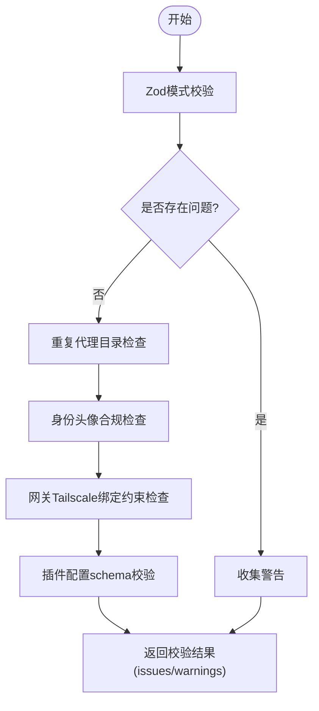

图表来源
- [src/config/validation.ts](file://src/config/validation.ts#L229-L286)
- [src/config/validation.ts](file://src/config/validation.ts#L288-L622)

章节来源
- [src/config/validation.ts](file://src/config/validation.ts#L229-L622)

### 组件C：遗留检测与迁移（legacy.ts、legacy-migrate.ts）
职责与流程要点：
- 遗留检测：遍历规则集，定位旧键与不兼容结构，必要时限定仅对源文件字面量生效，避免误报。
- 自动迁移：对符合条件的旧结构进行转换，生成变更说明；若迁移后仍无效，提示手动修复。

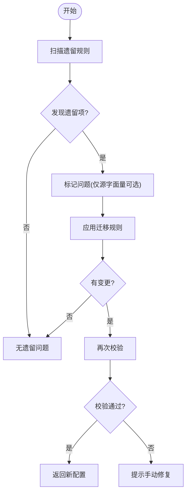

图表来源
- [src/config/legacy.ts](file://src/config/legacy.ts#L16-L58)
- [src/config/legacy-migrate.ts](file://src/config/legacy-migrate.ts#L5-L19)

章节来源
- [src/config/legacy.ts](file://src/config/legacy.ts#L16-L58)
- [src/config/legacy-migrate.ts](file://src/config/legacy-migrate.ts#L5-L19)

### 组件D：备份轮转与恢复（backup-rotation.ts）
职责与流程要点：
- 写前轮转：将现有备份向更高编号移动，删除最高编号备份，保留环形备份数量。
- 创建新备份：复制当前配置为.primary备份，并设置权限。
- 清理孤儿备份：移除不在管理范围内的.bak.*文件。
- 写后加固：确保所有.bak文件权限一致，防止敏感信息泄露。

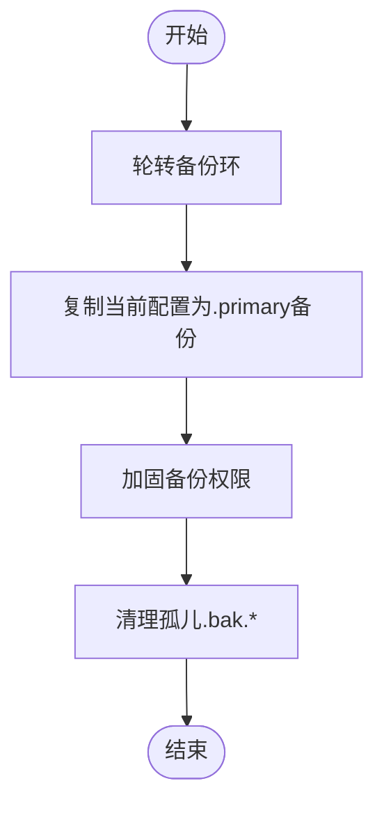

图表来源
- [src/config/backup-rotation.ts](file://src/config/backup-rotation.ts#L16-L125)

章节来源
- [src/config/backup-rotation.ts](file://src/config/backup-rotation.ts#L16-L125)

### 组件E：环境变量注入与恢复（env-substitution.ts）
职责与流程要点：
- 注入：解析${VAR}语法，支持转义$${}，缺失变量抛出明确错误。
- 恢复：写回时根据原始文件与变更路径，仅对未显式修改的字段恢复${VAR}引用，避免覆盖用户真实值。

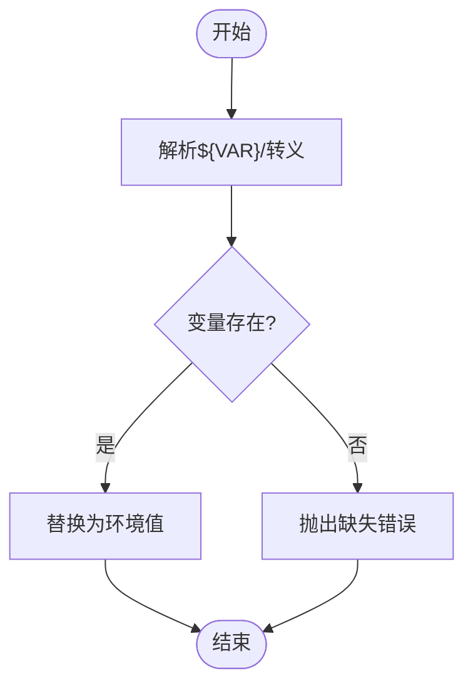

图表来源
- [src/config/env-substitution.ts](file://src/config/env-substitution.ts#L78-L113)
- [src/config/env-substitution.ts](file://src/config/env-substitution.ts#L169-L172)

章节来源
- [src/config/env-substitution.ts](file://src/config/env-substitution.ts#L169-L172)

### 组件F：路径解析（paths.ts）
职责与流程要点：
- 状态目录解析：优先使用OPENCLAW_STATE_DIR，否则回退至历史目录或新目录。
- 配置文件候选：按顺序尝试新旧文件名与状态目录组合，优先选择已存在的配置文件。
- OAuth目录与端口：提供OAuth存储路径与默认端口解析逻辑。

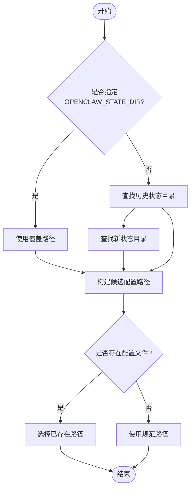

图表来源
- [src/config/paths.ts](file://src/config/paths.ts#L60-L192)

章节来源
- [src/config/paths.ts](file://src/config/paths.ts#L60-L224)

### 组件G：CLI诊断命令（config-cli.ts）
职责与流程要点：
- get：按路径获取值，支持JSON输出与红名单脱敏。
- set：解析路径与值，写回配置，必要时自动补全相关Provider。
- unset：按路径删除，写回配置。
- file：打印当前活动配置文件路径。
- validate：输出配置有效性、问题与警告，支持JSON输出与doctor建议。

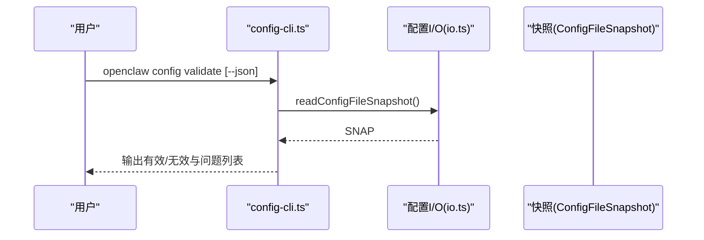

图表来源
- [src/cli/config-cli.ts](file://src/cli/config-cli.ts#L344-L393)

章节来源
- [src/cli/config-cli.ts](file://src/cli/config-cli.ts#L395-L476)

## 依赖关系分析
- 配置I/O依赖验证器、遗留检测、备份轮转、环境变量注入、路径解析与类型定义。
- CLI依赖配置I/O与问题格式化工具，提供用户交互入口。
- 验证器依赖插件注册表、通道ID集合与网络工具以完成专项校验。
- 遗留迁移依赖规则与迁移集合，先迁移再校验。

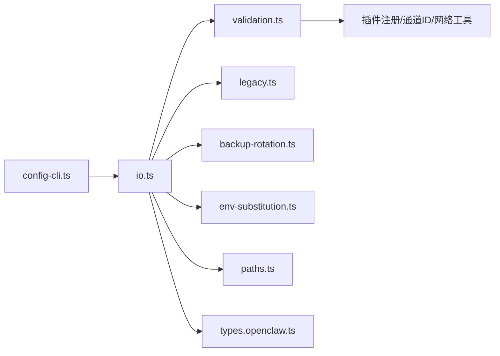

图表来源
- [src/cli/config-cli.ts](file://src/cli/config-cli.ts#L3-L14)
- [src/config/io.ts](file://src/config/io.ts#L1-L54)
- [src/config/validation.ts](file://src/config/validation.ts#L1-L25)

章节来源
- [src/config/config.ts](file://src/config/config.ts#L1-L24)

## 性能考量
- 缓存策略：配置I/O支持短时缓存与禁用开关，减少频繁读取开销。
- 写入优化：差异补丁计算与最小化写回，避免不必要的磁盘写入。
- 并发与原子：写入采用临时文件+原子重命名，失败时回退复制，兼顾跨平台一致性。
- 日志与审计：写入审计记录异步追加，避免阻塞主流程。

[本节为通用指导，无需列出具体文件来源]

## 故障排查指南
常见问题与处理建议：
- 配置无效（INVALID_CONFIG）：使用openclaw config validate查看问题列表；根据路径与消息逐项修复；必要时运行openclaw doctor获取进一步建议。
- 环境变量缺失：环境变量注入阶段会抛出明确错误，检查对应变量是否设置且非空。
- 权限不足（EACCES）：容器或部署环境下常见，按提示修正文件属主与权限后重启。
- 遗留键/结构：遗留检测会提示具体路径与迁移建议，优先应用自动迁移，再手动清理。
- 写入异常：检查审计日志与备份文件，确认轮转与权限是否正确；必要时手动恢复.bak文件。

章节来源
- [src/config/io.ts](file://src/config/io.ts#L982-L1017)
- [src/config/io.ts](file://src/config/io.ts#L1213-L1276)
- [src/config/legacy.ts](file://src/config/legacy.ts#L16-L58)
- [src/cli/config-cli.ts](file://src/cli/config-cli.ts#L232-L244)

## 结论
OpenClaw的配置诊断体系通过“读取—注入—校验—默认—写回—备份—审计”的闭环，实现了高可靠性与可观测性的配置管理。其验证规则覆盖插件、通道、路径与网关约束，遗留迁移降低升级成本，备份轮转保障可恢复性，CLI提供便捷的诊断与修复手段。建议在生产环境中启用审计日志与备份轮转，并定期使用validate命令进行健康检查。

[本节为总结性内容，无需列出具体文件来源]

## 附录

### A. 配置加载与验证流程（代码级时序）
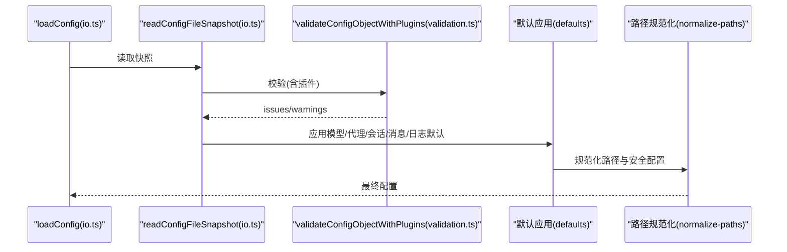

图表来源
- [src/config/io.ts](file://src/config/io.ts#L682-L818)
- [src/config/validation.ts](file://src/config/validation.ts#L288-L314)

### B. 配置写入与备份恢复流程（代码级时序）
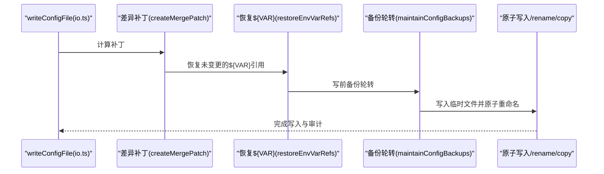

图表来源
- [src/config/io.ts](file://src/config/io.ts#L1036-L1277)
- [src/config/backup-rotation.ts](file://src/config/backup-rotation.ts#L115-L125)