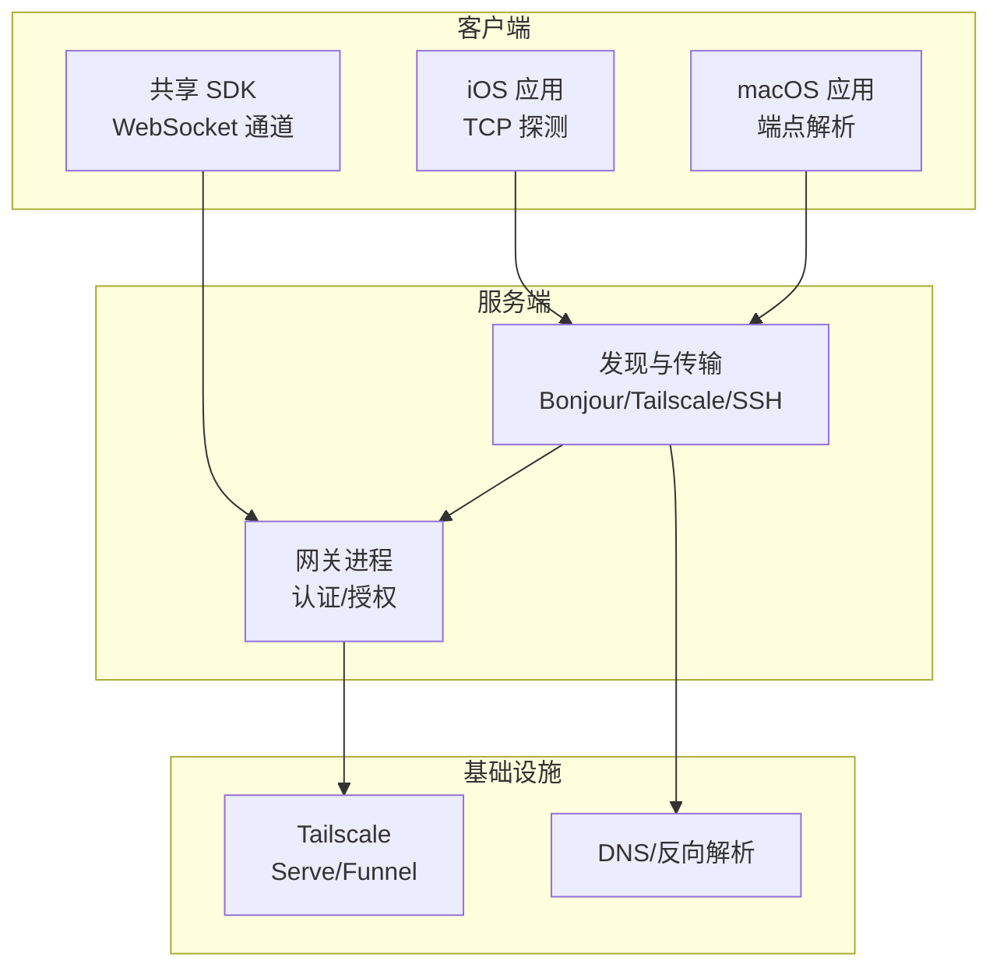
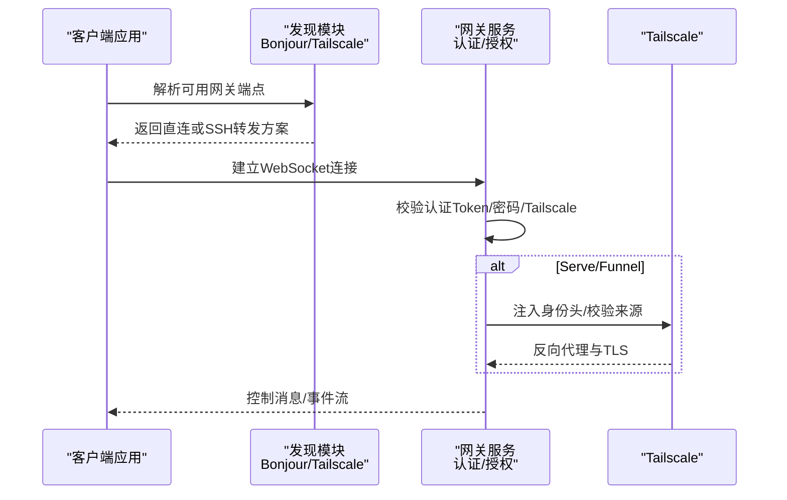
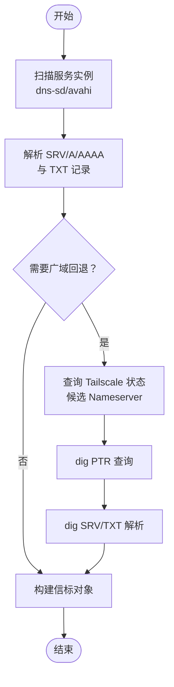
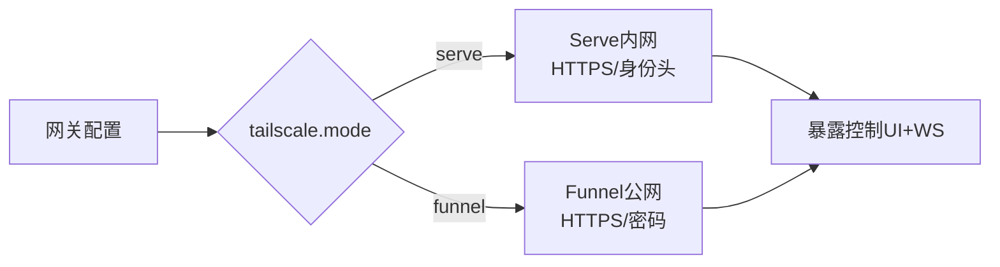
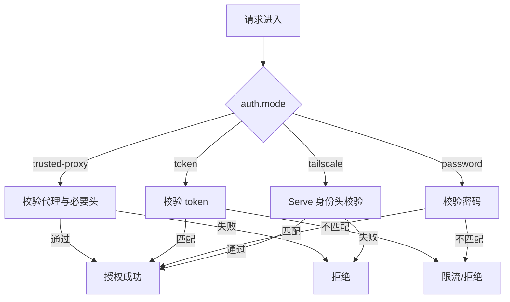
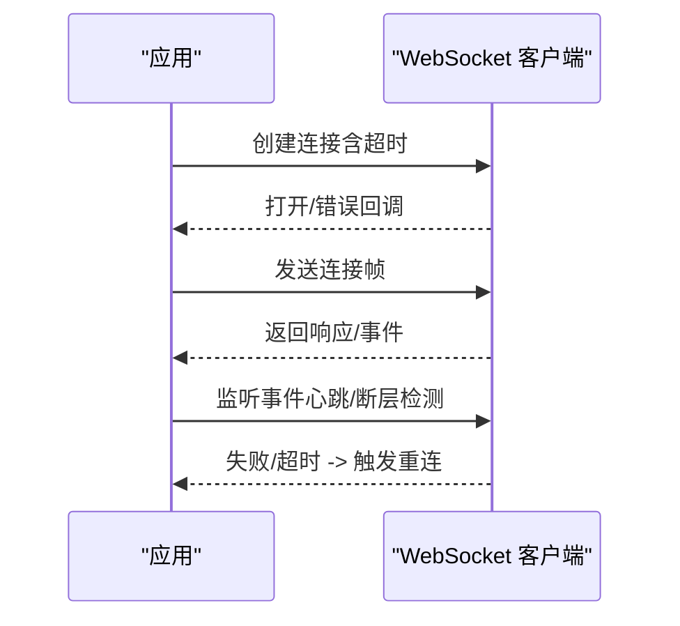
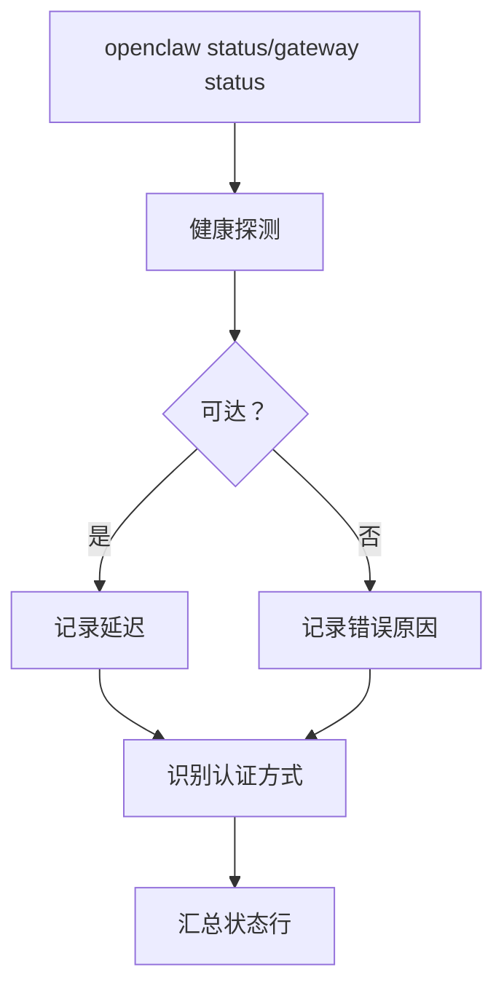
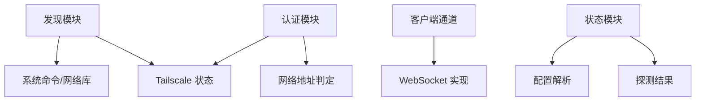

# 网络连接问题

<cite>
**本文引用的文件**
- [scripts/dev/gateway-ws-client.ts](file://scripts/dev/gateway-ws-client.ts)
- [src/infra/bonjour-discovery.ts](file://src/infra/bonjour-discovery.ts)
- [src/gateway/auth.ts](file://src/gateway/auth.ts)
- [src/config/validation.ts](file://src/config/validation.ts)
- [apps/ios/Sources/Gateway/TCPProbe.swift](file://apps/ios/Sources/Gateway/TCPProbe.swift)
- [apps/shared/OpenClawKit/Sources/OpenClawKit/GatewayChannel.swift](file://apps/shared/OpenClawKit/Sources/OpenClawKit/GatewayChannel.swift)
- [apps/macos/Sources/OpenClaw/GatewayEndpointStore.swift](file://apps/macos/Sources/OpenClaw/GatewayEndpointStore.swift)
- [apps/macos/Sources/OpenClawMacCLI/ConnectCommand.swift](file://apps/macos/Sources/OpenClawMacCLI/ConnectCommand.swift)
- [src/commands/status-all.ts](file://src/commands/status-all.ts)
- [docs/gateway/tailscale.md](file://docs/gateway/tailscale.md)
- [docs/gateway/troubleshooting.md](file://docs/gateway/troubleshooting.md)
- [docs/gateway/discovery.md](file://docs/gateway/discovery.md)
- [src/gateway/call.test.ts](file://src/gateway/call.test.ts)
</cite>

## 目录
1. [简介](#简介)
2. [项目结构](#项目结构)
3. [核心组件](#核心组件)
4. [架构总览](#架构总览)
5. [详细组件分析](#详细组件分析)
6. [依赖关系分析](#依赖关系分析)
7. [性能考量](#性能考量)
8. [故障排除指南](#故障排除指南)
9. [结论](#结论)
10. [附录](#附录)

## 简介
本指南聚焦于 OpenClaw 的网络连接问题，覆盖网关网络配置、连接建立流程、连接状态监控、Tailscale 集成、防火墙与端口策略、网络发现失败诊断、WebSocket 连接与 HTTP API 异常排查，以及远程网关连接失败的解决方案。文档同时提供跨平台（macOS、iOS、Linux）的连接测试工具与配置验证方法，并给出可操作的连通性检查清单与性能优化建议。

## 项目结构
围绕“网关网络连接”的关键代码分布在以下模块：
- 发现与传输：Bonjour/mDNS、Tailscale、SSH 转发
- 认证与授权：Token/密码/Tailscale 身份头/受信代理
- 客户端通道：WebSocket 客户端、连接等待与超时处理
- 命令行与状态：连接状态展示、健康探测
- 文档与示例：Tailscale 模式、排障步骤、发现协议说明

图表来源
- [src/infra/bonjour-discovery.ts](file://src/infra/bonjour-discovery.ts#L545-L591)
- [src/gateway/auth.ts](file://src/gateway/auth.ts#L367-L490)
- [apps/ios/Sources/Gateway/TCPProbe.swift](file://apps/ios/Sources/Gateway/TCPProbe.swift#L1-L42)
- [apps/shared/OpenClawKit/Sources/OpenClawKit/GatewayChannel.swift](file://apps/shared/OpenClawKit/Sources/OpenClawKit/GatewayChannel.swift#L256-L541)
- [apps/macos/Sources/OpenClaw/GatewayEndpointStore.swift](file://apps/macos/Sources/OpenClaw/GatewayEndpointStore.swift#L348-L371)
- [docs/gateway/tailscale.md](file://docs/gateway/tailscale.md#L1-L133)

章节来源
- [src/infra/bonjour-discovery.ts](file://src/infra/bonjour-discovery.ts#L1-L591)
- [src/gateway/auth.ts](file://src/gateway/auth.ts#L1-L491)
- [apps/ios/Sources/Gateway/TCPProbe.swift](file://apps/ios/Sources/Gateway/TCPProbe.swift#L1-L42)
- [apps/shared/OpenClawKit/Sources/OpenClawKit/GatewayChannel.swift](file://apps/shared/OpenClawKit/Sources/OpenClawKit/GatewayChannel.swift#L256-L541)
- [apps/macos/Sources/OpenClaw/GatewayEndpointStore.swift](file://apps/macos/Sources/OpenClaw/GatewayEndpointStore.swift#L348-L371)
- [docs/gateway/tailscale.md](file://docs/gateway/tailscale.md#L1-L133)

## 核心组件
- 网关认证与授权：支持 Token、密码、Tailscale 身份头、受信代理；控制 UI 与 HTTP API 的差异化鉴权面。
- Bonjour 发现：跨平台解析 mDNS/PTR/SRV/TXT，生成网关信标，支持广域回退。
- Tailscale 集成：Serve（仅内网）与 Funnel（公网），自动暴露网关控制 UI 与 WebSocket 端口。
- 客户端 WebSocket 通道：统一的连接、超时、事件处理与重连逻辑。
- 连接状态与健康探测：命令行输出连接可达性、延迟、认证方式等信息。
- 平台工具：iOS TCP 探针、macOS 端点解析与隧道确保、开发用 WebSocket 客户端。

章节来源
- [src/gateway/auth.ts](file://src/gateway/auth.ts#L367-L490)
- [src/infra/bonjour-discovery.ts](file://src/infra/bonjour-discovery.ts#L545-L591)
- [docs/gateway/tailscale.md](file://docs/gateway/tailscale.md#L1-L133)
- [apps/shared/OpenClawKit/Sources/OpenClawKit/GatewayChannel.swift](file://apps/shared/OpenClawKit/Sources/OpenClawKit/GatewayChannel.swift#L256-L541)
- [src/commands/status-all.ts](file://src/commands/status-all.ts#L238-L272)

## 架构总览
下图展示了从客户端到网关的典型连接路径，包括本地直连、Bonjour 发现、Tailscale 与 SSH 回退。

图表来源
- [src/infra/bonjour-discovery.ts](file://src/infra/bonjour-discovery.ts#L545-L591)
- [src/gateway/auth.ts](file://src/gateway/auth.ts#L367-L490)
- [docs/gateway/tailscale.md](file://docs/gateway/tailscale.md#L1-L133)

## 详细组件分析

### 组件A：Bonjour 发现与传输选择
- 功能要点
  - 支持 dns-sd（macOS）、avahi-browse（Linux）解析 _openclaw-gw._tcp 服务。
  - 解析 SRV/A/AAAA 与 TXT 记录，提取网关端口、TLS 指纹、MagicDNS 名称等。
  - 广域回退：通过 Tailscale 状态查询 IPv4 列表，使用 dig PTR/SRV/TXT 获取远端实例。
  - 传输选择策略：优先已配直连，其次局域网 Bonjour，再尝试 Tailnet，最后 SSH。
- 关键行为
  - Bonjour TXT 未认证，客户端应以解析出的服务端点为主，而非仅信任 TXT 字段。
  - TLS 指纹仅用于首次存储与后续比对，不得被 TXT 覆盖。

图表来源
- [src/infra/bonjour-discovery.ts](file://src/infra/bonjour-discovery.ts#L264-L440)

章节来源
- [src/infra/bonjour-discovery.ts](file://src/infra/bonjour-discovery.ts#L1-L591)
- [docs/gateway/discovery.md](file://docs/gateway/discovery.md#L1-L124)

### 组件B：Tailscale 集成（Serve/Funnel）
- 模式与约束
  - Serve：仅内网，HTTPS 由 Tailscale 提供，注入身份头；Funnel：公网 HTTPS，需密码模式。
  - Serve/Funnel 仅暴露“网关控制 UI + WebSocket”，节点通过同一 WS 端点接入。
  - Funnel 仅支持特定端口（443/8443/10000），且有版本与属性要求。
- 配置要点
  - 当 tailscale.mode=serve 且允许 Tailscale 时，控制 UI/WebSocket 可使用 Tailscale 身份头免密登录。
  - 若主机存在不受信任的本地代码，建议禁用 allowTailscale 或强制 token/password。
- CLI 示例
  - openclaw gateway --tailscale serve
  - openclaw gateway --tailscale funnel --auth password

图表来源
- [docs/gateway/tailscale.md](file://docs/gateway/tailscale.md#L1-L133)

章节来源
- [docs/gateway/tailscale.md](file://docs/gateway/tailscale.md#L1-L133)

### 组件C：认证与授权（Token/密码/Tailscale/受信代理）
- 授权面差异
  - HTTP API（如 /v1/*、/tools/invoke、/api/channels/*）始终需要 token/password。
  - WS 控制 UI 在允许 Serve 的前提下可使用 Tailscale 身份头免密。
- 核心流程
  - 受信代理：校验来源代理、必要头、用户头与白名单。
  - Tailscale：校验 loopback + 代理头 + whois 登录一致性。
  - Token/密码：严格比较，失败记录限流。
- 配置校验
  - 当 gateway.bind 非 loopback 且 tailscale.mode=serve/funnel 时，bind 必须为 loopback 或 custom 且为 127.0.0.1。

图表来源
- [src/gateway/auth.ts](file://src/gateway/auth.ts#L367-L490)
- [src/config/validation.ts](file://src/config/validation.ts#L198-L223)

章节来源
- [src/gateway/auth.ts](file://src/gateway/auth.ts#L1-L491)
- [src/config/validation.ts](file://src/config/validation.ts#L198-L223)

### 组件D：客户端 WebSocket 通道与连接管理
- 连接建立
  - 使用 URLSessionWebSocketTask 或 ws 客户端，设置握手/打开超时。
  - 成功后发送“连接”帧，等待响应；失败则抛出错误并触发重连。
- 超时与错误
  - 连接超时、解码失败、帧类型未知均视为连接失败。
  - 事件流中检测序列号断层，上报“缺失序号”提示。
- 开发工具
  - 提供脚本化的 ws 客户端，便于手动探测与调试。

图表来源
- [apps/shared/OpenClawKit/Sources/OpenClawKit/GatewayChannel.swift](file://apps/shared/OpenClawKit/Sources/OpenClawKit/GatewayChannel.swift#L256-L541)
- [scripts/dev/gateway-ws-client.ts](file://scripts/dev/gateway-ws-client.ts#L52-L132)

章节来源
- [apps/shared/OpenClawKit/Sources/OpenClawKit/GatewayChannel.swift](file://apps/shared/OpenClawKit/Sources/OpenClawKit/GatewayChannel.swift#L256-L541)
- [scripts/dev/gateway-ws-client.ts](file://scripts/dev/gateway-ws-client.ts#L1-L133)

### 组件E：连接状态监控与健康探测
- 命令行输出
  - 展示网关可达性、延迟、认证方式、自检信息（主机名/IP/版本/平台）。
- 探测细节
  - 将远程 URL 缺失时回退到本地连接目标，避免误判。
  - 对连接延迟进行精确格式化，辅助定位网络抖动。

图表来源
- [src/commands/status-all.ts](file://src/commands/status-all.ts#L238-L272)

章节来源
- [src/commands/status-all.ts](file://src/commands/status-all.ts#L238-L272)

## 依赖关系分析
- 发现模块依赖系统命令（dns-sd/avahi-browse/dig）与 Tailscale 状态查询。
- 认证模块依赖 Tailscale whois 与代理地址判定。
- 客户端通道依赖平台 WebSocket 实现与超时控制。
- 命令行状态模块依赖配置解析与探测结果聚合。

图表来源
- [src/infra/bonjour-discovery.ts](file://src/infra/bonjour-discovery.ts#L286-L440)
- [src/gateway/auth.ts](file://src/gateway/auth.ts#L108-L146)
- [apps/shared/OpenClawKit/Sources/OpenClawKit/GatewayChannel.swift](file://apps/shared/OpenClawKit/Sources/OpenClawKit/GatewayChannel.swift#L256-L541)
- [src/commands/status-all.ts](file://src/commands/status-all.ts#L238-L272)

章节来源
- [src/infra/bonjour-discovery.ts](file://src/infra/bonjour-discovery.ts#L1-L591)
- [src/gateway/auth.ts](file://src/gateway/auth.ts#L1-L491)
- [apps/shared/OpenClawKit/Sources/OpenClawKit/GatewayChannel.swift](file://apps/shared/OpenClawKit/Sources/OpenClawKit/GatewayChannel.swift#L256-L541)
- [src/commands/status-all.ts](file://src/commands/status-all.ts#L238-L272)

## 性能考量
- 发现阶段并发限制：广域回退使用有限并发与预算时间，避免阻塞。
- 连接超时与指数退避：客户端在连接失败时采用短退避，降低风暴效应。
- TLS 指纹缓存：首次确认后持久化指纹，减少后续握手成本。
- 限流与速率控制：认证失败按源 IP 限流，防止暴力破解。

章节来源
- [src/infra/bonjour-discovery.ts](file://src/infra/bonjour-discovery.ts#L324-L362)
- [apps/shared/OpenClawKit/Sources/OpenClawKit/GatewayChannel.swift](file://apps/shared/OpenClawKit/Sources/OpenClawKit/GatewayChannel.swift#L256-L541)
- [src/gateway/auth.ts](file://src/gateway/auth.ts#L404-L420)

## 故障排除指南

### 一、通用排障步骤
- 顺序执行
  - openclaw status
  - openclaw gateway status
  - openclaw logs --follow
  - openclaw doctor
  - openclaw channels status --probe
- 健康信号
  - 网关运行态为 running，RPC 探测为 ok。
  - doctor 无阻塞性问题。
  - 各通道连接正常。

章节来源
- [docs/gateway/troubleshooting.md](file://docs/gateway/troubleshooting.md#L14-L31)

### 二、Dashboard/控制 UI 连接问题
- 核查项
  - 正确的探针 URL 与控制 UI URL。
  - 客户端与网关的认证模式一致（token/password）。
  - 设备身份要求场景（非安全上下文或缺少设备认证）。
- 常见错误
  - 设备身份/随机数/签名相关错误：更新客户端并完成挑战-响应流程。
  - token/password 不匹配导致的“unauthorized”/重连循环。
  - 目标主机/端口错误导致的“gateway connect failed”。

章节来源
- [docs/gateway/troubleshooting.md](file://docs/gateway/troubleshooting.md#L91-L137)

### 三、服务未运行或端口冲突
- 现象
  - Runtime: stopped，带退出提示。
  - 配置与服务配置不一致。
  - 端口占用（另一个网关实例已在监听/EADDRINUSE）。
- 处理
  - 设置 gateway.mode=local 或通过 configure 启用本地模式。
  - 为非 loopback 绑定配置 token/password。
  - 更换端口或释放占用端口。

章节来源
- [docs/gateway/troubleshooting.md](file://docs/gateway/troubleshooting.md#L139-L167)

### 四、WebSocket 连接问题
- 现象
  - 连接超时、握手失败、解码失败、断线重连。
  - 事件流出现序列号断层。
- 诊断
  - 使用开发脚本创建 ws 客户端，设置合理超时，观察 open/err/message 流程。
  - 检查本地 loopback 绑定与远程直连/SSH 转发配置。
  - 单元测试覆盖了超时与关闭场景，可参考错误信息定位。

章节来源
- [scripts/dev/gateway-ws-client.ts](file://scripts/dev/gateway-ws-client.ts#L52-L132)
- [apps/shared/OpenClawKit/Sources/OpenClawKit/GatewayChannel.swift](file://apps/shared/OpenClawKit/Sources/OpenClawKit/GatewayChannel.swift#L256-L541)
- [src/gateway/call.test.ts](file://src/gateway/call.test.ts#L512-L552)

### 五、HTTP API 访问异常
- 现象
  - 401/403、权限不足、作用域缺失。
- 诊断
  - 确认 auth.mode 与 token/password 已正确配置。
  - 检查通道 API 权限与作用域授予情况。
  - 与控制 UI/WebSocket 的鉴权面不同，不要混用预期。

章节来源
- [src/gateway/auth.ts](file://src/gateway/auth.ts#L474-L490)
- [docs/gateway/troubleshooting.md](file://docs/gateway/troubleshooting.md#L169-L198)

### 六、远程网关连接失败
- 诊断
  - 确认 remote.url 是否存在且可解析。
  - 若使用 Tailscale Serve/Funnel，检查模式与端口限制。
  - 通过 TCP 探针验证端口连通性。
  - 端点解析与隧道确保：macOS 端点解析器会直接使用直连 URL 或确保隧道端口。
- 建议
  - 优先 Bonjour/LAN 直连；若不可用，使用 Tailscale；最后回退 SSH。
  - Funnel 场景避免浏览器控制，遵循“节点配对即操作员访问”的原则。

章节来源
- [apps/macos/Sources/OpenClawMacCLI/ConnectCommand.swift](file://apps/macos/Sources/OpenClawMacCLI/ConnectCommand.swift#L227-L258)
- [apps/macos/Sources/OpenClaw/GatewayEndpointStore.swift](file://apps/macos/Sources/OpenClaw/GatewayEndpointStore.swift#L348-L371)
- [apps/ios/Sources/Gateway/TCPProbe.swift](file://apps/ios/Sources/Gateway/TCPProbe.swift#L1-L42)
- [docs/gateway/discovery.md](file://docs/gateway/discovery.md#L86-L108)

### 七、Tailscale 集成问题
- 常见症状
  - Serve/Funnel 模式启动失败或被拒绝。
  - Funnel 端口不支持、版本过低、缺少属性。
- 处理
  - 确保 tailscale CLI 已安装并登录。
  - Funnel 模式必须使用密码认证。
  - Serve/Funnel 仅暴露控制 UI + WS，节点通过同一端点接入。

章节来源
- [docs/gateway/tailscale.md](file://docs/gateway/tailscale.md#L79-L133)

### 八、防火墙与端口冲突
- 现象
  - EADDRINUSE、无法绑定、端口不通。
- 处理
  - 检查 bind 模式与 auth 配置是否匹配（非 loopback 绑定需配置认证）。
  - 更改端口或释放占用。
  - 使用 TCP 探针验证端口可达性。

章节来源
- [src/config/validation.ts](file://src/config/validation.ts#L198-L223)
- [apps/ios/Sources/Gateway/TCPProbe.swift](file://apps/ios/Sources/Gateway/TCPProbe.swift#L1-L42)

### 九、网络发现失败
- 现象
  - Bonjour 无法发现网关，或 TXT 记录不可信。
- 处理
  - 确认 Bonjour 服务类型与 TXT 键值。
  - 广域回退依赖 Tailscale 状态与 dig 解析，检查网络与 DNS。
  - 仅以解析出的服务端点为准，不要仅依赖 TXT 字段。

章节来源
- [src/infra/bonjour-discovery.ts](file://src/infra/bonjour-discovery.ts#L545-L591)
- [docs/gateway/discovery.md](file://docs/gateway/discovery.md#L44-L98)

### 十、连通性检查清单
- 基础
  - openclaw status/gateway status 正常。
  - openclaw doctor 无阻塞性问题。
  - 通道状态为 connected/ready。
- 网络
  - Bonjour 可见网关，TXT 信息作为提示。
  - Tailscale 状态正常，Serve/Funnel 端口符合要求。
  - TCP 探针验证端口连通。
- 安全
  - 控制 UI/WebSocket 与 HTTP API 的认证模式一致。
  - Tailscale 身份头仅在允许 Serve 且来自 loopback 时生效。
- 客户端
  - WebSocket 客户端超时与错误日志。
  - 事件流无断层。

章节来源
- [docs/gateway/troubleshooting.md](file://docs/gateway/troubleshooting.md#L14-L31)
- [apps/ios/Sources/Gateway/TCPProbe.swift](file://apps/ios/Sources/Gateway/TCPProbe.swift#L1-L42)
- [src/gateway/auth.ts](file://src/gateway/auth.ts#L367-L490)

## 结论
OpenClaw 的网络连接体系以“本地网关 + 多路传输 + 多层认证”为核心，结合 Bonjour 发现、Tailscale Serve/Funnel 与 SSH 回退，实现跨平台、跨网络的稳定连接。排障时应优先核对配置（bind/auth/tailscale）、验证连通性（Bonjour/TCP 探针）、区分鉴权面（HTTP API vs WS 控制 UI），并结合命令行状态与日志进行定位。通过本文提供的检查清单与工具，可系统性地解决大多数网络连接问题。

## 附录
- 开发用 WebSocket 客户端：scripts/dev/gateway-ws-client.ts
- Bonjour 发现实现：src/infra/bonjour-discovery.ts
- 认证与授权：src/gateway/auth.ts
- Tailscale 集成说明：docs/gateway/tailscale.md
- 发现与传输说明：docs/gateway/discovery.md
- 网关排障手册：docs/gateway/troubleshooting.md